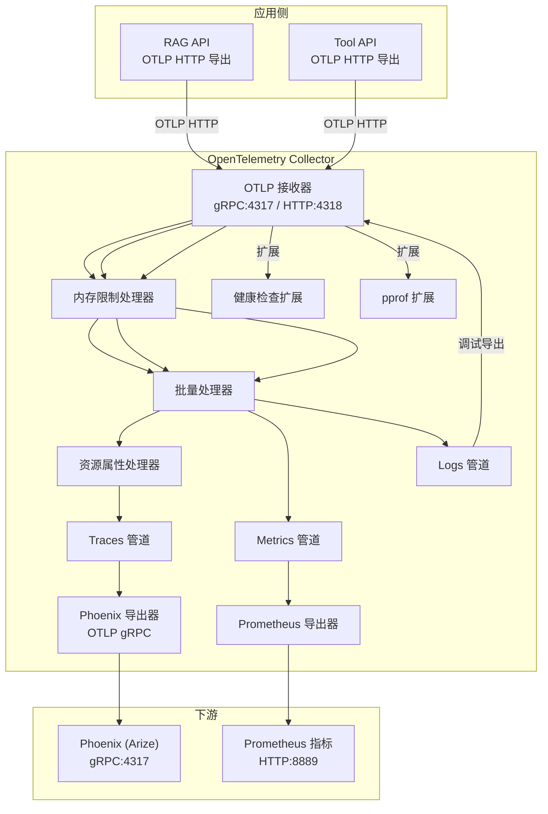
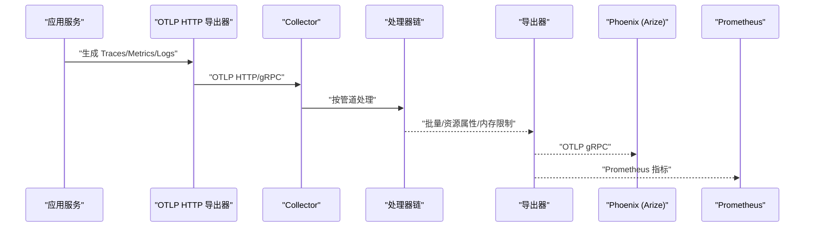
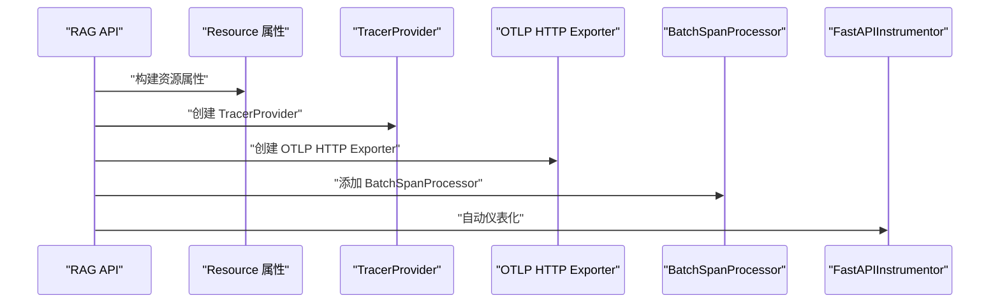
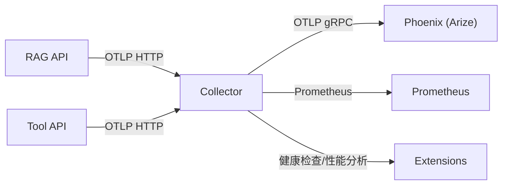

# OpenTelemetry 配置

<cite>
**本文引用的文件列表**
- [observability/otel/config.yaml](file://observability/otel/config.yaml)
- [infra/docker-compose.yml](file://infra/docker-compose.yml)
- [services/rag_api/app/config.py](file://services/rag_api/app/config.py)
- [services/rag_api/app/observability.py](file://services/rag_api/app/observability.py)
- [services/tool_api/app/config.py](file://services/tool_api/app/config.py)
- [analytics/metric_registry_v1.yml](file://analytics/metric_registry_v1.yml)
</cite>

## 目录
1. [简介](#简介)
2. [项目结构](#项目结构)
3. [核心组件](#核心组件)
4. [架构总览](#架构总览)
5. [组件详解](#组件详解)
6. [依赖关系分析](#依赖关系分析)
7. [性能考量](#性能考量)
8. [故障排除指南](#故障排除指南)
9. [结论](#结论)
10. [附录](#附录)

## 简介
本文件系统性梳理本仓库中 OpenTelemetry Collector 的配置与集成实践，重点覆盖以下方面：
- Collector 配置架构：接收器（receivers）、处理器（processors）、导出器（exporters）与管道（pipelines）的设计原则与组合方式
- OTLP 协议配置：gRPC 与 HTTP 端点设置及客户端导出端点
- 关键配置项：内存限制、批量处理、资源属性注入
- Phoenix（Arize）集成：AI 请求可观测性配置与数据流
- 健康检查、pprof 性能分析与 Prometheus 指标暴露
- 配置优化建议与常见问题排查

## 项目结构
本项目的可观测性由三部分组成：
- OpenTelemetry Collector：统一接收、处理与导出 traces/metrics/logs
- 应用侧 SDK 初始化：RAG API 与 Tool API 通过 OTLP 导出到 Collector
- Phoenix（Arize）：作为下游展示与分析平台，接收 Collector 的 OTLP gRPC 导出

图表来源
- [observability/otel/config.yaml:4-65](file://observability/otel/config.yaml#L4-L65)
- [infra/docker-compose.yml:227-261](file://infra/docker-compose.yml#L227-L261)
- [services/rag_api/app/observability.py:40-44](file://services/rag_api/app/observability.py#L40-L44)

章节来源
- [observability/otel/config.yaml:1-66](file://observability/otel/config.yaml#L1-L66)
- [infra/docker-compose.yml:227-261](file://infra/docker-compose.yml#L227-L261)

## 核心组件
- 接收器（receivers）
  - OTLP：同时启用 gRPC 与 HTTP 协议端点，分别用于高性能与兼容性场景
- 处理器（processors）
  - 批量处理器：聚合采样以降低网络开销
  - 资源属性处理器：统一注入环境与部署信息
  - 内存限制处理器：防止内存暴涨导致 OOM
- 导出器（exporters）
  - Phoenix（Arize）：OTLP gRPC 导出，用于 AI 请求可观测性
  - Prometheus：指标暴露端点，便于外部抓取
  - Debug：开发调试用，输出到 stdout
- 扩展（extensions）
  - 健康检查：提供健康探针端点
  - pprof：性能分析端点
- 管道（pipelines）
  - traces：接收 OTLP，经内存限制、批量、资源属性处理后，导出至 Phoenix 与 Debug
  - metrics：接收 OTLP，经内存限制、批量处理后，导出至 Prometheus 与 Debug
  - logs：接收 OTLP，经内存限制、批量处理后，导出至 Debug

章节来源
- [observability/otel/config.yaml:4-65](file://observability/otel/config.yaml#L4-L65)

## 架构总览
下图展示了从应用到 Collector，再到下游系统的完整数据流：

图表来源
- [observability/otel/config.yaml:4-65](file://observability/otel/config.yaml#L4-L65)
- [services/rag_api/app/observability.py:40-44](file://services/rag_api/app/observability.py#L40-L44)

## 组件详解

### 接收器（OTLP）
- gRPC 端点：0.0.0.0:4317
- HTTP 端点：0.0.0.0:4318
- 作用：统一接收来自各应用的 OTLP 数据，支持高吞吐与兼容性两种模式

章节来源
- [observability/otel/config.yaml:5-10](file://observability/otel/config.yaml#L5-L10)
- [infra/docker-compose.yml:235-238](file://infra/docker-compose.yml#L235-L238)

### 处理器（processors）
- 批量处理器（batch）
  - 超时：5 秒
  - 批大小：1000
  - 作用：合并小批次，降低网络开销与后端压力
- 资源属性处理器（resource）
  - 注入键值对：如部署环境等
  - 作用：统一标记数据来源与环境，便于后续过滤与聚合
- 内存限制处理器（memory_limiter）
  - 检查间隔：1 秒
  - 限制：512 MiB
  - 作用：防止单实例内存占用过高导致 OOM

章节来源
- [observability/otel/config.yaml:12-28](file://observability/otel/config.yaml#L12-L28)

### 导出器（exporters）
- Phoenix（Arize）导出器（otlp_grpc/phoenix）
  - 端点：phoenix:4317
  - TLS：不安全模式（开发环境）
  - 作用：将 traces 导出至 Phoenix，实现 AI 请求可观测性
- Prometheus 导出器（prometheus）
  - 端点：0.0.0.0:8889
  - 作用：暴露指标，供 Prometheus 抓取
- Debug 导出器（debug）
  - 详细级别：detailed
  - 作用：开发调试，输出到 stdout

章节来源
- [observability/otel/config.yaml:30-43](file://observability/otel/config.yaml#L30-L43)

### 扩展（extensions）
- 健康检查（health_check）
  - 端点：0.0.0.0:13133
  - 作用：提供健康探针，便于容器编排与运维监控
- pprof
  - 端点：0.0.0.0:1777
  - 作用：性能分析端点，便于定位热点与性能瓶颈

章节来源
- [observability/otel/config.yaml:45-49](file://observability/otel/config.yaml#L45-L49)

### 管道（pipelines）
- traces 管道
  - 接收：otlp
  - 处理：memory_limiter → batch → resource
  - 导出：otlp_grpc/phoenix（Phoenix），debug
- metrics 管道
  - 接收：otlp
  - 处理：memory_limiter → batch
  - 导出：prometheus，debug
- logs 管道
  - 接收：otlp
  - 处理：memory_limiter → batch
  - 导出：debug

章节来源
- [observability/otel/config.yaml:51-65](file://observability/otel/config.yaml#L51-L65)

### OTLP 协议配置
- 应用侧导出端点
  - RAG API：OTLP HTTP 端点默认指向本地 4318
  - Tool API：OTLP HTTP 端点默认指向本地 4318
- Collector 接收端点
  - gRPC：4317
  - HTTP：4318
- Phoenix 接收端点
  - gRPC：4317（容器内）

章节来源
- [services/rag_api/app/config.py:40-43](file://services/rag_api/app/config.py#L40-L43)
- [services/tool_api/app/config.py:8-9](file://services/tool_api/app/config.py#L8-L9)
- [observability/otel/config.yaml:7-10](file://observability/otel/config.yaml#L7-L10)
- [infra/docker-compose.yml:247-259](file://infra/docker-compose.yml#L247-L259)

### Phoenix（Arize）集成
- Collector 将 traces 导出至 Phoenix（otlp_grpc/phoenix）
- Phoenix 容器监听 gRPC 端口 4317，并映射到宿主机端口
- 该集成用于 AI 请求可观测性，便于追踪与分析 LLM/AI 相关调用

章节来源
- [observability/otel/config.yaml:31-35](file://observability/otel/config.yaml#L31-L35)
- [infra/docker-compose.yml:247-259](file://infra/docker-compose.yml#L247-L259)

### 健康检查、pprof 与 Prometheus 指标
- 健康检查：0.0.0.0:13133
- pprof：0.0.0.0:1777
- Prometheus：0.0.0.0:8889
- 以上端点均通过 Collector 扩展暴露，便于容器编排与外部监控系统对接

章节来源
- [observability/otel/config.yaml:45-49](file://observability/otel/config.yaml#L45-L49)
- [observability/otel/config.yaml:41-43](file://observability/otel/config.yaml#L41-L43)
- [infra/docker-compose.yml:235-238](file://infra/docker-compose.yml#L235-L238)

### 应用侧 OTel 初始化流程（RAG API）
- 资源属性：包含服务名、版本、环境、发布号等
- 导出器：OTLP HTTP，目标为 Collector 的 OTLP HTTP 端点
- 批处理：BatchSpanProcessor
- 仪表化：FastAPIInstrumentor 自动注入

图表来源
- [services/rag_api/app/observability.py:11-49](file://services/rag_api/app/observability.py#L11-L49)
- [services/rag_api/app/config.py:40-43](file://services/rag_api/app/config.py#L40-L43)

章节来源
- [services/rag_api/app/observability.py:11-49](file://services/rag_api/app/observability.py#L11-L49)
- [services/rag_api/app/config.py:40-43](file://services/rag_api/app/config.py#L40-L43)

## 依赖关系分析
- 应用侧依赖
  - RAG API 与 Tool API 通过 OTLP HTTP 将数据导出至 Collector
  - Collector 作为统一入口，负责处理与转发
- 下游依赖
  - Phoenix（Arize）通过 OTLP gRPC 接收 traces
  - Prometheus 通过 HTTP 抓取指标
- 容器编排
  - Collector 映射端口：4317（gRPC）、4318（HTTP）、8889（Prometheus）
  - Phoenix 映射端口：6006（Web UI）、4317（gRPC）

图表来源
- [observability/otel/config.yaml:4-65](file://observability/otel/config.yaml#L4-L65)
- [infra/docker-compose.yml:227-261](file://infra/docker-compose.yml#L227-L261)

章节来源
- [observability/otel/config.yaml:4-65](file://observability/otel/config.yaml#L4-L65)
- [infra/docker-compose.yml:227-261](file://infra/docker-compose.yml#L227-L261)

## 性能考量
- 批量处理
  - 合理设置超时与批大小，平衡延迟与吞吐
  - 建议根据后端能力与网络状况调整
- 内存限制
  - 设置合理的检查间隔与上限，避免 OOM
  - 生产环境建议结合实际负载评估
- 资源属性
  - 统一注入环境与版本信息，便于后续查询与告警
- 导出器选择
  - Phoenix 使用 gRPC，适合高吞吐场景
  - Prometheus 指标暴露端点需确保网络可达与抓取频率合理

[本节为通用性能建议，无需特定文件来源]

## 故障排除指南
- 无法连接 Collector
  - 检查应用侧 OTLP 端点是否正确指向 Collector
  - 确认容器网络与端口映射是否生效
- traces 未到达 Phoenix
  - 确认 Collector traces 管道已启用 Phoenix 导出器
  - 检查 Phoenix 容器状态与端口映射
- 指标未被 Prometheus 抓取
  - 确认 Prometheus 抓取地址与端口
  - 检查 Collector 的 Prometheus 导出器配置
- 性能问题
  - 调整批量处理器参数
  - 检查内存限制阈值与检查间隔
  - 使用 pprof 端点进行性能分析
- 健康检查失败
  - 检查健康检查扩展端点是否可达
  - 查看 Collector 日志定位问题

章节来源
- [observability/otel/config.yaml:45-49](file://observability/otel/config.yaml#L45-L49)
- [observability/otel/config.yaml:41-43](file://observability/otel/config.yaml#L41-L43)
- [infra/docker-compose.yml:235-238](file://infra/docker-compose.yml#L235-L238)

## 结论
本仓库的 OpenTelemetry 配置采用“集中式收集 + 分层处理 + 多出口”的架构，既满足了 AI 请求可观测性（Phoenix），也兼顾了指标暴露（Prometheus）。通过批量处理与内存限制，有效降低了网络与资源压力；通过健康检查与 pprof 扩展，提升了可观测性与可维护性。建议在生产环境中结合实际负载与后端能力，持续优化批量参数与内存阈值，并完善告警与日志策略。

[本节为总结性内容，无需特定文件来源]

## 附录

### 配置要点速查
- 接收器
  - OTLP gRPC：0.0.0.0:4317
  - OTLP HTTP：0.0.0.0:4318
- 处理器
  - 批量：超时 5s，批大小 1000
  - 资源属性：统一注入环境与部署信息
  - 内存限制：检查间隔 1s，上限 512 MiB
- 导出器
  - Phoenix：otlp_grpc/phoenix，端点 phoenix:4317，TLS 不安全
  - Prometheus：0.0.0.0:8889
  - Debug：详细级别
- 扩展
  - 健康检查：0.0.0.0:13133
  - pprof：0.0.0.0:1777
- 管道
  - traces：memory_limiter → batch → resource → Phoenix + debug
  - metrics：memory_limiter → batch → Prometheus + debug
  - logs：memory_limiter → batch → debug

章节来源
- [observability/otel/config.yaml:4-65](file://observability/otel/config.yaml#L4-L65)

### 应用侧 OTLP 端点参考
- RAG API：OTLP HTTP 端点默认指向本地 4318
- Tool API：OTLP HTTP 端点默认指向本地 4318

章节来源
- [services/rag_api/app/config.py:40-43](file://services/rag_api/app/config.py#L40-L43)
- [services/tool_api/app/config.py:8-9](file://services/tool_api/app/config.py#L8-L9)

### 指标注册表（KPI 查询）
- 指标注册表定义了允许的角色、维度、过滤条件与最大窗口天数
- 用于 Tool API 的 KPI 查询接口进行请求合法性校验

章节来源
- [analytics/metric_registry_v1.yml:1-56](file://analytics/metric_registry_v1.yml#L1-L56)