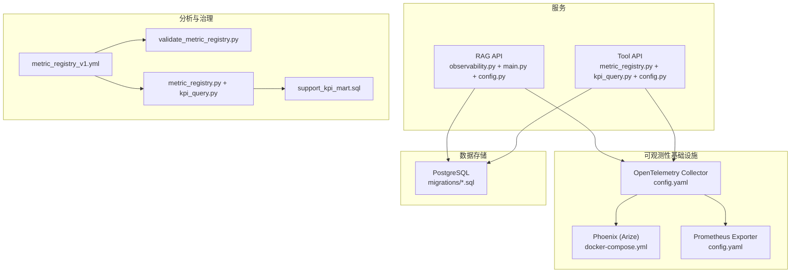
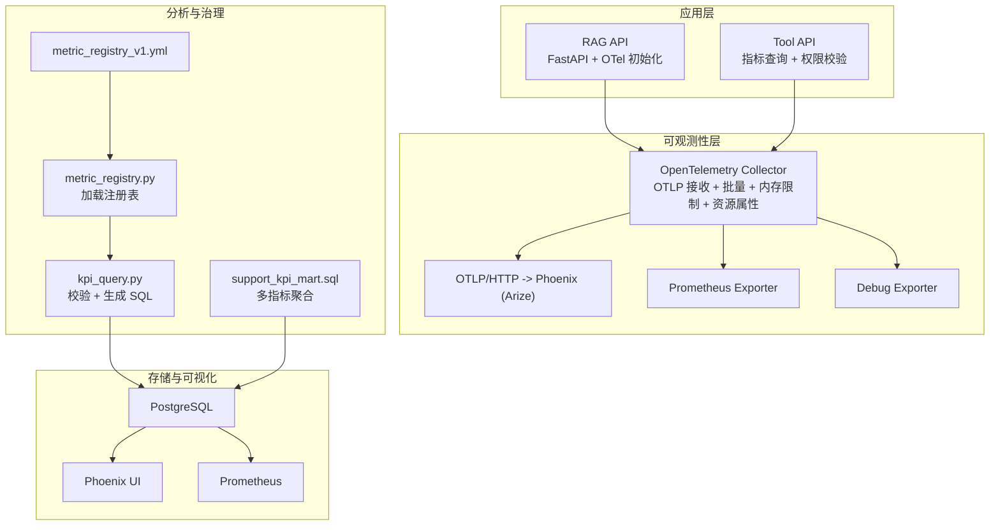
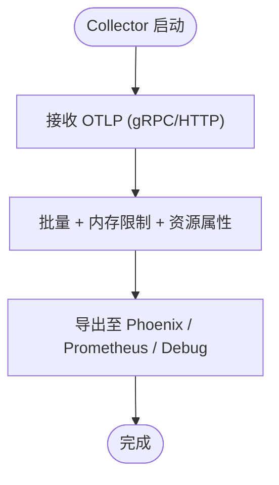
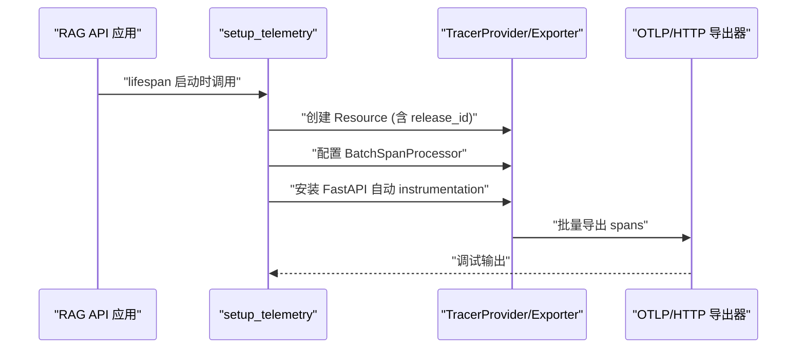
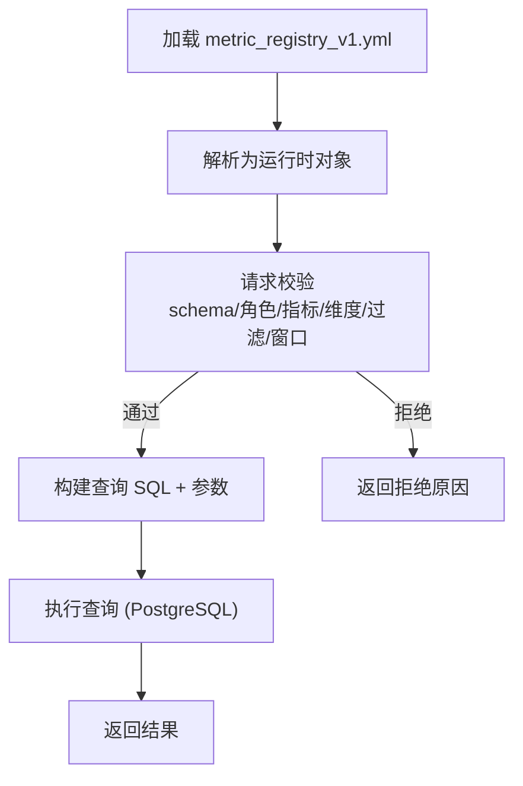
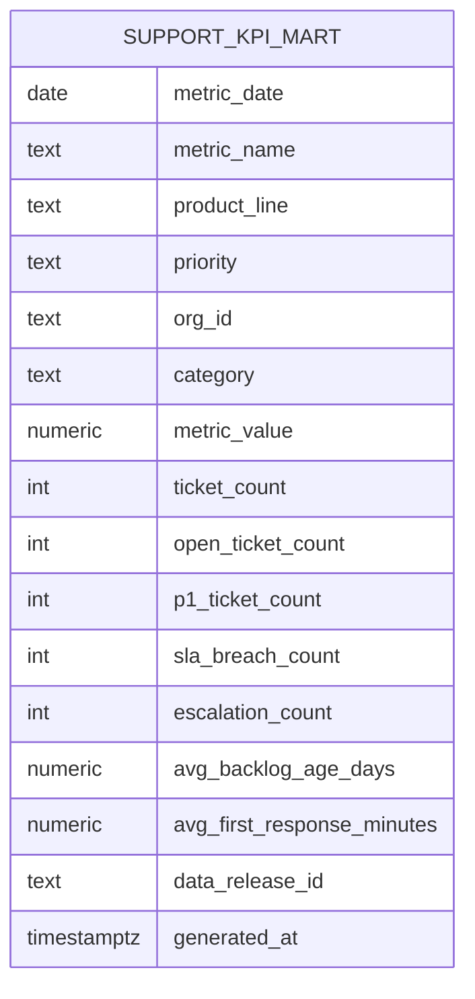
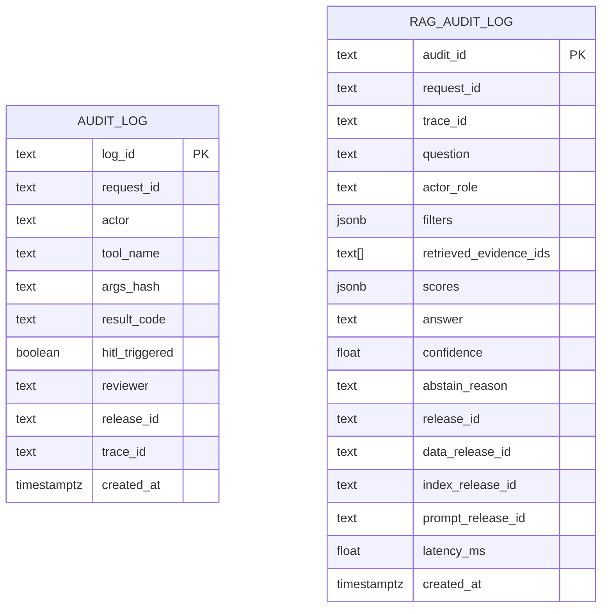
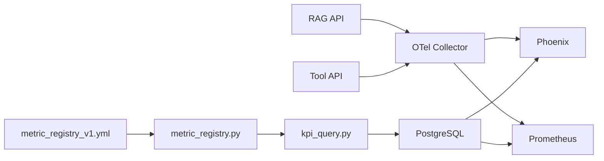

# 可观测性与监控

<cite>
**本文引用的文件**
- [observability/otel/config.yaml](file://observability/otel/config.yaml)
- [services/rag_api/app/observability.py](file://services/rag_api/app/observability.py)
- [services/rag_api/app/main.py](file://services/rag_api/app/main.py)
- [services/rag_api/app/config.py](file://services/rag_api/app/config.py)
- [services/tool_api/app/config.py](file://services/tool_api/app/config.py)
- [services/tool_api/app/metric_registry.py](file://services/tool_api/app/metric_registry.py)
- [services/tool_api/app/kpi_query.py](file://services/tool_api/app/kpi_query.py)
- [analytics/metric_registry_v1.yml](file://analytics/metric_registry_v1.yml)
- [analytics/scripts/validate_metric_registry.py](file://analytics/scripts/validate_metric_registry.py)
- [analytics/models/marts/support_kpi_mart.sql](file://analytics/models/marts/support_kpi_mart.sql)
- [infra/docker-compose.yml](file://infra/docker-compose.yml)
- [infra/migrations/001_init.sql](file://infra/migrations/001_init.sql)
- [infra/migrations/003_week08_index_rag.sql](file://infra/migrations/003_week08_index_rag.sql)
- [services/rag_api/app/audit.py](file://services/rag_api/app/audit.py)
- [tests/integration/test_week8_rag_audit.py](file://tests/integration/test_week8_rag_audit.py)
- [contracts/tools/tools/query_support_kpis_v1.json](file://contracts/tools/tools/query_support_kpis_v1.json)
- [docs/blueprints/week04/perf_baseline_template.md](file://docs/blueprints/week04/perf_baseline_template.md)
</cite>

## 目录
1. [简介](#简介)
2. [项目结构](#项目结构)
3. [核心组件](#核心组件)
4. [架构总览](#架构总览)
5. [详细组件分析](#详细组件分析)
6. [依赖分析](#依赖分析)
7. [性能考量](#性能考量)
8. [故障排查指南](#故障排查指南)
9. [结论](#结论)
10. [附录](#附录)

## 简介
本文件系统化梳理 OmniSupport Copilot 的可观测性与监控体系，围绕 OpenTelemetry 统一追踪与监控展开，覆盖追踪配置、指标收集、日志管理与 Phoenix 集成；阐释分布式追踪设计理念（trace_id 与 release_id 的使用策略）；给出性能监控实现（响应时间、吞吐量、错误率、资源使用）与指标定义、阈值与告警机制建议；提供性能基线、瓶颈分析与优化方法，并说明如何扩展监控范围、添加自定义指标与集成第三方监控工具。

## 项目结构
可观测性相关模块主要分布在以下位置：
- OpenTelemetry 收集器配置：observability/otel/config.yaml
- RAG API 可观测性初始化：services/rag_api/app/observability.py
- 服务入口与生命周期钩子：services/rag_api/app/main.py
- 应用配置（OTel、release_id 等）：services/rag_api/app/config.py、services/tool_api/app/config.py
- 工具 API 指标注册表加载与查询：services/tool_api/app/metric_registry.py、services/tool_api/app/kpi_query.py
- 指标注册表契约与校验：analytics/metric_registry_v1.yml、analytics/scripts/validate_metric_registry.py
- 指标数据模型（mart）：analytics/models/marts/support_kpi_mart.sql
- 运维编排与 Phoenix 集成：infra/docker-compose.yml
- 审计日志与数据库迁移：services/rag_api/app/audit.py、infra/migrations/*.sql
- 合约与限流：contracts/tools/tools/query_support_kpis_v1.json
- 性能基线模板：docs/blueprints/week04/perf_baseline_template.md

图表来源
- [observability/otel/config.yaml:1-66](file://observability/otel/config.yaml#L1-L66)
- [services/rag_api/app/observability.py:11-55](file://services/rag_api/app/observability.py#L11-L55)
- [services/rag_api/app/main.py:19-33](file://services/rag_api/app/main.py#L19-L33)
- [services/rag_api/app/config.py:34-43](file://services/rag_api/app/config.py#L34-L43)
- [services/tool_api/app/config.py:7-11](file://services/tool_api/app/config.py#L7-L11)
- [services/tool_api/app/metric_registry.py:35-66](file://services/tool_api/app/metric_registry.py#L35-L66)
- [services/tool_api/app/kpi_query.py:106-174](file://services/tool_api/app/kpi_query.py#L106-L174)
- [analytics/metric_registry_v1.yml:1-56](file://analytics/metric_registry_v1.yml#L1-L56)
- [analytics/scripts/validate_metric_registry.py:29-108](file://analytics/scripts/validate_metric_registry.py#L29-L108)
- [analytics/models/marts/support_kpi_mart.sql:132-149](file://analytics/models/marts/support_kpi_mart.sql#L132-L149)
- [infra/docker-compose.yml:244-261](file://infra/docker-compose.yml#L244-L261)
- [infra/migrations/001_init.sql:217-237](file://infra/migrations/001_init.sql#L217-L237)
- [infra/migrations/003_week08_index_rag.sql:47-65](file://infra/migrations/003_week08_index_rag.sql#L47-L65)

章节来源
- [observability/otel/config.yaml:1-66](file://observability/otel/config.yaml#L1-L66)
- [services/rag_api/app/observability.py:11-55](file://services/rag_api/app/observability.py#L11-L55)
- [services/rag_api/app/main.py:19-33](file://services/rag_api/app/main.py#L19-L33)
- [services/rag_api/app/config.py:34-43](file://services/rag_api/app/config.py#L34-L43)
- [services/tool_api/app/config.py:7-11](file://services/tool_api/app/config.py#L7-L11)
- [services/tool_api/app/metric_registry.py:35-66](file://services/tool_api/app/metric_registry.py#L35-L66)
- [services/tool_api/app/kpi_query.py:106-174](file://services/tool_api/app/kpi_query.py#L106-L174)
- [analytics/metric_registry_v1.yml:1-56](file://analytics/metric_registry_v1.yml#L1-L56)
- [analytics/scripts/validate_metric_registry.py:29-108](file://analytics/scripts/validate_metric_registry.py#L29-L108)
- [analytics/models/marts/support_kpi_mart.sql:132-149](file://analytics/models/marts/support_kpi_mart.sql#L132-L149)
- [infra/docker-compose.yml:244-261](file://infra/docker-compose.yml#L244-L261)
- [infra/migrations/001_init.sql:217-237](file://infra/migrations/001_init.sql#L217-L237)
- [infra/migrations/003_week08_index_rag.sql:47-65](file://infra/migrations/003_week08_index_rag.sql#L47-L65)

## 核心组件
- OpenTelemetry 收集器与导出管线
  - 接收 OTLP（gRPC/HTTP），批量处理器、内存限制、资源属性注入，导出至 Phoenix 与 Prometheus，同时保留调试输出。
- RAG API 可观测性初始化
  - 通过配置注入服务名、版本、环境与 release_id，启用 FastAPI 自动 instrumentation，使用 OTLP HTTP 导出器上报。
- 指标注册表与查询
  - 以 YAML 契约定义可查询指标、维度、过滤条件与角色权限；Python 加载器解析为运行时对象；查询器进行输入校验、权限与窗口校验后生成 SQL。
- 分析层指标模型
  - 将日级事实聚合为多指标行，统一输出 metric_name、metric_value、维度与 data_release_id 字段，便于查询与可视化。
- 审计与日志
  - 审计日志表记录请求/追踪标识、问题、证据、答案、置信度、延迟等，支撑回放与复盘。
- 运维编排与集成
  - docker-compose 启动 Phoenix 并与 Collector 关联，暴露 UI 与 gRPC 端口。

章节来源
- [observability/otel/config.yaml:4-66](file://observability/otel/config.yaml#L4-L66)
- [services/rag_api/app/observability.py:11-55](file://services/rag_api/app/observability.py#L11-L55)
- [services/tool_api/app/metric_registry.py:35-66](file://services/tool_api/app/metric_registry.py#L35-L66)
- [services/tool_api/app/kpi_query.py:106-174](file://services/tool_api/app/kpi_query.py#L106-L174)
- [analytics/metric_registry_v1.yml:25-56](file://analytics/metric_registry_v1.yml#L25-L56)
- [analytics/models/marts/support_kpi_mart.sql:132-149](file://analytics/models/marts/support_kpi_mart.sql#L132-L149)
- [infra/docker-compose.yml:244-261](file://infra/docker-compose.yml#L244-L261)

## 架构总览
下图展示从服务到收集器再到 Phoenix 与 Prometheus 的完整链路，以及指标注册表与分析层的协作关系。

图表来源
- [observability/otel/config.yaml:4-66](file://observability/otel/config.yaml#L4-L66)
- [services/rag_api/app/observability.py:11-55](file://services/rag_api/app/observability.py#L11-L55)
- [services/tool_api/app/metric_registry.py:35-66](file://services/tool_api/app/metric_registry.py#L35-L66)
- [services/tool_api/app/kpi_query.py:106-174](file://services/tool_api/app/kpi_query.py#L106-L174)
- [analytics/metric_registry_v1.yml:1-56](file://analytics/metric_registry_v1.yml#L1-L56)
- [analytics/models/marts/support_kpi_mart.sql:132-149](file://analytics/models/marts/support_kpi_mart.sql#L132-L149)
- [infra/docker-compose.yml:244-261](file://infra/docker-compose.yml#L244-L261)

## 详细组件分析

### OpenTelemetry 收集器与导出管线
- 接收协议：gRPC/HTTP（OTLP），便于与 Phoenix 和其他 OTel 后端兼容。
- 处理器：批量发送降低网络开销；内存限制防止 OOM；资源属性注入部署环境。
- 导出器：Phoenix（OTLP/GRPC）、Prometheus（暴露端点）、调试输出。
- 扩展：健康检查与 pprof 端点便于运维诊断。

图表来源
- [observability/otel/config.yaml:4-66](file://observability/otel/config.yaml#L4-L66)

章节来源
- [observability/otel/config.yaml:4-66](file://observability/otel/config.yaml#L4-L66)

### RAG API 可观测性初始化
- 资源属性：服务名、版本、环境、release_id。
- 导出器：OTLP HTTP，端点来自配置。
- 自动 instrumentation：对 FastAPI 的自动追踪。
- 异常处理：依赖导入失败或初始化异常的降级日志。

图表来源
- [services/rag_api/app/observability.py:11-55](file://services/rag_api/app/observability.py#L11-L55)
- [services/rag_api/app/main.py:19-33](file://services/rag_api/app/main.py#L19-L33)
- [services/rag_api/app/config.py:34-43](file://services/rag_api/app/config.py#L34-L43)

章节来源
- [services/rag_api/app/observability.py:11-55](file://services/rag_api/app/observability.py#L11-L55)
- [services/rag_api/app/main.py:19-33](file://services/rag_api/app/main.py#L19-L33)
- [services/rag_api/app/config.py:34-43](file://services/rag_api/app/config.py#L34-L43)

### 指标注册表与查询
- 注册表契约：定义 registry_id、source_model、safe_view、时间维度、度量列、最大窗口天数、允许维度/过滤/角色与具体指标。
- Python 加载器：将 YAML 解析为运行时对象，包含指标定义与权限集合。
- 查询器校验：schema 校验、角色权限、指标与维度/过滤白名单、日期窗口大小限制。
- 生成 SQL：按输出列构建查询，拼接 where 条件与排序/限制。

图表来源
- [analytics/metric_registry_v1.yml:1-56](file://analytics/metric_registry_v1.yml#L1-L56)
- [services/tool_api/app/metric_registry.py:35-66](file://services/tool_api/app/metric_registry.py#L35-L66)
- [services/tool_api/app/kpi_query.py:106-174](file://services/tool_api/app/kpi_query.py#L106-L174)

章节来源
- [analytics/metric_registry_v1.yml:1-56](file://analytics/metric_registry_v1.yml#L1-L56)
- [services/tool_api/app/metric_registry.py:35-66](file://services/tool_api/app/metric_registry.py#L35-L66)
- [services/tool_api/app/kpi_query.py:106-174](file://services/tool_api/app/kpi_query.py#L106-L174)

### 分析层指标模型
- 将每日事实聚合为多指标行，统一输出 metric_name、metric_value、维度与 data_release_id。
- 便于后续查询与可视化，支持不同聚合类型（sum/avg/min/max）。

图表来源
- [analytics/models/marts/support_kpi_mart.sql:132-149](file://analytics/models/marts/support_kpi_mart.sql#L132-L149)

章节来源
- [analytics/models/marts/support_kpi_mart.sql:132-149](file://analytics/models/marts/support_kpi_mart.sql#L132-L149)

### 审计与日志
- 审计日志表包含 request_id、trace_id、问题、证据、答案、置信度、延迟等字段，支撑回放与复盘。
- 测试覆盖了写入字段（含 release_id、index_release_id、prompt_release_id、scores 等）。

图表来源
- [infra/migrations/001_init.sql:217-237](file://infra/migrations/001_init.sql#L217-L237)
- [infra/migrations/003_week08_index_rag.sql:47-65](file://infra/migrations/003_week08_index_rag.sql#L47-L65)
- [services/rag_api/app/audit.py:21-69](file://services/rag_api/app/audit.py#L21-L69)
- [tests/integration/test_week8_rag_audit.py:20-51](file://tests/integration/test_week8_rag_audit.py#L20-L51)

章节来源
- [infra/migrations/001_init.sql:217-237](file://infra/migrations/001_init.sql#L217-L237)
- [infra/migrations/003_week08_index_rag.sql:47-65](file://infra/migrations/003_week08_index_rag.sql#L47-L65)
- [services/rag_api/app/audit.py:21-69](file://services/rag_api/app/audit.py#L21-L69)
- [tests/integration/test_week8_rag_audit.py:20-51](file://tests/integration/test_week8_rag_audit.py#L20-L51)

### Phoenix 集成与 UI
- docker-compose 启动 Phoenix 容器，映射 UI 端口与 gRPC 端口，依赖 OpenTelemetry Collector。
- Collector 将 traces 导出至 Phoenix，用于 AI 请求可观测与坏案例回放。

章节来源
- [infra/docker-compose.yml:244-261](file://infra/docker-compose.yml#L244-L261)
- [observability/otel/config.yaml:30-40](file://observability/otel/config.yaml#L30-L40)

## 依赖分析
- 服务到收集器：RAG API 与 Tool API 通过 OTLP HTTP/GRPC 上报追踪与指标。
- 收集器到导出器：Phoenix（Arize）用于 AI 请求可观测；Prometheus 暴露指标；调试输出辅助开发。
- 注册表到查询：YAML 注册表经加载器解析，查询器进行严格校验后访问分析层 mart。
- 存储：PostgreSQL 承载审计日志与分析数据，Phoenix 与 Prometheus 读取分析层数据。

图表来源
- [observability/otel/config.yaml:4-66](file://observability/otel/config.yaml#L4-L66)
- [services/rag_api/app/observability.py:11-55](file://services/rag_api/app/observability.py#L11-L55)
- [services/tool_api/app/metric_registry.py:35-66](file://services/tool_api/app/metric_registry.py#L35-L66)
- [services/tool_api/app/kpi_query.py:106-174](file://services/tool_api/app/kpi_query.py#L106-L174)
- [analytics/metric_registry_v1.yml:1-56](file://analytics/metric_registry_v1.yml#L1-L56)
- [infra/docker-compose.yml:244-261](file://infra/docker-compose.yml#L244-L261)

章节来源
- [observability/otel/config.yaml:4-66](file://observability/otel/config.yaml#L4-L66)
- [services/rag_api/app/observability.py:11-55](file://services/rag_api/app/observability.py#L11-L55)
- [services/tool_api/app/metric_registry.py:35-66](file://services/tool_api/app/metric_registry.py#L35-L66)
- [services/tool_api/app/kpi_query.py:106-174](file://services/tool_api/app/kpi_query.py#L106-L174)
- [analytics/metric_registry_v1.yml:1-56](file://analytics/metric_registry_v1.yml#L1-L56)
- [infra/docker-compose.yml:244-261](file://infra/docker-compose.yml#L244-L261)

## 性能考量
- 响应时间监控
  - 在审计日志中记录 latency_ms，结合 Phoenix 可视化端到端耗时。
  - 在查询器中记录查询耗时，用于定位慢查询。
- 吞吐量统计
  - 通过 Prometheus 暴露的指标与 Collector 的批量导出统计每秒/分钟请求数。
- 错误率跟踪
  - 全局异常处理器在响应中携带 release_id 与 request_id，便于聚合错误事件。
- 资源使用监控
  - Collector 内存限制避免 OOM；Prometheus 暴露 Collector 自身指标（CPU/内存/队列长度）。
- 性能基线与回归
  - 使用性能基线模板生成当前快照，后续对比 delta，识别回归。
- 瓶颈分析与优化
  - 结合 Phoenix 的 span 层级分析检索/生成链路；利用查询器 SQL 与分析层 mart 的聚合路径定位热点。

章节来源
- [services/rag_api/app/audit.py:21-69](file://services/rag_api/app/audit.py#L21-L69)
- [services/tool_api/app/kpi_query.py:169-197](file://services/tool_api/app/kpi_query.py#L169-L197)
- [observability/otel/config.yaml:12-29](file://observability/otel/config.yaml#L12-L29)
- [docs/blueprints/week04/perf_baseline_template.md:1-22](file://docs/blueprints/week04/perf_baseline_template.md#L1-L22)

## 故障排查指南
- OTel 初始化失败
  - 检查依赖是否安装、配置项 otel_enabled 与 otel_exporter_otlp_endpoint 是否正确。
  - 查看日志中的警告/错误信息，确认资源属性注入与 FastAPI instrumentation 是否生效。
- Phoenix 无法接收数据
  - 确认 Collector 到 Phoenix 的 gRPC 端口连通性与 TLS 配置。
  - 检查 Collector traces 管线是否包含 Phoenix 导出器。
- 指标查询被拒绝
  - 校验请求角色是否在注册表 allowed_roles 内；指标名称是否在注册表 metrics 中且角色允许。
  - 检查维度/过滤字段是否在 allowed_dimensions/allowed_filters 白名单内。
  - 确认日期窗口不超过 max_window_days。
- 审计日志写入失败
  - 检查数据库连接与表结构；测试用例覆盖了关键字段写入逻辑，可参考断言。

章节来源
- [services/rag_api/app/observability.py:51-55](file://services/rag_api/app/observability.py#L51-L55)
- [observability/otel/config.yaml:30-40](file://observability/otel/config.yaml#L30-L40)
- [services/tool_api/app/kpi_query.py:106-174](file://services/tool_api/app/kpi_query.py#L106-L174)
- [services/rag_api/app/audit.py:69](file://services/rag_api/app/audit.py#L69)

## 结论
本项目以 OpenTelemetry 为核心，结合 Phoenix 实现 AI 请求可观测与坏案例回放，辅以 Prometheus 指标暴露与严格的指标注册表治理，形成“采集—处理—导出—治理—可视化”的闭环。通过 release_id 与 trace_id 的统一注入，实现了跨服务的端到端追踪与版本关联；通过审计日志与分析层 mart，支撑性能与质量的持续监控与回归分析。建议在生产环境中完善告警阈值与自动化流程，并持续扩展指标覆盖面与第三方工具集成。

## 附录
- 指标注册表校验脚本
  - 用于验证注册表字段完整性、安全列白名单、聚合类型与角色权限一致性。
- 限流与合约
  - 工具接口合约定义了限流参数与拒绝原因，便于边界控制与告警联动。
- 运维端口
  - Collector 健康检查与 pprof 端口可用于诊断；Phoenix UI 端口映射便于查看 traces。

章节来源
- [analytics/scripts/validate_metric_registry.py:29-108](file://analytics/scripts/validate_metric_registry.py#L29-L108)
- [contracts/tools/tools/query_support_kpis_v1.json:121-134](file://contracts/tools/tools/query_support_kpis_v1.json#L121-L134)
- [observability/otel/config.yaml:45-50](file://observability/otel/config.yaml#L45-L50)
- [infra/docker-compose.yml:254-255](file://infra/docker-compose.yml#L254-L255)