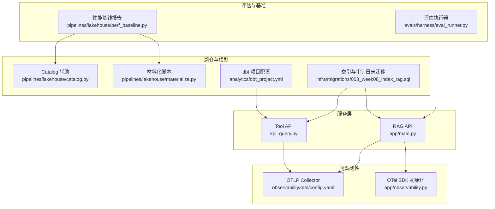
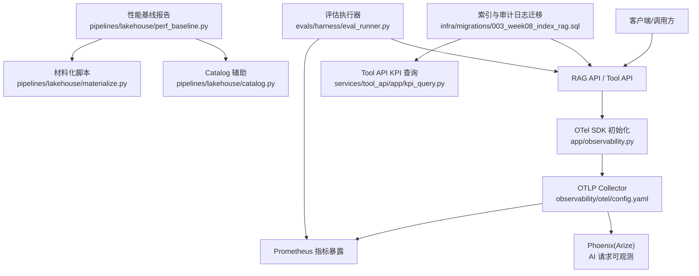
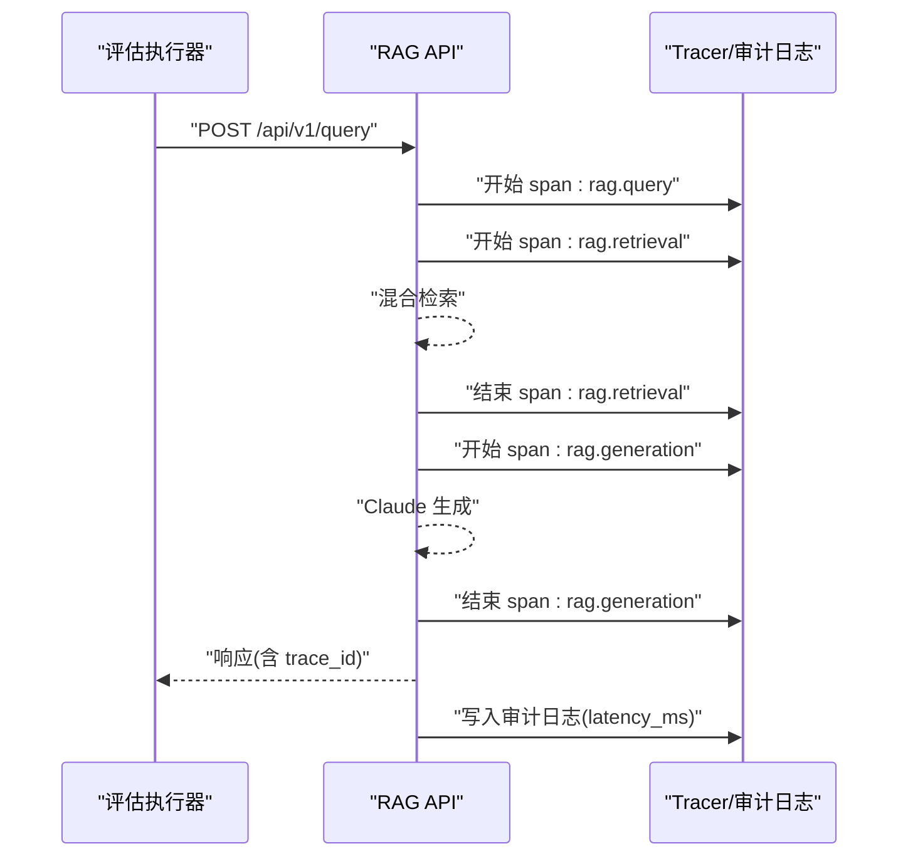
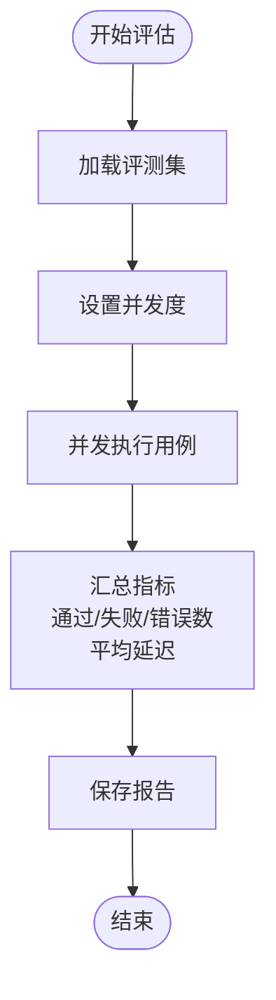
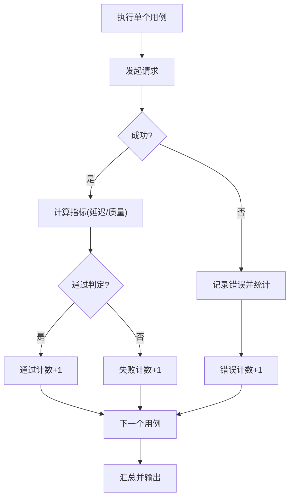
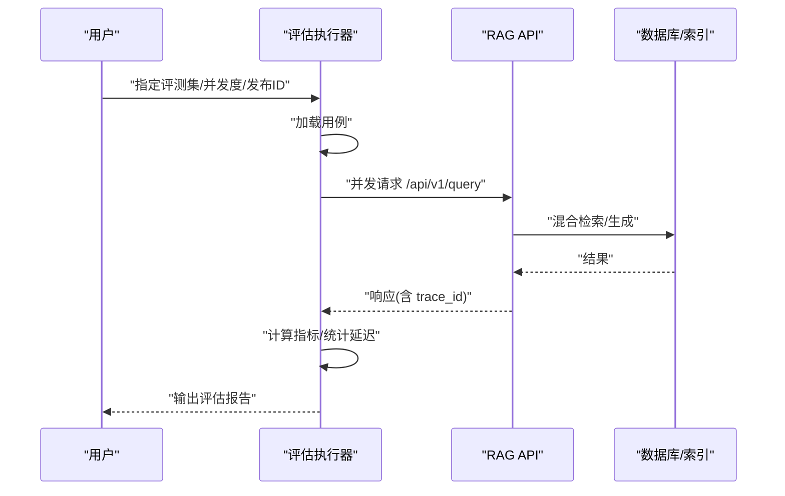
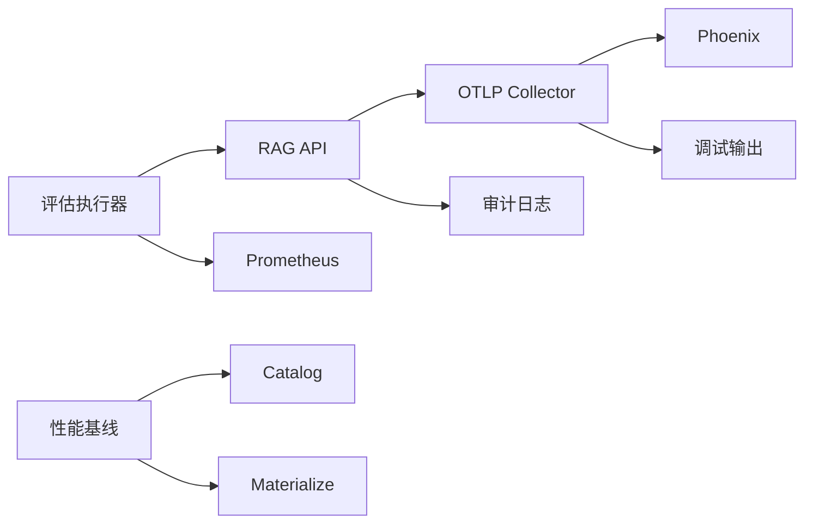

# 性能监控

<cite>
**本文档引用的文件**
- [observability/otel/config.yaml](file://observability/otel/config.yaml)
- [services/rag_api/app/observability.py](file://services/rag_api/app/observability.py)
- [services/rag_api/app/main.py](file://services/rag_api/app/main.py)
- [services/rag_api/app/routers/query.py](file://services/rag_api/app/routers/query.py)
- [services/rag_api/app/routers/rag.py](file://services/rag_api/app/routers/rag.py)
- [services/tool_api/app/routers/kpis.py](file://services/tool_api/app/routers/kpis.py)
- [services/tool_api/app/kpi_query.py](file://services/tool_api/app/kpi_query.py)
- [evals/harness/eval_runner.py](file://evals/harness/eval_runner.py)
- [pipelines/lakehouse/perf_baseline.py](file://pipelines/lakehouse/perf_baseline.py)
- [pipelines/lakehouse/catalog.py](file://pipelines/lakehouse/catalog.py)
- [pipelines/lakehouse/materialize.py](file://pipelines/lakehouse/materialize.py)
- [infra/migrations/003_week08_index_rag.sql](file://infra/migrations/003_week08_index_rag.sql)
- [analytics/dbt_project.yml](file://analytics/dbt_project.yml)
</cite>

## 目录
1. [简介](#简介)
2. [项目结构](#项目结构)
3. [核心组件](#核心组件)
4. [架构总览](#架构总览)
5. [详细组件分析](#详细组件分析)
6. [依赖关系分析](#依赖关系分析)
7. [性能考量](#性能考量)
8. [故障排查指南](#故障排查指南)
9. [结论](#结论)
10. [附录](#附录)

## 简介
本文件面向性能监控系统，围绕响应时间监控、吞吐量统计、错误率跟踪与资源使用监控展开，结合仓库中的 OpenTelemetry 配置、RAG API 与 KPI 工具 API 的可观测性实现、评估执行器的基准测试流程、湖仓表健康基线报告、索引与审计日志等基础设施，形成一套可落地的性能监控与优化实践指南。

## 项目结构
本项目采用分层与功能域划分：服务层（RAG API、Tool API）、可观测性（OpenTelemetry 收集器与 SDK 初始化）、评估与回归测试（eval harness）、湖仓与数据模型（Iceberg、dbt）、迁移脚本（索引与审计日志）。

图表来源
- [observability/otel/config.yaml:1-66](file://observability/otel/config.yaml#L1-L66)
- [services/rag_api/app/observability.py:1-55](file://services/rag_api/app/observability.py#L1-L55)
- [services/rag_api/app/main.py:1-73](file://services/rag_api/app/main.py#L1-L73)
- [services/rag_api/app/routers/query.py:1-159](file://services/rag_api/app/routers/query.py#L1-L159)
- [services/rag_api/app/routers/rag.py:1-163](file://services/rag_api/app/routers/rag.py#L1-L163)
- [services/tool_api/app/kpi_query.py:1-271](file://services/tool_api/app/kpi_query.py#L1-L271)
- [evals/harness/eval_runner.py:1-338](file://evals/harness/eval_runner.py#L1-L338)
- [pipelines/lakehouse/perf_baseline.py:1-126](file://pipelines/lakehouse/perf_baseline.py#L1-L126)
- [pipelines/lakehouse/catalog.py:1-197](file://pipelines/lakehouse/catalog.py#L1-L197)
- [pipelines/lakehouse/materialize.py:1-231](file://pipelines/lakehouse/materialize.py#L1-L231)
- [analytics/dbt_project.yml:1-32](file://analytics/dbt_project.yml#L1-L32)
- [infra/migrations/003_week08_index_rag.sql:1-78](file://infra/migrations/003_week08_index_rag.sql#L1-L78)

章节来源
- [observability/otel/config.yaml:1-66](file://observability/otel/config.yaml#L1-L66)
- [services/rag_api/app/observability.py:1-55](file://services/rag_api/app/observability.py#L1-L55)
- [services/rag_api/app/main.py:1-73](file://services/rag_api/app/main.py#L1-L73)
- [services/rag_api/app/routers/query.py:1-159](file://services/rag_api/app/routers/query.py#L1-L159)
- [services/rag_api/app/routers/rag.py:1-163](file://services/rag_api/app/routers/rag.py#L1-L163)
- [services/tool_api/app/kpi_query.py:1-271](file://services/tool_api/app/kpi_query.py#L1-L271)
- [evals/harness/eval_runner.py:1-338](file://evals/harness/eval_runner.py#L1-L338)
- [pipelines/lakehouse/perf_baseline.py:1-126](file://pipelines/lakehouse/perf_baseline.py#L1-L126)
- [pipelines/lakehouse/catalog.py:1-197](file://pipelines/lakehouse/catalog.py#L1-L197)
- [pipelines/lakehouse/materialize.py:1-231](file://pipelines/lakehouse/materialize.py#L1-L231)
- [analytics/dbt_project.yml:1-32](file://analytics/dbt_project.yml#L1-L32)
- [infra/migrations/003_week08_index_rag.sql:1-78](file://infra/migrations/003_week08_index_rag.sql#L1-L78)

## 核心组件
- OpenTelemetry 收集器与导出：OTLP 协议接收 traces/metrics/logs，批量处理器与内存限制，Prometheus 暴露指标，Phoenix 导出用于 AI 请求可观测。
- RAG API 可观测性初始化：FastAPI 中间件与 OTel Tracing，自动注入 release_id、环境等资源属性。
- 评估执行器：并发请求 RAG API，采集每个用例的延迟、命中率、相关性、忠实度等指标，输出回归通过率与平均延迟。
- 湖仓性能基线：统计 Iceberg 表行数、快照数、文件数、文件大小分布等元信息，辅助容量与维护决策。
- 索引与审计日志：PostgreSQL 索引与审计日志表，支撑检索性能与回溯审计。
- KPI 查询治理：基于合约与度量注册表的受控查询，避免原始 SQL，确保安全与可审计。

章节来源
- [observability/otel/config.yaml:1-66](file://observability/otel/config.yaml#L1-L66)
- [services/rag_api/app/observability.py:1-55](file://services/rag_api/app/observability.py#L1-L55)
- [evals/harness/eval_runner.py:1-338](file://evals/harness/eval_runner.py#L1-L338)
- [pipelines/lakehouse/perf_baseline.py:1-126](file://pipelines/lakehouse/perf_baseline.py#L1-L126)
- [infra/migrations/003_week08_index_rag.sql:1-78](file://infra/migrations/003_week08_index_rag.sql#L1-L78)
- [services/tool_api/app/kpi_query.py:1-271](file://services/tool_api/app/kpi_query.py#L1-L271)

## 架构总览
下图展示性能监控的关键交互：服务侧通过 OTel SDK 注入 trace/span，OTLP Collector 批量处理并导出到 Phoenix 与 Prometheus；评估执行器并发压测服务，采集延迟与质量指标；湖仓侧通过 Catalog/Materialize 与迁移脚本保障检索与审计能力。

图表来源
- [observability/otel/config.yaml:1-66](file://observability/otel/config.yaml#L1-L66)
- [services/rag_api/app/observability.py:1-55](file://services/rag_api/app/observability.py#L1-L55)
- [evals/harness/eval_runner.py:1-338](file://evals/harness/eval_runner.py#L1-L338)
- [pipelines/lakehouse/perf_baseline.py:1-126](file://pipelines/lakehouse/perf_baseline.py#L1-L126)
- [pipelines/lakehouse/catalog.py:1-197](file://pipelines/lakehouse/catalog.py#L1-L197)
- [pipelines/lakehouse/materialize.py:1-231](file://pipelines/lakehouse/materialize.py#L1-L231)
- [infra/migrations/003_week08_index_rag.sql:1-78](file://infra/migrations/003_week08_index_rag.sql#L1-L78)
- [services/tool_api/app/kpi_query.py:1-271](file://services/tool_api/app/kpi_query.py#L1-L271)

## 详细组件分析

### 响应时间监控
- RAG API 端点在查询链路中以 spans 记录检索与生成阶段，同时审计日志记录端到端耗时，便于端到端延迟分析。
- 评估执行器对每个用例测量请求往返时间，汇总平均延迟与通过率，作为回归基线。
- OTLP Collector 批量导出，降低网络开销，保证延迟指标稳定。

图表来源
- [services/rag_api/app/routers/query.py:52-93](file://services/rag_api/app/routers/query.py#L52-L93)
- [services/rag_api/app/routers/rag.py:25-122](file://services/rag_api/app/routers/rag.py#L25-L122)
- [evals/harness/eval_runner.py:185-237](file://evals/harness/eval_runner.py#L185-L237)

章节来源
- [services/rag_api/app/routers/query.py:52-93](file://services/rag_api/app/routers/query.py#L52-L93)
- [services/rag_api/app/routers/rag.py:25-122](file://services/rag_api/app/routers/rag.py#L25-L122)
- [evals/harness/eval_runner.py:185-237](file://evals/harness/eval_runner.py#L185-L237)

### 吞吐量统计
- 评估执行器支持并发参数，通过信号量控制并发度，统计总用例数、通过/失败/错误数量与平均延迟，用于吞吐与稳定性评估。
- Prometheus 导出端点可用于外部监控系统抓取指标，形成吞吐趋势。

图表来源
- [evals/harness/eval_runner.py:239-284](file://evals/harness/eval_runner.py#L239-L284)
- [observability/otel/config.yaml:42-43](file://observability/otel/config.yaml#L42-L43)

章节来源
- [evals/harness/eval_runner.py:239-284](file://evals/harness/eval_runner.py#L239-L284)
- [observability/otel/config.yaml:42-43](file://observability/otel/config.yaml#L42-L43)

### 错误率跟踪
- 评估执行器捕获异常并记录错误用例数与平均延迟，同时输出回归通过率，作为错误率与稳定性指标。
- RAG API 在检索失败时降级返回空列表并记录警告日志，审计日志记录检索结果状态，便于错误归因。

图表来源
- [evals/harness/eval_runner.py:185-237](file://evals/harness/eval_runner.py#L185-L237)
- [services/rag_api/app/routers/query.py:96-114](file://services/rag_api/app/routers/query.py#L96-L114)

章节来源
- [evals/harness/eval_runner.py:185-237](file://evals/harness/eval_runner.py#L185-L237)
- [services/rag_api/app/routers/query.py:96-114](file://services/rag_api/app/routers/query.py#L96-L114)

### 资源使用监控
- OTLP Collector 配置包含内存限制与批量处理器，避免高负载下的 OOM 与网络抖动。
- Prometheus 指标暴露端点可用于采集 CPU、内存、Goroutines 等运行时指标（需在部署侧启用相应 exporter）。

章节来源
- [observability/otel/config.yaml:25-28](file://observability/otel/config.yaml#L25-L28)
- [observability/otel/config.yaml:42-43](file://observability/otel/config.yaml#L42-L43)

### 性能基准测试设计与执行
- 测试用例设计：从 JSONL 加载查询用例，包含最小期望分数、产品线过滤等字段，支持按产品线与过滤条件组合。
- 数据收集：评估执行器并发请求 RAG API，记录延迟、忠实度、相关性、检索精度、通过率与错误数。
- 结果分析：输出评估运行摘要，包含平均延迟、各项指标均值与回归通过率，用于回归门禁。

图表来源
- [evals/harness/eval_runner.py:159-284](file://evals/harness/eval_runner.py#L159-L284)
- [services/rag_api/app/routers/query.py:39-93](file://services/rag_api/app/routers/query.py#L39-L93)

章节来源
- [evals/harness/eval_runner.py:159-284](file://evals/harness/eval_runner.py#L159-L284)
- [services/rag_api/app/routers/query.py:39-93](file://services/rag_api/app/routers/query.py#L39-L93)

### 瓶颈分析方法论
- CPU/内存：通过 Prometheus 抓取进程指标，结合 OTel traces 的 span 分布定位热点阶段（检索/生成）。
- 磁盘 I/O：结合湖仓基线报告观察文件数、平均文件大小与快照变化，识别大文件与碎片化风险。
- 网络延迟：OTel traces 的网络往返时间与评估执行器延迟对比，定位网络路径问题。
- 检索与生成：RAG 审计日志记录端到端耗时与检索结果数，结合索引与过滤条件分析性能影响。

章节来源
- [pipelines/lakehouse/perf_baseline.py:13-30](file://pipelines/lakehouse/perf_baseline.py#L13-L30)
- [services/rag_api/app/routers/rag.py:85-107](file://services/rag_api/app/routers/rag.py#L85-L107)
- [infra/migrations/003_week08_index_rag.sql:47-65](file://infra/migrations/003_week08_index_rag.sql#L47-L65)

### 性能优化建议
- 索引优化：根据过滤维度建立复合索引，如可见性范围、授权等级、状态、质量状态等，减少检索扫描。
- 查询优化：在 KPI 查询中严格基于合约与注册表构建参数化 SQL，避免全表扫描与动态拼接。
- 缓存策略：对高频检索与生成结果进行短期缓存（需结合业务一致性），减少重复计算。
- 连接池与并发：合理设置数据库连接池大小与评估并发度，避免过载导致延迟上升。
- 数据组织：通过湖仓基线报告指导分区与分桶策略，减少读放大。

章节来源
- [infra/migrations/003_week08_index_rag.sql:67-77](file://infra/migrations/003_week08_index_rag.sql#L67-L77)
- [services/tool_api/app/kpi_query.py:169-197](file://services/tool_api/app/kpi_query.py#L169-L197)
- [pipelines/lakehouse/perf_baseline.py:13-30](file://pipelines/lakehouse/perf_baseline.py#L13-L30)

### 阈值与告警机制
- 延迟阈值：以评估执行器平均延迟与回归通过率为阈值，低于阈值视为通过。
- 错误率阈值：错误用例占比超过阈值触发告警。
- 资源阈值：OTel Collector 内存限制与批量配置作为软性保护，结合 Prometheus 报警规则设置 CPU/内存/连接池饱和告警。

章节来源
- [evals/harness/eval_runner.py:286-305](file://evals/harness/eval_runner.py#L286-L305)
- [observability/otel/config.yaml:25-28](file://observability/otel/config.yaml#L25-L28)

### 指标扩展与第三方集成
- 指标扩展：在 OTel Collector 中新增 exporter 或 processor，扩展到更多后端（如自建时序库）。
- 第三方工具集成：Phoenix 用于 AI 请求可观测，Prometheus 用于通用指标采集，二者可并行使用。

章节来源
- [observability/otel/config.yaml:30-43](file://observability/otel/config.yaml#L30-L43)

## 依赖关系分析
- 服务依赖：RAG API 与 Tool API 依赖 OTel SDK 初始化与 Collector；评估执行器依赖 RAG API；湖仓侧依赖 Catalog 与 Materialize。
- 数据流：评估执行器 → RAG API → 数据库/索引 → 审计日志；Collector → Phoenix/调试输出；Prometheus → 外部监控。

图表来源
- [evals/harness/eval_runner.py:1-338](file://evals/harness/eval_runner.py#L1-L338)
- [services/rag_api/app/main.py:1-73](file://services/rag_api/app/main.py#L1-L73)
- [observability/otel/config.yaml:1-66](file://observability/otel/config.yaml#L1-L66)
- [pipelines/lakehouse/perf_baseline.py:1-126](file://pipelines/lakehouse/perf_baseline.py#L1-L126)
- [pipelines/lakehouse/catalog.py:1-197](file://pipelines/lakehouse/catalog.py#L1-L197)
- [pipelines/lakehouse/materialize.py:1-231](file://pipelines/lakehouse/materialize.py#L1-L231)

章节来源
- [evals/harness/eval_runner.py:1-338](file://evals/harness/eval_runner.py#L1-L338)
- [services/rag_api/app/main.py:1-73](file://services/rag_api/app/main.py#L1-L73)
- [observability/otel/config.yaml:1-66](file://observability/otel/config.yaml#L1-L66)
- [pipelines/lakehouse/perf_baseline.py:1-126](file://pipelines/lakehouse/perf_baseline.py#L1-L126)
- [pipelines/lakehouse/catalog.py:1-197](file://pipelines/lakehouse/catalog.py#L1-L197)
- [pipelines/lakehouse/materialize.py:1-231](file://pipelines/lakehouse/materialize.py#L1-L231)

## 性能考量
- 检索链路：向量检索 + 全文检索融合，RRF 融合与交叉编码重排，需关注索引与过滤条件对延迟的影响。
- 生成链路：LLM 生成耗时显著，建议结合缓存与限流策略。
- 数据层：湖仓表的文件大小与快照变化直接影响查询性能，需定期生成基线报告并调整维护策略。
- 并发与限流：评估并发与服务端连接池需平衡吞吐与延迟，避免过载。

章节来源
- [services/rag_api/app/routers/query.py:64-75](file://services/rag_api/app/routers/query.py#L64-L75)
- [services/rag_api/app/routers/rag.py:47-61](file://services/rag_api/app/routers/rag.py#L47-L61)
- [pipelines/lakehouse/perf_baseline.py:13-30](file://pipelines/lakehouse/perf_baseline.py#L13-L30)

## 故障排查指南
- OTel 初始化失败：检查依赖与配置开关，确认端点与资源属性注入。
- 评估执行器错误：查看错误用例数与异常堆栈，核对并发与超时设置。
- 检索失败降级：确认数据库连接池与索引状态，检查审计日志中的检索结果状态。
- KPI 查询拒绝：核对角色权限、指标与维度合法性、日期窗口限制。

章节来源
- [services/rag_api/app/observability.py:51-54](file://services/rag_api/app/observability.py#L51-L54)
- [evals/harness/eval_runner.py:224-237](file://evals/harness/eval_runner.py#L224-L237)
- [services/rag_api/app/routers/query.py:111-113](file://services/rag_api/app/routers/query.py#L111-L113)
- [services/tool_api/app/kpi_query.py:106-166](file://services/tool_api/app/kpi_query.py#L106-L166)

## 结论
本项目通过 OTel 收集器与 SDK 初始化、评估执行器的基准测试、湖仓基线报告与索引/审计日志迁移，构建了覆盖响应时间、吞吐量、错误率与资源使用的监控体系。建议持续完善指标扩展与第三方集成，结合基线报告与回归测试，形成闭环的性能治理流程。

## 附录
- dbt 项目配置：定义模型路径与目标标签，支撑 KPI 视图与安全访问。
- 迁移脚本：新增列与审计日志表，建立索引，提升检索与审计效率。

章节来源
- [analytics/dbt_project.yml:18-31](file://analytics/dbt_project.yml#L18-L31)
- [infra/migrations/003_week08_index_rag.sql:14-77](file://infra/migrations/003_week08_index_rag.sql#L14-L77)