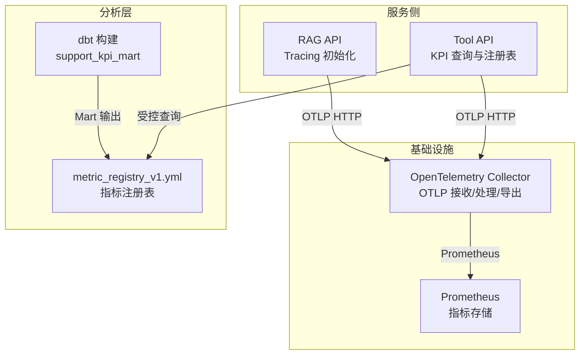
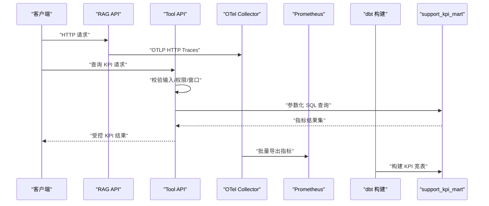
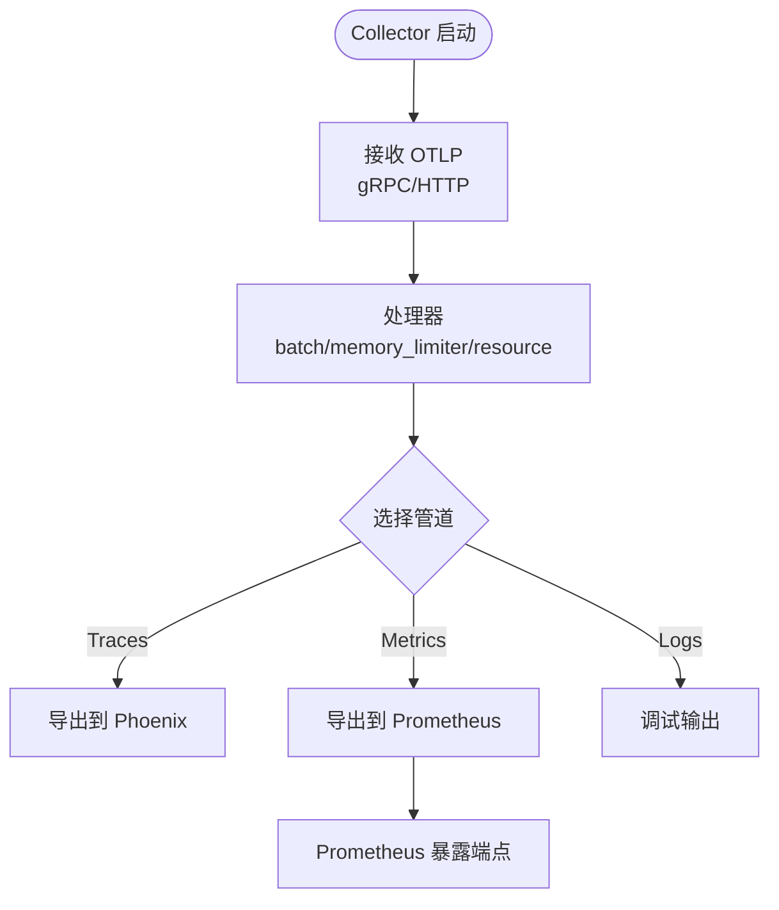
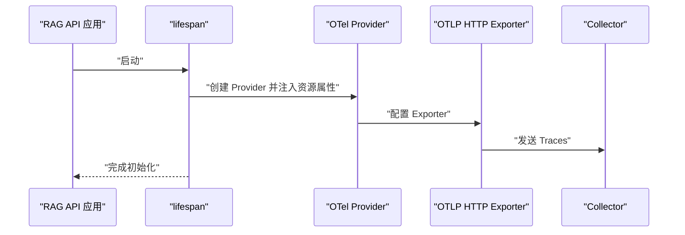
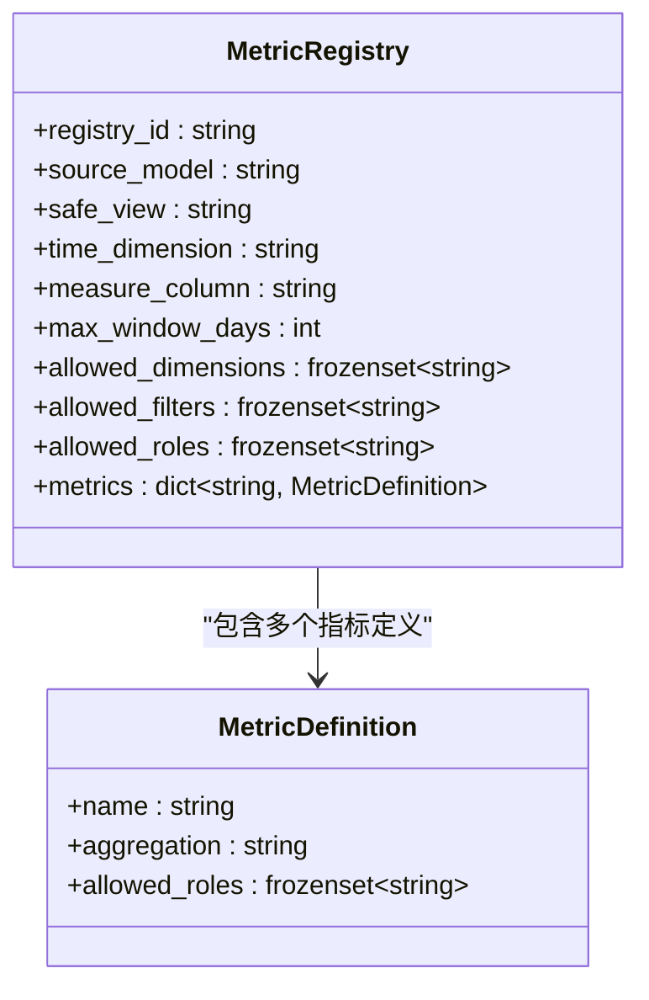
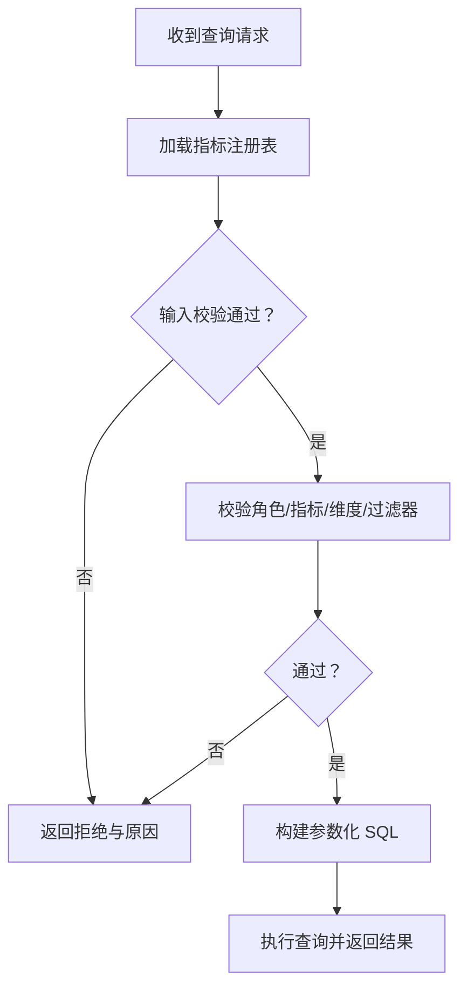
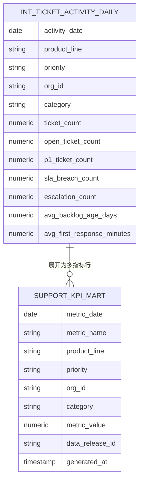
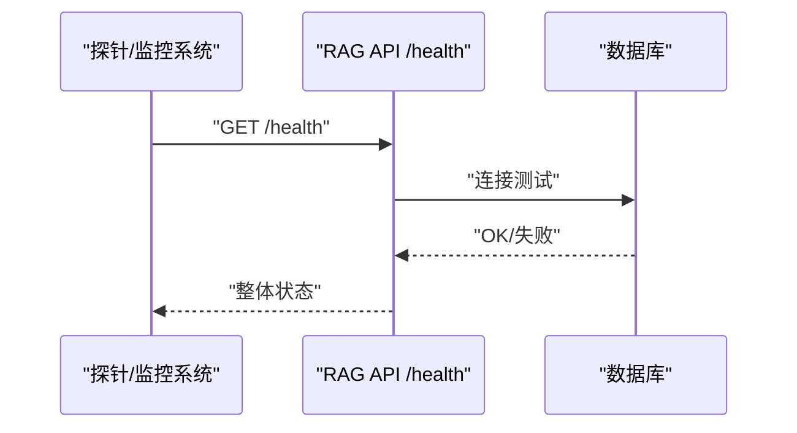
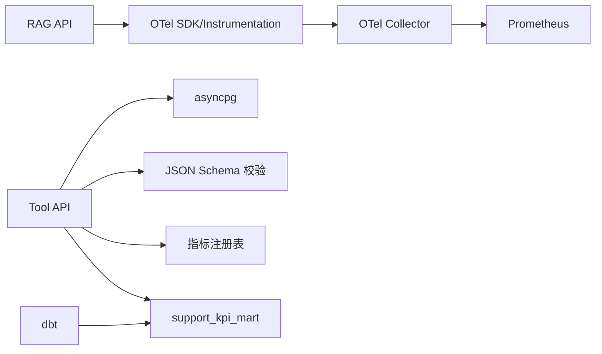

# 监控指标与告警

<cite>
**本文引用的文件**
- [observability/otel/config.yaml](file://observability/otel/config.yaml)
- [services/rag_api/app/observability.py](file://services/rag_api/app/observability.py)
- [services/rag_api/app/main.py](file://services/rag_api/app/main.py)
- [services/tool_api/app/main.py](file://services/tool_api/app/main.py)
- [services/tool_api/app/config.py](file://services/tool_api/app/config.py)
- [services/tool_api/app/metric_registry.py](file://services/tool_api/app/metric_registry.py)
- [services/tool_api/app/kpi_query.py](file://services/tool_api/app/kpi_query.py)
- [analytics/scripts/validate_metric_registry.py](file://analytics/scripts/validate_metric_registry.py)
- [analytics/metric_registry_v1.yml](file://analytics/metric_registry_v1.yml)
- [analytics/models/marts/support_kpi_mart.sql](file://analytics/models/marts/support_kpi_mart.sql)
- [services/rag_api/app/routers/health.py](file://services/rag_api/app/routers/health.py)
- [services/tool_api/app/routers/health.py](file://services/tool_api/app/routers/health.py)
</cite>

## 目录
1. [引言](#引言)
2. [项目结构](#项目结构)
3. [核心组件](#核心组件)
4. [架构总览](#架构总览)
5. [详细组件分析](#详细组件分析)
6. [依赖分析](#依赖分析)
7. [性能考虑](#性能考虑)
8. [故障排查指南](#故障排查指南)
9. [结论](#结论)
10. [附录](#附录)

## 引言
本文件系统化梳理本仓库中的监控指标与告警机制，覆盖以下方面：
- 指标定义、计算方法与业务含义：请求量、响应时间、错误率、资源利用率等
- 指标采集实现：OpenTelemetry Tracing、Prometheus 指标暴露、KPI 查询治理
- 告警规则配置：阈值、级别与通知渠道的落地建议
- 指标仪表板设计：Grafana 集成与可视化配置思路
- 指标体系扩展：新增业务指标与自定义监控项的方法

## 项目结构
本项目在服务侧采用 OpenTelemetry 进行追踪与资源属性注入，在基础设施侧使用 OpenTelemetry Collector 将指标导出至 Prometheus；在分析层通过 dbt 构建 KPI Mart，并以受控查询接口向业务方提供安全的指标访问。

图表来源
- [observability/otel/config.yaml](file://observability/otel/config.yaml)
- [services/rag_api/app/observability.py](file://services/rag_api/app/observability.py)
- [services/tool_api/app/metric_registry.py](file://services/tool_api/app/metric_registry.py)
- [analytics/metric_registry_v1.yml](file://analytics/metric_registry_v1.yml)
- [analytics/models/marts/support_kpi_mart.sql](file://analytics/models/marts/support_kpi_mart.sql)

章节来源
- [observability/otel/config.yaml](file://observability/otel/config.yaml)
- [services/rag_api/app/observability.py](file://services/rag_api/app/observability.py)
- [services/tool_api/app/metric_registry.py](file://services/tool_api/app/metric_registry.py)
- [analytics/metric_registry_v1.yml](file://analytics/metric_registry_v1.yml)
- [analytics/models/marts/support_kpi_mart.sql](file://analytics/models/marts/support_kpi_mart.sql)

## 核心组件
- OpenTelemetry Collector：接收 OTLP（HTTP/GRPC），批量处理、内存限制、资源属性注入，并将指标导出至 Prometheus，同时可将追踪导出至 Phoenix（Arize）用于 AI 请求可观测。
- RAG API 服务：在启动时初始化 OTel Tracing，自动注入服务名、版本、环境与发布号等资源属性。
- Tool API 服务：提供受控 KPI 查询能力，基于指标注册表进行输入校验、权限控制与参数化 SQL 生成，最终从分析层安全视图读取数据。
- 指标注册表：定义可用指标、聚合方式、维度/过滤器、角色授权与最大窗口天数等元数据。
- 分析层 Mart：将原始中间层汇总为多指标宽表，统一输出 metric_name、metric_value、维度与时间维度，便于查询与仪表板展示。

章节来源
- [observability/otel/config.yaml](file://observability/otel/config.yaml)
- [services/rag_api/app/observability.py](file://services/rag_api/app/observability.py)
- [services/tool_api/app/metric_registry.py](file://services/tool_api/app/metric_registry.py)
- [services/tool_api/app/kpi_query.py](file://services/tool_api/app/kpi_query.py)
- [analytics/metric_registry_v1.yml](file://analytics/metric_registry_v1.yml)
- [analytics/models/marts/support_kpi_mart.sql](file://analytics/models/marts/support_kpi_mart.sql)

## 架构总览
下图展示了从服务到基础设施再到分析层的完整可观测链路，以及指标与告警的落地路径。

图表来源
- [observability/otel/config.yaml](file://observability/otel/config.yaml)
- [services/rag_api/app/observability.py](file://services/rag_api/app/observability.py)
- [services/tool_api/app/kpi_query.py](file://services/tool_api/app/kpi_query.py)
- [analytics/models/marts/support_kpi_mart.sql](file://analytics/models/marts/support_kpi_mart.sql)

## 详细组件分析

### 组件A：OpenTelemetry Collector 配置与指标暴露
- 接收器：支持 gRPC/HTTP 的 OTLP 端点，用于接收服务侧上报的追踪与指标。
- 处理器：批量发送、内存限制、资源属性注入（如部署环境）。
- 导出器：Prometheus 指标暴露端点；Phoenix（Arize）追踪导出；调试输出。
- 服务管道：分别配置 traces、metrics、logs 管道，确保不同类型的遥测数据被正确路由。

图表来源
- [observability/otel/config.yaml](file://observability/otel/config.yaml)

章节来源
- [observability/otel/config.yaml](file://observability/otel/config.yaml)

### 组件B：RAG API Tracing 初始化
- 在服务生命周期中初始化 TracerProvider，注入资源属性（服务名、版本、环境、发布号等）。
- 使用 OTLP HTTP Exporter 将 Traces 发送到 Collector。
- 支持通过配置开关启用/禁用 OTel。

图表来源
- [services/rag_api/app/main.py](file://services/rag_api/app/main.py)
- [services/rag_api/app/observability.py](file://services/rag_api/app/observability.py)
- [services/rag_api/app/config.py](file://services/rag_api/app/config.py)

章节来源
- [services/rag_api/app/main.py](file://services/rag_api/app/main.py)
- [services/rag_api/app/observability.py](file://services/rag_api/app/observability.py)
- [services/rag_api/app/config.py](file://services/rag_api/app/config.py)

### 组件C：Tool API 指标注册表与受控查询
- 指标注册表定义：
  - 注册表 ID、源模型、安全视图、时间维度、度量列、最大窗口天数
  - 允许的维度、过滤器、角色授权
  - 指标清单：名称、标签、描述、聚合方式、角色授权
- 加载与校验：
  - 动态加载注册表 YAML，构造注册表对象
  - 校验脚本确保字段完整性、维度/过滤器合法性、聚合方式合规、角色包含关系正确
- 受控查询流程：
  - 输入校验（JSON Schema）、角色校验、指标/维度/过滤器白名单校验、日期窗口校验
  - 参数化 SQL 生成与执行，返回受控结果并记录审计信息

图表来源
- [services/tool_api/app/metric_registry.py](file://services/tool_api/app/metric_registry.py)

图表来源
- [services/tool_api/app/kpi_query.py](file://services/tool_api/app/kpi_query.py)
- [analytics/scripts/validate_metric_registry.py](file://analytics/scripts/validate_metric_registry.py)
- [analytics/metric_registry_v1.yml](file://analytics/metric_registry_v1.yml)

章节来源
- [services/tool_api/app/metric_registry.py](file://services/tool_api/app/metric_registry.py)
- [services/tool_api/app/kpi_query.py](file://services/tool_api/app/kpi_query.py)
- [analytics/scripts/validate_metric_registry.py](file://analytics/scripts/validate_metric_registry.py)
- [analytics/metric_registry_v1.yml](file://analytics/metric_registry_v1.yml)

### 组件D：分析层 KPI Mart 与指标计算
- 将每日活动宽表展开为多指标行，统一输出 metric_name、metric_value 与维度字段。
- 输出 data_release_id 与 generated_at 字段，便于审计与版本追踪。
- 支持 sum/avg 等聚合，满足不同业务指标需求。

图表来源
- [analytics/models/marts/support_kpi_mart.sql](file://analytics/models/marts/support_kpi_mart.sql)

章节来源
- [analytics/models/marts/support_kpi_mart.sql](file://analytics/models/marts/support_kpi_mart.sql)

### 组件E：健康检查与可用性监控
- RAG API 健康检查：检查 API、数据库连通性，预留向量索引与 LLM 组件状态。
- Tool API 健康检查：基础健康状态返回。

图表来源
- [services/rag_api/app/routers/health.py](file://services/rag_api/app/routers/health.py)
- [services/tool_api/app/routers/health.py](file://services/tool_api/app/routers/health.py)

章节来源
- [services/rag_api/app/routers/health.py](file://services/rag_api/app/routers/health.py)
- [services/tool_api/app/routers/health.py](file://services/tool_api/app/routers/health.py)

## 依赖分析
- 服务侧依赖：
  - RAG API：依赖 OTel SDK、FastAPI Instrumentation、配置项（服务名、OTel 端点、发布号）。
  - Tool API：依赖 asyncpg、JSON Schema 校验、指标注册表加载与校验脚本。
- 基础设施依赖：
  - OTel Collector：接收 OTLP、批量处理、内存限制、资源属性注入、导出到 Prometheus。
- 分析层依赖：
  - dbt：将中间层汇总为 KPI Mart，统一输出指标宽表。

图表来源
- [services/rag_api/app/observability.py](file://services/rag_api/app/observability.py)
- [services/tool_api/app/kpi_query.py](file://services/tool_api/app/kpi_query.py)
- [observability/otel/config.yaml](file://observability/otel/config.yaml)
- [analytics/models/marts/support_kpi_mart.sql](file://analytics/models/marts/support_kpi_mart.sql)

章节来源
- [services/rag_api/app/observability.py](file://services/rag_api/app/observability.py)
- [services/tool_api/app/kpi_query.py](file://services/tool_api/app/kpi_query.py)
- [observability/otel/config.yaml](file://observability/otel/config.yaml)
- [analytics/models/marts/support_kpi_mart.sql](file://analytics/models/marts/support_kpi_mart.sql)

## 性能考虑
- 批量导出：Collector 使用 batch 处理器降低网络开销，建议根据流量规模调整批大小与超时。
- 内存限制：memory_limiter 防止 OOM，建议结合容器资源限制与监控阈值联动。
- 查询性能：KPI 查询使用参数化 SQL 与安全视图，避免动态拼接；合理设置最大窗口天数，防止大范围扫描。
- Tracing 开销：OTel Tracing 在生产环境建议按采样策略或仅对关键路径启用，避免过度影响延迟。

## 故障排查指南
- OTel 初始化失败：
  - 检查配置项是否启用、端点可达、依赖安装是否完整。
  - 查看日志输出，定位 ImportError 或其他异常。
- Prometheus 指标未暴露：
  - 确认 Collector 的 metrics 管道已启用，Prometheus 端点配置正确。
  - 使用 curl 访问 Prometheus 抓取端点，确认抓取成功。
- KPI 查询被拒绝：
  - 检查输入 JSON Schema 是否符合工具契约。
  - 核对角色授权、指标/维度/过滤器是否在注册表白名单内。
  - 确认日期窗口不超过 max_window_days。
- 健康检查失败：
  - 对于 RAG API，检查数据库连接字符串与可达性。
  - 对于 Tool API，确认服务正常运行且端口开放。

章节来源
- [services/rag_api/app/observability.py](file://services/rag_api/app/observability.py)
- [observability/otel/config.yaml](file://observability/otel/config.yaml)
- [services/tool_api/app/kpi_query.py](file://services/tool_api/app/kpi_query.py)
- [services/rag_api/app/routers/health.py](file://services/rag_api/app/routers/health.py)
- [services/tool_api/app/routers/health.py](file://services/tool_api/app/routers/health.py)

## 结论
本项目通过 OTel Collector 实现统一的指标与追踪采集，结合 dbt 构建的 KPI Mart 与受控查询接口，形成“采集—治理—查询—可视化”的闭环。建议在现有基础上补充：
- 明确告警阈值与级别，结合 Prometheus 报警规则与通知渠道（如 Webhook/IM）落地。
- 在 Grafana 中基于 Prometheus 数据源创建仪表板，聚焦请求量、响应时间、错误率与资源利用率。
- 扩展指标体系时，遵循注册表契约，先在分析层实现指标计算，再在注册表中声明并授权。

## 附录

### 指标定义、计算与业务含义
- 请求量（QPS）：单位时间内服务收到的请求数，可用于容量规划与 SLA 对比。
- 响应时间（P50/P95/P99）：请求从进入服务到返回的耗时分布，反映性能与稳定性。
- 错误率：HTTP 5xx 或业务级错误占比，衡量系统可靠性。
- 资源利用率：CPU、内存、磁盘、网络与数据库连接池占用，辅助容量与成本优化。
- KPI 指标（来自注册表与 Mart）：如工单数、打开工单数、P1 工单数、SLA 破坏数、升级工单数、平均积压天数等，支撑运营与质量评估。

### 指标采集实现要点
- OpenTelemetry Tracing：在服务启动时初始化 Provider，注入资源属性，使用 OTLP HTTP Exporter 上报。
- Prometheus 指标暴露：Collector 的 Prometheus 导出器负责将指标暴露给 Prometheus 抓取。
- 受控 KPI 查询：Tool API 严格校验输入、角色与注册表，参数化 SQL 访问安全视图，保障数据安全与一致性。

章节来源
- [services/rag_api/app/observability.py](file://services/rag_api/app/observability.py)
- [observability/otel/config.yaml](file://observability/otel/config.yaml)
- [services/tool_api/app/kpi_query.py](file://services/tool_api/app/kpi_query.py)
- [analytics/metric_registry_v1.yml](file://analytics/metric_registry_v1.yml)
- [analytics/models/marts/support_kpi_mart.sql](file://analytics/models/marts/support_kpi_mart.sql)

### 告警规则配置建议
- 阈值设置：基于历史基线与业务目标设定，区分严重/警告/提醒三级阈值。
- 告警级别：错误率、P95 延迟、资源利用率、健康检查失败等分别对应不同级别。
- 通知渠道：Webhook、IM、邮件等，结合值班与变更窗口管理。
- Prometheus 报警规则示例（概念性说明）：
  - 服务错误率过高：基于 HTTP 5xx 计数与总请求数计算错误率，超过阈值触发告警。
  - 响应时间异常：基于 histogram_quantile 计算 P95/P99，超过阈值触发告警。
  - 健康检查失败：/health 返回非 OK 连续多次触发告警。
  - 资源压力：CPU/内存/磁盘/连接池使用率超过阈值触发告警。

[本节为通用实践说明，不直接分析具体文件，故无章节来源]

### 指标仪表板设计与实现
- Grafana 集成：配置 Prometheus 数据源，基于服务标签与资源属性筛选目标实例。
- 关键面板建议：
  - 请求量与错误率趋势
  - 响应时间分位数（P50/P95/P99）
  - 资源利用率（CPU/内存/数据库连接）
  - KPI 指标（工单数、打开工单数、SLA 破坏数等）随时间变化
- 维度与过滤：利用产品线、优先级、组织、类别等维度进行钻取与对比。

[本节为通用实践说明，不直接分析具体文件，故无章节来源]

### 扩展监控指标体系
- 新增业务指标步骤：
  1) 在分析层实现指标计算逻辑，输出到 KPI Mart。
  2) 在指标注册表中声明指标名称、聚合方式、允许维度/过滤器、角色授权与最大窗口天数。
  3) 使用校验脚本验证注册表契约，确保字段与权限正确。
  4) 在 Tool API 中授权相应角色访问新指标，并在前端或报表中集成。
- 自定义监控项：
  - 通过 OTel 自定义 Span/事件/属性，或在服务中埋点关键业务事件。
  - 使用 Collector 的 resource 属性注入统一上下文，便于跨服务关联分析。

章节来源
- [analytics/models/marts/support_kpi_mart.sql](file://analytics/models/marts/support_kpi_mart.sql)
- [analytics/metric_registry_v1.yml](file://analytics/metric_registry_v1.yml)
- [analytics/scripts/validate_metric_registry.py](file://analytics/scripts/validate_metric_registry.py)
- [services/tool_api/app/metric_registry.py](file://services/tool_api/app/metric_registry.py)
- [services/tool_api/app/kpi_query.py](file://services/tool_api/app/kpi_query.py)