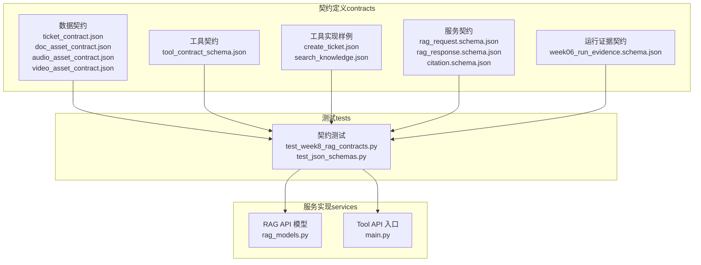
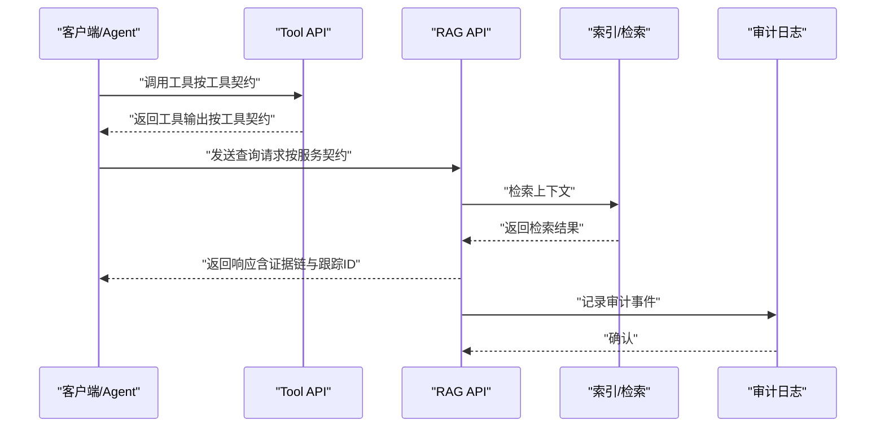
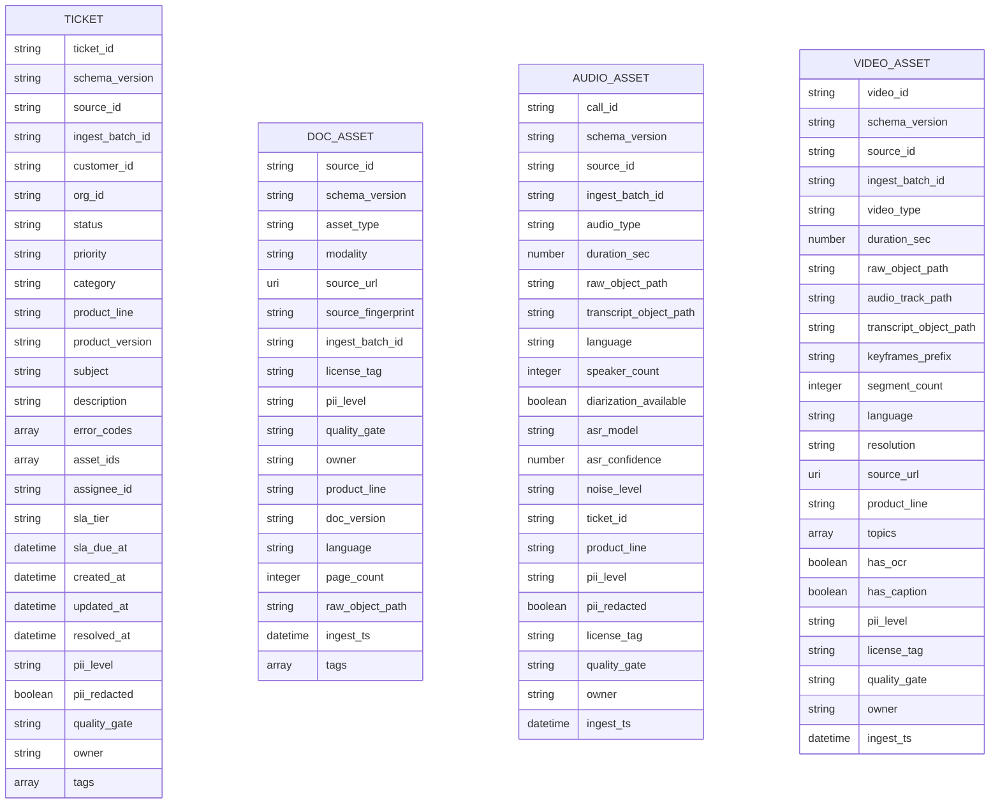
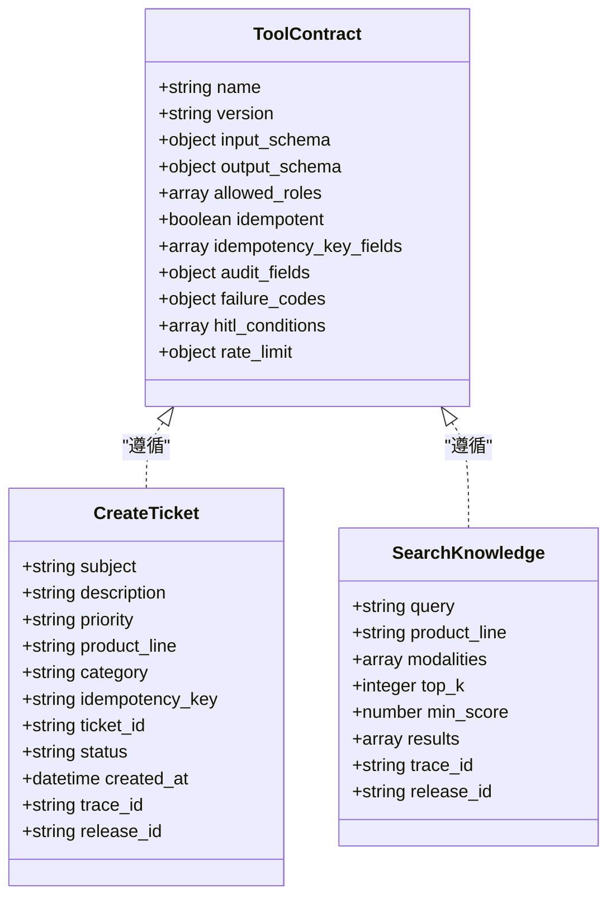
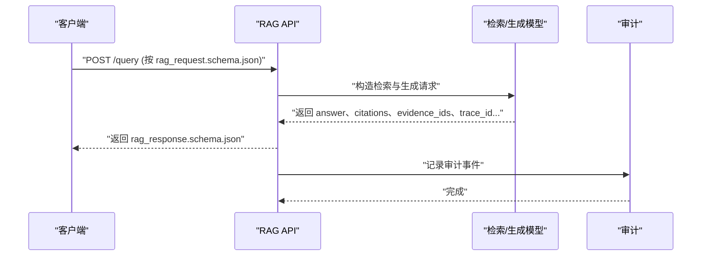
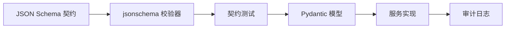

# 契约与规范系统

<cite>
**本文引用的文件**
- [contracts/data/ticket_contract.json](file://contracts/data/ticket_contract.json)
- [contracts/data/doc_asset_contract.json](file://contracts/data/doc_asset_contract.json)
- [contracts/data/audio_asset_contract.json](file://contracts/data/audio_asset_contract.json)
- [contracts/data/video_asset_contract.json](file://contracts/data/video_asset_contract.json)
- [contracts/tools/tool_contract_schema.json](file://contracts/tools/tool_contract_schema.json)
- [contracts/tools/tools/create_ticket.json](file://contracts/tools/tools/create_ticket.json)
- [contracts/tools/tools/search_knowledge.json](file://contracts/tools/tools/search_knowledge.json)
- [contracts/service/rag_request.schema.json](file://contracts/service/rag_request.schema.json)
- [contracts/service/rag_response.schema.json](file://contracts/service/rag_response.schema.json)
- [contracts/service/citation.schema.json](file://contracts/service/citation.schema.json)
- [contracts/run_evidence/week06_run_evidence.schema.json](file://contracts/run_evidence/week06_run_evidence.schema.json)
- [tests/contract/test_week8_rag_contracts.py](file://tests/contract/test_week8_rag_contracts.py)
- [tests/contract/test_json_schemas.py](file://tests/contract/test_json_schemas.py)
- [services/rag_api/app/models/rag_models.py](file://services/rag_api/app/models/rag_models.py)
- [services/tool_api/app/main.py](file://services/tool_api/app/main.py)
</cite>

## 目录
1. [简介](#简介)
2. [项目结构](#项目结构)
3. [核心组件](#核心组件)
4. [架构总览](#架构总览)
5. [详细组件分析](#详细组件分析)
6. [依赖分析](#依赖分析)
7. [性能考虑](#性能考虑)
8. [故障排除指南](#故障排除指南)
9. [结论](#结论)
10. [附录](#附录)

## 简介
本文件系统化梳理 OmniSupport Copilot 的“契约与规范”体系，围绕 JSON Schema 的契约驱动开发范式，构建从数据契约、工具契约到发布契约的全链路规范。内容涵盖：
- 数据契约：工单、文档、音频、视频四类资产的字段定义、验证规则与版本管理策略
- 工具契约：参数验证、错误处理、审计要求与人工介入（HITL）机制
- 发布契约：RAG 响应契约（请求/响应/证据链）的设计与实现
- 版本演进与兼容性：版本语义、兼容性检查与向后兼容策略
- 测试与验证：契约测试、验证工具与最佳实践

## 项目结构
契约与规范系统主要分布在 contracts 目录下，配合 tests 中的契约测试与 services 中的实现进行端到端验证。

图表来源
- [contracts/data/ticket_contract.json:1-125](file://contracts/data/ticket_contract.json#L1-L125)
- [contracts/tools/tool_contract_schema.json:1-93](file://contracts/tools/tool_contract_schema.json#L1-L93)
- [contracts/service/rag_request.schema.json:1-23](file://contracts/service/rag_request.schema.json#L1-L23)
- [contracts/service/rag_response.schema.json:1-58](file://contracts/service/rag_response.schema.json#L1-L58)
- [contracts/run_evidence/week06_run_evidence.schema.json:1-137](file://contracts/run_evidence/week06_run_evidence.schema.json#L1-L137)
- [tests/contract/test_week8_rag_contracts.py:1-64](file://tests/contract/test_week8_rag_contracts.py#L1-L64)
- [services/rag_api/app/models/rag_models.py:1-168](file://services/rag_api/app/models/rag_models.py#L1-L168)
- [services/tool_api/app/main.py:1-64](file://services/tool_api/app/main.py#L1-L64)

章节来源
- [contracts/data/ticket_contract.json:1-125](file://contracts/data/ticket_contract.json#L1-L125)
- [contracts/tools/tool_contract_schema.json:1-93](file://contracts/tools/tool_contract_schema.json#L1-L93)
- [contracts/service/rag_request.schema.json:1-23](file://contracts/service/rag_request.schema.json#L1-L23)
- [contracts/service/rag_response.schema.json:1-58](file://contracts/service/rag_response.schema.json#L1-L58)
- [contracts/run_evidence/week06_run_evidence.schema.json:1-137](file://contracts/run_evidence/week06_run_evidence.schema.json#L1-L137)
- [tests/contract/test_week8_rag_contracts.py:1-64](file://tests/contract/test_week8_rag_contracts.py#L1-L64)
- [services/rag_api/app/models/rag_models.py:1-168](file://services/rag_api/app/models/rag_models.py#L1-L168)
- [services/tool_api/app/main.py:1-64](file://services/tool_api/app/main.py#L1-L64)

## 核心组件
- 数据契约：定义四类资产的结构、枚举、约束与版本标识，确保跨系统一致性与可审计性
- 工具契约：统一工具的输入/输出、角色授权、幂等性、审计与错误码、人工介入条件与速率限制
- 服务契约：RAG 查询请求与响应的结构规范，以及证据链引用的细粒度字段
- 运行证据契约：用于流水线执行结果的结构化记录与下游决策依据

章节来源
- [contracts/data/ticket_contract.json:1-125](file://contracts/data/ticket_contract.json#L1-L125)
- [contracts/data/doc_asset_contract.json:1-94](file://contracts/data/doc_asset_contract.json#L1-L94)
- [contracts/data/audio_asset_contract.json:1-103](file://contracts/data/audio_asset_contract.json#L1-L103)
- [contracts/data/video_asset_contract.json:1-107](file://contracts/data/video_asset_contract.json#L1-L107)
- [contracts/tools/tool_contract_schema.json:1-93](file://contracts/tools/tool_contract_schema.json#L1-L93)
- [contracts/service/rag_request.schema.json:1-23](file://contracts/service/rag_request.schema.json#L1-L23)
- [contracts/service/rag_response.schema.json:1-58](file://contracts/service/rag_response.schema.json#L1-L58)
- [contracts/service/citation.schema.json:1-24](file://contracts/service/citation.schema.json#L1-L24)
- [contracts/run_evidence/week06_run_evidence.schema.json:1-137](file://contracts/run_evidence/week06_run_evidence.schema.json#L1-L137)

## 架构总览
契约驱动的端到端流程：数据资产经采集与规范化后，进入索引与检索；Agent 或前端通过工具与服务契约发起请求，服务端严格按契约生成响应并附带证据链与跟踪标识，同时记录审计日志并支持人工介入。

图表来源
- [contracts/tools/tool_contract_schema.json:1-93](file://contracts/tools/tool_contract_schema.json#L1-L93)
- [contracts/service/rag_request.schema.json:1-23](file://contracts/service/rag_request.schema.json#L1-L23)
- [contracts/service/rag_response.schema.json:1-58](file://contracts/service/rag_response.schema.json#L1-L58)
- [services/tool_api/app/main.py:1-64](file://services/tool_api/app/main.py#L1-L64)
- [services/rag_api/app/models/rag_models.py:1-168](file://services/rag_api/app/models/rag_models.py#L1-L168)

## 详细组件分析

### 数据契约：工单、文档、音频、视频
- 工单契约（ticket_contract.json）
  - 关键字段：全局唯一标识、状态/优先级/分类、产品线/版本、时间戳、PII级别与质量门禁、拥有者等
  - 约束：必填字段集合明确；字符串格式/枚举/长度限制；日期时间格式；布尔默认值；禁止额外属性
  - 版本管理：schema_version 字段常量标识版本；$id 提供稳定契约标识
- 文档资产契约（doc_asset_contract.json）
  - 关键字段：资产类型、模态、源指纹（哈希）、许可证标签、语言、页数、原始对象路径、采集时间戳、标签等
  - 约束：source_id 格式校验；license_tag 枚举；最小页数；URI 格式；PII 级别与质量门禁
- 音频资产契约（audio_asset_contract.json）
  - 关键字段：通话/音频类型、时长、说话人数量、ASR 指标、噪声等级、关联工单、产品线、许可证标签、采集时间戳
  - 约束：数值范围、可空字段、语言默认值、枚举集合
- 视频资产契约（video_asset_contract.json）
  - 关键字段：视频类型、时长、分辨率、关键帧/片段信息、OCR/字幕标记、主题标签、许可证标签、采集时间戳
  - 约束：可空字段与枚举组合；默认语言；布尔标记

图表来源
- [contracts/data/ticket_contract.json:1-125](file://contracts/data/ticket_contract.json#L1-L125)
- [contracts/data/doc_asset_contract.json:1-94](file://contracts/data/doc_asset_contract.json#L1-L94)
- [contracts/data/audio_asset_contract.json:1-103](file://contracts/data/audio_asset_contract.json#L1-L103)
- [contracts/data/video_asset_contract.json:1-107](file://contracts/data/video_asset_contract.json#L1-L107)

章节来源
- [contracts/data/ticket_contract.json:1-125](file://contracts/data/ticket_contract.json#L1-L125)
- [contracts/data/doc_asset_contract.json:1-94](file://contracts/data/doc_asset_contract.json#L1-L94)
- [contracts/data/audio_asset_contract.json:1-103](file://contracts/data/audio_asset_contract.json#L1-L103)
- [contracts/data/video_asset_contract.json:1-107](file://contracts/data/video_asset_contract.json#L1-L107)

### 工具契约：参数、审计与人工介入
- 工具契约规范（tool_contract_schema.json）
  - 必填字段：name、version、description、input_schema、output_schema、allowed_roles、idempotent、audit_fields、failure_codes、hitl_conditions
  - 审计字段：log_input、log_output、log_actor、retention_days（整数且≥1）
  - 人工介入（HITL）：条件表达式与动作（暂停并通知/拒绝/需要审批）
  - 幂等性：idempotent 与 idempotency_key_fields
  - 速率限制：calls_per_minute、calls_per_hour
- 工具实现样例
  - create_ticket：幂等、审计开启、错误码覆盖重复提交、配额超限、数据库不可用等；对高优先级工单触发人工介入
  - search_knowledge：支持多模态检索、评分阈值、trace_id 与 release_id 返回

图表来源
- [contracts/tools/tool_contract_schema.json:1-93](file://contracts/tools/tool_contract_schema.json#L1-L93)
- [contracts/tools/tools/create_ticket.json:1-95](file://contracts/tools/tools/create_ticket.json#L1-L95)
- [contracts/tools/tools/search_knowledge.json:1-93](file://contracts/tools/tools/search_knowledge.json#L1-L93)

章节来源
- [contracts/tools/tool_contract_schema.json:1-93](file://contracts/tools/tool_contract_schema.json#L1-L93)
- [contracts/tools/tools/create_ticket.json:1-95](file://contracts/tools/tools/create_ticket.json#L1-L95)
- [contracts/tools/tools/search_knowledge.json:1-93](file://contracts/tools/tools/search_knowledge.json#L1-L93)

### 服务契约：RAG 请求与响应、证据链
- RAG 请求契约（rag_request.schema.json）
  - 必填字段：question
  - 可选过滤：product_line、actor_role、visibility_scope、entitlement_tier、status、quality_status
  - 检索参数：top_k（1~20，默认5）、index_release_id、data_release_id、prompt_release_id、include_debug
- RAG 响应契约（rag_response.schema.json）
  - 必填字段：answer、citations、evidence_ids、confidence、abstain_reason、release_id、data_release_id、index_release_id、prompt_release_id、trace_id
  - 引用结构：citations 使用 citation.schema.json；retrieved_contexts 为检索调试信息
- 证据链契约（citation.schema.json）
  - 必填：evidence_id、chunk_id、doc_id、source_id
  - 可选：section_id、title、page_no、section_path、bbox、source_url、doc_version、quote、score

图表来源
- [contracts/service/rag_request.schema.json:1-23](file://contracts/service/rag_request.schema.json#L1-L23)
- [contracts/service/rag_response.schema.json:1-58](file://contracts/service/rag_response.schema.json#L1-L58)
- [contracts/service/citation.schema.json:1-24](file://contracts/service/citation.schema.json#L1-L24)
- [services/rag_api/app/models/rag_models.py:140-168](file://services/rag_api/app/models/rag_models.py#L140-L168)

章节来源
- [contracts/service/rag_request.schema.json:1-23](file://contracts/service/rag_request.schema.json#L1-L23)
- [contracts/service/rag_response.schema.json:1-58](file://contracts/service/rag_response.schema.json#L1-L58)
- [contracts/service/citation.schema.json:1-24](file://contracts/service/citation.schema.json#L1-L24)
- [services/rag_api/app/models/rag_models.py:140-168](file://services/rag_api/app/models/rag_models.py#L140-L168)

### 运行证据契约：流水线执行记录
- 字段要点：证据版本、运行ID、资产键、分区键、状态、开始/结束时间、报告路径、原因码、清单ID、批次ID、输入/输出行数、快照ID、数据/索引/提示发布ID、trace_id、Git SHA、下游决策、检查项明细
- 用途：用于流水线执行的结构化证据记录与自动化决策

章节来源
- [contracts/run_evidence/week06_run_evidence.schema.json:1-137](file://contracts/run_evidence/week06_run_evidence.schema.json#L1-L137)

## 依赖分析
- 契约与实现解耦：服务层（RAG API、Tool API）通过 Pydantic 模型与 JSON Schema 双向对齐契约
- 引用解析：服务契约中的 $ref 通过 RefResolver 解析本地引用（如 citation.schema.json、retrieval_debug.schema.json）
- 测试驱动：契约测试覆盖结构完整性、示例有效性、必需字段与审计字段完整性、错误码与证据链约束

图表来源
- [tests/contract/test_week8_rag_contracts.py:19-30](file://tests/contract/test_week8_rag_contracts.py#L19-L30)
- [services/rag_api/app/models/rag_models.py:1-168](file://services/rag_api/app/models/rag_models.py#L1-L168)
- [services/tool_api/app/main.py:1-64](file://services/tool_api/app/main.py#L1-L64)

章节来源
- [tests/contract/test_week8_rag_contracts.py:1-64](file://tests/contract/test_week8_rag_contracts.py#L1-L64)
- [tests/contract/test_json_schemas.py:1-131](file://tests/contract/test_json_schemas.py#L1-L131)
- [services/rag_api/app/models/rag_models.py:1-168](file://services/rag_api/app/models/rag_models.py#L1-L168)
- [services/tool_api/app/main.py:1-64](file://services/tool_api/app/main.py#L1-L64)

## 性能考虑
- 检索参数控制：top_k 与 min_score 限制检索规模与质量门槛，降低延迟与资源消耗
- 调试开关：include_debug 控制是否返回检索调试信息，避免生产环境不必要的开销
- 幂等与缓存：工具契约支持幂等键，减少重复计算与数据库压力
- 速率限制：工具契约内置速率限制，防止突发流量冲击后端

## 故障排除指南
- 契约测试失败
  - 现象：示例数据无法通过 jsonschema 校验
  - 排查：检查必需字段、类型、枚举、范围与格式；确认 $ref 是否正确解析
  - 参考：契约测试脚本对引用解析与必需字段的断言
- 工具调用异常
  - 现象：返回错误码或触发人工介入
  - 排查：核对 allowed_roles、idempotency_key_fields、failure_codes 映射与 hitl 条件
  - 参考：工具契约与工具实现样例
- RAG 响应缺失证据链
  - 现象：响应缺少 citations、evidence_ids 或 trace_id
  - 排查：确认服务实现严格遵循服务契约；检查审计日志与 trace_id 生成
  - 参考：服务契约与测试用例对证据链与跟踪ID的要求

章节来源
- [tests/contract/test_week8_rag_contracts.py:33-64](file://tests/contract/test_week8_rag_contracts.py#L33-L64)
- [tests/contract/test_json_schemas.py:70-93](file://tests/contract/test_json_schemas.py#L70-L93)
- [contracts/tools/tools/create_ticket.json:74-89](file://contracts/tools/tools/create_ticket.json#L74-L89)
- [contracts/service/rag_response.schema.json:7-18](file://contracts/service/rag_response.schema.json#L7-L18)

## 结论
本契约与规范系统以 JSON Schema 为核心，贯穿数据、工具与服务三层契约，结合测试与实现，形成闭环的质量与一致性保障。通过严格的字段定义、版本标识、审计与人工介入机制，确保系统在复杂场景下的可维护性、可审计性与可扩展性。

## 附录

### 版本演进与兼容性策略
- 版本标识：各契约通过 schema_version 或 $id 提供稳定版本标识
- 兼容性检查：测试用例验证必需字段与审计字段完整性，避免破坏性变更
- 向后兼容：新增字段建议保留默认值或可空，避免强制迁移

章节来源
- [contracts/data/ticket_contract.json:19-22](file://contracts/data/ticket_contract.json#L19-L22)
- [contracts/data/doc_asset_contract.json:19-22](file://contracts/data/doc_asset_contract.json#L19-L22)
- [contracts/data/audio_asset_contract.json:19-22](file://contracts/data/audio_asset_contract.json#L19-L22)
- [contracts/data/video_asset_contract.json:19-22](file://contracts/data/video_asset_contract.json#L19-L22)
- [tests/contract/test_json_schemas.py:61-93](file://tests/contract/test_json_schemas.py#L61-L93)

### 契约测试与验证工具
- 测试框架：pytest + jsonschema
- 验证要点：契约文件存在性、结构合法性、必需字段、审计字段、示例有效性、引用解析
- 最佳实践：在 CI 中强制执行契约测试；为每个契约编写正反用例；对变更进行回归测试

章节来源
- [tests/contract/test_json_schemas.py:1-131](file://tests/contract/test_json_schemas.py#L1-L131)
- [tests/contract/test_week8_rag_contracts.py:1-64](file://tests/contract/test_week8_rag_contracts.py#L1-L64)