# 开发者指南

<cite>
**本文引用的文件**
- [README.md](file://README.md)
- [pyproject.toml](file://pyproject.toml)
- [runbooks/week01-startup.md](file://runbooks/week01-startup.md)
- [runbooks/ingestion_runbook_v1.md](file://runbooks/ingestion_runbook_v1.md)
- [runbooks/lakehouse_runbook.md](file://runbooks/lakehouse_runbook.md)
- [infra/docker-compose.yml](file://infra/docker-compose.yml)
- [infra/env/.env.example](file://infra/env/.env.example)
- [services/rag_api/Dockerfile](file://services/rag_api/Dockerfile)
- [services/rag_api/requirements.txt](file://services/rag_api/requirements.txt)
- [services/tool_api/Dockerfile](file://services/tool_api/Dockerfile)
- [services/tool_api/requirements.txt](file://services/tool_api/requirements.txt)
- [pipelines/definitions.py](file://pipelines/definitions.py)
- [pipelines/ingestion/seed_loader.py](file://pipelines/ingestion/seed_loader.py)
- [pipelines/ingestion/ticket_ingest.py](file://pipelines/ingestion/ticket_ingest.py)
- [pipelines/ingestion/doc_ingest.py](file://pipelines/ingestion/doc_ingest.py)
- [pipelines/lakehouse/assets.py](file://pipelines/lakehouse/assets.py)
- [pipelines/lakehouse/catalog.py](file://pipelines/lakehouse/catalog.py)
- [pipelines/lakehouse/materialize.py](file://pipelines/lakehouse/materialize.py)
- [pipelines/data_factory/jobs.py](file://pipelines/data_factory/jobs.py)
- [pipelines/data_factory/evidence.py](file://pipelines/data_factory/evidence.py)
- [analytics/dbt_project.yml](file://analytics/dbt_project.yml)
- [analytics/metric_registry_v1.yml](file://analytics/metric_registry_v1.yml)
- [contracts/data/ticket_contract.json](file://contracts/data/ticket_contract.json)
- [contracts/tools/tools/create_ticket.json](file://contracts/tools/tools/create_ticket.json)
- [contracts/tools/tools/get_ticket_status.json](file://contracts/tools/tools/get_ticket_status.json)
- [contracts/tools/tools/query_support_kpis_v1.json](file://contracts/tools/tools/query_support_kpis_v1.json)
- [contracts/tools/tools/search_knowledge.json](file://contracts/tools/tools/search_knowledge.json)
- [tests/contract/test_week02_gate.py](file://tests/contract/test_week02_gate.py)
- [tests/contract/test_week05_metric_contracts.py](file://tests/contract/test_week05_metric_contracts.py)
- [tests/contract/test_week06_run_evidence_schema.py](file://tests/contract/test_week06_run_evidence_schema.py)
- [tests/contract/test_week8_rag_contracts.py](file://tests/contract/test_week8_rag_contracts.py)
- [tests/integration/test_ingest_state.py](file://tests/integration/test_ingest_state.py)
- [tests/integration/test_rag_api_smoke.py](file://tests/integration/test_rag_api_smoke.py)
- [tests/integration/test_week06_asset_graph_smoke.py](file://tests/integration/test_week06_asset_graph_smoke.py)
- [evals/harness/eval_runner.py](file://evals/harness/eval_runner.py)
- [evals/sets/workspace_qa_v1.jsonl](file://evals/sets/workspace_qa_v1.jsonl)
- [evals/week08/run_smoke_eval.py](file://evals/week08/run_smoke_eval.py)
- [observability/otel/config.yaml](file://observability/otel/config.yaml)
- [runbooks/podman-local.md](file://runbooks/podman-local.md)
</cite>

## 目录
1. [简介](#简介)
2. [项目结构](#项目结构)
3. [核心组件](#核心组件)
4. [架构总览](#架构总览)
5. [详细组件分析](#详细组件分析)
6. [依赖分析](#依赖分析)
7. [性能考虑](#性能考虑)
8. [故障排除指南](#故障排除指南)
9. [结论](#结论)
10. [附录](#附录)

## 简介
本指南面向 OmniSupport Copilot 的开发者，提供从环境搭建、开发流程、代码规范、工具使用、贡献方式到测试与扩展的完整实践说明。项目采用多阶段工程路径：Week01 工程基线 → Week03 批处理采集 → Week04 湖仓层 → Week05 指标与分析 → Week06 资产化编排 → Week07-08 多模态检索与 RAG API → Week09-15 工具层与治理。开发以 Docker Compose 为主，辅以本地 Python 环境（可选），并内置大量可重复的 smoke 测试与契约校验。

## 项目结构
仓库采用按领域与阶段分层的组织方式：
- infra：Docker Compose、环境变量模板、数据库迁移脚本
- services：RAG API 与 Tool API（FastAPI 应用）
- pipelines：Dagster 资产化流水线（采集、解析、湖仓、索引、资源）
- analytics：dbt Core 项目、KPI Mart、指标注册表
- contracts：数据契约、工具契约、发布契约
- data：种子清单、合成数据生成器、规范化资产
- observability：OpenTelemetry Collector 配置与 Phoenix 可观测
- evals：评测集与评估执行器
- tests：契约测试、集成测试、回归评测
- runbooks：每周操作手册与排障指南
- docs：蓝图与课程资料

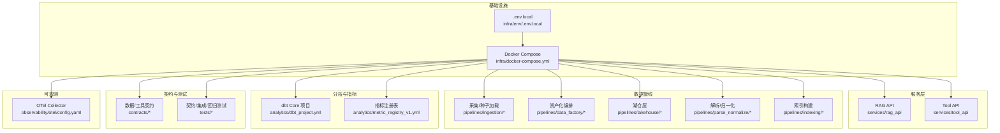

图表来源
- [infra/docker-compose.yml](file://infra/docker-compose.yml)
- [services/rag_api/Dockerfile](file://services/rag_api/Dockerfile)
- [services/tool_api/Dockerfile](file://services/tool_api/Dockerfile)
- [pipelines/definitions.py](file://pipelines/definitions.py)
- [pipelines/ingestion/seed_loader.py](file://pipelines/ingestion/seed_loader.py)
- [pipelines/lakehouse/assets.py](file://pipelines/lakehouse/assets.py)
- [analytics/dbt_project.yml](file://analytics/dbt_project.yml)
- [contracts/data/ticket_contract.json](file://contracts/data/ticket_contract.json)
- [tests/contract/test_week02_gate.py](file://tests/contract/test_week02_gate.py)

章节来源
- [README.md:183-216](file://README.md#L183-L216)

## 核心组件
- RAG API（端口 8000）：提供检索增强生成服务，支持健康检查、查询路由、管理员端口与审计日志。
- Tool API（端口 8001）：提供工单查询/创建、指标查询、人工介入（HITL）等工具调用。
- 湖仓层（Iceberg）：在 Week04 引入 Bronze/Silver/Gold 三层物化表，支持快照、时间旅行与模式演进。
- 资产化编排（Dagster）：Week06 引入每日分区、回填计划、资产检查与运行证据。
- 分析工程（dbt Core）：Week05 引入 KPI Mart 与指标注册表，提供受控查询工具。
- 契约体系：Week02-Week08 逐步完善数据契约、工具契约与发布契约，贯穿开发与交付。
- 可观测：OpenTelemetry + Phoenix，预埋 trace_id 与 release_id，便于追踪与回放。

章节来源
- [README.md:106-131](file://README.md#L106-L131)
- [services/rag_api/Dockerfile](file://services/rag_api/Dockerfile)
- [services/tool_api/Dockerfile](file://services/tool_api/Dockerfile)
- [pipelines/lakehouse/assets.py](file://pipelines/lakehouse/assets.py)
- [pipelines/data_factory/jobs.py](file://pipelines/data_factory/jobs.py)
- [analytics/dbt_project.yml](file://analytics/dbt_project.yml)

## 架构总览
系统采用“数据优先、工作流优先、证据优先”的实施原则，围绕 seven-layer 架构展开：对象存储（MinIO）、结构化+向量检索（PostgreSQL+pgvector）、湖仓层（Apache Iceberg）、编排层（Dagster）、服务层（FastAPI）、可观测（OTel+Phoenix）、契约层（JSON Schema）。Week01-Week08 逐步扩展，最终形成可复现、可观测、可回滚、可审计的工程闭环。

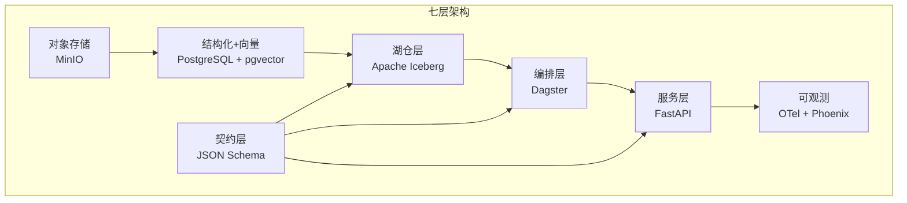

图表来源
- [README.md:106-131](file://README.md#L106-L131)

章节来源
- [README.md:106-131](file://README.md#L106-L131)

## 详细组件分析

### 开发环境与本地开发流程
- 前置条件：Docker Desktop/Engine 24+、Docker Compose V2、现代浏览器；可选 ANTHROPIC_API_KEY。
- 环境变量：复制示例文件为本地配置，必要时填写 API Key。
- 启动服务：使用 Compose 启动所有服务，验证 RAG API、Tool API、Dagster、MinIO、Phoenix 健康状态。
- 生成种子数据：通过 devbox 容器运行合成器生成工单数据。
- Dry-run 种子加载：验证清单校验与准入门禁。
- 契约测试：在 devbox 容器中运行契约测试，确保数据/工具/发布契约一致。
- 冒烟测试：对 RAG API 发送查询，确认返回包含答案、证据、置信度、release_id、trace_id。
- 清理：停止服务或删除数据卷进行完全清理。

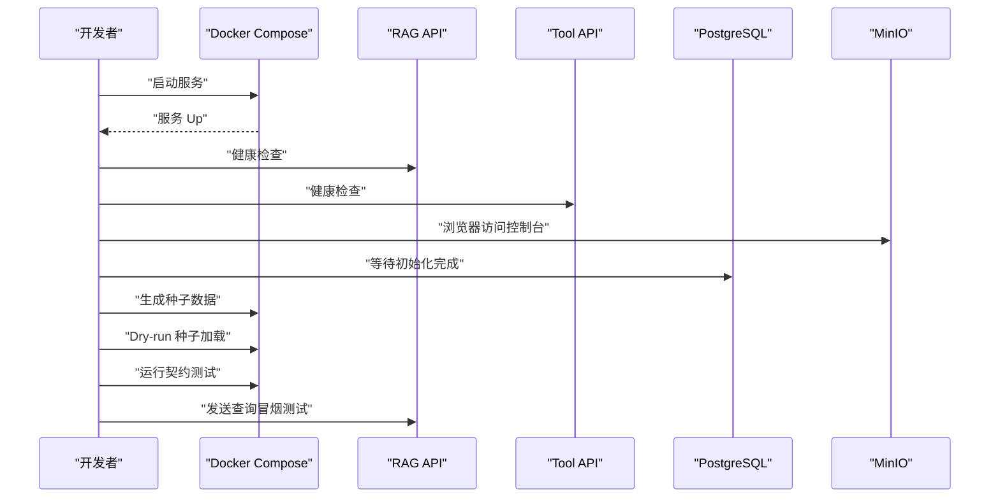

图表来源
- [runbooks/week01-startup.md:33-115](file://runbooks/week01-startup.md#L33-L115)
- [README.md:54-90](file://README.md#L54-L90)

章节来源
- [runbooks/week01-startup.md:8-147](file://runbooks/week01-startup.md#L8-L147)
- [README.md:14-90](file://README.md#L14-L90)

### 采集与种子加载（Week03）
- 采集主链路：结构化工单与文档资产分别由 ticket_ingest.py 与 doc_ingest.py 处理。
- 种子加载：seed_loader.py 读取多个清单，输出 smoke 报告。
- 状态与回放：检查 data/canonization/checkpoints 下的 ingest_state.json，支持 replay/backfill dry-run。
- 集成测试：Week03 新增集成测试，验证采集与状态一致性。

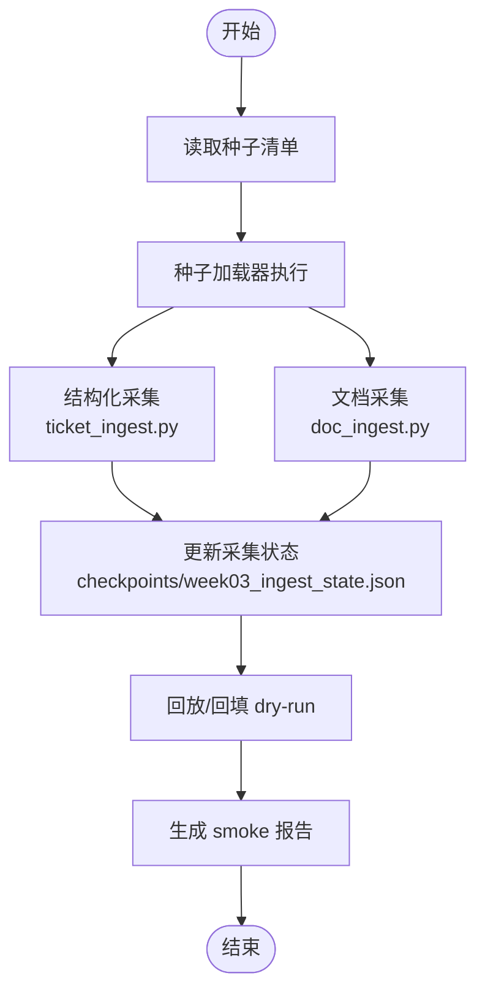

图表来源
- [runbooks/ingestion_runbook_v1.md:52-97](file://runbooks/ingestion_runbook_v1.md#L52-L97)
- [pipelines/ingestion/seed_loader.py](file://pipelines/ingestion/seed_loader.py)
- [pipelines/ingestion/ticket_ingest.py](file://pipelines/ingestion/ticket_ingest.py)
- [pipelines/ingestion/doc_ingest.py](file://pipelines/ingestion/doc_ingest.py)

章节来源
- [runbooks/ingestion_runbook_v1.md:1-111](file://runbooks/ingestion_runbook_v1.md#L1-L111)

### 湖仓层（Week04）
- Catalog 与 Warehouse：PyIceberg SQL Catalog、MinIO Bucket、命名空间与核心表。
- Bronze/Silver/Gold：Bronze 保真落盘，Silver 规范化可查询，Gold 语义层（本阶段为预留）。
- 物化与元数据：materialize 将 Week03 结果物化到 Iceberg，inspect_metadata 支持快照查看。
- 时间旅行与回滚：通过快照与基线实现可追溯与可回滚。

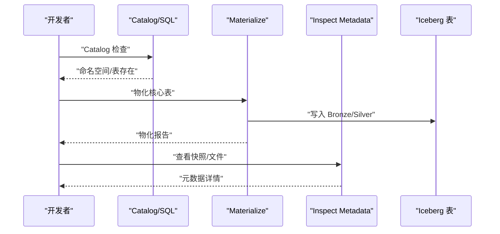

图表来源
- [runbooks/lakehouse_runbook.md:59-74](file://runbooks/lakehouse_runbook.md#L59-L74)
- [pipelines/lakehouse/catalog.py](file://pipelines/lakehouse/catalog.py)
- [pipelines/lakehouse/materialize.py](file://pipelines/lakehouse/materialize.py)
- [pipelines/lakehouse/assets.py](file://pipelines/lakehouse/assets.py)

章节来源
- [runbooks/lakehouse_runbook.md:1-82](file://runbooks/lakehouse_runbook.md#L1-L82)

### 资产化编排（Week06）
- 资产图与分区：Dagster 资产图、每日分区、backfill dry-run。
- 资产检查与运行证据：资产完整性检查、运行证据生成与校验。
- 可加载性测试：验证定义可加载，确保编排稳定性。

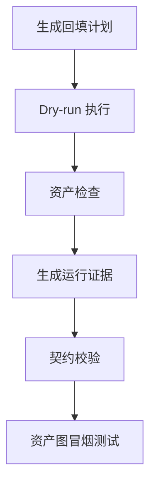

图表来源
- [runbooks/week06-data-factory.md](file://runbooks/week06-data-factory.md)
- [pipelines/data_factory/evidence.py](file://pipelines/data_factory/evidence.py)
- [tests/integration/test_week06_asset_graph_smoke.py](file://tests/integration/test_week06_asset_graph_smoke.py)

章节来源
- [runbooks/week06-data-factory.md](file://runbooks/week06-data-factory.md)

### 分析工程与指标（Week05）
- dbt 模型构建：在 analytics 目录下使用 profiles.yml 进行构建与测试。
- 指标注册表：通过 validate_metric_registry.py 校验指标注册表。
- 受控查询工具：通过 Tool API 的 KPI 查询工具访问 agent_tool_input_view。

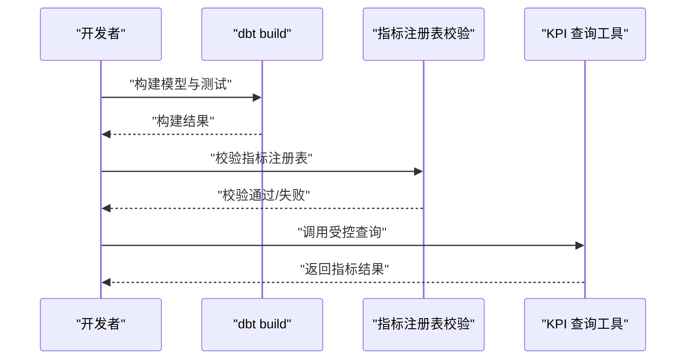

图表来源
- [README.md:266-290](file://README.md#L266-L290)
- [analytics/dbt_project.yml](file://analytics/dbt_project.yml)
- [analytics/metric_registry_v1.yml](file://analytics/metric_registry_v1.yml)

章节来源
- [README.md:266-290](file://README.md#L266-L290)

### 契约与测试
- 数据契约：ticket_contract.json 等，确保数据结构一致。
- 工具契约：create_ticket、get_ticket_status、query_support_kpis_v1、search_knowledge 等工具定义。
- 契约测试：tests/contract 下的各类测试，覆盖 Week02、Week05、Week06、Week08。
- 集成测试：Week04-Week08 的集成冒烟测试，验证端到端链路。

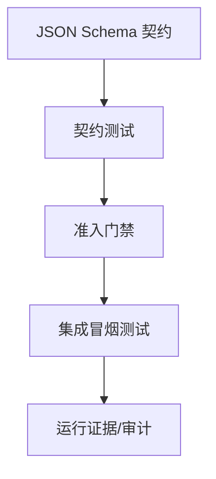

图表来源
- [contracts/data/ticket_contract.json](file://contracts/data/ticket_contract.json)
- [contracts/tools/tools/query_support_kpis_v1.json](file://contracts/tools/tools/query_support_kpis_v1.json)
- [tests/contract/test_week02_gate.py](file://tests/contract/test_week02_gate.py)
- [tests/contract/test_week05_metric_contracts.py](file://tests/contract/test_week05_metric_contracts.py)
- [tests/contract/test_week06_run_evidence_schema.py](file://tests/contract/test_week06_run_evidence_schema.py)
- [tests/contract/test_week8_rag_contracts.py](file://tests/contract/test_week8_rag_contracts.py)
- [tests/integration/test_rag_api_smoke.py](file://tests/integration/test_rag_api_smoke.py)

章节来源
- [contracts/data/ticket_contract.json](file://contracts/data/ticket_contract.json)
- [contracts/tools/tools/create_ticket.json](file://contracts/tools/tools/create_ticket.json)
- [contracts/tools/tools/get_ticket_status.json](file://contracts/tools/tools/get_ticket_status.json)
- [contracts/tools/tools/query_support_kpis_v1.json](file://contracts/tools/tools/query_support_kpis_v1.json)
- [contracts/tools/tools/search_knowledge.json](file://contracts/tools/tools/search_knowledge.json)
- [tests/contract/test_week02_gate.py](file://tests/contract/test_week02_gate.py)
- [tests/contract/test_week05_metric_contracts.py](file://tests/contract/test_week05_metric_contracts.py)
- [tests/contract/test_week06_run_evidence_schema.py](file://tests/contract/test_week06_run_evidence_schema.py)
- [tests/contract/test_week8_rag_contracts.py](file://tests/contract/test_week8_rag_contracts.py)
- [tests/integration/test_rag_api_smoke.py](file://tests/integration/test_rag_api_smoke.py)

### 服务层（FastAPI）
- RAG API：路由包含查询、健康检查、管理员端口与审计。
- Tool API：路由包含健康检查、KPI 查询、工单工具。
- Docker 化：各自拥有 Dockerfile 与 requirements.txt，便于独立打包与部署。

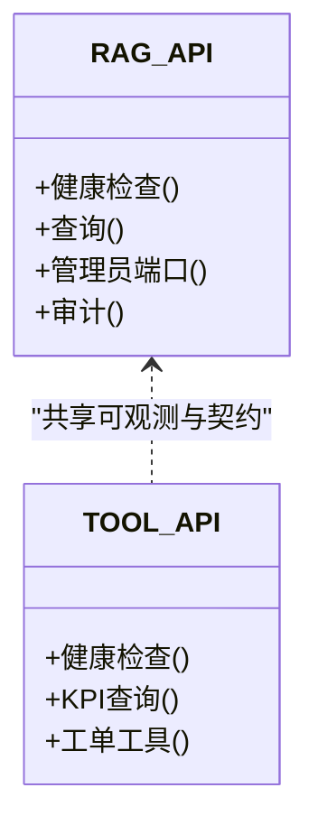

图表来源
- [services/rag_api/Dockerfile](file://services/rag_api/Dockerfile)
- [services/rag_api/requirements.txt](file://services/rag_api/requirements.txt)
- [services/tool_api/Dockerfile](file://services/tool_api/Dockerfile)
- [services/tool_api/requirements.txt](file://services/tool_api/requirements.txt)

章节来源
- [services/rag_api/Dockerfile](file://services/rag_api/Dockerfile)
- [services/tool_api/Dockerfile](file://services/tool_api/Dockerfile)

### 评测与回归
- 评测集：workspace_qa_v1.jsonl。
- 评估执行器：eval_runner.py。
- 回归评测：eval_regression 下的回归门禁测试。
- Week08 烟雾评测：run_smoke_eval.py。

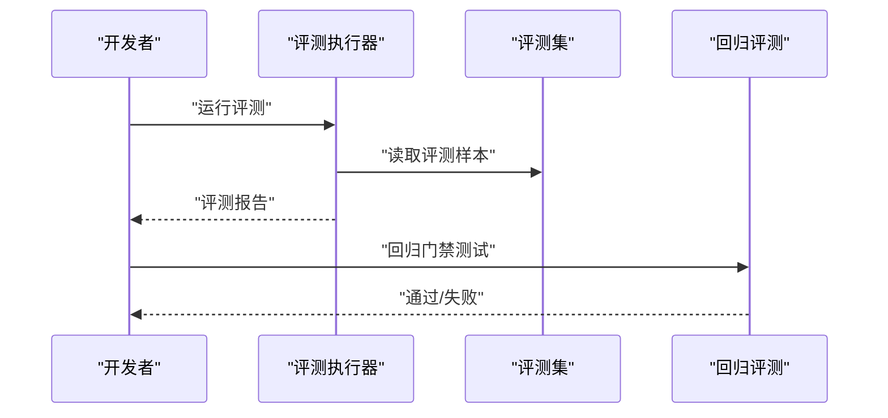

图表来源
- [evals/harness/eval_runner.py](file://evals/harness/eval_runner.py)
- [evals/sets/workspace_qa_v1.jsonl](file://evals/sets/workspace_qa_v1.jsonl)
- [evals/week08/run_smoke_eval.py](file://evals/week08/run_smoke_eval.py)
- [tests/eval_regression/test_regression_gate.py](file://tests/eval_regression/test_regression_gate.py)

章节来源
- [evals/harness/eval_runner.py](file://evals/harness/eval_runner.py)
- [evals/sets/workspace_qa_v1.jsonl](file://evals/sets/workspace_qa_v1.jsonl)
- [evals/week08/run_smoke_eval.py](file://evals/week08/run_smoke_eval.py)
- [tests/eval_regression/test_regression_gate.py](file://tests/eval_regression/test_regression_gate.py)

## 依赖分析
- 构建系统：pyproject.toml 定义了项目元信息与可选开发依赖（pytest、ruff、mypy、pyiceberg、dbt、dagster 等）。
- 服务依赖：RAG API 与 Tool API 的 requirements.txt 明确运行时依赖。
- Compose 依赖：docker-compose.yml 统一编排服务、网络与卷。
- 环境变量：.env.example 提供默认值，.env.local 用于本地覆盖。

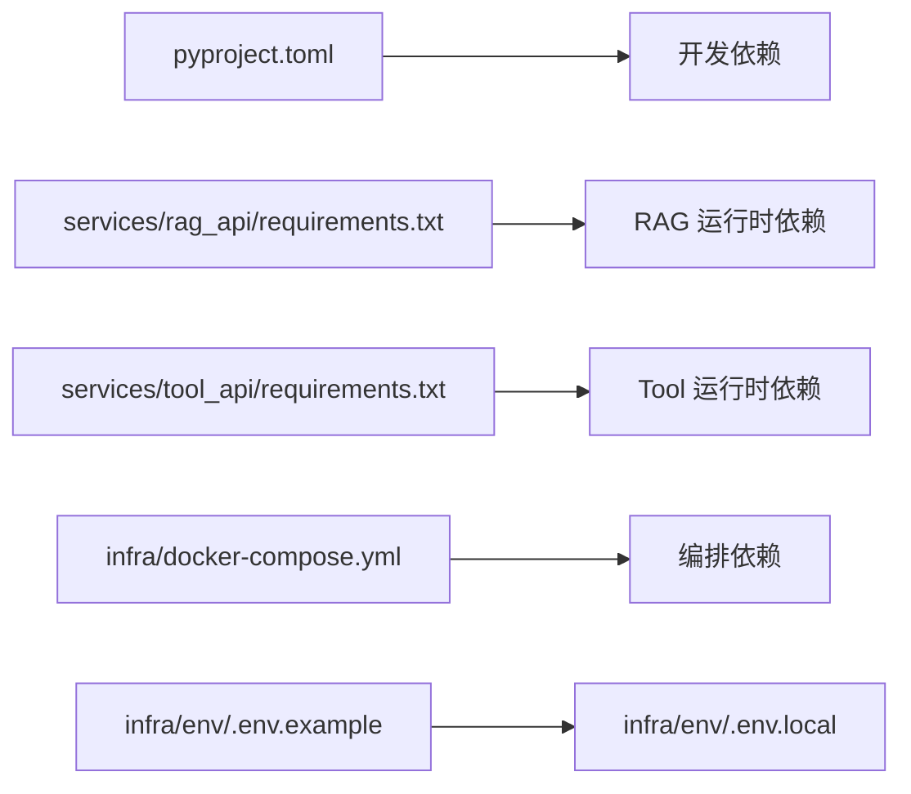

图表来源
- [pyproject.toml:16-31](file://pyproject.toml#L16-L31)
- [services/rag_api/requirements.txt](file://services/rag_api/requirements.txt)
- [services/tool_api/requirements.txt](file://services/tool_api/requirements.txt)
- [infra/docker-compose.yml](file://infra/docker-compose.yml)
- [infra/env/.env.example](file://infra/env/.env.example)

章节来源
- [pyproject.toml:1-49](file://pyproject.toml#L1-L49)
- [services/rag_api/requirements.txt](file://services/rag_api/requirements.txt)
- [services/tool_api/requirements.txt](file://services/tool_api/requirements.txt)
- [infra/docker-compose.yml](file://infra/docker-compose.yml)
- [infra/env/.env.example](file://infra/env/.env.example)

## 性能考虑
- 数据规模：根据 Student Core Pack 与 Instructor Scale Pack 的内存/CPU/磁盘建议，合理规划数据包大小与批处理参数。
- 湖仓层性能：Iceberg 的快照与时间旅行有助于快速回滚与对比，减少重复计算；合理设置分区与列式存储可提升查询性能。
- 服务性能：RAG API 与 Tool API 的并发与超时配置应在 Compose 中统一管理，避免资源争用。
- 可观测：OTel 与 Phoenix 的 trace_id 与 release_id 便于定位热点与异常，建议在开发与测试阶段开启采样。

## 故障排除指南
- minio_init 退出非 0：等待 MinIO 就绪后重试初始化容器。
- rag_api 健康检查返回 database: down：等待数据库初始化脚本执行完成。
- devbox 首次构建失败：先执行 devbox 镜像构建，再运行命令。
- 契约测试失败：检查 contracts 目录结构与 JSON Schema 文件是否完整。
- Podman 兼容：参考 runbooks/podman-local.md 进行兼容性验证与排障。

章节来源
- [runbooks/week01-startup.md:128-147](file://runbooks/week01-startup.md#L128-L147)
- [runbooks/podman-local.md](file://runbooks/podman-local.md)

## 结论
本指南提供了 OmniSupport Copilot 的完整开发路径：从 Week01 工程基线到 Week08 RAG API，再到 Week09-15 的工具层与治理。通过 Docker Compose 的统一编排、契约驱动的测试体系、湖仓层的可复现与可回滚能力，以及可观测的追踪机制，开发者可以在本地高效迭代并持续交付高质量功能。

## 附录

### 开发环境设置清单
- 安装 Docker Desktop/Engine 24+ 与 Docker Compose V2
- 复制并编辑 .env.local（可选：填写 ANTHROPIC_API_KEY）
- 启动服务并通过健康检查
- 生成种子数据并运行契约测试
- 运行集成冒烟测试

章节来源
- [runbooks/week01-startup.md:8-101](file://runbooks/week01-startup.md#L8-L101)
- [README.md:14-90](file://README.md#L14-L90)

### 代码规范与提交规范
- Lint：使用 ruff，遵循 E/F/I/N/W 规则，行宽 100。
- 类型检查：使用 mypy。
- 测试：pytest 配置位于 pyproject.toml，测试文件命名与发现规则已定义。
- 提交建议：遵循“证据优先”原则，每次提交附带最小可复现的契约测试或集成测试。

章节来源
- [pyproject.toml:33-49](file://pyproject.toml#L33-L49)

### 贡献指南
- 参与方式：通过仓库内的 runbooks、tests、contracts、analytics、pipelines 等模块进行功能扩展与验证。
- 提交补丁：基于契约与测试先行的原则，确保新增功能通过契约测试与集成冒烟测试。
- 讨论与评审：结合 weekly runbooks 与课程蓝图，参与跨模块讨论与代码审查。

章节来源
- [README.md:325-341](file://README.md#L325-L341)

### 开发最佳实践
- 数据优先：先完善数据层与湖仓层，再扩展生成层。
- 工作流优先：先保证稳定的工作流，再引入复杂 Agent。
- 证据优先：所有回答必须带 evidence_anchor/citation。
- 发布感知：所有服务预埋 release_id 与 trace_id。
- 双规模：兼顾 Student Core Pack 与 Instructor Scale Pack 的可运行性。

章节来源
- [README.md:325-341](file://README.md#L325-L341)

### 扩展与新特性
- 新数据源：在 contracts/data 下新增契约并在 pipelines/ingestion 中接入采集流程。
- 新工具：在 contracts/tools 下定义工具契约，在 services/tool_api 中实现路由与调用。
- 新指标：在 analytics/metric_registry_v1.yml 中注册指标，并通过 dbt 模型构建。
- 新资产：在 pipelines/data_factory 中定义资产与分区策略，并通过契约测试与资产图冒烟测试。

章节来源
- [contracts/data/ticket_contract.json](file://contracts/data/ticket_contract.json)
- [contracts/tools/tools/create_ticket.json](file://contracts/tools/tools/create_ticket.json)
- [contracts/tools/tools/get_ticket_status.json](file://contracts/tools/tools/get_ticket_status.json)
- [contracts/tools/tools/query_support_kpis_v1.json](file://contracts/tools/tools/query_support_kpis_v1.json)
- [contracts/tools/tools/search_knowledge.json](file://contracts/tools/tools/search_knowledge.json)
- [analytics/metric_registry_v1.yml](file://analytics/metric_registry_v1.yml)
- [pipelines/data_factory/jobs.py](file://pipelines/data_factory/jobs.py)

### 测试与验证
- 契约测试：tests/contract 下的各类测试，覆盖 Week02、Week05、Week06、Week08。
- 集成测试：tests/integration 下的冒烟测试，验证端到端链路。
- 回归评测：tests/eval_regression 下的回归门禁测试。
- 评测执行：evals/harness/eval_runner.py 与 evals/sets/workspace_qa_v1.jsonl。

章节来源
- [tests/contract/test_week02_gate.py](file://tests/contract/test_week02_gate.py)
- [tests/contract/test_week05_metric_contracts.py](file://tests/contract/test_week05_metric_contracts.py)
- [tests/contract/test_week06_run_evidence_schema.py](file://tests/contract/test_week06_run_evidence_schema.py)
- [tests/contract/test_week8_rag_contracts.py](file://tests/contract/test_week8_rag_contracts.py)
- [tests/integration/test_ingest_state.py](file://tests/integration/test_ingest_state.py)
- [tests/integration/test_rag_api_smoke.py](file://tests/integration/test_rag_api_smoke.py)
- [tests/integration/test_week06_asset_graph_smoke.py](file://tests/integration/test_week06_asset_graph_smoke.py)
- [evals/harness/eval_runner.py](file://evals/harness/eval_runner.py)
- [evals/sets/workspace_qa_v1.jsonl](file://evals/sets/workspace_qa_v1.jsonl)
- [evals/week08/run_smoke_eval.py](file://evals/week08/run_smoke_eval.py)

### 调试与性能分析
- 调试技巧：利用 Phoenix 仪表盘查看 trace_id，结合 OTel Collector 配置定位问题。
- 性能分析：在服务层与湖仓层分别进行查询与物化性能分析，关注分区与快照策略。
- 日志与审计：RAG API 与 Tool API 的审计日志可用于回放与问题复现。

章节来源
- [observability/otel/config.yaml](file://observability/otel/config.yaml)
- [services/rag_api/app/audit.py](file://services/rag_api/app/audit.py)
- [services/tool_api/app/main.py](file://services/tool_api/app/main.py)