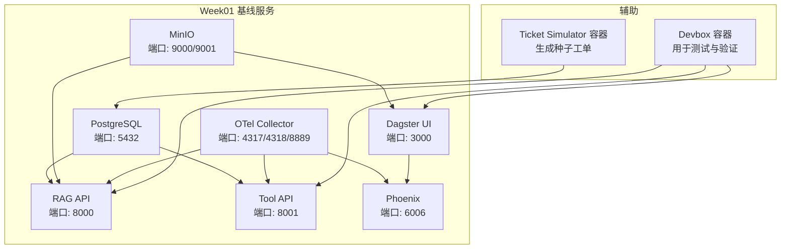
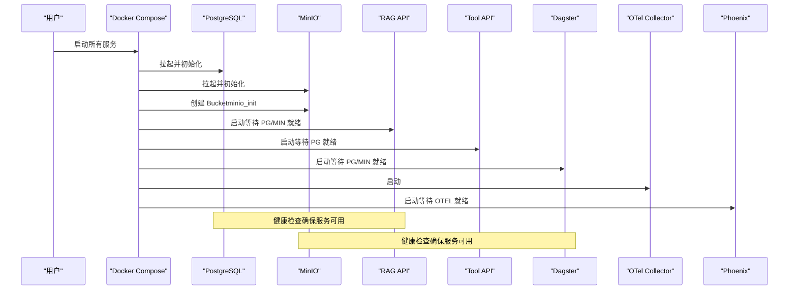
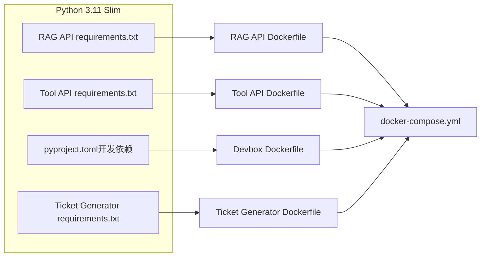

# 快速开始

<cite>
**本文引用的文件**
- [runbooks/week01-startup.md](file://runbooks/week01-startup.md)
- [infra/docker-compose.yml](file://infra/docker-compose.yml)
- [runbooks/podman-local.md](file://runbooks/podman-local.md)
- [services/rag_api/Dockerfile](file://services/rag_api/Dockerfile)
- [services/tool_api/Dockerfile](file://services/tool_api/Dockerfile)
- [infra/devbox.Dockerfile](file://infra/devbox.Dockerfile)
- [data/synthetic_generators/Dockerfile](file://data/synthetic_generators/Dockerfile)
- [services/rag_api/requirements.txt](file://services/rag_api/requirements.txt)
- [services/tool_api/requirements.txt](file://services/tool_api/requirements.txt)
- [data/synthetic_generators/requirements.txt](file://data/synthetic_generators/requirements.txt)
- [pyproject.toml](file://pyproject.toml)
- [analytics/profiles.yml.example](file://analytics/profiles.yml.example)
</cite>

## 目录
1. [简介](#简介)
2. [项目结构](#项目结构)
3. [核心组件](#核心组件)
4. [架构总览](#架构总览)
5. [详细组件分析](#详细组件分析)
6. [依赖分析](#依赖分析)
7. [性能考虑](#性能考虑)
8. [故障排除指南](#故障排除指南)
9. [结论](#结论)
10. [附录](#附录)

## 简介
本指南面向 Week01 工程基线的快速启动，采用“仅 Docker”路线，无需在本地预先安装 Python 依赖。您将完成环境准备、依赖安装、服务启动与健康验证，并在受限网络环境下使用 Podman 作为替代方案。文档覆盖 macOS、Linux、Windows 的注意事项，并提供从复制环境变量、启动所有服务、验证健康状态到生成种子数据的完整流程。

## 项目结构
- Week01 基线由 Docker Compose 编排，包含 PostgreSQL、MinIO、RAG API、Tool API、Dagster、OpenTelemetry Collector、Phoenix 等服务。
- 通过 devbox 容器提供统一的本地开发与验证环境，避免在宿主机安装 Python 依赖。
- Podman 在受限环境中作为 Compose 兼容的替代运行时，遵循相同的 compose 配置。

图表来源
- [infra/docker-compose.yml:1-340](file://infra/docker-compose.yml#L1-L340)

章节来源
- [runbooks/week01-startup.md:19-43](file://runbooks/week01-startup.md#L19-L43)
- [infra/docker-compose.yml:1-340](file://infra/docker-compose.yml#L1-L340)

## 核心组件
- PostgreSQL：结构化数据与向量检索（pgvector），挂载迁移脚本，健康检查基于数据库就绪。
- MinIO：S3 兼容对象存储，自动创建多个 bucket；提供 Web 控制台与 API。
- RAG API：FastAPI 服务，暴露健康检查与查询接口，连接数据库与对象存储，集成可观测性。
- Tool API：工单工具与 KPI 查询服务，连接数据库与指标注册表，集成可观测性。
- Dagster：资产化编排与数据管线开发界面，连接数据库与对象存储。
- OpenTelemetry Collector：统一采集 trace/metrics/logs 并导出至 Phoenix。
- Phoenix：AI 请求可观测平台，消费 OTLP 数据。
- Devbox：统一的本地验证容器，内置项目依赖与工具链。
- Ticket Simulator：生成合成工单数据，写入对象存储或本地目录。

章节来源
- [infra/docker-compose.yml:19-121](file://infra/docker-compose.yml#L19-L121)
- [infra/docker-compose.yml:126-153](file://infra/docker-compose.yml#L126-L153)
- [infra/docker-compose.yml:158-225](file://infra/docker-compose.yml#L158-L225)
- [infra/docker-compose.yml:230-262](file://infra/docker-compose.yml#L230-L262)
- [infra/docker-compose.yml:288-340](file://infra/docker-compose.yml#L288-L340)

## 架构总览
下图展示 Week01 基线的启动顺序与依赖关系：先启动数据库与对象存储，再启动 API 与编排服务，最后启动可观测性组件。

图表来源
- [infra/docker-compose.yml:32-60](file://infra/docker-compose.yml#L32-L60)
- [infra/docker-compose.yml:108-121](file://infra/docker-compose.yml#L108-L121)
- [infra/docker-compose.yml:140-153](file://infra/docker-compose.yml#L140-L153)
- [infra/docker-compose.yml:209-214](file://infra/docker-compose.yml#L209-L214)
- [infra/docker-compose.yml:240-262](file://infra/docker-compose.yml#L240-L262)

## 详细组件分析

### 环境准备与依赖安装
- 安装要求
  - Docker Desktop 或 Docker Engine（版本 ≥ 24.0）
  - Docker Compose V2（可用命令 docker compose）
  - 可选：Anthropic API Key（Week01 可留空以验证工程基线）
- 依赖安装
  - 无需在宿主机安装 Python 依赖；Week01 推荐使用 devbox 容器进行本地验证。
  - 项目根目录提供统一的开发依赖声明与工具配置，便于在容器内复用。

章节来源
- [runbooks/week01-startup.md:8-16](file://runbooks/week01-startup.md#L8-L16)
- [pyproject.toml:17-31](file://pyproject.toml#L17-L31)

### 环境变量与配置
- 复制并编辑环境变量文件
  - 复制示例文件为本地配置
  - 如需真实 LLM 调用，填写第三方模型密钥（Week01 可留空）
- 关键环境变量（来自 compose 配置）
  - 数据库：POSTGRES_USER、POSTGRES_PASSWORD、POSTGRES_DB
  - 对象存储：MINIO_ROOT_USER、MINIO_ROOT_PASSWORD、MINIO_ENDPOINT
  - 可观测性：OTEL_EXPORTER_OTLP_ENDPOINT、OTEL_SERVICE_NAME
  - 发布标识：RELEASE_ID
  - 分析与指标：METRIC_REGISTRY_PATH、DBT_* 系列变量

章节来源
- [runbooks/week01-startup.md:21-29](file://runbooks/week01-startup.md#L21-L29)
- [infra/docker-compose.yml:23-105](file://infra/docker-compose.yml#L23-L105)
- [analytics/profiles.yml.example:1-14](file://analytics/profiles.yml.example#L1-L14)

### 服务启动与健康验证
- 启动所有服务
  - 使用 docker compose 指令指定环境文件与 compose 文件，后台启动并按需构建镜像
- 健康验证
  - RAG API 健康检查：访问本地端口健康路径
  - Tool API 健康检查：访问本地端口健康路径
  - MinIO 控制台：浏览器访问本地控制台地址，确认多个 bucket 已创建
  - Dagster UI：浏览器访问本地 UI 地址
  - Phoenix：浏览器访问本地可观测平台地址

章节来源
- [runbooks/week01-startup.md:33-65](file://runbooks/week01-startup.md#L33-L65)
- [infra/docker-compose.yml:32-60](file://infra/docker-compose.yml#L32-L60)
- [infra/docker-compose.yml:108-121](file://infra/docker-compose.yml#L108-L121)
- [infra/docker-compose.yml:140-153](file://infra/docker-compose.yml#L140-L153)

### 生成种子数据与契约测试
- 生成种子工单数据
  - 使用 devbox 容器运行数据生成脚本，产出指定数量的工单数据
- dry-run 种子加载
  - 使用 devbox 容器运行种子加载器，校验多个清单文件
- 契约测试
  - 使用 devbox 容器运行契约测试集，确保 Week01 基线通过

章节来源
- [runbooks/week01-startup.md:69-99](file://runbooks/week01-startup.md#L69-L99)
- [infra/docker-compose.yml:288-340](file://infra/docker-compose.yml#L288-L340)

### 冒烟测试与发布清单验证
- RAG API 冒烟查询
  - 发送测试查询请求，确认响应包含关键字段
- 发布清单验证
  - 获取发布清单，确认 release_id 符合预期

章节来源
- [runbooks/week01-startup.md:105-124](file://runbooks/week01-startup.md#L105-L124)

### 停止与清理
- 停止服务（保留数据卷）
- 完全清理（删除数据卷）

章节来源
- [runbooks/week01-startup.md:139-147](file://runbooks/week01-startup.md#L139-L147)

### 不同操作系统的注意事项
- macOS
  - 若使用 Podman，建议通过 Podman Desktop 或 CLI 安装并启用 Compose 支持
  - 首次启动可能需要拉取基础镜像，注意网络稳定性
- Linux
  - 确保 Docker/Compose 已正确安装与配置
  - 若使用 Podman，遵循 Podman 兼容性手册中的步骤
- Windows
  - 推荐使用 Docker Desktop；若受限，可参考 Podman 路径
  - 注意端口占用与防火墙设置

章节来源
- [runbooks/podman-local.md:56-97](file://runbooks/podman-local.md#L56-L97)
- [runbooks/podman-local.md:276-297](file://runbooks/podman-local.md#L276-L297)

### 受限环境下的 Podman 替代方案
- Podman 兼容性
  - 项目 compose 配置在受测设备上兼容 Podman，部分特性存在中等风险（如健康检查、depends_on.condition、profiles 等）
  - 首次启动依赖网络访问镜像仓库与包源，建议在受限网络下使用镜像缓存或预加载
- 启动步骤
  - 复制环境变量示例文件
  - 验证 compose 配置解析
  - 启动基础服务（PostgreSQL、MinIO、minio_init）
  - 构建 devbox 容器
  - 运行契约测试与清单门禁冒烟测试
  - 运行 Week05 dbt 解析与构建（在 devbox 内）
  - 运行 Week06 数据工厂冒烟测试
  - 全栈冒烟验证（RAG/Tool/MinIO/Dagster/Phoenix）
- 端口与主机名规则
  - 容器内使用服务名作为主机名；宿主机访问使用本地端口
- 故障排除
  - 常见症状与处理：命令未找到、Compose 提供程序缺失、网络超时、端口占用、容器名称冲突、健康检查失败、权限问题、dbt 连接错误等

章节来源
- [runbooks/podman-local.md:11-55](file://runbooks/podman-local.md#L11-L55)
- [runbooks/podman-local.md:118-247](file://runbooks/podman-local.md#L118-L247)
- [runbooks/podman-local.md:298-324](file://runbooks/podman-local.md#L298-L324)

## 依赖分析
- 语言与运行时
  - 服务与工具均基于 Python 3.11 slim 镜像，减少体积并提升启动速度
- 依赖管理
  - 服务依赖通过 requirements.txt 明确声明
  - 项目根目录提供统一的开发依赖与工具配置
- 构建上下文
  - RAG API、Tool API、Devbox、Ticket Simulator 均通过 Dockerfile 定义构建上下文与安装流程

图表来源
- [services/rag_api/Dockerfile:1-20](file://services/rag_api/Dockerfile#L1-L20)
- [services/tool_api/Dockerfile:1-16](file://services/tool_api/Dockerfile#L1-L16)
- [infra/devbox.Dockerfile:1-25](file://infra/devbox.Dockerfile#L1-L25)
- [data/synthetic_generators/Dockerfile:1-11](file://data/synthetic_generators/Dockerfile#L1-L11)
- [services/rag_api/requirements.txt:1-29](file://services/rag_api/requirements.txt#L1-L29)
- [services/tool_api/requirements.txt:1-14](file://services/tool_api/requirements.txt#L1-L14)
- [data/synthetic_generators/requirements.txt:1-3](file://data/synthetic_generators/requirements.txt#L1-L3)
- [pyproject.toml:17-31](file://pyproject.toml#L17-L31)

章节来源
- [services/rag_api/requirements.txt:1-29](file://services/rag_api/requirements.txt#L1-L29)
- [services/tool_api/requirements.txt:1-14](file://services/tool_api/requirements.txt#L1-L14)
- [data/synthetic_generators/requirements.txt:1-3](file://data/synthetic_generators/requirements.txt#L1-L3)
- [pyproject.toml:17-31](file://pyproject.toml#L17-L31)

## 性能考虑
- 首次启动时间
  - 首次构建镜像与拉取基础镜像会增加启动时间，建议在网络稳定时进行
- 资源分配
  - 建议为容器分配足够的 CPU 与内存，以保证数据库与对象存储的稳定运行
- 端口与并发
  - 确保宿主机端口未被占用，避免服务启动失败
- 观测性
  - OTel Collector 与 Phoenix 提供统一的可观测性，有助于定位性能瓶颈

## 故障排除指南
- 常见问题与处理
  - minio_init 退出非 0：等待 MinIO 就绪后重试初始化
  - RAG API 健康检查返回数据库异常：等待数据库初始化脚本执行完成
  - devbox 构建失败：先构建 devbox 镜像后再运行容器命令
  - 契约测试失败：检查 contracts 目录结构与文件完整性
- Podman 特定问题
  - 命令未找到或 Compose 提供程序缺失：安装/启用 Podman Compose 支持或手动设置提供程序
  - 网络超时：在稳定网络下重试或使用镜像缓存
  - 端口占用：停止冲突的运行时后再启动
  - 容器名称冲突：移除旧容器后重试
  - 健康检查与启动顺序：等待依赖服务健康后再重试失败命令
  - 权限与卷：重建受影响的 Podman 卷以解决权限问题
  - dbt 连接错误：在 devbox 容器内运行 dbt 命令

章节来源
- [runbooks/week01-startup.md:128-136](file://runbooks/week01-startup.md#L128-L136)
- [runbooks/podman-local.md:298-324](file://runbooks/podman-local.md#L298-L324)

## 结论
通过本快速开始指南，您可以在 macOS、Linux、Windows 上完成 Week01 工程基线的环境准备与服务启动，并在受限网络下使用 Podman 作为替代方案。利用 devbox 容器，您可以免于在宿主机安装 Python 依赖，直接进行冒烟测试、契约测试与种子数据生成，从而快速验证系统功能与数据流。

## 附录
- 命令速查
  - 复制环境变量示例：[runbooks/week01-startup.md:24](file://runbooks/week01-startup.md#L24)
  - 启动所有服务：[runbooks/week01-startup.md:36-38](file://runbooks/week01-startup.md#L36-L38)
  - 健康检查：[runbooks/week01-startup.md:49-65](file://runbooks/week01-startup.md#L49-L65)
  - 生成种子数据：[runbooks/week01-startup.md:72-76](file://runbooks/week01-startup.md#L72-L76)
  - dry-run 种子加载：[runbooks/week01-startup.md:83-88](file://runbooks/week01-startup.md#L83-L88)
  - 契约测试：[runbooks/week01-startup.md:97-99](file://runbooks/week01-startup.md#L97-L99)
  - RAG 冒烟查询：[runbooks/week01-startup.md:109-115](file://runbooks/week01-startup.md#L109-L115)
  - 发布清单验证：[runbooks/week01-startup.md:122-124](file://runbooks/week01-startup.md#L122-L124)
  - 停止与清理：[runbooks/week01-startup.md:141-147](file://runbooks/week01-startup.md#L141-L147)
- Podman 速查
  - 复制环境变量示例：[runbooks/podman-local.md:123-124](file://runbooks/podman-local.md#L123-L124)
  - 验证 compose 配置：[runbooks/podman-local.md:129-130](file://runbooks/podman-local.md#L129-L130)
  - 启动基础服务：[runbooks/podman-local.md:144-146](file://runbooks/podman-local.md#L144-L146)
  - 构建 devbox：[runbooks/podman-local.md:159-161](file://runbooks/podman-local.md#L159-L161)
  - 契约测试：[runbooks/podman-local.md:166-168](file://runbooks/podman-local.md#L166-L168)
  - 清理：[runbooks/podman-local.md:315-323](file://runbooks/podman-local.md#L315-L323)