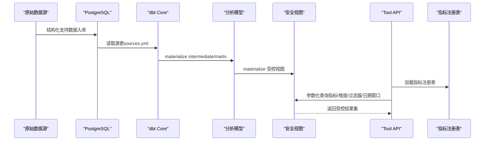
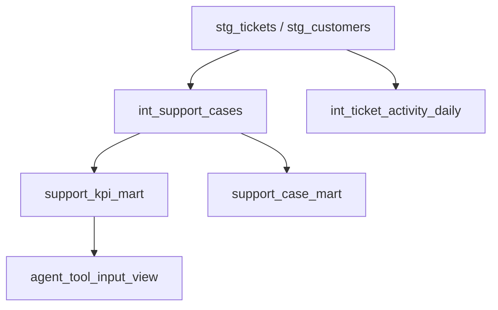
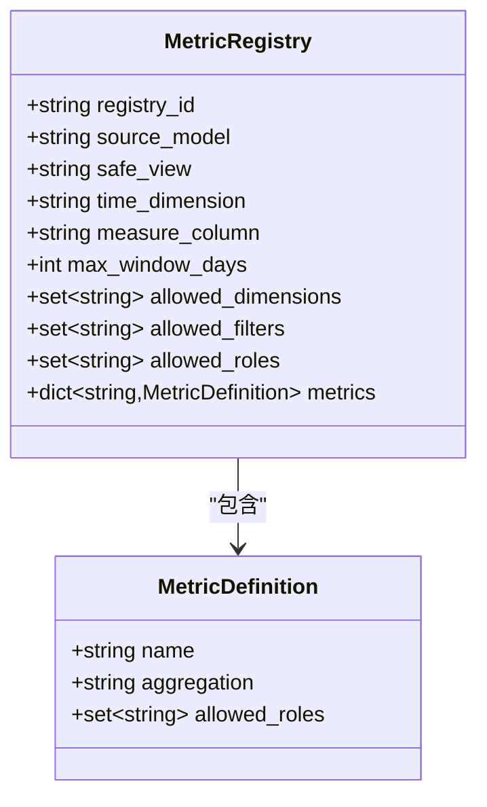
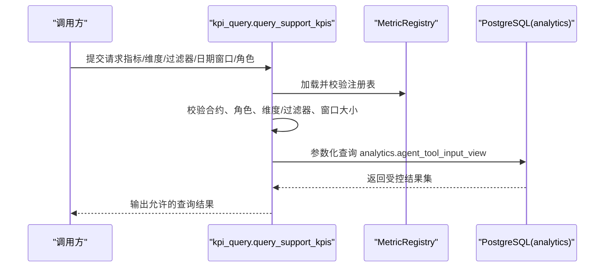
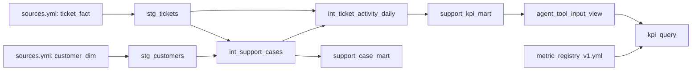

# 数据分析与建模

<cite>
**本文引用的文件**
- [analytics/dbt_project.yml](file://analytics/dbt_project.yml)
- [analytics/models/sources.yml](file://analytics/models/sources.yml)
- [analytics/metric_registry_v1.yml](file://analytics/metric_registry_v1.yml)
- [analytics/profiles.yml](file://analytics/profiles.yml)
- [analytics/README.md](file://analytics/README.md)
- [analytics/models/staging/stg_tickets.sql](file://analytics/models/staging/stg_tickets.sql)
- [analytics/models/staging/stg_customers.sql](file://analytics/models/staging/stg_customers.sql)
- [analytics/models/intermediate/int_support_cases.sql](file://analytics/models/intermediate/int_support_cases.sql)
- [analytics/models/intermediate/int_ticket_activity_daily.sql](file://analytics/models/intermediate/int_ticket_activity_daily.sql)
- [analytics/models/marts/support_kpi_mart.sql](file://analytics/models/marts/support_kpi_mart.sql)
- [analytics/models/marts/support_case_mart.sql](file://analytics/models/marts/support_case_mart.sql)
- [analytics/models/marts/agent_tool_input_view.sql](file://analytics/models/marts/agent_tool_input_view.sql)
- [analytics/scripts/validate_metric_registry.py](file://analytics/scripts/validate_metric_registry.py)
- [services/tool_api/app/kpi_query.py](file://services/tool_api/app/kpi_query.py)
- [services/tool_api/app/metric_registry.py](file://services/tool_api/app/metric_registry.py)
</cite>

## 目录
1. [引言](#引言)
2. [项目结构](#项目结构)
3. [核心组件](#核心组件)
4. [架构总览](#架构总览)
5. [详细组件分析](#详细组件分析)
6. [依赖关系分析](#依赖关系分析)
7. [性能考量](#性能考量)
8. [故障排查指南](#故障排查指南)
9. [结论](#结论)
10. [附录](#附录)

## 引言
本文件面向 OmniSupport Copilot 的数据分析与建模体系，围绕基于 dbt Core 的数据建模架构展开，系统性说明模型分层（Bronze/Silver/Gold）设计、数据转换逻辑与血缘追踪机制；详解 KPI 指标系统（指标定义、计算规则、注册表治理）；阐述数据仓库设计理念与最终分析模型；并给出指标计算的性能优化、缓存策略与实时性考虑，以及数据质量保证、模型版本管理与依赖关系管理方法。最后提供扩展新指标、新增数据源与查询性能优化的实践建议。

## 项目结构
Analytics 工程采用 dbt Core 项目组织方式，按“staging → intermediate → marts”三层建模路径构建，结合工具侧安全视图与指标注册表，形成可审计、可治理的 KPI 查询通道。

```mermaid
graph TB
subgraph "数据源"
SRC["PostgreSQL 表<br/>ticket_fact / customer_dim / ticket_comment_fact / knowledge_doc"]
end
subgraph "dbt 模型"
STG_T["staging.stg_tickets"]
STG_C["staging.stg_customers"]
INT_CASES["intermediate.int_support_cases"]
INT_DAILY["intermediate.int_ticket_activity_daily"]
MART_KPI["marts.support_kpi_mart"]
MART_CASE["marts.support_case_mart"]
SAFE_VIEW["marts.agent_tool_input_view"]
end
subgraph "工具接口"
TOOL_API["Tool API 路由 kpis.py"]
REGISTRY["metric_registry.py"]
end
SRC --> STG_T
SRC --> STG_C
STG_T --> INT_CASES
STG_C --> INT_CASES
STG_T --> INT_DAILY
STG_C --> INT_DAILY
INT_CASES --> INT_DAILY
INT_DAILY --> MART_KPI
INT_CASES --> MART_CASE
MART_KPI --> SAFE_VIEW
SAFE_VIEW --> TOOL_API
TOOL_API --> REGISTRY
```

图表来源
- [analytics/models/staging/stg_tickets.sql:1-43](file://analytics/models/staging/stg_tickets.sql#L1-L43)
- [analytics/models/staging/stg_customers.sql:1-9](file://analytics/models/staging/stg_customers.sql#L1-L9)
- [analytics/models/intermediate/int_support_cases.sql:1-62](file://analytics/models/intermediate/int_support_cases.sql#L1-L62)
- [analytics/models/intermediate/int_ticket_activity_daily.sql:1-16](file://analytics/models/intermediate/int_ticket_activity_daily.sql#L1-L16)
- [analytics/models/marts/support_kpi_mart.sql:1-150](file://analytics/models/marts/support_kpi_mart.sql#L1-L150)
- [analytics/models/marts/support_case_mart.sql:1-31](file://analytics/models/marts/support_case_mart.sql#L1-L31)
- [analytics/models/marts/agent_tool_input_view.sql:1-22](file://analytics/models/marts/agent_tool_input_view.sql#L1-L22)
- [services/tool_api/app/kpi_query.py:1-271](file://services/tool_api/app/kpi_query.py#L1-L271)
- [services/tool_api/app/metric_registry.py:1-82](file://services/tool_api/app/metric_registry.py#L1-L82)

章节来源
- [analytics/dbt_project.yml:18-28](file://analytics/dbt_project.yml#L18-L28)
- [analytics/models/sources.yml:1-43](file://analytics/models/sources.yml#L1-L43)
- [analytics/README.md:1-16](file://analytics/README.md#L1-L16)

## 核心组件
- dbt 项目配置：定义模型路径、目标路径、材料化策略与标签，统一工程入口与构建范围。
- 指标注册表：集中声明可用指标、允许维度/过滤器、时间维度、度量列、最大窗口天数与角色权限，作为工具侧查询的唯一契约。
- 安全视图：仅暴露受控列集，屏蔽敏感字段，确保只读访问与最小暴露面。
- 工具侧查询引擎：严格校验请求、注册表与合约，生成参数化 SQL 访问安全视图，输出受控结果。

章节来源
- [analytics/dbt_project.yml:1-32](file://analytics/dbt_project.yml#L1-L32)
- [analytics/metric_registry_v1.yml:1-56](file://analytics/metric_registry_v1.yml#L1-L56)
- [analytics/models/marts/agent_tool_input_view.sql:1-22](file://analytics/models/marts/agent_tool_input_view.sql#L1-L22)
- [services/tool_api/app/kpi_query.py:1-271](file://services/tool_api/app/kpi_query.py#L1-L271)

## 架构总览
下图展示从原始数据到 KPI 查询的端到端流程：数据源经清洗与整合后形成中间层与汇总层模型，再通过安全视图向工具 API 提供受控查询能力。

图表来源
- [analytics/models/sources.yml:1-43](file://analytics/models/sources.yml#L1-L43)
- [analytics/dbt_project.yml:18-28](file://analytics/dbt_project.yml#L18-L28)
- [analytics/models/marts/agent_tool_input_view.sql:1-22](file://analytics/models/marts/agent_tool_input_view.sql#L1-L22)
- [services/tool_api/app/kpi_query.py:1-271](file://services/tool_api/app/kpi_query.py#L1-L271)
- [services/tool_api/app/metric_registry.py:1-82](file://services/tool_api/app/metric_registry.py#L1-L82)

## 详细组件分析

### 数据建模分层与血缘
- Staging 层：对源表进行标准化、类型转换、派生布尔标志与派生日期等，确保后续聚合稳定。
- Intermediate 层：连接客户与工单，计算首次响应时长、积压天数等派生指标，形成统一案例视图。
- Mart 层：按日聚合产出 KPI 汇总表，并将宽表展平为“指标名-指标值”键值对，形成统一 KPI 表；同时保留案例级明细 Mart 以满足回溯与审计需求。
- 安全视图：仅暴露注册表允许的列，限制输出字段，保障最小暴露面与合规。

图表来源
- [analytics/models/staging/stg_tickets.sql:1-43](file://analytics/models/staging/stg_tickets.sql#L1-L43)
- [analytics/models/staging/stg_customers.sql:1-9](file://analytics/models/staging/stg_customers.sql#L1-L9)
- [analytics/models/intermediate/int_support_cases.sql:1-62](file://analytics/models/intermediate/int_support_cases.sql#L1-L62)
- [analytics/models/intermediate/int_ticket_activity_daily.sql:1-16](file://analytics/models/intermediate/int_ticket_activity_daily.sql#L1-L16)
- [analytics/models/marts/support_kpi_mart.sql:1-150](file://analytics/models/marts/support_kpi_mart.sql#L1-L150)
- [analytics/models/marts/support_case_mart.sql:1-31](file://analytics/models/marts/support_case_mart.sql#L1-L31)
- [analytics/models/marts/agent_tool_input_view.sql:1-22](file://analytics/models/marts/agent_tool_input_view.sql#L1-L22)

章节来源
- [analytics/models/staging/stg_tickets.sql:1-43](file://analytics/models/staging/stg_tickets.sql#L1-L43)
- [analytics/models/staging/stg_customers.sql:1-9](file://analytics/models/staging/stg_customers.sql#L1-L9)
- [analytics/models/intermediate/int_support_cases.sql:1-62](file://analytics/models/intermediate/int_support_cases.sql#L1-L62)
- [analytics/models/intermediate/int_ticket_activity_daily.sql:1-16](file://analytics/models/intermediate/int_ticket_activity_daily.sql#L1-L16)
- [analytics/models/marts/support_kpi_mart.sql:1-150](file://analytics/models/marts/support_kpi_mart.sql#L1-L150)
- [analytics/models/marts/support_case_mart.sql:1-31](file://analytics/models/marts/support_case_mart.sql#L1-L31)
- [analytics/models/marts/agent_tool_input_view.sql:1-22](file://analytics/models/marts/agent_tool_input_view.sql#L1-L22)

### 指标注册表与安全查询
- 注册表定义：集中声明指标清单、聚合方式、允许维度/过滤器、时间维度、度量列、最大窗口天数与角色权限，作为工具侧查询的唯一契约。
- 安全视图：限定输出列，避免敏感信息泄露；工具侧仅能按注册表允许的维度/过滤器组合查询。
- 工具侧校验：严格校验输入合约、角色权限、指标合法性、维度/过滤器白名单与日期窗口上限；生成参数化 SQL 并返回受控结果。

图表来源
- [services/tool_api/app/metric_registry.py:14-66](file://services/tool_api/app/metric_registry.py#L14-L66)
- [analytics/metric_registry_v1.yml:25-56](file://analytics/metric_registry_v1.yml#L25-L56)

章节来源
- [analytics/metric_registry_v1.yml:1-56](file://analytics/metric_registry_v1.yml#L1-L56)
- [analytics/scripts/validate_metric_registry.py:1-130](file://analytics/scripts/validate_metric_registry.py#L1-L130)
- [services/tool_api/app/metric_registry.py:1-82](file://services/tool_api/app/metric_registry.py#L1-L82)
- [services/tool_api/app/kpi_query.py:106-167](file://services/tool_api/app/kpi_query.py#L106-L167)

### KPI 计算流程与参数化查询
- KPI 汇总：按日聚合产出多指标宽表，再展平为“指标名-指标值”键值对，统一写入 KPI Mart。
- 安全查询：工具侧根据注册表生成参数化 SQL，限定指标集合、日期范围与维度/过滤器，最终通过安全视图返回结果。

图表来源
- [services/tool_api/app/kpi_query.py:200-229](file://services/tool_api/app/kpi_query.py#L200-L229)
- [services/tool_api/app/metric_registry.py:35-66](file://services/tool_api/app/metric_registry.py#L35-L66)
- [analytics/models/marts/agent_tool_input_view.sql:1-22](file://analytics/models/marts/agent_tool_input_view.sql#L1-L22)

章节来源
- [analytics/models/marts/support_kpi_mart.sql:1-150](file://analytics/models/marts/support_kpi_mart.sql#L1-L150)
- [services/tool_api/app/kpi_query.py:169-197](file://services/tool_api/app/kpi_query.py#L169-L197)

## 依赖关系分析
- 源表依赖：Staging 层依赖 sources.yml 中定义的 omni_postgres 数据库表。
- 模型依赖：Intermediate 与 Mart 依赖上游模型 ref；Mart 依赖中间层汇总模型。
- 运行时依赖：工具侧依赖注册表与安全视图；dbt 依赖 profiles.yml 中的 Postgres 凭据与 schema。

图表来源
- [analytics/models/sources.yml:1-43](file://analytics/models/sources.yml#L1-L43)
- [analytics/models/staging/stg_tickets.sql:1-43](file://analytics/models/staging/stg_tickets.sql#L1-L43)
- [analytics/models/staging/stg_customers.sql:1-9](file://analytics/models/staging/stg_customers.sql#L1-L9)
- [analytics/models/intermediate/int_support_cases.sql:1-62](file://analytics/models/intermediate/int_support_cases.sql#L1-L62)
- [analytics/models/intermediate/int_ticket_activity_daily.sql:1-16](file://analytics/models/intermediate/int_ticket_activity_daily.sql#L1-L16)
- [analytics/models/marts/support_kpi_mart.sql:1-150](file://analytics/models/marts/support_kpi_mart.sql#L1-L150)
- [analytics/models/marts/support_case_mart.sql:1-31](file://analytics/models/marts/support_case_mart.sql#L1-L31)
- [analytics/models/marts/agent_tool_input_view.sql:1-22](file://analytics/models/marts/agent_tool_input_view.sql#L1-L22)
- [services/tool_api/app/kpi_query.py:1-271](file://services/tool_api/app/kpi_query.py#L1-L271)
- [analytics/metric_registry_v1.yml:1-56](file://analytics/metric_registry_v1.yml#L1-L56)

章节来源
- [analytics/dbt_project.yml:18-28](file://analytics/dbt_project.yml#L18-L28)
- [analytics/profiles.yml:1-14](file://analytics/profiles.yml#L1-L14)

## 性能考量
- 材料化策略
  - staging 使用 view，便于快速迭代与调试，降低存储与编译成本。
  - intermediate 使用 view，保持轻量聚合与可复用。
  - marts 使用 table，利于工具侧扫描与排序，减少运行时计算。
- 索引与分区
  - 建议在 KPI Mart 上按日期与关键维度建立索引或分区，加速日期范围与维度过滤。
  - 对安全视图的常用过滤列（如 org_id、product_line、priority）建立合适索引。
- 查询优化
  - 工具侧使用参数化查询，避免动态拼接；限定输出列与维度，减少网络与序列化开销。
  - 控制最大窗口天数，防止超大扫描。
- 缓存策略
  - 对热点指标与固定维度组合结果进行短期缓存（如 API 层缓存），注意数据时效性与一致性。
  - 在湖仓架构中，可利用 Iceberg 的快照与时间旅行特性，减少重复物化。
- 实时性
  - 采用增量构建策略（如按日期分区）与增量指标（如首响应时长）以缩短延迟。
  - 对于高价值指标，可考虑流式预计算或物化视图配合批处理。

## 故障排查指南
- 注册表验证
  - 使用验证脚本检查注册表字段完整性、指标聚合类型、角色权限与安全列白名单。
- dbt 构建
  - 确认 dbt 项目配置与 profiles 设置正确，目标 schema 与线程数合理。
  - 使用 dbt build --select tag:week05 限定构建范围，定位问题模型。
- 工具侧错误
  - 角色拒绝：确认 actor_role 在注册表 allowed_roles 中。
  - 指标/维度/过滤器拒绝：核对名称是否在注册表白名单内。
  - 日期窗口过大：调整 date_from/date_to 或联系管理员提升 max_window_days。
  - 数据库不可达：检查数据库连接串、网络与凭据。

章节来源
- [analytics/scripts/validate_metric_registry.py:37-108](file://analytics/scripts/validate_metric_registry.py#L37-L108)
- [analytics/README.md:7-13](file://analytics/README.md#L7-L13)
- [services/tool_api/app/kpi_query.py:106-167](file://services/tool_api/app/kpi_query.py#L106-L167)

## 结论
本方案以 dbt Core 为核心，通过清晰的三层建模路径与严格的指标注册表治理，实现了从原始数据到受控 KPI 查询的完整闭环。安全视图与工具侧参数化查询共同确保了数据安全与可审计性；通过合理的材料化策略、索引与缓存，兼顾性能与实时性。配套的注册表验证与 dbt 构建规范，为数据质量与版本管理提供了坚实基础。

## 附录

### 扩展新指标
- 在指标注册表中新增指标条目，明确 name、label、description、aggregation 与 allowed_roles。
- 在 KPI Mart 中补充对应聚合逻辑，或在中间层新增派生指标。
- 更新安全视图白名单，确保新指标列被允许输出。
- 运行注册表验证脚本，确保契约一致。
- 重新构建 dbt 模型并更新工具侧测试用例。

章节来源
- [analytics/metric_registry_v1.yml:25-56](file://analytics/metric_registry_v1.yml#L25-L56)
- [analytics/scripts/validate_metric_registry.py:78-108](file://analytics/scripts/validate_metric_registry.py#L78-L108)
- [analytics/models/marts/support_kpi_mart.sql:1-150](file://analytics/models/marts/support_kpi_mart.sql#L1-L150)

### 新增数据源
- 在 sources.yml 中新增源表定义，设置数据库、模式与列级测试。
- 在 staging 层新增对应模型，完成清洗与标准化。
- 在 intermediate 层进行关联与派生指标计算。
- 在 marts 层补充汇总与 KPI 展平逻辑。
- 更新安全视图白名单与工具侧合约，运行注册表验证。

章节来源
- [analytics/models/sources.yml:1-43](file://analytics/models/sources.yml#L1-L43)
- [analytics/models/staging/stg_tickets.sql:1-43](file://analytics/models/staging/stg_tickets.sql#L1-L43)
- [analytics/models/intermediate/int_support_cases.sql:1-62](file://analytics/models/intermediate/int_support_cases.sql#L1-L62)
- [analytics/models/marts/support_kpi_mart.sql:1-150](file://analytics/models/marts/support_kpi_mart.sql#L1-L150)
- [analytics/metric_registry_v1.yml:10-24](file://analytics/metric_registry_v1.yml#L10-L24)

### 查询性能优化清单
- 在 KPI Mart 与安全视图上为常用过滤列建立索引或分区。
- 控制日期窗口与维度数量，避免全表扫描。
- 使用参数化查询与列裁剪，减少网络与序列化开销。
- 对热点指标进行短期缓存，平衡一致性与性能。
- 采用增量构建与物化策略，缩短延迟并提升吞吐。