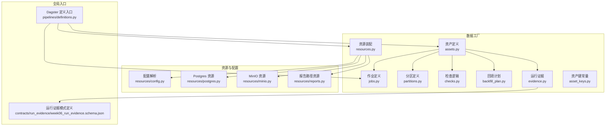
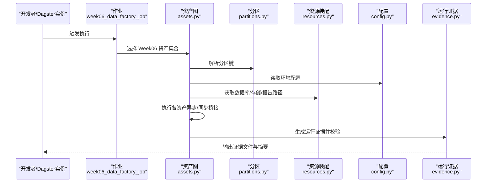
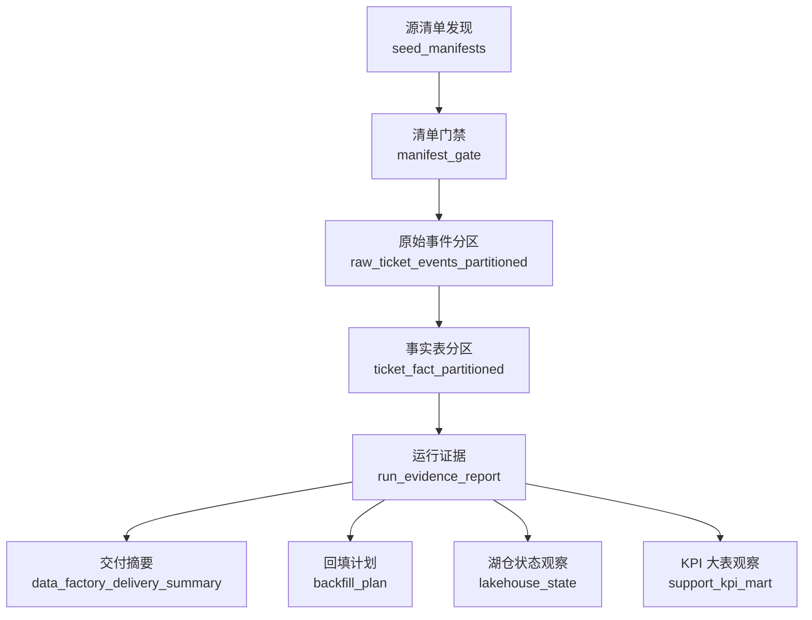
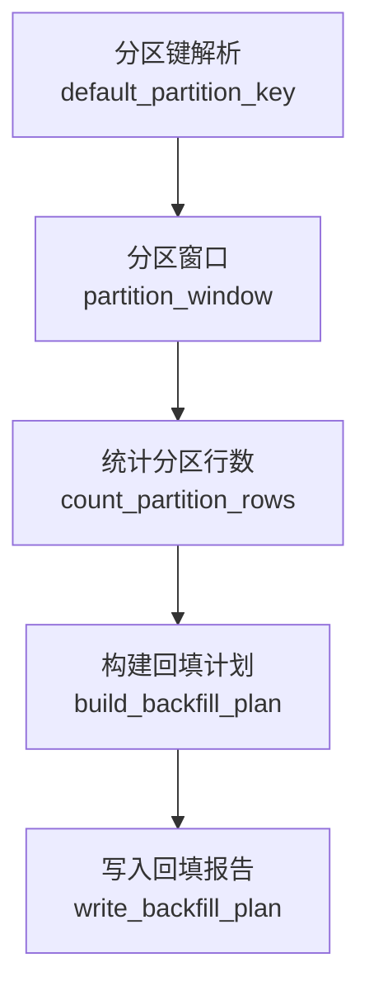
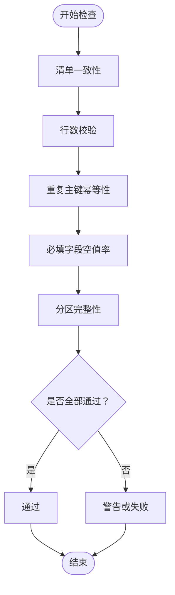
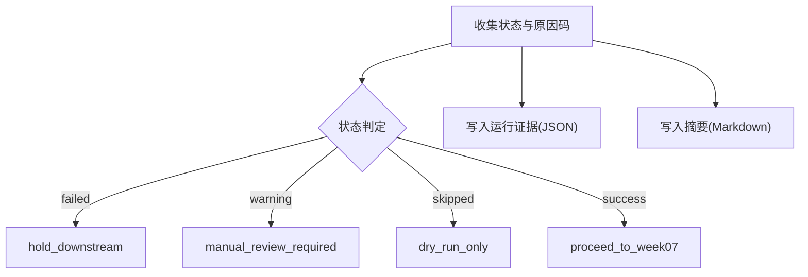
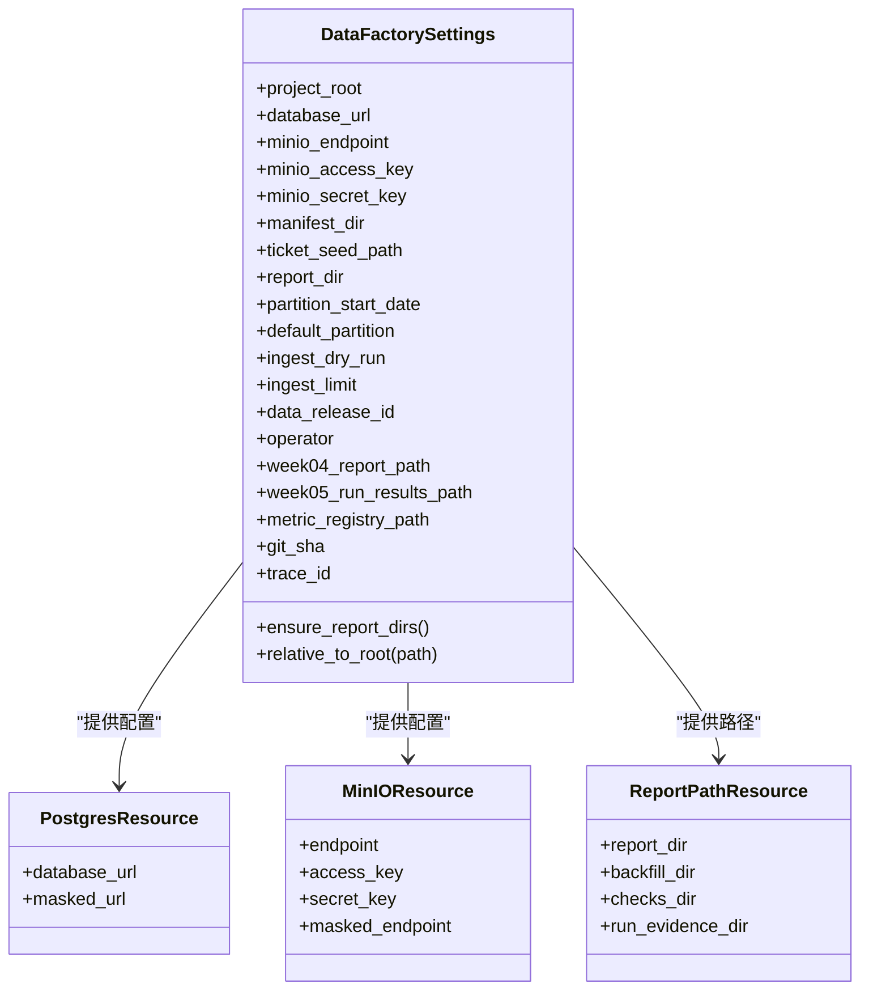
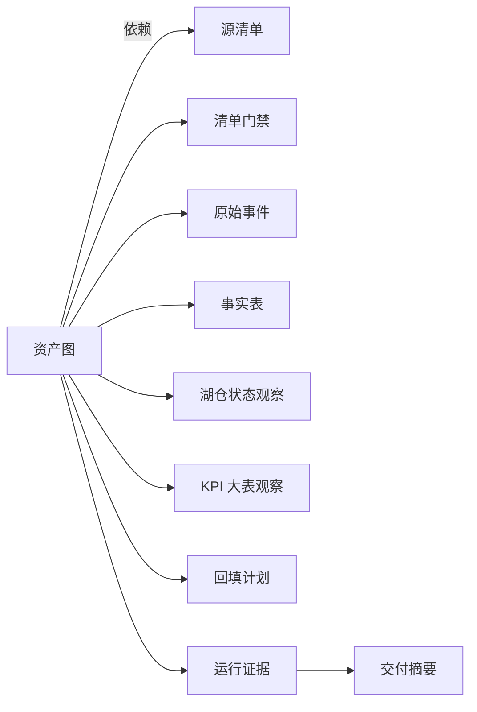

# 数据工厂架构

<cite>
**本文引用的文件**
- [pipelines/data_factory/assets.py](file://pipelines/data_factory/assets.py)
- [pipelines/data_factory/jobs.py](file://pipelines/data_factory/jobs.py)
- [pipelines/data_factory/partitions.py](file://pipelines/data_factory/partitions.py)
- [pipelines/data_factory/checks.py](file://pipelines/data_factory/checks.py)
- [pipelines/data_factory/resources.py](file://pipelines/data_factory/resources.py)
- [pipelines/data_factory/evidence.py](file://pipelines/data_factory/evidence.py)
- [pipelines/data_factory/backfill_plan.py](file://pipelines/data_factory/backfill_plan.py)
- [pipelines/data_factory/asset_keys.py](file://pipelines/data_factory/asset_keys.py)
- [pipelines/resources/config.py](file://pipelines/resources/config.py)
- [pipelines/resources/postgres.py](file://pipelines/resources/postgres.py)
- [pipelines/resources/minio.py](file://pipelines/resources/minio.py)
- [pipelines/resources/reports.py](file://pipelines/resources/reports.py)
- [pipelines/definitions.py](file://pipelines/definitions.py)
- [contracts/run_evidence/week06_run_evidence.schema.json](file://contracts/run_evidence/week06_run_evidence.schema.json)
</cite>

## 目录
1. [简介](#简介)
2. [项目结构](#项目结构)
3. [核心组件](#核心组件)
4. [架构总览](#架构总览)
5. [详细组件分析](#详细组件分析)
6. [依赖分析](#依赖分析)
7. [性能考虑](#性能考虑)
8. [故障排查指南](#故障排查指南)
9. [结论](#结论)
10. [附录](#附录)

## 简介
本文件系统性阐述基于 Dagster 的数据工厂架构设计与实现，覆盖资产定义、作业编排、检查机制与资源管理；详解分区策略（时间分区、增量分区与回填策略）；说明运行证据生成、质量控制检查与错误处理流程；给出资源配置与扩展方法（数据库、对象存储、报告路径等），并提供监控、调试与性能优化建议及常见问题排查。

## 项目结构
数据工厂相关代码集中在 pipelines/data_factory 目录，配合资源层 pipelines/resources 与全局定义入口 pipelines/definitions 组成完整 DAG 定义与执行环境。核心模块职责如下：
- 资产与作业：定义 Week06 数据工厂资产图与作业
- 分区：按日分区定义与默认分区键解析
- 检查：资产级质量检查与汇总输出
- 回填计划：分区输入与输出缺口的干跑评估
- 运行证据：规范化证据记录与下游决策
- 资源装配：数据库、对象存储、报告目录等资源组装
- 配置：从环境变量解析项目根、路径、分区参数与开关

图表来源
- [pipelines/data_factory/assets.py:1-535](file://pipelines/data_factory/assets.py#L1-L535)
- [pipelines/data_factory/jobs.py:1-12](file://pipelines/data_factory/jobs.py#L1-L12)
- [pipelines/data_factory/partitions.py:1-18](file://pipelines/data_factory/partitions.py#L1-L18)
- [pipelines/data_factory/checks.py:1-186](file://pipelines/data_factory/checks.py#L1-L186)
- [pipelines/data_factory/backfill_plan.py:1-147](file://pipelines/data_factory/backfill_plan.py#L1-L147)
- [pipelines/data_factory/evidence.py:1-107](file://pipelines/data_factory/evidence.py#L1-L107)
- [pipelines/data_factory/resources.py:1-29](file://pipelines/data_factory/resources.py#L1-L29)
- [pipelines/data_factory/asset_keys.py:1-30](file://pipelines/data_factory/asset_keys.py#L1-L30)
- [pipelines/resources/config.py:1-136](file://pipelines/resources/config.py#L1-L136)
- [pipelines/resources/postgres.py:1-16](file://pipelines/resources/postgres.py#L1-L16)
- [pipelines/resources/minio.py:1-14](file://pipelines/resources/minio.py#L1-L14)
- [pipelines/resources/reports.py:1-11](file://pipelines/resources/reports.py#L1-L11)
- [pipelines/definitions.py:1-38](file://pipelines/definitions.py#L1-L38)
- [contracts/run_evidence/week06_run_evidence.schema.json:1-137](file://contracts/run_evidence/week06_run_evidence.schema.json#L1-L137)

章节来源
- [pipelines/definitions.py:1-38](file://pipelines/definitions.py#L1-L38)

## 核心组件
- 资产图与作业
  - 资产图包含源清单发现、清单准入门禁、原始事件分区、事实表分区、外部状态观察、回填计划、运行证据与交付摘要等节点，按日分区组织。
  - 作业选择全部 Week06 资产进行编排执行。
- 分区策略
  - 使用每日分区定义，起始日期由配置决定，默认分区键可从设置解析。
- 质量检查
  - 提供清单一致性、行数校验、重复主键幂等性、必填字段空值率、分区完整性等检查；支持在资产内以检查结果元数据呈现。
- 回填计划
  - 基于分区窗口统计输入种子行数，评估输出缺口并生成干跑计划，含操作者、时间戳、模式等信息。
- 运行证据
  - 规范化记录运行 ID、分区键、状态、原因码、下游决策、检查明细与路径等，使用 JSON Schema 校验。
- 资源管理
  - 统一装配 Postgres、MinIO 与报告路径资源，配置项来自环境变量与项目根解析。

章节来源
- [pipelines/data_factory/assets.py:116-535](file://pipelines/data_factory/assets.py#L116-L535)
- [pipelines/data_factory/jobs.py:7-11](file://pipelines/data_factory/jobs.py#L7-L11)
- [pipelines/data_factory/partitions.py:10-17](file://pipelines/data_factory/partitions.py#L10-L17)
- [pipelines/data_factory/checks.py:19-186](file://pipelines/data_factory/checks.py#L19-L186)
- [pipelines/data_factory/backfill_plan.py:82-119](file://pipelines/data_factory/backfill_plan.py#L82-L119)
- [pipelines/data_factory/evidence.py:18-107](file://pipelines/data_factory/evidence.py#L18-L107)
- [pipelines/data_factory/resources.py:13-29](file://pipelines/data_factory/resources.py#L13-L29)

## 架构总览
下图展示 Week06 数据工厂在 Dagster 中的端到端执行流：从分区种子与清单发现开始，经准入门禁与分区化摄取，到事实表产出、外部状态观察、回填计划生成，最终形成运行证据并输出下游决策。

图表来源
- [pipelines/data_factory/jobs.py:7-11](file://pipelines/data_factory/jobs.py#L7-L11)
- [pipelines/data_factory/assets.py:51-79](file://pipelines/data_factory/assets.py#L51-L79)
- [pipelines/data_factory/resources.py:13-29](file://pipelines/data_factory/resources.py#L13-L29)
- [pipelines/resources/config.py:66-113](file://pipelines/resources/config.py#L66-L113)
- [pipelines/data_factory/evidence.py:70-75](file://pipelines/data_factory/evidence.py#L70-L75)

## 详细组件分析

### 资产定义与作业编排
- 资产分组与标签
  - 统一使用“week06_data_factory”分组名与层次化标签（week、layer），便于在 UI 中分类与筛选。
- 异步桥接
  - 在同步资产体中通过线程池运行异步摄取函数，避免阻塞主线程并捕获异常。
- 元数据与分区键
  - 各资产输出包含 partition_key、路径、计数等元数据，便于可视化与审计。
- 依赖关系
  - 清单门禁依赖源清单；原始事件依赖门禁；事实表依赖原始事件；运行证据聚合多路外部状态与回填计划；交付摘要依赖运行证据。

图表来源
- [pipelines/data_factory/assets.py:116-521](file://pipelines/data_factory/assets.py#L116-L521)
- [pipelines/data_factory/asset_keys.py:5-25](file://pipelines/data_factory/asset_keys.py#L5-L25)

章节来源
- [pipelines/data_factory/assets.py:51-521](file://pipelines/data_factory/assets.py#L51-L521)
- [pipelines/data_factory/jobs.py:7-11](file://pipelines/data_factory/jobs.py#L7-L11)
- [pipelines/data_factory/asset_keys.py:15-25](file://pipelines/data_factory/asset_keys.py#L15-L25)

### 分区策略设计与实现
- 时间分区
  - 使用每日分区定义，起始日期由配置决定；默认分区键亦来自配置。
- 增量分区
  - 通过统计种子文件中 created_at 前缀匹配当前分区键，计算分区输入行数，用于检查与回填计划。
- 回填策略
  - 回填计划比较预期输入与当前输出，识别缺口并提出干跑动作，同时给出幂等性保护与下游影响说明。

图表来源
- [pipelines/data_factory/partitions.py:10-17](file://pipelines/data_factory/partitions.py#L10-L17)
- [pipelines/data_factory/backfill_plan.py:41-119](file://pipelines/data_factory/backfill_plan.py#L41-L119)

章节来源
- [pipelines/data_factory/partitions.py:10-17](file://pipelines/data_factory/partitions.py#L10-L17)
- [pipelines/data_factory/backfill_plan.py:61-119](file://pipelines/data_factory/backfill_plan.py#L61-L119)

### 质量控制检查与错误处理
- 检查清单
  - 清单一致性：确保至少存在一个结构化清单且不含空资产列表。
  - 行数校验：输入总行数与有效行数必须大于零。
  - 幂等性：检测重复 ticket_id。
  - 必填字段空值率：校验关键字段非空。
  - 分区完整性：若分区无种子行则标记为 warning。
- 错误处理
  - 摄取失败时，资产状态标记为 failed，并在运行证据中汇总原因码。
  - 干跑模式下，资产状态为 skipped，避免写库。
  - 检查汇总输出 Markdown 文件，便于快速审阅。

图表来源
- [pipelines/data_factory/checks.py:34-132](file://pipelines/data_factory/checks.py#L34-L132)

章节来源
- [pipelines/data_factory/checks.py:19-186](file://pipelines/data_factory/checks.py#L19-L186)

### 运行证据生成与下游决策
- 规范化证据
  - 使用 JSON Schema 对证据记录进行强约束，包含版本、运行 ID、分区键、状态、时间戳、原因码、下游决策、检查明细等。
- 下游决策规则
  - failed：阻止下游；warning：需要人工复核；dry_run/no_db_write：仅干跑；success：推进到周07。
- 汇总与持久化
  - 写入 JSON 证据文件与 Markdown 摘要，便于审计与汇报。

图表来源
- [pipelines/data_factory/evidence.py:78-106](file://pipelines/data_factory/evidence.py#L78-L106)
- [contracts/run_evidence/week06_run_evidence.schema.json:1-137](file://contracts/run_evidence/week06_run_evidence.schema.json#L1-L137)

章节来源
- [pipelines/data_factory/evidence.py:18-107](file://pipelines/data_factory/evidence.py#L18-L107)
- [contracts/run_evidence/week06_run_evidence.schema.json:1-137](file://contracts/run_evidence/week06_run_evidence.schema.json#L1-L137)

### 资源管理与配置
- 资源装配
  - PostgresResource：封装数据库连接 URL。
  - MinIOResource：封装对象存储 endpoint、访问密钥。
  - ReportPathResource：封装报告目录集合（报告根、回填、检查、证据）。
- 配置解析
  - 从环境变量解析项目根、路径、分区参数、干跑开关、限流、Week04/Week05 报告路径、指标注册表路径、Git SHA、Trace ID 等。
- 入口注册
  - 在全局 Definitions 中加载资产、资产检查与作业，并注入资源字典。

图表来源
- [pipelines/resources/config.py:44-136](file://pipelines/resources/config.py#L44-L136)
- [pipelines/resources/postgres.py:6-16](file://pipelines/resources/postgres.py#L6-L16)
- [pipelines/resources/minio.py:6-14](file://pipelines/resources/minio.py#L6-L14)
- [pipelines/resources/reports.py:6-11](file://pipelines/resources/reports.py#L6-L11)
- [pipelines/data_factory/resources.py:13-29](file://pipelines/data_factory/resources.py#L13-L29)

章节来源
- [pipelines/data_factory/resources.py:13-29](file://pipelines/data_factory/resources.py#L13-L29)
- [pipelines/resources/config.py:66-136](file://pipelines/resources/config.py#L66-L136)
- [pipelines/definitions.py:32-37](file://pipelines/definitions.py#L32-L37)

## 依赖分析
- 资产间依赖
  - 采用显式 AssetIn 声明上游依赖，保证拓扑有序与可追踪。
- 外部观察
  - 湖仓快照与 KPI 大表状态为只读观察，作为运行证据的一部分，不改变外部系统。
- 资源耦合
  - 资源装配集中于 build_week06_resources，降低资产对具体实现细节的耦合。
- 配置解耦
  - DataFactorySettings 封装所有环境相关参数，便于测试与替换。

图表来源
- [pipelines/data_factory/assets.py:116-521](file://pipelines/data_factory/assets.py#L116-L521)
- [pipelines/data_factory/asset_keys.py:5-25](file://pipelines/data_factory/asset_keys.py#L5-L25)

章节来源
- [pipelines/data_factory/assets.py:116-521](file://pipelines/data_factory/assets.py#L116-L521)

## 性能考虑
- 异步桥接
  - 在同步资产体内运行异步摄取函数，避免阻塞；通过线程池执行并合并结果，减少等待时间。
- 干跑优先
  - 默认干跑模式不写库，先验证输入与检查，降低对后端的压力与风险。
- 分区粒度
  - 日分区细化了重算范围，结合回填计划可精准定位缺口，提升重跑效率。
- I/O 优化
  - JSONL 迭代器按行解析，避免一次性载入大文件；报告目录预创建，减少 IO 异常。
- 资源隔离
  - 将数据库与对象存储资源分离，便于独立扩容与限流。

章节来源
- [pipelines/data_factory/assets.py:57-79](file://pipelines/data_factory/assets.py#L57-L79)
- [pipelines/data_factory/backfill_plan.py:48-68](file://pipelines/data_factory/backfill_plan.py#L48-L68)
- [pipelines/data_factory/resources.py:13-29](file://pipelines/data_factory/resources.py#L13-L29)

## 故障排查指南
- 常见问题
  - 清单缺失或为空：运行证据中出现“structured_manifest_missing_or_empty”原因码。
  - 输入种子无分区行：分区完整性检查为 warning，需确认种子文件与分区键格式。
  - 摄取失败：原始事件状态为 failed，检查报告路径与错误计数。
  - 干跑模式：事实表输出为 0，属于预期行为。
- 排查步骤
  - 查看运行证据 JSON 与 Markdown 摘要，定位失败原因码。
  - 检查回填计划报告，确认缺口与建议动作。
  - 校验配置项（分区起始日期、默认分区、种子路径、报告目录等）。
  - 在干跑模式下先用小规模数据验证，再逐步扩大。
- 监控建议
  - 关注资产状态与原因码分布，建立阈值报警。
  - 定期审查回填计划与下游决策，确保闭环。

章节来源
- [pipelines/data_factory/checks.py:34-116](file://pipelines/data_factory/checks.py#L34-L116)
- [pipelines/data_factory/evidence.py:78-86](file://pipelines/data_factory/evidence.py#L78-L86)
- [pipelines/resources/config.py:66-113](file://pipelines/resources/config.py#L66-L113)

## 结论
该数据工厂以 Dagster 为核心，围绕日分区构建了可验证、可观测、可回填的资产化流水线。通过严格的运行证据与检查机制，确保交付质量；通过干跑与回填计划，降低变更风险；通过集中资源装配与配置解析，提升可维护性与可移植性。建议在生产环境中启用非干跑模式前，充分验证检查与回填计划，并建立完善的监控与告警体系。

## 附录
- 环境变量与默认值
  - DATABASE_URL、MINIO_ENDPOINT、MINIO_ACCESS_KEY、MINIO_SECRET_KEY、SEED_MANIFEST_PATH、WEEK06_TICKET_SEED_PATH、WEEK06_REPORT_DIR、WEEK06_PARTITION_START_DATE、WEEK06_DEFAULT_PARTITION、WEEK06_INGEST_DRY_RUN、WEEK06_INGEST_LIMIT、WEEK06_DATA_RELEASE_ID、WEEK06_OPERATOR、WEEK06_WEEK04_REPORT_PATH、WEEK06_WEEK05_RUN_RESULTS_PATH、METRIC_REGISTRY_PATH、GIT_SHA、TRACE_ID。
- 运行证据模式定义
  - 使用 JSON Schema 约束证据字段与枚举值，确保跨周一致的输出格式。

章节来源
- [pipelines/resources/config.py:66-113](file://pipelines/resources/config.py#L66-L113)
- [contracts/run_evidence/week06_run_evidence.schema.json:1-137](file://contracts/run_evidence/week06_run_evidence.schema.json#L1-L137)