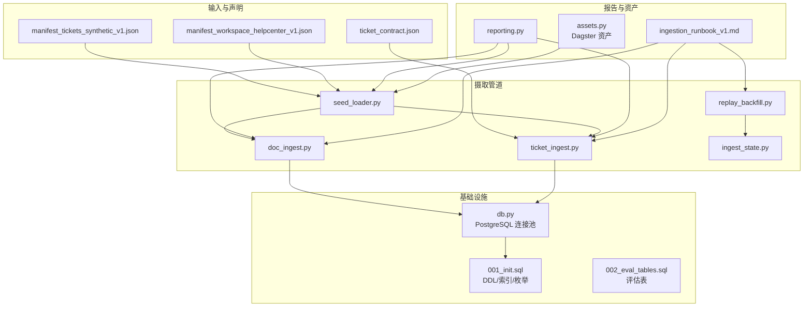
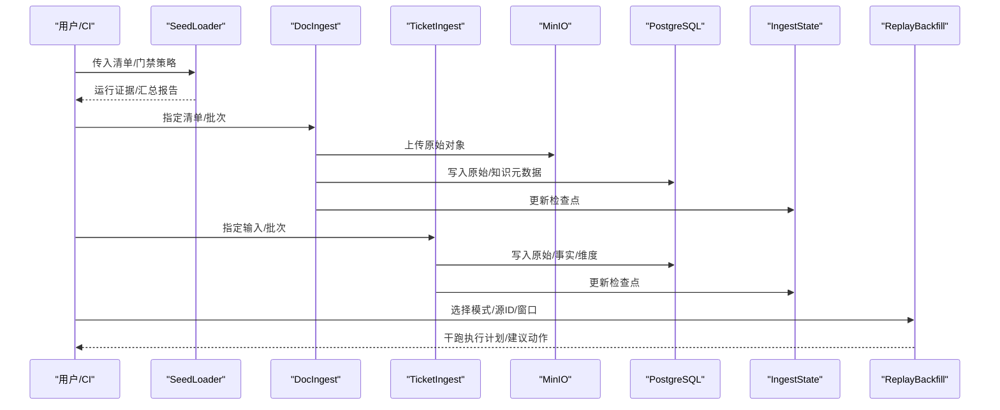
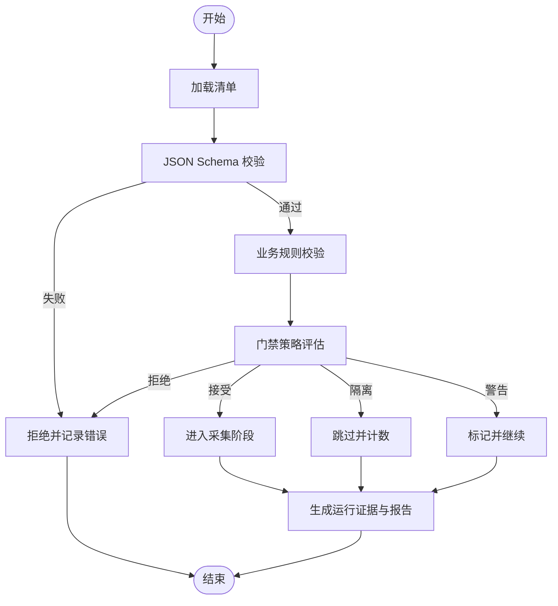
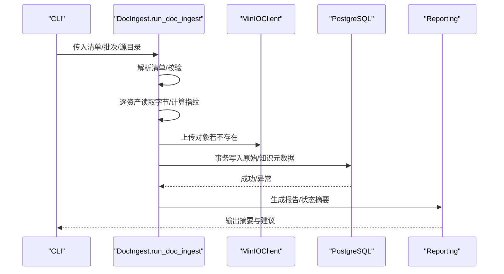
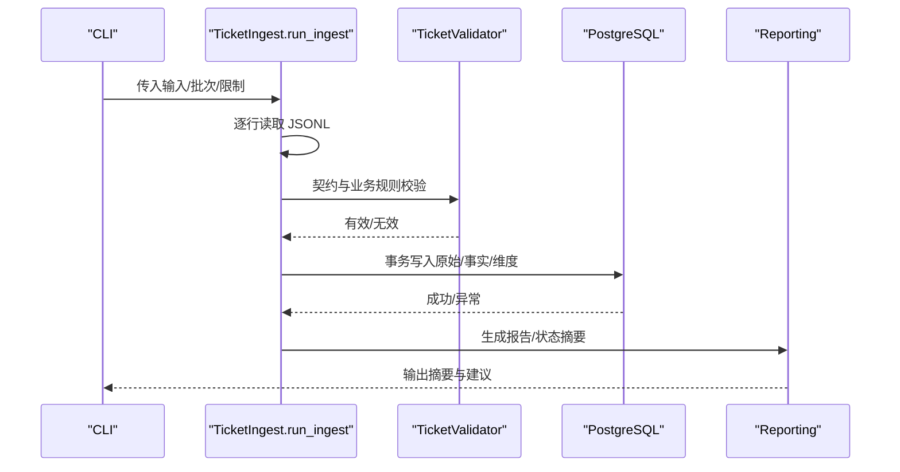
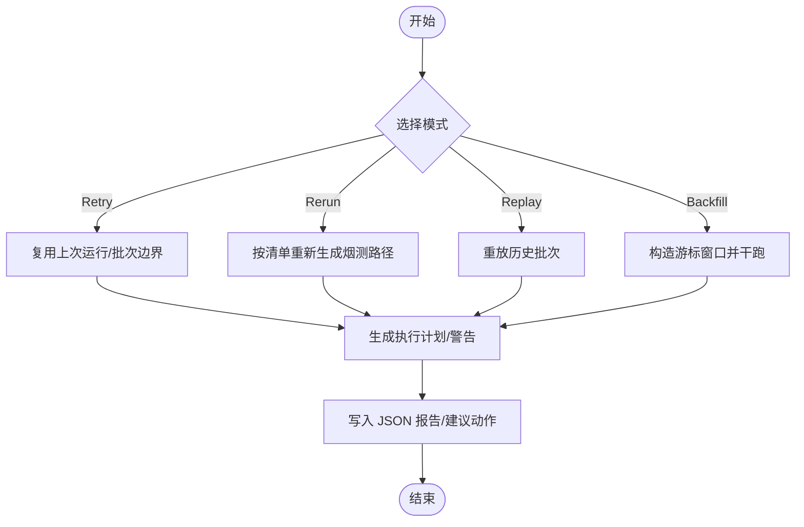
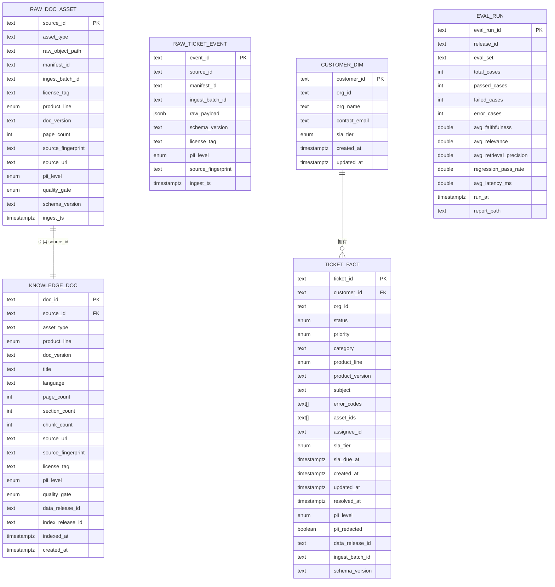
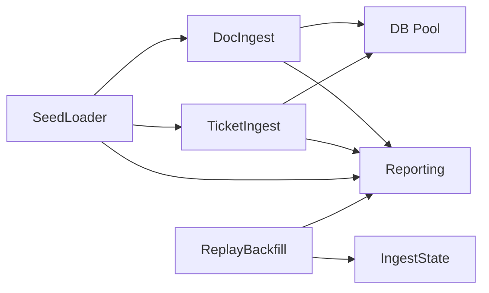

# 数据摄取流程

<cite>
**本文引用的文件**
- [pipelines/ingestion/doc_ingest.py](file://pipelines/ingestion/doc_ingest.py)
- [pipelines/ingestion/ticket_ingest.py](file://pipelines/ingestion/ticket_ingest.py)
- [pipelines/ingestion/seed_loader.py](file://pipelines/ingestion/seed_loader.py)
- [pipelines/ingestion/ingest_state.py](file://pipelines/ingestion/ingest_state.py)
- [pipelines/ingestion/replay_backfill.py](file://pipelines/ingestion/replay_backfill.py)
- [pipelines/ingestion/db.py](file://pipelines/ingestion/db.py)
- [pipelines/ingestion/reporting.py](file://pipelines/ingestion/reporting.py)
- [pipelines/ingestion/assets.py](file://pipelines/ingestion/assets.py)
- [data/seed_manifests/manifest_tickets_synthetic_v1.json](file://data/seed_manifests/manifest_tickets_synthetic_v1.json)
- [data/seed_manifests/manifest_workspace_helpcenter_v1.json](file://data/seed_manifests/manifest_workspace_helpcenter_v1.json)
- [contracts/data/ticket_contract.json](file://contracts/data/ticket_contract.json)
- [data/canonization/checkpoints/week03_ingest_state.json](file://data/canonization/checkpoints/week03_ingest_state.json)
- [runbooks/ingestion_runbook_v1.md](file://runbooks/ingestion_runbook_v1.md)
- [infra/migrations/001_init.sql](file://infra/migrations/001_init.sql)
- [infra/migrations/002_eval_tables.sql](file://infra/migrations/002_eval_tables.sql)
</cite>

## 目录
1. [简介](#简介)
2. [项目结构](#项目结构)
3. [核心组件](#核心组件)
4. [架构总览](#架构总览)
5. [详细组件分析](#详细组件分析)
6. [依赖分析](#依赖分析)
7. [性能考虑](#性能考虑)
8. [故障排查指南](#故障排查指南)
9. [结论](#结论)
10. [附录](#附录)

## 简介
本文件系统化梳理从原始数据到结构化数据的完整摄取流程，覆盖三类主链路：文档资产摄取、工单数据摄取与种子清单驱动的批量加载。重点阐述以下方面：
- 摄取状态管理：检查点记录、批次边界与回放/回填策略
- 数据验证、清洗与标准化：契约校验、门禁策略、指纹与去重
- 回放与回填：增量更新、全量重建与一致性保障
- 性能优化：并发连接池、事务批处理与资源管理
- 监控与报告：状态摘要、推荐动作与运行证据

## 项目结构
围绕“摄取”主题，核心代码位于 pipelines/ingestion，数据契约与清单位于 contracts/data 与 data/seed_manifests，数据库初始化与模式定义位于 infra/migrations。

图表来源
- [pipelines/ingestion/seed_loader.py:1-644](file://pipelines/ingestion/seed_loader.py#L1-L644)
- [pipelines/ingestion/doc_ingest.py:1-337](file://pipelines/ingestion/doc_ingest.py#L1-L337)
- [pipelines/ingestion/ticket_ingest.py:1-322](file://pipelines/ingestion/ticket_ingest.py#L1-L322)
- [pipelines/ingestion/replay_backfill.py:1-166](file://pipelines/ingestion/replay_backfill.py#L1-L166)
- [pipelines/ingestion/ingest_state.py:1-98](file://pipelines/ingestion/ingest_state.py#L1-L98)
- [pipelines/ingestion/db.py:1-45](file://pipelines/ingestion/db.py#L1-L45)
- [pipelines/ingestion/reporting.py:1-63](file://pipelines/ingestion/reporting.py#L1-L63)
- [pipelines/ingestion/assets.py:1-164](file://pipelines/ingestion/assets.py#L1-L164)
- [data/seed_manifests/manifest_tickets_synthetic_v1.json:1-52](file://data/seed_manifests/manifest_tickets_synthetic_v1.json#L1-L52)
- [data/seed_manifests/manifest_workspace_helpcenter_v1.json:1-72](file://data/seed_manifests/manifest_workspace_helpcenter_v1.json#L1-L72)
- [contracts/data/ticket_contract.json:1-125](file://contracts/data/ticket_contract.json#L1-L125)
- [infra/migrations/001_init.sql:1-288](file://infra/migrations/001_init.sql#L1-L288)
- [infra/migrations/002_eval_tables.sql:1-44](file://infra/migrations/002_eval_tables.sql#L1-L44)
- [runbooks/ingestion_runbook_v1.md:1-111](file://runbooks/ingestion_runbook_v1.md#L1-L111)

章节来源
- [runbooks/ingestion_runbook_v1.md:1-111](file://runbooks/ingestion_runbook_v1.md#L1-L111)

## 核心组件
- 种子清单驱动器（SeedLoader）：加载、校验与迭代清单，执行门禁判断，产出运行证据与汇总报告
- 文档摄取器（DocIngest）：从清单读取文档，上传 MinIO，写入 PostgreSQL 原始与知识元数据表
- 工单摄取器（TicketIngest）：从 JSONL 读取工单，契约校验，写入 PostgreSQL 原始与事实/维度表
- 摄取状态（IngestState）：批次游标与最近成功批次等检查点持久化
- 回放/回填规划器（ReplayBackfill）：基于状态与模式生成干跑执行计划与建议动作
- 数据库连接池（DB）：统一 asyncpg 连接池，支持上下文管理与事务
- 报告与状态摘要（Reporting）：统一报告写入、状态汇总与恢复建议
- Dagster 资产（Assets）：将清单与落盘抽象为资产图，便于编排与观测

章节来源
- [pipelines/ingestion/seed_loader.py:129-260](file://pipelines/ingestion/seed_loader.py#L129-L260)
- [pipelines/ingestion/doc_ingest.py:172-277](file://pipelines/ingestion/doc_ingest.py#L172-L277)
- [pipelines/ingestion/ticket_ingest.py:186-254](file://pipelines/ingestion/ticket_ingest.py#L186-L254)
- [pipelines/ingestion/ingest_state.py:20-98](file://pipelines/ingestion/ingest_state.py#L20-L98)
- [pipelines/ingestion/replay_backfill.py:25-131](file://pipelines/ingestion/replay_backfill.py#L25-L131)
- [pipelines/ingestion/db.py:21-45](file://pipelines/ingestion/db.py#L21-L45)
- [pipelines/ingestion/reporting.py:26-63](file://pipelines/ingestion/reporting.py#L26-L63)
- [pipelines/ingestion/assets.py:28-164](file://pipelines/ingestion/assets.py#L28-L164)

## 架构总览
摄取链路由“清单声明—门禁—落地—状态—回放/回填—报告”构成闭环，支持增量与全量两种模式，并以最小状态文件支撑后续修复与重试。

图表来源
- [pipelines/ingestion/seed_loader.py:350-446](file://pipelines/ingestion/seed_loader.py#L350-L446)
- [pipelines/ingestion/doc_ingest.py:172-277](file://pipelines/ingestion/doc_ingest.py#L172-L277)
- [pipelines/ingestion/ticket_ingest.py:186-254](file://pipelines/ingestion/ticket_ingest.py#L186-L254)
- [pipelines/ingestion/ingest_state.py:65-98](file://pipelines/ingestion/ingest_state.py#L65-L98)
- [pipelines/ingestion/replay_backfill.py:93-131](file://pipelines/ingestion/replay_backfill.py#L93-L131)

## 详细组件分析

### 组件A：种子清单驱动与门禁策略
- 清单加载与校验：支持 JSON Schema 与业务规则双层校验，涵盖许可证、元数据完整性、合约一致性、游标窗口要求等
- 门禁判断：基于策略键（缺失校验和、元数据缺失/部分、未知许可证、PII 扫描缺口等）进行“接受/警告/隔离/拒绝”
- 运行证据：记录每条资产的判定与原因，形成可审计的证据链
- 报告输出：汇总统计、状态与恢复建议，便于人工审核与自动化决策

图表来源
- [pipelines/ingestion/seed_loader.py:129-260](file://pipelines/ingestion/seed_loader.py#L129-L260)
- [pipelines/ingestion/seed_loader.py:372-446](file://pipelines/ingestion/seed_loader.py#L372-L446)
- [pipelines/ingestion/reporting.py:41-63](file://pipelines/ingestion/reporting.py#L41-L63)

章节来源
- [pipelines/ingestion/seed_loader.py:129-260](file://pipelines/ingestion/seed_loader.py#L129-L260)
- [pipelines/ingestion/seed_loader.py:372-446](file://pipelines/ingestion/seed_loader.py#L372-L446)
- [pipelines/ingestion/reporting.py:41-63](file://pipelines/ingestion/reporting.py#L41-L63)

### 组件B：文档资产摄取（DocIngest）
- 输入：清单中文档资产，支持本地路径与 s3:// 映射
- 核心步骤：
  - 读取字节并计算指纹
  - 上传至 MinIO raw zone（按产品/类型组织键空间），避免重复
  - 写入 PostgreSQL 原始资产表与知识文档表（Silver 层）
  - 事务内保证元数据一致性
- 报告：统计总数、上传数、跳过数、DB 成功数与错误数

图表来源
- [pipelines/ingestion/doc_ingest.py:172-277](file://pipelines/ingestion/doc_ingest.py#L172-L277)
- [pipelines/ingestion/reporting.py:26-63](file://pipelines/ingestion/reporting.py#L26-L63)

章节来源
- [pipelines/ingestion/doc_ingest.py:172-277](file://pipelines/ingestion/doc_ingest.py#L172-L277)

### 组件C：工单数据摄取（TicketIngest）
- 输入：JSONL 合成工单流
- 校验：JSON Schema 契约 + 业务规则（如 ID 前缀、必填时间字段）
- 写入：原始事件表（Bronze）与事实/维度表（Silver），事务内保证一致性
- 报告：统计总数、有效/无效、插入数、错误数与进度日志

图表来源
- [pipelines/ingestion/ticket_ingest.py:186-254](file://pipelines/ingestion/ticket_ingest.py#L186-L254)
- [contracts/data/ticket_contract.json:1-125](file://contracts/data/ticket_contract.json#L1-L125)
- [pipelines/ingestion/reporting.py:26-63](file://pipelines/ingestion/reporting.py#L26-L63)

章节来源
- [pipelines/ingestion/ticket_ingest.py:186-254](file://pipelines/ingestion/ticket_ingest.py#L186-L254)
- [contracts/data/ticket_contract.json:1-125](file://contracts/data/ticket_contract.json#L1-L125)

### 组件D：摄取状态与回放/回填
- 检查点模型：记录每个 source_id 的最后处理游标、最近成功批次与最近运行 ID
- 回放/回填模式：
  - Retry：重试上次运行，不扩大窗口
  - Rerun：重新按清单定义执行
  - Replay：重放历史批次
  - Backfill：构造历史游标窗口，先干跑
- 报告：生成执行计划、警告与建议动作，落地 JSON 证据

图表来源
- [pipelines/ingestion/replay_backfill.py:44-91](file://pipelines/ingestion/replay_backfill.py#L44-L91)
- [pipelines/ingestion/ingest_state.py:57-98](file://pipelines/ingestion/ingest_state.py#L57-L98)

章节来源
- [pipelines/ingestion/replay_backfill.py:25-131](file://pipelines/ingestion/replay_backfill.py#L25-L131)
- [pipelines/ingestion/ingest_state.py:20-98](file://pipelines/ingestion/ingest_state.py#L20-L98)

### 组件E：数据库与模式
- 连接池：统一 asyncpg 连接池，支持 acquire 上下文管理
- 模式：定义 Bronze/Silver 层表结构、索引与枚举类型，确保一致性与查询性能
- 评估表：为后续回归评估提供结构化记录

图表来源
- [infra/migrations/001_init.sql:36-161](file://infra/migrations/001_init.sql#L36-L161)
- [infra/migrations/002_eval_tables.sql:4-44](file://infra/migrations/002_eval_tables.sql#L4-L44)

章节来源
- [pipelines/ingestion/db.py:21-45](file://pipelines/ingestion/db.py#L21-L45)
- [infra/migrations/001_init.sql:36-161](file://infra/migrations/001_init.sql#L36-L161)
- [infra/migrations/002_eval_tables.sql:4-44](file://infra/migrations/002_eval_tables.sql#L4-L44)

## 依赖分析
- 组件耦合
  - DocIngest/TicketIngest 共享数据库连接池与报告工具
  - SeedLoader 为 Doc/Ticket 提供清单与门禁证据
  - ReplayBackfill 依赖 IngestState 与报告工具
- 外部依赖
  - MinIO：对象存储上传与存在性检查
  - PostgreSQL：事务写入与索引查询
  - JSON Schema：契约校验
- 潜在循环依赖：未发现直接循环；各模块职责清晰，通过共享工具函数解耦

图表来源
- [pipelines/ingestion/doc_ingest.py:172-277](file://pipelines/ingestion/doc_ingest.py#L172-L277)
- [pipelines/ingestion/ticket_ingest.py:186-254](file://pipelines/ingestion/ticket_ingest.py#L186-L254)
- [pipelines/ingestion/seed_loader.py:350-446](file://pipelines/ingestion/seed_loader.py#L350-L446)
- [pipelines/ingestion/replay_backfill.py:93-131](file://pipelines/ingestion/replay_backfill.py#L93-L131)
- [pipelines/ingestion/db.py:21-45](file://pipelines/ingestion/db.py#L21-L45)
- [pipelines/ingestion/reporting.py:26-63](file://pipelines/ingestion/reporting.py#L26-L63)
- [pipelines/ingestion/ingest_state.py:57-98](file://pipelines/ingestion/ingest_state.py#L57-L98)

章节来源
- [pipelines/ingestion/doc_ingest.py:172-277](file://pipelines/ingestion/doc_ingest.py#L172-L277)
- [pipelines/ingestion/ticket_ingest.py:186-254](file://pipelines/ingestion/ticket_ingest.py#L186-L254)
- [pipelines/ingestion/seed_loader.py:350-446](file://pipelines/ingestion/seed_loader.py#L350-L446)
- [pipelines/ingestion/replay_backfill.py:93-131](file://pipelines/ingestion/replay_backfill.py#L93-L131)
- [pipelines/ingestion/db.py:21-45](file://pipelines/ingestion/db.py#L21-L45)
- [pipelines/ingestion/reporting.py:26-63](file://pipelines/ingestion/reporting.py#L26-L63)
- [pipelines/ingestion/ingest_state.py:57-98](file://pipelines/ingestion/ingest_state.py#L57-L98)

## 性能考虑
- 连接池与事务批处理
  - 使用 asyncpg 连接池，最小/最大连接数可控，减少连接开销
  - 将 DB 写入置于事务内，降低锁竞争与重复写入成本
- 并发与限速
  - 建议在上层编排（如 Dagster）中控制并发度，避免对象存储与数据库争用
  - 对大文件上传设置合理的超时与重试退避
- 存储与索引
  - MinIO 分层键空间（产品/类型/文件名）提升定位效率
  - 数据库按产品线、批次、时间等字段建立索引，加速查询与回放
- 资源管理
  - 严格关闭连接池，避免句柄泄漏
  - 控制报告与日志级别，避免 IO 抖动

## 故障排查指南
- 常见问题与定位
  - 清单校验失败：检查清单字段与契约是否匹配，关注许可证标签、元数据状态与合约一致性
  - MinIO 上传失败：确认端点、凭据与桶权限；检查对象键是否冲突
  - DB 写入异常：核对事务边界与约束冲突（如主键/外键），查看错误日志
  - 回放/回填计划不完整：根据状态文件与模式生成的警告提示补齐批次或游标参数
- 建议流程
  - 先干跑（dry-run）生成执行计划与报告，再决定是否真实执行
  - 使用状态文件定位最近成功批次与游标，缩小重试范围
  - 依据报告中的状态与建议动作采取下一步（重试/修复元数据/隔离）

章节来源
- [pipelines/ingestion/seed_loader.py:129-260](file://pipelines/ingestion/seed_loader.py#L129-L260)
- [pipelines/ingestion/replay_backfill.py:93-131](file://pipelines/ingestion/replay_backfill.py#L93-L131)
- [pipelines/ingestion/reporting.py:41-63](file://pipelines/ingestion/reporting.py#L41-L63)
- [data/canonization/checkpoints/week03_ingest_state.json:1-20](file://data/canonization/checkpoints/week03_ingest_state.json#L1-L20)

## 结论
该摄取体系以“清单—门禁—落地—状态—回放/回填—报告”为主线，既满足课程阶段的最小可用，也为后续扩展（Lakehouse、检索增强）打下坚实基础。通过严格的契约与门禁策略、完善的检查点与回放能力、以及统一的报告与状态摘要，实现了可审计、可恢复、可扩展的数据摄取流水线。

## 附录
- 使用示例与命令参考（参见运行手册）
- 数据契约与清单样例
  - [工单清单示例:1-52](file://data/seed_manifests/manifest_tickets_synthetic_v1.json#L1-L52)
  - [文档清单示例:1-72](file://data/seed_manifests/manifest_workspace_helpcenter_v1.json#L1-L72)
  - [工单契约:1-125](file://contracts/data/ticket_contract.json#L1-L125)
- 数据库初始化与评估表
  - [初始化 DDL:1-288](file://infra/migrations/001_init.sql#L1-L288)
  - [评估表:1-44](file://infra/migrations/002_eval_tables.sql#L1-L44)