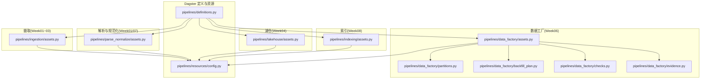
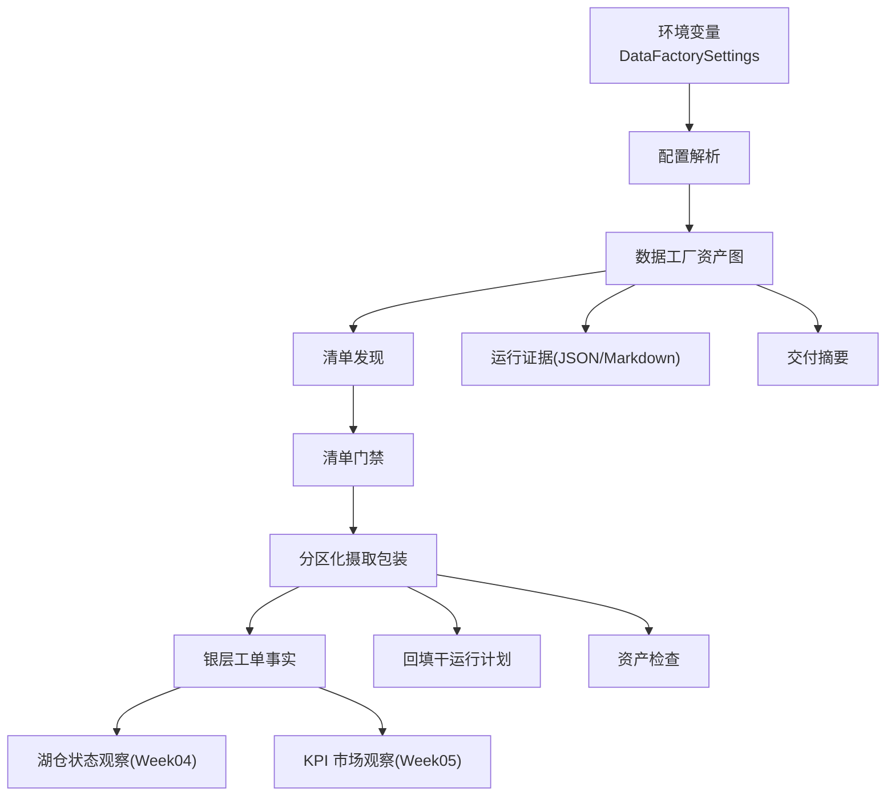
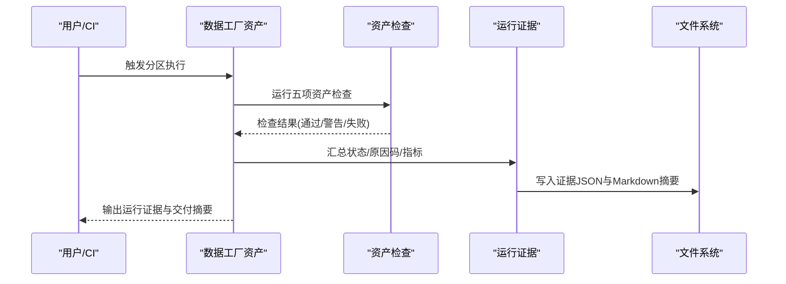
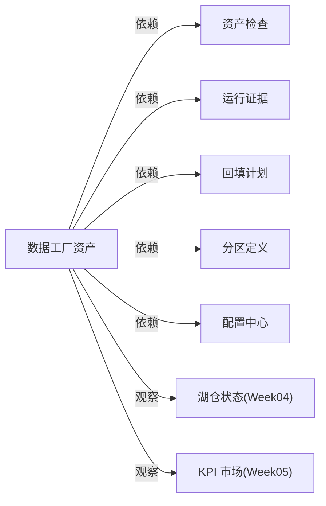

# 数据管道系统

<cite>
**本文引用的文件**
- [pipelines/definitions.py](file://pipelines/definitions.py)
- [pipelines/data_factory/assets.py](file://pipelines/data_factory/assets.py)
- [pipelines/data_factory/partitions.py](file://pipelines/data_factory/partitions.py)
- [pipelines/data_factory/backfill_plan.py](file://pipelines/data_factory/backfill_plan.py)
- [pipelines/data_factory/checks.py](file://pipelines/data_factory/checks.py)
- [pipelines/data_factory/evidence.py](file://pipelines/data_factory/evidence.py)
- [pipelines/resources/config.py](file://pipelines/resources/config.py)
- [pipelines/ingestion/assets.py](file://pipelines/ingestion/assets.py)
- [pipelines/parse_normalize/assets.py](file://pipelines/parse_normalize/assets.py)
- [pipelines/lakehouse/assets.py](file://pipelines/lakehouse/assets.py)
- [pipelines/indexing/assets.py](file://pipelines/indexing/assets.py)
- [runbooks/week06-data-factory.md](file://runbooks/week06-data-factory.md)
- [docs/blueprints/week06/week06-data-factory-blueprint.md](file://docs/blueprints/week06/week06-data-factory-blueprint.md)
- [docs/blueprints/week06/week06-partition-backfill-strategy.md](file://docs/blueprints/week06/week06-partition-backfill-strategy.md)
- [analytics/dbt_project.yml](file://analytics/dbt_project.yml)
</cite>

## 目录
1. [简介](#简介)
2. [项目结构](#项目结构)
3. [核心组件](#核心组件)
4. [架构总览](#架构总览)
5. [详细组件分析](#详细组件分析)
6. [依赖分析](#依赖分析)
7. [性能考虑](#性能考虑)
8. [故障排查指南](#故障排查指南)
9. [结论](#结论)
10. [附录](#附录)

## 简介
本文件系统性梳理 OmniSupport Copilot 的数据管道系统，围绕基于 Dagster 的“资产化数据工厂”进行深入解析。重点覆盖以下方面：
- 资产化管道设计与分组策略
- 分区与回填计划
- 质量控制与证据归档
- 数据摄取、解析与湖仓管理
- 索引构建策略
- 数据血缘、版本与回滚思路
- 监控、调试与性能优化
- 错误处理与恢复策略
- 扩展数据源与新增处理步骤的方法

该系统以 Week06 数据工厂为核心，复用 Week03 工单摄取、Week04 湖仓材料化与 Week05 Analytics 的既有路径，通过 Dagster 资产图实现编排边界、分区执行、干运行回填、质量检查与运行证据归档。

## 项目结构
系统采用模块化分层组织，按功能域划分为：
- 数据工厂层：Week06 资产化编排、分区、回填、检查与证据
- 摄取层：Week01~Week03 的种子清单到 Landing/Bronze 的落地
- 解析与规范化层：Week01 骨架 + Week07 开始的真实解析
- 湖仓层：Week04 Iceberg 材料化，Week05 Analytics
- 索引层：Week08 向量化索引构建
- 资源与配置：环境变量驱动的 Settings 对象
- 运行手册与蓝图：操作指南、分区与回填策略、证据规范

图表来源
- [pipelines/definitions.py:1-38](file://pipelines/definitions.py#L1-L38)
- [pipelines/data_factory/assets.py:1-535](file://pipelines/data_factory/assets.py#L1-L535)
- [pipelines/data_factory/partitions.py:1-18](file://pipelines/data_factory/partitions.py#L1-L18)
- [pipelines/data_factory/backfill_plan.py:1-147](file://pipelines/data_factory/backfill_plan.py#L1-L147)
- [pipelines/data_factory/checks.py:1-186](file://pipelines/data_factory/checks.py#L1-L186)
- [pipelines/data_factory/evidence.py:1-107](file://pipelines/data_factory/evidence.py#L1-L107)
- [pipelines/resources/config.py:1-136](file://pipelines/resources/config.py#L1-L136)
- [pipelines/ingestion/assets.py:1-164](file://pipelines/ingestion/assets.py#L1-L164)
- [pipelines/parse_normalize/assets.py:1-117](file://pipelines/parse_normalize/assets.py#L1-L117)
- [pipelines/lakehouse/assets.py:1-125](file://pipelines/lakehouse/assets.py#L1-L125)
- [pipelines/indexing/assets.py:1-55](file://pipelines/indexing/assets.py#L1-L55)

章节来源
- [pipelines/definitions.py:1-38](file://pipelines/definitions.py#L1-L38)
- [runbooks/week06-data-factory.md:1-190](file://runbooks/week06-data-factory.md#L1-L190)
- [docs/blueprints/week06/week06-data-factory-blueprint.md:1-72](file://docs/blueprints/week06/week06-data-factory-blueprint.md#L1-L72)

## 核心组件
- 资产定义与作业注册：统一在定义入口加载各层资产与资产检查，注册作业与资源。
- 数据工厂资产：以每日分区为粒度，串联清单发现、门禁筛选、分区化摄取包装、银层事实产出、外部状态观察、回填计划、运行证据与交付摘要。
- 分区定义：基于每日分区，支持默认分区键与起始日期配置。
- 回填计划：面向单日分区的干运行回填计划，计算输入期望与当前产出差距，给出建议动作与影响说明。
- 质量检查：五项核心资产检查，覆盖清单一致性、行数、重复主键、必填字段空值率与分区完整性；部分检查在资产检查 UI 中可见。
- 运行证据：结构化证据记录，包含状态、原因码、下游决策、指标与校验结果，并输出 JSON 与 Markdown 摘要。
- 配置中心：DataFactorySettings 从环境变量解析项目根目录、路径、分区参数、干运行开关、报告目录等。

章节来源
- [pipelines/definitions.py:19-37](file://pipelines/definitions.py#L19-L37)
- [pipelines/data_factory/assets.py:116-535](file://pipelines/data_factory/assets.py#L116-L535)
- [pipelines/data_factory/partitions.py:10-18](file://pipelines/data_factory/partitions.py#L10-L18)
- [pipelines/data_factory/backfill_plan.py:82-120](file://pipelines/data_factory/backfill_plan.py#L82-L120)
- [pipelines/data_factory/checks.py:119-132](file://pipelines/data_factory/checks.py#L119-L132)
- [pipelines/data_factory/evidence.py:18-107](file://pipelines/data_factory/evidence.py#L18-L107)
- [pipelines/resources/config.py:44-136](file://pipelines/resources/config.py#L44-L136)

## 架构总览
系统以 Dagster 作为编排中枢，将多周能力整合为资产化数据工厂：
- 输入：种子清单目录、工单种子 JSONL、环境变量配置
- 处理：每日分区内的资产链路，包含摄取包装、银层事实、外部状态观察、回填计划与质量检查
- 输出：运行证据 JSON、Markdown 摘要、回填计划 JSON、交付摘要

图表来源
- [pipelines/data_factory/assets.py:116-535](file://pipelines/data_factory/assets.py#L116-L535)
- [pipelines/data_factory/checks.py:119-132](file://pipelines/data_factory/checks.py#L119-L132)
- [pipelines/data_factory/backfill_plan.py:82-120](file://pipelines/data_factory/backfill_plan.py#L82-L120)
- [pipelines/data_factory/evidence.py:70-107](file://pipelines/data_factory/evidence.py#L70-L107)
- [pipelines/resources/config.py:66-113](file://pipelines/resources/config.py#L66-L113)

## 详细组件分析

### 数据工厂资产图与分组
- 资产分组：week06_data_factory 作为统一分组，便于在 UI 中聚合查看
- 关键资产：
  - 种子清单发现：扫描清单目录，过滤非结构化清单，输出清单列表
  - 清单门禁：选择结构化清单，确保存在资产
  - 分区化摄取包装：调用 Week03 摄取逻辑，支持干运行与限制
  - 银层工单事实：根据摄取结果推导状态与行数
  - 外部状态观察：Week04 湖仓快照、Week05 Analytics 运行结果
  - 回填计划：针对单日分区生成干运行计划
  - 运行证据：汇总状态、原因码、下游决策与检查结果
  - 交付摘要：人类可读的总结

章节来源
- [pipelines/data_factory/assets.py:116-535](file://pipelines/data_factory/assets.py#L116-L535)

### 分区策略
- 分区定义：每日分区，起始日期与默认分区键由配置决定
- 分区键选择：优先使用上下文分区键，否则使用默认分区键
- 时间窗口：分区窗口为当天 00:00~23:59:59 UTC

章节来源
- [pipelines/data_factory/partitions.py:10-18](file://pipelines/data_factory/partitions.py#L10-L18)
- [pipelines/data_factory/backfill_plan.py:41-46](file://pipelines/data_factory/backfill_plan.py#L41-L46)

### 回填计划与安全规则
- 计划内容：分区键、窗口、上游清单 ID、期望输入、当前产出、缺口原因、建议动作、幂等保护、下游影响、操作者、时间戳
- 安全规则：默认干运行模式；不删除历史数据；不建议全表重跑；当前产出统计为观察性
- 生成方式：CLI 与模块化函数两种入口

章节来源
- [pipelines/data_factory/backfill_plan.py:17-120](file://pipelines/data_factory/backfill_plan.py#L17-L120)
- [docs/blueprints/week06/week06-partition-backfill-strategy.md:13-37](file://docs/blueprints/week06/week06-partition-backfill-strategy.md#L13-L37)

### 质量控制与资产检查
- 检查清单：
  - 清单一致性：至少存在一个结构化清单且包含资产
  - 行数输出：有效输入行大于零
  - 重复幂等：种子中无重复主键
  - 必填字段空值率：关键字段均非空
  - 分区完整性：所选分区存在至少一条种子行
- 资产检查 UI：部分检查以资产检查形式在 UI 可见，便于快速定位问题

章节来源
- [pipelines/data_factory/checks.py:19-132](file://pipelines/data_factory/checks.py#L19-L132)
- [pipelines/data_factory/checks.py:152-186](file://pipelines/data_factory/checks.py#L152-L186)

### 运行证据与下游决策
- 证据结构：包含 schema 版本、运行 ID、分区键、状态、开始/结束时间、报告路径、原因码、指标、检查明细、下游决策等
- 校验：使用合约 schema 校验生成的证据 JSON
- 下游决策：失败→阻断；干运行→仅干运行；警告→人工复核；成功→进入下一周

章节来源
- [pipelines/data_factory/evidence.py:18-107](file://pipelines/data_factory/evidence.py#L18-L107)
- [runbooks/week06-data-factory.md:169-182](file://runbooks/week06-data-factory.md#L169-L182)

### 配置中心与资源
- DataFactorySettings：集中解析项目根目录、路径、分区参数、干运行开关、报告目录、Week04/Week05 路径、Git/Trace 信息等
- 报告目录：自动创建 backfill、checks、run_evidence 子目录
- 资源：通过资源工厂构建 Week06 所需资源

章节来源
- [pipelines/resources/config.py:44-136](file://pipelines/resources/config.py#L44-L136)
- [pipelines/definitions.py:11-12](file://pipelines/definitions.py#L11-L12)

### 摄取与解析规范化
- 摄取层：从种子清单加载结构化/文档类型清单，输出原始资产元数据（Week03 开始写入数据库/Iceberg）
- 解析与规范化：文档解析骨架（Week07 开始接入 Docling/Unstructured），工单规范化骨架（Week03 开始写入数据库/Iceberg）

章节来源
- [pipelines/ingestion/assets.py:28-154](file://pipelines/ingestion/assets.py#L28-L154)
- [pipelines/parse_normalize/assets.py:11-117](file://pipelines/parse_normalize/assets.py#L11-L117)

### 湖仓管理与索引构建
- 湖仓层：Week04 初始化 Iceberg 表（Bronze/Silver/Gold），Week05 Analytics 模型与 KPI 工具
- 索引层：Week08 基于知识章节构建向量索引，支持批大小、干运行与报告目录

章节来源
- [pipelines/lakehouse/assets.py:10-125](file://pipelines/lakehouse/assets.py#L10-L125)
- [pipelines/indexing/assets.py:17-55](file://pipelines/indexing/assets.py#L17-L55)
- [analytics/dbt_project.yml:18-32](file://analytics/dbt_project.yml#L18-L32)

### 组件交互时序（以运行证据为例）

图表来源
- [pipelines/data_factory/assets.py:392-474](file://pipelines/data_factory/assets.py#L392-L474)
- [pipelines/data_factory/checks.py:119-132](file://pipelines/data_factory/checks.py#L119-L132)
- [pipelines/data_factory/evidence.py:70-107](file://pipelines/data_factory/evidence.py#L70-L107)

## 依赖分析
- 资产间依赖：数据工厂资产通过 AssetIn 明确上下游依赖，形成稳定的执行顺序
- 外部依赖：PostgreSQL、MinIO、Week04/Week05 外部产物（观察性）
- 资源耦合：配置中心集中管理路径与行为开关，降低硬编码耦合
- 循环依赖：未见循环导入或资产循环依赖

图表来源
- [pipelines/data_factory/assets.py:116-535](file://pipelines/data_factory/assets.py#L116-L535)
- [pipelines/data_factory/checks.py:119-132](file://pipelines/data_factory/checks.py#L119-L132)
- [pipelines/data_factory/evidence.py:70-107](file://pipelines/data_factory/evidence.py#L70-L107)
- [pipelines/data_factory/backfill_plan.py:82-120](file://pipelines/data_factory/backfill_plan.py#L82-L120)
- [pipelines/data_factory/partitions.py:10-18](file://pipelines/data_factory/partitions.py#L10-L18)
- [pipelines/resources/config.py:66-113](file://pipelines/resources/config.py#L66-L113)

## 性能考虑
- 干运行优先：默认干运行，避免不必要的数据库写入，提升回放与验证效率
- 分区粒度：每日分区简化回填与重算范围，降低资源占用
- I/O 优化：批量读取种子 JSONL，按分区计数，减少无效扫描
- 资源隔离：通过资源工厂与环境变量隔离不同环境的存储与数据库连接
- 可观测性：资产元数据中记录输入/输出行数、分区行数、耗时等，便于性能分析

## 故障排查指南
- 合约校验失败：检查证据 JSON 是否符合合约 schema，必要时调整生成逻辑
- 定义加载失败：确认 devbox 安装了 dagster，导入路径正确
- UI 不可见：检查 compose 挂载路径，确保 Dagster 服务可见 contracts/docs/runbooks/analytics/data/reports
- 回填计划零输入：更换包含种子数据的分区键
- 干运行默认：若需要 DB 写入，请在受控场景关闭干运行开关
- 外部依赖缺失：Week04/Week05 为观察性依赖，缺失时标记为 not_available

章节来源
- [runbooks/week06-data-factory.md:157-182](file://runbooks/week06-data-factory.md#L157-L182)

## 结论
Week06 数据工厂以 Dagster 资产化为核心，将既有 Week03~Week05 能力纳入统一编排边界，提供分区执行、干运行回填、质量检查与运行证据归档。系统强调“不重写既有逻辑”的设计原则，通过观察性依赖与干运行策略保障安全性与可追溯性。配合蓝图与运行手册，可高效完成课堂演示与工程验证。

## 附录

### 数据血缘与版本控制
- 血缘追踪：Dagster UI 展示资产图与上游依赖，结合运行证据中的原因码与下游决策，形成端到端可追溯
- 版本控制：证据 JSON 包含 schema 版本、Git SHA、Trace ID，便于审计与回滚定位

章节来源
- [pipelines/data_factory/evidence.py:18-47](file://pipelines/data_factory/evidence.py#L18-L47)
- [pipelines/resources/config.py:111-113](file://pipelines/resources/config.py#L111-L113)

### 回滚机制与恢复策略
- 回滚策略：默认干运行，不引入破坏性重写；如需回滚，建议通过分区级重算与回填计划执行
- 恢复策略：当外部依赖不可用时，证据标记 not_available；修复后重新执行对应分区

章节来源
- [docs/blueprints/week06/week06-data-factory-blueprint.md:49-72](file://docs/blueprints/week06/week06-data-factory-blueprint.md#L49-L72)
- [runbooks/week06-data-factory.md:102-116](file://runbooks/week06-data-factory.md#L102-L116)

### 扩展与优化建议
- 扩展数据源：在清单门禁与摄取包装处增加新模态的清单识别与种子映射
- 新增处理步骤：在解析/规范化层增加新的资产，遵循 Silver 层契约，保持幂等与可回溯
- 性能优化：利用分区裁剪、批量处理与缓存策略；在摄取阶段加入速率限制与并发控制

章节来源
- [pipelines/parse_normalize/assets.py:11-117](file://pipelines/parse_normalize/assets.py#L11-L117)
- [pipelines/ingestion/assets.py:28-154](file://pipelines/ingestion/assets.py#L28-L154)