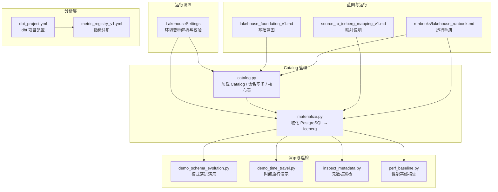
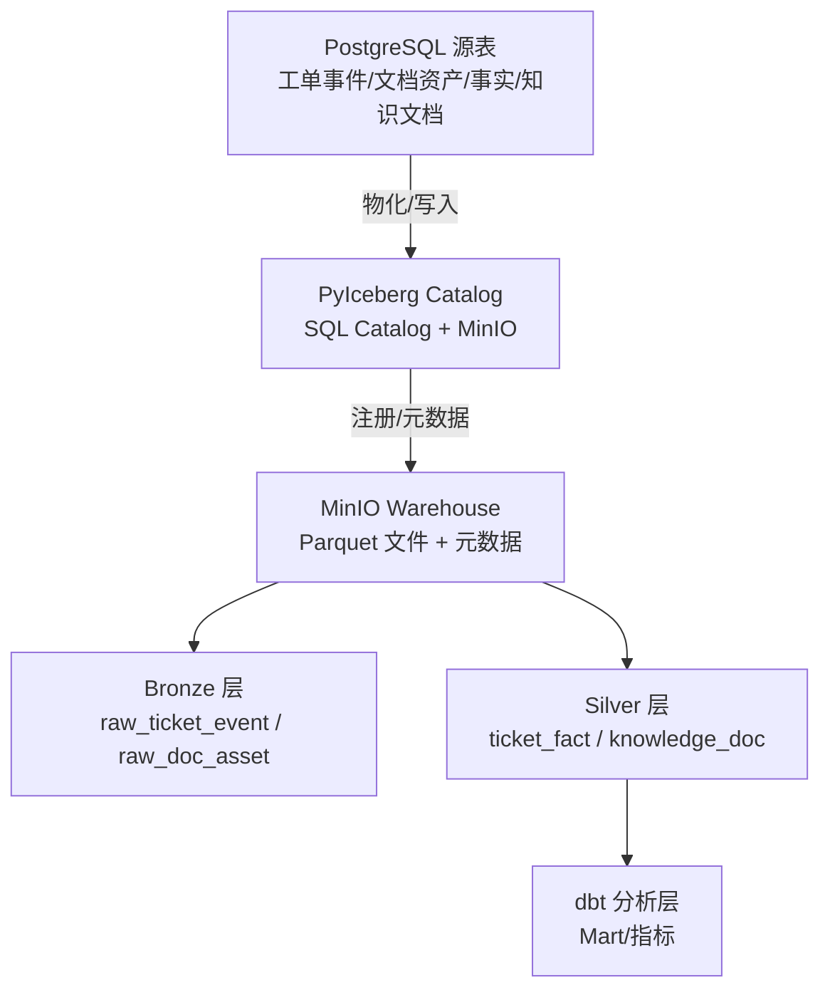
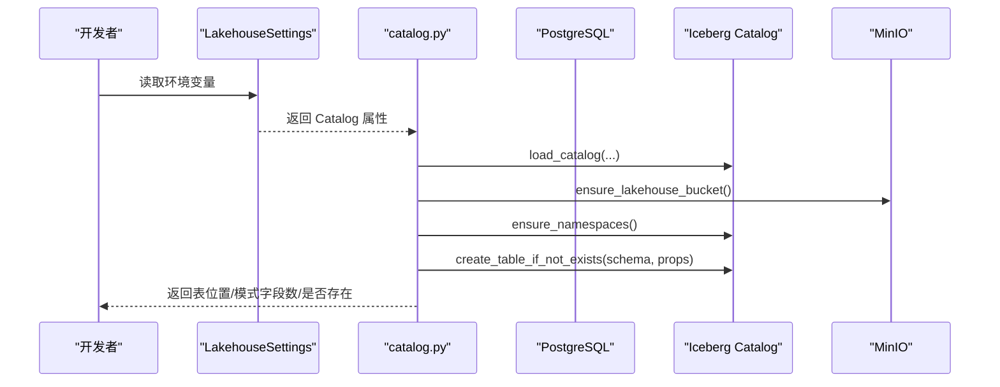
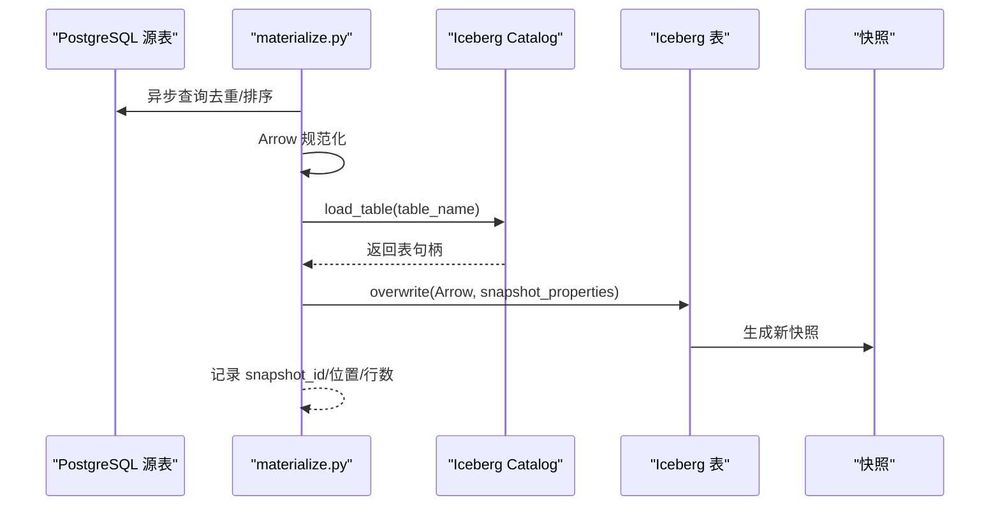
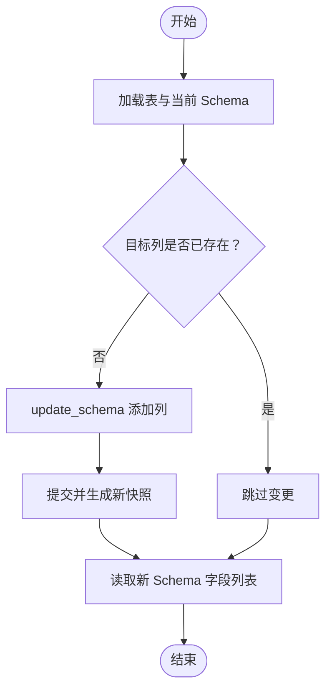
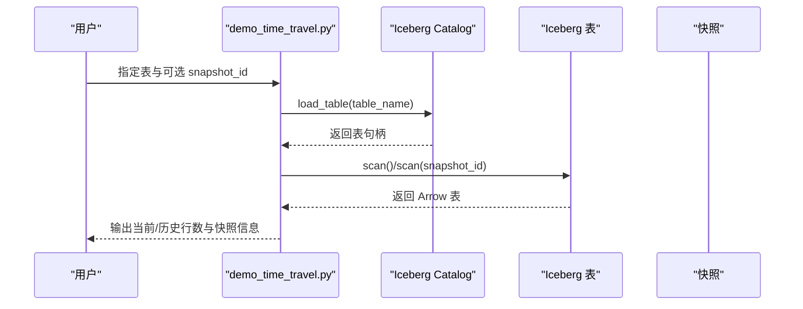
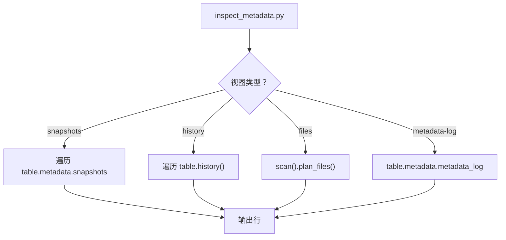
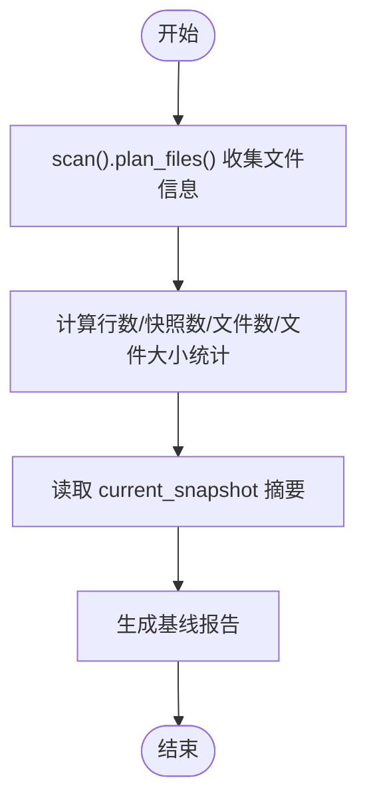
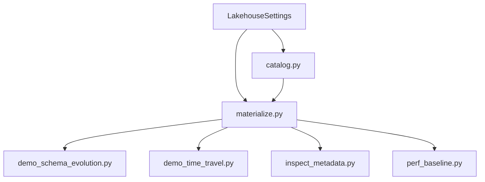

# 湖仓管理系统

<cite>
**本文引用的文件**
- [pipelines/lakehouse/catalog.py](file://pipelines/lakehouse/catalog.py)
- [pipelines/lakehouse/materialize.py](file://pipelines/lakehouse/materialize.py)
- [pipelines/lakehouse/iceberg_schemas.py](file://pipelines/lakehouse/iceberg_schemas.py)
- [pipelines/lakehouse/settings.py](file://pipelines/lakehouse/settings.py)
- [pipelines/lakehouse/demo_schema_evolution.py](file://pipelines/lakehouse/demo_schema_evolution.py)
- [pipelines/lakehouse/demo_time_travel.py](file://pipelines/lakehouse/demo_time_travel.py)
- [pipelines/lakehouse/inspect_metadata.py](file://pipelines/lakehouse/inspect_metadata.py)
- [pipelines/lakehouse/perf_baseline.py](file://pipelines/lakehouse/perf_baseline.py)
- [docs/blueprints/week04/lakehouse_foundation_v1.md](file://docs/blueprints/week04/lakehouse_foundation_v1.md)
- [docs/blueprints/week04/source_to_iceberg_mapping_v1.md](file://docs/blueprints/week04/source_to_iceberg_mapping_v1.md)
- [runbooks/lakehouse_runbook.md](file://runbooks/lakehouse_runbook.md)
- [analytics/dbt_project.yml](file://analytics/dbt_project.yml)
- [analytics/metric_registry_v1.yml](file://analytics/metric_registry_v1.yml)
</cite>

## 目录
1. [简介](#简介)
2. [项目结构](#项目结构)
3. [核心组件](#核心组件)
4. [架构总览](#架构总览)
5. [详细组件分析](#详细组件分析)
6. [依赖分析](#依赖分析)
7. [性能考虑](#性能考虑)
8. [故障排查指南](#故障排查指南)
9. [结论](#结论)
10. [附录](#附录)

## 简介
本文件面向“湖仓管理系统”的设计与实践，围绕基于 Apache Iceberg 的湖仓架构展开，重点覆盖以下方面：
- Bronze/Silver/Gold 分层存储策略与数据管理模式
- Catalog 管理机制（表注册、元数据存储、版本控制）
- 模式演进（向前兼容、向后兼容、迁移策略）
- 时间旅行（历史数据查询、快照管理、数据恢复）
- 性能优化（分区策略、存储格式选择）
- 数据质量与一致性验证、备份与恢复
- 扩展新表、新增分区与查询优化

该系统以 Week04 为核心交付阶段，采用 PyIceberg + PostgreSQL SQL Catalog + MinIO 的技术栈，在本地开发环境（devbox）中完成最小闭环：从 PostgreSQL 源表物化到 Iceberg，建立命名空间、核心表、快照与元数据视图，并提供可演示的模式演进与时间旅行能力。

## 项目结构
系统主要由以下模块构成：
- 配置与运行设置：LakehouseSettings 提供统一的环境变量解析与校验
- Catalog 管理：加载 Catalog、确保命名空间与核心表存在、类型映射
- 物化流程：从 PostgreSQL 异步读取数据，转换为 Arrow，写入 Iceberg 并生成快照
- 模式演进与时间旅行：演示列增量添加与按快照读取历史数据
- 元数据巡检：查看快照、变更历史、数据文件与元数据日志
- 性能基线：统计文件数、行数、快照数与文件大小分布
- 文档蓝图与运行手册：定义目标、技术选型、运行边界与演示步骤
- 分析层（Analytics）：dbt 项目与指标注册，承接 Silver 层数据

图表来源
- [pipelines/lakehouse/settings.py:20-104](file://pipelines/lakehouse/settings.py#L20-L104)
- [pipelines/lakehouse/catalog.py:29-169](file://pipelines/lakehouse/catalog.py#L29-L169)
- [pipelines/lakehouse/materialize.py:131-184](file://pipelines/lakehouse/materialize.py#L131-L184)
- [pipelines/lakehouse/demo_schema_evolution.py:17-44](file://pipelines/lakehouse/demo_schema_evolution.py#L17-L44)
- [pipelines/lakehouse/demo_time_travel.py:13-39](file://pipelines/lakehouse/demo_time_travel.py#L13-L39)
- [pipelines/lakehouse/inspect_metadata.py:13-70](file://pipelines/lakehouse/inspect_metadata.py#L13-L70)
- [pipelines/lakehouse/perf_baseline.py:13-30](file://pipelines/lakehouse/perf_baseline.py#L13-L30)
- [docs/blueprints/week04/lakehouse_foundation_v1.md:1-58](file://docs/blueprints/week04/lakehouse_foundation_v1.md#L1-L58)
- [docs/blueprints/week04/source_to_iceberg_mapping_v1.md:1-61](file://docs/blueprints/week04/source_to_iceberg_mapping_v1.md#L1-L61)
- [runbooks/lakehouse_runbook.md:1-82](file://runbooks/lakehouse_runbook.md#L1-L82)
- [analytics/dbt_project.yml:1-32](file://analytics/dbt_project.yml#L1-L32)
- [analytics/metric_registry_v1.yml:1-56](file://analytics/metric_registry_v1.yml#L1-L56)

章节来源
- [docs/blueprints/week04/lakehouse_foundation_v1.md:1-58](file://docs/blueprints/week04/lakehouse_foundation_v1.md#L1-L58)
- [runbooks/lakehouse_runbook.md:1-82](file://runbooks/lakehouse_runbook.md#L1-L82)

## 核心组件
- LakehouseSettings：集中管理 Catalog 类型、URI、Warehouse、S3 端点、数据库连接等，提供 validate 校验与安全输出
- Catalog 管理（catalog.py）：加载 Catalog、确保命名空间、创建核心表、类型映射、写入属性设置
- 物化流程（materialize.py）：异步读取源表、Arrow 规范化、写入 Iceberg 并生成带属性的快照
- 演示与巡检：模式演进（仅允许增量列）、时间旅行（按快照扫描）、元数据巡检（快照/历史/文件/元数据日志）、性能基线
- 文档蓝图与运行手册：定义技术选型、运行边界、写入策略与演示步骤
- 分析层：dbt 项目与指标注册，承接 Silver 层 Mart

章节来源
- [pipelines/lakehouse/settings.py:20-104](file://pipelines/lakehouse/settings.py#L20-L104)
- [pipelines/lakehouse/catalog.py:29-169](file://pipelines/lakehouse/catalog.py#L29-L169)
- [pipelines/lakehouse/materialize.py:131-184](file://pipelines/lakehouse/materialize.py#L131-L184)
- [pipelines/lakehouse/demo_schema_evolution.py:17-44](file://pipelines/lakehouse/demo_schema_evolution.py#L17-L44)
- [pipelines/lakehouse/demo_time_travel.py:13-39](file://pipelines/lakehouse/demo_time_travel.py#L13-L39)
- [pipelines/lakehouse/inspect_metadata.py:13-70](file://pipelines/lakehouse/inspect_metadata.py#L13-L70)
- [pipelines/lakehouse/perf_baseline.py:13-30](file://pipelines/lakehouse/perf_baseline.py#L13-L30)
- [docs/blueprints/week04/lakehouse_foundation_v1.md:48-57](file://docs/blueprints/week04/lakehouse_foundation_v1.md#L48-L57)
- [docs/blueprints/week04/source_to_iceberg_mapping_v1.md:1-61](file://docs/blueprints/week04/source_to_iceberg_mapping_v1.md#L1-L61)
- [runbooks/lakehouse_runbook.md:59-82](file://runbooks/lakehouse_runbook.md#L59-L82)
- [analytics/dbt_project.yml:18-28](file://analytics/dbt_project.yml#L18-L28)
- [analytics/metric_registry_v1.yml:1-56](file://analytics/metric_registry_v1.yml#L1-L56)

## 架构总览
系统采用“源表 → Lakehouse（Bronze/Silver）→ 分析层（dbt）”的三层架构：
- 源表：PostgreSQL 中的 ingest 结果（如工单事件、文档资产、工单事实、知识文档）
- Lakehouse：Iceberg 表，按 Bronze/Silver 分层存储；通过 Catalog 管理元数据与版本
- 分析层：dbt 建模，指标注册，支撑查询与工具调用

图表来源
- [docs/blueprints/week04/lakehouse_foundation_v1.md:8-16](file://docs/blueprints/week04/lakehouse_foundation_v1.md#L8-L16)
- [pipelines/lakehouse/materialize.py:131-184](file://pipelines/lakehouse/materialize.py#L131-L184)
- [pipelines/lakehouse/catalog.py:112-140](file://pipelines/lakehouse/catalog.py#L112-L140)
- [analytics/dbt_project.yml:18-28](file://analytics/dbt_project.yml#L18-L28)

## 详细组件分析

### Catalog 管理机制
- 加载 Catalog：根据 LakehouseSettings 动态构造 Catalog 参数（类型、URI、Warehouse、S3 端点等）
- 确保命名空间：自动创建 bronze 与 silver 命名空间
- 创建核心表：按表名映射到 Schema，设置写入格式（Parquet）、写入模式、自定义属性（release/batch 等）
- 类型映射：将内部类型描述映射为 Arrow 类型，保证写入一致性
- 运行检查：提供 smoke_check，串联校验设置、桶可用性、命名空间与核心表创建

图表来源
- [pipelines/lakehouse/settings.py:39-88](file://pipelines/lakehouse/settings.py#L39-L88)
- [pipelines/lakehouse/catalog.py:29-169](file://pipelines/lakehouse/catalog.py#L29-L169)

章节来源
- [pipelines/lakehouse/catalog.py:29-169](file://pipelines/lakehouse/catalog.py#L29-L169)
- [pipelines/lakehouse/settings.py:20-104](file://pipelines/lakehouse/settings.py#L20-L104)

### 物化流程（Bronze/Silver → Iceberg）
- 查询源表：异步连接 PostgreSQL，按表查询并去重/排序（Bronze 层按指纹去重）
- Arrow 规范化：将结果集规范化为 Arrow 表，处理时间戳时区与 JSON 序列化
- 写入 Iceberg：按表当前 Schema 覆盖写入，附加快照属性（release/batch/write_mode），记录快照 ID
- 报告生成：输出物化报告，包含源行数、写入模式、操作类型、目标位置等

图表来源
- [pipelines/lakehouse/materialize.py:102-184](file://pipelines/lakehouse/materialize.py#L102-L184)
- [pipelines/lakehouse/catalog.py:112-140](file://pipelines/lakehouse/catalog.py#L112-L140)

章节来源
- [pipelines/lakehouse/materialize.py:17-99](file://pipelines/lakehouse/materialize.py#L17-L99)
- [pipelines/lakehouse/materialize.py:131-184](file://pipelines/lakehouse/materialize.py#L131-L184)
- [docs/blueprints/week04/source_to_iceberg_mapping_v1.md:9-54](file://docs/blueprints/week04/source_to_iceberg_mapping_v1.md#L9-L54)

### 模式演进（Schema Evolution）
- 限制策略：Week04 仅允许“增量列”（Add Column），禁止重命名、删除、变更类型
- 实现原理：通过 update_schema 动态添加列，提交后生成新快照，保持历史数据可读
- 兼容性：新增列默认可空，避免破坏现有查询；历史快照保留旧模式

图表来源
- [pipelines/lakehouse/demo_schema_evolution.py:17-44](file://pipelines/lakehouse/demo_schema_evolution.py#L17-L44)

章节来源
- [pipelines/lakehouse/demo_schema_evolution.py:1-90](file://pipelines/lakehouse/demo_schema_evolution.py#L1-L90)

### 时间旅行（Time Travel）
- 快照扫描：按指定 snapshot_id 扫描表，统计行数，对比当前与历史行数
- 历史回溯：通过快照 ID 回到任意历史版本，进行数据验证或恢复
- 注意事项：至少一次成功物化后再进行对比演示；可多次物化以增强演示效果

图表来源
- [pipelines/lakehouse/demo_time_travel.py:13-44](file://pipelines/lakehouse/demo_time_travel.py#L13-L44)

章节来源
- [pipelines/lakehouse/demo_time_travel.py:1-91](file://pipelines/lakehouse/demo_time_travel.py#L1-L91)

### 元数据巡检
- 快照视图：列出所有快照的 ID、父快照、序列号、时间戳与摘要
- 历史视图：展示快照时间线
- 文件视图：列出数据文件路径、格式、记录数与大小
- 元数据日志：展示元数据文件变更历史

图表来源
- [pipelines/lakehouse/inspect_metadata.py:13-70](file://pipelines/lakehouse/inspect_metadata.py#L13-L70)

章节来源
- [pipelines/lakehouse/inspect_metadata.py:1-109](file://pipelines/lakehouse/inspect_metadata.py#L1-L109)

### 性能基线
- 统计指标：行数、快照数、文件数、平均/最小/最大文件大小、最新快照 ID 与操作类型
- 报告形式：支持 Markdown 与 JSON 输出，便于前后对比与后续维护决策

图表来源
- [pipelines/lakehouse/perf_baseline.py:13-30](file://pipelines/lakehouse/perf_baseline.py#L13-L30)

章节来源
- [pipelines/lakehouse/perf_baseline.py:1-126](file://pipelines/lakehouse/perf_baseline.py#L1-L126)

### 分层存储策略与数据管理
- Bronze 层：保真落盘，保留 source_fingerprint，按 ingest 时间或产品线分区，避免过早业务解释
- Silver 层：规范化、可查询、可演化，面向服务消费与后续建模
- 写入策略：Week04 采用确定性全量覆盖写入，避免盲追加导致状态不一致

章节来源
- [pipelines/lakehouse/iceberg_schemas.py:11-104](file://pipelines/lakehouse/iceberg_schemas.py#L11-L104)
- [pipelines/lakehouse/iceberg_schemas.py:107-213](file://pipelines/lakehouse/iceberg_schemas.py#L107-L213)
- [docs/blueprints/week04/lakehouse_foundation_v1.md:48-57](file://docs/blueprints/week04/lakehouse_foundation_v1.md#L48-L57)
- [docs/blueprints/week04/source_to_iceberg_mapping_v1.md:44-54](file://docs/blueprints/week04/source_to_iceberg_mapping_v1.md#L44-L54)

### Catalog 管理与版本控制
- 表注册：按命名空间与表名创建表，设置写入格式与属性
- 元数据存储：快照、历史、元数据日志均持久化于仓库
- 版本控制：通过快照 ID 实现版本追踪与回滚

章节来源
- [pipelines/lakehouse/catalog.py:112-140](file://pipelines/lakehouse/catalog.py#L112-L140)
- [pipelines/lakehouse/inspect_metadata.py:13-70](file://pipelines/lakehouse/inspect_metadata.py#L13-L70)

### 模式演进的兼容性与迁移
- 向前兼容：新增列默认可空，不影响现有查询
- 向后兼容：历史快照保留旧模式，读取不受影响
- 迁移策略：在演示脚本中仅展示增量列添加，不涉及重命名/删除/变更类型

章节来源
- [pipelines/lakehouse/demo_schema_evolution.py:1-90](file://pipelines/lakehouse/demo_schema_evolution.py#L1-L90)

### 时间旅行的使用与恢复
- 历史数据查询：通过指定 snapshot_id 扫描历史版本
- 快照管理：查看快照历史与摘要，辅助审计与回滚决策
- 数据恢复：在确认历史版本正确后，可将当前状态回滚至目标快照（需结合业务流程）

章节来源
- [pipelines/lakehouse/demo_time_travel.py:1-91](file://pipelines/lakehouse/demo_time_travel.py#L1-L91)
- [pipelines/lakehouse/inspect_metadata.py:13-70](file://pipelines/lakehouse/inspect_metadata.py#L13-L70)

### 性能优化与分区策略
- 存储格式：Parquet（写入默认格式）
- 分区策略：按 ingest 时间、产品线、月份等进行分区，提升扫描效率
- 文件大小：关注平均/最小/最大文件大小，避免过多小文件
- 写入模式：确定性全量覆盖写入，减少合并与维护成本

章节来源
- [pipelines/lakehouse/catalog.py:129-133](file://pipelines/lakehouse/catalog.py#L129-L133)
- [pipelines/lakehouse/perf_baseline.py:13-30](file://pipelines/lakehouse/perf_baseline.py#L13-L30)
- [pipelines/lakehouse/iceberg_schemas.py:29-50](file://pipelines/lakehouse/iceberg_schemas.py#L29-L50)
- [pipelines/lakehouse/iceberg_schemas.py:136-161](file://pipelines/lakehouse/iceberg_schemas.py#L136-L161)

### 数据质量与一致性验证
- 去重与规范化：Bronze 层按指纹去重，统一时间戳时区与 JSON 序列化
- 快照属性：写入时附带 release/batch/write_mode 等属性，便于追踪与审计
- 元数据巡检：通过快照/历史/文件/元数据日志进行一致性验证

章节来源
- [pipelines/lakehouse/materialize.py:102-129](file://pipelines/lakehouse/materialize.py#L102-L129)
- [pipelines/lakehouse/materialize.py:157-167](file://pipelines/lakehouse/materialize.py#L157-L167)
- [pipelines/lakehouse/inspect_metadata.py:13-70](file://pipelines/lakehouse/inspect_metadata.py#L13-L70)

### 备份与恢复
- 备份：通过快照 ID 识别稳定版本，定期导出快照元数据
- 恢复：在确认历史版本正确后，将当前状态回滚至目标快照（需结合业务流程）

章节来源
- [pipelines/lakehouse/demo_time_travel.py:1-91](file://pipelines/lakehouse/demo_time_travel.py#L1-L91)
- [pipelines/lakehouse/inspect_metadata.py:13-70](file://pipelines/lakehouse/inspect_metadata.py#L13-L70)

### 扩展新表、新增分区与查询优化
- 新增表：在 Catalog 中创建命名空间与表，设置分区与排序键，遵循 Bronze/Silver 设计原则
- 新增分区：在 Schema 中定义分区规范，按 ingest 时间、产品线等维度分区
- 查询优化：利用分区裁剪、排序键与列式存储提升扫描效率

章节来源
- [pipelines/lakehouse/catalog.py:112-140](file://pipelines/lakehouse/catalog.py#L112-L140)
- [pipelines/lakehouse/iceberg_schemas.py:29-50](file://pipelines/lakehouse/iceberg_schemas.py#L29-L50)
- [pipelines/lakehouse/iceberg_schemas.py:136-161](file://pipelines/lakehouse/iceberg_schemas.py#L136-L161)

## 依赖分析
- 组件耦合：catalog.py 与 materialize.py 均依赖 LakehouseSettings；演示与巡检脚本依赖 catalog 加载的表
- 外部依赖：PyIceberg、Arrow、PostgreSQL、MinIO
- 运行边界：Week04 明确非 Spark/Hive/Nessie/Trino/REST Catalog，主执行路径为 devbox CLI

图表来源
- [pipelines/lakehouse/settings.py:20-104](file://pipelines/lakehouse/settings.py#L20-L104)
- [pipelines/lakehouse/catalog.py:29-169](file://pipelines/lakehouse/catalog.py#L29-L169)
- [pipelines/lakehouse/materialize.py:131-184](file://pipelines/lakehouse/materialize.py#L131-L184)
- [pipelines/lakehouse/demo_schema_evolution.py:17-44](file://pipelines/lakehouse/demo_schema_evolution.py#L17-L44)
- [pipelines/lakehouse/demo_time_travel.py:13-39](file://pipelines/lakehouse/demo_time_travel.py#L13-L39)
- [pipelines/lakehouse/inspect_metadata.py:13-70](file://pipelines/lakehouse/inspect_metadata.py#L13-L70)
- [pipelines/lakehouse/perf_baseline.py:13-30](file://pipelines/lakehouse/perf_baseline.py#L13-L30)

章节来源
- [runbooks/lakehouse_runbook.md:76-82](file://runbooks/lakehouse_runbook.md#L76-L82)
- [docs/blueprints/week04/lakehouse_foundation_v1.md:28-35](file://docs/blueprints/week04/lakehouse_foundation_v1.md#L28-L35)

## 性能考虑
- 分区策略：按 ingest 时间与产品线分区，减少扫描范围
- 文件大小：关注平均文件大小，避免过多小文件导致 IO 放大
- 写入模式：确定性全量覆盖写入，降低维护复杂度
- 存储格式：Parquet 列式存储，适合分析查询

章节来源
- [pipelines/lakehouse/perf_baseline.py:13-30](file://pipelines/lakehouse/perf_baseline.py#L13-L30)
- [pipelines/lakehouse/catalog.py:129-133](file://pipelines/lakehouse/catalog.py#L129-L133)
- [pipelines/lakehouse/iceberg_schemas.py:29-50](file://pipelines/lakehouse/iceberg_schemas.py#L29-L50)
- [pipelines/lakehouse/iceberg_schemas.py:136-161](file://pipelines/lakehouse/iceberg_schemas.py#L136-L161)

## 故障排查指南
- 设置校验：使用 LakehouseSettings.validate 检查 Catalog 类型、URI、Warehouse、S3 端点与数据库连接
- Catalog 初始化：确保命名空间与核心表创建成功，必要时重新执行 smoke_check
- 元数据巡检：通过 snapshots/history/files/metadata-log 查看异常
- 时间旅行：确认至少有一个快照，使用指定 snapshot_id 进行对比
- 性能基线：对比文件数与大小分布，识别潜在问题

章节来源
- [pipelines/lakehouse/settings.py:90-104](file://pipelines/lakehouse/settings.py#L90-L104)
- [pipelines/lakehouse/catalog.py:154-169](file://pipelines/lakehouse/catalog.py#L154-L169)
- [pipelines/lakehouse/inspect_metadata.py:13-70](file://pipelines/lakehouse/inspect_metadata.py#L13-L70)
- [pipelines/lakehouse/demo_time_travel.py:13-39](file://pipelines/lakehouse/demo_time_travel.py#L13-L39)
- [pipelines/lakehouse/perf_baseline.py:13-30](file://pipelines/lakehouse/perf_baseline.py#L13-L30)

## 结论
本系统以 Week04 为基础，构建了可复现、可回滚、可追溯的湖仓数据底座。通过 Catalog 管理、快照与元数据巡检，实现了版本控制与审计；通过模式演进与时间旅行，提供了向前/向后兼容与历史回溯能力；通过 Bronze/Silver 分层与分区策略，兼顾了数据质量与查询性能。后续可在 Silver 基础上引入 dbt 建模与指标体系，逐步完善 Gold 层服务消费与治理。

## 附录
- 运行手册与演示步骤：参见 runbooks/lakehouse_runbook.md
- 技术选型与运行边界：参见 docs/blueprints/week04/lakehouse_foundation_v1.md
- 源表到 Iceberg 的字段映射：参见 docs/blueprints/week04/source_to_iceberg_mapping_v1.md
- 分析层配置与指标注册：参见 analytics/dbt_project.yml 与 analytics/metric_registry_v1.yml