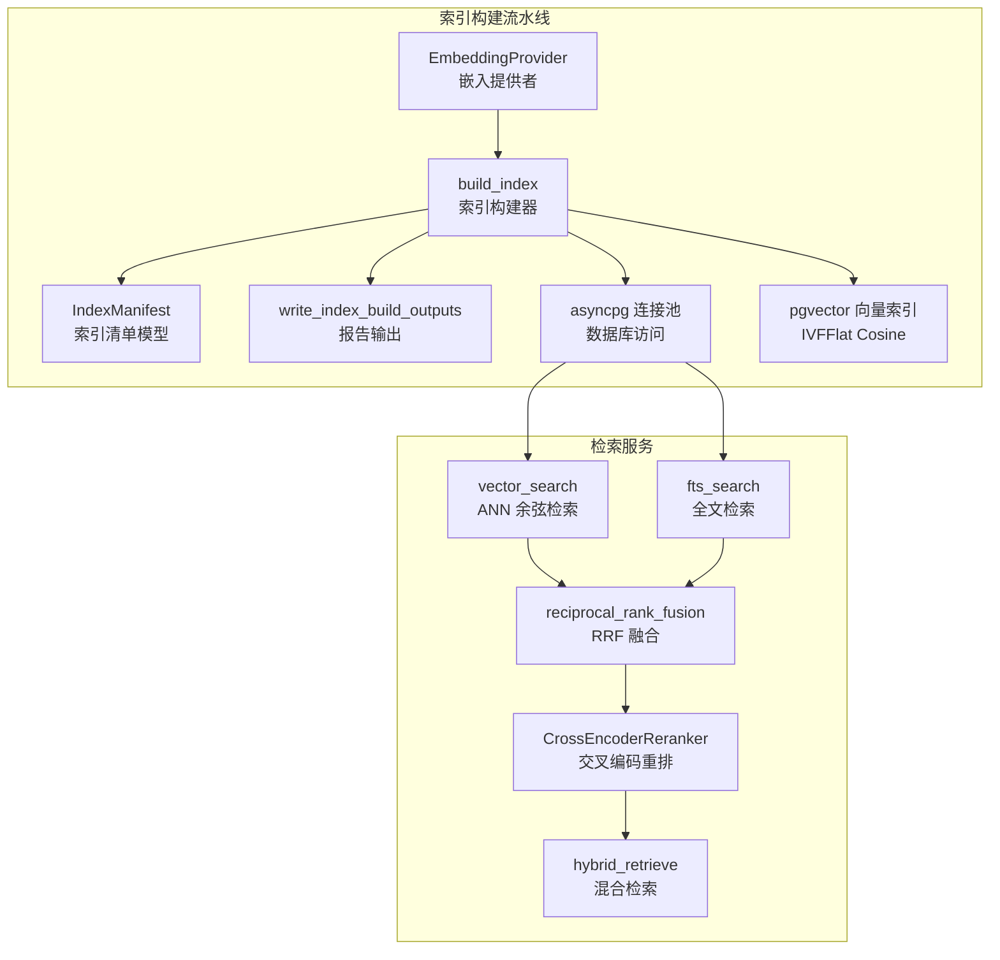
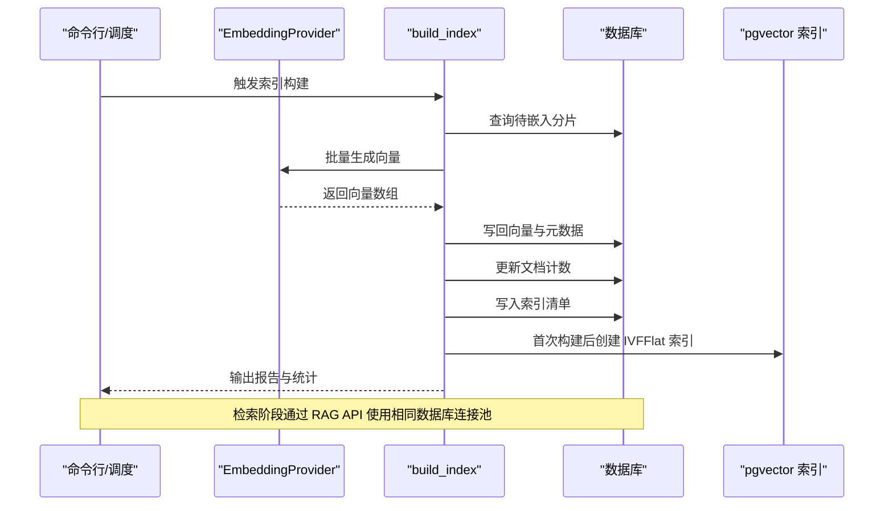
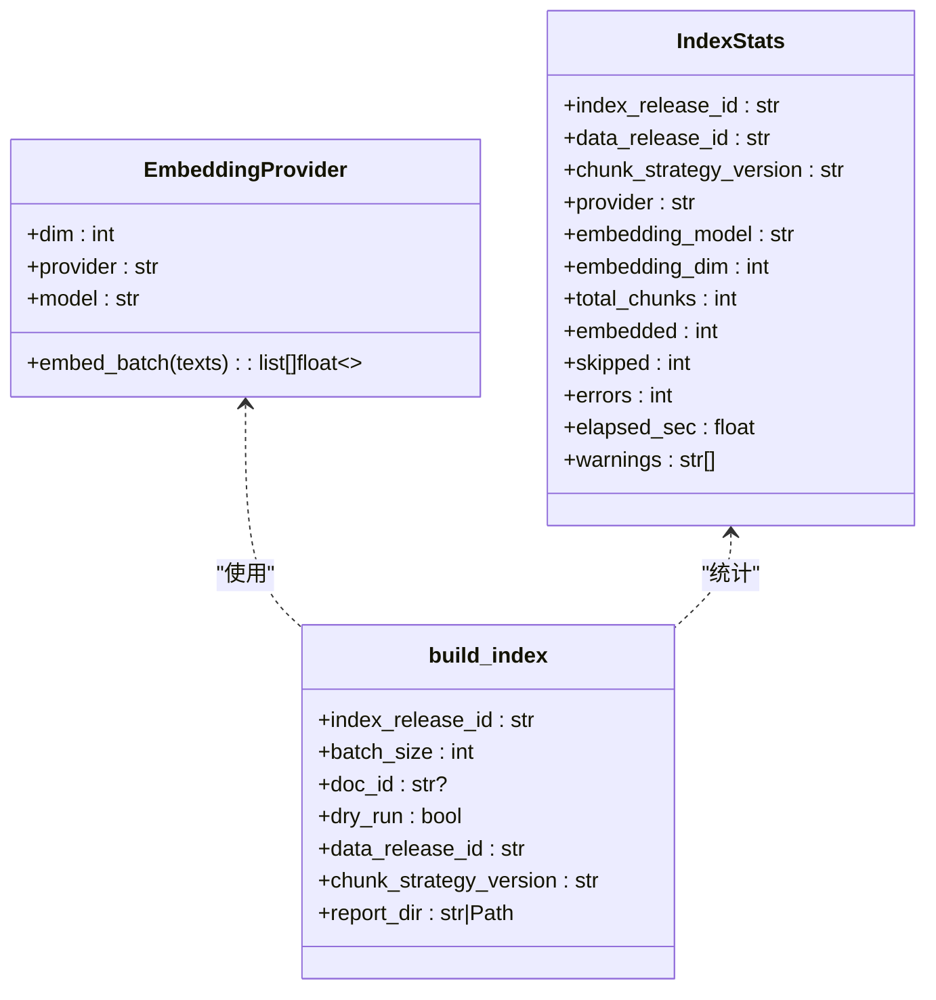
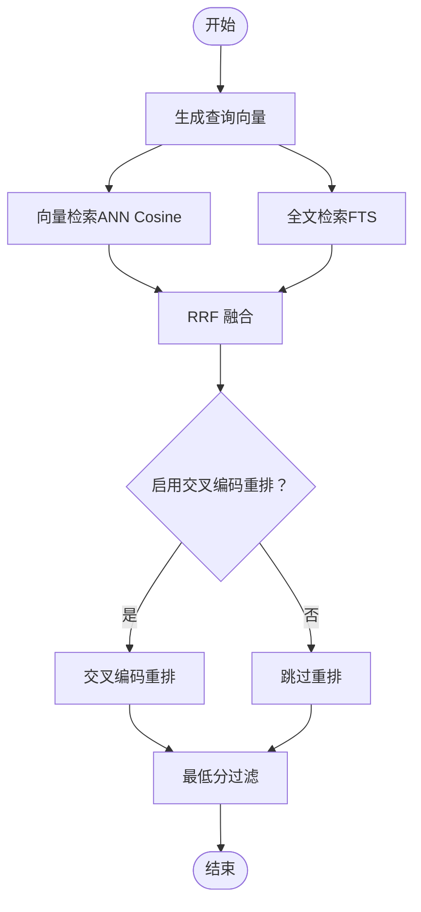
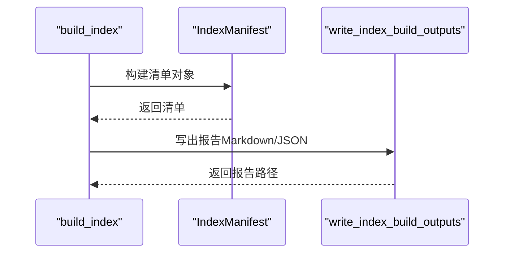
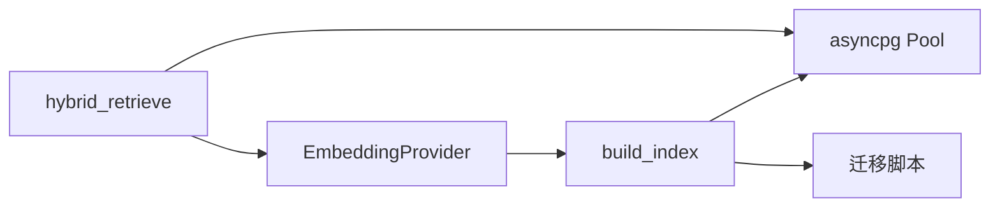

# 索引与向量存储

<cite>
**本文引用的文件**
- [embedder.py](file://pipelines/indexing/embedder.py)
- [assets.py](file://pipelines/indexing/assets.py)
- [index_manifest.py](file://pipelines/indexing/index_manifest.py)
- [reporting.py](file://pipelines/indexing/reporting.py)
- [retrieval.py](file://services/rag_api/app/retrieval.py)
- [db.py](file://pipelines/ingestion/db.py)
- [003_week08_index_rag.sql](file://infra/migrations/003_week08_index_rag.sql)
- [rag_models.py](file://services/rag_api/app/models/rag_models.py)
- [query.py](file://services/rag_api/app/routers/query.py)
- [config.py](file://services/rag_api/app/config.py)
- [week08-rag-engineering.md](file://runbooks/week08-rag-engineering.md)
- [test_week8_index_build.py](file://tests/integration/test_week8_index_build.py)
- [index_build_report.sample.md](file://reports/week08/index_build_report.sample.md)
</cite>

## 目录
1. [简介](#简介)
2. [项目结构](#项目结构)
3. [核心组件](#核心组件)
4. [架构总览](#架构总览)
5. [详细组件分析](#详细组件分析)
6. [依赖分析](#依赖分析)
7. [性能考虑](#性能考虑)
8. [故障排除指南](#故障排除指南)
9. [结论](#结论)
10. [附录](#附录)

## 简介
本文件系统性梳理索引与向量存储子系统，覆盖向量嵌入生成、索引构建与管理、检索链路与排序、质量评估与报告、以及扩展与运维最佳实践。面向不同技术背景读者，采用渐进式讲解与可视化图示，帮助快速理解并落地工程实践。

## 项目结构
该子系统由“索引构建流水线”和“检索服务”两大模块构成：
- 索引构建流水线：负责从知识分片表读取内容，调用嵌入提供者生成向量，写回向量列并建立向量索引，同时产出索引清单与报告。
- 检索服务：提供混合检索能力（向量 + 全文 + 重排），支持元数据过滤、RRF 融合与可选交叉编码精排，并输出结构化响应与审计日志。

图表来源
- [embedder.py:36-140](file://pipelines/indexing/embedder.py#L36-L140)
- [embedder.py:160-351](file://pipelines/indexing/embedder.py#L160-L351)
- [index_manifest.py:9-30](file://pipelines/indexing/index_manifest.py#L9-L30)
- [reporting.py:11-52](file://pipelines/indexing/reporting.py#L11-L52)
- [retrieval.py:132-443](file://services/rag_api/app/retrieval.py#L132-L443)

章节来源
- [embedder.py:1-429](file://pipelines/indexing/embedder.py#L1-L429)
- [retrieval.py:1-445](file://services/rag_api/app/retrieval.py#L1-L445)
- [db.py:21-44](file://pipelines/ingestion/db.py#L21-L44)

## 核心组件
- 嵌入提供者（EmbeddingProvider）
  - 支持多后端优先级探测：Voyage AI、OpenAI、本地 sentence-transformers；自动回退与维度校验。
- 索引构建器（build_index）
  - 读取未嵌入或版本不一致的分片，批量生成向量并写回，更新文档计数与索引清单，首次构建后创建 IVFFlat 向量索引。
- 检索引擎（hybrid_retrieve）
  - 并行向量检索与全文检索，RRF 融合，可选交叉编码重排，支持元数据过滤与最低分过滤。
- 报告与清单（IndexManifest、write_index_build_outputs）
  - 生成索引构建报告与 JSON 清单，记录质量门禁与警告信息。
- 数据库与索引（asyncpg 连接池、pgvector IVFFlat）
  - 统一连接池管理，迁移脚本新增索引与审计表，建立必要索引以支撑检索性能。

章节来源
- [embedder.py:36-140](file://pipelines/indexing/embedder.py#L36-L140)
- [embedder.py:160-351](file://pipelines/indexing/embedder.py#L160-L351)
- [index_manifest.py:9-80](file://pipelines/indexing/index_manifest.py#L9-L80)
- [reporting.py:11-52](file://pipelines/indexing/reporting.py#L11-L52)
- [retrieval.py:132-443](file://services/rag_api/app/retrieval.py#L132-L443)
- [db.py:21-44](file://pipelines/ingestion/db.py#L21-L44)
- [003_week08_index_rag.sql:14-77](file://infra/migrations/003_week08_index_rag.sql#L14-L77)

## 架构总览
下图展示从“索引构建”到“检索服务”的端到端流程，包括数据流、控制流与关键决策点。

图表来源
- [embedder.py:160-351](file://pipelines/indexing/embedder.py#L160-L351)
- [db.py:21-44](file://pipelines/ingestion/db.py#L21-L44)

## 详细组件分析

### 嵌入提供者与索引构建器
- 嵌入提供者
  - 优先级：voyage-2 → text-embedding-3-small → 本地 all-MiniLM-L6-v2。
  - 自动探测可用后端，失败时回退；统一返回向量数组，支持维度校验。
- 索引构建器
  - 查询策略：仅处理 embedding 为空或 index_release_id 不匹配的分片，按 doc_id、chunk_index 排序。
  - 批处理：按 batch_size 切分，逐批调用嵌入提供者，异常批次计入错误并继续。
  - 写回策略：原子更新向量列、模型信息、索引版本、数据版本、分片策略与时间戳。
  - 文档计数：按索引版本聚合统计并更新知识文档的 chunk_count。
  - 索引创建：首次构建后创建 IVFFlat 向量索引，lists 参数为分片总数平方根，保证检索效率。
  - 质量门禁：根据错误数、完成度判定质量门禁状态，生成报告与清单。

图表来源
- [embedder.py:36-140](file://pipelines/indexing/embedder.py#L36-L140)
- [embedder.py:144-158](file://pipelines/indexing/embedder.py#L144-L158)
- [embedder.py:160-351](file://pipelines/indexing/embedder.py#L160-L351)

章节来源
- [embedder.py:36-140](file://pipelines/indexing/embedder.py#L36-L140)
- [embedder.py:160-351](file://pipelines/indexing/embedder.py#L160-L351)

### 检索链路与排序
- 元数据过滤
  - 支持 index_release_id、data_release_id、产品线、可见范围、授权等级、状态、质量状态等多维过滤。
- 向量检索
  - 使用 pgvector ANN 余弦相似度，基于 IVFFlat 索引加速；缺失向量的分片被过滤。
- 全文检索（FTS）
  - 使用 PostgreSQL tsvector/tsquery 进行关键词检索，返回 ts_rank 作为分数。
- RRF 融合
  - 将两路检索结果按 Reciprocal Rank Fusion 合并，k 默认 60。
- 交叉编码重排（可选）
  - 使用 cross-encoder 模型对候选进行细粒度重排；不可用时回退至 RRF 排序。
- 最终筛选
  - 可按最低分阈值过滤结果，保证回答质量。

图表来源
- [retrieval.py:132-443](file://services/rag_api/app/retrieval.py#L132-L443)

章节来源
- [retrieval.py:61-96](file://services/rag_api/app/retrieval.py#L61-L96)
- [retrieval.py:132-443](file://services/rag_api/app/retrieval.py#L132-L443)

### 报告与清单
- 索引清单模型
  - 记录索引版本、数据版本、分片策略、嵌入模型与维度、提供方、构建时间、源表、统计指标、质量门禁与警告。
- 报告输出
  - 生成 Markdown 与 JSON 两种格式报告，便于人工审阅与自动化处理。
- 质量门禁规则
  - 存在错误：fail；总量为 0 或未完全嵌入：warn；否则：pass。

图表来源
- [index_manifest.py:9-80](file://pipelines/indexing/index_manifest.py#L9-L80)
- [reporting.py:11-52](file://pipelines/indexing/reporting.py#L11-L52)
- [embedder.py:354-371](file://pipelines/indexing/embedder.py#L354-L371)

章节来源
- [index_manifest.py:9-80](file://pipelines/indexing/index_manifest.py#L9-L80)
- [reporting.py:11-52](file://pipelines/indexing/reporting.py#L11-L52)
- [test_week8_index_build.py:12-34](file://tests/integration/test_week8_index_build.py#L12-L34)
- [index_build_report.sample.md:1-23](file://reports/week08/index_build_report.sample.md#L1-L23)

### 数据库与索引
- 连接池
  - asyncpg 连接池，支持懒加载与上下文管理，避免资源泄漏。
- 迁移脚本
  - 新增知识文档与分片的元数据列，创建索引清单与审计日志表，建立必要索引提升查询性能。
- 向量索引
  - 首次构建后创建 IVFFlat 索引，使用 cosine 距离；lists 参数自适应分片数量。

章节来源
- [db.py:21-44](file://pipelines/ingestion/db.py#L21-L44)
- [003_week08_index_rag.sql:14-77](file://infra/migrations/003_week08_index_rag.sql#L14-L77)
- [embedder.py:374-395](file://pipelines/indexing/embedder.py#L374-L395)

## 依赖分析
- 组件耦合
  - 索引构建器依赖嵌入提供者与数据库连接池；检索服务依赖数据库连接池与嵌入提供者；两者共享知识分片与知识文档表。
- 外部依赖
  - 嵌入提供者依赖第三方 API（Voyage AI、OpenAI）或本地模型（sentence-transformers）。
  - 检索服务依赖 pgvector 与 PostgreSQL FTS。
- 循环依赖
  - 当前模块间无循环依赖，职责清晰。

图表来源
- [embedder.py:36-140](file://pipelines/indexing/embedder.py#L36-L140)
- [embedder.py:160-351](file://pipelines/indexing/embedder.py#L160-L351)
- [retrieval.py:132-443](file://services/rag_api/app/retrieval.py#L132-L443)
- [db.py:21-44](file://pipelines/ingestion/db.py#L21-L44)
- [003_week08_index_rag.sql:14-77](file://infra/migrations/003_week08_index_rag.sql#L14-L77)

章节来源
- [embedder.py:36-140](file://pipelines/indexing/embedder.py#L36-L140)
- [retrieval.py:132-443](file://services/rag_api/app/retrieval.py#L132-L443)
- [db.py:21-44](file://pipelines/ingestion/db.py#L21-L44)

## 性能考虑
- 嵌入维度一致性
  - 嵌入提供者输出维度需与数据库向量列维度一致；不一致将触发质量门禁并拒绝写入。
- 批处理大小
  - 增大 batch_size 可提升吞吐，但需平衡内存与 API 速率限制；建议结合硬件与网络条件调优。
- 向量索引参数
  - IVFFlat 的 lists 参数与分片数量平方根相关；分片越多，lists 建议增大以提升召回与精度。
- 检索参数
  - top_k 与 RRF 的 k 值影响融合效果；重排开启会增加延迟，建议在性能与精度之间权衡。
- 数据库索引
  - 建立知识文档与分片的过滤字段索引，有助于检索阶段快速过滤无效分片。

章节来源
- [embedder.py:227-236](file://pipelines/indexing/embedder.py#L227-L236)
- [embedder.py:374-395](file://pipelines/indexing/embedder.py#L374-L395)
- [retrieval.py:307-337](file://services/rag_api/app/retrieval.py#L307-L337)
- [003_week08_index_rag.sql:67-77](file://infra/migrations/003_week08_index_rag.sql#L67-L77)

## 故障排除指南
- 维度不匹配
  - 现象：构建阶段记录错误并跳过写入。
  - 处理：选择与数据库向量列维度一致的嵌入模型，或显式迁移向量列维度。
- 嵌入提供者不可用
  - 现象：构建阶段直接失败或报告警告。
  - 处理：检查 API 密钥与网络连通性，确认本地模型可用。
- 空检索结果
  - 现象：RAG API 返回空证据或结构化无答案。
  - 处理：确认索引已构建、index_release_id 正确、过滤条件不过于严格。
- 重排器不可用
  - 现象：返回 RRF 分数而非重排分数。
  - 处理：保持 RRF 作为回退路径，无需中断服务。
- 引用缺失
  - 现象：响应缺少引用或证据 ID。
  - 处理：检查检索投影是否包含证据锚点信息，确保生成器仅使用检索提供的证据。

章节来源
- [week08-rag-engineering.md:91-99](file://runbooks/week08-rag-engineering.md#L91-L99)
- [embedder.py:227-236](file://pipelines/indexing/embedder.py#L227-L236)
- [retrieval.py:342-378](file://services/rag_api/app/retrieval.py#L342-L378)

## 结论
该索引与向量存储系统通过“多后端嵌入提供者 + 批量索引构建 + pgvector 向量索引 + 混合检索链路”的组合，实现了从“可检索”到“可回答”的工程闭环。其设计强调可观测性（报告与清单）、可维护性（统一连接池与迁移脚本）与可扩展性（IVFFlat 参数化与元数据过滤）。建议在生产环境中持续关注维度一致性、索引参数与检索阈值的调优，并配合容量规划与监控告警体系保障稳定性。

## 附录

### 索引构建与管理要点
- 增量更新
  - 通过“embedding 为空或版本不一致”的条件筛选，仅处理未嵌入或版本陈旧的分片，降低全量压力。
- 批量重建
  - 通过 CLI 参数控制批大小与释放 ID，支持在隔离版本下进行安全重建。
- 版本控制
  - 使用 index_release_id 与 data_release_id 标识索引与数据版本，配合质量门禁与报告进行治理。

章节来源
- [embedder.py:183-200](file://pipelines/indexing/embedder.py#L183-L200)
- [embedder.py:400-424](file://pipelines/indexing/embedder.py#L400-L424)
- [index_manifest.py:32-37](file://pipelines/indexing/index_manifest.py#L32-L37)

### 检索参数与配置
- 检索服务默认参数
  - top_k、最小分数、是否启用重排等可通过配置注入。
- RAG API 请求模型
  - 包含产品线、模态、过滤字段、索引版本、数据版本等，确保检索可控与可审计。

章节来源
- [config.py:29-38](file://services/rag_api/app/config.py#L29-L38)
- [rag_models.py:140-167](file://services/rag_api/app/models/rag_models.py#L140-L167)