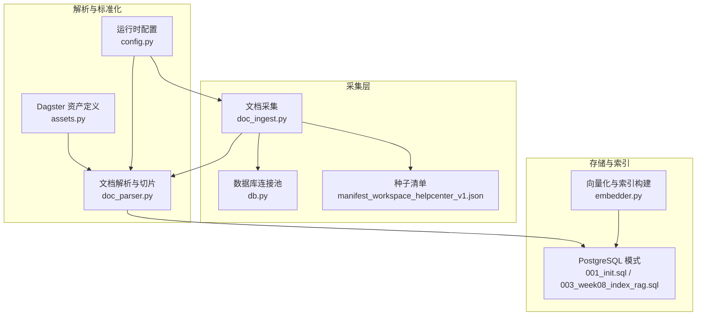
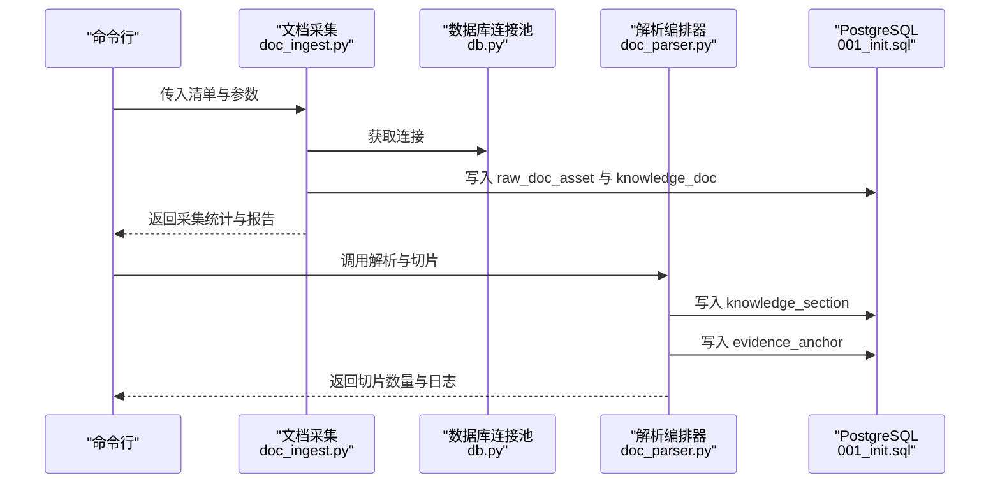
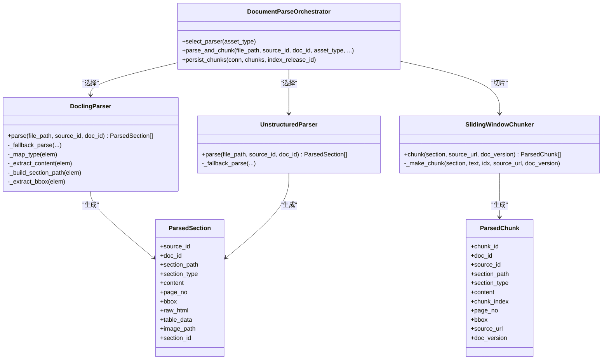
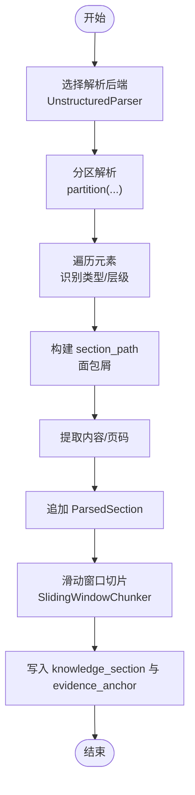
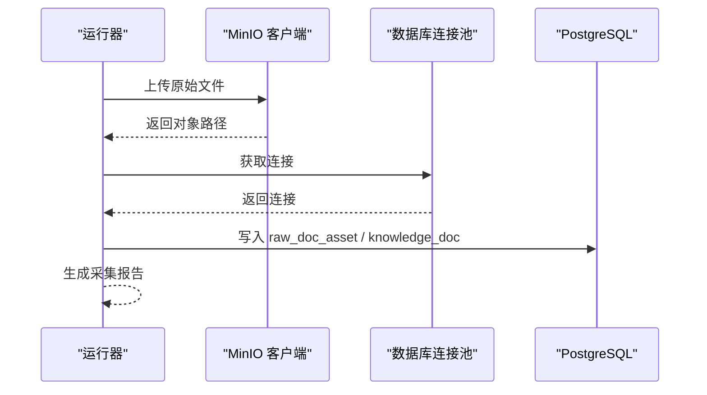
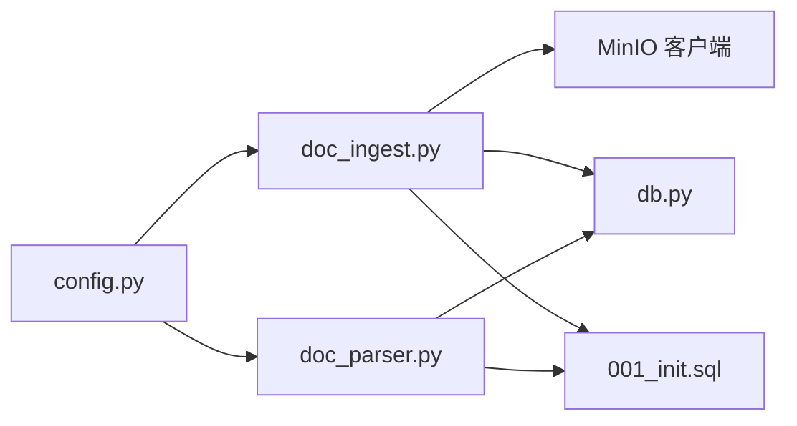

# 解析与标准化

<cite>
**本文引用的文件**
- [doc_parser.py](file://pipelines/parse_normalize/doc_parser.py)
- [assets.py](file://pipelines/parse_normalize/assets.py)
- [doc_ingest.py](file://pipelines/ingestion/doc_ingest.py)
- [db.py](file://pipelines/ingestion/db.py)
- [reporting.py](file://pipelines/ingestion/reporting.py)
- [config.py](file://pipelines/resources/config.py)
- [doc_asset_contract.json](file://contracts/data/doc_asset_contract.json)
- [manifest_workspace_helpcenter_v1.json](file://data/seed_manifests/manifest_workspace_helpcenter_v1.json)
- [001_init.sql](file://infra/migrations/001_init.sql)
- [003_week08_index_rag.sql](file://infra/migrations/003_week08_index_rag.sql)
- [embedder.py](file://pipelines/indexing/embedder.py)
- [ticket_simulator.py](file://data/synthetic_generators/ticket_simulator.py)
</cite>

## 目录
1. [简介](#简介)
2. [项目结构](#项目结构)
3. [核心组件](#核心组件)
4. [架构总览](#架构总览)
5. [详细组件分析](#详细组件分析)
6. [依赖分析](#依赖分析)
7. [性能考虑](#性能考虑)
8. [故障排查指南](#故障排查指南)
9. [结论](#结论)
10. [附录](#附录)

## 简介
本文件系统性梳理“解析与标准化”子系统，覆盖多模态内容（尤其是文档）的解析、结构化抽取、切片与证据锚点生成，以及后续写入知识库与向量化索引的全流程。文档重点说明：
- 支持的文件类型与解析策略（PDF/Word vs HTML/FAQ/发布说明/API 文档等）
- 文本预处理、分词、去噪与标准化的实现思路
- 元数据提取与证据锚点（evidence anchor）机制
- 性能优化、内存管理与并发处理
- 解析失败处理、错误日志与质量评估
- 扩展新文件格式与解析算法的路径

## 项目结构
解析与标准化相关代码主要分布在以下模块：
- 解析与切片：pipelines/parse_normalize/doc_parser.py
- 资产定义（Dagster）：pipelines/parse_normalize/assets.py
- 文档采集与入库：pipelines/ingestion/doc_ingest.py
- 数据库连接池：pipelines/ingestion/db.py
- 报告与状态汇总：pipelines/ingestion/reporting.py
- 运行时配置：pipelines/resources/config.py
- 数据契约（JSON Schema）：contracts/data/doc_asset_contract.json
- 种子清单示例：data/seed_manifests/manifest_workspace_helpcenter_v1.json
- 数据库模式与索引：infra/migrations/*.sql
- 向量化与索引构建：pipelines/indexing/embedder.py
- 合成工单数据生成器：data/synthetic_generators/ticket_simulator.py

**图表来源**
- [doc_ingest.py:172-276](file://pipelines/ingestion/doc_ingest.py#L172-L276)
- [doc_parser.py:325-413](file://pipelines/parse_normalize/doc_parser.py#L325-L413)
- [assets.py:11-81](file://pipelines/parse_normalize/assets.py#L11-L81)
- [db.py:21-44](file://pipelines/ingestion/db.py#L21-L44)
- [config.py:67-113](file://pipelines/resources/config.py#L67-L113)
- [001_init.sql:165-209](file://infra/migrations/001_init.sql#L165-L209)
- [003_week08_index_rag.sql:1-30](file://infra/migrations/003_week08_index_rag.sql#L1-L30)
- [embedder.py:328-371](file://pipelines/indexing/embedder.py#L328-L371)

**章节来源**
- [doc_ingest.py:172-276](file://pipelines/ingestion/doc_ingest.py#L172-L276)
- [doc_parser.py:325-413](file://pipelines/parse_normalize/doc_parser.py#L325-L413)
- [assets.py:11-81](file://pipelines/parse_normalize/assets.py#L11-L81)
- [db.py:21-44](file://pipelines/ingestion/db.py#L21-L44)
- [config.py:67-113](file://pipelines/resources/config.py#L67-L113)
- [001_init.sql:165-209](file://infra/migrations/001_init.sql#L165-L209)
- [003_week08_index_rag.sql:1-30](file://infra/migrations/003_week08_index_rag.sql#L1-L30)
- [embedder.py:328-371](file://pipelines/indexing/embedder.py#L328-L371)

## 核心组件
- 文档解析后端（可配置）：Docling（结构保真，适合 PDF/Word）、Unstructured（适合 HTML/FAQ/发布说明/API 文档）
- 统一结构化输出：ParsedSection/ParsedChunk
- 切片器：滑动窗口切片，保留 section_path、page_no、bbox 等证据锚点
- 解析编排器：根据 asset_type 选择解析后端，执行解析、切片与持久化
- DAG 资产：定义 parsed_doc_sections 与 knowledge_chunks 的资产接口与元数据契约
- 数据库写入：将 chunks 写入 knowledge_section，并写入 evidence_anchor
- 报告与状态：汇总采集与解析状态，推荐恢复动作

**章节来源**
- [doc_parser.py:74-166](file://pipelines/parse_normalize/doc_parser.py#L74-L166)
- [doc_parser.py:170-256](file://pipelines/parse_normalize/doc_parser.py#L170-L256)
- [doc_parser.py:260-321](file://pipelines/parse_normalize/doc_parser.py#L260-L321)
- [doc_parser.py:325-413](file://pipelines/parse_normalize/doc_parser.py#L325-L413)
- [assets.py:11-81](file://pipelines/parse_normalize/assets.py#L11-L81)
- [reporting.py:41-62](file://pipelines/ingestion/reporting.py#L41-L62)

## 架构总览
解析与标准化系统采用“采集 → 解析 → 切片 → 写入知识库”的流水线式设计。采集阶段负责将源文件上传至对象存储并写入元数据；解析阶段根据资产类型选择合适的解析后端，输出结构化 section 并进行切片；最后将切片写入知识库表并生成证据锚点。

**图表来源**
- [doc_ingest.py:172-276](file://pipelines/ingestion/doc_ingest.py#L172-L276)
- [doc_parser.py:365-413](file://pipelines/parse_normalize/doc_parser.py#L365-L413)
- [001_init.sql:165-209](file://infra/migrations/001_init.sql#L165-L209)

## 详细组件分析

### 文档解析与切片（Docling/Unstructured）
- DoclingParser
  - 适用场景：PDF/Word，保留结构层级与坐标
  - 降级策略：当不可用时按段落切分
  - 输出：ParsedSection 列表
- UnstructuredParser
  - 适用场景：HTML/FAQ/发布说明/API 文档
  - 降级策略：HTML 解析失败时按换行切分
  - 输出：ParsedSection 列表
- SlidingWindowChunker
  - 滑动窗口切片，保留 section_path、page_no、bbox 等证据锚点
  - 输出：ParsedChunk 列表
- DocumentParseOrchestrator
  - 根据 asset_type 选择解析后端
  - 调用切片器并将 chunks 写入数据库

**图表来源**
- [doc_parser.py:74-166](file://pipelines/parse_normalize/doc_parser.py#L74-L166)
- [doc_parser.py:170-256](file://pipelines/parse_normalize/doc_parser.py#L170-L256)
- [doc_parser.py:260-321](file://pipelines/parse_normalize/doc_parser.py#L260-L321)
- [doc_parser.py:325-413](file://pipelines/parse_normalize/doc_parser.py#L325-L413)

**章节来源**
- [doc_parser.py:74-166](file://pipelines/parse_normalize/doc_parser.py#L74-L166)
- [doc_parser.py:170-256](file://pipelines/parse_normalize/doc_parser.py#L170-L256)
- [doc_parser.py:260-321](file://pipelines/parse_normalize/doc_parser.py#L260-L321)
- [doc_parser.py:325-413](file://pipelines/parse_normalize/doc_parser.py#L325-L413)

### 解析流程（示例：HTML/FAQ/发布说明）

**图表来源**
- [doc_parser.py:178-222](file://pipelines/parse_normalize/doc_parser.py#L178-L222)
- [doc_parser.py:272-321](file://pipelines/parse_normalize/doc_parser.py#L272-L321)
- [doc_parser.py:365-413](file://pipelines/parse_normalize/doc_parser.py#L365-L413)

**章节来源**
- [doc_parser.py:178-222](file://pipelines/parse_normalize/doc_parser.py#L178-L222)
- [doc_parser.py:272-321](file://pipelines/parse_normalize/doc_parser.py#L272-L321)
- [doc_parser.py:365-413](file://pipelines/parse_normalize/doc_parser.py#L365-L413)

### 文档采集与入库（MinIO + PostgreSQL）
- MinIO 客户端封装：上传/存在性检查
- 读取资产字节：本地/映射/远程路径
- 写入 raw_doc_asset 与 knowledge_doc
- 采集统计与报告：汇总状态、推荐恢复动作

**图表来源**
- [doc_ingest.py:37-78](file://pipelines/ingestion/doc_ingest.py#L37-L78)
- [doc_ingest.py:82-106](file://pipelines/ingestion/doc_ingest.py#L82-L106)
- [doc_ingest.py:111-167](file://pipelines/ingestion/doc_ingest.py#L111-L167)
- [db.py:21-44](file://pipelines/ingestion/db.py#L21-L44)

**章节来源**
- [doc_ingest.py:37-78](file://pipelines/ingestion/doc_ingest.py#L37-L78)
- [doc_ingest.py:82-106](file://pipelines/ingestion/doc_ingest.py#L82-L106)
- [doc_ingest.py:111-167](file://pipelines/ingestion/doc_ingest.py#L111-L167)
- [db.py:21-44](file://pipelines/ingestion/db.py#L21-L44)

### 数据契约与元数据
- 文档资产契约（JSON Schema）定义了 source_id、asset_type、schema_version、source_fingerprint、ingest_batch_id、license_tag、pii_level、quality_gate、owner、product_line、doc_version、language、page_count、raw_object_path、ingest_ts、tags 等字段
- 种子清单示例展示了如何声明资产类型与解析策略（parser、chunk_size、chunk_overlap、pii_scan）

```mermaid
erDiagram
RAW_DOC_ASSET {
text source_id PK
text asset_type
text raw_object_path
text manifest_id
text ingest_batch_id
text license_tag
text product_line
text doc_version
int page_count
text source_fingerprint
text source_url
enum pii_level
enum quality_gate
text schema_version
timestamptz ingest_ts
}
KNOWLEDGE_DOC {
text doc_id PK
text source_id FK
text asset_type
text product_line
text doc_version
text title
text language
int page_count
int section_count
int chunk_count
text source_url
text source_fingerprint
text license_tag
enum pii_level
enum quality_gate
text data_release_id
text index_release_id
timestamptz indexed_at
timestamptz created_at
}
KNOWLEDGE_SECTION {
text section_id PK
text doc_id FK
text source_id
text section_path
text section_type
text content
int page_no
text bbox
int chunk_index
vector embedding
text embedding_model
text data_release_id
text index_release_id
timestamptz created_at
}
EVIDENCE_ANCHOR {
text anchor_id PK
text chunk_id FK
text source_id
text source_url
int page_no
text section_path
text doc_version
enum modality
double start_ts
double end_ts
timestamptz created_at
}
RAW_DOC_ASSET ||--|| KNOWLEDGE_DOC : "引用"
KNOWLEDGE_DOC ||--o{ KNOWLEDGE_SECTION : "包含"
KNOWLEDGE_SECTION ||--|| EVIDENCE_ANCHOR : "锚定"
```

**图表来源**
- [doc_asset_contract.json:1-94](file://contracts/data/doc_asset_contract.json#L1-L94)
- [001_init.sql:36-53](file://infra/migrations/001_init.sql#L36-L53)
- [001_init.sql:137-157](file://infra/migrations/001_init.sql#L137-L157)
- [001_init.sql:165-181](file://infra/migrations/001_init.sql#L165-L181)
- [001_init.sql:197-209](file://infra/migrations/001_init.sql#L197-L209)

**章节来源**
- [doc_asset_contract.json:1-94](file://contracts/data/doc_asset_contract.json#L1-L94)
- [001_init.sql:36-53](file://infra/migrations/001_init.sql#L36-L53)
- [001_init.sql:137-157](file://infra/migrations/001_init.sql#L137-L157)
- [001_init.sql:165-181](file://infra/migrations/001_init.sql#L165-L181)
- [001_init.sql:197-209](file://infra/migrations/001_init.sql#L197-L209)

### DAG 资产与规范化
- parsed_doc_sections：占位实现，Week07 将接入 Docling/Unstructured，保留页码/段落/表格/图像/坐标
- knowledge_chunks：占位实现，Week07-08 实现滑动窗口切分与向量嵌入写入
- ticket_facts：占位实现，Week03-04 规范化工单事件

**章节来源**
- [assets.py:11-81](file://pipelines/parse_normalize/assets.py#L11-L81)

### 向量化与索引构建
- 索引清单表 index_manifest 记录构建元信息（模型、维度、提供方、质量门禁等）
- 向量化嵌入写入 knowledge_section.embedding，并在 Week08 建立向量索引
- 构建完成后写入 index_manifest 并输出报告

**章节来源**
- [003_week08_index_rag.sql:1-30](file://infra/migrations/003_week08_index_rag.sql#L1-L30)
- [embedder.py:328-371](file://pipelines/indexing/embedder.py#L328-L371)

## 依赖分析
- 组件耦合
  - DocumentParseOrchestrator 依赖 DoclingParser/UnstructuredParser/SlidingWindowChunker
  - 解析与切片依赖数据库连接池（异步上下文）
  - 采集与解析之间通过清单与对象存储解耦
- 外部依赖
  - Docling、Unstructured（解析后端）
  - MinIO（对象存储）
  - PostgreSQL（知识库与证据锚点）
  - asyncpg（异步连接池）

**图表来源**
- [doc_parser.py:325-413](file://pipelines/parse_normalize/doc_parser.py#L325-L413)
- [db.py:21-44](file://pipelines/ingestion/db.py#L21-L44)
- [doc_ingest.py:37-78](file://pipelines/ingestion/doc_ingest.py#L37-L78)
- [config.py:67-113](file://pipelines/resources/config.py#L67-L113)
- [001_init.sql:165-209](file://infra/migrations/001_init.sql#L165-L209)

**章节来源**
- [doc_parser.py:325-413](file://pipelines/parse_normalize/doc_parser.py#L325-L413)
- [db.py:21-44](file://pipelines/ingestion/db.py#L21-L44)
- [doc_ingest.py:37-78](file://pipelines/ingestion/doc_ingest.py#L37-L78)
- [config.py:67-113](file://pipelines/resources/config.py#L67-L113)
- [001_init.sql:165-209](file://infra/migrations/001_init.sql#L165-L209)

## 性能考虑
- 并发与连接池
  - 使用 asyncpg 连接池，避免阻塞，提升批量写入吞吐
  - 解析与写入采用异步协程，减少等待
- 切片策略
  - 滑动窗口切片参数（chunk_size、overlap）影响召回与检索效率，需结合目标嵌入维度与检索需求权衡
- 存储索引
  - FTS 索引（GIN + to_tsvector）用于文本检索
  - Week08 建立向量索引（ivfflat）以支持相似度检索
- 内存管理
  - 解析后端按需加载与释放资源；降级路径避免大文本一次性载入
- I/O 优化
  - MinIO 上传前检查对象是否存在，避免重复上传

**章节来源**
- [db.py:21-44](file://pipelines/ingestion/db.py#L21-L44)
- [doc_parser.py:268-294](file://pipelines/parse_normalize/doc_parser.py#L268-L294)
- [001_init.sql:183-193](file://infra/migrations/001_init.sql#L183-L193)
- [003_week08_index_rag.sql:1-30](file://infra/migrations/003_week08_index_rag.sql#L1-L30)

## 故障排查指南
- 解析失败
  - Docling/Unstructured 未安装或导入失败：触发降级路径（按段落/换行切分），并记录警告日志
  - 文件编码问题：忽略错误读取，避免中断
- 写入失败
  - 数据库写入异常：记录错误并跳过该 chunk，不影响整体流程
- 采集失败
  - MinIO 不可用：跳过上传，记录警告；继续写入元数据
  - 文件不存在：跳过并统计跳过数量
- 质量评估与恢复
  - 通过汇总状态与推荐动作决定下一步操作（重跑/重试/回放/修复元数据）

**章节来源**
- [doc_parser.py:84-87](file://pipelines/parse_normalize/doc_parser.py#L84-L87)
- [doc_parser.py:148-151](file://pipelines/parse_normalize/doc_parser.py#L148-L151)
- [doc_parser.py:180-186](file://pipelines/parse_normalize/doc_parser.py#L180-L186)
- [doc_parser.py:224-241](file://pipelines/parse_normalize/doc_parser.py#L224-L241)
- [doc_parser.py:410-413](file://pipelines/parse_normalize/doc_parser.py#L410-L413)
- [doc_ingest.py:210-214](file://pipelines/ingestion/doc_ingest.py#L210-L214)
- [doc_ingest.py:232-235](file://pipelines/ingestion/doc_ingest.py#L232-L235)
- [reporting.py:41-62](file://pipelines/ingestion/reporting.py#L41-L62)

## 结论
解析与标准化系统通过“采集 → 解析 → 切片 → 写入”的流水线，实现了对多模态文档的结构化抽取与证据锚点生成。系统具备良好的可扩展性：解析后端可插拔、切片策略可配置、数据库模式支持向量化检索。通过报告与状态汇总，能够快速定位问题并指导恢复。

## 附录

### 文件格式支持与解析策略
- PDF/Word：优先使用 Docling，结构保真，保留坐标与层级
- HTML/FAQ/发布说明/API 文档：使用 Unstructured，提取结构化元素
- 降级策略：解析后端不可用时按段落/换行切分，保证基本可用

**章节来源**
- [doc_parser.py:74-166](file://pipelines/parse_normalize/doc_parser.py#L74-L166)
- [doc_parser.py:170-256](file://pipelines/parse_normalize/doc_parser.py#L170-L256)

### 文本预处理、分词、去噪与标准化
- 预处理：去除空白、HTML 标签剥离（Unstructured 降级路径）
- 分词：按字符/单词粒度切分（由切片器控制）
- 去噪：过滤极短片段、空内容
- 标准化：统一输出 ParsedSection/ParsedChunk，保留证据锚点

**章节来源**
- [doc_parser.py:124-129](file://pipelines/parse_normalize/doc_parser.py#L124-L129)
- [doc_parser.py:224-255](file://pipelines/parse_normalize/doc_parser.py#L224-L255)
- [doc_parser.py:272-321](file://pipelines/parse_normalize/doc_parser.py#L272-L321)

### 元数据提取与证据锚点
- 元数据字段：source_id、doc_id、section_path、section_type、page_no、bbox、content、source_url、doc_version
- 证据锚点：evidence_anchor 包含 source_id、source_url、page_no、section_path、doc_version、modality

**章节来源**
- [doc_parser.py:39-70](file://pipelines/parse_normalize/doc_parser.py#L39-L70)
- [doc_parser.py:394-408](file://pipelines/parse_normalize/doc_parser.py#L394-L408)
- [001_init.sql:197-209](file://infra/migrations/001_init.sql#L197-L209)

### 扩展新文件格式与解析算法
- 新增解析后端：实现与 DoclingParser/UnstructuredParser 相同接口的类，返回 ParsedSection 列表
- 注册解析器：在 DocumentParseOrchestrator.select_parser 中添加类型分支
- 切片策略：根据新格式调整切片参数（如表格/图像的特殊处理）
- 数据库写入：确保 knowledge_section/evidence_anchor 字段齐全

**章节来源**
- [doc_parser.py:335-340](file://pipelines/parse_normalize/doc_parser.py#L335-L340)
- [doc_parser.py:325-363](file://pipelines/parse_normalize/doc_parser.py#L325-L363)

### 运行时配置与环境变量
- DATABASE_URL：PostgreSQL 连接字符串
- MINIO_ENDPOINT/ACCESS_KEY/SECRET_KEY：MinIO 访问凭据
- SEED_MANIFEST_PATH：种子清单目录
- WEEK06_*：运行时参数（报告目录、分区日期、operator 等）

**章节来源**
- [config.py:67-113](file://pipelines/resources/config.py#L67-L113)

### 示例清单与契约
- 种子清单示例：声明资产类型、解析策略（parser、chunk_size、chunk_overlap、pii_scan）
- 文档资产契约：定义字段约束与枚举值

**章节来源**
- [manifest_workspace_helpcenter_v1.json:62-67](file://data/seed_manifests/manifest_workspace_helpcenter_v1.json#L62-L67)
- [doc_asset_contract.json:1-94](file://contracts/data/doc_asset_contract.json#L1-L94)