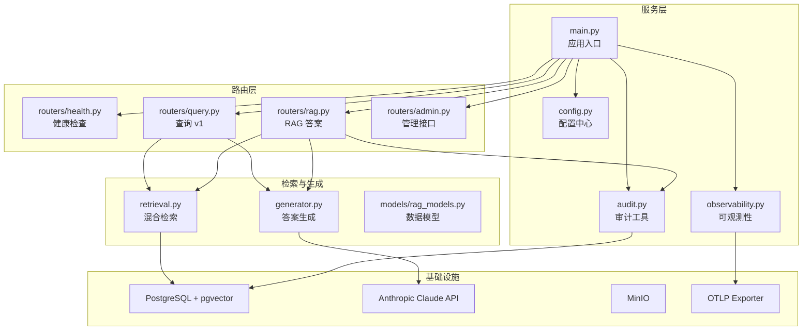
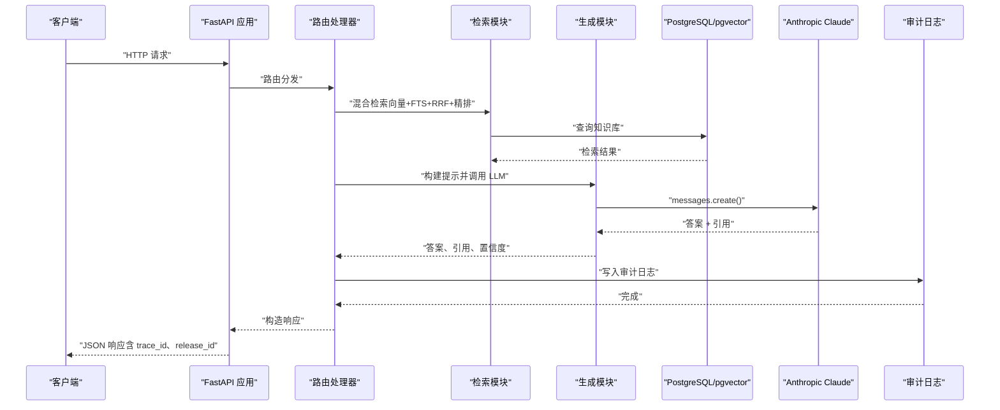
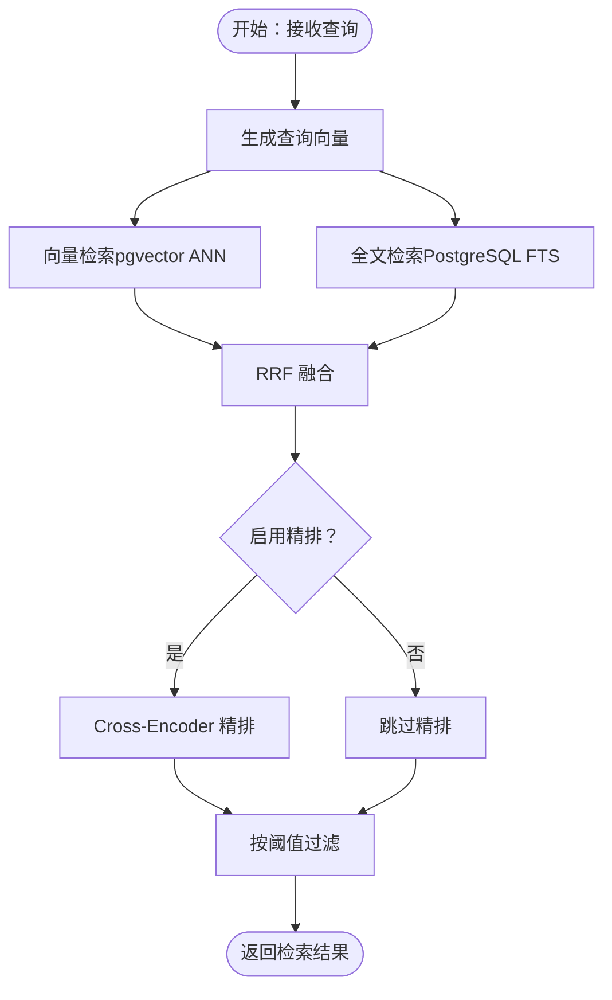
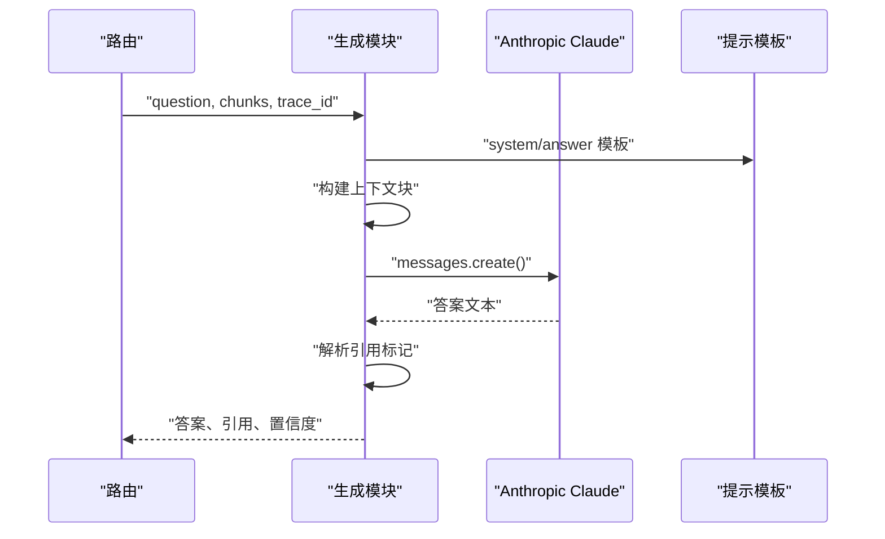
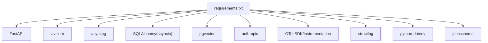

# RAG API 服务

<cite>
**本文引用的文件**
- [main.py](file://services/rag_api/app/main.py)
- [config.py](file://services/rag_api/app/config.py)
- [retrieval.py](file://services/rag_api/app/retrieval.py)
- [generator.py](file://services/rag_api/app/generator.py)
- [rag_models.py](file://services/rag_api/app/models/rag_models.py)
- [health.py](file://services/rag_api/app/routers/health.py)
- [query.py](file://services/rag_api/app/routers/query.py)
- [rag.py](file://services/rag_api/app/routers/rag.py)
- [admin.py](file://services/rag_api/app/routers/admin.py)
- [audit.py](file://services/rag_api/app/audit.py)
- [observability.py](file://services/rag_api/app/observability.py)
- [Dockerfile](file://services/rag_api/Dockerfile)
- [requirements.txt](file://services/rag_api/requirements.txt)
- [system_v1.md](file://services/rag_api/app/prompts/system_v1.md)
- [answer_v1.md](file://services/rag_api/app/prompts/answer_v1.md)
- [003_week08_index_rag.sql](file://infra/migrations/003_week08_index_rag.sql)
- [README.md](file://README.md)
</cite>

## 目录
1. [简介](#简介)
2. [项目结构](#项目结构)
3. [核心组件](#核心组件)
4. [架构总览](#架构总览)
5. [详细组件分析](#详细组件分析)
6. [依赖分析](#依赖分析)
7. [性能考虑](#性能考虑)
8. [故障排除指南](#故障排除指南)
9. [结论](#结论)
10. [附录](#附录)

## 简介
本文件为基于 FastAPI 的 RAG API 服务的详细技术文档，涵盖服务初始化、中间件配置、路由设计、查询处理流程、向量检索机制、答案生成算法、RAG 检索增强生成工作原理、健康检查端点、管理接口、审计日志、请求 ID 追踪、全局异常处理与 CORS 配置等。文档同时提供 API 使用示例、错误处理策略与性能优化建议，帮助开发者与运维人员快速理解并高效维护该服务。

## 项目结构
RAG API 服务位于 services/rag_api 目录，采用模块化组织方式，核心目录与文件如下：
- app/main.py：服务入口，初始化 FastAPI 应用、中间件与全局异常处理，注册路由。
- app/config.py：通过 pydantic-settings 注入环境变量，集中管理数据库、LLM、检索、CORS、OTel 等配置。
- app/retrieval.py：混合检索实现（向量检索 + PostgreSQL FTS + RRF 融合 + Cross-Encoder 精排）。
- app/generator.py：答案生成与提示工程，调用 Claude API，解析引用，计算置信度。
- app/models/rag_models.py：Pydantic 模型定义，统一请求/响应契约。
- app/routers/*：路由模块，包括健康检查、查询、RAG 答案、管理接口。
- app/audit.py：审计日志辅助工具，提供计时器与写入函数。
- app/observability.py：OpenTelemetry 初始化与 FastAPI Instrumentation。
- app/prompts/*：提示词模板（system/answer）。
- infra/migrations/003_week08_index_rag.sql：Week08 新增索引与审计日志表结构。
- Dockerfile 与 requirements.txt：容器化与依赖声明。

图表来源
- [main.py:1-73](file://services/rag_api/app/main.py#L1-L73)
- [config.py:1-53](file://services/rag_api/app/config.py#L1-L53)
- [retrieval.py:1-445](file://services/rag_api/app/retrieval.py#L1-L445)
- [generator.py:1-222](file://services/rag_api/app/generator.py#L1-L222)
- [rag_models.py:1-168](file://services/rag_api/app/models/rag_models.py#L1-L168)
- [health.py:1-48](file://services/rag_api/app/routers/health.py#L1-L48)
- [query.py:1-159](file://services/rag_api/app/routers/query.py#L1-L159)
- [rag.py:1-163](file://services/rag_api/app/routers/rag.py#L1-L163)
- [admin.py:1-18](file://services/rag_api/app/routers/admin.py#L1-L18)
- [audit.py:1-70](file://services/rag_api/app/audit.py#L1-L70)
- [observability.py:1-55](file://services/rag_api/app/observability.py#L1-L55)

章节来源
- [main.py:1-73](file://services/rag_api/app/main.py#L1-L73)
- [config.py:1-53](file://services/rag_api/app/config.py#L1-L53)
- [README.md:183-216](file://README.md#L183-L216)

## 核心组件
- 应用初始化与生命周期：通过 lifespan 钩子初始化可观测性；注册健康检查、查询、RAG 答案与管理接口路由。
- 中间件：CORS 中间件按配置允许跨域；HTTP 中间件注入 X-Request-ID 并透传至响应头。
- 全局异常处理：捕获未处理异常，统一返回包含错误码、消息、请求 ID 与发布版本的 JSON 响应。
- 配置中心：集中管理数据库连接、MinIO、LLM、检索参数、版本与发布、OTel、CORS、安全密钥等。
- 数据模型：严格定义请求/响应契约，确保审计追踪、证据引用与置信度字段一致。
- 检索引擎：向量检索（pgvector）、PostgreSQL 全文检索（FTS）、RRF 融合、Cross-Encoder 精排。
- 生成引擎：提示工程（system/answer 模板）、调用 Claude API、引用解析、置信度估计。
- 审计日志：非阻塞写入 rag_audit_log，记录检索证据、评分、答案、置信度与延迟等。
- 可观测性：OTel Tracing（BatchSpanProcessor + OTLP HTTP Exporter），自动注入 release_id 与 trace_id。

章节来源
- [main.py:26-73](file://services/rag_api/app/main.py#L26-L73)
- [config.py:7-53](file://services/rag_api/app/config.py#L7-L53)
- [rag_models.py:13-168](file://services/rag_api/app/models/rag_models.py#L13-L168)
- [observability.py:11-55](file://services/rag_api/app/observability.py#L11-L55)

## 架构总览
RAG API 服务以 FastAPI 为核心，围绕“检索 + 生成”的主链路构建，结合健康检查、管理接口与审计日志，形成完整的可观测、可审计、可回滚的服务体系。

图表来源
- [main.py:68-73](file://services/rag_api/app/main.py#L68-L73)
- [query.py:39-94](file://services/rag_api/app/routers/query.py#L39-L94)
- [rag.py:25-122](file://services/rag_api/app/routers/rag.py#L25-L122)
- [retrieval.py:386-444](file://services/rag_api/app/retrieval.py#L386-L444)
- [generator.py:65-118](file://services/rag_api/app/generator.py#L65-L118)
- [audit.py:21-69](file://services/rag_api/app/audit.py#L21-L69)

## 详细组件分析

### 服务初始化与中间件
- 应用名称、描述、版本与文档端点设置。
- 生命周期钩子：启动时初始化 OTel Tracing。
- CORS：根据配置允许指定 origin、方法与头部。
- 请求 ID 中间件：从请求头或 UUID 生成 X-Request-ID，注入到响应头。
- 全局异常处理：统一返回 internal_error、消息、请求 ID 与 release_id。

章节来源
- [main.py:26-73](file://services/rag_api/app/main.py#L26-L73)

### 配置中心（Settings）
- 数据库连接字符串、MinIO 端点与凭证、桶名。
- LLM 参数：模型名、最大 token、温度。
- 检索参数：top_k、最小分数、是否启用 rerank。
- 版本与发布：release_id、data_release_id、index_release_id、prompt_release_id。
- OTel：服务名、导出端点、开关。
- CORS：允许的 origin 列表。
- 安全：API 密钥（用于签名/鉴权，按需启用）。

章节来源
- [config.py:7-53](file://services/rag_api/app/config.py#L7-L53)

### 混合检索（向量 + FTS + RRF + 精排）
- 向量检索：使用 pgvector 计算余弦距离，支持元数据过滤（产品线、索引/数据发布版本、可见性范围、授权等级、状态、质量状态）。
- PostgreSQL FTS：使用 to_tsvector/plainto_tsquery 进行关键词检索，返回 ts_rank 评分。
- RRF 融合：对两路结果按倒数排名公式融合，去重并保留最高评分。
- Cross-Encoder 精排：优先使用 sentence-transformers 模型进行交叉编码打分，不可用时回退到 RRF。
- 结果后处理：按最终分数阈值过滤，回填 evidence_anchor 字段。

图表来源
- [retrieval.py:132-214](file://services/rag_api/app/retrieval.py#L132-L214)
- [retrieval.py:219-302](file://services/rag_api/app/retrieval.py#L219-L302)
- [retrieval.py:307-337](file://services/rag_api/app/retrieval.py#L307-L337)
- [retrieval.py:342-378](file://services/rag_api/app/retrieval.py#L342-L378)
- [retrieval.py:386-444](file://services/rag_api/app/retrieval.py#L386-L444)

章节来源
- [retrieval.py:132-444](file://services/rag_api/app/retrieval.py#L132-L444)

### 答案生成与提示工程
- 提示模板：system_v1.md 与 answer_v1.md，约束 LLM 仅基于检索证据回答，禁止编造引用、URL、页码或文档版本。
- 上下文构建：将检索块拼接为上下文，包含来源元数据（路径、页码、URL）。
- LLM 调用：使用 Anthropic API，设置模型、最大 token、温度与 system 提示。
- 引用解析：从答案中提取 [来源N] 标记，生成可读引用列表；若无引用则列出全部来源。
- 置信度估计：基于检索得分（RRF 或 rerank）归一化到 0-1 区间。
- 降级策略：API 不可用或鉴权失败时，返回 fallback 答案或最相关片段摘要。

图表来源
- [generator.py:26-118](file://services/rag_api/app/generator.py#L26-L118)
- [generator.py:173-222](file://services/rag_api/app/generator.py#L173-L222)
- [system_v1.md:1-2](file://services/rag_api/app/prompts/system_v1.md#L1-L2)
- [answer_v1.md:1-2](file://services/rag_api/app/prompts/answer_v1.md#L1-L2)

章节来源
- [generator.py:1-222](file://services/rag_api/app/generator.py#L1-L222)

### 数据模型与契约
- EvidenceAnchor：证据锚点，包含来源 ID、URL、页码、路径、版本、模态与时长。
- RetrievedChunk：检索片段，包含 chunk_id、内容、评分、可选 rerank 评分与证据锚点。
- QueryRequest/QueryResponse：查询 v1 契约，支持产品线、模态、top_k、min_score、会话 ID、幂等键等。
- RagAnswerRequest/RagAnswerResponse：Week8 合同驱动响应，包含 citations、evidence_ids、confidence、abstain_reason、调试信息等。
- HealthResponse/ReleaseInfoResponse：健康检查与发布信息响应模型。

章节来源
- [rag_models.py:13-168](file://services/rag_api/app/models/rag_models.py#L13-L168)

### 路由设计与端点
- 健康检查：/health，检查 API、数据库、向量索引与 LLM 状态，返回总体状态与各组件检查结果。
- 查询 v1：/api/v1/query，执行混合检索与 Claude 生成，返回答案、引用、证据 ID、检索片段、置信度与审计追踪字段。
- RAG 答案：/rag/answer，Week8 合同驱动端点，支持多种过滤器与调试输出，写入 rag_audit_log。
- 管理接口：/api/v1/admin/release，返回当前 release 版本信息。

章节来源
- [health.py:10-33](file://services/rag_api/app/routers/health.py#L10-L33)
- [query.py:39-94](file://services/rag_api/app/routers/query.py#L39-L94)
- [rag.py:25-122](file://services/rag_api/app/routers/rag.py#L25-L122)
- [admin.py:10-17](file://services/rag_api/app/routers/admin.py#L10-L17)

### 审计日志与计时
- Timer：轻量计时器，记录毫秒级耗时。
- write_rag_audit_log：异步写入 rag_audit_log，包含请求 ID、trace_id、问题、角色、过滤器、证据 ID、评分、答案、置信度、拒绝原因、版本与延迟等。
- 非阻塞写入：异常时不中断主链路，确保服务稳定性。

章节来源
- [audit.py:12-69](file://services/rag_api/app/audit.py#L12-L69)

### 可观测性与追踪
- setup_telemetry：初始化 OTel TracerProvider，使用 OTLP HTTP Exporter，批量处理器，注入服务名、版本与 release_id。
- FastAPI Instrumentation：自动追踪路由、数据库与 LLM 调用。
- 路由中显式注入 trace_id 与 release_id，便于跨服务关联。

章节来源
- [observability.py:11-55](file://services/rag_api/app/observability.py#L11-L55)
- [query.py:58-62](file://services/rag_api/app/routers/query.py#L58-L62)
- [rag.py:28-31](file://services/rag_api/app/routers/rag.py#L28-L31)

### 数据库与索引
- Week08 新增列：knowledge_doc 的可见性范围、授权等级、状态、质量状态；knowledge_section 的分块策略版本与索引时间。
- 索引清单与构建日志表：记录索引发布版本、数据发布版本、分块策略、嵌入维度、提供商、构建统计与质量门禁。
- 审计日志表：记录检索证据、评分、答案、置信度、延迟与版本信息。
- 索引：知识文档与分块表的过滤索引、审计日志 trace 索引与时间索引。

章节来源
- [003_week08_index_rag.sql:4-78](file://infra/migrations/003_week08_index_rag.sql#L4-L78)

## 依赖分析
- 运行时依赖：FastAPI、Uvicorn、asyncpg、SQLAlchemy（asyncio）、pgvector、Anthropic SDK、OTel SDK 与 Instrumentation、structlog、python-dotenv、jsonschema。
- 容器化：基于 Python 3.11 slim，暴露 8000 端口，CMD 启动 Uvicorn。
- 依赖耦合：检索与生成模块通过路由层解耦；配置中心集中管理外部依赖参数；审计日志与数据库解耦（非阻塞）。

图表来源
- [requirements.txt:1-29](file://services/rag_api/requirements.txt#L1-L29)

章节来源
- [requirements.txt:1-29](file://services/rag_api/requirements.txt#L1-L29)
- [Dockerfile:1-20](file://services/rag_api/Dockerfile#L1-L20)

## 性能考虑
- 并行检索：向量与 FTS 检索并行执行，减少总延迟。
- RRF 融合：降低重复命中带来的权重膨胀，提升多样性。
- 精排可选：在资源受限时可关闭 Cross-Encoder，以降低推理开销。
- 连接池：数据库连接池按需懒加载，限制最大连接数，避免峰值拥塞。
- 非阻塞审计：审计日志异步写入，失败不影响主链路。
- OTel 批量导出：BatchSpanProcessor 减少网络开销与后端压力。
- 建议：为高频过滤字段建立索引；对检索 top_k 与 min_score 进行 A/B 测试；缓存嵌入（如可用）以降低重复查询成本。

## 故障排除指南
- 健康检查异常：
  - 数据库不可达：检查 database_url 与网络连通性。
  - LLM 未配置：确认 ANTHROPIC_API_KEY 是否正确设置。
- 检索失败：
  - 向量/FTS 查询异常：查看日志 warning，确认索引与数据发布版本。
  - Cross-Encoder 不可用：模型加载失败时自动回退 RRF。
- 生成失败：
  - API 鉴权失败：检查密钥有效性；触发降级返回 fallback 答案。
  - LLM 调用异常：重试或降级；记录 trace_id 与 release_id 便于追踪。
- 审计日志失败：
  - 非致命错误：不影响主链路；检查数据库连接与表结构。
- CORS 问题：
  - 检查 cors_origins 配置，确保前端 origin 已允许。

章节来源
- [health.py:36-47](file://services/rag_api/app/routers/health.py#L36-L47)
- [retrieval.py:147-149](file://services/rag_api/app/retrieval.py#L147-L149)
- [retrieval.py:375-377](file://services/rag_api/app/retrieval.py#L375-L377)
- [generator.py:112-117](file://services/rag_api/app/generator.py#L112-L117)
- [audit.py:68-69](file://services/rag_api/app/audit.py#L68-L69)

## 结论
本 RAG API 服务以 FastAPI 为基础，结合混合检索与合同驱动的提示工程，实现了可审计、可观测、可回滚的企业级智能问答服务。通过严格的模型契约、非阻塞审计与统一的追踪机制，服务在 Week08 已具备生产级能力。建议持续优化检索与生成性能，完善监控告警，并在演进过程中保持版本与回滚策略的一致性。

## 附录

### API 使用示例（路径参考）
- 健康检查
  - GET /health
  - 响应模型：HealthResponse
  - 参考：[health.py:10-33](file://services/rag_api/app/routers/health.py#L10-L33)
- 查询 v1
  - POST /api/v1/query
  - 请求模型：QueryRequest
  - 响应模型：QueryResponse
  - 参考：[query.py:39-94](file://services/rag_api/app/routers/query.py#L39-L94)，[rag_models.py:39-76](file://services/rag_api/app/models/rag_models.py#L39-L76)
- RAG 答案
  - POST /rag/answer
  - 请求模型：RagAnswerRequest
  - 响应模型：RagAnswerResponse
  - 参考：[rag.py:25-122](file://services/rag_api/app/routers/rag.py#L25-L122)，[rag_models.py:140-168](file://services/rag_api/app/models/rag_models.py#L140-L168)
- 管理接口
  - GET /api/v1/admin/release
  - 响应模型：ReleaseInfoResponse
  - 参考：[admin.py:10-17](file://services/rag_api/app/routers/admin.py#L10-L17)

### 错误处理策略
- 全局异常：统一返回 internal_error、消息、请求 ID 与 release_id。
- 检索降级：DB 连接失败或查询异常时返回空结果，不影响主链路。
- 生成降级：API 不可用时返回 fallback 答案或最相关片段摘要。
- 审计日志：非致命异常记录 warning，不影响响应。

章节来源
- [main.py:55-65](file://services/rag_api/app/main.py#L55-L65)
- [query.py:111-113](file://services/rag_api/app/routers/query.py#L111-L113)
- [generator.py:112-117](file://services/rag_api/app/generator.py#L112-L117)
- [audit.py:68-69](file://services/rag_api/app/audit.py#L68-L69)

### 性能优化建议
- 检索优化：为常用过滤字段建立索引；调整 top_k 与 min_score；必要时启用精排。
- 生成优化：控制上下文长度与最大 token；缓存嵌入（如可用）；合理设置温度。
- 运行时优化：使用连接池与并行检索；OTel 批量导出；容器资源限制与扩缩容策略。
- 监控与回滚：启用 trace_id 与 release_id；定期评估置信度阈值；制定回滚预案。