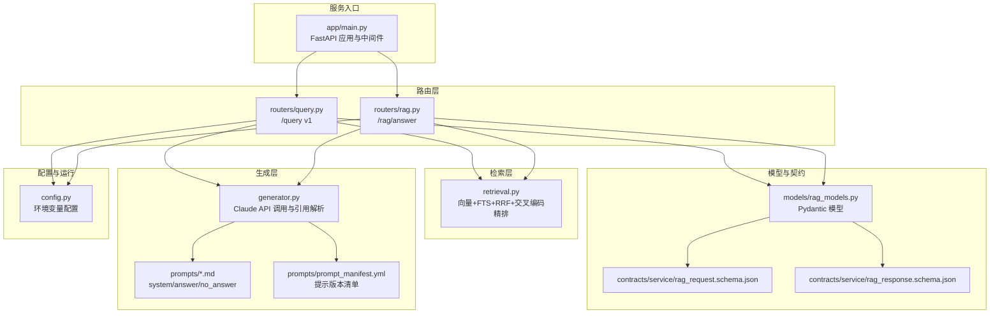
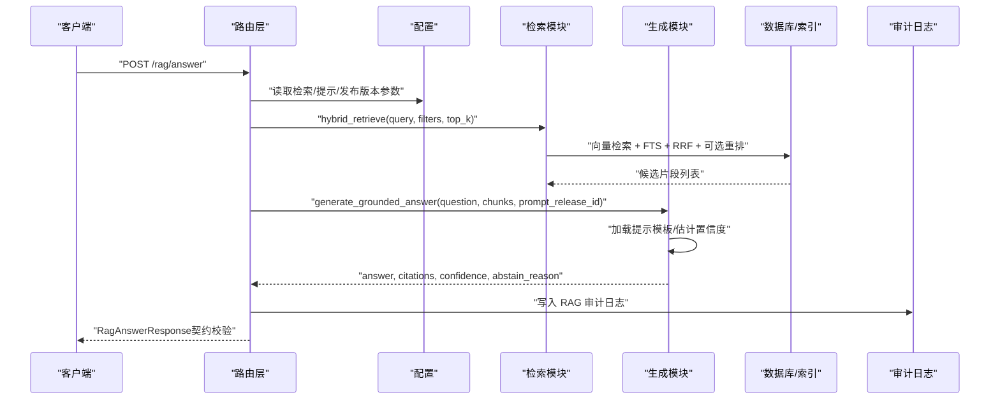
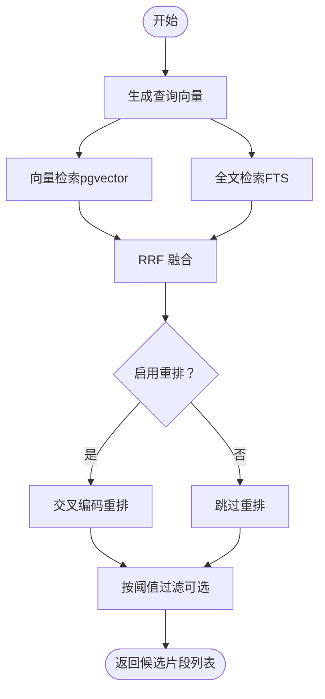
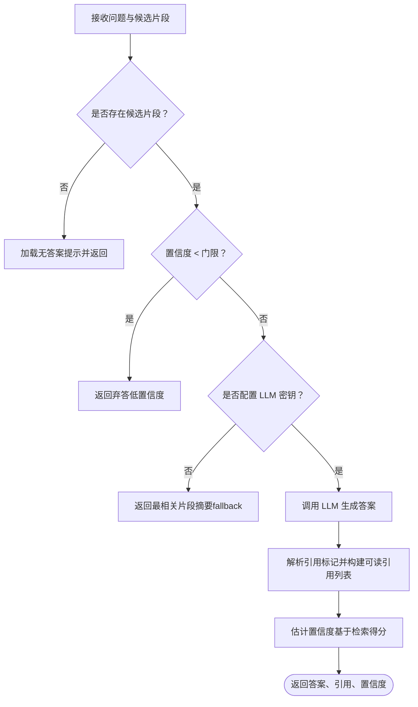
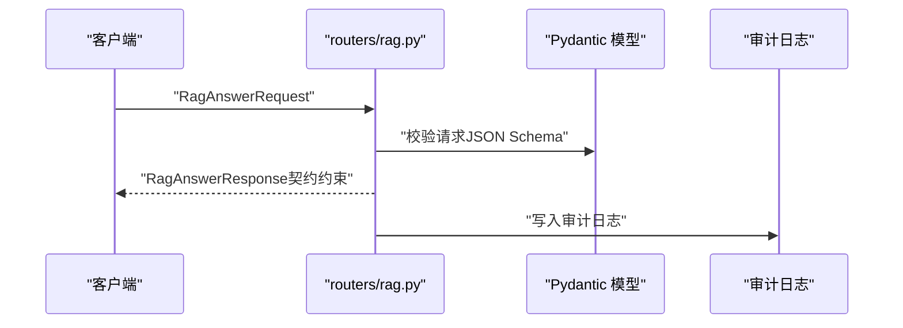
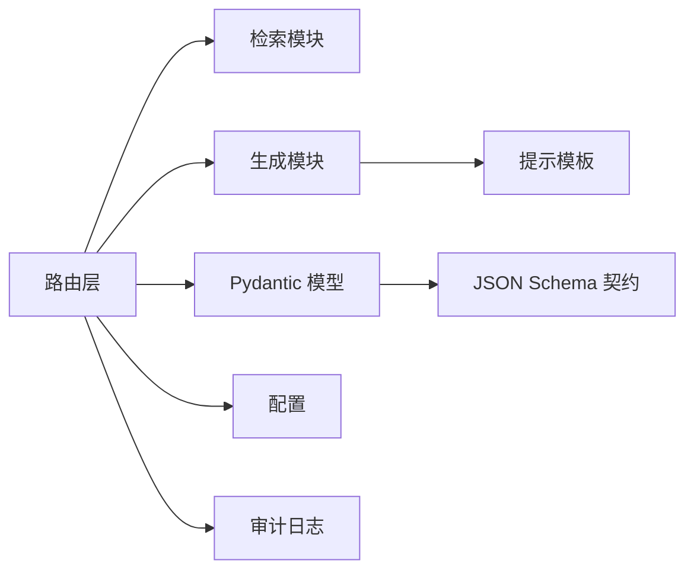

# RAG 生成与提示工程

<cite>
**本文档引用的文件**
- [services/rag_api/app/main.py](file://services/rag_api/app/main.py)
- [services/rag_api/app/config.py](file://services/rag_api/app/config.py)
- [services/rag_api/app/retrieval.py](file://services/rag_api/app/retrieval.py)
- [services/rag_api/app/generator.py](file://services/rag_api/app/generator.py)
- [services/rag_api/app/routers/query.py](file://services/rag_api/app/routers/query.py)
- [services/rag_api/app/routers/rag.py](file://services/rag_api/app/routers/rag.py)
- [services/rag_api/app/models/rag_models.py](file://services/rag_api/app/models/rag_models.py)
- [services/rag_api/app/prompts/system_v1.md](file://services/rag_api/app/prompts/system_v1.md)
- [services/rag_api/app/prompts/answer_v1.md](file://services/rag_api/app/prompts/answer_v1.md)
- [services/rag_api/app/prompts/no_answer_v1.md](file://services/rag_api/app/prompts/no_answer_v1.md)
- [services/rag_api/app/prompts/prompt_manifest.yml](file://services/rag_api/app/prompts/prompt_manifest.yml)
- [contracts/service/rag_request.schema.json](file://contracts/service/rag_request.schema.json)
- [contracts/service/rag_response.schema.json](file://contracts/service/rag_response.schema.json)
- [evals/sets/workspace_qa_v1.jsonl](file://evals/sets/workspace_qa_v1.jsonl)
- [evals/week08/rag_smoke_cases.yml](file://evals/week08/rag_smoke_cases.yml)
</cite>

## 目录
1. [引言](#引言)
2. [项目结构](#项目结构)
3. [核心组件](#核心组件)
4. [架构总览](#架构总览)
5. [详细组件分析](#详细组件分析)
6. [依赖分析](#依赖分析)
7. [性能考虑](#性能考虑)
8. [故障排除指南](#故障排除指南)
9. [结论](#结论)
10. [附录](#附录)

## 引言
本文件面向工程与产品团队，系统性阐述本仓库中 RAG 生成与提示工程的设计与实现，重点包括：
- 检索增强生成的工作原理：上下文提取、提示模板设计、答案生成与引用解析、置信度估计与不确定性处理
- 系统提示、答案提示与“无答案”提示的用途与配置方法
- 提示工程最佳实践：上下文组织、指令清晰度、输出约束与可审计性
- 答案质量评估、置信度计算与不确定性处理策略
- 提示模板的版本管理、A/B 测试与性能调优方法
- 实际生成示例与质量评估标准

## 项目结构
RAG 服务位于服务目录内，采用“路由-模型-检索-生成-提示”分层组织，配合契约与评估集，形成闭环的质量保障体系。

图表来源
- [services/rag_api/app/main.py:1-73](file://services/rag_api/app/main.py#L1-L73)
- [services/rag_api/app/routers/query.py:1-159](file://services/rag_api/app/routers/query.py#L1-L159)
- [services/rag_api/app/routers/rag.py:1-163](file://services/rag_api/app/routers/rag.py#L1-L163)
- [services/rag_api/app/retrieval.py:1-445](file://services/rag_api/app/retrieval.py#L1-L445)
- [services/rag_api/app/generator.py:1-222](file://services/rag_api/app/generator.py#L1-L222)
- [services/rag_api/app/prompts/system_v1.md:1-2](file://services/rag_api/app/prompts/system_v1.md#L1-L2)
- [services/rag_api/app/prompts/answer_v1.md:1-2](file://services/rag_api/app/prompts/answer_v1.md#L1-L2)
- [services/rag_api/app/prompts/no_answer_v1.md:1-2](file://services/rag_api/app/prompts/no_answer_v1.md#L1-L2)
- [services/rag_api/app/prompts/prompt_manifest.yml:1-8](file://services/rag_api/app/prompts/prompt_manifest.yml#L1-L8)
- [services/rag_api/app/config.py:1-53](file://services/rag_api/app/config.py#L1-L53)
- [services/rag_api/app/models/rag_models.py:1-168](file://services/rag_api/app/models/rag_models.py#L1-L168)
- [contracts/service/rag_request.schema.json:1-23](file://contracts/service/rag_request.schema.json#L1-L23)
- [contracts/service/rag_response.schema.json:1-58](file://contracts/service/rag_response.schema.json#L1-L58)

章节来源
- [services/rag_api/app/main.py:1-73](file://services/rag_api/app/main.py#L1-L73)
- [services/rag_api/app/config.py:1-53](file://services/rag_api/app/config.py#L1-L53)

## 核心组件
- 路由与入口
  - 入口应用与中间件：CORS、全局异常处理、请求 ID 注入、OTel 生命周期钩子
  - 路由器：/query v1（旧版）、/rag/answer（Week8 合约优先）
- 检索模块
  - 向量检索（pgvector）、FTS（PostgreSQL 全文）、RRF 融合、可选交叉编码重排、元数据过滤
- 生成模块
  - 系统提示（证据优先）、答案提示、无答案提示；引用解析、置信度估计、降级策略
- 模型与契约
  - Pydantic 模型定义请求/响应字段，JSON Schema 约束输入输出
- 提示与版本管理
  - 提示清单与版本标识，支持按版本加载不同提示模板

章节来源
- [services/rag_api/app/routers/query.py:1-159](file://services/rag_api/app/routers/query.py#L1-L159)
- [services/rag_api/app/routers/rag.py:1-163](file://services/rag_api/app/routers/rag.py#L1-L163)
- [services/rag_api/app/retrieval.py:1-445](file://services/rag_api/app/retrieval.py#L1-L445)
- [services/rag_api/app/generator.py:1-222](file://services/rag_api/app/generator.py#L1-L222)
- [services/rag_api/app/models/rag_models.py:1-168](file://services/rag_api/app/models/rag_models.py#L1-L168)
- [services/rag_api/app/prompts/prompt_manifest.yml:1-8](file://services/rag_api/app/prompts/prompt_manifest.yml#L1-L8)

## 架构总览
下图展示从请求到响应的完整链路，涵盖检索、生成、审计与契约校验。

图表来源
- [services/rag_api/app/routers/rag.py:25-122](file://services/rag_api/app/routers/rag.py#L25-L122)
- [services/rag_api/app/retrieval.py:386-444](file://services/rag_api/app/retrieval.py#L386-L444)
- [services/rag_api/app/generator.py:184-222](file://services/rag_api/app/generator.py#L184-L222)
- [contracts/service/rag_response.schema.json:1-58](file://contracts/service/rag_response.schema.json#L1-L58)

## 详细组件分析

### 检索增强生成链路（向量 + FTS + RRF + 重排）
- 向量检索：使用 pgvector 计算余弦距离，支持产品线/发布版本/可见性等元数据过滤
- FTS 检索：PostgreSQL 全文检索，关键词匹配
- RRF 融合：对两路结果进行 Reciprocal Rank Fusion，合并排序
- 交叉编码重排：可选，使用 cross-encoder 对候选进行细粒度重排
- 结果回填：补全证据锚点信息（evidence_id、source_url、section_path、page_no 等）

图表来源
- [services/rag_api/app/retrieval.py:132-444](file://services/rag_api/app/retrieval.py#L132-L444)

章节来源
- [services/rag_api/app/retrieval.py:1-445](file://services/rag_api/app/retrieval.py#L1-L445)

### 生成与引用解析（证据优先）
- 系统提示：强调仅基于检索证据回答、禁止编造引用、要求引用格式
- 答案提示：基于检索上下文生成简洁答案，并仅引用运行时提供的证据对象
- 无答案提示：当无检索结果或置信度过低时，返回结构化“弃答”
- 引用解析：从答案文本中提取“[来源N]”，映射到检索证据，若未发现引用则列出全部证据
- 置信度估计：基于检索得分（RRF 或重排后的最终得分）归一化到 0~1
- 降级策略：API 不可用时返回最相关片段摘要，标注为 fallback

图表来源
- [services/rag_api/app/generator.py:65-222](file://services/rag_api/app/generator.py#L65-L222)
- [services/rag_api/app/prompts/system_v1.md:1-2](file://services/rag_api/app/prompts/system_v1.md#L1-L2)
- [services/rag_api/app/prompts/answer_v1.md:1-2](file://services/rag_api/app/prompts/answer_v1.md#L1-L2)
- [services/rag_api/app/prompts/no_answer_v1.md:1-2](file://services/rag_api/app/prompts/no_answer_v1.md#L1-L2)

章节来源
- [services/rag_api/app/generator.py:1-222](file://services/rag_api/app/generator.py#L1-L222)

### 路由与契约（Week8 合约优先）
- /rag/answer：接收问题、过滤条件、top_k、提示版本等，返回结构化答案、证据、置信度与弃答原因
- /query：兼容旧版 v1，返回可读引用列表与证据 ID 列表
- 审计日志：记录检索命中、释放版本、延迟等指标，支持回溯与回归分析

图表来源
- [services/rag_api/app/routers/rag.py:25-122](file://services/rag_api/app/routers/rag.py#L25-L122)
- [services/rag_api/app/models/rag_models.py:140-168](file://services/rag_api/app/models/rag_models.py#L140-L168)
- [contracts/service/rag_request.schema.json:1-23](file://contracts/service/rag_request.schema.json#L1-L23)
- [contracts/service/rag_response.schema.json:1-58](file://contracts/service/rag_response.schema.json#L1-L58)

章节来源
- [services/rag_api/app/routers/query.py:1-159](file://services/rag_api/app/routers/query.py#L1-L159)
- [services/rag_api/app/routers/rag.py:1-163](file://services/rag_api/app/routers/rag.py#L1-L163)
- [services/rag_api/app/models/rag_models.py:1-168](file://services/rag_api/app/models/rag_models.py#L1-L168)

### 提示模板与版本管理
- 提示清单：以 YAML 管理提示版本与模板文件映射
- 模板类型：system、answer、no_answer
- 加载机制：按提示版本标识动态加载对应模板内容
- 版本策略：通过 prompt_release_id 控制提示版本，便于 A/B 测试与灰度发布

章节来源
- [services/rag_api/app/prompts/prompt_manifest.yml:1-8](file://services/rag_api/app/prompts/prompt_manifest.yml#L1-L8)
- [services/rag_api/app/generator.py:173-182](file://services/rag_api/app/generator.py#L173-L182)

### 置信度计算与不确定性处理
- 置信度来源：检索最终得分（RRF 或重排后）归一化到 0~1
- 门限控制：通过配置项设置最低可接受置信度
- 弃答策略：无候选或低于门限时返回结构化弃答，避免错误引用
- 降级策略：LLM 不可用时返回最相关片段摘要，标注 fallback

章节来源
- [services/rag_api/app/generator.py:149-169](file://services/rag_api/app/generator.py#L149-L169)
- [services/rag_api/app/config.py:29-32](file://services/rag_api/app/config.py#L29-L32)

### 质量评估与回归验证
- 评估集：包含多产品线与标签的问答样例，设定最小期望分数
- 烟雾测试：覆盖“已知命中”“关键词命中”“语义近似”“产品线过滤”“无答案”“权限过滤”等场景
- 指标建议：准确率（答案正确）、召回（覆盖问题）、一致性（引用可溯源）、稳定性（置信度分布）

章节来源
- [evals/sets/workspace_qa_v1.jsonl:1-13](file://evals/sets/workspace_qa_v1.jsonl#L1-L13)
- [evals/week08/rag_smoke_cases.yml:1-36](file://evals/week08/rag_smoke_cases.yml#L1-L36)

## 依赖分析
- 组件耦合
  - 路由器依赖检索模块与生成模块，二者相对独立，便于替换与扩展
  - 生成模块依赖提示清单与配置，提示版本通过参数注入
  - 审计日志与数据库连接池解耦于主链路，失败不影响主流程
- 外部依赖
  - 数据库：PostgreSQL（asyncpg）、pgvector
  - LLM：Anthropic Claude（可配置密钥与模型）
  - 提示模板：本地文件系统加载
- 循环依赖
  - 未发现直接循环依赖；检索与生成模块通过路由器间接交互

图表来源
- [services/rag_api/app/routers/rag.py:1-163](file://services/rag_api/app/routers/rag.py#L1-L163)
- [services/rag_api/app/retrieval.py:1-445](file://services/rag_api/app/retrieval.py#L1-L445)
- [services/rag_api/app/generator.py:1-222](file://services/rag_api/app/generator.py#L1-L222)
- [services/rag_api/app/models/rag_models.py:1-168](file://services/rag_api/app/models/rag_models.py#L1-L168)
- [contracts/service/rag_request.schema.json:1-23](file://contracts/service/rag_request.schema.json#L1-L23)
- [contracts/service/rag_response.schema.json:1-58](file://contracts/service/rag_response.schema.json#L1-L58)

章节来源
- [services/rag_api/app/routers/rag.py:1-163](file://services/rag_api/app/routers/rag.py#L1-L163)
- [services/rag_api/app/routers/query.py:1-159](file://services/rag_api/app/routers/query.py#L1-L159)
- [services/rag_api/app/retrieval.py:1-445](file://services/rag_api/app/retrieval.py#L1-L445)
- [services/rag_api/app/generator.py:1-222](file://services/rag_api/app/generator.py#L1-L222)

## 性能考虑
- 并行检索：向量检索与 FTS 检索并行执行，缩短端到端延迟
- 结果裁剪：先取 top_k*2，再重排与过滤，平衡召回与效率
- 重排可选：在资源紧张时可关闭交叉编码重排
- 缓存与连接池：数据库连接池与提示模板缓存（按需）
- 温度与令牌：合理设置温度与最大输出令牌，兼顾确定性与长度

## 故障排除指南
- LLM API 异常
  - 现象：认证失败或调用异常
  - 处理：记录错误并返回降级答案（最相关片段摘要）
- 数据库异常
  - 现象：检索失败
  - 处理：返回空候选，触发弃答路径
- 审计日志失败
  - 现象：非致命错误
  - 处理：捕获异常并记录告警，不影响主链路
- 引用缺失
  - 现象：答案未包含引用标记
  - 处理：自动列出全部证据，保证可追溯性

章节来源
- [services/rag_api/app/generator.py:112-118](file://services/rag_api/app/generator.py#L112-L118)
- [services/rag_api/app/routers/query.py:111-113](file://services/rag_api/app/routers/query.py#L111-L113)
- [services/rag_api/app/routers/rag.py:62-64](file://services/rag_api/app/routers/rag.py#L62-L64)
- [services/rag_api/app/routers/query.py:157-159](file://services/rag_api/app/routers/query.py#L157-L159)

## 结论
本系统以“证据优先”的提示工程为核心，结合混合检索与结构化响应契约，实现了可审计、可评估、可演进的 RAG 生成链路。通过提示版本管理与门限控制，既能保证答案质量，又能灵活应对不确定性。建议持续完善评估集与回归测试，推进提示模板的 A/B 测试与性能优化。

## 附录

### 提示工程最佳实践
- 上下文组织
  - 将证据按来源与页码组织，确保引用可定位
  - 在提示中明确“仅基于检索证据回答”的约束
- 指令清晰度
  - 明确回答格式（中文、编号列表、引用格式）
  - 对敏感话题给出“联系支持团队”的指引
- 输出约束
  - 금지编造引用、URL、页码与版本号
  - 无证据或低置信度时返回弃答，避免误导

章节来源
- [services/rag_api/app/generator.py:26-48](file://services/rag_api/app/generator.py#L26-L48)
- [services/rag_api/app/prompts/system_v1.md:1-2](file://services/rag_api/app/prompts/system_v1.md#L1-L2)
- [services/rag_api/app/prompts/answer_v1.md:1-2](file://services/rag_api/app/prompts/answer_v1.md#L1-L2)

### 置信度与弃答策略
- 置信度来源：检索最终得分归一化
- 门限：通过配置项控制最低可接受置信度
- 弃答：无候选或低于门限时返回结构化弃答

章节来源
- [services/rag_api/app/generator.py:149-169](file://services/rag_api/app/generator.py#L149-L169)
- [services/rag_api/app/config.py:29-32](file://services/rag_api/app/config.py#L29-L32)

### 提示模板版本管理与 A/B 测试
- 版本管理：通过提示清单与 prompt_release_id 管理模板版本
- A/B 测试：按版本分流流量，对比准确率、引用覆盖率与用户反馈
- 性能调优：结合检索与生成延迟、吞吐与成本进行综合评估

章节来源
- [services/rag_api/app/prompts/prompt_manifest.yml:1-8](file://services/rag_api/app/prompts/prompt_manifest.yml#L1-L8)
- [services/rag_api/app/routers/rag.py:29-31](file://services/rag_api/app/routers/rag.py#L29-L31)

### 生成示例与质量评估标准
- 示例场景
  - 已知命中：Edge Gateway 固件升级失败恢复
  - 关键词命中：firmware rollback gateway recovery
  - 语义近似：设备升级导致连接中断应如何处理
  - 产品线过滤：Billing 线程下不返回 Edge Gateway 内容
  - 无答案：未公开卫星产品的路线图
  - 权限过滤：public 视角下不返回内部恢复手册
- 评估标准
  - 准确性：答案与事实一致，引用可溯源
  - 召回：覆盖典型问题类型
  - 一致性：引用格式统一，来源可定位
  - 稳定性：置信度分布合理，弃答比例可控

章节来源
- [evals/week08/rag_smoke_cases.yml:5-36](file://evals/week08/rag_smoke_cases.yml#L5-L36)
- [evals/sets/workspace_qa_v1.jsonl:1-13](file://evals/sets/workspace_qa_v1.jsonl#L1-L13)