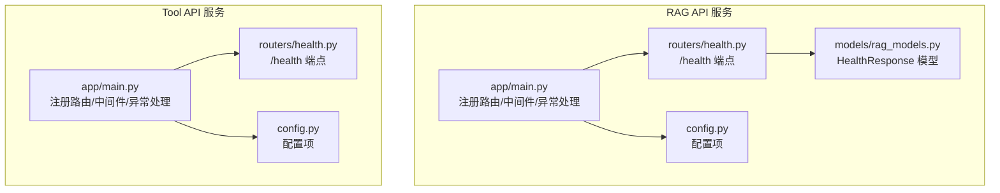
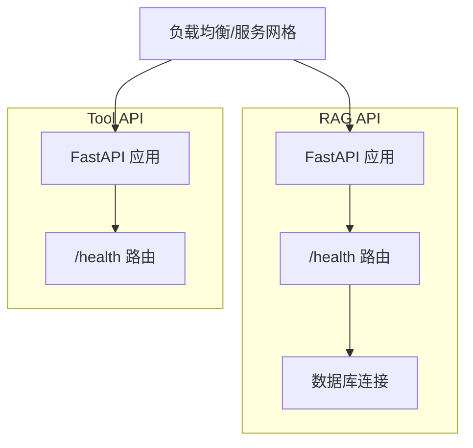
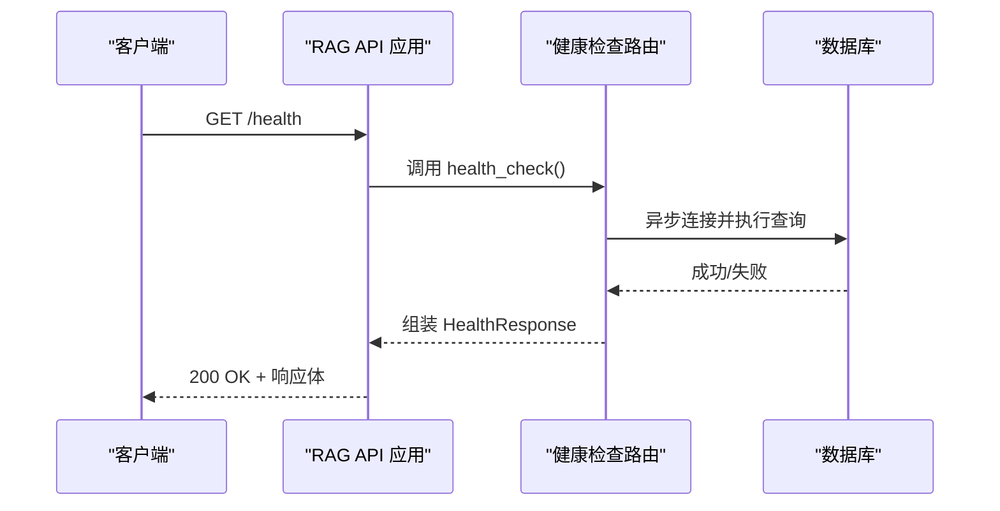
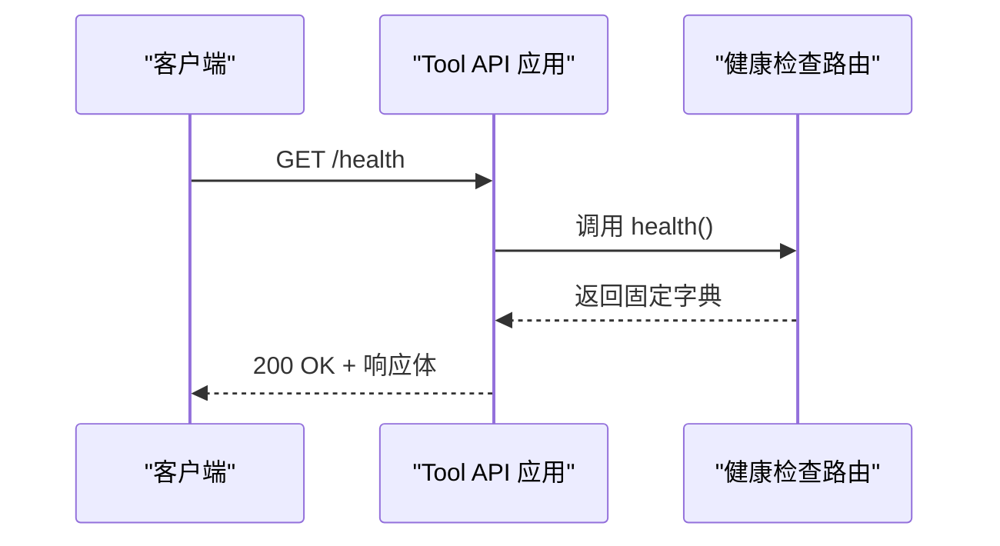
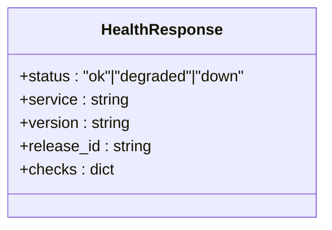
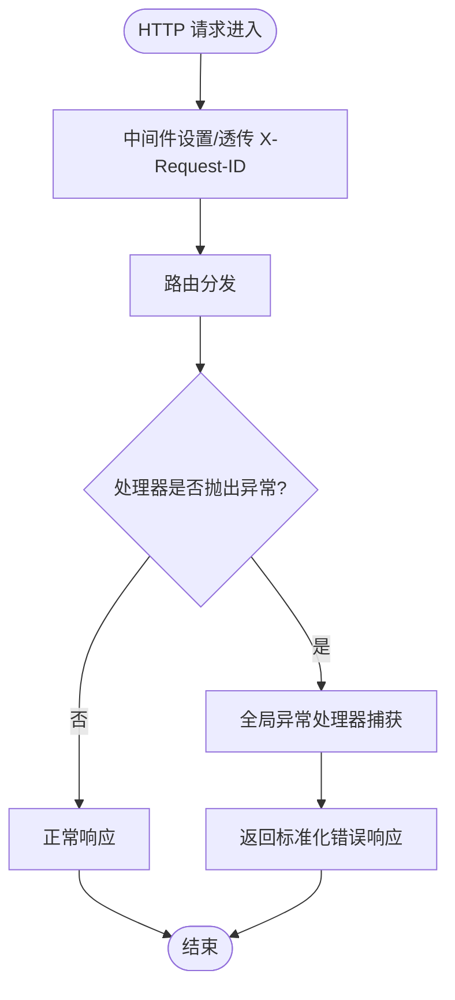
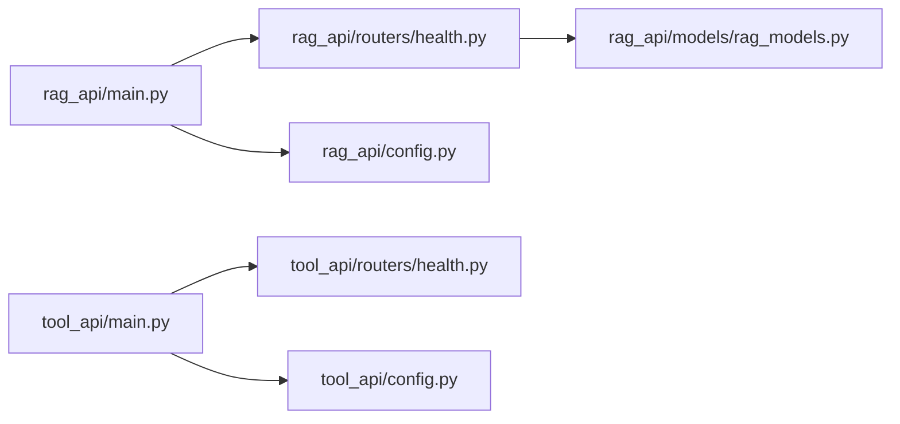

# 健康检查端点

<cite>
**本文引用的文件**
- [services/rag_api/app/routers/health.py](file://services/rag_api/app/routers/health.py)
- [services/rag_api/app/models/rag_models.py](file://services/rag_api/app/models/rag_models.py)
- [services/rag_api/app/main.py](file://services/rag_api/app/main.py)
- [services/rag_api/app/config.py](file://services/rag_api/app/config.py)
- [services/tool_api/app/routers/health.py](file://services/tool_api/app/routers/health.py)
- [services/tool_api/app/main.py](file://services/tool_api/app/main.py)
- [services/tool_api/app/config.py](file://services/tool_api/app/config.py)
- [tests/integration/test_rag_api_smoke.py](file://tests/integration/test_rag_api_smoke.py)
- [README.md](file://README.md)
</cite>

## 目录
1. [简介](#简介)
2. [项目结构](#项目结构)
3. [核心组件](#核心组件)
4. [架构总览](#架构总览)
5. [详细组件分析](#详细组件分析)
6. [依赖分析](#依赖分析)
7. [性能考虑](#性能考虑)
8. [故障排查指南](#故障排查指南)
9. [结论](#结论)
10. [附录](#附录)

## 简介
本文件聚焦于系统中的健康检查端点，系统包含两条微服务：RAG API 与 Tool API，二者均提供 /health 健康检查端点，用于服务可用性监控、负载均衡决策与自动故障转移。RAG API 的健康检查包含组件级检查与总体状态聚合；Tool API 的健康检查则返回简化的固定结构。本文将从端点设计、响应格式、状态判断逻辑入手，结合微服务架构实践，给出最佳实践、常见问题排查与性能优化建议，并提供 API 调用示例与响应分析。

## 项目结构
- RAG API 服务位于 services/rag_api，包含健康检查路由、模型定义、主应用入口与配置。
- Tool API 服务位于 services/tool_api，包含健康检查路由、主应用入口与配置。
- 两处健康检查端点分别在各自服务的 routers/health.py 中实现，并在 main.py 中注册路由。
- 测试文件 tests/integration/test_rag_api_smoke.py 包含对 /health 的基础断言，验证状态码与字段存在性。

图表来源
- [services/rag_api/app/main.py:68-73](file://services/rag_api/app/main.py#L68-L73)
- [services/rag_api/app/routers/health.py:1-48](file://services/rag_api/app/routers/health.py#L1-L48)
- [services/rag_api/app/models/rag_models.py:79-86](file://services/rag_api/app/models/rag_models.py#L79-L86)
- [services/rag_api/app/config.py:1-53](file://services/rag_api/app/config.py#L1-L53)
- [services/tool_api/app/main.py:55-64](file://services/tool_api/app/main.py#L55-L64)
- [services/tool_api/app/routers/health.py:1-15](file://services/tool_api/app/routers/health.py#L1-L15)
- [services/tool_api/app/config.py:1-19](file://services/tool_api/app/config.py#L1-L19)

章节来源
- [services/rag_api/app/main.py:68-73](file://services/rag_api/app/main.py#L68-L73)
- [services/tool_api/app/main.py:55-64](file://services/tool_api/app/main.py#L55-L64)
- [README.md:67-74](file://README.md#L67-L74)

## 核心组件
- RAG API 健康检查端点
  - 路由：GET /health
  - 响应模型：HealthResponse，包含 status、service、version、release_id、checks 字段
  - 状态聚合：基于组件检查结果（如 database、vector_index、llm 等），当前仅数据库检查实际执行，其余为占位
  - 数据库检查：通过异步连接数据库并执行简单查询进行连通性验证
- Tool API 健康检查端点
  - 路由：GET /health
  - 响应：固定字典结构，包含 status、service、version、release_id
- 请求 ID 中间件：为每个请求生成或透传 X-Request-ID，便于跨服务追踪
- 全局异常处理：捕获未处理异常并返回标准化错误结构

章节来源
- [services/rag_api/app/routers/health.py:10-33](file://services/rag_api/app/routers/health.py#L10-L33)
- [services/rag_api/app/routers/health.py:36-47](file://services/rag_api/app/routers/health.py#L36-L47)
- [services/rag_api/app/models/rag_models.py:80-85](file://services/rag_api/app/models/rag_models.py#L80-L85)
- [services/tool_api/app/routers/health.py:7-14](file://services/tool_api/app/routers/health.py#L7-L14)
- [services/rag_api/app/main.py:44-51](file://services/rag_api/app/main.py#L44-L51)
- [services/tool_api/app/main.py:40-45](file://services/tool_api/app/main.py#L40-L45)
- [services/rag_api/app/main.py:54-65](file://services/rag_api/app/main.py#L54-L65)
- [services/tool_api/app/main.py:48-58](file://services/tool_api/app/main.py#L48-L58)

## 架构总览
下图展示健康检查在微服务架构中的位置与交互：

图表来源
- [services/rag_api/app/main.py:68-73](file://services/rag_api/app/main.py#L68-L73)
- [services/rag_api/app/routers/health.py:10-33](file://services/rag_api/app/routers/health.py#L10-L33)
- [services/tool_api/app/main.py:55-64](file://services/tool_api/app/main.py#L55-L64)
- [services/tool_api/app/routers/health.py:7-14](file://services/tool_api/app/routers/health.py#L7-L14)

## 详细组件分析

### RAG API 健康检查端点
- 端点设计
  - 路由：GET /health
  - 标签：system，便于在文档中分类
  - 响应模型：HealthResponse，约束状态枚举与字段集合
- 响应格式
  - 字段：status（ok/degraded/down）、service、version、release_id、checks（组件级状态字典）
- 状态判断逻辑
  - 组件检查字典：包含 api、database、vector_index（占位）、llm（占位）
  - 数据库检查：异步连接数据库并执行简单查询，成功返回 ok，异常返回 down
  - 总体状态：若所有非占位组件均为 ok，则整体 ok；否则 degraded
- 依赖关系
  - 依赖配置模块获取 release_id
  - 依赖异步数据库驱动进行连接检查

图表来源
- [services/rag_api/app/routers/health.py:10-33](file://services/rag_api/app/routers/health.py#L10-L33)
- [services/rag_api/app/routers/health.py:36-47](file://services/rag_api/app/routers/health.py#L36-L47)
- [services/rag_api/app/models/rag_models.py:80-85](file://services/rag_api/app/models/rag_models.py#L80-L85)

章节来源
- [services/rag_api/app/routers/health.py:10-33](file://services/rag_api/app/routers/health.py#L10-L33)
- [services/rag_api/app/routers/health.py:36-47](file://services/rag_api/app/routers/health.py#L36-L47)
- [services/rag_api/app/models/rag_models.py:80-85](file://services/rag_api/app/models/rag_models.py#L80-L85)
- [services/rag_api/app/config.py:34-38](file://services/rag_api/app/config.py#L34-L38)

### Tool API 健康检查端点
- 端点设计
  - 路由：GET /health
  - 标签：system
- 响应格式
  - 字段：status（ok）、service、version、release_id
- 状态判断逻辑
  - 固定返回 status: ok，service: tool_api，version: 0.1.0，release_id 来自配置
- 依赖关系
  - 依赖配置模块获取 release_id

图表来源
- [services/tool_api/app/routers/health.py:7-14](file://services/tool_api/app/routers/health.py#L7-L14)
- [services/tool_api/app/config.py:10](file://services/tool_api/app/config.py#L10)

章节来源
- [services/tool_api/app/routers/health.py:7-14](file://services/tool_api/app/routers/health.py#L7-L14)
- [services/tool_api/app/config.py:10](file://services/tool_api/app/config.py#L10)

### 健康检查模型与类型约束
- HealthResponse 模型
  - 状态枚举：ok、degraded、down
  - 字段：service、version、release_id、checks（任意字典）
- 用途
  - 为 RAG API 的健康检查提供 Pydantic 验证与文档生成

图表来源
- [services/rag_api/app/models/rag_models.py:80-85](file://services/rag_api/app/models/rag_models.py#L80-L85)

章节来源
- [services/rag_api/app/models/rag_models.py:80-85](file://services/rag_api/app/models/rag_models.py#L80-L85)

### 请求 ID 中间件与全局异常处理
- 请求 ID 中间件
  - 从请求头提取或生成 X-Request-ID，注入 request.state，并在响应头中返回
  - 用于跨服务追踪与日志关联
- 全局异常处理
  - 捕获未处理异常，返回标准化错误结构，包含错误码、消息、请求 ID 与 release_id

图表来源
- [services/rag_api/app/main.py:44-51](file://services/rag_api/app/main.py#L44-L51)
- [services/rag_api/app/main.py:54-65](file://services/rag_api/app/main.py#L54-L65)
- [services/tool_api/app/main.py:40-45](file://services/tool_api/app/main.py#L40-L45)
- [services/tool_api/app/main.py:48-58](file://services/tool_api/app/main.py#L48-L58)

章节来源
- [services/rag_api/app/main.py:44-51](file://services/rag_api/app/main.py#L44-L51)
- [services/rag_api/app/main.py:54-65](file://services/rag_api/app/main.py#L54-L65)
- [services/tool_api/app/main.py:40-45](file://services/tool_api/app/main.py#L40-L45)
- [services/tool_api/app/main.py:48-58](file://services/tool_api/app/main.py#L48-L58)

## 依赖分析
- 路由注册
  - RAG API：在 main.py 中 include_router(health.router)，并注册其他路由
  - Tool API：在 main.py 中 include_router(health.router)
- 配置依赖
  - 两服务均从各自 config.py 读取 release_id，用于健康检查响应
- 数据库依赖（RAG API）
  - 健康检查中通过异步驱动连接数据库并执行查询，验证数据库可达性

图表来源
- [services/rag_api/app/main.py:68-73](file://services/rag_api/app/main.py#L68-L73)
- [services/rag_api/app/routers/health.py:1-48](file://services/rag_api/app/routers/health.py#L1-L48)
- [services/rag_api/app/models/rag_models.py:79-86](file://services/rag_api/app/models/rag_models.py#L79-L86)
- [services/rag_api/app/config.py:1-53](file://services/rag_api/app/config.py#L1-L53)
- [services/tool_api/app/main.py:55-64](file://services/tool_api/app/main.py#L55-L64)
- [services/tool_api/app/routers/health.py:1-15](file://services/tool_api/app/routers/health.py#L1-L15)
- [services/tool_api/app/config.py:1-19](file://services/tool_api/app/config.py#L1-L19)

章节来源
- [services/rag_api/app/main.py:68-73](file://services/rag_api/app/main.py#L68-L73)
- [services/tool_api/app/main.py:55-64](file://services/tool_api/app/main.py#L55-L64)

## 性能考虑
- 健康检查应保持轻量
  - RAG API 的数据库检查为最小可行验证，避免长事务或复杂查询
  - Tool API 的健康检查为常量返回，开销极低
- 连接池与超时
  - 若未来扩展数据库检查，建议使用连接池与合理超时，避免阻塞健康检查线程
- 响应缓存
  - 健康检查通常无需缓存，因为其主要用途是探测瞬时状态
- 并发与资源
  - 健康检查不应占用大量 CPU 或内存，以免影响真实业务流量

## 故障排查指南
- 常见问题
  - /health 返回非 200：检查全局异常处理是否捕获了未处理异常
  - RAG API 健康状态为 degraded：检查数据库连接是否正常
  - 请求缺少 X-Request-ID：确认中间件是否正确设置与透传
- 排查步骤
  - 使用 curl 直接访问 /health，观察状态码与响应体字段
  - 查看服务日志，定位异常堆栈
  - 验证数据库连接字符串与网络连通性
- 测试参考
  - 集成测试断言 /health 返回 200，并包含必要字段

章节来源
- [tests/integration/test_rag_api_smoke.py:29-43](file://tests/integration/test_rag_api_smoke.py#L29-L43)
- [tests/integration/test_rag_api_smoke.py:82-91](file://tests/integration/test_rag_api_smoke.py#L82-L91)
- [services/rag_api/app/main.py:54-65](file://services/rag_api/app/main.py#L54-L65)
- [services/tool_api/app/main.py:48-58](file://services/tool_api/app/main.py#L48-L58)

## 结论
本项目的健康检查端点在微服务架构中承担了服务可用性监控的关键角色。RAG API 提供了可扩展的组件级检查与总体状态聚合，而 Tool API 则提供了简洁稳定的健康检查。通过统一的请求 ID 中间件与全局异常处理，健康检查与日常请求在可观测性与一致性方面保持一致。建议在生产环境中为健康检查设定合理的超时与重试策略，并持续完善组件级检查以提升故障定位效率。

## 附录

### 健康检查端点与响应规范
- RAG API
  - 路由：GET /health
  - 响应模型：HealthResponse
  - 字段：status、service、version、release_id、checks
  - 示例响应字段（不展示具体内容）：包含 status、service、version、release_id、checks
- Tool API
  - 路由：GET /health
  - 响应：包含 status、service、version、release_id

章节来源
- [services/rag_api/app/routers/health.py:10-33](file://services/rag_api/app/routers/health.py#L10-L33)
- [services/rag_api/app/models/rag_models.py:80-85](file://services/rag_api/app/models/rag_models.py#L80-L85)
- [services/tool_api/app/routers/health.py:7-14](file://services/tool_api/app/routers/health.py#L7-L14)

### 微服务架构中的健康检查作用
- 服务可用性监控
  - 通过定期探测 /health，发现服务不可用或部分功能异常
- 负载均衡决策
  - 负载均衡器根据健康状态将流量导向健康的实例
- 自动故障转移
  - 编排系统依据健康检查结果触发重启、替换实例或隔离故障节点

### 健康检查级别与场景
- 存活检查（Liveness）
  - 目标：判断进程是否仍在运行
  - 场景：容器编排中用于重启崩溃实例
- 就绪检查（Readiness）
  - 目标：判断服务是否已准备好接收流量
  - 场景：启动阶段、依赖未就绪时暂时标记未就绪
- 启动检查（Startup）
  - 目标：验证服务初始化流程是否成功
  - 场景：冷启动、热身、依赖加载完成后进行最终验证

### API 调用示例与响应分析
- 调用示例
  - RAG API：curl http://localhost:8000/health
  - Tool API：curl http://localhost:8001/health
- 响应分析
  - 状态码：200 表示服务健康
  - 字段存在性：status、service、release_id 等字段应存在
  - RAG API：checks 中包含各组件状态，总体状态由组件状态决定

章节来源
- [README.md:67-74](file://README.md#L67-L74)
- [tests/integration/test_rag_api_smoke.py:29-43](file://tests/integration/test_rag_api_smoke.py#L29-L43)