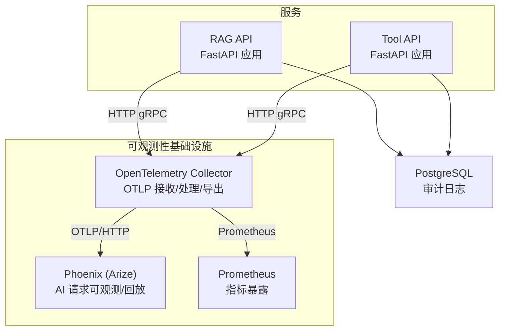
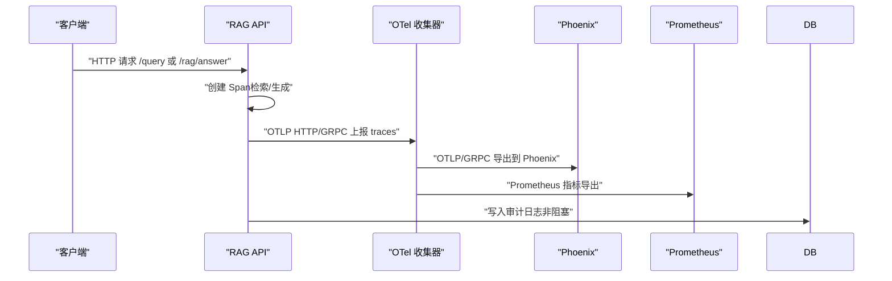
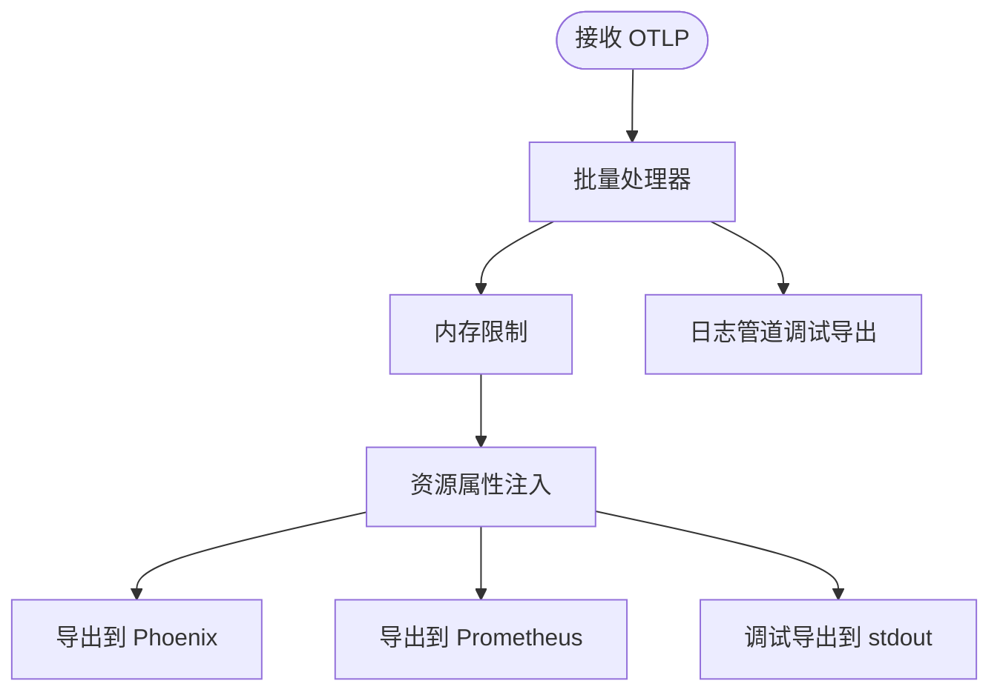
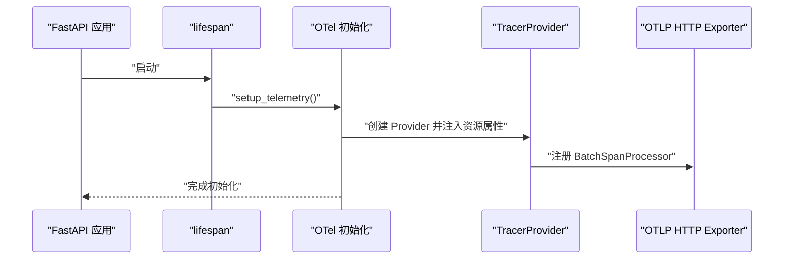
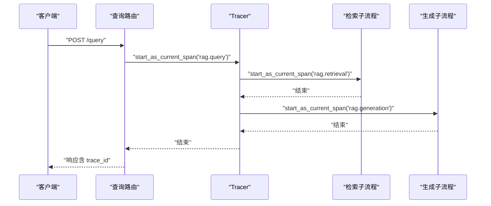
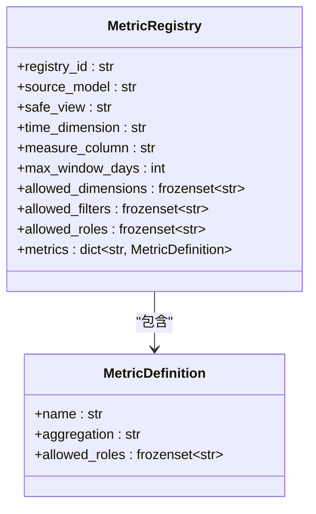
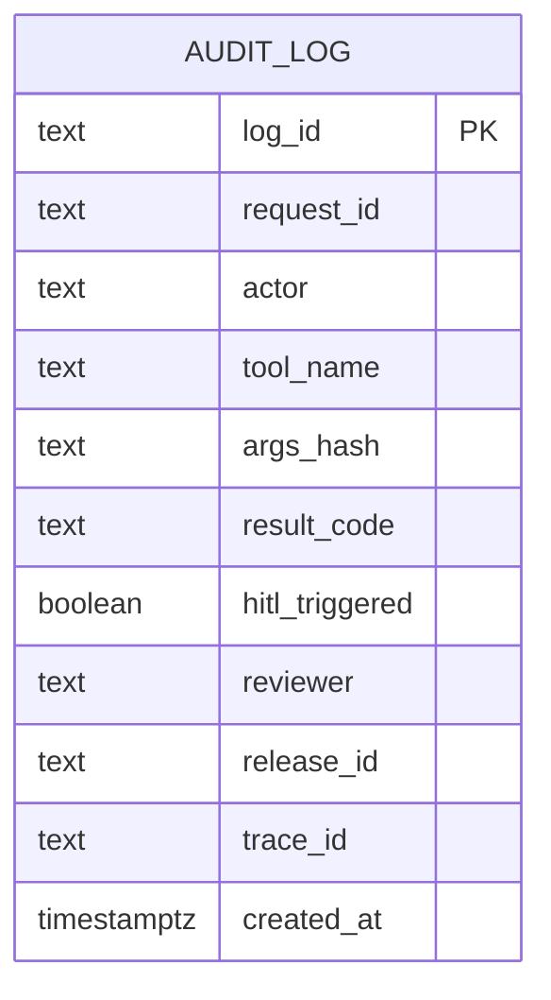
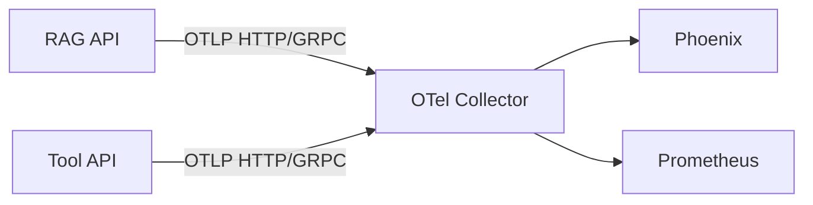

# 可观测性集成

<cite>
**本文档引用的文件**
- [observability/otel/config.yaml](file://observability/otel/config.yaml)
- [infra/docker-compose.yml](file://infra/docker-compose.yml)
- [services/rag_api/app/observability.py](file://services/rag_api/app/observability.py)
- [services/rag_api/app/main.py](file://services/rag_api/app/main.py)
- [services/rag_api/app/config.py](file://services/rag_api/app/config.py)
- [services/rag_api/app/routers/query.py](file://services/rag_api/app/routers/query.py)
- [services/rag_api/app/routers/rag.py](file://services/rag_api/app/routers/rag.py)
- [services/rag_api/app/audit.py](file://services/rag_api/app/audit.py)
- [services/tool_api/app/config.py](file://services/tool_api/app/config.py)
- [services/tool_api/app/metric_registry.py](file://services/tool_api/app/metric_registry.py)
- [analytics/metric_registry_v1.yml](file://analytics/metric_registry_v1.yml)
- [services/tool_api/app/routers/kpis.py](file://services/tool_api/app/routers/kpis.py)
- [infra/migrations/001_init.sql](file://infra/migrations/001_init.sql)
</cite>

## 目录
1. [简介](#简介)
2. [项目结构](#项目结构)
3. [核心组件](#核心组件)
4. [架构总览](#架构总览)
5. [详细组件分析](#详细组件分析)
6. [依赖关系分析](#依赖关系分析)
7. [性能考量](#性能考量)
8. [故障排查指南](#故障排查指南)
9. [结论](#结论)
10. [附录](#附录)

## 简介
本文件系统性梳理 OmniSupport Copilot 的可观测性集成方案，覆盖 OpenTelemetry 追踪、指标与日志的采集与导出，Phoenix 可视化与回放能力，以及基于 Prometheus 的指标暴露与告警准备。文档同时解释分布式追踪的 Span 创建与上下文传播、指标注册表的加载与权限控制、日志审计与检索、Phoenix 集成的配置与使用，并给出最佳实践、故障排查与性能优化建议。

## 项目结构
可观测性相关模块分布于以下位置：
- OpenTelemetry 收集器配置：observability/otel/config.yaml
- 服务侧 OTel 初始化与注入：services/rag_api/app/observability.py
- 服务生命周期与中间件：services/rag_api/app/main.py
- 配置项（OTel 端点、服务名等）：services/rag_api/app/config.py、services/tool_api/app/config.py
- RAG 查询与审计日志：services/rag_api/app/routers/query.py、services/rag_api/app/routers/rag.py、services/rag_api/app/audit.py
- 指标注册表与查询：services/tool_api/app/metric_registry.py、analytics/metric_registry_v1.yml、services/tool_api/app/routers/kpis.py
- 日志与审计表结构：infra/migrations/001_init.sql
- 编排与服务依赖：infra/docker-compose.yml

图表来源
- [observability/otel/config.yaml:4-65](file://observability/otel/config.yaml#L4-L65)
- [infra/docker-compose.yml:228-262](file://infra/docker-compose.yml#L228-L262)

章节来源
- [observability/otel/config.yaml:1-66](file://observability/otel/config.yaml#L1-L66)
- [infra/docker-compose.yml:1-340](file://infra/docker-compose.yml#L1-L340)

## 核心组件
- OpenTelemetry 收集器：统一接收 OTLP traces/metrics/logs，进行批处理、内存限制、资源属性注入，并导出到 Phoenix 与 Prometheus。
- RAG API 可观测性初始化：在应用生命周期中按配置启用 OTel tracing，注入服务元信息与 release_id，自动 Instrument FastAPI。
- 分布式追踪：在关键业务路径（检索、生成）创建子 Span，记录查询长度、产品线、trace_id、release_id 等属性。
- 指标注册表：从 YAML 加载受治理的指标清单，定义允许的角色、维度、过滤条件与聚合方式。
- 日志与审计：将请求与检索结果写入数据库审计表，支持后续查询与分析；Phoenix 可视化展示 AI 请求链路。

章节来源
- [services/rag_api/app/observability.py:11-55](file://services/rag_api/app/observability.py#L11-L55)
- [services/rag_api/app/routers/query.py:52-93](file://services/rag_api/app/routers/query.py#L52-L93)
- [services/tool_api/app/metric_registry.py:35-66](file://services/tool_api/app/metric_registry.py#L35-L66)
- [analytics/metric_registry_v1.yml:1-56](file://analytics/metric_registry_v1.yml#L1-L56)
- [infra/migrations/001_init.sql:217-237](file://infra/migrations/001_init.sql#L217-L237)

## 架构总览
下图展示了从服务到收集器再到可视化平台的整体链路，以及指标与日志的处理路径。

图表来源
- [services/rag_api/app/routers/query.py:52-93](file://services/rag_api/app/routers/query.py#L52-L93)
- [services/rag_api/app/routers/rag.py:26-122](file://services/rag_api/app/routers/rag.py#L26-L122)
- [observability/otel/config.yaml:54-65](file://observability/otel/config.yaml#L54-L65)
- [infra/docker-compose.yml:228-262](file://infra/docker-compose.yml#L228-L262)

## 详细组件分析

### OpenTelemetry 收集器配置
- 接收器：支持 gRPC/HTTP 的 OTLP 协议，端口映射在编排文件中暴露。
- 处理器：批量发送、资源属性注入（环境、服务名）、内存限制。
- 导出器：Phoenix（OTLP/GRPC）、Prometheus（指标暴露）、调试导出器（stdout）。
- 扩展：健康检查与 pprof 性能分析端点。

图表来源
- [observability/otel/config.yaml:4-65](file://observability/otel/config.yaml#L4-L65)

章节来源
- [observability/otel/config.yaml:1-66](file://observability/otel/config.yaml#L1-L66)
- [infra/docker-compose.yml:228-262](file://infra/docker-compose.yml#L228-L262)

### RAG API 可观测性初始化与生命周期
- 在应用 lifespan 中调用初始化函数，按配置决定是否启用 OTel。
- 设置 TracerProvider，注入服务名、版本、环境、release_id 等资源属性。
- 使用 OTLP HTTP exporter 将 spans 发送到收集器。
- 自动 Instrument FastAPI，确保请求级 Span 被创建。

图表来源
- [services/rag_api/app/main.py:19-33](file://services/rag_api/app/main.py#L19-L33)
- [services/rag_api/app/observability.py:11-55](file://services/rag_api/app/observability.py#L11-L55)

章节来源
- [services/rag_api/app/main.py:1-73](file://services/rag_api/app/main.py#L1-L73)
- [services/rag_api/app/observability.py:1-55](file://services/rag_api/app/observability.py#L1-L55)
- [services/rag_api/app/config.py:40-44](file://services/rag_api/app/config.py#L40-L44)

### 分布式追踪：Span 创建与上下文传播
- 在查询端点内显式创建根 Span，并在检索与生成阶段创建子 Span。
- 记录查询长度、产品线、trace_id、release_id 等关键属性，便于 Phoenix 可视化与回溯。
- 请求 ID 中间件为每个请求生成唯一标识，贯穿日志与审计。

图表来源
- [services/rag_api/app/routers/query.py:52-93](file://services/rag_api/app/routers/query.py#L52-L93)

章节来源
- [services/rag_api/app/routers/query.py:52-93](file://services/rag_api/app/routers/query.py#L52-L93)
- [services/rag_api/app/routers/rag.py:26-122](file://services/rag_api/app/routers/rag.py#L26-L122)

### 指标注册与查询（KPI）
- 指标注册表定义了受治理的指标清单，包括允许的角色、维度、过滤条件与聚合方式。
- 注册表从服务配置指定的路径加载，若本地不存在则回退到 analytics 目录下的默认文件。
- Tool API 提供 KPI 查询端点，读取注册表并执行安全查询。

图表来源
- [services/tool_api/app/metric_registry.py:14-66](file://services/tool_api/app/metric_registry.py#L14-L66)
- [analytics/metric_registry_v1.yml:1-56](file://analytics/metric_registry_v1.yml#L1-L56)

章节来源
- [services/tool_api/app/metric_registry.py:35-66](file://services/tool_api/app/metric_registry.py#L35-L66)
- [analytics/metric_registry_v1.yml:1-56](file://analytics/metric_registry_v1.yml#L1-L56)
- [services/tool_api/app/config.py:10-11](file://services/tool_api/app/config.py#L10-L11)
- [services/tool_api/app/routers/kpis.py:14-17](file://services/tool_api/app/routers/kpis.py#L14-L17)

### 日志与审计：结构化日志与检索
- 审计日志表结构包含请求 ID、工具名、参数哈希、结果码、release_id、trace_id 等字段，便于关联追踪与回放。
- RAG API 在查询完成后异步写入审计日志，失败不阻断主流程。
- Phoenix 可视化展示 AI 请求链路，结合 trace_id 与 release_id 进行定位与复盘。

图表来源
- [infra/migrations/001_init.sql:217-237](file://infra/migrations/001_init.sql#L217-L237)

章节来源
- [services/rag_api/app/routers/query.py:136-159](file://services/rag_api/app/routers/query.py#L136-L159)
- [services/rag_api/app/audit.py:21-69](file://services/rag_api/app/audit.py#L21-L69)
- [infra/docker-compose.yml:244-262](file://infra/docker-compose.yml#L244-L262)

### Phoenix 集成：请求可视化与性能分析
- 编排文件将 Phoenix 与 OTel Collector 串联，通过 gRPC 端口对接。
- 收集器将 traces 导出到 Phoenix，支持 AI 请求链路的可视化与回放。
- 开发者可在 Phoenix 界面中按 trace_id、release_id、时间窗口等条件筛选与分析。

章节来源
- [observability/otel/config.yaml:31-36](file://observability/otel/config.yaml#L31-L36)
- [infra/docker-compose.yml:244-262](file://infra/docker-compose.yml#L244-L262)

## 依赖关系分析
- 服务依赖编排文件提供的 OTel Collector 与 Phoenix。
- RAG API 通过 OTLP HTTP 将 traces 发送至收集器。
- Tool API 通过 OTLP HTTP 将 traces 发送至收集器。
- 收集器将 traces 导出到 Phoenix，指标导出到 Prometheus。

图表来源
- [infra/docker-compose.yml:228-262](file://infra/docker-compose.yml#L228-L262)
- [observability/otel/config.yaml:54-65](file://observability/otel/config.yaml#L54-L65)

章节来源
- [infra/docker-compose.yml:1-340](file://infra/docker-compose.yml#L1-L340)
- [observability/otel/config.yaml:1-66](file://observability/otel/config.yaml#L1-L66)

## 性能考量
- 批量发送：收集器采用批量处理器降低网络开销，建议在高吞吐场景适当调整批大小与超时。
- 内存限制：启用内存限制处理器防止 OOM，建议结合实际负载动态调整阈值。
- 资源属性：注入环境与 release_id 有助于区分不同运行环境与发布版本，便于容量规划与问题定位。
- 导出器选择：OTLP HTTP 更通用，gRPC 在低延迟场景更优；根据网络与性能需求选择合适协议。
- 指标暴露：Prometheus 端口需纳入防火墙策略，避免未授权访问。

章节来源
- [observability/otel/config.yaml:13-29](file://observability/otel/config.yaml#L13-L29)
- [observability/otel/config.yaml:41-44](file://observability/otel/config.yaml#L41-L44)

## 故障排查指南
- OTel 初始化失败：检查依赖安装与配置项（服务名、端点、开关），查看日志警告或错误信息。
- traces 未到达 Phoenix：确认收集器导出器配置、网络连通性与端口映射，验证 gRPC 端口可达。
- 指标未暴露：确认 Prometheus 导出器端口已映射并在收集器 pipeline 中启用。
- 审计日志缺失：检查数据库连接、表结构与写入逻辑，确认异常不会阻断主流程。
- 请求 ID 丢失：确认中间件正确注入 X-Request-ID，并在响应头中返回。

章节来源
- [services/rag_api/app/observability.py:51-54](file://services/rag_api/app/observability.py#L51-L54)
- [services/rag_api/app/routers/query.py:136-159](file://services/rag_api/app/routers/query.py#L136-L159)
- [infra/docker-compose.yml:228-262](file://infra/docker-compose.yml#L228-L262)

## 结论
本项目通过 OTel 收集器统一采集 traces/metrics/logs，结合 Phoenix 实现 AI 请求链路的可视化与回放，并通过 Prometheus 暴露指标以支持告警与监控。RAG API 在关键路径创建 Span 并注入上下文信息，Tool API 通过受治理的指标注册表提供安全可控的 KPI 查询能力。配合数据库审计日志，形成从链路到指标再到审计的完整可观测闭环。

## 附录
- 最佳实践
  - 在所有外部调用处创建子 Span，记录关键属性（如产品线、阈值、模型名）。
  - 使用 release_id 与环境标签区分不同部署，便于跨环境对比。
  - 对耗时操作启用异步写入审计日志，避免阻断主链路。
  - 在生产环境启用内存限制与批量处理器，合理设置批大小与超时。
  - 将 Prometheus 端口纳入监控与告警体系，设置合理的阈值与告警规则。
- 告警建议
  - traces 丢弃率、导出失败次数、内存使用率、Prometheus 抓取成功率。
  - RAG 查询延迟分位数、检索命中率、生成失败率。
  - Tool API KPI 查询失败率与超时比例。