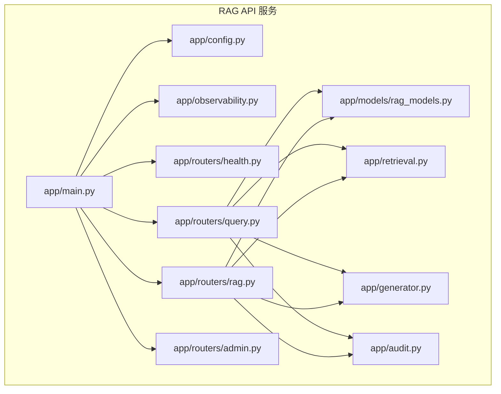
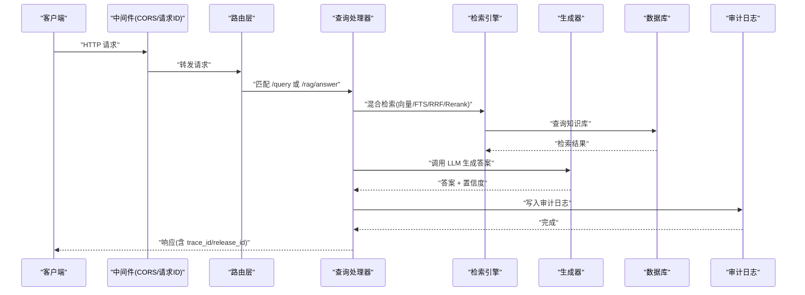
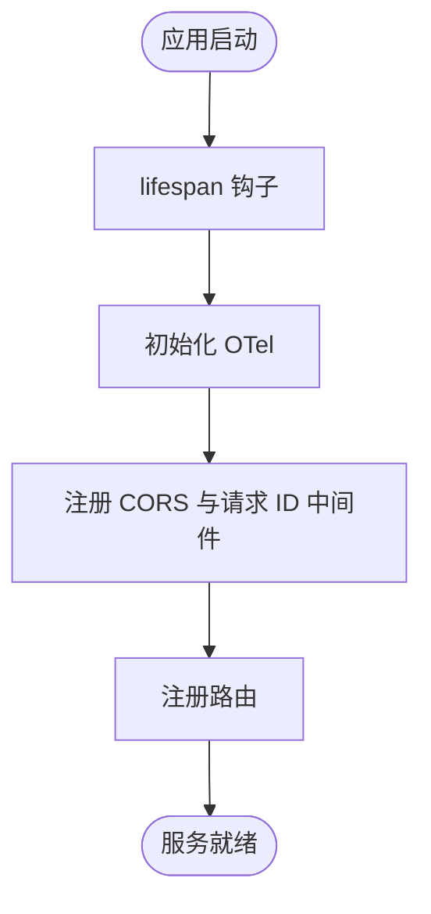
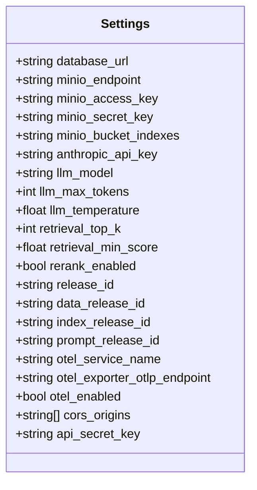
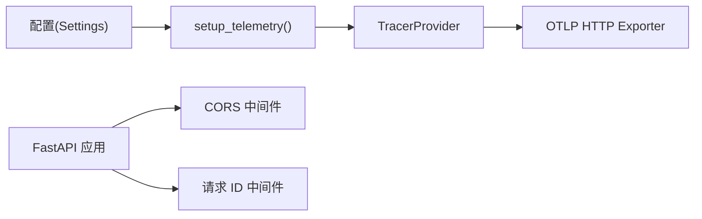
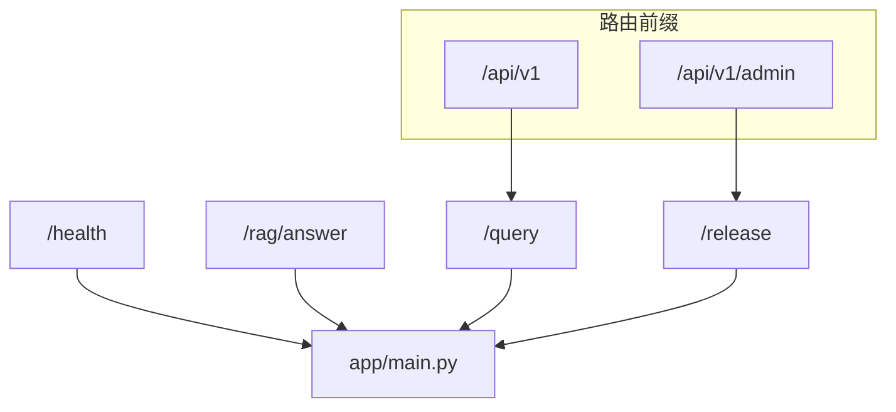
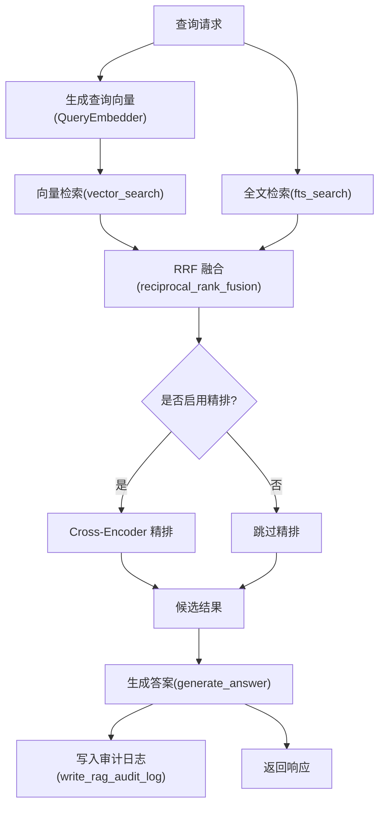
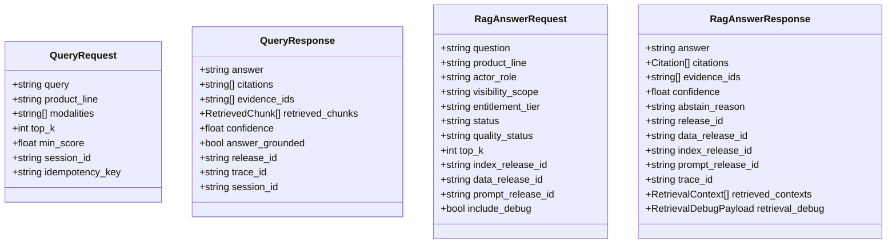
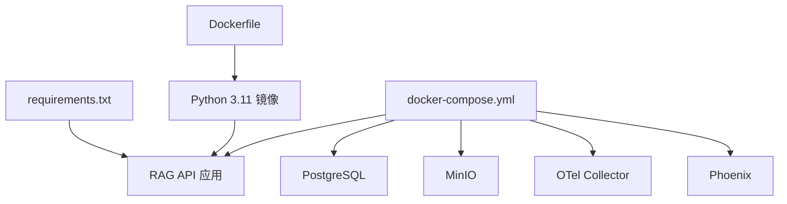

# 服务概览与架构

<cite>
**本文档引用的文件**
- [services/rag_api/app/main.py](file://services/rag_api/app/main.py)
- [services/rag_api/app/config.py](file://services/rag_api/app/config.py)
- [services/rag_api/app/observability.py](file://services/rag_api/app/observability.py)
- [services/rag_api/app/routers/health.py](file://services/rag_api/app/routers/health.py)
- [services/rag_api/app/routers/query.py](file://services/rag_api/app/routers/query.py)
- [services/rag_api/app/routers/rag.py](file://services/rag_api/app/routers/rag.py)
- [services/rag_api/app/routers/admin.py](file://services/rag_api/app/routers/admin.py)
- [services/rag_api/app/models/rag_models.py](file://services/rag_api/app/models/rag_models.py)
- [services/rag_api/app/retrieval.py](file://services/rag_api/app/retrieval.py)
- [services/rag_api/app/generator.py](file://services/rag_api/app/generator.py)
- [services/rag_api/app/audit.py](file://services/rag_api/app/audit.py)
- [services/rag_api/Dockerfile](file://services/rag_api/Dockerfile)
- [services/rag_api/requirements.txt](file://services/rag_api/requirements.txt)
- [infra/docker-compose.yml](file://infra/docker-compose.yml)
</cite>

## 目录
1. [简介](#简介)
2. [项目结构](#项目结构)
3. [核心组件](#核心组件)
4. [架构总览](#架构总览)
5. [详细组件分析](#详细组件分析)
6. [依赖关系分析](#依赖关系分析)
7. [性能考虑](#性能考虑)
8. [故障排查指南](#故障排查指南)
9. [结论](#结论)
10. [附录](#附录)

## 简介
本文件面向 RAG API 服务（基于 FastAPI）提供系统化的概览与架构说明，涵盖服务初始化流程、生命周期管理钩子、中间件配置、CORS 策略、请求 ID 追踪、全局异常处理、路由注册机制、可观测性设置、服务配置管理以及容器化部署等内容。文档同时提供架构图与组件交互关系，帮助开发者快速理解整体设计思路。

## 项目结构
RAG API 服务位于 services/rag_api 目录，采用按功能模块划分的组织方式：
- 应用入口与生命周期：app/main.py
- 配置管理：app/config.py
- 可观测性：app/observability.py
- 路由与端点：app/routers/*
- 数据模型：app/models/*
- 检索链路：app/retrieval.py
- 生成链路：app/generator.py
- 审计日志：app/audit.py
- 容器化与依赖：Dockerfile、requirements.txt
- 基础设施编排：infra/docker-compose.yml

**图表来源**
- [services/rag_api/app/main.py:1-73](file://services/rag_api/app/main.py#L1-L73)
- [services/rag_api/app/config.py:1-53](file://services/rag_api/app/config.py#L1-L53)
- [services/rag_api/app/observability.py:1-55](file://services/rag_api/app/observability.py#L1-L55)
- [services/rag_api/app/routers/health.py:1-48](file://services/rag_api/app/routers/health.py#L1-L48)
- [services/rag_api/app/routers/query.py:1-159](file://services/rag_api/app/routers/query.py#L1-L159)
- [services/rag_api/app/routers/rag.py:1-163](file://services/rag_api/app/routers/rag.py#L1-L163)
- [services/rag_api/app/routers/admin.py:1-18](file://services/rag_api/app/routers/admin.py#L1-L18)
- [services/rag_api/app/models/rag_models.py:1-168](file://services/rag_api/app/models/rag_models.py#L1-L168)
- [services/rag_api/app/retrieval.py:1-445](file://services/rag_api/app/retrieval.py#L1-L445)
- [services/rag_api/app/generator.py:1-222](file://services/rag_api/app/generator.py#L1-L222)
- [services/rag_api/app/audit.py:1-70](file://services/rag_api/app/audit.py#L1-L70)

**章节来源**
- [services/rag_api/app/main.py:1-73](file://services/rag_api/app/main.py#L1-L73)
- [services/rag_api/app/config.py:1-53](file://services/rag_api/app/config.py#L1-L53)

## 核心组件
- 应用实例与生命周期：通过 lifespan 钩子在启动阶段初始化可观测性，并在运行期提供中间件与路由。
- 配置中心：基于 pydantic-settings 的 Settings 类，统一管理数据库、对象存储、LLM、检索参数、版本发布、OTel、CORS 与安全等配置项。
- 可观测性：OpenTelemetry Tracing + OTLP HTTP Exporter，集成 FastAPI Instrumentation 与 OpenInference，自动注入 release_id 等资源属性。
- 中间件：CORS 中间件与自定义请求 ID 中间件，前者控制跨域访问，后者贯穿请求生命周期注入与透传 X-Request-ID。
- 全局异常处理：捕获未处理异常，统一返回包含错误类型、消息、请求 ID 与发布版本号的 JSON 响应。
- 路由注册：健康检查、RAG 查询、/api/v1/query、/api/v1/admin/* 等端点按前缀组织，便于版本化管理。
- 检索与生成：混合检索（向量 + FTS + RRF + 可选 rerank）、Claude 生成、证据引用解析与审计日志写入。
- 审计与调试：提供 RAG 审计日志写入与检索调试载荷，支持 include_debug 参数输出详细评分与过滤信息。

**章节来源**
- [services/rag_api/app/main.py:19-73](file://services/rag_api/app/main.py#L19-L73)
- [services/rag_api/app/config.py:7-53](file://services/rag_api/app/config.py#L7-L53)
- [services/rag_api/app/observability.py:11-55](file://services/rag_api/app/observability.py#L11-L55)
- [services/rag_api/app/routers/health.py:10-33](file://services/rag_api/app/routers/health.py#L10-L33)
- [services/rag_api/app/routers/query.py:39-93](file://services/rag_api/app/routers/query.py#L39-L93)
- [services/rag_api/app/routers/rag.py:25-122](file://services/rag_api/app/routers/rag.py#L25-L122)
- [services/rag_api/app/routers/admin.py:10-17](file://services/rag_api/app/routers/admin.py#L10-L17)
- [services/rag_api/app/retrieval.py:386-444](file://services/rag_api/app/retrieval.py#L386-L444)
- [services/rag_api/app/generator.py:65-118](file://services/rag_api/app/generator.py#L65-L118)
- [services/rag_api/app/audit.py:21-69](file://services/rag_api/app/audit.py#L21-L69)

## 架构总览
下图展示 RAG API 的端到端调用路径：客户端请求经中间件与路由进入业务逻辑，检索链路完成证据召回，生成链路产出答案并附带证据引用，审计日志记录关键指标，最终返回响应并携带 trace_id 与 release_id。

**图表来源**
- [services/rag_api/app/main.py:35-73](file://services/rag_api/app/main.py#L35-L73)
- [services/rag_api/app/routers/query.py:39-93](file://services/rag_api/app/routers/query.py#L39-L93)
- [services/rag_api/app/routers/rag.py:25-122](file://services/rag_api/app/routers/rag.py#L25-L122)
- [services/rag_api/app/retrieval.py:386-444](file://services/rag_api/app/retrieval.py#L386-L444)
- [services/rag_api/app/generator.py:65-118](file://services/rag_api/app/generator.py#L65-L118)
- [services/rag_api/app/audit.py:21-69](file://services/rag_api/app/audit.py#L21-L69)

## 详细组件分析

### 应用初始化与生命周期
- 生命周期钩子：通过 lifespan 在启动时调用 setup_telemetry 初始化 OTel；运行期不执行额外清理。
- 应用元数据：标题、描述、版本、文档端点等。
- 中间件：
  - CORS：根据配置允许指定 origins 与方法，headers 放宽以支持前端跨域。
  - 请求 ID：若请求头未提供 X-Request-ID，则生成 UUID 并注入 request.state，随后在响应头透传。
- 全局异常处理：捕获 Exception，返回包含错误类型、消息、请求 ID 与 release_id 的 JSON。
- 路由注册：include_router 按模块注册健康检查、RAG 查询、/api/v1/query、/api/v1/admin/* 等端点。

**图表来源**
- [services/rag_api/app/main.py:19-73](file://services/rag_api/app/main.py#L19-L73)
- [services/rag_api/app/observability.py:11-55](file://services/rag_api/app/observability.py#L11-L55)

**章节来源**
- [services/rag_api/app/main.py:19-73](file://services/rag_api/app/main.py#L19-L73)

### 配置管理
- 配置来源：pydantic_settings 从 .env 注入，大小写不敏感，支持多环境切换。
- 关键配置类别：
  - 数据库：DATABASE_URL
  - 对象存储：MINIO_ENDPOINT、ACCESS_KEY、SECRET_KEY、BUCKET_INDEXES
  - LLM：ANTHROPIC_API_KEY、MODEL、MAX_TOKENS、TEMPERATURE
  - 检索：TOP_K、MIN_SCORE、RERANK_ENABLED
  - 发布：RELEASE_ID、DATA_RELEASE_ID、INDEX_RELEASE_ID、PROMPT_RELEASE_ID
  - OTel：SERVICE_NAME、OTLP_ENDPOINT、ENABLED
  - CORS：ALLOWED_ORIGINS
  - 安全：API_SECRET_KEY

**图表来源**
- [services/rag_api/app/config.py:7-53](file://services/rag_api/app/config.py#L7-L53)

**章节来源**
- [services/rag_api/app/config.py:1-53](file://services/rag_api/app/config.py#L1-L53)

### 可观测性与中间件
- OTel 初始化：构建 Resource（包含 service.name、version、environment、release_id），配置 BatchSpanProcessor 与 OTLP HTTP Exporter，启用 FastAPI Instrumentation。
- 中间件：
  - CORS：allow_origins 来自 settings.cors_origins，允许 GET/POST 方法，通配 header。
  - 请求 ID：中间件在请求进入时生成或读取 X-Request-ID，注入 request.state，并在响应头透传。

**图表来源**
- [services/rag_api/app/observability.py:11-55](file://services/rag_api/app/observability.py#L11-L55)
- [services/rag_api/app/main.py:35-51](file://services/rag_api/app/main.py#L35-L51)
- [services/rag_api/app/config.py:45-46](file://services/rag_api/app/config.py#L45-L46)

**章节来源**
- [services/rag_api/app/observability.py:1-55](file://services/rag_api/app/observability.py#L1-L55)
- [services/rag_api/app/main.py:35-51](file://services/rag_api/app/main.py#L35-L51)

### 路由与端点
- 健康检查：/health，返回服务状态与各组件检查结果。
- RAG 查询（旧版）：/query，支持流式响应，包含检索、生成、审计日志与响应模型。
- RAG 答案（新版）：/rag/answer，支持 include_debug 输出检索调试载荷，包含多种评分与过滤信息。
- 管理接口：/api/v1/admin/release 返回当前发布版本信息。

**图表来源**
- [services/rag_api/app/main.py:69-73](file://services/rag_api/app/main.py#L69-L73)
- [services/rag_api/app/routers/health.py:10-33](file://services/rag_api/app/routers/health.py#L10-L33)
- [services/rag_api/app/routers/query.py:39-93](file://services/rag_api/app/routers/query.py#L39-L93)
- [services/rag_api/app/routers/rag.py:25-122](file://services/rag_api/app/routers/rag.py#L25-L122)
- [services/rag_api/app/routers/admin.py:10-17](file://services/rag_api/app/routers/admin.py#L10-L17)

**章节来源**
- [services/rag_api/app/routers/health.py:1-48](file://services/rag_api/app/routers/health.py#L1-L48)
- [services/rag_api/app/routers/query.py:1-159](file://services/rag_api/app/routers/query.py#L1-L159)
- [services/rag_api/app/routers/rag.py:1-163](file://services/rag_api/app/routers/rag.py#L1-L163)
- [services/rag_api/app/routers/admin.py:1-18](file://services/rag_api/app/routers/admin.py#L1-L18)

### 检索链路与生成链路
- 检索链路：向量检索（pgvector）、全文检索（PostgreSQL FTS）、RRF 融合、可选 Cross-Encoder 精排，支持多维元数据过滤。
- 生成链路：构建 system prompt 与上下文，调用 Claude API 生成答案，解析引用标记，估算置信度，支持降级返回。
- 审计日志：记录检索证据 ID、评分明细、答案、置信度、延迟等，确保可审计与回溯。

**图表来源**
- [services/rag_api/app/retrieval.py:386-444](file://services/rag_api/app/retrieval.py#L386-L444)
- [services/rag_api/app/generator.py:65-118](file://services/rag_api/app/generator.py#L65-L118)
- [services/rag_api/app/audit.py:21-69](file://services/rag_api/app/audit.py#L21-L69)

**章节来源**
- [services/rag_api/app/retrieval.py:1-445](file://services/rag_api/app/retrieval.py#L1-L445)
- [services/rag_api/app/generator.py:1-222](file://services/rag_api/app/generator.py#L1-L222)
- [services/rag_api/app/audit.py:1-70](file://services/rag_api/app/audit.py#L1-L70)

### 数据模型与契约
- 查询请求/响应：包含 answer、citations、evidence_ids、retrieved_chunks、confidence、answer_grounded、trace_id、release_id 等字段。
- Week8 合约模型：RagAnswerRequest/Response、Citation、RetrievalContext、RetrievalDebugPayload 等，支持 include_debug 输出详细评分与过滤信息。
- 健康检查与发布信息：HealthResponse、ReleaseInfoResponse。

**图表来源**
- [services/rag_api/app/models/rag_models.py:39-168](file://services/rag_api/app/models/rag_models.py#L39-L168)

**章节来源**
- [services/rag_api/app/models/rag_models.py:1-168](file://services/rag_api/app/models/rag_models.py#L1-L168)

## 依赖关系分析
- 应用依赖：FastAPI、Uvicorn、Pydantic、asyncpg、SQLAlchemy、Anthropic、Boto3、OpenTelemetry 生态、structlog 等。
- 容器镜像：基于 python:3.11-slim，安装系统依赖与 Python 依赖，暴露 8000 端口，CMD 启动 Uvicorn。
- 编排依赖：docker-compose 将 postgres、minio、otel_collector、phoenix 等服务组合，RAG API 通过环境变量与网络互联。

**图表来源**
- [services/rag_api/requirements.txt:1-29](file://services/rag_api/requirements.txt#L1-L29)
- [services/rag_api/Dockerfile:1-20](file://services/rag_api/Dockerfile#L1-L20)
- [infra/docker-compose.yml:15-122](file://infra/docker-compose.yml#L15-L122)

**章节来源**
- [services/rag_api/requirements.txt:1-29](file://services/rag_api/requirements.txt#L1-L29)
- [services/rag_api/Dockerfile:1-20](file://services/rag_api/Dockerfile#L1-L20)
- [infra/docker-compose.yml:1-340](file://infra/docker-compose.yml#L1-L340)

## 性能考虑
- 连接池与并发：查询端点使用懒加载 asyncpg Pool，避免重复初始化；检索链路并行执行向量与 FTS 检索，提升吞吐。
- 检索优化：RRF 融合与可选 rerank 在候选集上进行，减少下游 LLM 负担；最小分数过滤在响应层执行，保证质量门禁。
- 生成降级：当 LLM 不可用或鉴权失败时，返回最相关片段摘要，保障服务可用性。
- 观测性开销：OTel 批量导出与资源属性注入为常量开销，可通过配置开关关闭以降低影响。

## 故障排查指南
- CORS 问题：确认 settings.cors_origins 是否包含前端地址，方法是否包含 GET/POST。
- 请求 ID 丢失：检查中间件执行顺序，确保在路由之前注入；查看响应头是否包含 X-Request-ID。
- 全局异常：出现 500 错误时，记录 request_id 与 release_id，结合 OTel traces 与日志定位。
- 数据库连通性：健康检查会尝试连接数据库，若返回 down，检查 DATABASE_URL 与网络连通。
- 审计日志失败：写入审计日志为非致命，不影响主链路，可在日志中查看警告信息。

**章节来源**
- [services/rag_api/app/main.py:35-65](file://services/rag_api/app/main.py#L35-L65)
- [services/rag_api/app/routers/health.py:36-47](file://services/rag_api/app/routers/health.py#L36-L47)
- [services/rag_api/app/audit.py:68-69](file://services/rag_api/app/audit.py#L68-L69)

## 结论
该 RAG API 服务以 FastAPI 为核心，围绕“检索 + 生成 + 审计”的闭环构建，具备完善的可观测性、可扩展的配置体系与容器化部署能力。通过中间件与生命周期钩子实现一致的跨域与追踪策略，通过路由前缀实现版本化管理，通过模型契约确保响应一致性与可审计性。整体架构清晰、职责分离，适合在多租户与多产品线场景下演进。

## 附录
- 启动命令与端口：容器内暴露 8000 端口，可通过 docker-compose 启动；OTel 导出端点默认 http://otel_collector:4318。
- 健康检查：/health 可用于编排与探活；RAG API 服务健康检查包含数据库与待接入的 LLM/索引状态。
- 文档端点：/docs 与 /redoc 提供交互式 API 文档。

**章节来源**
- [services/rag_api/Dockerfile:17-19](file://services/rag_api/Dockerfile#L17-L19)
- [services/rag_api/app/main.py:26-33](file://services/rag_api/app/main.py#L26-L33)
- [services/rag_api/app/routers/health.py:10-33](file://services/rag_api/app/routers/health.py#L10-L33)
- [infra/docker-compose.yml:106-121](file://infra/docker-compose.yml#L106-L121)