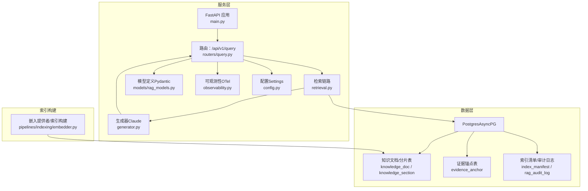
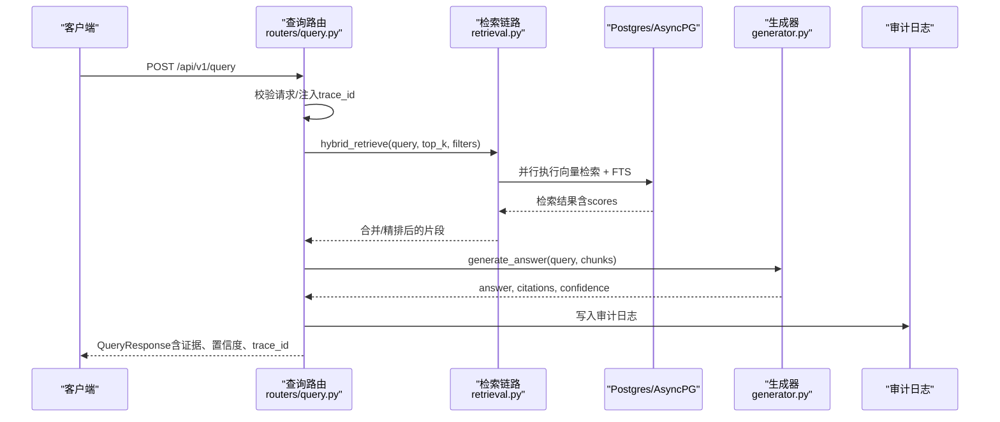
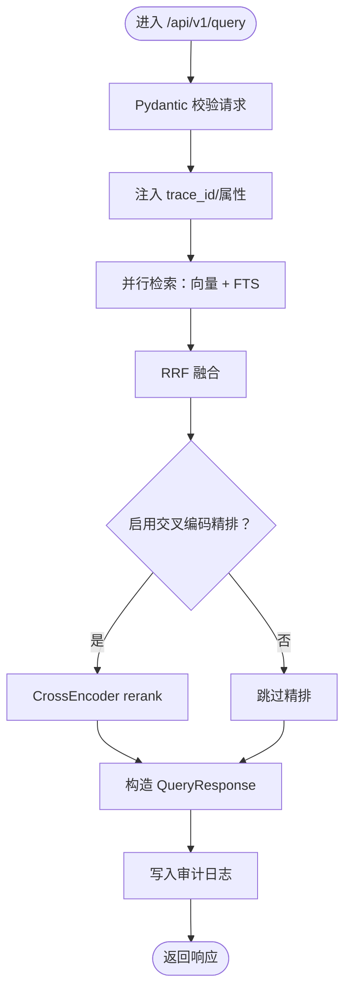
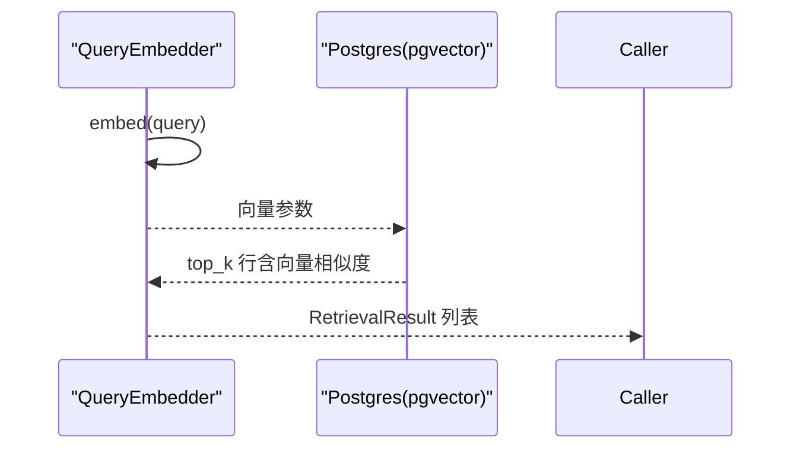
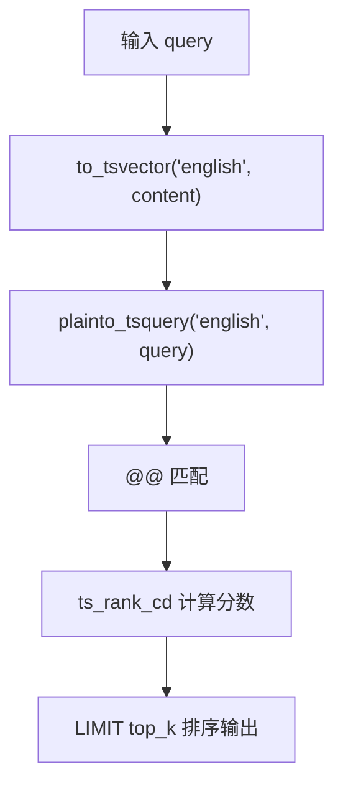
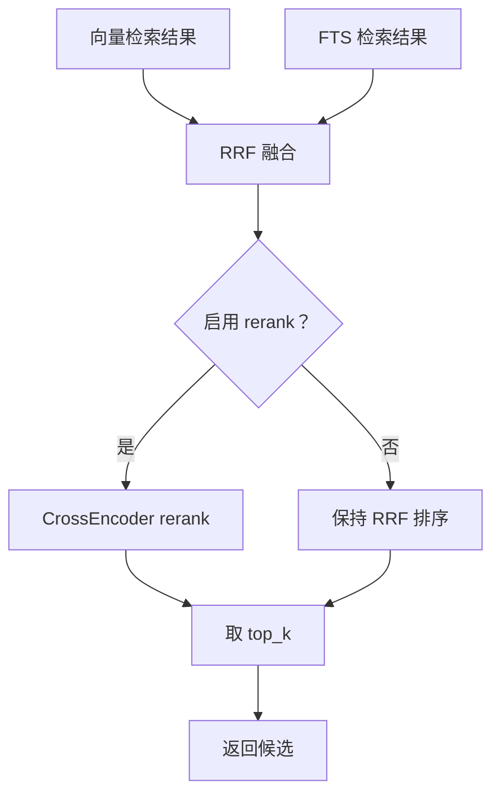
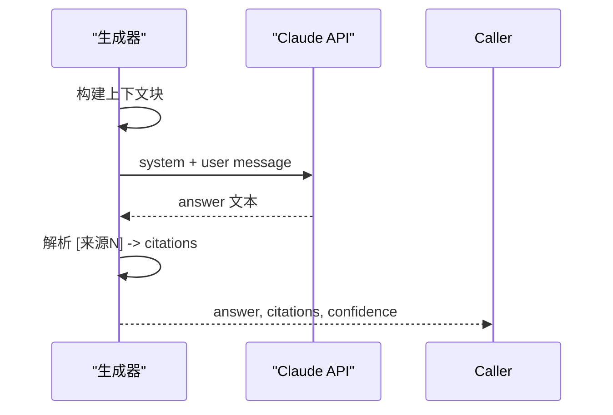
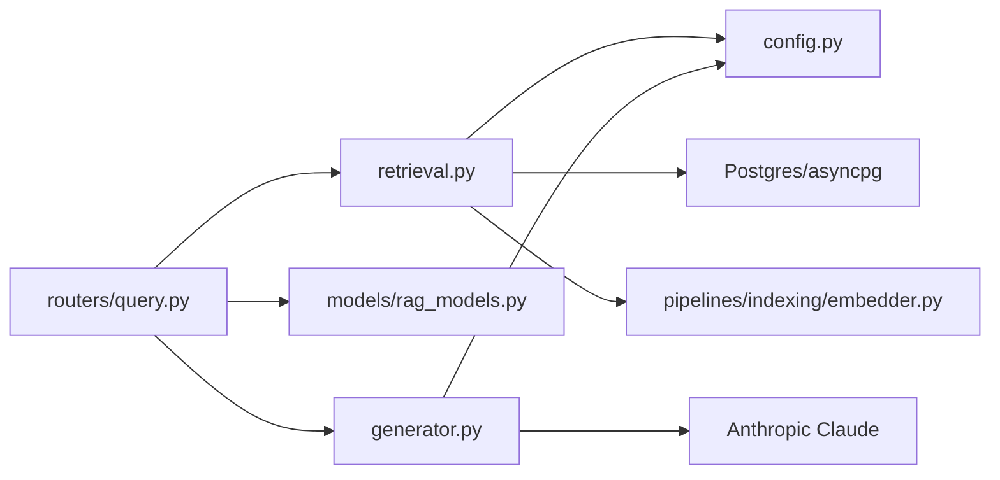

# 查询处理与检索

<cite>
**本文档引用的文件**
- [services/rag_api/app/main.py](file://services/rag_api/app/main.py)
- [services/rag_api/app/routers/query.py](file://services/rag_api/app/routers/query.py)
- [services/rag_api/app/retrieval.py](file://services/rag_api/app/retrieval.py)
- [services/rag_api/app/models/rag_models.py](file://services/rag_api/app/models/rag_models.py)
- [services/rag_api/app/models/retrieval.py](file://services/rag_api/app/models/retrieval.py)
- [services/rag_api/app/generator.py](file://services/rag_api/app/generator.py)
- [services/rag_api/app/config.py](file://services/rag_api/app/config.py)
- [services/rag_api/app/observability.py](file://services/rag_api/app/observability.py)
- [pipelines/indexing/embedder.py](file://pipelines/indexing/embedder.py)
- [contracts/service/rag_request.schema.json](file://contracts/service/rag_request.schema.json)
- [contracts/service/rag_response.schema.json](file://contracts/service/rag_response.schema.json)
- [infra/migrations/003_week08_index_rag.sql](file://infra/migrations/003_week08_index_rag.sql)
- [tests/integration/test_rag_api_smoke.py](file://tests/integration/test_rag_api_smoke.py)
- [tests/integration/test_week8_hybrid_retrieval.py](file://tests/integration/test_week8_hybrid_retrieval.py)
</cite>

## 目录
1. [简介](#简介)
2. [项目结构](#项目结构)
3. [核心组件](#核心组件)
4. [架构总览](#架构总览)
5. [详细组件分析](#详细组件分析)
6. [依赖分析](#依赖分析)
7. [性能考虑](#性能考虑)
8. [故障排查指南](#故障排查指南)
9. [结论](#结论)
10. [附录](#附录)

## 简介
本文件面向“查询处理与检索系统”的工程实践，聚焦以下目标：
- 查询路由与请求处理：参数校验、预处理、响应格式化与可观测性。
- 向量检索机制：嵌入生成、相似度计算、候选筛选与索引策略。
- 检索算法与融合：BM25/FTS、语义相似度、RRF 融合与交叉编码精排。
- 查询重写/纠错/意图识别：当前实现以“直接检索”为主，未来可扩展。
- 性能优化、缓存策略与错误处理：连接池、索引、降级与审计。
- 实战示例与结果分析：结合测试与契约，给出可操作的参考。

## 项目结构
RAG API 服务采用 FastAPI，核心模块围绕“路由—检索—生成—审计—响应”闭环组织；数据与索引由独立流水线构建，运行时通过 asyncpg 访问 Postgres 并利用 pgvector 进行 ANN 检索。

图表来源
- [services/rag_api/app/main.py:1-73](file://services/rag_api/app/main.py#L1-L73)
- [services/rag_api/app/routers/query.py:1-159](file://services/rag_api/app/routers/query.py#L1-L159)
- [services/rag_api/app/retrieval.py:1-445](file://services/rag_api/app/retrieval.py#L1-L445)
- [services/rag_api/app/generator.py:1-222](file://services/rag_api/app/generator.py#L1-L222)
- [services/rag_api/app/models/rag_models.py:1-168](file://services/rag_api/app/models/rag_models.py#L1-L168)
- [services/rag_api/app/observability.py:1-55](file://services/rag_api/app/observability.py#L1-L55)
- [pipelines/indexing/embedder.py:1-429](file://pipelines/indexing/embedder.py#L1-L429)
- [infra/migrations/003_week08_index_rag.sql:1-78](file://infra/migrations/003_week08_index_rag.sql#L1-L78)

章节来源
- [services/rag_api/app/main.py:1-73](file://services/rag_api/app/main.py#L1-L73)
- [services/rag_api/app/routers/query.py:1-159](file://services/rag_api/app/routers/query.py#L1-L159)
- [services/rag_api/app/retrieval.py:1-445](file://services/rag_api/app/retrieval.py#L1-L445)
- [services/rag_api/app/generator.py:1-222](file://services/rag_api/app/generator.py#L1-L222)
- [services/rag_api/app/models/rag_models.py:1-168](file://services/rag_api/app/models/rag_models.py#L1-L168)
- [services/rag_api/app/observability.py:1-55](file://services/rag_api/app/observability.py#L1-L55)
- [pipelines/indexing/embedder.py:1-429](file://pipelines/indexing/embedder.py#L1-L429)
- [infra/migrations/003_week08_index_rag.sql:1-78](file://infra/migrations/003_week08_index_rag.sql#L1-L78)

## 核心组件
- 应用入口与中间件
  - 生命周期钩子、CORS、全局异常处理、请求 ID 注入。
- 查询路由
  - /api/v1/query：接收 QueryRequest，执行检索、生成、审计与响应构造。
- 检索链路
  - 向量检索（pgvector）、PostgreSQL 全文检索（FTS）、RRF 融合、可选交叉编码精排。
- 生成器
  - 构建 system prompt 与上下文，调用 Claude，解析引用，估算置信度。
- 模型与契约
  - Pydantic 模型定义请求/响应结构，JSON Schema 约束字段与范围。
- 配置与可观测性
  - Settings 统一注入数据库、LLM、检索参数与版本信息；OTel 初始化与 Span 注入。
- 索引构建
  - 嵌入提供者多后端探测、批量写回、向量索引创建与清单记录。

章节来源
- [services/rag_api/app/main.py:19-73](file://services/rag_api/app/main.py#L19-L73)
- [services/rag_api/app/routers/query.py:37-159](file://services/rag_api/app/routers/query.py#L37-L159)
- [services/rag_api/app/retrieval.py:130-445](file://services/rag_api/app/retrieval.py#L130-L445)
- [services/rag_api/app/generator.py:63-222](file://services/rag_api/app/generator.py#L63-L222)
- [services/rag_api/app/models/rag_models.py:37-168](file://services/rag_api/app/models/rag_models.py#L37-L168)
- [services/rag_api/app/config.py:7-53](file://services/rag_api/app/config.py#L7-L53)
- [services/rag_api/app/observability.py:11-55](file://services/rag_api/app/observability.py#L11-L55)
- [pipelines/indexing/embedder.py:34-141](file://pipelines/indexing/embedder.py#L34-L141)

## 架构总览
下图展示一次查询的端到端流程：请求进入路由，路由调用检索链路，检索结果交由生成器生成带证据引用的答案，并写入审计日志，最终返回符合契约的响应。

图表来源
- [services/rag_api/app/routers/query.py:39-94](file://services/rag_api/app/routers/query.py#L39-L94)
- [services/rag_api/app/retrieval.py:384-445](file://services/rag_api/app/retrieval.py#L384-L445)
- [services/rag_api/app/generator.py:63-118](file://services/rag_api/app/generator.py#L63-L118)

## 详细组件分析

### 查询路由与请求处理
- 参数验证与预处理
  - 使用 Pydantic 模型对请求进行强类型校验，限制 query 长度、top_k 上下界等。
  - JSON Schema 约束服务契约字段，保证响应一致性。
- 控制流与可观测性
  - 通过 OpenTelemetry tracer 记录检索与生成阶段的 spans，注入 release_id、trace_id 等属性。
  - 全局异常处理器统一返回内部错误响应，包含 request_id 与 release_id。
- 响应格式化
  - 构造 QueryResponse，包含 answer、citations、evidence_ids、retrieved_chunks、confidence、answer_grounded 等。
  - 将 final_score 归一化到 0-1 区间，便于前端展示与阈值控制。

图表来源
- [services/rag_api/app/routers/query.py:39-159](file://services/rag_api/app/routers/query.py#L39-L159)
- [services/rag_api/app/retrieval.py:384-445](file://services/rag_api/app/retrieval.py#L384-L445)
- [services/rag_api/app/models/rag_models.py:37-76](file://services/rag_api/app/models/rag_models.py#L37-L76)

章节来源
- [services/rag_api/app/routers/query.py:37-159](file://services/rag_api/app/routers/query.py#L37-L159)
- [contracts/service/rag_request.schema.json:1-23](file://contracts/service/rag_request.schema.json#L1-L23)
- [contracts/service/rag_response.schema.json:1-58](file://contracts/service/rag_response.schema.json#L1-L58)
- [services/rag_api/app/models/rag_models.py:37-76](file://services/rag_api/app/models/rag_models.py#L37-L76)

### 向量检索机制
- 嵌入生成
  - 查询时动态加载嵌入提供者（Voyage/AI、OpenAI、本地 sentence-transformers），生成查询向量。
  - 若不可用则返回空结果（降级策略）。
- 相似度计算
  - 使用 pgvector 的向量距离（余弦）进行 ANN 检索，返回 ks.embedding <=> $1 后的相似度。
- 候选筛选
  - 支持多维元数据过滤（产品线、可见性范围、授权等级、状态、质量状态等）。
  - 通过 SQL JOIN knowledge_doc 与 evidence_anchor 回填完整证据信息。

图表来源
- [services/rag_api/app/retrieval.py:98-127](file://services/rag_api/app/retrieval.py#L98-L127)
- [services/rag_api/app/retrieval.py:132-215](file://services/rag_api/app/retrieval.py#L132-L215)
- [pipelines/indexing/embedder.py:36-141](file://pipelines/indexing/embedder.py#L36-L141)

章节来源
- [services/rag_api/app/retrieval.py:98-215](file://services/rag_api/app/retrieval.py#L98-L215)
- [pipelines/indexing/embedder.py:36-141](file://pipelines/indexing/embedder.py#L36-L141)

### PostgreSQL 全文检索（FTS）
- 查询模式
  - 使用 to_tsvector('english', content) 与 plainto_tsquery 构造查询，ts_rank_cd 计算相关度。
- 优势与边界
  - 对关键词精确匹配友好，适合技术术语检索；对语义理解较弱。
- 错误处理
  - FTS 失败时返回空结果，不影响整体链路。

图表来源
- [services/rag_api/app/retrieval.py:217-302](file://services/rag_api/app/retrieval.py#L217-L302)

章节来源
- [services/rag_api/app/retrieval.py:217-302](file://services/rag_api/app/retrieval.py#L217-L302)

### RRF 融合与交叉编码精排
- RRF（Reciprocal Rank Fusion）
  - 合并向量与 FTS 的候选，按 1/(k+rank) 求和，k 默认 60；保留两路分数以便后续精排。
- Cross-Encoder 精排
  - 优先使用 sentence-transformers 的 cross-encoder，不可用时保留 RRF 排序。
  - 对前 top_k*2 的结果进行打分并重排，最终取 top_k。

图表来源
- [services/rag_api/app/retrieval.py:307-338](file://services/rag_api/app/retrieval.py#L307-L338)
- [services/rag_api/app/retrieval.py:342-382](file://services/rag_api/app/retrieval.py#L342-L382)
- [services/rag_api/app/retrieval.py:384-445](file://services/rag_api/app/retrieval.py#L384-L445)

章节来源
- [services/rag_api/app/retrieval.py:307-445](file://services/rag_api/app/retrieval.py#L307-L445)

### 生成器与证据引用
- Prompt 与上下文
  - 构建 system prompt（证据优先、引用格式、结构化回答）与上下文块，块内包含来源路径、页码、URL 等元信息。
- Claude 调用与引用解析
  - 解析答案中的 [来源N] 标记，生成可读引用列表；若无引用则列出全部来源。
- 置信度估算
  - 基于检索 top_score 归一化到 0-1；当检索为空或置信度过低时返回“不可用”的降级答案。
- 错误处理
  - API 认证失败或异常时返回降级答案与较低置信度。

图表来源
- [services/rag_api/app/generator.py:24-118](file://services/rag_api/app/generator.py#L24-L118)
- [services/rag_api/app/generator.py:149-169](file://services/rag_api/app/generator.py#L149-L169)

章节来源
- [services/rag_api/app/generator.py:24-118](file://services/rag_api/app/generator.py#L24-L118)
- [services/rag_api/app/generator.py:149-169](file://services/rag_api/app/generator.py#L149-L169)

### 审计与可观测性
- 审计日志
  - 记录请求 ID、工具名、参数哈希、结果码、释放版本、trace_id 等，非阻塞写入。
- 可观测性
  - OTel 初始化，注入 release_id、服务名、资源属性；FastAPI instrumentation 自动采集 span。
- 请求 ID
  - 中间件注入 X-Request-ID，贯穿请求生命周期，便于追踪。

章节来源
- [services/rag_api/app/routers/query.py:136-159](file://services/rag_api/app/routers/query.py#L136-L159)
- [services/rag_api/app/observability.py:11-55](file://services/rag_api/app/observability.py#L11-L55)
- [services/rag_api/app/main.py:44-52](file://services/rag_api/app/main.py#L44-L52)

### 数据模型与契约
- 请求模型
  - QueryRequest：query、product_line、modalities、top_k、min_score、session_id、幂等键等。
- 响应模型
  - QueryResponse：answer、citations、evidence_ids、retrieved_chunks、confidence、answer_grounded、release_id、trace_id、session_id。
- 调试模型
  - RetrievalDebugPayload：mode、rrf_k、rerank_enabled、rerank_fallback、filters_applied、results。
- JSON Schema
  - 严格约束字段存在性、类型与范围，保障跨服务一致性。

章节来源
- [services/rag_api/app/models/rag_models.py:37-168](file://services/rag_api/app/models/rag_models.py#L37-L168)
- [services/rag_api/app/models/retrieval.py:8-24](file://services/rag_api/app/models/retrieval.py#L8-L24)
- [contracts/service/rag_request.schema.json:1-23](file://contracts/service/rag_request.schema.json#L1-L23)
- [contracts/service/rag_response.schema.json:1-58](file://contracts/service/rag_response.schema.json#L1-L58)

## 依赖分析
- 组件耦合
  - 路由依赖检索模块与生成器；检索模块依赖嵌入提供者与数据库；生成器依赖 LLM SDK 与配置。
- 外部依赖
  - Postgres/asyncpg、pgvector、Anthropic Claude、sentence-transformers（可选）。
- 索引与表结构
  - knowledge_doc/knowledge_section/evidence_anchor 为核心检索表；index_manifest/rag_audit_log 支撑索引与审计。

图表来源
- [services/rag_api/app/routers/query.py:1-159](file://services/rag_api/app/routers/query.py#L1-L159)
- [services/rag_api/app/retrieval.py:1-445](file://services/rag_api/app/retrieval.py#L1-L445)
- [services/rag_api/app/generator.py:1-222](file://services/rag_api/app/generator.py#L1-L222)
- [pipelines/indexing/embedder.py:1-429](file://pipelines/indexing/embedder.py#L1-L429)
- [services/rag_api/app/config.py:1-53](file://services/rag_api/app/config.py#L1-L53)

章节来源
- [services/rag_api/app/routers/query.py:1-159](file://services/rag_api/app/routers/query.py#L1-L159)
- [services/rag_api/app/retrieval.py:1-445](file://services/rag_api/app/retrieval.py#L1-L445)
- [services/rag_api/app/generator.py:1-222](file://services/rag_api/app/generator.py#L1-L222)
- [pipelines/indexing/embedder.py:1-429](file://pipelines/indexing/embedder.py#L1-L429)
- [services/rag_api/app/config.py:1-53](file://services/rag_api/app/config.py#L1-L53)

## 性能考虑
- 并行检索
  - 向量检索与 FTS 并行执行，减少端到端延迟。
- Top-K 放大
  - 检索 top_k 放大至 top_k*2，再经 RRF 与可选精排，提升召回稳定性。
- 向量索引
  - IVFFlat 索引按数据量估算 lists 参数，加速 ANN 检索。
- 连接池
  - asyncpg 连接池（最小/最大数量）降低连接开销，提高并发吞吐。
- 缓存策略
  - 建议：对高频查询与热门文档片段进行短期缓存；注意缓存失效与版本控制（release_id）。
- 精排成本
  - Cross-Encoder 精排可开关，默认启用；在高 QPS 下可考虑降级或异步队列。
- 数据库索引
  - 已有按产品线/可见性/授权/状态/质量状态的复合索引，以及检索相关索引，有助于过滤与排序。

章节来源
- [services/rag_api/app/retrieval.py:404-405](file://services/rag_api/app/retrieval.py#L404-L405)
- [services/rag_api/app/retrieval.py:384-399](file://services/rag_api/app/retrieval.py#L384-L399)
- [pipelines/indexing/embedder.py:374-396](file://pipelines/indexing/embedder.py#L374-L396)
- [services/rag_api/app/routers/query.py:29-34](file://services/rag_api/app/routers/query.py#L29-L34)
- [infra/migrations/003_week08_index_rag.sql:67-78](file://infra/migrations/003_week08_index_rag.sql#L67-L78)

## 故障排查指南
- 常见错误与定位
  - 数据库连接失败：检查 DATABASE_URL、网络与 asyncpg 连接池配置。
  - 嵌入提供者不可用：确认 VOYAGE_API_KEY 或 OPENAI_API_KEY；若均不可用，查询将返回空结果。
  - LLM 认证失败：检查 ANTHROPIC_API_KEY；生成器会返回降级答案与较低置信度。
  - FTS 查询异常：日志记录警告并返回空结果，检查英文分词与 tsvector 设置。
- 审计与追踪
  - 通过 X-Request-ID 与 trace_id 在 OTel 后端检索对应 span；审计日志记录检索结果码与释放版本。
- 单元与集成测试
  - 查询契约字段校验、请求 ID 传播、RRF 融合正确性等均有测试覆盖。

章节来源
- [services/rag_api/app/routers/query.py:111-113](file://services/rag_api/app/routers/query.py#L111-L113)
- [services/rag_api/app/retrieval.py:147-149](file://services/rag_api/app/retrieval.py#L147-L149)
- [services/rag_api/app/generator.py:112-117](file://services/rag_api/app/generator.py#L112-L117)
- [services/rag_api/app/routers/query.py:136-159](file://services/rag_api/app/routers/query.py#L136-L159)
- [tests/integration/test_rag_api_smoke.py:50-90](file://tests/integration/test_rag_api_smoke.py#L50-L90)
- [tests/integration/test_week8_hybrid_retrieval.py:32-44](file://tests/integration/test_week8_hybrid_retrieval.py#L32-L44)

## 结论
该系统以“混合检索 + 精排 + 证据引用”的方式实现了稳健的企业知识问答能力。通过并行检索、RRF 融合与可选精排，兼顾了关键词精确性与语义相关性；通过严格的契约与可观测性设计，保障了可运维性与可审计性。未来可在查询重写/纠错/意图识别方面引入规则或模型增强，同时结合缓存与异步精排进一步优化性能。

## 附录

### 查询示例与结果分析
- 示例请求（来自契约）
  - 字段：question、product_line、actor_role、visibility_scope、entitlement_tier、status、quality_status、top_k、index_release_id、data_release_id、prompt_release_id、include_debug。
  - 长度限制：1~2048；top_k 限制：1~20。
- 示例响应（来自契约）
  - 字段：answer、citations、evidence_ids、confidence、abstain_reason、release_id、data_release_id、index_release_id、prompt_release_id、trace_id、retrieved_contexts、retrieval_debug。
  - answer_grounded：confidence ≥ min_score 且命中片段 > 0。
- 测试验证
  - 响应必含字段校验、空查询/超长查询的 422 校验、请求 ID 传播等。

章节来源
- [contracts/service/rag_request.schema.json:1-23](file://contracts/service/rag_request.schema.json#L1-L23)
- [contracts/service/rag_response.schema.json:1-58](file://contracts/service/rag_response.schema.json#L1-L58)
- [tests/integration/test_rag_api_smoke.py:50-90](file://tests/integration/test_rag_api_smoke.py#L50-L90)

### 数据库与索引要点
- 索引清单与审计日志表：支持索引构建质量门禁与检索审计。
- 复合索引：按产品线/可见性/授权/状态/质量状态过滤，加速检索。
- 向量索引：IVFFlat，按数据量估算 lists，提升 ANN 检索效率。

章节来源
- [infra/migrations/003_week08_index_rag.sql:14-78](file://infra/migrations/003_week08_index_rag.sql#L14-L78)