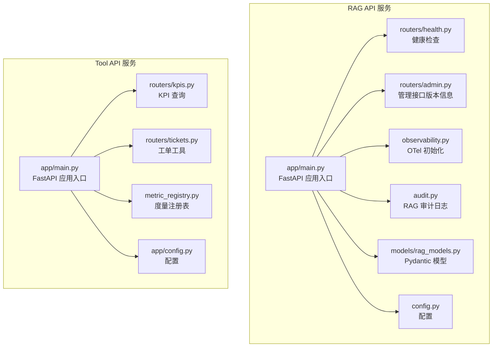
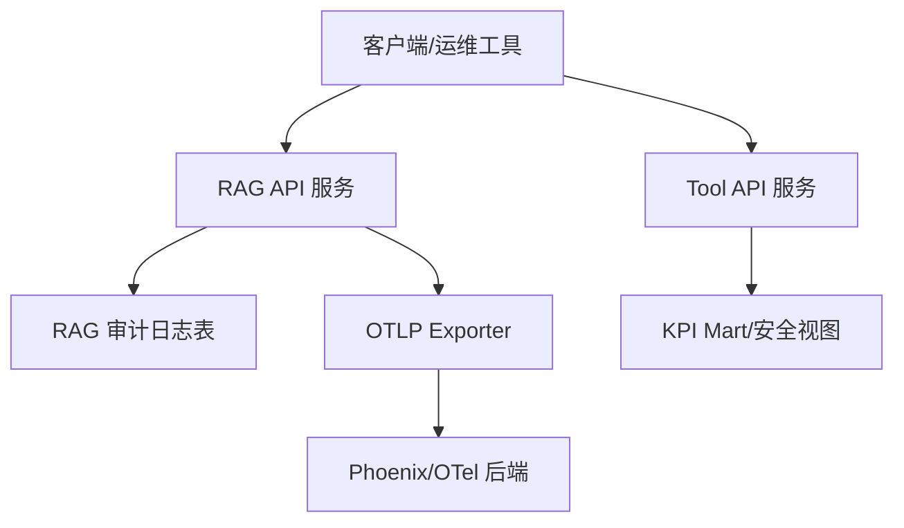
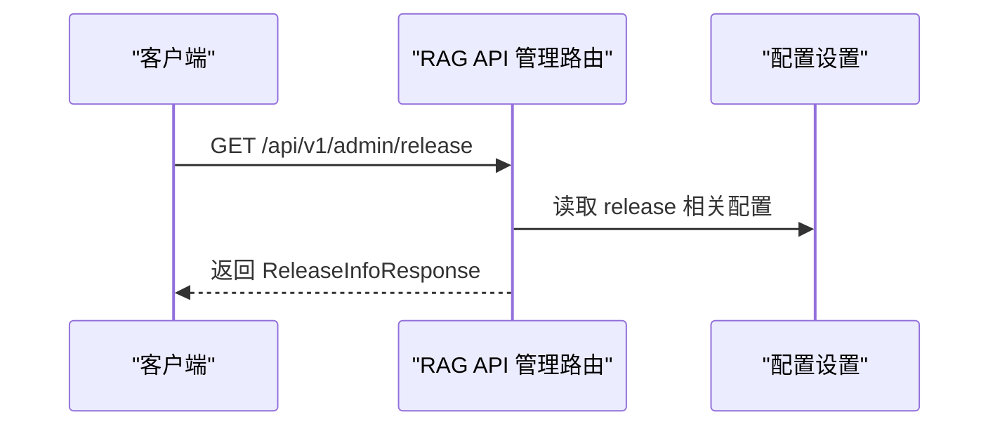
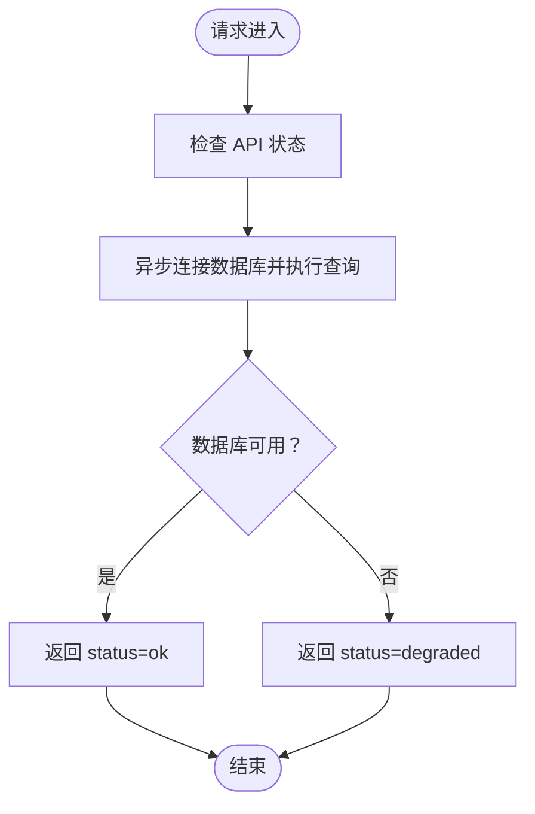
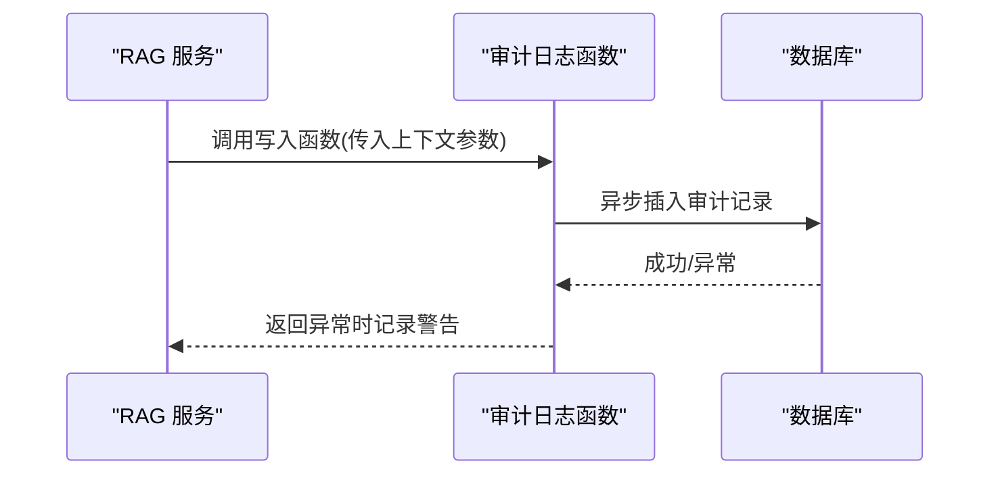
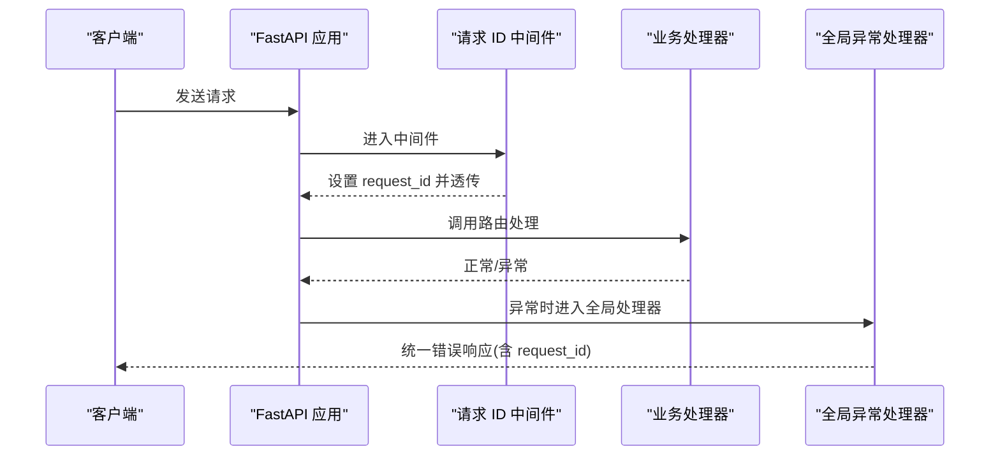
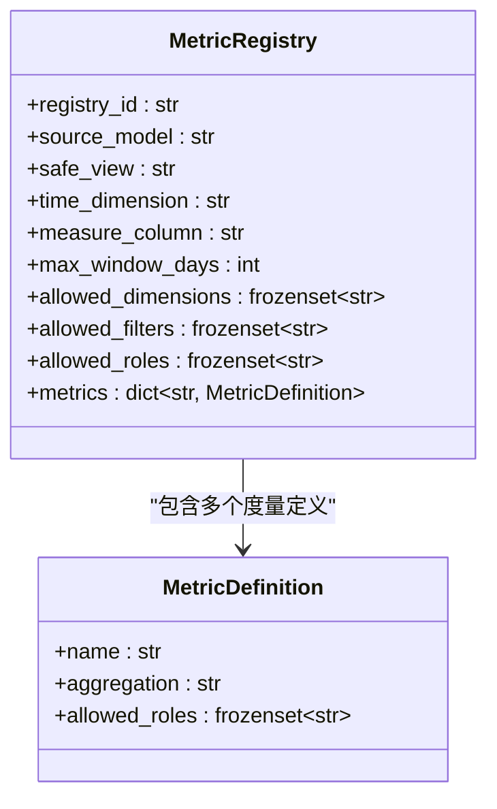
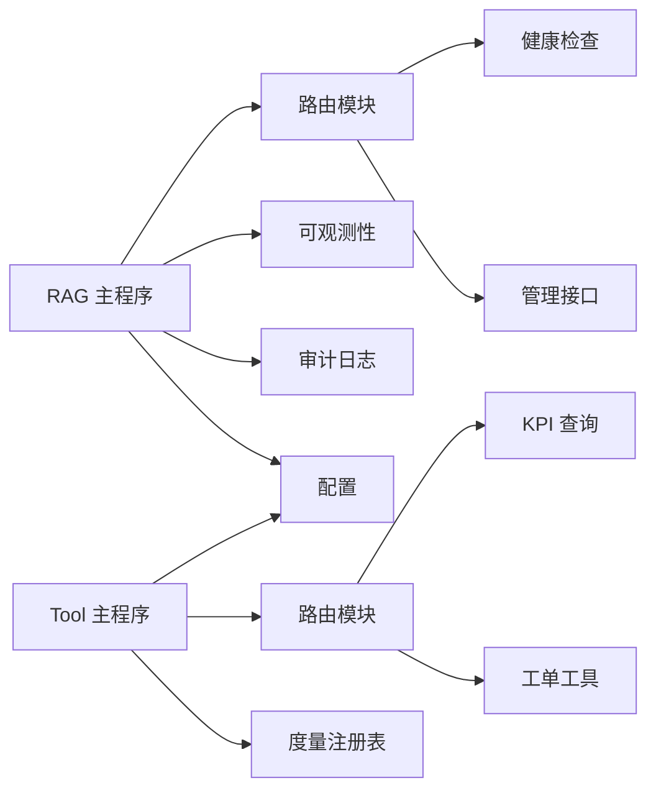

# 管理接口与监控

<cite>
**本文档引用的文件**
- [services/rag_api/app/main.py](file://services/rag_api/app/main.py)
- [services/rag_api/app/routers/admin.py](file://services/rag_api/app/routers/admin.py)
- [services/rag_api/app/routers/health.py](file://services/rag_api/app/routers/health.py)
- [services/rag_api/app/audit.py](file://services/rag_api/app/audit.py)
- [services/rag_api/app/observability.py](file://services/rag_api/app/observability.py)
- [services/rag_api/app/models/rag_models.py](file://services/rag_api/app/models/rag_models.py)
- [services/rag_api/app/config.py](file://services/rag_api/app/config.py)
- [services/tool_api/app/main.py](file://services/tool_api/app/main.py)
- [services/tool_api/app/routers/kpis.py](file://services/tool_api/app/routers/kpis.py)
- [services/tool_api/app/routers/tickets.py](file://services/tool_api/app/routers/tickets.py)
- [services/tool_api/app/metric_registry.py](file://services/tool_api/app/metric_registry.py)
- [analytics/metric_registry_v1.yml](file://analytics/metric_registry_v1.yml)
- [reports/week08/rag_audit_log.sample.jsonl](file://reports/week08/rag_audit_log.sample.jsonl)
</cite>

## 目录
1. [简介](#简介)
2. [项目结构](#项目结构)
3. [核心组件](#核心组件)
4. [架构总览](#架构总览)
5. [详细组件分析](#详细组件分析)
6. [依赖分析](#依赖分析)
7. [性能考虑](#性能考虑)
8. [故障排查指南](#故障排查指南)
9. [结论](#结论)
10. [附录](#附录)

## 简介
本文件面向“管理接口与监控系统”的设计与实现，聚焦以下目标：
- 管理路由：系统状态查询、配置管理、版本发布信息查询
- 审计日志：RAG 交互的完整审计记录，含操作追踪、证据链与性能指标
- 安全策略：请求 ID 注入、全局异常处理、OTel 链路追踪与资源属性
- 监控指标：OTel Tracing、KPI 查询治理与度量注册表
- 使用示例：API 调用路径与监控数据解读
- 故障诊断：健康检查、异常处理、审计日志样本与定位思路

## 项目结构
本项目包含两个服务：
- RAG API 服务：提供健康检查、查询、RAG 答案、管理接口（版本信息）、可观测性与审计日志
- 工具 API 服务：提供健康检查、工单工具、KPI 查询与度量注册表加载

图表来源
- [services/rag_api/app/main.py:26-73](file://services/rag_api/app/main.py#L26-L73)
- [services/rag_api/app/routers/health.py:10-33](file://services/rag_api/app/routers/health.py#L10-L33)
- [services/rag_api/app/routers/admin.py:10-17](file://services/rag_api/app/routers/admin.py#L10-L17)
- [services/rag_api/app/observability.py:11-55](file://services/rag_api/app/observability.py#L11-L55)
- [services/rag_api/app/audit.py:21-70](file://services/rag_api/app/audit.py#L21-L70)
- [services/rag_api/app/models/rag_models.py:90-95](file://services/rag_api/app/models/rag_models.py#L90-L95)
- [services/rag_api/app/config.py:34-50](file://services/rag_api/app/config.py#L34-L50)
- [services/tool_api/app/main.py:24-64](file://services/tool_api/app/main.py#L24-L64)
- [services/tool_api/app/routers/kpis.py:14-17](file://services/tool_api/app/routers/kpis.py#L14-L17)
- [services/tool_api/app/routers/tickets.py:50-78](file://services/tool_api/app/routers/tickets.py#L50-L78)
- [services/tool_api/app/metric_registry.py:35-66](file://services/tool_api/app/metric_registry.py#L35-L66)

章节来源
- [services/rag_api/app/main.py:26-73](file://services/rag_api/app/main.py#L26-L73)
- [services/tool_api/app/main.py:24-64](file://services/tool_api/app/main.py#L24-L64)

## 核心组件
- 管理接口（RAG API）：提供当前 Release 版本信息查询，便于运维与审计对齐
- 健康检查（RAG API）：检查 API、数据库、向量索引与 LLM 状态，返回整体健康状态
- 审计日志（RAG API）：记录一次 RAG 交互的完整轨迹，含检索过滤、证据 ID、答案、置信度、延迟等
- 可观测性（RAG API）：基于 OTel 的 Tracing 初始化，自动注入 release_id 等资源属性
- KPI 查询与度量注册表（Tool API）：加载治理后的度量注册表，限定维度、过滤器与角色权限，提供受控 KPI 查询

章节来源
- [services/rag_api/app/routers/admin.py:10-17](file://services/rag_api/app/routers/admin.py#L10-L17)
- [services/rag_api/app/routers/health.py:10-33](file://services/rag_api/app/routers/health.py#L10-L33)
- [services/rag_api/app/audit.py:21-70](file://services/rag_api/app/audit.py#L21-L70)
- [services/rag_api/app/observability.py:11-55](file://services/rag_api/app/observability.py#L11-L55)
- [services/tool_api/app/routers/kpis.py:14-17](file://services/tool_api/app/routers/kpis.py#L14-L17)
- [services/tool_api/app/metric_registry.py:35-66](file://services/tool_api/app/metric_registry.py#L35-L66)

## 架构总览
下图展示管理接口与监控在系统中的位置与交互：

图表来源
- [services/rag_api/app/main.py:68-73](file://services/rag_api/app/main.py#L68-L73)
- [services/rag_api/app/observability.py:40-47](file://services/rag_api/app/observability.py#L40-L47)
- [services/rag_api/app/audit.py:40-67](file://services/rag_api/app/audit.py#L40-L67)
- [services/tool_api/app/routers/kpis.py:14-17](file://services/tool_api/app/routers/kpis.py#L14-L17)

## 详细组件分析

### 管理接口（版本信息）
- 路由：GET /api/v1/admin/release
- 功能：返回 release_id、data_release_id、index_release_id、prompt_release_id
- 用途：统一发布版本标识，便于审计与回溯

图表来源
- [services/rag_api/app/routers/admin.py:10-17](file://services/rag_api/app/routers/admin.py#L10-L17)
- [services/rag_api/app/models/rag_models.py:90-95](file://services/rag_api/app/models/rag_models.py#L90-L95)
- [services/rag_api/app/config.py:34-39](file://services/rag_api/app/config.py#L34-L39)

章节来源
- [services/rag_api/app/routers/admin.py:10-17](file://services/rag_api/app/routers/admin.py#L10-L17)
- [services/rag_api/app/models/rag_models.py:90-95](file://services/rag_api/app/models/rag_models.py#L90-L95)
- [services/rag_api/app/config.py:34-39](file://services/rag_api/app/config.py#L34-L39)

### 健康检查接口
- 路由：GET /health
- 功能：检查 API、数据库、向量索引、LLM 状态，汇总健康状态
- 数据库检查：使用 asyncpg 连接并执行简单查询以判定连通性

图表来源
- [services/rag_api/app/routers/health.py:10-33](file://services/rag_api/app/routers/health.py#L10-L33)
- [services/rag_api/app/routers/health.py:36-47](file://services/rag_api/app/routers/health.py#L36-L47)

章节来源
- [services/rag_api/app/routers/health.py:10-33](file://services/rag_api/app/routers/health.py#L10-L33)
- [services/rag_api/app/routers/health.py:36-47](file://services/rag_api/app/routers/health.py#L36-L47)

### 审计日志记录机制
- 记录字段：request_id、trace_id、question、actor_role、filters、retrieved_evidence_ids、scores、answer、confidence、abstain_reason、各 release_id、latency_ms
- 写入方式：异步数据库写入，失败仅记录警告（非致命）
- 作用：支持操作追踪、证据链溯源、安全事件监控与回归复盘

图表来源
- [services/rag_api/app/audit.py:21-70](file://services/rag_api/app/audit.py#L21-L70)

章节来源
- [services/rag_api/app/audit.py:21-70](file://services/rag_api/app/audit.py#L21-L70)
- [reports/week08/rag_audit_log.sample.jsonl:1-2](file://reports/week08/rag_audit_log.sample.jsonl#L1-L2)

### 安全策略与中间件
- 请求 ID 注入：HTTP 中间件为每个请求生成或复用 X-Request-ID，并在响应头中返回
- 全局异常处理：捕获未处理异常，统一返回包含错误码、消息、请求 ID 与 release_id 的响应
- CORS：RAG API 在开发环境允许跨域，Tool API 默认允许跨域
- OTel 资源属性：自动注入 release_id、服务名、版本与环境，便于链路关联

图表来源
- [services/rag_api/app/main.py:44-65](file://services/rag_api/app/main.py#L44-L65)
- [services/tool_api/app/main.py:39-58](file://services/tool_api/app/main.py#L39-L58)
- [services/rag_api/app/observability.py:33-38](file://services/rag_api/app/observability.py#L33-L38)

章节来源
- [services/rag_api/app/main.py:44-65](file://services/rag_api/app/main.py#L44-L65)
- [services/tool_api/app/main.py:39-58](file://services/tool_api/app/main.py#L39-L58)
- [services/rag_api/app/observability.py:33-38](file://services/rag_api/app/observability.py#L33-L38)

### 监控指标与度量注册表
- Tool API 提供受控 KPI 查询：通过 /api/v1/tools/query_support_kpis 接口，自动注入调用者标识
- 度量注册表：定义允许的维度、过滤器、聚合方式与角色权限，确保查询安全与合规
- 注册表加载：优先使用显式路径，否则回退到 analytics 子目录下的默认文件

图表来源
- [services/tool_api/app/metric_registry.py:14-33](file://services/tool_api/app/metric_registry.py#L14-L33)
- [services/tool_api/app/metric_registry.py:35-66](file://services/tool_api/app/metric_registry.py#L35-L66)
- [analytics/metric_registry_v1.yml:1-56](file://analytics/metric_registry_v1.yml#L1-L56)

章节来源
- [services/tool_api/app/routers/kpis.py:14-17](file://services/tool_api/app/routers/kpis.py#L14-L17)
- [services/tool_api/app/metric_registry.py:35-66](file://services/tool_api/app/metric_registry.py#L35-L66)
- [analytics/metric_registry_v1.yml:1-56](file://analytics/metric_registry_v1.yml#L1-L56)

## 依赖分析
- RAG API 依赖：
  - 路由注册：健康检查、RAG 查询、管理接口
  - 可观测性：OTel Tracing 初始化
  - 审计日志：异步写入数据库
  - 配置：数据库、MinIO、LLM、检索、版本、OTel、CORS、安全密钥
- Tool API 依赖：
  - 路由注册：健康检查、工单工具、KPI 查询
  - 度量注册表：加载治理后的度量清单
  - 配置：数据库、MinIO、LLM、检索、版本、OTel、CORS、安全密钥

图表来源
- [services/rag_api/app/main.py:68-73](file://services/rag_api/app/main.py#L68-L73)
- [services/tool_api/app/main.py:61-64](file://services/tool_api/app/main.py#L61-L64)
- [services/rag_api/app/observability.py:11-55](file://services/rag_api/app/observability.py#L11-L55)
- [services/rag_api/app/audit.py:21-70](file://services/rag_api/app/audit.py#L21-L70)
- [services/tool_api/app/metric_registry.py:35-66](file://services/tool_api/app/metric_registry.py#L35-L66)

章节来源
- [services/rag_api/app/main.py:68-73](file://services/rag_api/app/main.py#L68-L73)
- [services/tool_api/app/main.py:61-64](file://services/tool_api/app/main.py#L61-L64)

## 性能考虑
- 延迟测量：审计日志记录 latency_ms，可用于端到端性能分析
- OTel Tracing：自动注入 release_id 与资源属性，便于跨服务链路定位
- 数据库连接：健康检查使用轻量查询进行连通性判断，避免重负载
- 异步写入：审计日志采用异步写入，失败不阻塞主流程

章节来源
- [services/rag_api/app/audit.py:38-39](file://services/rag_api/app/audit.py#L38-L39)
- [services/rag_api/app/observability.py:33-38](file://services/rag_api/app/observability.py#L33-L38)
- [services/rag_api/app/routers/health.py:36-47](file://services/rag_api/app/routers/health.py#L36-L47)

## 故障排查指南
- 健康检查
  - 若 status=degraded，检查数据库连通性与外部服务状态
  - 数据库检查失败时，确认连接字符串与网络可达性
- 审计日志
  - 若审计写入失败，查看日志警告；不影响主流程但需修复数据库连接
  - 使用样本日志核对字段完整性与格式
- 全局异常处理
  - 出现 500 错误时，记录返回体中的 request_id 与 release_id，结合 OTel 链路追踪定位
- CORS 与安全
  - 开发环境可放宽 CORS；生产环境应限制允许的 origin
  - 确保 api_secret_key 在生产环境正确配置

章节来源
- [services/rag_api/app/routers/health.py:10-33](file://services/rag_api/app/routers/health.py#L10-L33)
- [services/rag_api/app/routers/health.py:36-47](file://services/rag_api/app/routers/health.py#L36-L47)
- [services/rag_api/app/audit.py:68-70](file://services/rag_api/app/audit.py#L68-L70)
- [reports/week08/rag_audit_log.sample.jsonl:1-2](file://reports/week08/rag_audit_log.sample.jsonl#L1-L2)
- [services/rag_api/app/main.py:54-65](file://services/rag_api/app/main.py#L54-L65)
- [services/rag_api/app/config.py:48-50](file://services/rag_api/app/config.py#L48-L50)

## 结论
本系统通过清晰的管理接口、完善的健康检查、可审计的 RAG 交互与受控的 KPI 查询，构建了可观测、可追溯、可治理的运营能力。建议在生产环境中：
- 明确 CORS 白名单与安全密钥
- 配置 OTLP Exporter 与 Phoenix/OTel 后端
- 将审计日志写入稳定可靠的数据库
- 使用度量注册表严格控制 KPI 查询范围与权限

## 附录

### API 使用示例（路径指引）
- 获取版本信息
  - 方法与路径：GET /api/v1/admin/release
  - 返回模型：ReleaseInfoResponse
  - 参考文件：[services/rag_api/app/routers/admin.py:10-17](file://services/rag_api/app/routers/admin.py#L10-L17)，[services/rag_api/app/models/rag_models.py:90-95](file://services/rag_api/app/models/rag_models.py#L90-L95)
- 健康检查
  - 方法与路径：GET /health
  - 返回模型：HealthResponse
  - 参考文件：[services/rag_api/app/routers/health.py:10-33](file://services/rag_api/app/routers/health.py#L10-L33)
- 查询 KPI
  - 方法与路径：POST /api/v1/tools/query_support_kpis
  - 输入：JSON 负载（自动注入调用者标识）
  - 参考文件：[services/tool_api/app/routers/kpis.py:14-17](file://services/tool_api/app/routers/kpis.py#L14-L17)

### 监控数据解读
- OTel Tracing
  - 关注 trace_id 与 span 属性中的 release_id，定位具体版本与环境
  - 参考文件：[services/rag_api/app/observability.py:33-38](file://services/rag_api/app/observability.py#L33-L38)
- 审计日志
  - 字段含义参考审计函数参数；可据此进行行为审计与合规检查
  - 参考文件：[services/rag_api/app/audit.py:21-70](file://services/rag_api/app/audit.py#L21-L70)，[reports/week08/rag_audit_log.sample.jsonl:1-2](file://reports/week08/rag_audit_log.sample.jsonl#L1-L2)
- KPI 查询
  - 依据度量注册表定义的 allowed_dimensions、allowed_filters、allowed_roles 控制查询范围
  - 参考文件：[services/tool_api/app/metric_registry.py:35-66](file://services/tool_api/app/metric_registry.py#L35-L66)，[analytics/metric_registry_v1.yml:1-56](file://analytics/metric_registry_v1.yml#L1-L56)