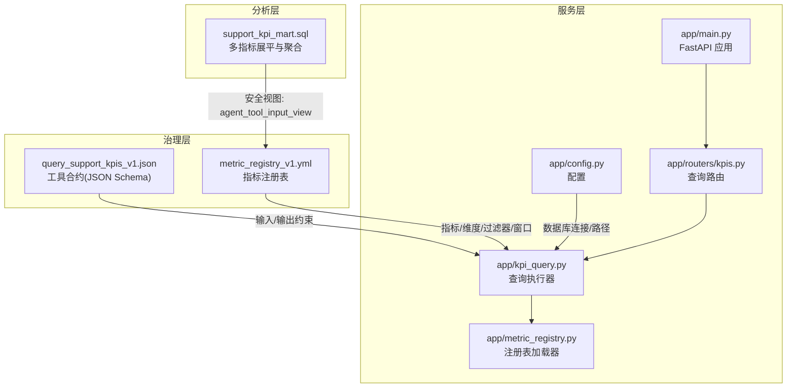
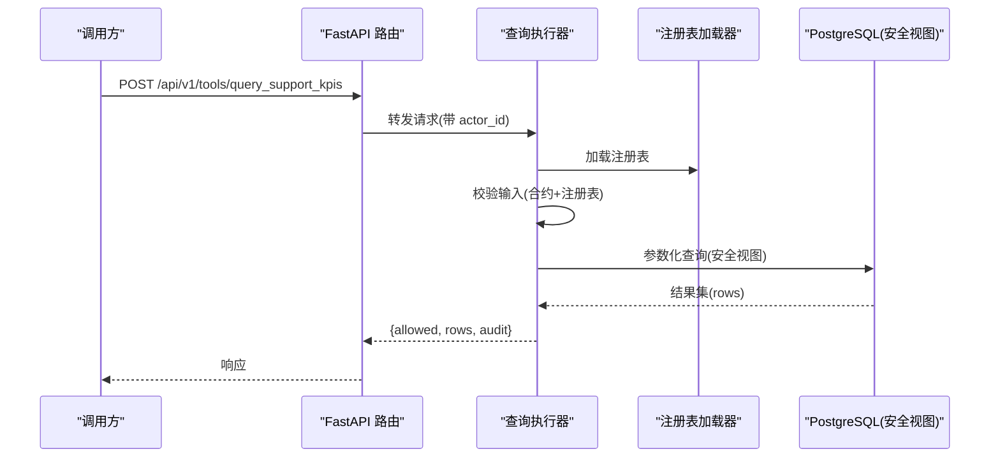
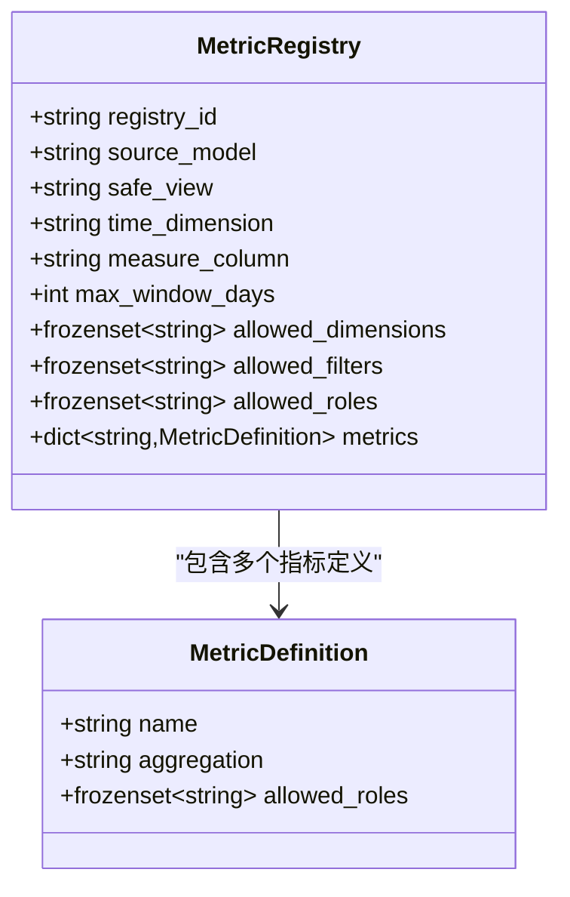
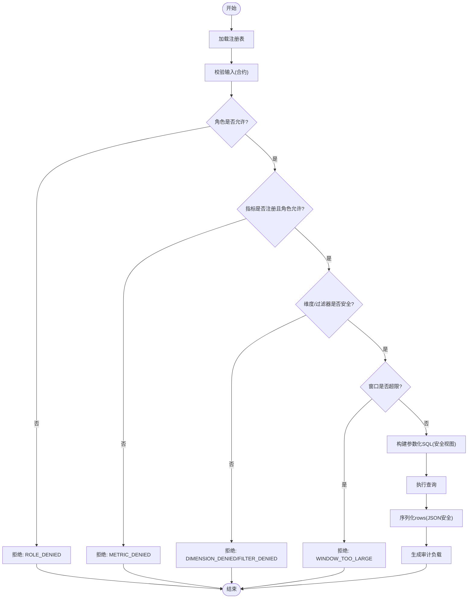
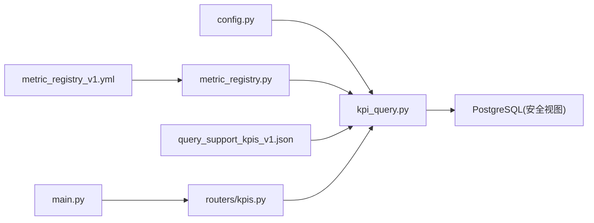

# KPI 查询系统

<cite>
**本文引用的文件**
- [analytics/metric_registry_v1.yml](file://analytics/metric_registry_v1.yml)
- [contracts/tools/tools/query_support_kpis_v1.json](file://contracts/tools/tools/query_support_kpis_v1.json)
- [services/tool_api/app/kpi_query.py](file://services/tool_api/app/kpi_query.py)
- [services/tool_api/app/metric_registry.py](file://services/tool_api/app/metric_registry.py)
- [services/tool_api/app/routers/kpis.py](file://services/tool_api/app/routers/kpis.py)
- [services/tool_api/app/main.py](file://services/tool_api/app/main.py)
- [services/tool_api/app/config.py](file://services/tool_api/app/config.py)
- [analytics/models/marts/support_kpi_mart.sql](file://analytics/models/marts/support_kpi_mart.sql)
- [analytics/scripts/validate_metric_registry.py](file://analytics/scripts/validate_metric_registry.py)
- [tests/integration/test_week05_kpi_query_tool.py](file://tests/integration/test_week05_kpi_query_tool.py)
- [tests/integration/test_week05_metric_registry.py](file://tests/integration/test_week05_metric_registry.py)
- [docs/blueprints/week05/metric_registry_contract_v1.md](file://docs/blueprints/week05/metric_registry_contract_v1.md)
</cite>

## 目录
1. [简介](#简介)
2. [项目结构](#项目结构)
3. [核心组件](#核心组件)
4. [架构总览](#架构总览)
5. [详细组件分析](#详细组件分析)
6. [依赖分析](#依赖分析)
7. [性能考虑](#性能考虑)
8. [故障排查指南](#故障排查指南)
9. [结论](#结论)
10. [附录](#附录)

## 简介
本文件系统化梳理了 KPI 查询系统的设计与实现，覆盖指标注册表结构、指标定义与版本管理、查询接口设计原理、数据来源与计算逻辑、缓存策略与性能优化、聚合函数与时间/维度处理、实时性与历史查询能力，以及完整的指标查询 API 规范（参数、约束与响应格式）。该系统通过“受控注册表 + 合约约束 + 参数化查询”的方式，确保安全、可审计、可扩展的 KPI 查询能力。

## 项目结构
系统围绕“分析层（dbt Mart）—注册表（YAML）—工具合约（JSON Schema）—查询服务（FastAPI + 异步查询）”展开，形成清晰的分层与职责边界：

- 分析层：dbt 支持 KPI Mart 将原始活动按天汇总并展平为多行指标记录，统一输出到安全视图供工具查询。
- 注册表：以 YAML 描述允许的指标、维度、过滤器、时间维度、度量列、最大窗口等元数据，作为查询的权威契约。
- 工具合约：以 JSON Schema 定义输入/输出模式、失败码、速率限制、审计字段等，保障调用端与服务端一致性。
- 查询服务：FastAPI 提供受控查询端点，加载注册表与合约，校验请求后构建参数化 SQL，访问安全视图并返回结果。

图表来源
- [analytics/models/marts/support_kpi_mart.sql:1-150](file://analytics/models/marts/support_kpi_mart.sql#L1-L150)
- [analytics/metric_registry_v1.yml:1-56](file://analytics/metric_registry_v1.yml#L1-L56)
- [contracts/tools/tools/query_support_kpis_v1.json:1-135](file://contracts/tools/tools/query_support_kpis_v1.json#L1-L135)
- [services/tool_api/app/main.py:1-64](file://services/tool_api/app/main.py#L1-L64)
- [services/tool_api/app/routers/kpis.py:1-18](file://services/tool_api/app/routers/kpis.py#L1-L18)
- [services/tool_api/app/kpi_query.py:1-271](file://services/tool_api/app/kpi_query.py#L1-L271)
- [services/tool_api/app/metric_registry.py:1-82](file://services/tool_api/app/metric_registry.py#L1-L82)
- [services/tool_api/app/config.py:1-19](file://services/tool_api/app/config.py#L1-L19)

章节来源
- [services/tool_api/app/main.py:1-64](file://services/tool_api/app/main.py#L1-L64)
- [services/tool_api/app/routers/kpis.py:1-18](file://services/tool_api/app/routers/kpis.py#L1-L18)
- [services/tool_api/app/kpi_query.py:1-271](file://services/tool_api/app/kpi_query.py#L1-L271)
- [services/tool_api/app/metric_registry.py:1-82](file://services/tool_api/app/metric_registry.py#L1-L82)
- [services/tool_api/app/config.py:1-19](file://services/tool_api/app/config.py#L1-L19)
- [analytics/metric_registry_v1.yml:1-56](file://analytics/metric_registry_v1.yml#L1-L56)
- [contracts/tools/tools/query_support_kpis_v1.json:1-135](file://contracts/tools/tools/query_support_kpis_v1.json#L1-L135)
- [analytics/models/marts/support_kpi_mart.sql:1-150](file://analytics/models/marts/support_kpi_mart.sql#L1-L150)
- [analytics/scripts/validate_metric_registry.py:1-130](file://analytics/scripts/validate_metric_registry.py#L1-L130)
- [docs/blueprints/week05/metric_registry_contract_v1.md:1-39](file://docs/blueprints/week05/metric_registry_contract_v1.md#L1-L39)

## 核心组件
- 指标注册表（YAML）
  - 定义 registry_id、source_model、safe_view、time_dimension、measure_column、max_window_days、allowed_dimensions、allowed_filters、allowed_roles、metrics 列表等。
  - metrics 中每项包含 name、label、description、aggregation、allowed_roles，用于约束可用指标与角色权限。
- 工具合约（JSON Schema）
  - 输入 schema 约束 actor_role、metrics、date_from/date_to、dimensions、filters、limit 等字段类型、数量与格式。
  - 输出 schema 返回 allowed、rows、denial_code/message、audit 等字段，并定义 failure_codes。
  - rate_limit、idempotent、idempotency_key_fields、audit_fields 等运行时属性。
- 查询执行器（kpi_query）
  - 加载合约与注册表，进行请求校验（角色、指标、维度、过滤器、日期窗口）。
  - 构建参数化 SQL，限定输出列在安全集合内，使用安全视图进行查询。
  - 返回标准化结果并生成审计负载。
- 注册表加载器（metric_registry）
  - 将 YAML 解析为不可变数据类，提供只读视图与序列化辅助。
- 路由与应用（FastAPI）
  - 提供 /api/v1/tools/query_support_kpis 端点，注入 actor_id 并转发到查询执行器。
  - 全局中间件与异常处理，统一响应格式与审计字段。

章节来源
- [analytics/metric_registry_v1.yml:1-56](file://analytics/metric_registry_v1.yml#L1-L56)
- [contracts/tools/tools/query_support_kpis_v1.json:1-135](file://contracts/tools/tools/query_support_kpis_v1.json#L1-L135)
- [services/tool_api/app/kpi_query.py:1-271](file://services/tool_api/app/kpi_query.py#L1-L271)
- [services/tool_api/app/metric_registry.py:1-82](file://services/tool_api/app/metric_registry.py#L1-L82)
- [services/tool_api/app/routers/kpis.py:1-18](file://services/tool_api/app/routers/kpis.py#L1-L18)
- [services/tool_api/app/main.py:1-64](file://services/tool_api/app/main.py#L1-L64)

## 架构总览
系统采用“受控查询”架构：工具端仅能通过注册表与合约允许的指标、维度、过滤器与时间窗口发起查询；服务端拒绝任何非注册内容，强制使用参数化 SQL 访问安全视图，确保 SQL 注入防护、审计与合规。

图表来源
- [services/tool_api/app/routers/kpis.py:14-17](file://services/tool_api/app/routers/kpis.py#L14-L17)
- [services/tool_api/app/kpi_query.py:200-228](file://services/tool_api/app/kpi_query.py#L200-L228)
- [services/tool_api/app/metric_registry.py:35-66](file://services/tool_api/app/metric_registry.py#L35-L66)
- [analytics/metric_registry_v1.yml:1-56](file://analytics/metric_registry_v1.yml#L1-L56)

## 详细组件分析

### 指标注册表与版本管理
- 结构要点
  - registry_id、source_model、safe_view、time_dimension、measure_column、max_window_days、allowed_dimensions、allowed_filters、allowed_roles、metrics。
  - metrics 项包含 name/aggregation/allowed_roles，支持 sum、avg、min、max 聚合。
- 版本与演进
  - 通过 registry_id 与文件名（如 metric_registry_v1.yml）标识版本；变更需同步更新合约与安全视图字段集合。
  - 提供校验脚本，确保 allowed_* 与安全视图字段一致，且指标聚合类型合法。
- 数据模型与关系

图表来源
- [services/tool_api/app/metric_registry.py:14-33](file://services/tool_api/app/metric_registry.py#L14-L33)

章节来源
- [analytics/metric_registry_v1.yml:1-56](file://analytics/metric_registry_v1.yml#L1-L56)
- [services/tool_api/app/metric_registry.py:35-66](file://services/tool_api/app/metric_registry.py#L35-L66)
- [analytics/scripts/validate_metric_registry.py:37-108](file://analytics/scripts/validate_metric_registry.py#L37-L108)
- [docs/blueprints/week05/metric_registry_contract_v1.md:1-39](file://docs/blueprints/week05/metric_registry_contract_v1.md#L1-L39)

### 查询接口设计与数据来源
- 数据来源
  - 指标来自 dbt 支持 KPI Mart，经多指标展平与聚合，统一输出到安全视图（agent_tool_input_view），包含 metric_date、metric_name、维度、度量值、data_release_id、generated_at 等。
- 查询流程
  - 加载注册表与合约 → 校验角色与指标 → 校验维度/过滤器 → 校验时间窗口 → 构建参数化 SQL → 执行查询 → 序列化结果 → 审计落盘。
- 关键约束
  - 仅允许在 allowed_dimensions/allowed_filters 中选择维度与过滤器。
  - 仅允许在注册表中声明的指标名称与聚合类型。
  - 最大查询窗口受 max_window_days 限制。
  - 输出列必须在安全列集合内，防止泄露未授权字段。

图表来源
- [services/tool_api/app/kpi_query.py:106-166](file://services/tool_api/app/kpi_query.py#L106-L166)
- [services/tool_api/app/kpi_query.py:169-197](file://services/tool_api/app/kpi_query.py#L169-L197)
- [services/tool_api/app/kpi_query.py:200-228](file://services/tool_api/app/kpi_query.py#L200-L228)
- [analytics/metric_registry_v1.yml:1-56](file://analytics/metric_registry_v1.yml#L1-L56)

章节来源
- [services/tool_api/app/kpi_query.py:106-166](file://services/tool_api/app/kpi_query.py#L106-L166)
- [services/tool_api/app/kpi_query.py:169-197](file://services/tool_api/app/kpi_query.py#L169-L197)
- [services/tool_api/app/kpi_query.py:200-228](file://services/tool_api/app/kpi_query.py#L200-L228)
- [analytics/models/marts/support_kpi_mart.sql:1-150](file://analytics/models/marts/support_kpi_mart.sql#L1-L150)

### 指标聚合函数、时间范围与维度分组
- 聚合函数
  - 支持 sum、avg、min、max；注册表中每个指标声明其聚合类型，查询端严格校验。
- 时间范围过滤
  - 使用 time_dimension（metric_date）进行 between 过滤；date_from ≤ date_to，且不超过 max_window_days。
- 维度分组
  - dimensions 从 allowed_dimensions 中选择；查询按维度与 metric_date 排序，最终 limit 控制行数。
- 过滤器
  - filters 键必须在 allowed_filters 内；值支持字符串/数字或最多 50 个元素的数组，内部统一转为文本匹配。

章节来源
- [analytics/metric_registry_v1.yml:25-56](file://analytics/metric_registry_v1.yml#L25-L56)
- [services/tool_api/app/kpi_query.py:169-197](file://services/tool_api/app/kpi_query.py#L169-L197)

### 实时性、历史查询与趋势分析
- 实时性
  - 通过 generated_at 字段标识数据生成时间，结合 data_release_id 与 release_id 支持版本追踪与回溯。
- 历史查询
  - 通过 date_from/date_to 限定时间窗口，配合 max_window_days 防止过大扫描。
- 趋势分析
  - 以 metric_date 为横轴，按维度分组展示 metric_value 的时间序列；客户端可基于 rows 进行二次聚合与可视化。

章节来源
- [analytics/models/marts/support_kpi_mart.sql:147-149](file://analytics/models/marts/support_kpi_mart.sql#L147-L149)
- [services/tool_api/app/kpi_query.py:154-164](file://services/tool_api/app/kpi_query.py#L154-L164)

### 缓存策略与性能优化
- 查询缓存
  - 当前实现未内置应用层缓存；建议在网关或服务前层引入基于 idempotency_key_fields 的缓存（见合约 idempotent 与 idempotency_key_fields）。
- 数据库优化
  - 使用参数化查询与安全视图，避免全表扫描；合理设置索引（如按时间维度与指标名建立复合索引）。
- 传输与序列化
  - 对日期/Decimal 进行 JSON 安全转换，减少序列化开销。
- 并发与连接
  - 使用异步 PostgreSQL 连接池（asyncpg），结合限流与超时控制，提升吞吐与稳定性。

章节来源
- [contracts/tools/tools/query_support_kpis_v1.json:107-134](file://contracts/tools/tools/query_support_kpis_v1.json#L107-L134)
- [services/tool_api/app/kpi_query.py:211-219](file://services/tool_api/app/kpi_query.py#L211-L219)
- [services/tool_api/app/config.py:7-11](file://services/tool_api/app/config.py#L7-L11)

### 指标查询 API 规范
- 端点
  - POST /api/v1/tools/query_support_kpis
- 请求体（输入）
  - actor_role: 必填，字符串，必须在 allowed_roles 内
  - actor_id: 可选，字符串，用于审计
  - metrics: 必填，数组，至少 1 个，至多 6 个，正则 ^[a-z][a-z0-9_]*$
  - date_from: 必填，日期格式 YYYY-MM-DD
  - date_to: 必填，日期格式 YYYY-MM-DD，≥ date_from
  - dimensions: 可选，数组，最多 4 个，元素来自 allowed_dimensions
  - filters: 可选，对象，键来自 allowed_filters，值为字符串/数字或长度≤50 的数组
  - limit: 可选，整数 1..500，默认 100
- 成功响应（输出）
  - allowed: true
  - rows: 数组，每项包含 metric_date、metric_name、维度、metric_value、data_release_id 等
  - audit: 包含 tool_name、registry_id、actor_role、actor_id、metrics、dimensions、filters、date_from、date_to、row_count、release_id
- 失败响应
  - allowed: false
  - denial_code: 失败码（如 SCHEMA_VALIDATION_FAILED、ROLE_DENIED、METRIC_DENIED、DIMENSION_DENIED、FILTER_DENIED、WINDOW_TOO_LARGE、DB_UNAVAILABLE）
  - message: 人类可读错误信息
  - audit: 同上（含请求摘要）
- 失败码
  - SCHEMA_VALIDATION_FAILED：输入不符合合约
  - ROLE_DENIED：调用者角色不在 registry 允许列表
  - METRIC_DENIED：指标未注册或角色不允许
  - DIMENSION_DENIED：维度不在 allowed_dimensions
  - FILTER_DENIED：过滤器不在 allowed_filters
  - WINDOW_TOO_LARGE：时间窗口超过 max_window_days
  - DB_UNAVAILABLE：数据库不可用或查询失败
- 幂等性与审计
  - idempotent: true
  - idempotency_key_fields: ["actor_role","metrics","date_from","date_to","dimensions","filters"]
  - audit_fields: 记录输入/输出、调用者、保留 365 天
- 速率限制
  - 每分钟 ≤ 60，每小时 ≤ 1000

章节来源
- [contracts/tools/tools/query_support_kpis_v1.json:5-135](file://contracts/tools/tools/query_support_kpis_v1.json#L5-L135)
- [services/tool_api/app/routers/kpis.py:14-17](file://services/tool_api/app/routers/kpis.py#L14-L17)
- [services/tool_api/app/kpi_query.py:71-103](file://services/tool_api/app/kpi_query.py#L71-L103)
- [services/tool_api/app/kpi_query.py:222-228](file://services/tool_api/app/kpi_query.py#L222-L228)

## 依赖分析
- 组件耦合
  - kpi_query 依赖 metric_registry（注册表）、config（数据库连接）、asyncpg（异步数据库访问）、jsonschema（输入校验）。
  - routers/kpis 仅负责路由与参数透传，低耦合。
  - main.py 负责应用生命周期与中间件，不直接参与业务逻辑。
- 外部依赖
  - PostgreSQL（安全视图）、dbt（Mart 与视图生成）、FastAPI（HTTP 服务）、Pydantic Settings（配置管理）。
- 潜在循环依赖
  - 未发现循环导入；模块职责清晰，分层明确。

图表来源
- [services/tool_api/app/config.py:1-19](file://services/tool_api/app/config.py#L1-L19)
- [services/tool_api/app/kpi_query.py:21-22](file://services/tool_api/app/kpi_query.py#L21-L22)
- [services/tool_api/app/metric_registry.py:11-11](file://services/tool_api/app/metric_registry.py#L11-L11)
- [services/tool_api/app/routers/kpis.py:9-9](file://services/tool_api/app/routers/kpis.py#L9-L9)
- [services/tool_api/app/main.py:16-16](file://services/tool_api/app/main.py#L16-L16)

章节来源
- [services/tool_api/app/config.py:1-19](file://services/tool_api/app/config.py#L1-L19)
- [services/tool_api/app/kpi_query.py:21-22](file://services/tool_api/app/kpi_query.py#L21-L22)
- [services/tool_api/app/metric_registry.py:11-11](file://services/tool_api/app/metric_registry.py#L11-L11)
- [services/tool_api/app/routers/kpis.py:9-9](file://services/tool_api/app/routers/kpis.py#L9-L9)
- [services/tool_api/app/main.py:16-16](file://services/tool_api/app/main.py#L16-L16)

## 性能考虑
- 查询性能
  - 使用参数化查询与安全视图，避免动态拼接 SQL；建议在安全视图上建立按 metric_date、metric_name、维度的索引。
- 传输与序列化
  - 对日期/Decimal 进行安全转换，减少序列化异常与体积。
- 并发与资源
  - asyncpg 异步连接池与合理的连接复用；结合速率限制与超时，避免过载。
- 缓存与幂等
  - 利用 idempotency_key_fields 在网关层缓存重复请求，降低数据库压力。
- 监控与可观测性
  - 通过 audit_fields 记录调用摘要与耗时，结合 OTEL 配置进行链路追踪与指标采集。

## 故障排查指南
- 常见错误与定位
  - SCHEMA_VALIDATION_FAILED：检查输入字段类型、格式与必填项。
  - ROLE_DENIED：确认 actor_role 是否在 registry.allowed_roles。
  - METRIC_DENIED：确认指标名称是否在 registry.metrics 且角色被允许。
  - DIMENSION_DENIED/FILTER_DENIED：确认维度/过滤器是否在 allowed_* 列表。
  - WINDOW_TOO_LARGE：缩短 date_from/date_to 或调整 registry.max_window_days。
  - DB_UNAVAILABLE：检查数据库连通性、安全视图是否存在、查询语法与参数绑定。
- 审计与回溯
  - 通过 audit 字段中的 registry_id、release_id、actor_id、metrics、dimensions、filters、date_from、date_to、row_count 进行问题定位与复现。
- 自动化校验
  - 使用 validate_metric_registry.py 校验注册表字段完整性与一致性，确保与安全视图字段匹配。

章节来源
- [services/tool_api/app/kpi_query.py:91-166](file://services/tool_api/app/kpi_query.py#L91-L166)
- [analytics/scripts/validate_metric_registry.py:37-108](file://analytics/scripts/validate_metric_registry.py#L37-L108)
- [tests/integration/test_week05_kpi_query_tool.py:33-108](file://tests/integration/test_week05_kpi_query_tool.py#L33-L108)
- [tests/integration/test_week05_metric_registry.py:8-15](file://tests/integration/test_week05_metric_registry.py#L8-L15)

## 结论
本 KPI 查询系统通过“注册表 + 合约 + 安全视图 + 参数化查询”的组合，实现了安全、可控、可观测的指标查询能力。系统具备完善的权限与字段白名单、严格的输入校验、可审计的查询行为与清晰的 API 规范。建议在现有基础上引入网关层缓存与索引优化，进一步提升性能与稳定性。

## 附录
- 安全列集合（来自安全视图）
  - metric_date、metric_name、product_line、priority、org_id、category、metric_value、data_release_id、generated_at
- 关键实现参考路径
  - 注册表加载与校验：[services/tool_api/app/metric_registry.py:35-66](file://services/tool_api/app/metric_registry.py#L35-L66)
  - 查询执行与参数化 SQL：[services/tool_api/app/kpi_query.py:169-197](file://services/tool_api/app/kpi_query.py#L169-L197)
  - 输入校验与拒绝码：[services/tool_api/app/kpi_query.py:106-166](file://services/tool_api/app/kpi_query.py#L106-L166)
  - 合约定义与失败码：[contracts/tools/tools/query_support_kpis_v1.json:115-123](file://contracts/tools/tools/query_support_kpis_v1.json#L115-L123)
  - 安全视图字段与生成逻辑：[analytics/models/marts/support_kpi_mart.sql:1-150](file://analytics/models/marts/support_kpi_mart.sql#L1-L150)
  - 注册表校验脚本：[analytics/scripts/validate_metric_registry.py:37-108](file://analytics/scripts/validate_metric_registry.py#L37-L108)