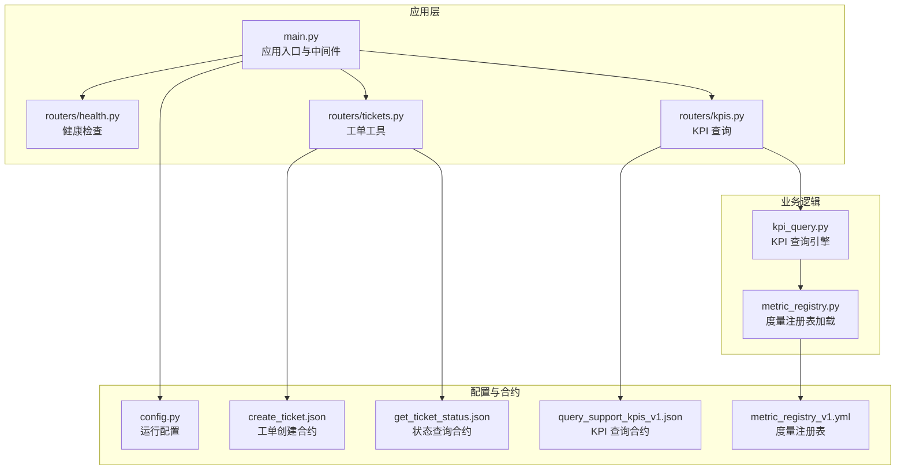
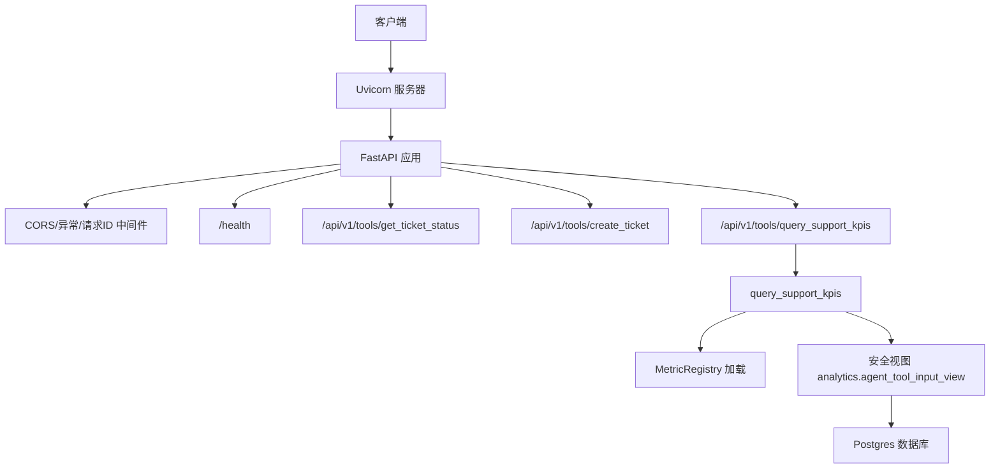
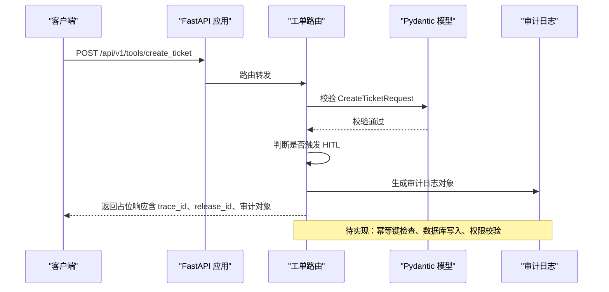
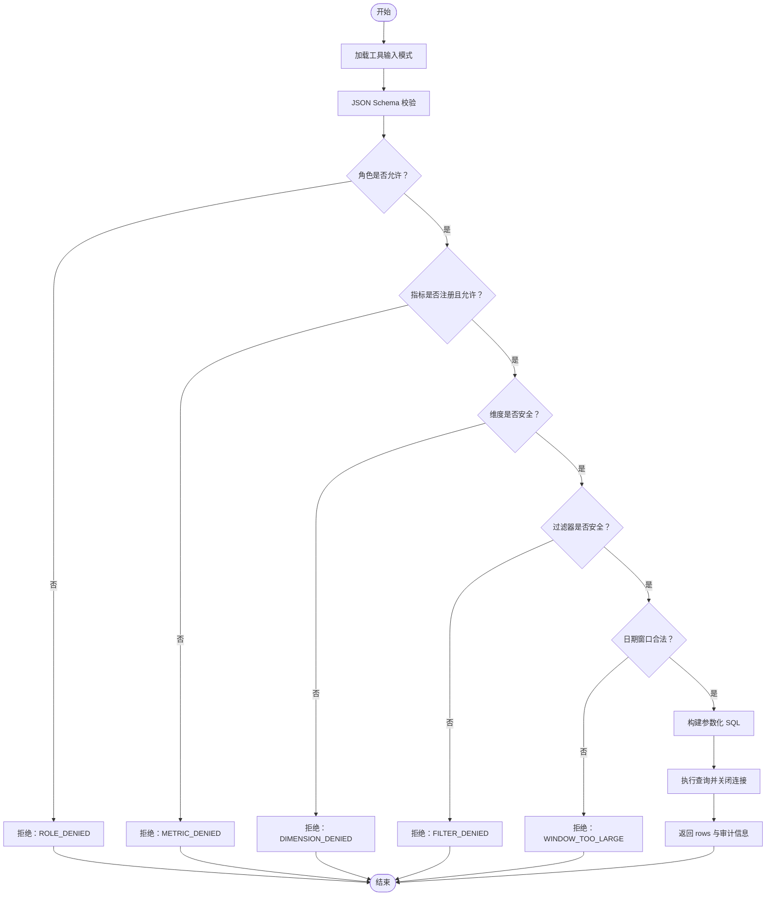
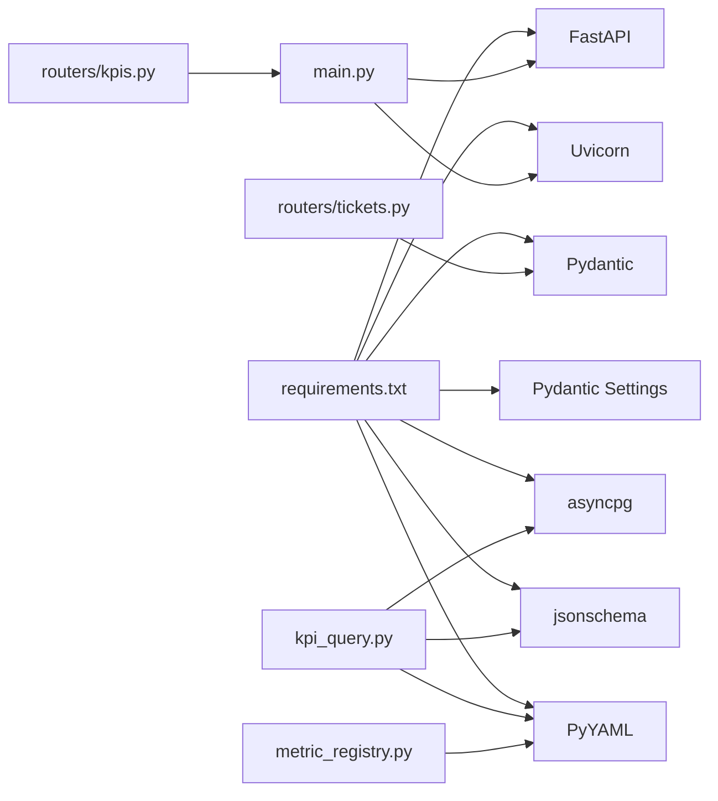

# Tool API 服务

<cite>
**本文引用的文件**
- [main.py](file://services/tool_api/app/main.py)
- [tickets.py](file://services/tool_api/app/routers/tickets.py)
- [kpis.py](file://services/tool_api/app/routers/kpis.py)
- [health.py](file://services/tool_api/app/routers/health.py)
- [kpi_query.py](file://services/tool_api/app/kpi_query.py)
- [config.py](file://services/tool_api/app/config.py)
- [metric_registry.py](file://services/tool_api/app/metric_registry.py)
- [create_ticket.json](file://contracts/tools/tools/create_ticket.json)
- [get_ticket_status.json](file://contracts/tools/tools/get_ticket_status.json)
- [query_support_kpis_v1.json](file://contracts/tools/tools/query_support_kpis_v1.json)
- [metric_registry_v1.yml](file://analytics/metric_registry_v1.yml)
- [Dockerfile](file://services/tool_api/Dockerfile)
- [requirements.txt](file://services/tool_api/requirements.txt)
- [test_week05_kpi_query_tool.py](file://tests/integration/test_week05_kpi_query_tool.py)
</cite>

## 目录
1. [简介](#简介)
2. [项目结构](#项目结构)
3. [核心组件](#核心组件)
4. [架构总览](#架构总览)
5. [详细组件分析](#详细组件分析)
6. [依赖分析](#依赖分析)
7. [性能考虑](#性能考虑)
8. [故障排查指南](#故障排查指南)
9. [结论](#结论)
10. [附录](#附录)

## 简介
本文件为 Tool API 服务的综合技术文档，聚焦于工单管理工具链与支持 KPI 查询能力。内容涵盖：
- 工单创建与状态查询的路由组织、数据模型与调用机制
- KPI 查询接口的设计原则、参数验证、指标计算与安全访问控制
- 健康检查端点、配置管理与安全认证方案
- 错误处理策略、审计日志与请求追踪
- 工具调用示例、集成指南与最佳实践

## 项目结构
Tool API 服务采用 FastAPI 构建，核心目录与文件如下：
- 应用入口与中间件：app/main.py
- 路由模块：app/routers/{health,tickets,kpis}.py
- 核心业务逻辑：app/kpi_query.py、app/metric_registry.py
- 配置：app/config.py
- 合约与度量注册表：contracts/tools/tools/*.json、analytics/metric_registry_v1.yml
- 容器化与依赖：Dockerfile、requirements.txt
- 测试：tests/integration/test_week05_kpi_query_tool.py

图表来源
- [main.py:1-64](file://services/tool_api/app/main.py#L1-L64)
- [health.py:1-15](file://services/tool_api/app/routers/health.py#L1-L15)
- [tickets.py:1-134](file://services/tool_api/app/routers/tickets.py#L1-L134)
- [kpis.py:1-18](file://services/tool_api/app/routers/kpis.py#L1-L18)
- [kpi_query.py:1-271](file://services/tool_api/app/kpi_query.py#L1-L271)
- [metric_registry.py:1-82](file://services/tool_api/app/metric_registry.py#L1-L82)
- [config.py:1-19](file://services/tool_api/app/config.py#L1-L19)
- [create_ticket.json:1-95](file://contracts/tools/tools/create_ticket.json#L1-L95)
- [get_ticket_status.json:1-67](file://contracts/tools/tools/get_ticket_status.json#L1-L67)
- [query_support_kpis_v1.json:1-135](file://contracts/tools/tools/query_support_kpis_v1.json#L1-L135)
- [metric_registry_v1.yml:1-56](file://analytics/metric_registry_v1.yml#L1-L56)

章节来源
- [main.py:1-64](file://services/tool_api/app/main.py#L1-L64)
- [requirements.txt:1-14](file://services/tool_api/requirements.txt#L1-L14)

## 核心组件
- 应用入口与中间件
  - 使用 lifespan 生命周期钩子，全局 CORS 中间件允许跨域请求，HTTP 中间件注入 X-Request-ID 并在响应头透出，统一异常处理器返回标准化错误体。
  - 路由挂载：/api/v1/tools 下包含工单与 KPI 查询端点；/health 健康检查。

- 工单工具
  - 数据模型：GetTicketRequest、CreateTicketRequest、AuditLog，使用 Pydantic 进行字段约束与类型校验。
  - 端点：
    - /api/v1/tools/get_ticket_status：查询工单状态（占位返回），后续接入权限校验与数据库查询。
    - /api/v1/tools/create_ticket：创建工单（占位返回），包含幂等键检查框架、HITL 触发判断与审计日志生成。

- KPI 查询
  - 端点：/api/v1/tools/query_support_kpis，接收字典负载，自动注入 X-Actor-ID，调用 query_support_kpis 异步查询。
  - 查询引擎：基于度量注册表进行严格白名单校验，构建参数化 SQL，访问 dbt 安全视图，返回受控结果集。

- 健康检查
  - /health 返回服务状态、版本与发布标识。

章节来源
- [main.py:19-64](file://services/tool_api/app/main.py#L19-L64)
- [tickets.py:19-134](file://services/tool_api/app/routers/tickets.py#L19-L134)
- [kpis.py:14-18](file://services/tool_api/app/routers/kpis.py#L14-L18)
- [health.py:7-14](file://services/tool_api/app/routers/health.py#L7-L14)

## 架构总览
Tool API 服务采用“路由-业务-安全-数据”分层架构：
- 路由层：FastAPI 路由器组织端点，统一中间件与异常处理。
- 业务层：工单工具与 KPI 查询各自封装数据模型与调用流程。
- 安全层：KPI 查询通过度量注册表与合约进行角色、指标、维度、过滤器与时间窗口的白名单校验。
- 数据层：KPI 查询通过 asyncpg 访问 Postgres，读取 dbt 安全视图；工单工具预留数据库写入与审计日志落库。

图表来源
- [main.py:24-64](file://services/tool_api/app/main.py#L24-L64)
- [kpis.py:14-18](file://services/tool_api/app/routers/kpis.py#L14-L18)
- [kpi_query.py:200-228](file://services/tool_api/app/kpi_query.py#L200-L228)
- [metric_registry.py:35-66](file://services/tool_api/app/metric_registry.py#L35-L66)
- [metric_registry_v1.yml:6](file://analytics/metric_registry_v1.yml#L6)

## 详细组件分析

### 工单工具链（创建与查询）
- 设计原则
  - 参数验证：使用 Pydantic 模型对输入进行强类型与格式校验。
  - 幂等性：支持 idempotency_key 字段，预留数据库去重逻辑。
  - HITL（人工介入）：基于优先级与类别的条件触发，预留 Webhook 调用。
  - 审计日志：记录请求 ID、调用者、参数哈希、结果码与是否触发 HITL。

- 数据模型与路由
  - GetTicketRequest：校验工单 ID 格式与可选评论包含标志。
  - CreateTicketRequest：校验主题、描述长度、优先级枚举、产品线与类别枚举，并支持可选字段。
  - AuditLog：标准化审计字段，便于后续落库与审计。

- 处理流程
  - 查询流程：参数校验 → 权限校验（待实现）→ 数据库查询（待实现）→ 返回占位响应（含 trace_id 与 release_id）。
  - 创建流程：参数校验 → HITL 触发判断 → 幂等键检查（待实现）→ 生成工单 ID → 审计日志对象 → 返回占位响应（含 trace_id、release_id 与审计对象）。

图表来源
- [tickets.py:81-124](file://services/tool_api/app/routers/tickets.py#L81-L124)
- [tickets.py:127-134](file://services/tool_api/app/routers/tickets.py#L127-L134)

章节来源
- [tickets.py:19-134](file://services/tool_api/app/routers/tickets.py#L19-L134)
- [create_ticket.json:1-95](file://contracts/tools/tools/create_ticket.json#L1-L95)
- [get_ticket_status.json:1-67](file://contracts/tools/tools/get_ticket_status.json#L1-L67)

### KPI 查询接口
- 设计原则
  - 合约驱动：严格依据工具合约与度量注册表进行白名单校验。
  - 安全访问：禁止原始 SQL，仅访问 dbt 构建的安全视图。
  - 参数化查询：所有输入均以参数绑定方式拼接 SQL，避免注入风险。
  - 受控输出：仅返回注册表中允许的列与维度。

- 输入校验与拒绝策略
  - JSON Schema 校验：不符合工具输入模式直接拒绝。
  - 角色校验：调用者角色必须在注册表允许范围内。
  - 指标校验：请求指标必须在注册表中且对调用者开放。
  - 维度与过滤器校验：仅允许注册表中列出的维度与过滤器。
  - 时间窗口校验：date_from ≤ date_to，且不超过最大窗口天数。

- 查询构建与执行
  - 输出列：固定列 + 请求维度，严格限制在 SAFE_COLUMNS 集合内。
  - WHERE 条件：指标集合、日期范围、以及按注册表允许的过滤器动态拼接。
  - ORDER/LIMIT：按输出列排序并限制行数。
  - 连接与关闭：异步连接 Postgres，捕获异常并返回统一拒绝体。

图表来源
- [kpi_query.py:106-166](file://services/tool_api/app/kpi_query.py#L106-L166)
- [kpi_query.py:169-197](file://services/tool_api/app/kpi_query.py#L169-L197)
- [kpi_query.py:200-228](file://services/tool_api/app/kpi_query.py#L200-L228)
- [metric_registry_v1.yml:10-24](file://analytics/metric_registry_v1.yml#L10-L24)

章节来源
- [kpis.py:14-18](file://services/tool_api/app/routers/kpis.py#L14-L18)
- [kpi_query.py:1-271](file://services/tool_api/app/kpi_query.py#L1-271)
- [metric_registry.py:1-82](file://services/tool_api/app/metric_registry.py#L1-L82)
- [query_support_kpis_v1.json:1-135](file://contracts/tools/tools/query_support_kpis_v1.json#L1-L135)
- [metric_registry_v1.yml:1-56](file://analytics/metric_registry_v1.yml#L1-L56)

### 健康检查与配置管理
- 健康检查
  - GET /health 返回服务状态、名称、版本与发布标识，便于容器编排与探针使用。

- 配置管理
  - 使用 pydantic-settings 从 .env 文件加载配置，关键项包括：
    - 数据库连接串（Postgres）
    - OpenTelemetry 服务名与导出端点
    - 发布标识 release_id
    - 度量注册表路径
    - HITL Webhook 配置（预留）

- 安全认证
  - 当前未实现鉴权中间件；建议在生产环境引入 JWT 或会话认证，并在工单查询端点增加权限校验（如仅允许本人工单）。

章节来源
- [health.py:7-14](file://services/tool_api/app/routers/health.py#L7-L14)
- [config.py:4-16](file://services/tool_api/app/config.py#L4-L16)

### 错误处理与审计
- 全局异常处理
  - 统一捕获未处理异常，返回包含错误码、消息、请求 ID 与发布标识的 JSON 响应，便于前端与监控定位问题。

- KPI 查询拒绝码
  - SCHEMA_VALIDATION_FAILED、ROLE_DENIED、METRIC_DENIED、DIMENSION_DENIED、FILTER_DENIED、WINDOW_TOO_LARGE、DB_UNAVAILABLE 等，确保调用方明确失败原因。

- 审计日志
  - 工单创建：生成包含请求 ID、调用者、工具名、参数哈希、结果码、是否触发 HITL 的审计对象。
  - KPI 查询：记录工具名、注册表 ID、调用者角色/ID、指标、维度、过滤器、日期范围、行数与发布标识。

章节来源
- [main.py:48-58](file://services/tool_api/app/main.py#L48-L58)
- [kpi_query.py:91-103](file://services/tool_api/app/kpi_query.py#L91-L103)
- [kpi_query.py:71-88](file://services/tool_api/app/kpi_query.py#L71-L88)
- [tickets.py:104-112](file://services/tool_api/app/routers/tickets.py#L104-L112)

## 依赖分析
- 运行时依赖
  - FastAPI、Uvicorn、Pydantic、Pydantic Settings、asyncpg、jsonschema、PyYAML 等。
- 内部依赖
  - 路由器依赖配置与查询模块；KPI 查询依赖度量注册表与合约；工单工具依赖 Pydantic 模型与审计日志结构。

图表来源
- [requirements.txt:1-14](file://services/tool_api/requirements.txt#L1-L14)
- [main.py:11-16](file://services/tool_api/app/main.py#L11-L16)
- [tickets.py:11-14](file://services/tool_api/app/routers/tickets.py#L11-L14)
- [kpis.py:7-9](file://services/tool_api/app/routers/kpis.py#L7-L9)
- [kpi_query.py:18-22](file://services/tool_api/app/kpi_query.py#L18-L22)
- [metric_registry.py:9-11](file://services/tool_api/app/metric_registry.py#L9-L11)

章节来源
- [requirements.txt:1-14](file://services/tool_api/requirements.txt#L1-L14)

## 性能考虑
- 查询性能
  - KPI 查询通过参数化 SQL 与 LIMIT 控制输出规模，建议在安全视图上建立合适索引以优化日期与维度过滤。
- 连接管理
  - 使用 asyncpg 异步连接，查询完成后及时关闭，避免连接泄漏。
- 缓存策略
  - 当前未实现缓存；建议对高频、低频变更的指标结果进行短期缓存（如 Redis），并结合 ETag/Last-Modified 实现条件请求。
- 并发与限流
  - KPI 工具合约定义了每分钟/每小时调用上限，建议在网关或中间件层实施速率限制，避免突发流量冲击数据库。

## 故障排查指南
- 常见错误与定位
  - SCHEMA_VALIDATION_FAILED：检查请求负载是否符合工具合约输入模式。
  - ROLE_DENIED：确认调用者角色是否在度量注册表 allowed_roles 中。
  - METRIC_DENIED：确认指标名称是否在注册表中且对调用者开放。
  - DIMENSION_DENIED/FILTER_DENIED：确认维度与过滤器是否在注册表 allowed_dimensions/allowed_filters 中。
  - WINDOW_TOO_LARGE：缩短日期窗口或调整注册表 max_window_days。
  - DB_UNAVAILABLE：检查数据库连通性与安全视图可用性。
- 审计与追踪
  - 关注响应中的 trace_id 与 release_id，结合服务日志与 OpenTelemetry 追踪请求链路。
- 单元测试参考
  - 集成测试覆盖了未知指标、不安全维度与参数化查询行为，可作为回归验证的基准。

章节来源
- [kpi_query.py:91-103](file://services/tool_api/app/kpi_query.py#L91-L103)
- [test_week05_kpi_query_tool.py:34-108](file://tests/integration/test_week05_kpi_query_tool.py#L34-L108)

## 结论
Tool API 服务以清晰的路由与数据模型为基础，结合严格的 KPI 查询安全机制，提供了可扩展的工单工具链与受控指标查询能力。当前处于 Week01/Week10 阶段，核心数据库写入、权限校验与 HITL Webhook 尚待实现。建议尽快补齐以下能力以满足生产要求：
- 工单 CRUD 与权限校验
- 审计日志落库与检索
- 安全认证与速率限制
- KPI 查询缓存与索引优化
- 健康检查与可观测性增强

## 附录

### API 定义概览
- 健康检查
  - GET /health：返回服务状态、版本与发布标识。
- 工单工具
  - POST /api/v1/tools/get_ticket_status：查询工单状态（占位返回）。
  - POST /api/v1/tools/create_ticket：创建工单（占位返回）。
- KPI 查询
  - POST /api/v1/tools/query_support_kpis：查询受控指标，自动注入 X-Actor-ID。

章节来源
- [health.py:7-14](file://services/tool_api/app/routers/health.py#L7-L14)
- [tickets.py:50-124](file://services/tool_api/app/routers/tickets.py#L50-L124)
- [kpis.py:14-18](file://services/tool_api/app/routers/kpis.py#L14-L18)

### 工具调用示例（路径指引）
- 工单创建
  - 输入模型：CreateTicketRequest（字段约束见工单合约）
  - 示例路径：[create_ticket.json:5-51](file://contracts/tools/tools/create_ticket.json#L5-L51)
- 工单状态查询
  - 输入模型：GetTicketRequest（字段约束见状态查询合约）
  - 示例路径：[get_ticket_status.json:5-20](file://contracts/tools/tools/get_ticket_status.json#L5-L20)
- KPI 查询
  - 输入模式：query_support_kpis_v1 输入模式
  - 示例路径：[query_support_kpis_v1.json:5-72](file://contracts/tools/tools/query_support_kpis_v1.json#L5-L72)
  - 注册表定义：[metric_registry_v1.yml:1-56](file://analytics/metric_registry_v1.yml#L1-L56)

### 集成指南
- 本地开发
  - 安装依赖：pip install -r requirements.txt
  - 启动服务：docker build -t tool_api . && docker run -p 8001:8001 tool_api
  - 访问端点：http://localhost:8001/health
- 生产部署
  - 配置 .env：设置数据库连接、OTEL 导出端点与度量注册表路径
  - 容器化：使用 Dockerfile 构建镜像并部署至编排平台
  - 监控：启用 OpenTelemetry 导出与日志采集

### 最佳实践
- 输入校验：始终使用 Pydantic 模型与 JSON Schema 双重校验
- 安全访问：严格遵循度量注册表白名单，避免任意 SQL
- 幂等性：为写操作提供幂等键，避免重复提交
- 审计与追踪：为每个请求生成唯一 trace_id，并记录审计日志
- 性能优化：对高频查询建立索引，必要时引入缓存与限流