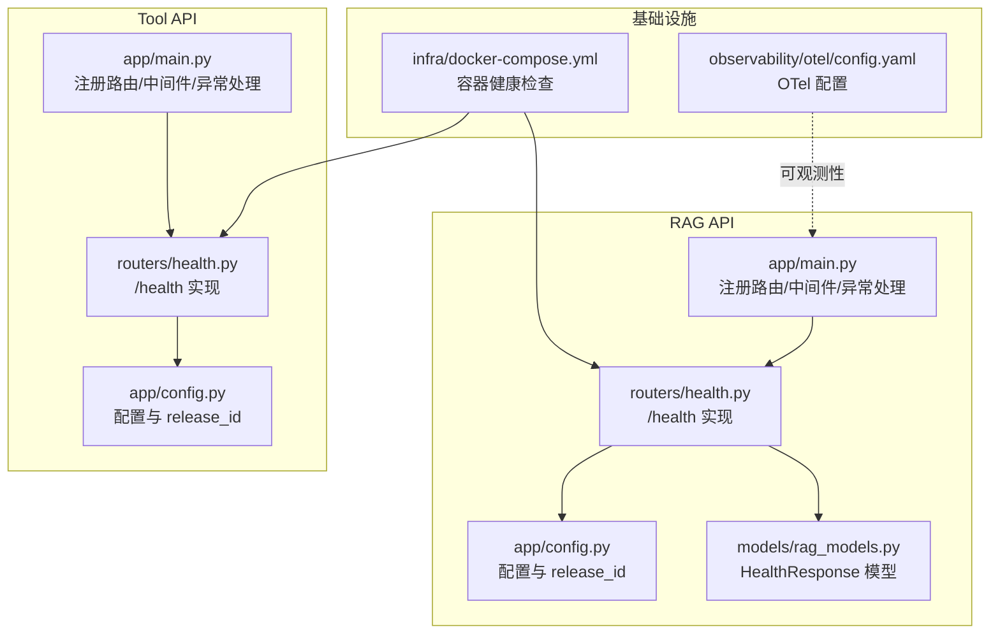
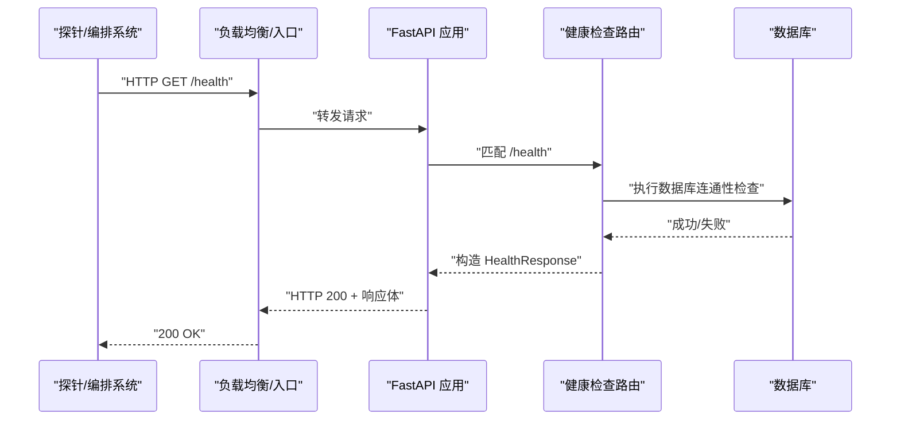
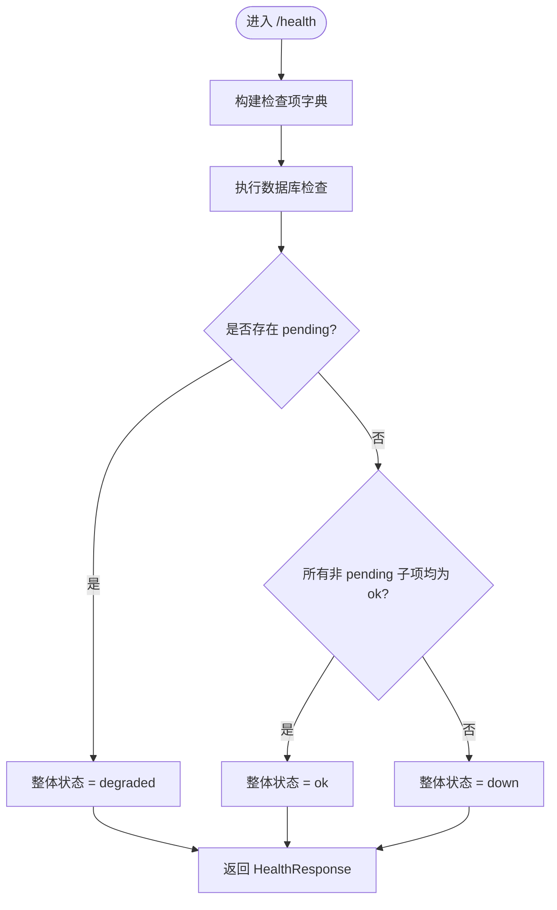
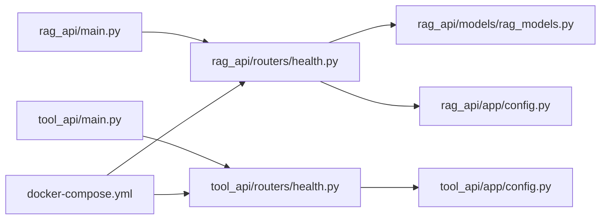

# 健康检查端点

<cite>
**本文档引用的文件**
- [services/rag_api/app/routers/health.py](file://services/rag_api/app/routers/health.py)
- [services/rag_api/app/models/rag_models.py](file://services/rag_api/app/models/rag_models.py)
- [services/rag_api/app/main.py](file://services/rag_api/app/main.py)
- [services/rag_api/app/config.py](file://services/rag_api/app/config.py)
- [services/tool_api/app/routers/health.py](file://services/tool_api/app/routers/health.py)
- [services/tool_api/app/main.py](file://services/tool_api/app/main.py)
- [services/tool_api/app/config.py](file://services/tool_api/app/config.py)
- [tests/integration/test_rag_api_smoke.py](file://tests/integration/test_rag_api_smoke.py)
- [infra/docker-compose.yml](file://infra/docker-compose.yml)
- [runbooks/week08-rag-engineering.md](file://runbooks/week08-rag-engineering.md)
- [services/rag_api/app/observability.py](file://services/rag_api/app/observability.py)
- [observability/otel/config.yaml](file://observability/otel/config.yaml)
</cite>

## 目录
1. [简介](#简介)
2. [项目结构](#项目结构)
3. [核心组件](#核心组件)
4. [架构总览](#架构总览)
5. [详细组件分析](#详细组件分析)
6. [依赖分析](#依赖分析)
7. [性能考虑](#性能考虑)
8. [故障排查指南](#故障排查指南)
9. [结论](#结论)
10. [附录](#附录)

## 简介
本文件聚焦于健康检查端点的设计、实现与使用。健康检查是服务可用性保障的关键基础设施，用于：
- 服务监控：持续探测服务是否存活与依赖是否正常
- 负载均衡：驱动上游 LB/Ingress 根据健康状态进行流量调度
- 自动恢复：配合编排系统触发重启、扩缩容或故障转移

在本仓库中，RAG API 与 Tool API 均提供 /health 端点，前者返回结构化的健康响应，后者返回简化的健康响应；二者均参与容器健康检查与集成测试。

## 项目结构
健康检查相关代码分布于两个服务模块：
- RAG API：提供结构化健康响应，包含整体状态、组件检查项与版本信息
- Tool API：提供简化健康响应，便于快速探测

**图表来源**
- [services/rag_api/app/main.py:68-73](file://services/rag_api/app/main.py#L68-L73)
- [services/rag_api/app/routers/health.py:10-33](file://services/rag_api/app/routers/health.py#L10-L33)
- [services/rag_api/app/models/rag_models.py:80-86](file://services/rag_api/app/models/rag_models.py#L80-L86)
- [services/rag_api/app/config.py:34-38](file://services/rag_api/app/config.py#L34-L38)
- [services/tool_api/app/main.py:61-64](file://services/tool_api/app/main.py#L61-L64)
- [services/tool_api/app/routers/health.py:7-14](file://services/tool_api/app/routers/health.py#L7-L14)
- [services/tool_api/app/config.py:7-11](file://services/tool_api/app/config.py#L7-L11)
- [infra/docker-compose.yml:117-121](file://infra/docker-compose.yml#L117-L121)
- [infra/docker-compose.yml:149-153](file://infra/docker-compose.yml#L149-L153)

**章节来源**
- [services/rag_api/app/main.py:68-73](file://services/rag_api/app/main.py#L68-L73)
- [services/tool_api/app/main.py:61-64](file://services/tool_api/app/main.py#L61-L64)
- [infra/docker-compose.yml:117-121](file://infra/docker-compose.yml#L117-L121)
- [infra/docker-compose.yml:149-153](file://infra/docker-compose.yml#L149-L153)

## 核心组件
- RAG API 健康端点
  - 路由：GET /health
  - 响应模型：HealthResponse（包含 status、service、version、release_id、checks）
  - 检查逻辑：当前包含 api、database、vector_index（待接入）、llm（待接入），整体状态基于非 pending 的子项聚合
  - 数据库检查：异步连接数据库并执行简单查询，成功返回 ok，异常返回 down
- Tool API 健康端点
  - 路由：GET /health
  - 响应：包含 status、service、version、release_id
  - 无依赖检查，仅返回服务自身可用

**章节来源**
- [services/rag_api/app/routers/health.py:10-33](file://services/rag_api/app/routers/health.py#L10-L33)
- [services/rag_api/app/routers/health.py:36-48](file://services/rag_api/app/routers/health.py#L36-L48)
- [services/rag_api/app/models/rag_models.py:80-86](file://services/rag_api/app/models/rag_models.py#L80-L86)
- [services/tool_api/app/routers/health.py:7-14](file://services/tool_api/app/routers/health.py#L7-L14)

## 架构总览
健康检查贯穿服务生命周期与基础设施：
- 服务启动时注册 /health 路由
- 容器健康检查通过 curl 调用 /health，作为编排系统的探针
- 测试用例确保 /health 返回 200 并包含必要字段
- 运行手册提供本地访问示例与预期字段说明

**图表来源**
- [services/rag_api/app/routers/health.py:10-33](file://services/rag_api/app/routers/health.py#L10-L33)
- [services/rag_api/app/routers/health.py:36-48](file://services/rag_api/app/routers/health.py#L36-L48)
- [infra/docker-compose.yml:117-121](file://infra/docker-compose.yml#L117-L121)

## 详细组件分析

### RAG API 健康检查
- 设计目的
  - 提供结构化健康状态，便于监控系统识别服务整体健康度与依赖健康度
  - 为后续接入向量库与大模型提供扩展点（vector_index、llm）
- 实现原理
  - 路由装饰器注册 GET /health，返回 HealthResponse
  - checks 字典包含 api、database、vector_index、llm
  - 整体状态规则：若存在 pending，则整体降级为 degraded；否则全部 ok 才为 ok
  - 数据库检查通过异步连接与简单查询验证连通性
- 响应字段
  - status：ok/degraded/down
  - service：服务名称
  - version：服务版本
  - release_id：发布标识
  - checks：各子项状态字典
- 使用场景
  - 编排系统健康检查
  - CI/CD 部署前探测
  - 运维平台展示与告警

**图表来源**
- [services/rag_api/app/routers/health.py:18-33](file://services/rag_api/app/routers/health.py#L18-L33)
- [services/rag_api/app/routers/health.py:36-48](file://services/rag_api/app/routers/health.py#L36-L48)

**章节来源**
- [services/rag_api/app/routers/health.py:10-33](file://services/rag_api/app/routers/health.py#L10-L33)
- [services/rag_api/app/routers/health.py:36-48](file://services/rag_api/app/routers/health.py#L36-L48)
- [services/rag_api/app/models/rag_models.py:80-86](file://services/rag_api/app/models/rag_models.py#L80-L86)

### Tool API 健康检查
- 设计目的
  - 快速探测服务可用性，无需复杂依赖检查
- 实现原理
  - 简洁返回包含服务名、版本与发布标识的 JSON
- 使用场景
  - 作为轻量探针，适合对延迟敏感或仅需基本可用性的场景

**章节来源**
- [services/tool_api/app/routers/health.py:7-14](file://services/tool_api/app/routers/health.py#L7-L14)

### 健康检查在服务监控、负载均衡与自动恢复中的作用
- 服务监控
  - 通过 /health 的 status 字段与 checks 详情，监控系统可区分“部分依赖异常”与“完全不可用”
- 负载均衡
  - LB 将未通过健康检查的实例从可用池移除，避免流量命中故障实例
- 自动恢复
  - 编排系统根据健康检查失败次数与间隔，触发重启、扩缩容或替换实例

**章节来源**
- [infra/docker-compose.yml:117-121](file://infra/docker-compose.yml#L117-L121)
- [infra/docker-compose.yml:149-153](file://infra/docker-compose.yml#L149-L153)

## 依赖分析
- 服务到路由
  - RAG API：main.py 注册 health 路由
  - Tool API：main.py 注册 health 路由
- 路由到实现
  - RAG API：/health -> health.py::health_check
  - Tool API：/health -> health.py::health
- 路由到模型
  - RAG API：/health -> HealthResponse（Pydantic 模型）
- 配置依赖
  - 两者均使用 settings.release_id 注入 release_id
- 基础设施依赖
  - 容器健康检查通过 curl 访问 /health
  - OTel 配置与健康检查无直接耦合，但可结合可观测性进行综合评估

**图表来源**
- [services/rag_api/app/main.py:68-73](file://services/rag_api/app/main.py#L68-L73)
- [services/tool_api/app/main.py:61-64](file://services/tool_api/app/main.py#L61-L64)
- [services/rag_api/app/routers/health.py:10-33](file://services/rag_api/app/routers/health.py#L10-L33)
- [services/tool_api/app/routers/health.py:7-14](file://services/tool_api/app/routers/health.py#L7-L14)
- [services/rag_api/app/models/rag_models.py:80-86](file://services/rag_api/app/models/rag_models.py#L80-L86)
- [services/rag_api/app/config.py:34-38](file://services/rag_api/app/config.py#L34-L38)
- [services/tool_api/app/config.py:7-11](file://services/tool_api/app/config.py#L7-L11)
- [infra/docker-compose.yml:117-121](file://infra/docker-compose.yml#L117-L121)
- [infra/docker-compose.yml:149-153](file://infra/docker-compose.yml#L149-L153)

**章节来源**
- [services/rag_api/app/main.py:68-73](file://services/rag_api/app/main.py#L68-L73)
- [services/tool_api/app/main.py:61-64](file://services/tool_api/app/main.py#L61-L64)
- [services/rag_api/app/routers/health.py:10-33](file://services/rag_api/app/routers/health.py#L10-L33)
- [services/tool_api/app/routers/health.py:7-14](file://services/tool_api/app/routers/health.py#L7-L14)
- [services/rag_api/app/models/rag_models.py:80-86](file://services/rag_api/app/models/rag_models.py#L80-L86)
- [services/rag_api/app/config.py:34-38](file://services/rag_api/app/config.py#L34-L38)
- [services/tool_api/app/config.py:7-11](file://services/tool_api/app/config.py#L7-L11)
- [infra/docker-compose.yml:117-121](file://infra/docker-compose.yml#L117-L121)
- [infra/docker-compose.yml:149-153](file://infra/docker-compose.yml#L149-L153)

## 性能考虑
- 健康检查应尽量轻量，避免阻塞业务路径
- 数据库检查建议：
  - 使用最小权限连接
  - 复用连接池或短连接快速验证
  - 设置合理超时，避免探针风暴
- 对外暴露的健康端点应避免记录敏感信息，保持简洁

## 故障排查指南
- 常见症状与定位
  - /health 返回非 200：检查服务是否启动、路由是否注册、异常处理器是否拦截
  - status 为 down：重点排查数据库连通性（网络、凭据、防火墙）
  - status 为 degraded：检查 pending 的子项（vector_index/llm），确认依赖是否接入
- 测试与验证
  - 使用 TestClient 或 curl 访问 /health，确认包含 status、service、release_id 等字段
  - 集成测试断言 /health 返回 200，并具备必需字段
- 运行手册参考
  - 提供本地访问示例与预期字段说明，便于快速验证

**章节来源**
- [tests/integration/test_rag_api_smoke.py:29-43](file://tests/integration/test_rag_api_smoke.py#L29-L43)
- [tests/integration/test_rag_api_smoke.py:82-90](file://tests/integration/test_rag_api_smoke.py#L82-L90)
- [runbooks/week08-rag-engineering.md:24-27](file://runbooks/week08-rag-engineering.md#L24-L27)

## 结论
健康检查端点是服务可用性与可观测性的基础能力。RAG API 与 Tool API 均提供 /health，前者结构化、后者简洁，满足不同场景需求。结合容器健康检查与测试用例，可形成从开发到生产的完整健康保障闭环。

## 附录

### API 规范与示例

- RAG API /health
  - 方法与路径：GET /health
  - 成功响应：HTTP 200
  - 响应体字段
    - status：字符串，取值范围为 ok/degraded/down
    - service：字符串，服务名称
    - version：字符串，服务版本
    - release_id：字符串，发布标识
    - checks：对象，各子项状态
  - 示例请求
    - curl -s http://localhost:8000/health
  - 示例响应（字段）
    - 包含 status、service、version、release_id、checks

- Tool API /health
  - 方法与路径：GET /health
  - 成功响应：HTTP 200
  - 响应体字段
    - status：字符串，取值范围为 ok/degraded/down
    - service：字符串，服务名称
    - version：字符串，服务版本
    - release_id：字符串，发布标识
  - 示例请求
    - curl -s http://localhost:8001/health
  - 示例响应（字段）
    - 包含 status、service、version、release_id

- 状态码说明
  - 200：服务可用，status 通常为 ok 或 degraded
  - 非 200：服务不可用或异常

- 响应格式说明
  - RAG API：使用 HealthResponse 模型，包含结构化 checks
  - Tool API：返回精简对象，便于快速消费

**章节来源**
- [services/rag_api/app/routers/health.py:10-33](file://services/rag_api/app/routers/health.py#L10-L33)
- [services/rag_api/app/models/rag_models.py:80-86](file://services/rag_api/app/models/rag_models.py#L80-L86)
- [services/tool_api/app/routers/health.py:7-14](file://services/tool_api/app/routers/health.py#L7-L14)
- [tests/integration/test_rag_api_smoke.py:29-43](file://tests/integration/test_rag_api_smoke.py#L29-L43)

### 最佳实践
- 保持健康检查轻量：避免执行重计算或长耗时操作
- 明确状态语义：ok 表示完全可用，degraded 表示部分依赖异常，down 表示完全不可用
- 丰富可观测性：结合 OTel 与日志，记录健康检查失败原因与频率
- 与编排系统联动：设置合理的健康检查间隔、超时与重试策略
- 自定义检查项：按需扩展数据库、缓存、外部服务等依赖检查

**章节来源**
- [services/rag_api/app/observability.py:11-54](file://services/rag_api/app/observability.py#L11-L54)
- [observability/otel/config.yaml:4-66](file://observability/otel/config.yaml#L4-L66)