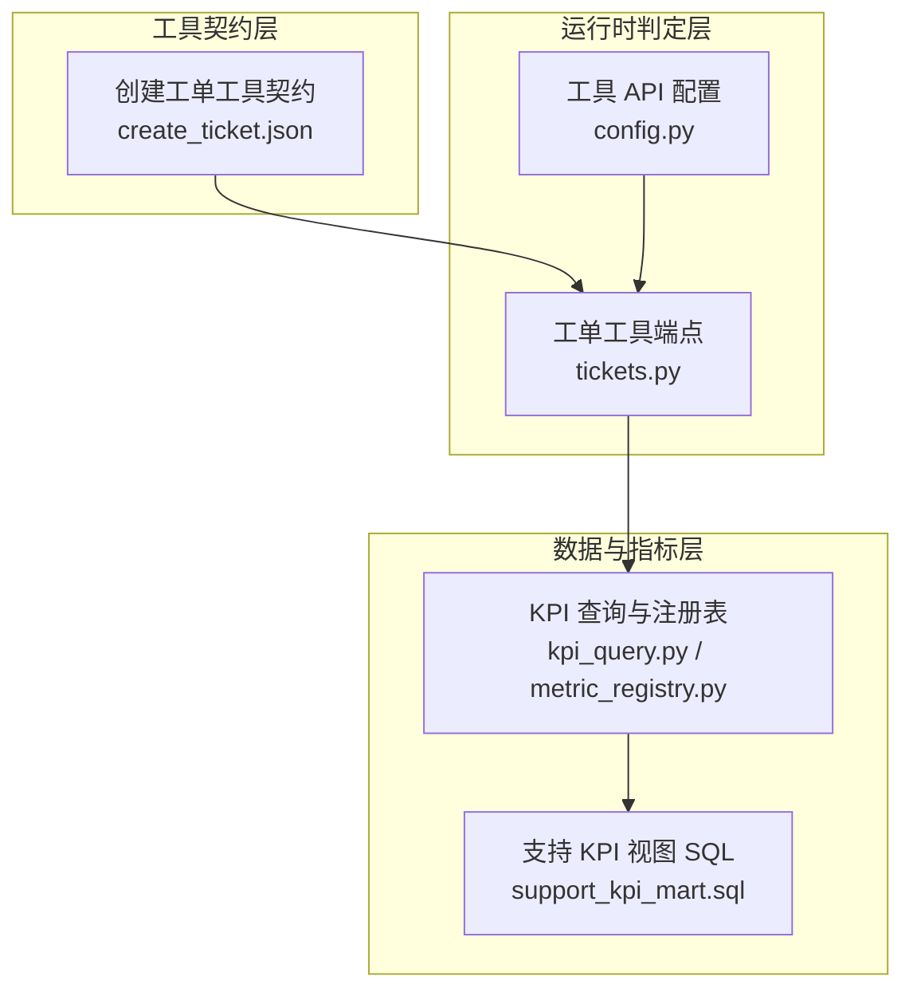
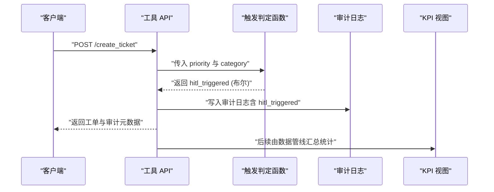
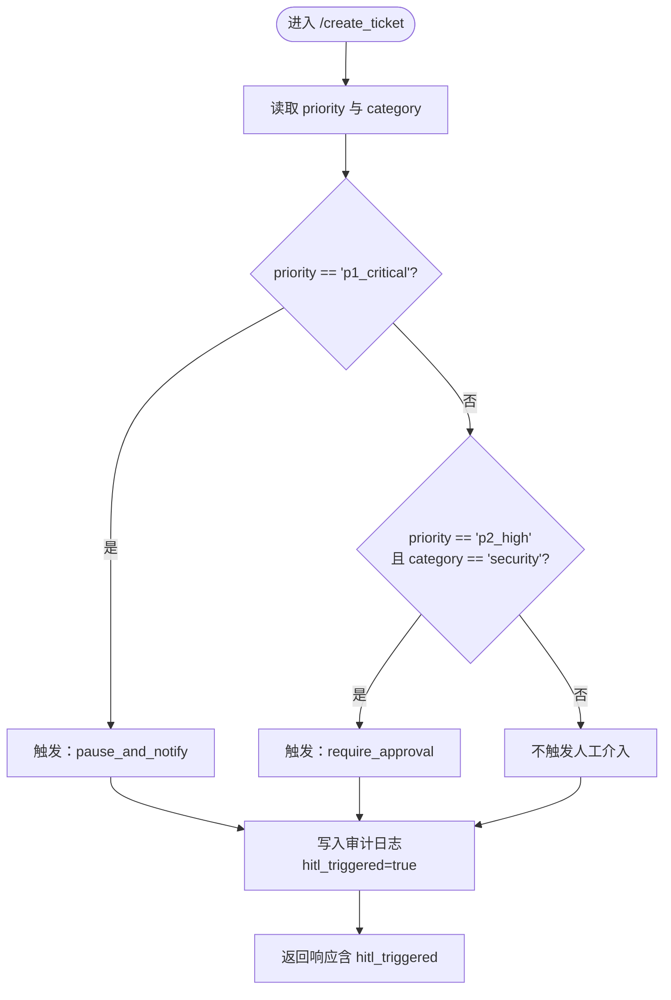
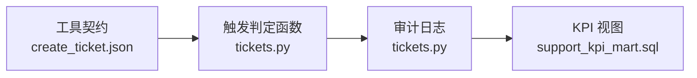

# 人工介入触发系统

<cite>
**本文引用的文件**
- [服务：工单工具端点](file://services/tool_api/app/routers/tickets.py)
- [工具契约：创建工单](file://contracts/tools/tools/create_ticket.json)
- [配置：工具 API 设置](file://services/tool_api/app/config.py)
- [KPI 查询与度量注册表](file://services/tool_api/app/kpi_query.py)
- [度量注册表数据结构](file://services/tool_api/app/metric_registry.py)
- [合成工单模拟器](file://data/synthetic_generators/ticket_simulator.py)
- [支持 KPI 指标视图 SQL](file://analytics/models/marts/support_kpi_mart.sql)
- [运行手册：第 6 周数据工厂](file://runbooks/week06-data-factory.md)
</cite>

## 目录
1. [简介](#简介)
2. [项目结构](#项目结构)
3. [核心组件](#核心组件)
4. [架构总览](#架构总览)
5. [详细组件分析](#详细组件分析)
6. [依赖关系分析](#依赖关系分析)
7. [性能考量](#性能考量)
8. [故障排查指南](#故障排查指南)
9. [结论](#结论)
10. [附录](#附录)

## 简介
本文件系统化阐述“人工介入触发系统”（Human-In-The-Loop Trigger System，简称 HITL）的设计与实现，聚焦于以下目标：
- 明确高优先级工单（p1_critical）与安全类工单（p2_high security）的自动触发条件
- 解释触发阈值设定、风险评估算法与人工审核流程
- 说明触发后的通知机制、处理时限与升级策略
- 给出触发条件配置、日志记录与效果监控方法
- 提供最佳实践、成本控制与效率优化建议

该系统以“工具契约 + 运行时判定 + 审计日志 + 指标监控”的闭环为核心，确保关键风险事件被及时拦截与处置。

## 项目结构
围绕 HITL 的关键代码与资产分布如下：
- 工具契约层：定义输入输出、触发条件、失败码与审计字段
- 运行时判定层：在创建工单端点中进行触发判断，并生成审计日志
- 配置层：暴露人工介入 Webhook 与超时等可调参数
- 数据与指标层：通过 dbt 构建 KPI 视图，支撑效果监控与报表

**图表来源**
- [工具契约：创建工单:80-89](file://contracts/tools/tools/create_ticket.json#L80-L89)
- [服务：工单工具端点:81-133](file://services/tool_api/app/routers/tickets.py#L81-L133)
- [配置：工具 API 设置:13-16](file://services/tool_api/app/config.py#L13-L16)
- [KPI 查询与度量注册表:106-209](file://services/tool_api/app/kpi_query.py#L106-L209)
- [度量注册表数据结构:14-66](file://services/tool_api/app/metric_registry.py#L14-L66)
- [支持 KPI 指标视图 SQL:1-150](file://analytics/models/marts/support_kpi_mart.sql#L1-L150)

**章节来源**
- [服务：工单工具端点:1-134](file://services/tool_api/app/routers/tickets.py#L1-L134)
- [工具契约：创建工单:1-95](file://contracts/tools/tools/create_ticket.json#L1-L95)
- [配置：工具 API 设置:1-19](file://services/tool_api/app/config.py#L1-L19)
- [KPI 查询与度量注册表:106-209](file://services/tool_api/app/kpi_query.py#L106-L209)
- [度量注册表数据结构:14-66](file://services/tool_api/app/metric_registry.py#L14-L66)
- [支持 KPI 指标视图 SQL:1-150](file://analytics/models/marts/support_kpi_mart.sql#L1-L150)

## 核心组件
- 工具契约中的触发条件定义：明确 p1_critical 与 p2_high security 的自动触发动作
- 运行时触发判断函数：在创建工单路径上进行布尔判定
- 审计日志：记录触发结果与请求上下文
- 配置项：暴露人工介入 Webhook 地址与超时时间
- 指标与视图：用于统计与监控 HITL 触发效果

**章节来源**
- [工具契约：创建工单:80-89](file://contracts/tools/tools/create_ticket.json#L80-L89)
- [服务：工单工具端点:127-133](file://services/tool_api/app/routers/tickets.py#L127-L133)
- [配置：工具 API 设置:13-16](file://services/tool_api/app/config.py#L13-L16)
- [支持 KPI 指标视图 SQL:55-112](file://analytics/models/marts/support_kpi_mart.sql#L55-L112)

## 架构总览
下图展示从客户端到工单创建、触发判定、审计日志与指标产出的整体流程。

**图表来源**
- [服务：工单工具端点:81-133](file://services/tool_api/app/routers/tickets.py#L81-L133)
- [工具契约：创建工单:80-89](file://contracts/tools/tools/create_ticket.json#L80-L89)
- [支持 KPI 指标视图 SQL:1-150](file://analytics/models/marts/support_kpi_mart.sql#L1-L150)

## 详细组件分析

### 工具契约中的触发条件
- p1_critical：直接触发“暂停并通知”
- p2_high 且 category 为 security：触发“需要审批”
- 其他优先级或非安全类 p2：不触发人工介入

这些条件来源于工具契约的 hitl_conditions 字段，作为运行时判定的权威依据。

**章节来源**
- [工具契约：创建工单:80-89](file://contracts/tools/tools/create_ticket.json#L80-L89)

### 运行时触发判定逻辑
- 在创建工单端点中，读取请求的 priority 与 category
- 调用内部判定函数，返回布尔值表示是否触发人工介入
- 将判定结果写入审计日志，并随响应返回给客户端

**图表来源**
- [服务：工单工具端点:127-133](file://services/tool_api/app/routers/tickets.py#L127-L133)

**章节来源**
- [服务：工单工具端点:81-133](file://services/tool_api/app/routers/tickets.py#L81-L133)

### 审计日志与输出结构
- 审计日志包含请求 ID、调用者、工具名、参数哈希、结果码、是否触发人工介入、时间戳等字段
- 输出对象包含工单 ID、状态、创建时间、是否触发人工介入、追踪 ID、发布版本等

这些字段为后续监控与回溯提供基础。

**章节来源**
- [服务：工单工具端点:38-124](file://services/tool_api/app/routers/tickets.py#L38-L124)

### 配置项与扩展点
- 支持设置人工介入 Webhook 地址与超时时间，便于接入外部审批系统
- 当前运行时判定为本地布尔逻辑；Webhook 调用与审批流程在配置启用后接入

**章节来源**
- [配置：工具 API 设置:13-16](file://services/tool_api/app/config.py#L13-L16)

### 指标与监控
- dbt 视图支持按优先级、类别、组织等维度统计工单数量、SLA 破坏数、升级次数等
- 可据此构建看板与告警，跟踪 HITL 触发率、平均响应时间、升级率等关键指标

**章节来源**
- [支持 KPI 指标视图 SQL:55-112](file://analytics/models/marts/support_kpi_mart.sql#L55-L112)

## 依赖关系分析
- 工具契约定义触发条件，驱动运行时判定
- 运行时判定依赖请求参数（priority、category），并写入审计日志
- 指标层通过 dbt 视图聚合统计，支撑运营与管理决策

**图表来源**
- [工具契约：创建工单:80-89](file://contracts/tools/tools/create_ticket.json#L80-L89)
- [服务：工单工具端点:127-133](file://services/tool_api/app/routers/tickets.py#L127-L133)
- [支持 KPI 指标视图 SQL:1-150](file://analytics/models/marts/support_kpi_mart.sql#L1-L150)

**章节来源**
- [工具契约：创建工单:1-95](file://contracts/tools/tools/create_ticket.json#L1-L95)
- [服务：工单工具端点:1-134](file://services/tool_api/app/routers/tickets.py#L1-L134)
- [支持 KPI 指标视图 SQL:1-150](file://analytics/models/marts/support_kpi_mart.sql#L1-L150)

## 性能考量
- 触发判定为纯内存布尔运算，复杂度 O(1)，对吞吐影响极小
- 审计日志写入为同步路径，建议在生产环境采用异步批写或队列缓冲
- 指标统计由离线数据管线完成，不影响实时接口性能
- 对高频调用场景，建议结合速率限制与熔断策略，避免触发风暴

## 故障排查指南
- 触发条件不生效
  - 检查请求 priority 与 category 是否符合枚举值
  - 确认工具契约中的 hitl_conditions 未被修改或覆盖
- 审计日志缺失
  - 确认审计日志对象已正确构造并随响应返回
  - 检查审计字段配置是否开启
- 指标异常
  - 使用运行手册中的数据工厂流程验证分区与视图是否正常
  - 核对 KPI 视图的维度与过滤条件是否匹配实际数据

**章节来源**
- [运行手册：第 6 周数据工厂:1-190](file://runbooks/week06-data-factory.md#L1-L190)

## 结论
本系统以“契约驱动 + 运行时判定 + 审计日志 + 指标监控”形成闭环，能够稳定识别高优先级与安全类风险事件并触发人工介入。通过合理的配置与监控，可在保障质量的同时控制成本并提升整体效率。

## 附录

### 触发阈值与业务规则
- p1_critical：自动触发“暂停并通知”
- p2_high 且 category 为 security：自动触发“需要审批”
- 其他情况：不触发人工介入

以上规则直接来源于工具契约定义。

**章节来源**
- [工具契约：创建工单:80-89](file://contracts/tools/tools/create_ticket.json#L80-L89)

### 风险评估算法与人工审核流程
- 风险评估算法
  - 输入：priority、category
  - 输出：布尔值（是否触发人工介入）
  - 复杂度：O(1)
- 人工审核流程
  - 当触发条件满足时，系统将 hitl_triggered 标记为 true，并写入审计日志
  - 可选：通过配置的 Webhook 与审批系统对接，实现“暂停并通知/需要审批”的后续处理
  - 未对接外部系统时，仍可通过审计日志与指标进行人工干预与复核

**章节来源**
- [服务：工单工具端点:127-133](file://services/tool_api/app/routers/tickets.py#L127-L133)
- [配置：工具 API 设置:13-16](file://services/tool_api/app/config.py#L13-L16)

### 通知机制、处理时限与升级策略
- 通知机制
  - 审计日志记录触发事件，便于下游系统拉取与通知
  - 可通过配置的 Webhook 将事件推送到外部通知系统
- 处理时限
  - 通过 SLA 相关指标（如首次响应时间、平均待办时长）进行监控
- 升级策略
  - 当触发率过高或 SLA 破坏增加时，可考虑提高阈值或引入更严格的审批流程

**章节来源**
- [支持 KPI 指标视图 SQL:55-112](file://analytics/models/marts/support_kpi_mart.sql#L55-L112)
- [配置：工具 API 设置:13-16](file://services/tool_api/app/config.py#L13-L16)

### 触发条件配置与变更管理
- 工具契约为单一事实源，任何变更需走契约评审与回归测试
- 变更后需验证运行时判定逻辑与审计日志输出
- 建议在灰度环境中逐步放开新规则，观察指标变化后再全量上线

**章节来源**
- [工具契约：创建工单:1-95](file://contracts/tools/tools/create_ticket.json#L1-L95)
- [服务：工单工具端点:127-133](file://services/tool_api/app/routers/tickets.py#L127-L133)

### 日志记录与效果监控
- 审计日志字段包含请求 ID、工具名、参数哈希、结果码、是否触发人工介入、时间戳等
- 指标视图支持按优先级、类别、组织等维度统计工单数量、SLA 破坏数、升级次数等
- 建议建立看板与告警，持续跟踪 HITL 触发率、平均响应时间、升级率等关键指标

**章节来源**
- [服务：工单工具端点:38-124](file://services/tool_api/app/routers/tickets.py#L38-L124)
- [支持 KPI 指标视图 SQL:55-112](file://analytics/models/marts/support_kpi_mart.sql#L55-L112)

### 最佳实践、成本控制与效率优化
- 最佳实践
  - 将触发规则固化在工具契约中，避免硬编码
  - 保持审计日志完整，便于回溯与合规
  - 分阶段放开新规则，配合指标监控
- 成本控制
  - 通过指标与告警控制人工介入频率，避免过度干预
  - 对高频场景实施速率限制与熔断
- 效率优化
  - 将人工介入流程自动化（如审批 Webhook），减少手工操作
  - 使用合成数据模拟与回归测试，降低变更风险

**章节来源**
- [服务：工单工具端点:1-134](file://services/tool_api/app/routers/tickets.py#L1-L134)
- [合成工单模拟器:37-42](file://data/synthetic_generators/ticket_simulator.py#L37-L42)
- [运行手册：第 6 周数据工厂:1-190](file://runbooks/week06-data-factory.md#L1-L190)