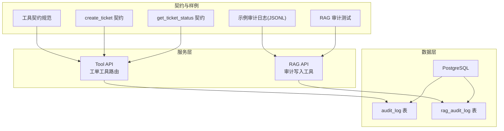
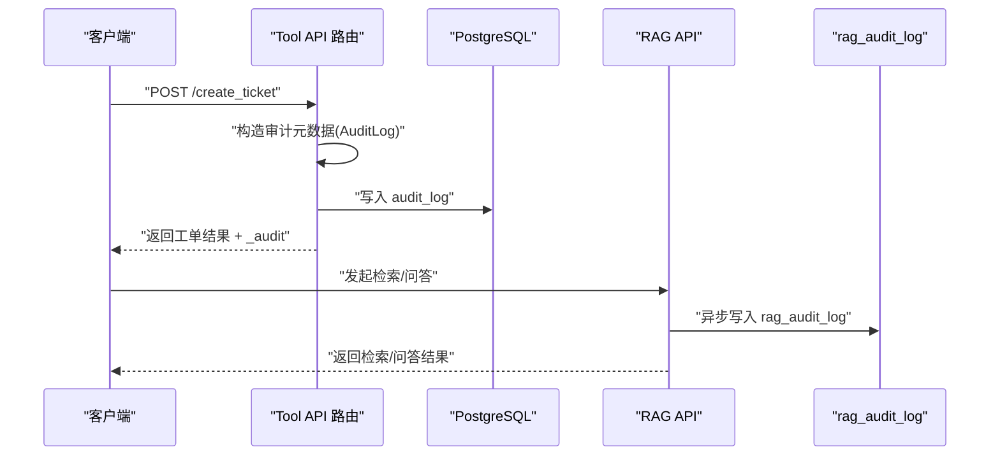
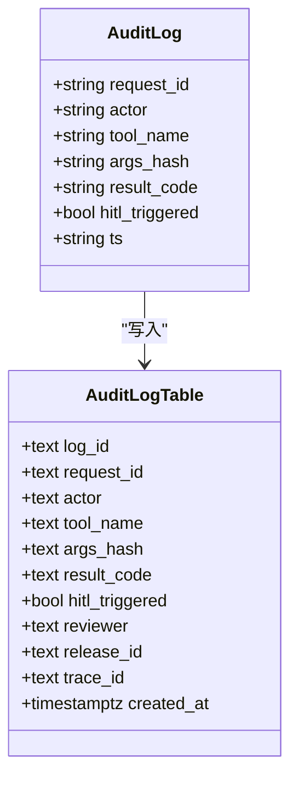
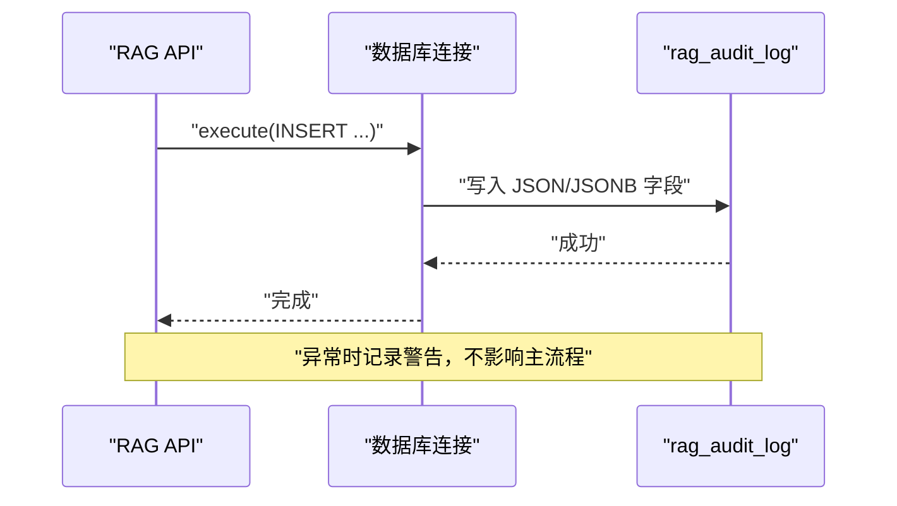
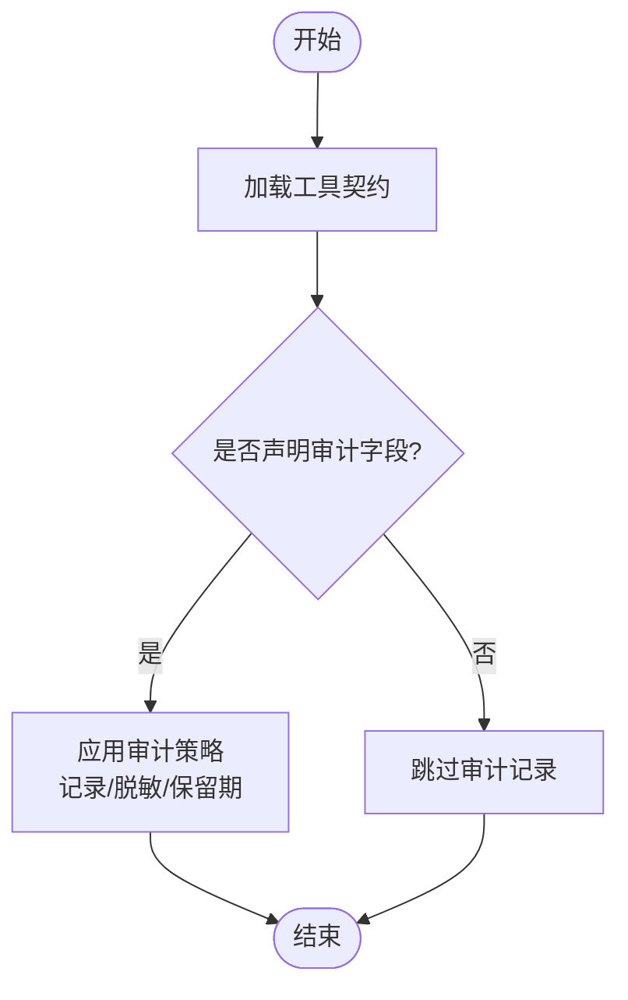
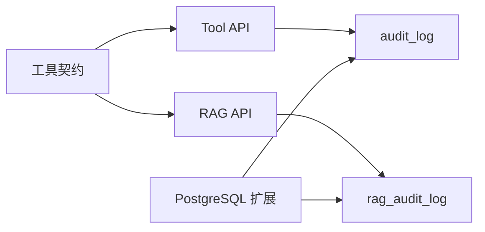

# 审计日志记录

<cite>
**本文引用的文件**
- [services/tool_api/app/routers/tickets.py](file://services/tool_api/app/routers/tickets.py)
- [services/rag_api/app/audit.py](file://services/rag_api/app/audit.py)
- [infra/migrations/001_init.sql](file://infra/migrations/001_init.sql)
- [infra/migrations/003_week08_index_rag.sql](file://infra/migrations/003_week08_index_rag.sql)
- [contracts/tools/tool_contract_schema.json](file://contracts/tools/tool_contract_schema.json)
- [contracts/tools/tools/create_ticket.json](file://contracts/tools/tools/create_ticket.json)
- [contracts/tools/tools/get_ticket_status.json](file://contracts/tools/tools/get_ticket_status.json)
- [reports/week08/rag_audit_log.sample.jsonl](file://reports/week08/rag_audit_log.sample.jsonl)
- [tests/integration/test_week8_rag_audit.py](file://tests/integration/test_week8_rag_audit.py)
</cite>

## 目录
1. [简介](#简介)
2. [项目结构](#项目结构)
3. [核心组件](#核心组件)
4. [架构总览](#架构总览)
5. [详细组件分析](#详细组件分析)
6. [依赖关系分析](#依赖关系分析)
7. [性能考虑](#性能考虑)
8. [故障排查指南](#故障排查指南)
9. [结论](#结论)
10. [附录](#附录)

## 简介
本文件系统化梳理本仓库中“审计日志记录”能力，覆盖工单操作的完整审计跟踪机制，包括操作类型、参与者与时间戳记录；审计日志的数据结构设计、字段定义与存储策略；日志完整性与防篡改机制、长期保存策略；审计日志的查询接口、过滤条件与导出能力；以及合规性、隐私保护与数据最小化原则；最后给出性能优化、存储管理与查询效率提升方案。

## 项目结构
围绕审计日志的关键位置与职责如下：
- 工具层审计：Tool API 的工单工具在请求处理流程中构造并返回审计元数据，落地到 PostgreSQL 的 audit_log 表。
- RAG 审计：RAG API 在检索与回答流程中异步写入 rag_audit_log 表，记录检索与答案相关上下文。
- 数据模型：PostgreSQL 初始化脚本定义了 audit_log 与 rag_audit_log 的表结构与索引。
- 工具契约：工具契约定义了审计字段开关与保留期，指导是否记录输入/输出/参与者及保留天数。
- 示例与测试：提供示例 JSONL 审计日志样本与单元测试，验证字段写入与序列化。

图表来源
- [services/tool_api/app/routers/tickets.py:38-46](file://services/tool_api/app/routers/tickets.py#L38-L46)
- [services/rag_api/app/audit.py:21-69](file://services/rag_api/app/audit.py#L21-L69)
- [infra/migrations/001_init.sql:217-229](file://infra/migrations/001_init.sql#L217-L229)
- [infra/migrations/003_week08_index_rag.sql:47-65](file://infra/migrations/003_week08_index_rag.sql#L47-L65)
- [contracts/tools/tool_contract_schema.json:53-62](file://contracts/tools/tool_contract_schema.json#L53-L62)
- [contracts/tools/tools/create_ticket.json:68-73](file://contracts/tools/tools/create_ticket.json#L68-L73)
- [contracts/tools/tools/get_ticket_status.json:54-59](file://contracts/tools/tools/get_ticket_status.json#L54-L59)
- [reports/week08/rag_audit_log.sample.jsonl:1-2](file://reports/week08/rag_audit_log.sample.jsonl#L1-L2)
- [tests/integration/test_week8_rag_audit.py:20-51](file://tests/integration/test_week8_rag_audit.py#L20-L51)

章节来源
- [services/tool_api/app/routers/tickets.py:1-134](file://services/tool_api/app/routers/tickets.py#L1-L134)
- [services/rag_api/app/audit.py:1-70](file://services/rag_api/app/audit.py#L1-L70)
- [infra/migrations/001_init.sql:217-233](file://infra/migrations/001_init.sql#L217-L233)
- [infra/migrations/003_week08_index_rag.sql:47-65](file://infra/migrations/003_week08_index_rag.sql#L47-L65)
- [contracts/tools/tool_contract_schema.json:1-93](file://contracts/tools/tool_contract_schema.json#L1-L93)
- [contracts/tools/tools/create_ticket.json:1-95](file://contracts/tools/tools/create_ticket.json#L1-L95)
- [contracts/tools/tools/get_ticket_status.json:1-67](file://contracts/tools/tools/get_ticket_status.json#L1-L67)
- [reports/week08/rag_audit_log.sample.jsonl:1-2](file://reports/week08/rag_audit_log.sample.jsonl#L1-L2)
- [tests/integration/test_week8_rag_audit.py:1-52](file://tests/integration/test_week8_rag_audit.py#L1-L52)

## 核心组件
- 审计元数据模型（Tool API）
  - 定义了审计日志的字段：请求标识、参与者、工具名、参数哈希、结果码、是否触发人工介入、时间戳等。
  - 在创建工单等关键路径上构造并随响应返回，便于下游持久化与归档。
- RAG 审计写入工具
  - 异步写入 rag_audit_log，包含检索问题、参与者角色、过滤条件、检索证据 ID、评分明细、答案、置信度、拒绝原因、发布版本与延迟等。
- 审计表结构
  - audit_log：记录工具调用级审计，含索引以支持按工具名、时间、参与者查询。
  - rag_audit_log：记录 RAG 检索与回答级审计，使用 JSON/JSONB 字段承载复杂结构。
- 工具契约审计字段
  - 定义是否记录输入/输出/参与者，以及保留天数，指导审计策略与数据最小化。

章节来源
- [services/tool_api/app/routers/tickets.py:38-46](file://services/tool_api/app/routers/tickets.py#L38-L46)
- [services/rag_api/app/audit.py:21-69](file://services/rag_api/app/audit.py#L21-L69)
- [infra/migrations/001_init.sql:217-229](file://infra/migrations/001_init.sql#L217-L229)
- [infra/migrations/003_week08_index_rag.sql:47-65](file://infra/migrations/003_week08_index_rag.sql#L47-L65)
- [contracts/tools/tool_contract_schema.json:53-62](file://contracts/tools/tool_contract_schema.json#L53-L62)

## 架构总览
下图展示从工具调用到审计落库的整体流程，包括工具层审计与 RAG 审计两条路径。

图表来源
- [services/tool_api/app/routers/tickets.py:82-124](file://services/tool_api/app/routers/tickets.py#L82-L124)
- [services/rag_api/app/audit.py:21-69](file://services/rag_api/app/audit.py#L21-L69)
- [infra/migrations/001_init.sql:217-229](file://infra/migrations/001_init.sql#L217-L229)
- [infra/migrations/003_week08_index_rag.sql:47-65](file://infra/migrations/003_week08_index_rag.sql#L47-L65)

## 详细组件分析

### 组件A：工具层审计（audit_log）
- 数据结构与字段
  - 主键：log_id（UUID 文本）
  - 关键维度：request_id、actor、tool_name、args_hash、result_code、hitl_triggered、reviewer、release_id、trace_id、created_at
  - 索引：按 tool_name、created_at（降序）、actor 建立索引，支撑常用查询与排序
- 审计触发点
  - 在创建工单等关键工具调用路径上构造审计元数据，并随响应返回，便于前端/网关/代理层统一收集与持久化
- 参数哈希与幂等
  - args_hash 基于请求参数序列化后的哈希，用于识别重复调用与审计关联
- 人工介入标记
  - hitl_triggered 标记是否触发人工介入，便于后续审计与合规审查

图表来源
- [services/tool_api/app/routers/tickets.py:38-46](file://services/tool_api/app/routers/tickets.py#L38-L46)
- [infra/migrations/001_init.sql:217-229](file://infra/migrations/001_init.sql#L217-L229)

章节来源
- [services/tool_api/app/routers/tickets.py:38-46](file://services/tool_api/app/routers/tickets.py#L38-L46)
- [services/tool_api/app/routers/tickets.py:82-124](file://services/tool_api/app/routers/tickets.py#L82-L124)
- [infra/migrations/001_init.sql:217-229](file://infra/migrations/001_init.sql#L217-L229)

### 组件B：RAG 审计（rag_audit_log）
- 数据结构与字段
  - 主键：audit_id（UUID 文本）
  - 请求与上下文：request_id、trace_id、question、actor_role
  - 检索与结果：filters（JSONB）、retrieved_evidence_ids（数组）、scores（JSONB）、answer、confidence、abstain_reason
  - 发布与性能：release_id、data_release_id、index_release_id、prompt_release_id、latency_ms
  - 时间：created_at
- 写入流程
  - 异步执行 INSERT，参数序列化为 JSON/JSONB，异常记录警告但不影响主流程
- 示例与测试
  - 示例 JSONL 展示了字段布局
  - 测试验证字段写入、JSON 序列化与特定字段值

图表来源
- [services/rag_api/app/audit.py:21-69](file://services/rag_api/app/audit.py#L21-L69)
- [infra/migrations/003_week08_index_rag.sql:47-65](file://infra/migrations/003_week08_index_rag.sql#L47-L65)
- [reports/week08/rag_audit_log.sample.jsonl:1-2](file://reports/week08/rag_audit_log.sample.jsonl#L1-L2)
- [tests/integration/test_week8_rag_audit.py:20-51](file://tests/integration/test_week8_rag_audit.py#L20-L51)

章节来源
- [services/rag_api/app/audit.py:21-69](file://services/rag_api/app/audit.py#L21-L69)
- [infra/migrations/003_week08_index_rag.sql:47-65](file://infra/migrations/003_week08_index_rag.sql#L47-L65)
- [reports/week08/rag_audit_log.sample.jsonl:1-2](file://reports/week08/rag_audit_log.sample.jsonl#L1-L2)
- [tests/integration/test_week8_rag_audit.py:1-52](file://tests/integration/test_week8_rag_audit.py#L1-L52)

### 组件C：工具契约与审计策略
- 审计字段定义
  - log_input、log_output、log_actor、retention_days
- 工具示例
  - create_ticket：开启输入/输出/参与者记录，保留 365 天
  - get_ticket_status：开启输入/参与者记录，保留 365 天
- 合规与最小化
  - 通过审计字段控制记录范围与保留期，遵循最小化原则

图表来源
- [contracts/tools/tool_contract_schema.json:53-62](file://contracts/tools/tool_contract_schema.json#L53-L62)
- [contracts/tools/tools/create_ticket.json:68-73](file://contracts/tools/tools/create_ticket.json#L68-L73)
- [contracts/tools/tools/get_ticket_status.json:54-59](file://contracts/tools/tools/get_ticket_status.json#L54-L59)

章节来源
- [contracts/tools/tool_contract_schema.json:53-62](file://contracts/tools/tool_contract_schema.json#L53-L62)
- [contracts/tools/tools/create_ticket.json:68-73](file://contracts/tools/tools/create_ticket.json#L68-L73)
- [contracts/tools/tools/get_ticket_status.json:54-59](file://contracts/tools/tools/get_ticket_status.json#L54-L59)

### 组件D：查询接口、过滤条件与导出
- 查询与过滤
  - audit_log：按 tool_name、actor、created_at（降序）等维度过滤与排序
  - rag_audit_log：按 request_id、trace_id、actor_role、index_release_id、created_at 等过滤
- 导出
  - 可基于 SQL 导出 JSON/CSV，结合保留期策略进行周期性归档与清理
- 性能建议
  - 为高频过滤字段建立合适索引，避免全表扫描
  - 对大字段采用分页与游标式查询，避免一次性拉取过多 JSON/JSONB

章节来源
- [infra/migrations/001_init.sql:231-233](file://infra/migrations/001_init.sql#L231-L233)
- [infra/migrations/003_week08_index_rag.sql:64-65](file://infra/migrations/003_week08_index_rag.sql#L64-L65)

## 依赖关系分析
- 组件耦合
  - Tool API 与 PostgreSQL 的 audit_log 表强耦合，确保关键工具调用必留痕
  - RAG API 与 rag_audit_log 表弱耦合，通过异步写入降低对主流程影响
- 外部依赖
  - PostgreSQL 扩展（如 UUID、向量、pg_trgm）为检索与审计提供基础能力
- 契约驱动
  - 工具契约决定审计范围与保留期，形成“先契约、后实现”的审计策略

图表来源
- [contracts/tools/tool_contract_schema.json:1-93](file://contracts/tools/tool_contract_schema.json#L1-L93)
- [services/tool_api/app/routers/tickets.py:1-134](file://services/tool_api/app/routers/tickets.py#L1-L134)
- [services/rag_api/app/audit.py:1-70](file://services/rag_api/app/audit.py#L1-L70)
- [infra/migrations/001_init.sql:6-8](file://infra/migrations/001_init.sql#L6-L8)
- [infra/migrations/003_week08_index_rag.sql:47-65](file://infra/migrations/003_week08_index_rag.sql#L47-L65)

章节来源
- [contracts/tools/tool_contract_schema.json:1-93](file://contracts/tools/tool_contract_schema.json#L1-L93)
- [services/tool_api/app/routers/tickets.py:1-134](file://services/tool_api/app/routers/tickets.py#L1-L134)
- [services/rag_api/app/audit.py:1-70](file://services/rag_api/app/audit.py#L1-L70)
- [infra/migrations/001_init.sql:6-8](file://infra/migrations/001_init.sql#L6-L8)
- [infra/migrations/003_week08_index_rag.sql:47-65](file://infra/migrations/003_week08_index_rag.sql#L47-L65)

## 性能考虑
- 写入性能
  - RAG 审计采用异步写入，异常非致命，避免阻塞主流程
  - 使用参数化 SQL 与批量写入（如需）减少序列化开销
- 查询性能
  - 为高频过滤字段建立索引（如 created_at、tool_name、actor），避免全表扫描
  - 对 JSON/JSONB 字段使用合适的 GIN/索引策略，必要时拆分冗余维度列
- 存储与归档
  - 基于保留期策略定期归档与清理，降低热数据规模
  - 对大字段（如 answer、scores）可考虑外部化存储并仅保留引用
- 监控与告警
  - 记录审计写入失败次数与延迟，设置阈值告警

## 故障排查指南
- 审计写入失败
  - RAG 审计写入捕获异常并记录警告，不影响主流程；检查数据库连接、表结构与权限
- 字段缺失或序列化异常
  - 确认 JSON/JSONB 字段序列化编码（UTF-8）与字段类型一致
- 查询性能下降
  - 检查索引使用情况与查询计划，必要时补充或重构索引
- 数据一致性
  - 审计日志与业务数据的主键/外键一致性，确保 trace_id/request_id 关联正确

章节来源
- [services/rag_api/app/audit.py:68-69](file://services/rag_api/app/audit.py#L68-L69)
- [tests/integration/test_week8_rag_audit.py:20-51](file://tests/integration/test_week8_rag_audit.py#L20-L51)

## 结论
本仓库已构建起完整的审计日志体系：工具层审计（audit_log）与 RAG 审计（rag_audit_log）双轨并行，契约驱动的审计策略确保合规与最小化原则，PostgreSQL 提供可靠的结构化存储与索引能力。通过异步写入与索引优化，系统在保证审计完整性的同时兼顾性能与可维护性。

## 附录
- 审计字段对照表（节选）
  - audit_log：log_id、request_id、actor、tool_name、args_hash、result_code、hitl_triggered、reviewer、release_id、trace_id、created_at
  - rag_audit_log：audit_id、request_id、trace_id、question、actor_role、filters、retrieved_evidence_ids、scores、answer、confidence、abstain_reason、release_id、data_release_id、index_release_id、prompt_release_id、latency_ms、created_at
- 示例与测试参考
  - 示例 JSONL：[rag_audit_log.sample.jsonl:1-2](file://reports/week08/rag_audit_log.sample.jsonl#L1-L2)
  - RAG 审计测试：[test_week8_rag_audit.py:20-51](file://tests/integration/test_week8_rag_audit.py#L20-L51)