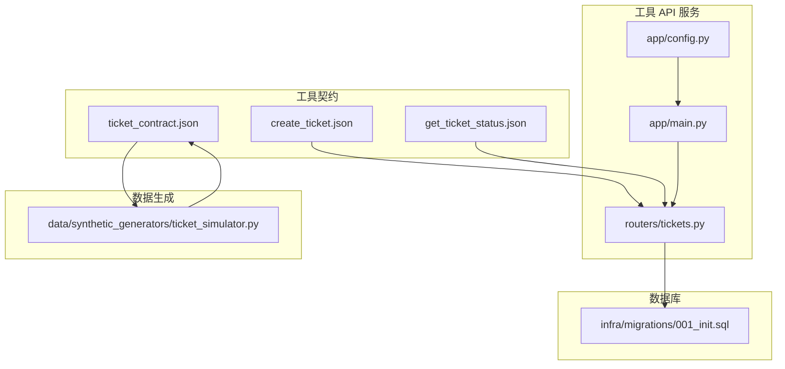
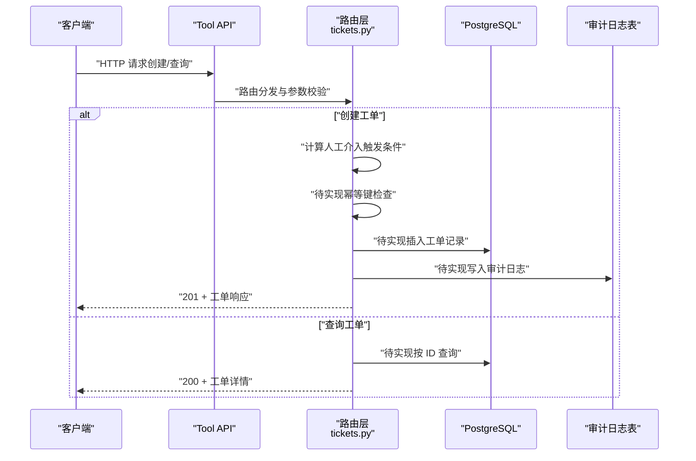
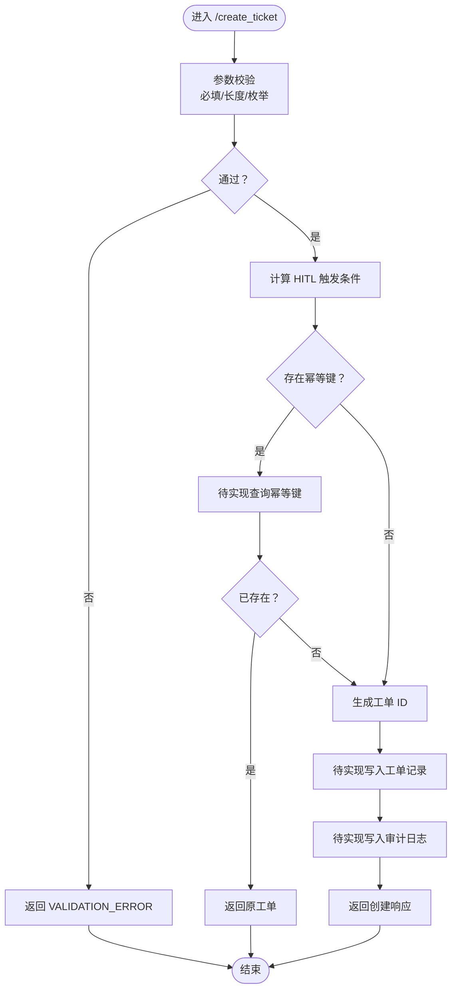
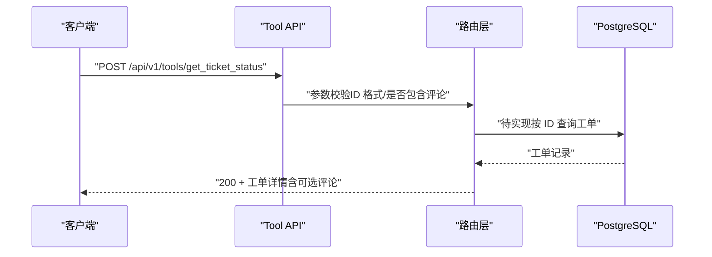
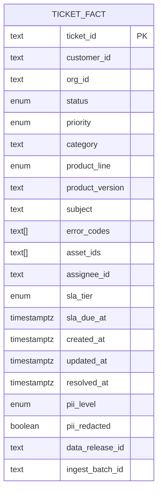
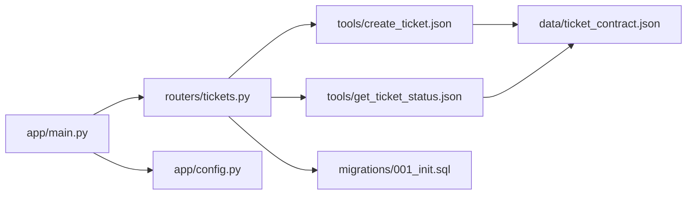

# 工单 CRUD 操作

<cite>
**本文引用的文件**
- [contracts/tools/tools/create_ticket.json](file://contracts/tools/tools/create_ticket.json)
- [contracts/tools/tools/get_ticket_status.json](file://contracts/tools/tools/get_ticket_status.json)
- [contracts/data/ticket_contract.json](file://contracts/data/ticket_contract.json)
- [services/tool_api/app/routers/tickets.py](file://services/tool_api/app/routers/tickets.py)
- [services/tool_api/app/main.py](file://services/tool_api/app/main.py)
- [services/tool_api/app/config.py](file://services/tool_api/app/config.py)
- [infra/migrations/001_init.sql](file://infra/migrations/001_init.sql)
- [data/synthetic_generators/ticket_simulator.py](file://data/synthetic_generators/ticket_simulator.py)
</cite>

## 目录
1. [简介](#简介)
2. [项目结构](#项目结构)
3. [核心组件](#核心组件)
4. [架构总览](#架构总览)
5. [详细组件分析](#详细组件分析)
6. [依赖分析](#依赖分析)
7. [性能考虑](#性能考虑)
8. [故障排除指南](#故障排除指南)
9. [结论](#结论)
10. [附录](#附录)

## 简介
本文件面向“工单 CRUD 操作”的实现与使用，重点覆盖以下内容：
- 工单创建（create_ticket）与查询（get_ticket_status）的完整流程
- 请求参数验证、数据模型定义与响应格式规范
- 工单 ID 生成算法、幂等键处理机制与 UUID 生成策略
- 工单状态初始化、优先级处理与分类体系
- 具体 API 调用示例、错误处理策略与参数约束说明
- 工单生命周期管理最佳实践与性能优化建议

## 项目结构
围绕工单工具链，本仓库的关键模块包括：
- 工具契约（输入/输出模式、失败码、限流与人工介入条件）
- 工具 API 服务（FastAPI 路由与中间件）
- 数据契约（工单数据结构与字段约束）
- 数据库迁移（枚举类型、表结构、索引）
- 合成数据生成器（用于理解数据形态与默认值）

图表来源
- [services/tool_api/app/routers/tickets.py:1-134](file://services/tool_api/app/routers/tickets.py#L1-L134)
- [services/tool_api/app/main.py:1-64](file://services/tool_api/app/main.py#L1-L64)
- [services/tool_api/app/config.py:1-19](file://services/tool_api/app/config.py#L1-L19)
- [contracts/tools/tools/create_ticket.json:1-95](file://contracts/tools/tools/create_ticket.json#L1-L95)
- [contracts/tools/tools/get_ticket_status.json:1-67](file://contracts/tools/tools/get_ticket_status.json#L1-L67)
- [contracts/data/ticket_contract.json:1-125](file://contracts/data/ticket_contract.json#L1-L125)
- [infra/migrations/001_init.sql:1-288](file://infra/migrations/001_init.sql#L1-L288)
- [data/synthetic_generators/ticket_simulator.py:1-235](file://data/synthetic_generators/ticket_simulator.py#L1-L235)

章节来源
- [services/tool_api/app/routers/tickets.py:1-134](file://services/tool_api/app/routers/tickets.py#L1-L134)
- [services/tool_api/app/main.py:1-64](file://services/tool_api/app/main.py#L1-L64)
- [services/tool_api/app/config.py:1-19](file://services/tool_api/app/config.py#L1-L19)
- [contracts/tools/tools/create_ticket.json:1-95](file://contracts/tools/tools/create_ticket.json#L1-L95)
- [contracts/tools/tools/get_ticket_status.json:1-67](file://contracts/tools/tools/get_ticket_status.json#L1-L67)
- [contracts/data/ticket_contract.json:1-125](file://contracts/data/ticket_contract.json#L1-L125)
- [infra/migrations/001_init.sql:1-288](file://infra/migrations/001_init.sql#L1-L288)
- [data/synthetic_generators/ticket_simulator.py:1-235](file://data/synthetic_generators/ticket_simulator.py#L1-L235)

## 核心组件
- 工具契约（输入/输出模式与失败码）
  - create_ticket：定义必填字段、长度限制、枚举集合、幂等键、人工介入条件与限流策略
  - get_ticket_status：定义查询参数与输出字段，含评论数组结构
- 工具 API 路由
  - FastAPI 路由器提供 /api/v1/tools 下的两个端点：创建工单与查询状态
  - 参数模型基于 Pydantic，内置正则与长度约束
  - 中间件注入 X-Request-ID，异常统一处理
- 数据契约
  - 工单数据对象的字段、枚举与必填项，以及 ID 格式与时间字段
- 数据库迁移
  - 定义工单相关枚举类型、表结构、索引与审计日志表
- 合成数据生成器
  - 生成符合数据契约的数据样本，体现默认值、状态分布与 SLA

章节来源
- [contracts/tools/tools/create_ticket.json:1-95](file://contracts/tools/tools/create_ticket.json#L1-L95)
- [contracts/tools/tools/get_ticket_status.json:1-67](file://contracts/tools/tools/get_ticket_status.json#L1-L67)
- [contracts/data/ticket_contract.json:1-125](file://contracts/data/ticket_contract.json#L1-L125)
- [services/tool_api/app/routers/tickets.py:1-134](file://services/tool_api/app/routers/tickets.py#L1-L134)
- [services/tool_api/app/main.py:1-64](file://services/tool_api/app/main.py#L1-L64)
- [infra/migrations/001_init.sql:1-288](file://infra/migrations/001_init.sql#L1-L288)
- [data/synthetic_generators/ticket_simulator.py:1-235](file://data/synthetic_generators/ticket_simulator.py#L1-L235)

## 架构总览
下图展示从客户端到工具 API、再到数据库与审计日志的整体交互。

图表来源
- [services/tool_api/app/routers/tickets.py:50-134](file://services/tool_api/app/routers/tickets.py#L50-L134)
- [services/tool_api/app/main.py:39-64](file://services/tool_api/app/main.py#L39-L64)
- [infra/migrations/001_init.sql:90-132](file://infra/migrations/001_init.sql#L90-L132)
- [contracts/tools/tools/create_ticket.json:80-89](file://contracts/tools/tools/create_ticket.json#L80-L89)
- [contracts/tools/tools/get_ticket_status.json:54-65](file://contracts/tools/tools/get_ticket_status.json#L54-L65)

## 详细组件分析

### 工单创建 create_ticket
- 请求参数验证
  - 必填字段：主题、描述、优先级、产品线、分类
  - 长度限制：主题最大 512 字符；描述最大 8192 字符
  - 枚举约束：优先级、产品线、分类均来自工具契约
  - 幂等键：可选字符串，用于防重
- 响应格式规范
  - 返回字段：工单 ID、状态、SLA 到期时间、创建时间、是否触发人工介入、跟踪 ID、发布 ID
- 工单 ID 生成算法
  - 当前实现：基于 UTC 时间与 UUID 小片段拼接
  - 迁移设计：未来可改为序列号生成，确保严格递增与唯一性
- 幂等键处理机制
  - 当前实现：预留幂等键检查逻辑（待数据库实现）
  - 建议：以幂等键为维度建立唯一索引，命中即返回原工单
- 人工介入（HITL）触发
  - 条件：P1 或 P2 且分类为安全类
- 审计日志
  - 当前实现：构造审计对象（待写入数据库）
  - 建议：记录 actor、args 哈希、结果码与触发标志

图表来源
- [services/tool_api/app/routers/tickets.py:81-134](file://services/tool_api/app/routers/tickets.py#L81-L134)
- [contracts/tools/tools/create_ticket.json:74-89](file://contracts/tools/tools/create_ticket.json#L74-L89)

章节来源
- [contracts/tools/tools/create_ticket.json:1-95](file://contracts/tools/tools/create_ticket.json#L1-L95)
- [services/tool_api/app/routers/tickets.py:81-134](file://services/tool_api/app/routers/tickets.py#L81-L134)

### 工单查询 get_ticket_status
- 请求参数验证
  - 必填字段：工单 ID（格式为 TKT-YYYYMMDD-NNNNNN）
  - 可选字段：是否包含评论
- 响应格式规范
  - 返回字段：工单 ID、状态、优先级、分类、产品线、受理人、SLA 到期时间、创建/更新/解决时间、评论数组、跟踪 ID、发布 ID
  - 评论数组：每条包含评论 ID、作者角色、正文预览、创建时间
- 权限与可见性
  - 当前实现：占位返回（待实现权限校验）
  - 建议：仅允许工单归属者或授权人员查看

图表来源
- [services/tool_api/app/routers/tickets.py:50-78](file://services/tool_api/app/routers/tickets.py#L50-L78)
- [contracts/tools/tools/get_ticket_status.json:21-49](file://contracts/tools/tools/get_ticket_status.json#L21-L49)

章节来源
- [contracts/tools/tools/get_ticket_status.json:1-67](file://contracts/tools/tools/get_ticket_status.json#L1-L67)
- [services/tool_api/app/routers/tickets.py:50-78](file://services/tool_api/app/routers/tickets.py#L50-L78)

### 数据模型与字段约束
- 工单数据契约（节选）
  - 必填字段：工单 ID、模式版本、源 ID、批次 ID、客户 ID、状态、优先级、产品线、创建时间、PII 等级、质量门禁、所有者
  - ID 格式：TKT-YYYYMMDD-NNNNNN
  - 枚举：状态、优先级、产品线、SLA 等级、PII 等级、质量门禁
  - 时间字段：创建、更新、解决时间
- 合成数据生成器
  - 默认值：状态、优先级、SLA 等级、PII 等级、质量门禁
  - 主题模板：按分类与产品线组合生成
  - 工单 ID：TKT-YYYYMMDD-序号

图表来源
- [contracts/data/ticket_contract.json:13-122](file://contracts/data/ticket_contract.json#L13-L122)
- [infra/migrations/001_init.sql:90-113](file://infra/migrations/001_init.sql#L90-L113)
- [data/synthetic_generators/ticket_simulator.py:173-203](file://data/synthetic_generators/ticket_simulator.py#L173-L203)

章节来源
- [contracts/data/ticket_contract.json:1-125](file://contracts/data/ticket_contract.json#L1-L125)
- [infra/migrations/001_init.sql:90-113](file://infra/migrations/001_init.sql#L90-L113)
- [data/synthetic_generators/ticket_simulator.py:122-203](file://data/synthetic_generators/ticket_simulator.py#L122-L203)

### 工单生命周期与状态机
- 状态初始化
  - 新建工单默认状态：open
  - 优先级默认：p3_medium
- 状态演进
  - open → pending → in_progress → resolved/closed 或 escalated
- 分类与优先级
  - 分类涵盖安装、配置、连接、认证、账单、功能请求、缺陷报告、文档、性能、安全、其他
  - 优先级 p1/p2 通常对应更高响应级别与更严格 SLA
- SLA 与到期时间
  - SLA 等级：企业、专业、标准、免费
  - SLA 到期时间基于创建时间与等级计算

章节来源
- [services/tool_api/app/routers/tickets.py:63-78](file://services/tool_api/app/routers/tickets.py#L63-L78)
- [data/synthetic_generators/ticket_simulator.py:140-151](file://data/synthetic_generators/ticket_simulator.py#L140-L151)
- [infra/migrations/001_init.sql:94-108](file://infra/migrations/001_init.sql#L94-L108)

### API 调用示例与参数约束
- 创建工单（示例路径）
  - 输入字段：主题、描述、优先级、产品线、分类、可选：产品版本、错误码数组、资产 ID 数组、幂等键
  - 输出字段：工单 ID、状态、SLA 到期时间、创建时间、是否触发人工介入、跟踪 ID、发布 ID
  - 失败码：参数校验失败、重复工单、配额超限、数据库不可用
- 查询工单（示例路径）
  - 输入字段：工单 ID、可选：是否包含评论
  - 输出字段：工单 ID、状态、优先级、分类、产品线、受理人、SLA 到期时间、创建/更新/解决时间、评论数组、跟踪 ID、发布 ID
  - 失败码：工单不存在或已删除、权限不足、数据库不可用

章节来源
- [contracts/tools/tools/create_ticket.json:5-68](file://contracts/tools/tools/create_ticket.json#L5-L68)
- [contracts/tools/tools/get_ticket_status.json:5-50](file://contracts/tools/tools/get_ticket_status.json#L5-L50)

## 依赖分析
- 组件耦合
  - 路由层依赖工具契约（输入/输出模式）、配置（release_id）、中间件（请求 ID 注入）
  - 数据库层依赖迁移脚本定义的枚举与表结构
- 外部依赖
  - FastAPI、Pydantic、PostgreSQL（异步驱动）
- 潜在循环依赖
  - 未发现循环导入；模块职责清晰

图表来源
- [services/tool_api/app/main.py:61-64](file://services/tool_api/app/main.py#L61-L64)
- [services/tool_api/app/routers/tickets.py:1-16](file://services/tool_api/app/routers/tickets.py#L1-L16)
- [services/tool_api/app/config.py:1-19](file://services/tool_api/app/config.py#L1-L19)
- [contracts/tools/tools/create_ticket.json:1-95](file://contracts/tools/tools/create_ticket.json#L1-L95)
- [contracts/tools/tools/get_ticket_status.json:1-67](file://contracts/tools/tools/get_ticket_status.json#L1-L67)
- [contracts/data/ticket_contract.json:1-125](file://contracts/data/ticket_contract.json#L1-L125)
- [infra/migrations/001_init.sql:1-288](file://infra/migrations/001_init.sql#L1-L288)

章节来源
- [services/tool_api/app/main.py:1-64](file://services/tool_api/app/main.py#L1-L64)
- [services/tool_api/app/routers/tickets.py:1-134](file://services/tool_api/app/routers/tickets.py#L1-L134)
- [services/tool_api/app/config.py:1-19](file://services/tool_api/app/config.py#L1-L19)
- [contracts/tools/tools/create_ticket.json:1-95](file://contracts/tools/tools/create_ticket.json#L1-L95)
- [contracts/tools/tools/get_ticket_status.json:1-67](file://contracts/tools/tools/get_ticket_status.json#L1-L67)
- [contracts/data/ticket_contract.json:1-125](file://contracts/data/ticket_contract.json#L1-L125)
- [infra/migrations/001_init.sql:1-288](file://infra/migrations/001_init.sql#L1-L288)

## 性能考虑
- 数据库索引
  - 工单表常用过滤字段（状态、优先级、产品线、客户 ID、创建时间）已建立索引，有利于查询与统计
- 查询优化
  - 查询端点建议：按 ID 精准查询；如需评论，限制数量并延迟加载
  - 写入端点：批量插入与幂等键去重可结合数据库唯一约束
- 缓存策略
  - 对热点工单详情可采用短期缓存（注意与数据库一致性）
- 异常与可观测性
  - 全局异常处理器统一返回结构，便于监控与排障
  - 审计日志表按时间倒序索引，便于审计与回溯

章节来源
- [infra/migrations/001_init.sql:115-119](file://infra/migrations/001_init.sql#L115-L119)
- [services/tool_api/app/main.py:48-58](file://services/tool_api/app/main.py#L48-L58)

## 故障排除指南
- 常见错误码
  - 创建工单：参数校验失败、重复工单、配额超限、数据库不可用
  - 查询工单：工单不存在或已删除、权限不足、数据库不可用
- 排查步骤
  - 核对请求参数是否满足工具契约要求（必填、长度、枚举、格式）
  - 检查幂等键是否正确传递与数据库是否存在重复
  - 关注审计日志（工具名、参数哈希、结果码、是否触发人工介入）
  - 检查数据库连接与迁移是否完成
- 临时方案
  - 使用占位响应进行联调（当前路由层已提供）

章节来源
- [contracts/tools/tools/create_ticket.json:74-79](file://contracts/tools/tools/create_ticket.json#L74-L79)
- [contracts/tools/tools/get_ticket_status.json:60-65](file://contracts/tools/tools/get_ticket_status.json#L60-L65)
- [services/tool_api/app/routers/tickets.py:50-78](file://services/tool_api/app/routers/tickets.py#L50-L78)
- [services/tool_api/app/main.py:48-58](file://services/tool_api/app/main.py#L48-L58)

## 结论
- 工具契约明确了参数与响应边界，路由层提供了参数校验与占位实现
- 数据库层定义了工单与审计日志的结构，为后续真实 CRUD 与权限控制奠定基础
- 建议优先完成数据库写入、权限校验、审计日志落库与幂等键约束，再逐步完善评论、附件与 SLA 计算等扩展能力

## 附录
- 最佳实践
  - 创建工单：先幂等键检查，再生成 ID，最后写入数据库并记录审计日志
  - 查询工单：严格权限校验，按需返回评论，避免一次性拉取大量数据
  - 状态管理：遵循状态机，确保状态转换合法且可审计
- 性能优化
  - 建立关键字段索引，合理使用分页与投影
  - 控制人工介入流程的超时与重试策略
  - 在网关层实施限流（工具契约已声明限流参数）