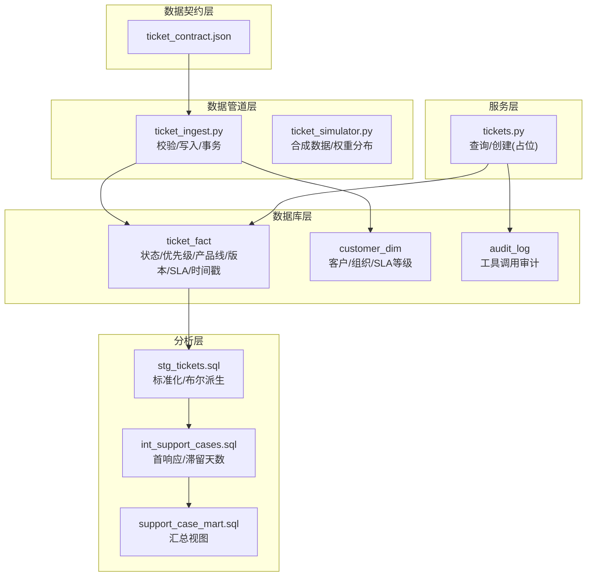
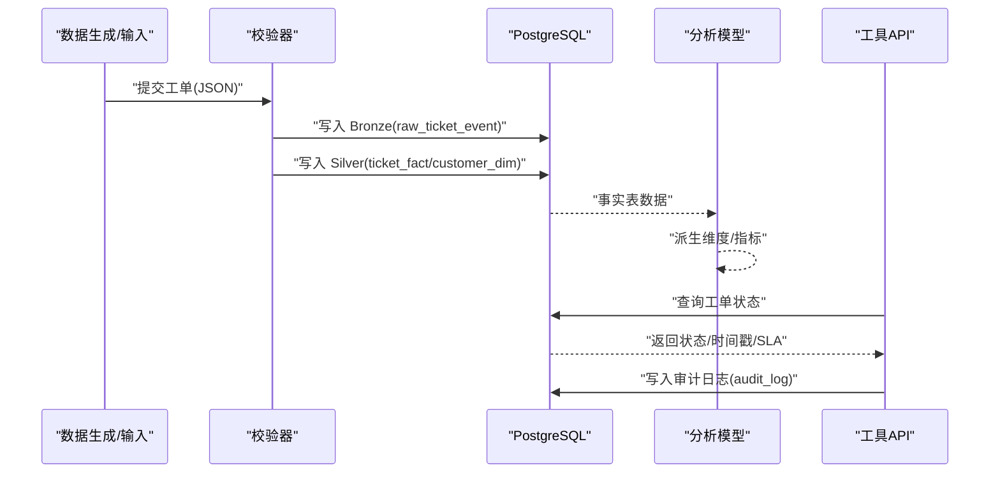
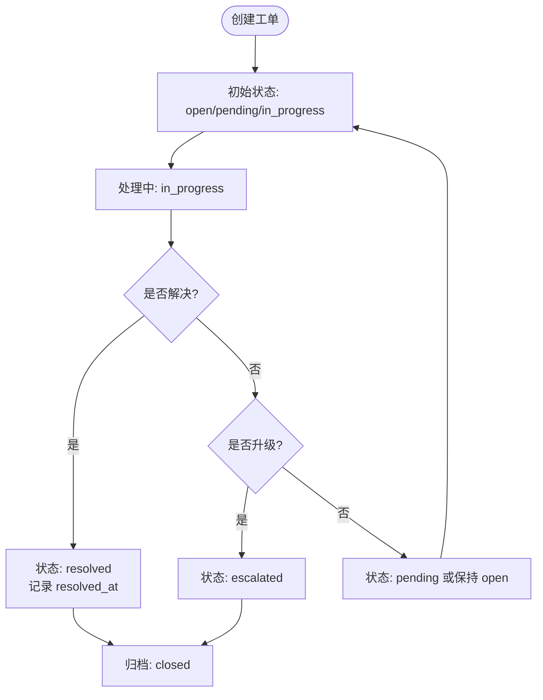
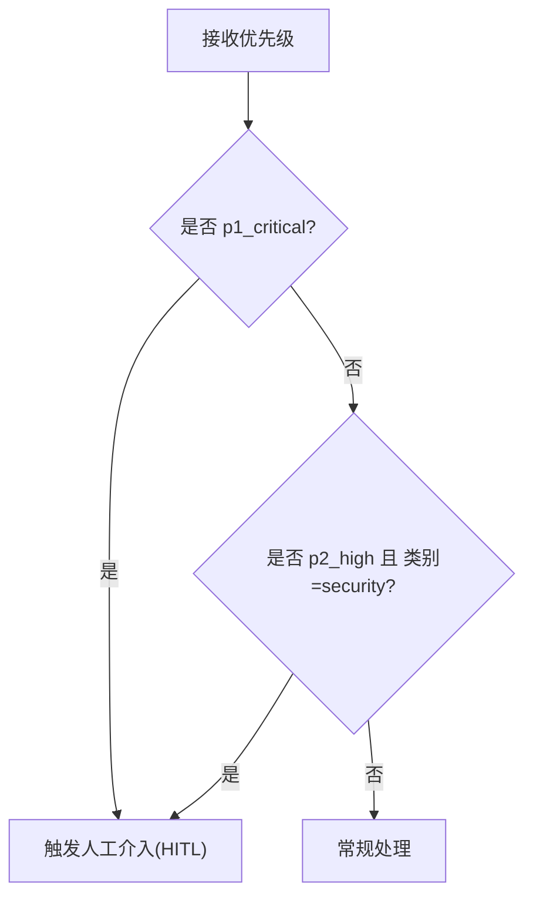
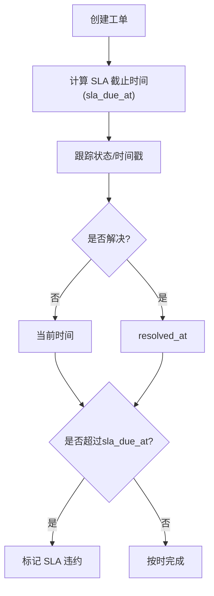
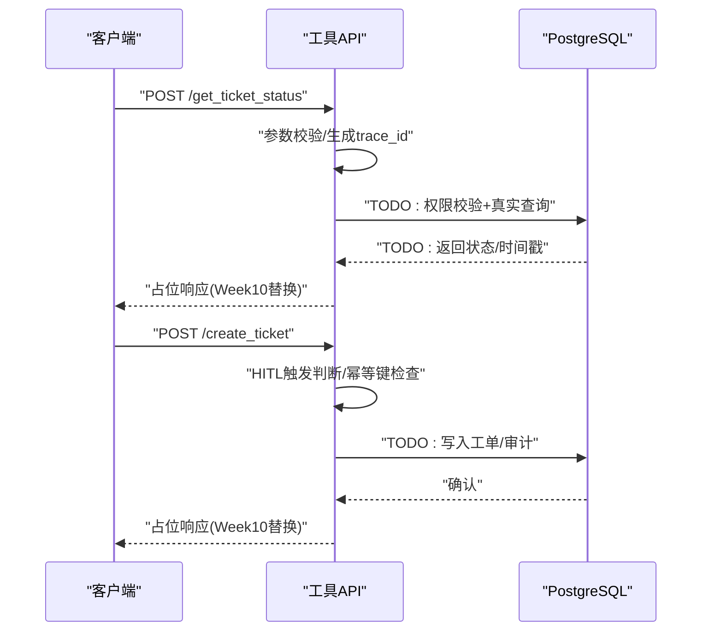
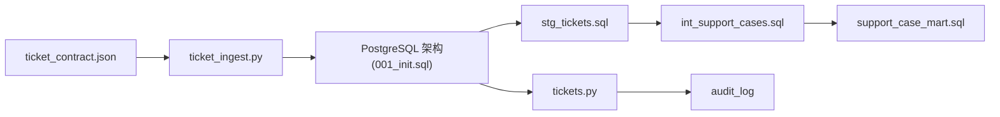

# 工单状态管理

<cite>
**本文引用的文件**
- [001_init.sql](file://infra/migrations/001_init.sql)
- [ticket_contract.json](file://contracts/data/ticket_contract.json)
- [ticket_ingest.py](file://pipelines/ingestion/ticket_ingest.py)
- [ticket_simulator.py](file://data/synthetic_generators/ticket_simulator.py)
- [stg_tickets.sql](file://analytics/models/staging/stg_tickets.sql)
- [int_support_cases.sql](file://analytics/models/intermediate/int_support_cases.sql)
- [support_case_mart.sql](file://analytics/models/marts/support_case_mart.sql)
- [tickets.py](file://services/tool_api/app/routers/tickets.py)
</cite>

## 目录
1. [简介](#简介)
2. [项目结构](#项目结构)
3. [核心组件](#核心组件)
4. [架构总览](#架构总览)
5. [详细组件分析](#详细组件分析)
6. [依赖分析](#依赖分析)
7. [性能考虑](#性能考虑)
8. [故障排查指南](#故障排查指南)
9. [结论](#结论)
10. [附录](#附录)

## 简介
本文件围绕工单状态管理进行系统性梳理，覆盖状态定义与流转、优先级与紧急度、分类与产品线版本、SLA 计算与截止时间、状态查询接口、状态历史与审计、业务规则与并发控制等主题。内容以仓库中实际实现为依据，结合数据库模式、数据契约、数据管道与服务接口，形成可操作、可验证的文档。

## 项目结构
本项目采用分层数据架构与多模块协作：
- 数据契约层：定义工单字段与枚举约束，确保输入一致性
- 数据库层：定义状态、优先级、产品线、SLA 等枚举类型及事实表结构
- 数据管道层：负责工单数据的校验、写入与批处理
- 分析层：对工单事实表进行清洗、派生维度与指标计算
- 服务层：提供工单查询与创建的工具接口（占位实现）

**图表来源**
- [001_init.sql:90-132](file://infra/migrations/001_init.sql#L90-L132)
- [ticket_ingest.py:108-169](file://pipelines/ingestion/ticket_ingest.py#L108-L169)
- [stg_tickets.sql:5-42](file://analytics/models/staging/stg_tickets.sql#L5-L42)
- [int_support_cases.sql:17-61](file://analytics/models/intermediate/int_support_cases.sql#L17-L61)
- [support_case_mart.sql:1-30](file://analytics/models/marts/support_case_mart.sql#L1-L30)
- [tickets.py:50-124](file://services/tool_api/app/routers/tickets.py#L50-L124)

**章节来源**
- [001_init.sql:10-31](file://infra/migrations/001_init.sql#L10-L31)
- [ticket_contract.json:38-57](file://contracts/data/ticket_contract.json#L38-L57)
- [ticket_ingest.py:108-169](file://pipelines/ingestion/ticket_ingest.py#L108-L169)
- [stg_tickets.sql:5-42](file://analytics/models/staging/stg_tickets.sql#L5-L42)
- [int_support_cases.sql:17-61](file://analytics/models/intermediate/int_support_cases.sql#L17-L61)
- [support_case_mart.sql:1-30](file://analytics/models/marts/support_case_mart.sql#L1-L30)
- [tickets.py:50-124](file://services/tool_api/app/routers/tickets.py#L50-L124)

## 核心组件
- 枚举类型与表结构
  - 状态枚举：open、pending、in_progress、resolved、closed、escalated
  - 优先级枚举：p1_critical、p2_high、p3_medium、p4_low
  - 产品线枚举：northstar_workspace、northstar_edge_gateway、northstar_studio、cross_product
  - SLA 等级枚举：enterprise、professional、standard、free
  - 工单事实表包含状态、优先级、产品线、版本、SLA 截止时间、创建/更新/解决时间戳等字段
- 数据契约
  - 明确必填字段、枚举取值范围与长度限制，保障输入一致性
- 数据管道
  - 校验 JSON Schema 与业务规则；批量写入 Bronze/Silver 层；事务保证一致性
- 分析模型
  - 标准化状态/优先级大小写；派生布尔维度（是否开放、是否已解决、是否加急、是否 SLA 违约）
  - 计算首响应时长（分钟）、滞留时长（天）
- 服务接口
  - 提供查询与创建工单的占位实现，预留权限校验、真实查询与审计落库

**章节来源**
- [001_init.sql:10-31](file://infra/migrations/001_init.sql#L10-L31)
- [001_init.sql:90-132](file://infra/migrations/001_init.sql#L90-L132)
- [ticket_contract.json:8-12](file://contracts/data/ticket_contract.json#L8-L12)
- [ticket_ingest.py:61-78](file://pipelines/ingestion/ticket_ingest.py#L61-L78)
- [stg_tickets.sql:30-38](file://analytics/models/staging/stg_tickets.sql#L30-L38)
- [int_support_cases.sql:46-55](file://analytics/models/intermediate/int_support_cases.sql#L46-L55)
- [tickets.py:50-124](file://services/tool_api/app/routers/tickets.py#L50-L124)

## 架构总览
下图展示从数据输入到状态查询与审计的全链路：

**图表来源**
- [ticket_ingest.py:82-169](file://pipelines/ingestion/ticket_ingest.py#L82-L169)
- [001_init.sql:60-132](file://infra/migrations/001_init.sql#L60-L132)
- [stg_tickets.sql:5-42](file://analytics/models/staging/stg_tickets.sql#L5-L42)
- [tickets.py:50-124](file://services/tool_api/app/routers/tickets.py#L50-L124)

## 详细组件分析

### 状态定义与流转
- 状态枚举与默认值
  - 数据库定义了完整的状态枚举，并在工单事实表中设置默认状态为 open
- 流转路径与边界
  - 从合成数据看，初始状态包含 open、pending、in_progress、resolved、closed，其中 resolved/closed 会携带 resolved_at
  - 分析层对状态进行小写化与布尔派生，支持 is_open、is_resolved、is_escalated
- 状态更新时机
  - 写入时遵循 ON CONFLICT 更新 status、updated_at、resolved_at、data_release_id
  - 分析层通过 coalesce(updated_at, created_at) 保证查询稳定性

**图表来源**
- [001_init.sql:11-13](file://infra/migrations/001_init.sql#L11-L13)
- [ticket_ingest.py:141-146](file://pipelines/ingestion/ticket_ingest.py#L141-L146)
- [stg_tickets.sql:30-32](file://analytics/models/staging/stg_tickets.sql#L30-L32)
- [ticket_simulator.py:144-151](file://data/synthetic_generators/ticket_simulator.py#L144-L151)

**章节来源**
- [001_init.sql:11-13](file://infra/migrations/001_init.sql#L11-L13)
- [001_init.sql:94](file://infra/migrations/001_init.sql#L94)
- [ticket_ingest.py:141-146](file://pipelines/ingestion/ticket_ingest.py#L141-L146)
- [stg_tickets.sql:30-32](file://analytics/models/staging/stg_tickets.sql#L30-L32)
- [ticket_simulator.py:144-151](file://data/synthetic_generators/ticket_simulator.py#L144-L151)

### 优先级系统与紧急度
- 优先级枚举
  - p1_critical、p2_high、p3_medium、p4_low
- 紧急度触发
  - 工具接口中定义了 p1_critical 直接触发人工介入，p2_high 且 category=security 也触发
- 业务含义
  - 分析层将 p1_critical/p1 归类为 is_p1，便于 KPI 统计

**图表来源**
- [001_init.sql:15-17](file://infra/migrations/001_init.sql#L15-L17)
- [tickets.py:127-134](file://services/tool_api/app/routers/tickets.py#L127-L134)
- [stg_tickets.sql:33-33](file://analytics/models/staging/stg_tickets.sql#L33-L33)

**章节来源**
- [001_init.sql:15-17](file://infra/migrations/001_init.sql#L15-L17)
- [tickets.py:127-134](file://services/tool_api/app/routers/tickets.py#L127-L134)
- [stg_tickets.sql:33-33](file://analytics/models/staging/stg_tickets.sql#L33-L33)

### 分类体系、产品线归属与版本管理
- 分类枚举
  - installation、configuration、connectivity、authentication、billing、feature_request、bug_report、documentation、performance、security、other
- 产品线与版本
  - 产品线枚举：northstar_workspace、northstar_edge_gateway、northstar_studio、cross_product
  - 产品版本字段用于记录受影响版本
- 数据来源
  - 合成数据按产品线分配版本集合，类别与错误码相互匹配

**章节来源**
- [ticket_contract.json:48-56](file://contracts/data/ticket_contract.json#L48-L56)
- [ticket_contract.json:58-61](file://contracts/data/ticket_contract.json#L58-L61)
- [ticket_contract.json:54-56](file://contracts/data/ticket_contract.json#L54-L56)
- [ticket_simulator.py:19-35](file://data/synthetic_generators/ticket_simulator.py#L19-L35)
- [ticket_simulator.py:25-29](file://data/synthetic_generators/ticket_simulator.py#L25-L29)

### SLA 计算、截止时间与状态更新时机
- SLA 等级与截止时间
  - SLA 等级枚举：enterprise、professional、standard、free
  - 合成数据按等级设定不同小时数的 SLA 期限
- SLA 违约判定
  - 分析层在 resolved_at 存在时以 resolved_at 计算滞留天数；否则以当前时间计算
  - 当 resolved_at 或当前时间超过 sla_due_at 时标记为 sla_breached
- 写入与更新
  - 写入时将 sla_due_at 解析为 TIMESTAMPTZ
  - ON CONFLICT 更新 resolved_at 与 updated_at，确保状态变更时间同步

**图表来源**
- [ticket_contract.json:83-90](file://contracts/data/ticket_contract.json#L83-L90)
- [ticket_simulator.py:140-141](file://data/synthetic_generators/ticket_simulator.py#L140-L141)
- [stg_tickets.sql:34-38](file://analytics/models/staging/stg_tickets.sql#L34-L38)
- [int_support_cases.sql:51-55](file://analytics/models/intermediate/int_support_cases.sql#L51-L55)
- [ticket_ingest.py:113-113](file://pipelines/ingestion/ticket_ingest.py#L113-L113)
- [ticket_ingest.py:141-146](file://pipelines/ingestion/ticket_ingest.py#L141-L146)

**章节来源**
- [ticket_contract.json:83-90](file://contracts/data/ticket_contract.json#L83-L90)
- [ticket_simulator.py:140-141](file://data/synthetic_generators/ticket_simulator.py#L140-L141)
- [stg_tickets.sql:34-38](file://analytics/models/staging/stg_tickets.sql#L34-L38)
- [int_support_cases.sql:51-55](file://analytics/models/intermediate/int_support_cases.sql#L51-L55)
- [ticket_ingest.py:113-113](file://pipelines/ingestion/ticket_ingest.py#L113-L113)
- [ticket_ingest.py:141-146](file://pipelines/ingestion/ticket_ingest.py#L141-L146)

### 状态查询接口实现细节
- 接口能力
  - get_ticket_status：占位返回 open/p3_medium 等信息，预留权限校验与真实查询
  - create_ticket：占位返回 open 状态与 SLA 截止时间占位，预留幂等键检查与审计落库
- 参数与校验
  - 优先级格式校验：p1/p2/p3/p4 + _ + critical/high/medium/low
  - 工单 ID 格式：TKT-YYYYMMDD-XXXXXX
- 审计与追踪
  - 生成 trace_id 与审计日志对象，预留写入 audit_log 表

**图表来源**
- [tickets.py:50-124](file://services/tool_api/app/routers/tickets.py#L50-L124)
- [001_init.sql:217-229](file://infra/migrations/001_init.sql#L217-L229)

**章节来源**
- [tickets.py:50-124](file://services/tool_api/app/routers/tickets.py#L50-L124)
- [001_init.sql:217-229](file://infra/migrations/001_init.sql#L217-L229)

### 状态历史记录与状态变更审计
- 历史记录
  - 工单事实表包含 created_at、updated_at、resolved_at，便于追踪状态变更时间线
- 审计日志
  - 工具调用审计表包含 request_id、actor、tool_name、args_hash、result_code、hitl_triggered、trace_id、release_id 等字段
- 分析层派生
  - is_open、is_resolved、is_escalated、is_p1、sla_breached 等维度便于报表与 KPI 计算

**章节来源**
- [001_init.sql:90-113](file://infra/migrations/001_init.sql#L90-L113)
- [001_init.sql:217-229](file://infra/migrations/001_init.sql#L217-L229)
- [stg_tickets.sql:30-38](file://analytics/models/staging/stg_tickets.sql#L30-L38)

### 业务规则、异常处理与并发控制
- 业务规则
  - JSON Schema 校验 + 自定义业务规则（如 ticket_id 前缀、created_at 必填）
- 异常处理
  - 写入阶段捕获数据库异常并统计错误数；日志记录失败工单
- 并发控制
  - 写入使用事务包裹，确保同一工单的 Bronze/Silver 写入原子性
  - ON CONFLICT 更新策略避免重复主键冲突

**章节来源**
- [ticket_ingest.py:61-78](file://pipelines/ingestion/ticket_ingest.py#L61-L78)
- [ticket_ingest.py:237-244](file://pipelines/ingestion/ticket_ingest.py#L237-L244)
- [ticket_ingest.py:237-240](file://pipelines/ingestion/ticket_ingest.py#L237-L240)

## 依赖分析
- 数据契约驱动数据管道
  - ticket_contract.json 约束字段与枚举，ticket_ingest.py 严格校验后写入数据库
- 数据库模式支撑分析与服务
  - 001_init.sql 定义枚举与表结构，stg_tickets.sql 与 int_support_cases.sql 在分析层派生维度与指标
- 服务接口依赖数据库与审计
  - tickets.py 依赖数据库查询与审计日志表

**图表来源**
- [ticket_contract.json:8-12](file://contracts/data/ticket_contract.json#L8-L12)
- [ticket_ingest.py:61-78](file://pipelines/ingestion/ticket_ingest.py#L61-L78)
- [001_init.sql:10-31](file://infra/migrations/001_init.sql#L10-L31)
- [stg_tickets.sql:5-42](file://analytics/models/staging/stg_tickets.sql#L5-L42)
- [int_support_cases.sql:17-61](file://analytics/models/intermediate/int_support_cases.sql#L17-L61)
- [support_case_mart.sql:1-30](file://analytics/models/marts/support_case_mart.sql#L1-L30)
- [tickets.py:50-124](file://services/tool_api/app/routers/tickets.py#L50-L124)

**章节来源**
- [ticket_contract.json:8-12](file://contracts/data/ticket_contract.json#L8-L12)
- [ticket_ingest.py:61-78](file://pipelines/ingestion/ticket_ingest.py#L61-L78)
- [001_init.sql:10-31](file://infra/migrations/001_init.sql#L10-L31)
- [stg_tickets.sql:5-42](file://analytics/models/staging/stg_tickets.sql#L5-L42)
- [int_support_cases.sql:17-61](file://analytics/models/intermediate/int_support_cases.sql#L17-L61)
- [support_case_mart.sql:1-30](file://analytics/models/marts/support_case_mart.sql#L1-L30)
- [tickets.py:50-124](file://services/tool_api/app/routers/tickets.py#L50-L124)

## 性能考虑
- 索引设计
  - 工单事实表针对 status、priority、product_line、customer_id、created_at 建有索引，有利于查询与分析
- 写入性能
  - 批量写入 + 事务包裹，减少往返开销；ON CONFLICT 更新避免重复插入
- 分析性能
  - 小写化与布尔派生在查询时一次性完成，降低下游复杂度

**章节来源**
- [001_init.sql:115-119](file://infra/migrations/001_init.sql#L115-L119)
- [ticket_ingest.py:237-240](file://pipelines/ingestion/ticket_ingest.py#L237-L240)

## 故障排查指南
- 输入校验失败
  - 检查 ticket_id 格式、created_at 是否缺失、字段是否超出长度限制
- 写入异常
  - 关注错误计数与日志输出，定位具体工单 ID；确认数据库连接与权限
- 状态不一致
  - 核对 resolved_at 与 updated_at 更新逻辑；确认 SLA 截止时间解析是否正确
- 审计缺失
  - 确认审计日志表是否存在、字段是否完整；检查服务接口是否调用写入逻辑

**章节来源**
- [ticket_ingest.py:237-244](file://pipelines/ingestion/ticket_ingest.py#L237-L244)
- [ticket_ingest.py:256-268](file://pipelines/ingestion/ticket_ingest.py#L256-L268)
- [tickets.py:104-112](file://services/tool_api/app/routers/tickets.py#L104-L112)

## 结论
本项目在数据契约、数据库模式、数据管道、分析模型与服务接口层面形成了完整的工单状态管理体系。状态、优先级、产品线与 SLA 的枚举约束确保了数据一致性；写入阶段的校验与事务提供了强健的并发控制；分析层派生的维度与指标为运营与 KPI 提供了可靠基础；服务接口预留了权限校验与审计落库，具备进一步演进为生产级状态管理的能力。

## 附录
- 关键字段与枚举速览
  - 状态：open、pending、in_progress、resolved、closed、escalated
  - 优先级：p1_critical、p2_high、p3_medium、p4_low
  - 产品线：northstar_workspace、northstar_edge_gateway、northstar_studio、cross_product
  - SLA 等级：enterprise、professional、standard、free
- 重要 SQL 片段路径
  - [状态枚举定义:11-13](file://infra/migrations/001_init.sql#L11-L13)
  - [优先级枚举定义:15-17](file://infra/migrations/001_init.sql#L15-L17)
  - [产品线枚举定义:19-22](file://infra/migrations/001_init.sql#L19-L22)
  - [工单事实表结构:90-113](file://infra/migrations/001_init.sql#L90-L113)
  - [JSON Schema 校验:61-78](file://pipelines/ingestion/ticket_ingest.py#L61-L78)
  - [写入 Silver 层(含 ON CONFLICT):130-169](file://pipelines/ingestion/ticket_ingest.py#L130-L169)
  - [布尔维度派生(is_open/is_resolved/is_escalated/is_p1/sla_breached):30-38](file://analytics/models/staging/stg_tickets.sql#L30-L38)
  - [首响应/滞留计算:46-55](file://analytics/models/intermediate/int_support_cases.sql#L46-L55)
  - [查询接口占位实现:50-124](file://services/tool_api/app/routers/tickets.py#L50-L124)
  - [审计日志表结构:217-229](file://infra/migrations/001_init.sql#L217-L229)