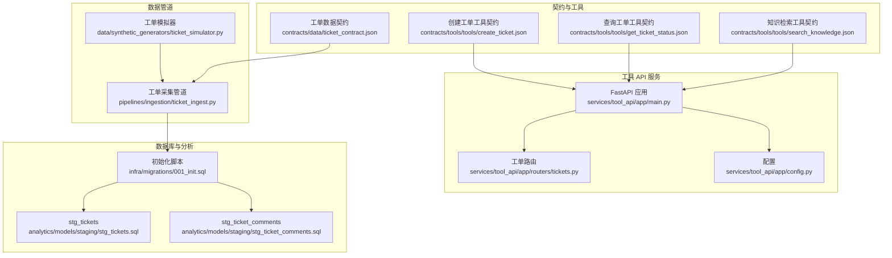
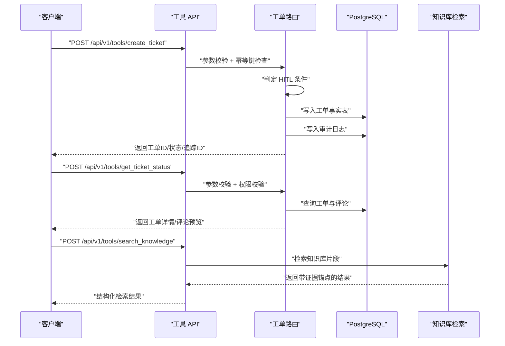
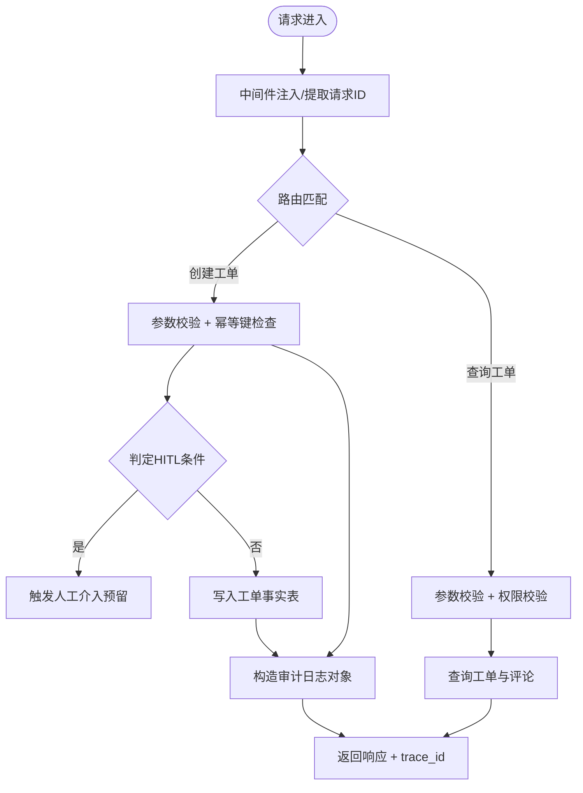
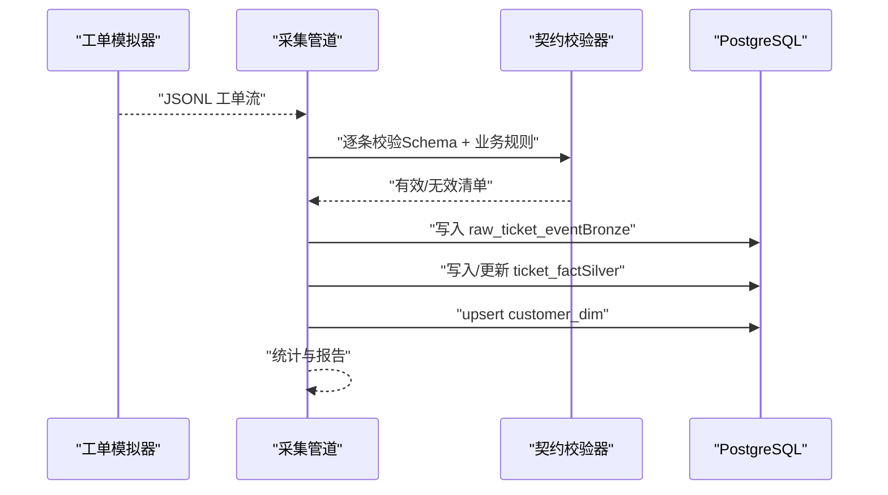
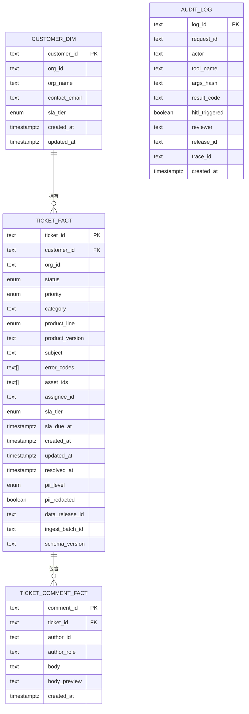
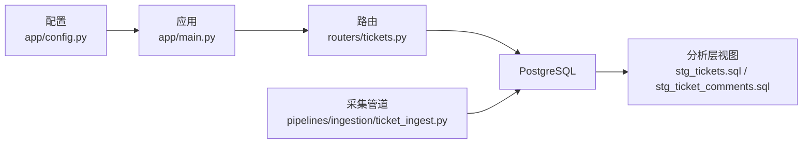

# 工单管理功能

<cite>
**本文档引用的文件**
- [contracts/data/ticket_contract.json](file://contracts/data/ticket_contract.json)
- [contracts/tools/tools/create_ticket.json](file://contracts/tools/tools/create_ticket.json)
- [contracts/tools/tools/get_ticket_status.json](file://contracts/tools/tools/get_ticket_status.json)
- [contracts/tools/tools/search_knowledge.json](file://contracts/tools/tools/search_knowledge.json)
- [services/tool_api/app/routers/tickets.py](file://services/tool_api/app/routers/tickets.py)
- [services/tool_api/app/main.py](file://services/tool_api/app/main.py)
- [services/tool_api/app/config.py](file://services/tool_api/app/config.py)
- [pipelines/ingestion/ticket_ingest.py](file://pipelines/ingestion/ticket_ingest.py)
- [data/synthetic_generators/ticket_simulator.py](file://data/synthetic_generators/ticket_simulator.py)
- [analytics/models/staging/stg_tickets.sql](file://analytics/models/staging/stg_tickets.sql)
- [analytics/models/staging/stg_ticket_comments.sql](file://analytics/models/staging/stg_ticket_comments.sql)
- [infra/migrations/001_init.sql](file://infra/migrations/001_init.sql)
</cite>

## 目录
1. [简介](#简介)
2. [项目结构](#项目结构)
3. [核心组件](#核心组件)
4. [架构总览](#架构总览)
5. [详细组件分析](#详细组件分析)
6. [依赖分析](#依赖分析)
7. [性能考虑](#性能考虑)
8. [故障排除指南](#故障排除指南)
9. [结论](#结论)
10. [附录](#附录)

## 简介
本文件系统性梳理 OmniSupport Copilot 工单管理功能的实现架构与运行机制，覆盖工单 CRUD 的设计与落地路径、状态与优先级管理、分类体系、工具调用与参数校验、业务规则与人工介入（HITL）触发、与知识库的关联与证据链生成、审计日志记录、查询接口的分页与排序能力，以及错误处理与性能优化建议。文档以仓库现有契约、工具定义与服务端骨架代码为基础，结合数据湖与分析层建模，形成从“契约—工具—服务—存储—分析”的全链路说明。

## 项目结构
围绕工单管理的关键模块与文件如下：
- 数据契约与工具契约：定义工单字段、枚举、输入输出约束与失败码
- 工具 API 服务：提供工单查询与创建的 HTTP 端点，具备请求追踪与审计日志框架
- 数据管道：负责工单数据的批量采集、契约校验与写入湖仓
- 数据库初始化：定义工单相关表结构、索引与枚举类型
- 分析层建模：提供工单事实表与评论维度的标准化视图

图表来源
- [services/tool_api/app/main.py:1-64](file://services/tool_api/app/main.py#L1-L64)
- [services/tool_api/app/routers/tickets.py:1-134](file://services/tool_api/app/routers/tickets.py#L1-L134)
- [pipelines/ingestion/ticket_ingest.py:1-322](file://pipelines/ingestion/ticket_ingest.py#L1-L322)
- [infra/migrations/001_init.sql:1-288](file://infra/migrations/001_init.sql#L1-L288)
- [analytics/models/staging/stg_tickets.sql:1-43](file://analytics/models/staging/stg_tickets.sql#L1-L43)
- [analytics/models/staging/stg_ticket_comments.sql:1-9](file://analytics/models/staging/stg_ticket_comments.sql#L1-L9)

章节来源
- [services/tool_api/app/main.py:1-64](file://services/tool_api/app/main.py#L1-L64)
- [services/tool_api/app/routers/tickets.py:1-134](file://services/tool_api/app/routers/tickets.py#L1-L134)
- [pipelines/ingestion/ticket_ingest.py:1-322](file://pipelines/ingestion/ticket_ingest.py#L1-L322)
- [infra/migrations/001_init.sql:1-288](file://infra/migrations/001_init.sql#L1-L288)
- [analytics/models/staging/stg_tickets.sql:1-43](file://analytics/models/staging/stg_tickets.sql#L1-L43)
- [analytics/models/staging/stg_ticket_comments.sql:1-9](file://analytics/models/staging/stg_ticket_comments.sql#L1-L9)

## 核心组件
- 工单数据契约：定义字段、必填项、枚举取值范围与长度限制，确保数据一致性与合规性
- 工单工具契约：规范创建与查询的输入输出、角色权限、幂等键、失败码与人工介入条件
- 工具 API 服务：提供 HTTP 端点，内置请求追踪、异常处理与审计日志框架
- 数据采集与入库：批量读取 JSONL，校验契约，写入 Bronze/Silver 层
- 数据库与分析层：定义工单事实表、评论维度与派生指标，支撑查询与报表

章节来源
- [contracts/data/ticket_contract.json:1-125](file://contracts/data/ticket_contract.json#L1-L125)
- [contracts/tools/tools/create_ticket.json:1-95](file://contracts/tools/tools/create_ticket.json#L1-L95)
- [contracts/tools/tools/get_ticket_status.json:1-67](file://contracts/tools/tools/get_ticket_status.json#L1-L67)
- [services/tool_api/app/routers/tickets.py:1-134](file://services/tool_api/app/routers/tickets.py#L1-L134)
- [pipelines/ingestion/ticket_ingest.py:1-322](file://pipelines/ingestion/ticket_ingest.py#L1-L322)
- [infra/migrations/001_init.sql:1-288](file://infra/migrations/001_init.sql#L1-L288)
- [analytics/models/staging/stg_tickets.sql:1-43](file://analytics/models/staging/stg_tickets.sql#L1-L43)
- [analytics/models/staging/stg_ticket_comments.sql:1-9](file://analytics/models/staging/stg_ticket_comments.sql#L1-L9)

## 架构总览
下图展示从“工具调用—服务处理—数据库—分析层”的整体流转，以及与知识库检索的关联。

图表来源
- [services/tool_api/app/routers/tickets.py:50-134](file://services/tool_api/app/routers/tickets.py#L50-L134)
- [services/tool_api/app/main.py:39-64](file://services/tool_api/app/main.py#L39-L64)
- [contracts/tools/tools/create_ticket.json:1-95](file://contracts/tools/tools/create_ticket.json#L1-L95)
- [contracts/tools/tools/get_ticket_status.json:1-67](file://contracts/tools/tools/get_ticket_status.json#L1-L67)
- [contracts/tools/tools/search_knowledge.json:1-93](file://contracts/tools/tools/search_knowledge.json#L1-L93)
- [infra/migrations/001_init.sql:90-132](file://infra/migrations/001_init.sql#L90-L132)

## 详细组件分析

### 工单数据契约与字段语义
- 关键字段与约束
  - 标识与溯源：ticket_id、schema_version、source_id、ingest_batch_id
  - 客户与组织：customer_id、org_id
  - 状态与优先级：status（枚举）、priority（枚举）
  - 分类与产品线：category（枚举）、product_line（枚举）
  - 版本与主题：product_version、subject、description
  - 影响要素：error_codes、asset_ids
  - 责任与 SLA：assignee_id、sla_tier、sla_due_at
  - 时间戳：created_at、updated_at、resolved_at
  - PII 与质量门禁：pii_level、pii_redacted、quality_gate
  - 其他：owner、tags
- 字段复杂度与存储影响
  - 数组字段（如 error_codes、asset_ids）在数据库中通常映射为文本数组或 JSONB，需注意查询与索引策略
  - 时间戳字段支持精确到微秒的排序与过滤
  - 枚举类型减少非法值风险，提升查询效率

章节来源
- [contracts/data/ticket_contract.json:13-122](file://contracts/data/ticket_contract.json#L13-L122)

### 工单工具调用与参数验证
- 创建工单（create_ticket）
  - 输入：subject、description、priority、product_line、category、product_version、error_codes、asset_ids、idempotency_key
  - 输出：ticket_id、status、sla_due_at、created_at、hitl_triggered、trace_id、release_id
  - 幂等性：支持 idempotency_key，避免重复创建
  - 人工介入（HITL）：当 priority 为 p1_critical 或 priority=p2_high 且 category=security 时触发
  - 审计：记录输入/输出、调用者、保留期等
- 查询工单（get_ticket_status）
  - 输入：ticket_id、include_comments
  - 输出：ticket_id、status、priority、category、product_line、assignee_id、sla_due_at、时间戳、评论预览、trace_id、release_id
  - 权限：允许 end_user/support_agent/admin；end_user 仅能查询自身工单（待实现）
- 知识检索（search_knowledge）
  - 输入：query、product_line、modalities、top_k、min_score
  - 输出：results（chunk_id、content、score、evidence_anchor）、trace_id、release_id
  - 证据锚点：包含 source_id、source_url、page_no、section_path、doc_version

章节来源
- [contracts/tools/tools/create_ticket.json:5-95](file://contracts/tools/tools/create_ticket.json#L5-L95)
- [contracts/tools/tools/get_ticket_status.json:5-67](file://contracts/tools/tools/get_ticket_status.json#L5-L67)
- [contracts/tools/tools/search_knowledge.json:5-93](file://contracts/tools/tools/search_knowledge.json#L5-L93)

### 工具 API 服务与控制流
- 请求追踪与异常处理
  - 中间件注入 X-Request-ID，便于跨服务追踪
  - 全局异常处理器统一返回内部错误结构
- 工单端点
  - GET/POST：提供健康检查与工具端点
  - create_ticket：骨架实现包含幂等键检查框架、HITL 触发判断与审计日志对象
  - get_ticket_status：骨架实现包含参数校验与占位响应
- 配置
  - 数据库连接串、OTel 服务名与导出端点、release_id、指标注册路径、HITL Webhook 配置预留

图表来源
- [services/tool_api/app/main.py:39-64](file://services/tool_api/app/main.py#L39-L64)
- [services/tool_api/app/routers/tickets.py:81-134](file://services/tool_api/app/routers/tickets.py#L81-L134)

章节来源
- [services/tool_api/app/main.py:1-64](file://services/tool_api/app/main.py#L1-L64)
- [services/tool_api/app/routers/tickets.py:1-134](file://services/tool_api/app/routers/tickets.py#L1-L134)
- [services/tool_api/app/config.py:4-19](file://services/tool_api/app/config.py#L4-L19)

### 数据采集与入库（批量）
- 流程概览
  - 读取 JSONL 合成工单
  - 加载工单契约 schema，进行 JSON Schema 校验与业务规则校验
  - 写入 Bronze 层 raw_ticket_event（去重基于 event_id）
  - 写入 Silver 层 ticket_fact（upsert，按 ticket_id 去重）
  - 维护 customer_dim（upsert），确保客户/组织维度存在
- 报告与统计
  - 输出汇总报告，包含 total/valid/invalid/inserted/errors 等指标
- 时间解析与索引
  - 统一解析 ISO 时间字符串，确保时区一致
  - 为关键字段建立索引，支撑查询与分析

图表来源
- [data/synthetic_generators/ticket_simulator.py:126-203](file://data/synthetic_generators/ticket_simulator.py#L126-L203)
- [pipelines/ingestion/ticket_ingest.py:61-170](file://pipelines/ingestion/ticket_ingest.py#L61-L170)

章节来源
- [pipelines/ingestion/ticket_ingest.py:1-322](file://pipelines/ingestion/ticket_ingest.py#L1-L322)
- [data/synthetic_generators/ticket_simulator.py:1-235](file://data/synthetic_generators/ticket_simulator.py#L1-L235)

### 数据库与分析层建模
- 表结构与索引
  - ticket_fact：主事实表，包含状态、优先级、分类、产品线、SLA、时间戳等
  - ticket_comment_fact：评论维度，生成 body_preview 便于快速浏览
  - customer_dim：客户/组织维度，维护 SLA 等属性
  - audit_log：审计日志表，记录工具调用、调用者、结果码与是否触发 HITL
- 分析层视图
  - stg_tickets：规范化字段、派生布尔列（is_open/is_resolved/is_escalated/is_p1）、SLA 是否逾期
  - stg_ticket_comments：评论维度的轻量化视图

图表来源
- [infra/migrations/001_init.sql:80-132](file://infra/migrations/001_init.sql#L80-L132)
- [analytics/models/staging/stg_tickets.sql:5-42](file://analytics/models/staging/stg_tickets.sql#L5-L42)
- [analytics/models/staging/stg_ticket_comments.sql:1-9](file://analytics/models/staging/stg_ticket_comments.sql#L1-L9)

章节来源
- [infra/migrations/001_init.sql:1-288](file://infra/migrations/001_init.sql#L1-L288)
- [analytics/models/staging/stg_tickets.sql:1-43](file://analytics/models/staging/stg_tickets.sql#L1-L43)
- [analytics/models/staging/stg_ticket_comments.sql:1-9](file://analytics/models/staging/stg_ticket_comments.sql#L1-L9)

### 工单状态管理、优先级与分类体系
- 状态：open、pending、in_progress、resolved、closed、escalated
- 优先级：p1_critical、p2_high、p3_medium、p4_low
- 分类：installation、configuration、connectivity、authentication、billing、feature_request、bug_report、documentation、performance、security、other
- 产品线：northstar_workspace、northstar_edge_gateway、northstar_studio、cross_product
- SLA 与到期：按 SLA tier 计算到期时间，分析层提供是否逾期的派生列

章节来源
- [contracts/data/ticket_contract.json:38-57](file://contracts/data/ticket_contract.json#L38-L57)
- [analytics/models/staging/stg_tickets.sql:30-38](file://analytics/models/staging/stg_tickets.sql#L30-L38)

### 工单查询接口实现细节、分页与排序
- 当前实现
  - get_ticket_status：支持 include_comments 控制是否返回评论预览
  - 工具契约允许返回最新 N 条评论（具体数量以实现为准）
- 分页与排序
  - 数据库侧已建立 created_at 等关键索引，便于分页与排序
  - 分页建议：基于游标（after/before）或基于 created_at 边界分页，避免深度分页
  - 排序建议：默认按 created_at DESC，支持 status、priority、product_line 等维度排序
- 权限控制
  - end_user 仅能查询自身工单（当前骨架未实现，后续需补充）

章节来源
- [services/tool_api/app/routers/tickets.py:50-78](file://services/tool_api/app/routers/tickets.py#L50-L78)
- [contracts/tools/tools/get_ticket_status.json:14-18](file://contracts/tools/tools/get_ticket_status.json#L14-L18)
- [infra/migrations/001_init.sql:115-119](file://infra/migrations/001_init.sql#L115-L119)

### 工单与知识库的关联、证据链与审计日志
- 关联关系
  - 工具层提供知识检索工具，返回带证据锚点的结果（evidence_anchor）
  - 证据锚点包含 source_id、source_url、page_no、section_path、doc_version，便于回溯来源
- 审计日志
  - 工具 API 预留审计日志表结构，记录请求 ID、调用者、工具名、参数哈希、结果码、是否触发 HITL、trace_id 等
  - 审计字段可配置输入/输出/调用者记录与保留期

章节来源
- [contracts/tools/tools/search_knowledge.json:40-70](file://contracts/tools/tools/search_knowledge.json#L40-L70)
- [services/tool_api/app/routers/tickets.py:104-123](file://services/tool_api/app/routers/tickets.py#L104-L123)
- [infra/migrations/001_init.sql:217-229](file://infra/migrations/001_init.sql#L217-L229)

### 工单 CRUD 操作流程（从骨架到落地）
- 创建（create_ticket）
  - 参数校验与幂等键检查（骨架）
  - HITL 条件判断（骨架）
  - 生成工单 ID（骨架）
  - 写入工单事实表与审计日志（骨架）
- 查询（get_ticket_status）
  - 参数校验（骨架）
  - 权限校验（待实现）
  - 查询工单与评论（待实现）
- 更新（待实现）
  - 建议：基于 PATCH 接口，支持状态变更、优先级调整、指派、评论等
  - 需要严格的权限校验与审计日志
- 删除（待实现）
  - 建议：软删除 + 归档，保留审计轨迹

章节来源
- [services/tool_api/app/routers/tickets.py:81-134](file://services/tool_api/app/routers/tickets.py#L81-L134)
- [contracts/tools/tools/create_ticket.json:80-89](file://contracts/tools/tools/create_ticket.json#L80-L89)
- [contracts/tools/tools/get_ticket_status.json:50-66](file://contracts/tools/tools/get_ticket_status.json#L50-L66)

## 依赖分析
- 组件耦合
  - 工具 API 依赖配置模块与路由模块，路由模块依赖工具契约与数据库访问
  - 数据管道依赖工单契约与数据库连接，输出至 Bronze/Silver 层
  - 分析层依赖数据库事实表与维度表
- 外部依赖
  - FastAPI、Pydantic（数据校验与序列化）
  - asyncpg（异步 PostgreSQL）
  - jsonschema（契约校验）
  - OpenTelemetry（可观测性，配置预留）

图表来源
- [services/tool_api/app/config.py:4-19](file://services/tool_api/app/config.py#L4-L19)
- [services/tool_api/app/main.py:15-64](file://services/tool_api/app/main.py#L15-L64)
- [services/tool_api/app/routers/tickets.py:14-16](file://services/tool_api/app/routers/tickets.py#L14-L16)
- [pipelines/ingestion/ticket_ingest.py:193-254](file://pipelines/ingestion/ticket_ingest.py#L193-L254)
- [analytics/models/staging/stg_tickets.sql:1-43](file://analytics/models/staging/stg_tickets.sql#L1-L43)
- [analytics/models/staging/stg_ticket_comments.sql:1-9](file://analytics/models/staging/stg_ticket_comments.sql#L1-L9)

章节来源
- [services/tool_api/app/config.py:4-19](file://services/tool_api/app/config.py#L4-L19)
- [services/tool_api/app/main.py:15-64](file://services/tool_api/app/main.py#L15-L64)
- [services/tool_api/app/routers/tickets.py:14-16](file://services/tool_api/app/routers/tickets.py#L14-L16)
- [pipelines/ingestion/ticket_ingest.py:193-254](file://pipelines/ingestion/ticket_ingest.py#L193-L254)
- [analytics/models/staging/stg_tickets.sql:1-43](file://analytics/models/staging/stg_tickets.sql#L1-L43)
- [analytics/models/staging/stg_ticket_comments.sql:1-9](file://analytics/models/staging/stg_ticket_comments.sql#L1-L9)

## 性能考虑
- 查询性能
  - 利用已建立的索引（状态、优先级、产品线、客户、创建时间）进行过滤与排序
  - 对高频查询字段（如 status、priority、product_line、customer_id）保持统计信息更新
- 写入性能
  - 批量写入（事务包裹）减少往返开销
  - 使用 upsert 降低重复写入成本
- 分页策略
  - 建议采用基于时间戳的游标分页，避免 OFFSET 深分页导致的性能退化
- 缓存与降级
  - 对热点工单详情与知识检索结果进行短期缓存
  - 在数据库不可用时返回明确的降级提示与重试指引

## 故障排除指南
- 常见失败码与处理
  - 创建工单：VALIDATION_ERROR、DUPLICATE_TICKET、QUOTA_EXCEEDED、DB_UNAVAILABLE
  - 查询工单：TICKET_NOT_FOUND、PERMISSION_DENIED、DB_UNAVAILABLE
  - 知识检索：RETRIEVAL_EMPTY、SCORE_TOO_LOW、INDEX_UNAVAILABLE、INVALID_QUERY
- 审计与追踪
  - 通过 trace_id 与 request_id 追踪请求链路
  - 审计日志记录输入/输出与调用者，便于回溯与合规审计
- 错误处理策略
  - 全局异常处理器统一返回结构化错误，包含 request_id 与 release_id
  - 对幂等键冲突返回原工单信息，避免重复处理

章节来源
- [contracts/tools/tools/create_ticket.json:74-79](file://contracts/tools/tools/create_ticket.json#L74-L79)
- [contracts/tools/tools/get_ticket_status.json:60-64](file://contracts/tools/tools/get_ticket_status.json#L60-L64)
- [contracts/tools/tools/search_knowledge.json:80-85](file://contracts/tools/tools/search_knowledge.json#L80-L85)
- [services/tool_api/app/main.py:48-58](file://services/tool_api/app/main.py#L48-L58)

## 结论
本工单管理功能以“契约—工具—服务—存储—分析”为主线，构建了从数据采集、入库、查询到分析的完整闭环。当前服务端为骨架实现，具备幂等、HITL 与审计日志框架；数据库与分析层已就绪，支持高效查询与派生指标。后续可在权限校验、评论与更新接口、分页排序、缓存与降级等方面进一步完善，以满足生产环境的稳定性与性能要求。

## 附录
- 示例场景
  - 新建工单：携带 subject、description、priority、product_line、category、idempotency_key，接收工单 ID 与是否触发 HITL
  - 查询工单：提供 ticket_id 与 include_comments，返回工单状态、优先级、评论预览与追踪 ID
  - 知识检索：提供 query、product_line、top_k、min_score，返回带证据锚点的结构化结果
- 最佳实践
  - 严格遵守工具契约与数据契约，确保输入合法性与一致性
  - 使用幂等键避免重复提交
  - 通过审计日志与 trace_id 进行问题定位与合规审计
  - 基于索引与游标分页优化查询性能