# 服务概览与架构

<cite>
**本文引用的文件**
- [services/tool_api/app/main.py](file://services/tool_api/app/main.py)
- [services/tool_api/app/config.py](file://services/tool_api/app/config.py)
- [services/tool_api/app/routers/health.py](file://services/tool_api/app/routers/health.py)
- [services/tool_api/app/routers/kpis.py](file://services/tool_api/app/routers/kpis.py)
- [services/tool_api/app/routers/tickets.py](file://services/tool_api/app/routers/tickets.py)
- [services/tool_api/app/kpi_query.py](file://services/tool_api/app/kpi_query.py)
- [services/tool_api/app/metric_registry.py](file://services/tool_api/app/metric_registry.py)
- [services/tool_api/Dockerfile](file://services/tool_api/Dockerfile)
- [services/tool_api/requirements.txt](file://services/tool_api/requirements.txt)
- [infra/docker-compose.yml](file://infra/docker-compose.yml)
- [analytics/metric_registry_v1.yml](file://analytics/metric_registry_v1.yml)
- [observability/otel/config.yaml](file://observability/otel/config.yaml)
- [pyproject.toml](file://pyproject.toml)
</cite>

## 目录
1. [简介](#简介)
2. [项目结构](#项目结构)
3. [核心组件](#核心组件)
4. [架构总览](#架构总览)
5. [详细组件分析](#详细组件分析)
6. [依赖关系分析](#依赖关系分析)
7. [性能考虑](#性能考虑)
8. [故障排查指南](#故障排查指南)
9. [结论](#结论)
10. [附录](#附录)

## 简介
本文件面向 Tool API 服务，提供从架构设计到运行机制的全景式说明。内容涵盖服务初始化、中间件与异常处理、生命周期管理、CORS 与请求 ID 追踪、版本与健康检查、全局异常策略、启动流程、配置加载与环境变量管理，并给出部署架构图与组件交互关系。

## 项目结构
Tool API 服务位于 services/tool_api 目录，采用 FastAPI 标准分层组织：入口应用、配置、路由、业务逻辑与指标注册表。Dockerfile 与 requirements.txt 定义了运行时依赖与镜像构建；docker-compose.yml 将其与数据库、可观测性栈集成；analytics 下的指标注册表定义了受控 KPI 查询的安全边界。

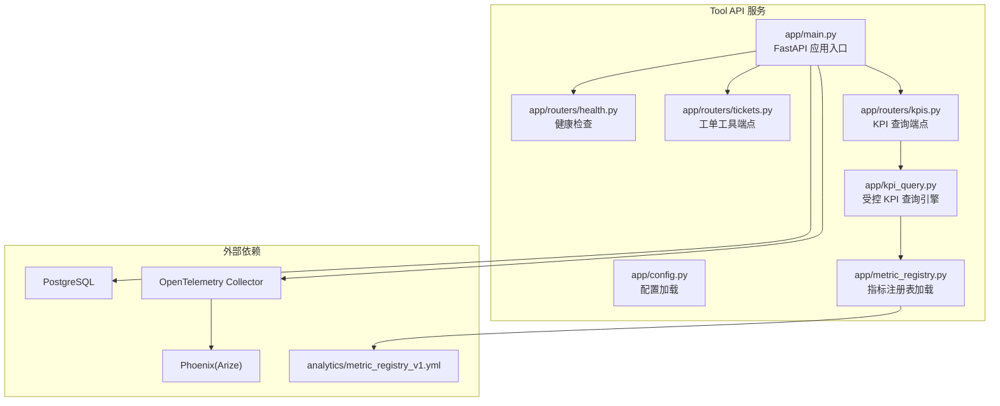

图表来源
- [services/tool_api/app/main.py:24-64](file://services/tool_api/app/main.py#L24-L64)
- [services/tool_api/app/routers/health.py:1-15](file://services/tool_api/app/routers/health.py#L1-L15)
- [services/tool_api/app/routers/tickets.py:1-134](file://services/tool_api/app/routers/tickets.py#L1-L134)
- [services/tool_api/app/routers/kpis.py:1-18](file://services/tool_api/app/routers/kpis.py#L1-L18)
- [services/tool_api/app/kpi_query.py:1-271](file://services/tool_api/app/kpi_query.py#L1-L271)
- [services/tool_api/app/metric_registry.py:1-82](file://services/tool_api/app/metric_registry.py#L1-L82)
- [analytics/metric_registry_v1.yml:1-56](file://analytics/metric_registry_v1.yml#L1-L56)
- [observability/otel/config.yaml:1-66](file://observability/otel/config.yaml#L1-L66)

章节来源
- [services/tool_api/app/main.py:1-64](file://services/tool_api/app/main.py#L1-L64)
- [services/tool_api/app/config.py:1-19](file://services/tool_api/app/config.py#L1-L19)
- [services/tool_api/Dockerfile:1-16](file://services/tool_api/Dockerfile#L1-L16)
- [services/tool_api/requirements.txt:1-14](file://services/tool_api/requirements.txt#L1-L14)
- [infra/docker-compose.yml:126-153](file://infra/docker-compose.yml#L126-L153)
- [analytics/metric_registry_v1.yml:1-56](file://analytics/metric_registry_v1.yml#L1-L56)
- [observability/otel/config.yaml:1-66](file://observability/otel/config.yaml#L1-L66)

## 核心组件
- 应用入口与生命周期
  - 使用 lifespan 钩子承载应用级生命周期，当前为空实现，便于后续扩展数据库连接、指标注册等。
  - 版本号在应用构造时声明，用于健康检查与对外展示。
- 中间件
  - CORS：允许任意来源与部分方法，满足跨域调试需求。
  - HTTP 中间件：注入并透传 X-Request-ID，统一追踪请求链路。
- 异常处理
  - 全局异常处理器捕获未处理异常，返回标准化错误体，包含请求 ID 与发布版本标识。
- 路由与端点
  - /health：健康检查，返回服务名、版本与发布 ID。
  - /api/v1/tools/tickets：工单工具端点（状态查询、创建），含占位实现与待完成 TODO 注释。
  - /api/v1/tools/kpis：受控 KPI 查询端点，对接指标注册表与安全视图。
- 配置与环境变量
  - 通过 pydantic-settings 从 .env 加载，支持数据库连接、OTel 导出端点、发布 ID、指标注册表路径等。
- 受控 KPI 查询引擎
  - 基于工具契约与指标注册表进行输入校验，生成参数化 SQL 访问安全视图，返回受控结果集并附带审计信息。
- 指标注册表
  - 定义可查询指标、维度、过滤字段、角色授权与时间窗口上限，确保查询安全与合规。

章节来源
- [services/tool_api/app/main.py:19-64](file://services/tool_api/app/main.py#L19-L64)
- [services/tool_api/app/routers/health.py:1-15](file://services/tool_api/app/routers/health.py#L1-L15)
- [services/tool_api/app/routers/tickets.py:1-134](file://services/tool_api/app/routers/tickets.py#L1-L134)
- [services/tool_api/app/routers/kpis.py:1-18](file://services/tool_api/app/routers/kpis.py#L1-L18)
- [services/tool_api/app/config.py:1-19](file://services/tool_api/app/config.py#L1-L19)
- [services/tool_api/app/kpi_query.py:1-271](file://services/tool_api/app/kpi_query.py#L1-L271)
- [services/tool_api/app/metric_registry.py:1-82](file://services/tool_api/app/metric_registry.py#L1-L82)

## 架构总览
下图展示了 Tool API 在整体系统中的位置与交互：容器内运行 FastAPI，通过 OTel Collector 上报追踪与指标，访问 PostgreSQL 存储，读取 analytics 的指标注册表以保障 KPI 查询安全。

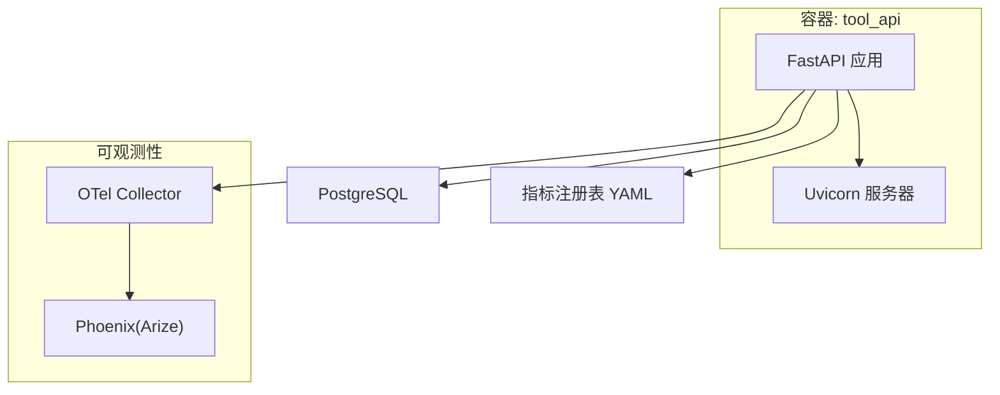

图表来源
- [services/tool_api/Dockerfile:1-16](file://services/tool_api/Dockerfile#L1-L16)
- [services/tool_api/app/main.py:24-64](file://services/tool_api/app/main.py#L24-L64)
- [observability/otel/config.yaml:1-66](file://observability/otel/config.yaml#L1-L66)
- [analytics/metric_registry_v1.yml:1-56](file://analytics/metric_registry_v1.yml#L1-L56)

## 详细组件分析

### 应用初始化与生命周期
- 初始化流程
  - 构造 FastAPI 应用实例，设置标题、描述、版本与生命周期钩子。
  - 配置 CORS 与 HTTP 中间件，注入请求 ID。
  - 注册路由：健康检查、工单工具、KPI 查询。
  - 全局异常处理器统一返回错误响应。
- 生命周期管理
  - 当前 lifespan 为空实现，适合后续挂载数据库连接池、指标导出器等资源。

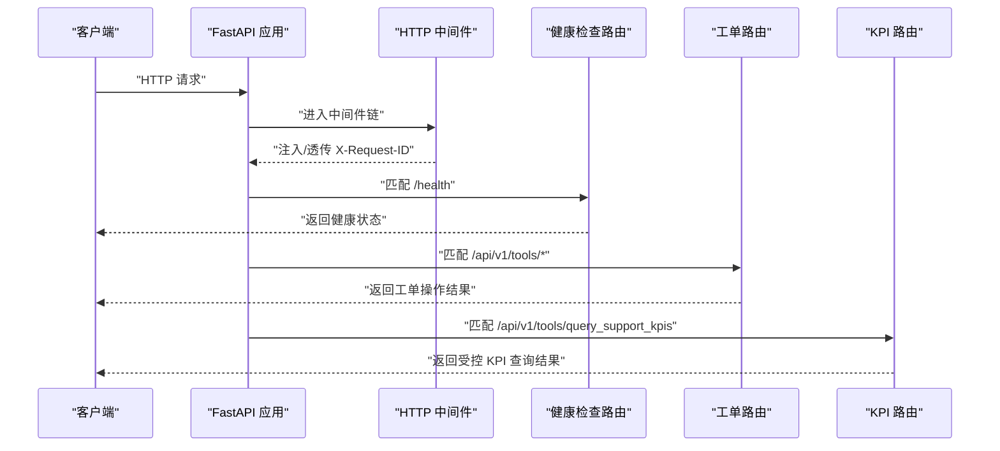

图表来源
- [services/tool_api/app/main.py:24-64](file://services/tool_api/app/main.py#L24-L64)
- [services/tool_api/app/routers/health.py:1-15](file://services/tool_api/app/routers/health.py#L1-L15)
- [services/tool_api/app/routers/tickets.py:1-134](file://services/tool_api/app/routers/tickets.py#L1-L134)
- [services/tool_api/app/routers/kpis.py:1-18](file://services/tool_api/app/routers/kpis.py#L1-L18)

章节来源
- [services/tool_api/app/main.py:19-64](file://services/tool_api/app/main.py#L19-L64)

### CORS 配置与请求 ID 追踪
- CORS
  - 允许任意来源与指定方法，便于前端跨域调试。
- 请求 ID 追踪
  - 中间件优先使用请求头 X-Request-ID，若缺失则生成新 ID。
  - 将 ID 写入请求 state，并在响应头中透传，便于全链路追踪。

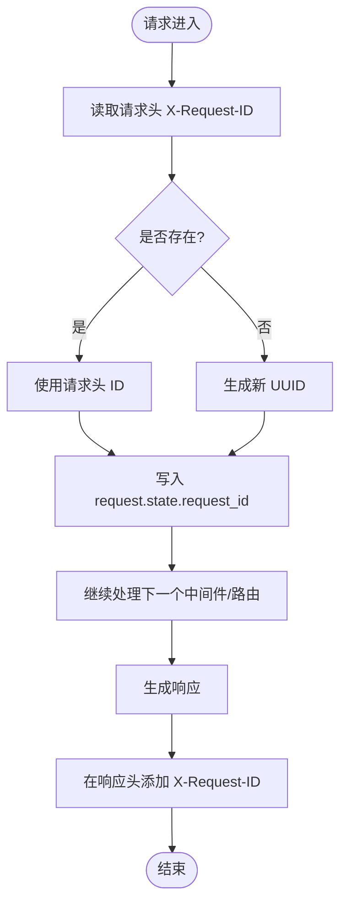

图表来源
- [services/tool_api/app/main.py:39-45](file://services/tool_api/app/main.py#L39-L45)

章节来源
- [services/tool_api/app/main.py:31-45](file://services/tool_api/app/main.py#L31-L45)

### 健康检查机制
- 端点：GET /health
- 返回字段：状态、服务名、版本、发布 ID，用于容器健康检查与外部监控。

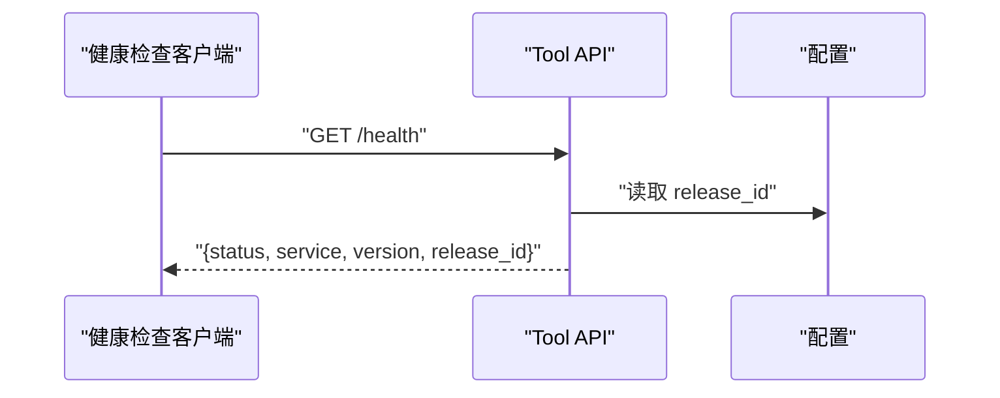

图表来源
- [services/tool_api/app/routers/health.py:1-15](file://services/tool_api/app/routers/health.py#L1-L15)
- [services/tool_api/app/config.py:1-19](file://services/tool_api/app/config.py#L1-L19)

章节来源
- [services/tool_api/app/routers/health.py:1-15](file://services/tool_api/app/routers/health.py#L1-L15)
- [services/tool_api/app/config.py:1-19](file://services/tool_api/app/config.py#L1-L19)

### 工单工具端点（tickets）
- 状态查询
  - 输入模型包含工单 ID 与是否包含评论标志。
  - 当前为占位实现，返回示例数据与 trace_id。
- 创建工单
  - 输入模型包含主题、描述、优先级、产品线、分类、版本、错误码、资产 ID、幂等键等。
  - 包含 HITL 触发判断逻辑与审计日志结构体，当前为占位返回。
- 待办事项
  - 权限校验、数据库 CRUD、幂等键检查、审计日志持久化、HITL Webhook 调用等。

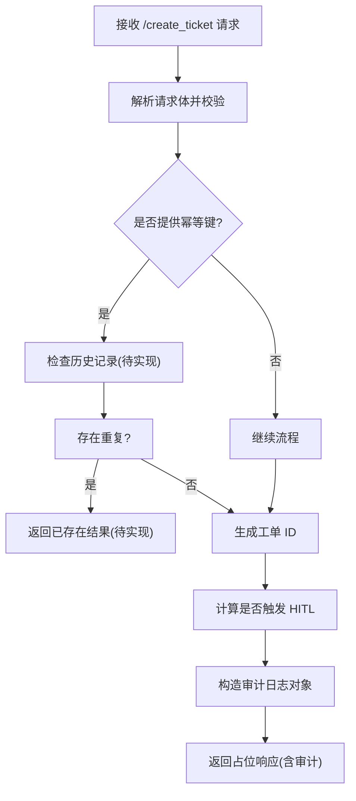

图表来源
- [services/tool_api/app/routers/tickets.py:81-124](file://services/tool_api/app/routers/tickets.py#L81-L124)

章节来源
- [services/tool_api/app/routers/tickets.py:1-134](file://services/tool_api/app/routers/tickets.py#L1-L134)

### 受控 KPI 查询（kpis）
- 端点：POST /api/v1/tools/query_support_kpis
- 功能：基于工具契约与指标注册表进行输入校验，生成参数化 SQL 访问安全视图，返回受控结果集并附带审计信息。
- 关键流程
  - 加载指标注册表与工具契约。
  - 校验 actor_role、指标、维度、过滤字段、日期范围与窗口大小。
  - 构建参数化查询并执行，异常时返回拒绝信息。
  - 返回 allowed、rows、审计信息等。

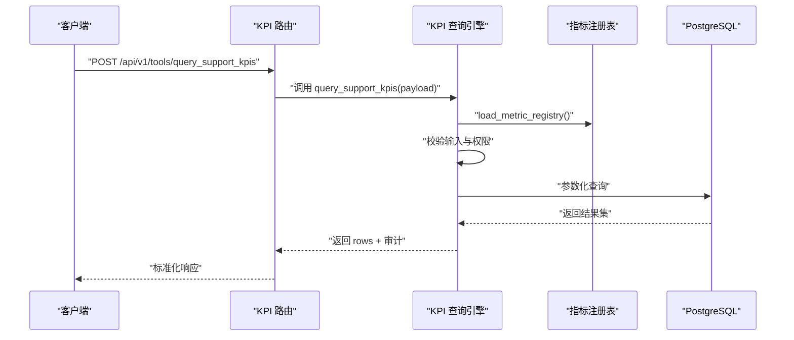

图表来源
- [services/tool_api/app/routers/kpis.py:1-18](file://services/tool_api/app/routers/kpis.py#L1-L18)
- [services/tool_api/app/kpi_query.py:200-228](file://services/tool_api/app/kpi_query.py#L200-L228)
- [services/tool_api/app/metric_registry.py:35-66](file://services/tool_api/app/metric_registry.py#L35-L66)

章节来源
- [services/tool_api/app/routers/kpis.py:1-18](file://services/tool_api/app/routers/kpis.py#L1-L18)
- [services/tool_api/app/kpi_query.py:1-271](file://services/tool_api/app/kpi_query.py#L1-L271)
- [services/tool_api/app/metric_registry.py:1-82](file://services/tool_api/app/metric_registry.py#L1-L82)
- [analytics/metric_registry_v1.yml:1-56](file://analytics/metric_registry_v1.yml#L1-L56)

### 全局异常处理策略
- 全局异常处理器
  - 捕获所有未处理异常，返回 JSON 错误体，包含错误类型、消息、请求 ID 与发布 ID。
  - 保证对外一致的错误格式，便于前端与监控系统消费。

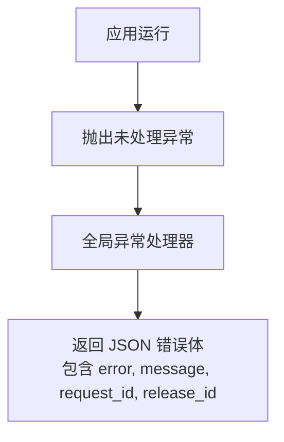

图表来源
- [services/tool_api/app/main.py:48-58](file://services/tool_api/app/main.py#L48-L58)

章节来源
- [services/tool_api/app/main.py:48-58](file://services/tool_api/app/main.py#L48-L58)

### 配置加载与环境变量管理
- 配置类 Settings
  - 从 .env 文件加载，包含数据库连接、OTel 导出端点、服务名、发布 ID、指标注册表路径等。
  - 提供默认值，便于本地开发与容器化部署。
- 环境变量
  - 通过 docker-compose 注入 DATABASE_URL、OTEL_SERVICE_NAME、OTEL_EXPORTER_OTLP_ENDPOINT、RELEASE_ID、METRIC_REGISTRY_PATH 等。
  - 支持多环境覆盖，如 dev-local。

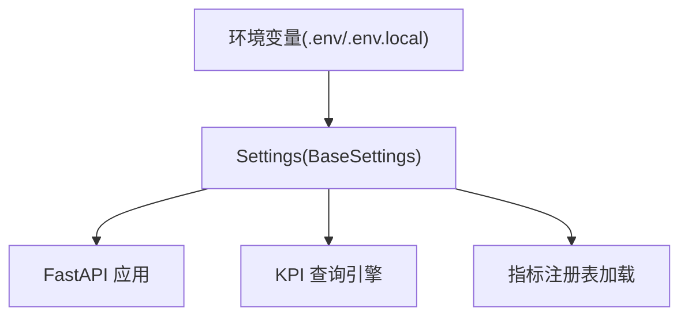

图表来源
- [services/tool_api/app/config.py:1-19](file://services/tool_api/app/config.py#L1-L19)
- [services/tool_api/app/kpi_query.py:20-22](file://services/tool_api/app/kpi_query.py#L20-L22)
- [services/tool_api/app/metric_registry.py:35-44](file://services/tool_api/app/metric_registry.py#L35-L44)
- [infra/docker-compose.yml:132-137](file://infra/docker-compose.yml#L132-L137)

章节来源
- [services/tool_api/app/config.py:1-19](file://services/tool_api/app/config.py#L1-L19)
- [infra/docker-compose.yml:132-137](file://infra/docker-compose.yml#L132-L137)

### 服务启动流程与部署架构
- 启动流程
  - Dockerfile 使用 uvicorn 启动 app.main:app，监听 8001 端口。
  - 通过 docker-compose 挂载代码与只读卷，暴露健康检查端点。
- 部署架构
  - tool_api 依赖 postgres 与 otel_collector，读取 analytics 与 contracts 的只读文件。
  - OTel Collector 将 traces 导出至 Phoenix，用于 AI 请求可观测。

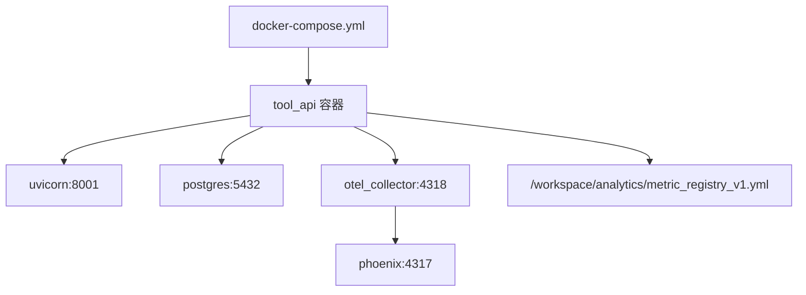

图表来源
- [services/tool_api/Dockerfile:1-16](file://services/tool_api/Dockerfile#L1-L16)
- [infra/docker-compose.yml:126-153](file://infra/docker-compose.yml#L126-L153)
- [observability/otel/config.yaml:1-66](file://observability/otel/config.yaml#L1-L66)

章节来源
- [services/tool_api/Dockerfile:1-16](file://services/tool_api/Dockerfile#L1-L16)
- [infra/docker-compose.yml:126-153](file://infra/docker-compose.yml#L126-L153)
- [observability/otel/config.yaml:1-66](file://observability/otel/config.yaml#L1-L66)

## 依赖关系分析
- 组件耦合
  - 主应用仅依赖配置与路由，耦合度低，便于扩展。
  - KPI 查询引擎与指标注册表强关联，确保查询安全。
- 外部依赖
  - PostgreSQL：结构化数据存储。
  - OTel Collector：统一采集与导出。
  - Phoenix：AI 请求可观测平台。
- 依赖可视化

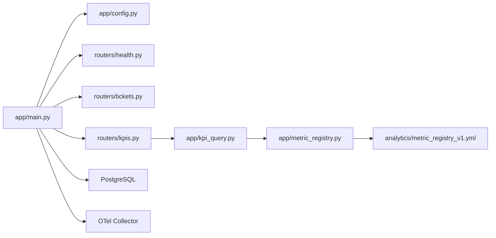

图表来源
- [services/tool_api/app/main.py:15-64](file://services/tool_api/app/main.py#L15-L64)
- [services/tool_api/app/routers/*.py:1-15](file://services/tool_api/app/routers/health.py#L1-L15)
- [services/tool_api/app/kpi_query.py:1-271](file://services/tool_api/app/kpi_query.py#L1-L271)
- [services/tool_api/app/metric_registry.py:1-82](file://services/tool_api/app/metric_registry.py#L1-L82)
- [analytics/metric_registry_v1.yml:1-56](file://analytics/metric_registry_v1.yml#L1-L56)

章节来源
- [services/tool_api/app/main.py:15-64](file://services/tool_api/app/main.py#L15-L64)
- [services/tool_api/app/kpi_query.py:1-271](file://services/tool_api/app/kpi_query.py#L1-L271)
- [services/tool_api/app/metric_registry.py:1-82](file://services/tool_api/app/metric_registry.py#L1-L82)

## 性能考虑
- 数据库访问
  - KPI 查询使用参数化 SQL 与限制条数，避免大结果集与注入风险。
- 连接管理
  - 查询完成后及时关闭连接，避免连接泄漏。
- OTel 导出
  - Collector 批量处理与内存限制，降低资源占用。
- 建议
  - 引入连接池与缓存策略（如指标元数据缓存）。
  - 对长查询增加超时与取消机制。

## 故障排查指南
- 健康检查失败
  - 检查 /health 端点返回与容器健康检查配置。
- 数据库连接异常
  - 校验 DATABASE_URL、网络连通性与数据库健康状态。
- KPI 查询被拒
  - 检查 actor_role、指标名称、维度与过滤字段是否在注册表中，日期窗口是否超限。
- OTel 导出失败
  - 检查 OTLP 端点可达性与 Collector 配置。
- 请求 ID 缺失
  - 确认中间件是否生效，客户端是否正确传递与读取 X-Request-ID。

章节来源
- [services/tool_api/app/routers/health.py:1-15](file://services/tool_api/app/routers/health.py#L1-L15)
- [services/tool_api/app/kpi_query.py:91-166](file://services/tool_api/app/kpi_query.py#L91-L166)
- [observability/otel/config.yaml:1-66](file://observability/otel/config.yaml#L1-L66)

## 结论
Tool API 服务以 FastAPI 为核心，采用清晰的分层与受控查询机制，结合 OTel 与 Phoenix 实现可观测性。通过中间件统一追踪、全局异常处理与严格的输入校验，保障服务稳定性与安全性。建议后续完善数据库 CRUD、审计日志持久化与 HITL 集成，持续优化查询性能与资源利用。

## 附录
- 项目元信息
  - 项目名称与版本来自 pyproject.toml。
  - 服务版本在应用构造时声明，用于健康检查与对外展示。

章节来源
- [pyproject.toml:5-10](file://pyproject.toml#L5-L10)
- [services/tool_api/app/main.py:24-29](file://services/tool_api/app/main.py#L24-L29)