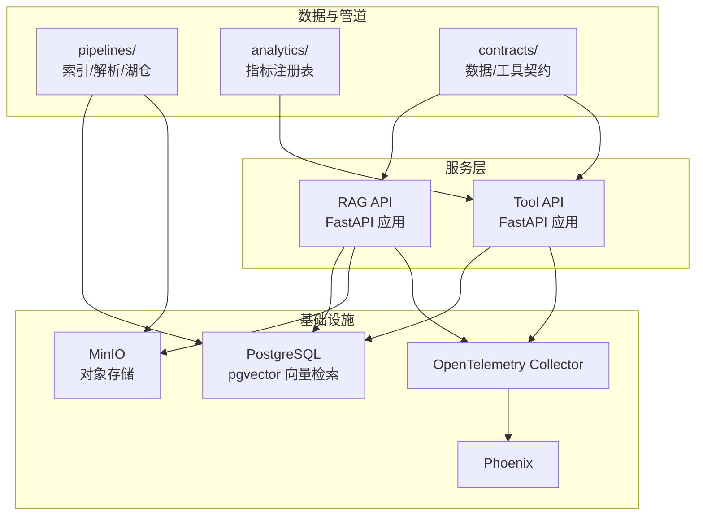
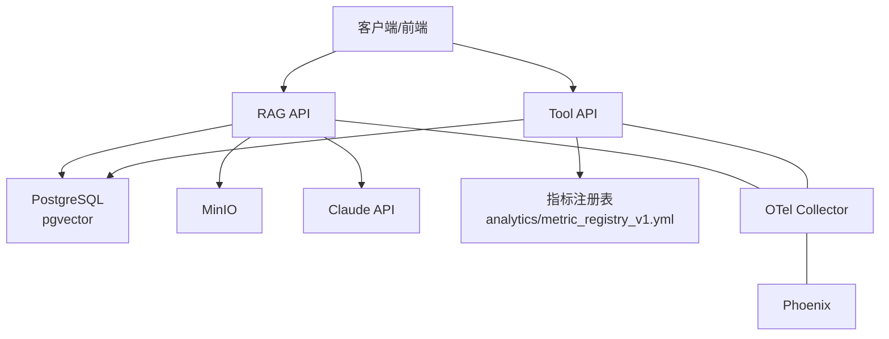
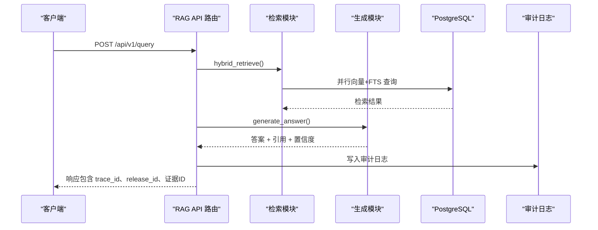
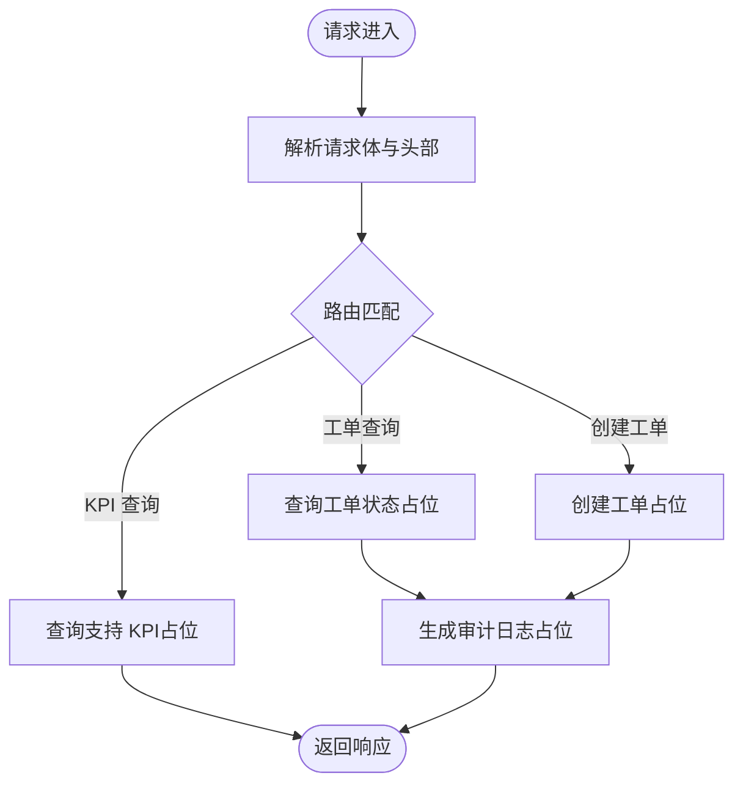
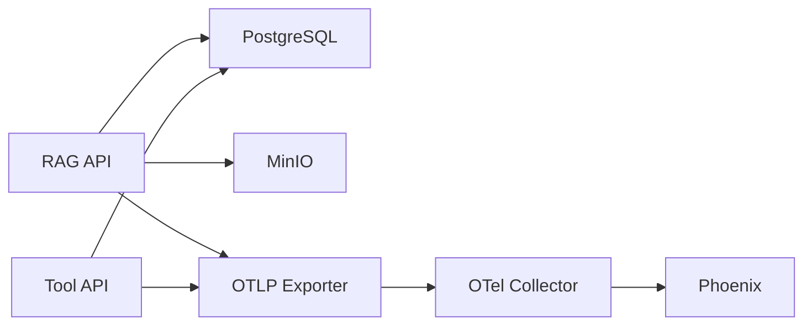

# 服务架构

<cite>
**本文档引用的文件**
- [services/rag_api/app/main.py](file://services/rag_api/app/main.py)
- [services/rag_api/app/config.py](file://services/rag_api/app/config.py)
- [services/rag_api/app/routers/query.py](file://services/rag_api/app/routers/query.py)
- [services/rag_api/app/routers/rag.py](file://services/rag_api/app/routers/rag.py)
- [services/rag_api/app/models/rag_models.py](file://services/rag_api/app/models/rag_models.py)
- [services/rag_api/app/retrieval.py](file://services/rag_api/app/retrieval.py)
- [services/rag_api/app/generator.py](file://services/rag_api/app/generator.py)
- [services/rag_api/app/observability.py](file://services/rag_api/app/observability.py)
- [services/rag_api/app/routers/health.py](file://services/rag_api/app/routers/health.py)
- [services/tool_api/app/main.py](file://services/tool_api/app/main.py)
- [services/tool_api/app/config.py](file://services/tool_api/app/config.py)
- [services/tool_api/app/routers/tickets.py](file://services/tool_api/app/routers/tickets.py)
- [services/tool_api/app/routers/kpis.py](file://services/tool_api/app/routers/kpis.py)
- [services/tool_api/app/routers/health.py](file://services/tool_api/app/routers/health.py)
- [infra/docker-compose.yml](file://infra/docker-compose.yml)
- [pyproject.toml](file://pyproject.toml)
</cite>

## 目录
1. [简介](#简介)
2. [项目结构](#项目结构)
3. [核心组件](#核心组件)
4. [架构总览](#架构总览)
5. [详细组件分析](#详细组件分析)
6. [依赖分析](#依赖分析)
7. [性能考量](#性能考量)
8. [故障排查指南](#故障排查指南)
9. [结论](#结论)
10. [附录](#附录)

## 简介
本文件系统性梳理 OmniSupport Copilot 的服务架构，聚焦基于 FastAPI 的微服务设计，涵盖 RAG API 与 Tool API 的实现细节、服务间通信、API 设计原则、错误处理策略、生命周期与健康检查、可观测性与监控、以及部署与扩展实践。目标是帮助读者快速理解系统如何通过模块化、可演进的方式构建“多模态企业支持知识层 + 工单联动”的 AI 能力，并为后续扩展与运维提供参考。

## 项目结构
项目采用按服务拆分的目录组织方式，核心服务位于 services/ 下，基础设施与编排位于 infra/，分析与指标定义位于 analytics/，契约与工具定义位于 contracts/，管道与索引位于 pipelines/，测试位于 tests/。

- 服务层
  - RAG API：提供知识检索与生成能力，包含路由、模型、检索、生成、可观测性与健康检查模块。
  - Tool API：提供工单工具、KPI 查询与健康检查。
- 基础设施
  - docker-compose 编排 PostgreSQL、MinIO、OpenTelemetry Collector、Phoenix、Dagster 等依赖。
- 数据与管道
  - pipelines/ 提供索引、解析、湖仓与增量/回填策略。
- 分析与契约
  - analytics/ 定义指标注册表；contracts/ 定义数据与工具契约。

图表来源
- [infra/docker-compose.yml:15-340](file://infra/docker-compose.yml#L15-L340)
- [services/rag_api/app/main.py:26-73](file://services/rag_api/app/main.py#L26-L73)
- [services/tool_api/app/main.py:24-64](file://services/tool_api/app/main.py#L24-L64)

章节来源
- [pyproject.toml:12-14](file://pyproject.toml#L12-L14)
- [infra/docker-compose.yml:1-340](file://infra/docker-compose.yml#L1-L340)

## 核心组件
- RAG API
  - 应用入口与生命周期：通过 lifespan 初始化可观测性，注册路由与中间件。
  - 路由与端点：/health、/api/v1/query、/api/v1/admin/*、/rag/answer。
  - 检索与生成：异步连接池、混合检索（向量+FTS）、RRF 融合、交叉编码精排、Claude 生成与引用抽取。
  - 模型与契约：Pydantic 模型定义请求/响应结构，确保审计与回溯所需字段齐全。
  - 可观测性：OTel tracing、OpenInference、批量导出至 Collector。
  - 错误处理：全局异常捕获，统一返回内部错误结构。
- Tool API
  - 应用入口：健康检查、CORS、请求 ID 中间件、全局异常处理。
  - 路由与端点：/health、/api/v1/tools/get_ticket_status、/api/v1/tools/create_ticket、/api/v1/tools/query_support_kpis。
  - 配置：数据库、OTel、Release ID、指标注册表路径、HITL 配置。
- 基础设施
  - docker-compose 编排：PostgreSQL（pgvector）、MinIO、OTel Collector、Phoenix、Dagster。
  - 环境变量：通过 .env 注入，支持开发/本地验证。

章节来源
- [services/rag_api/app/main.py:19-73](file://services/rag_api/app/main.py#L19-L73)
- [services/rag_api/app/routers/query.py:39-94](file://services/rag_api/app/routers/query.py#L39-L94)
- [services/rag_api/app/routers/rag.py:25-122](file://services/rag_api/app/routers/rag.py#L25-L122)
- [services/rag_api/app/models/rag_models.py:39-168](file://services/rag_api/app/models/rag_models.py#L39-L168)
- [services/rag_api/app/observability.py:11-55](file://services/rag_api/app/observability.py#L11-L55)
- [services/tool_api/app/main.py:19-64](file://services/tool_api/app/main.py#L19-L64)
- [services/tool_api/app/routers/tickets.py:50-124](file://services/tool_api/app/routers/tickets.py#L50-L124)
- [services/tool_api/app/routers/kpis.py:14-18](file://services/tool_api/app/routers/kpis.py#L14-L18)
- [infra/docker-compose.yml:15-340](file://infra/docker-compose.yml#L15-L340)

## 架构总览
RAG API 与 Tool API 均基于 FastAPI，通过异步编程与连接池提升吞吐；RAG API 侧重检索增强生成链路，Tool API 提供工单与 KPI 查询能力。两者共享基础设施：PostgreSQL（结构化与向量检索）、MinIO（对象存储）、OTel Collector（统一采集）与 Phoenix（可观测性可视化）。服务通过健康检查与依赖编排保证启动顺序与可用性。

图表来源
- [services/rag_api/app/main.py:26-73](file://services/rag_api/app/main.py#L26-L73)
- [services/tool_api/app/main.py:24-64](file://services/tool_api/app/main.py#L24-L64)
- [infra/docker-compose.yml:90-153](file://infra/docker-compose.yml#L90-L153)

## 详细组件分析

### RAG API 服务
- 应用与生命周期
  - 使用 lifespan 在启动时初始化 OTel tracing，确保服务启动即具备可观测性。
  - 注册健康检查、查询与管理端点，设置 CORS 与请求 ID 中间件。
- 检索链路
  - 并行执行向量检索与全文检索，使用 RRF 融合两路结果，可选交叉编码精排，最终按阈值与 top_k 过滤。
  - 支持多维元数据过滤（产品线、可见性范围、授权等级、状态、质量状态、数据/索引发布版本）。
- 生成与引用
  - 构建 system prompt 与上下文，调用 Claude 生成答案，解析引用标记并生成可读引用列表。
  - 若 LLM 不可用，提供降级回答策略。
- 审计与追踪
  - 生成阶段写入审计日志，响应包含 trace_id、release_id、evidence_ids 与置信度，便于回溯与回滚。
- 错误处理
  - 全局异常处理器统一返回内部错误结构，包含请求 ID 与 release_id。

图表来源
- [services/rag_api/app/routers/query.py:52-94](file://services/rag_api/app/routers/query.py#L52-L94)
- [services/rag_api/app/retrieval.py:386-444](file://services/rag_api/app/retrieval.py#L386-L444)
- [services/rag_api/app/generator.py:65-118](file://services/rag_api/app/generator.py#L65-L118)
- [services/rag_api/app/routers/query.py:136-159](file://services/rag_api/app/routers/query.py#L136-L159)

章节来源
- [services/rag_api/app/main.py:19-73](file://services/rag_api/app/main.py#L19-L73)
- [services/rag_api/app/routers/query.py:29-94](file://services/rag_api/app/routers/query.py#L29-L94)
- [services/rag_api/app/retrieval.py:132-444](file://services/rag_api/app/retrieval.py#L132-L444)
- [services/rag_api/app/generator.py:65-222](file://services/rag_api/app/generator.py#L65-L222)
- [services/rag_api/app/routers/health.py:10-33](file://services/rag_api/app/routers/health.py#L10-L33)

### Tool API 服务
- 应用与路由
  - 提供健康检查、工单状态查询、创建工单与 KPI 查询端点。
  - 支持请求 ID 中间件与全局异常处理。
- 工单工具
  - 骨架端点预留权限校验、真实数据库 CRUD、幂等键检查与 HITL 触发逻辑，便于后续落地。
- KPI 查询
  - 从指标注册表加载治理后的 KPI 查询，支持通过请求头注入 actor 信息。

图表来源
- [services/tool_api/app/routers/tickets.py:50-124](file://services/tool_api/app/routers/tickets.py#L50-L124)
- [services/tool_api/app/routers/kpis.py:14-18](file://services/tool_api/app/routers/kpis.py#L14-L18)

章节来源
- [services/tool_api/app/main.py:19-64](file://services/tool_api/app/main.py#L19-L64)
- [services/tool_api/app/routers/tickets.py:50-134](file://services/tool_api/app/routers/tickets.py#L50-L134)
- [services/tool_api/app/routers/kpis.py:14-18](file://services/tool_api/app/routers/kpis.py#L14-L18)
- [services/tool_api/app/routers/health.py:7-15](file://services/tool_api/app/routers/health.py#L7-L15)

### 数据模型与契约
- RAG API
  - QueryRequest/QueryResponse：定义查询输入与输出，包含证据锚点、置信度、会话 ID、trace_id、release_id。
  - RagAnswerRequest/RagAnswerResponse：Week8 合约模型，支持调试载荷与检索上下文。
- Tool API
  - 工单请求模型（GetTicketRequest/CreateTicketRequest）与审计日志模型，约束字段长度与格式。

章节来源
- [services/rag_api/app/models/rag_models.py:39-168](file://services/rag_api/app/models/rag_models.py#L39-L168)
- [services/tool_api/app/routers/tickets.py:21-46](file://services/tool_api/app/routers/tickets.py#L21-L46)

### 可观测性与监控
- RAG API
  - OTel tracing：HTTP OTLP 导出，资源属性包含 release_id，自动注入 span。
  - FastAPI instrumentation：覆盖请求生命周期。
- Tool API
  - 健康检查端点返回服务状态与 release_id。
- 基础设施
  - OTel Collector 统一接收 traces/metrics/logs；Phoenix 可视化 AI 请求与回放。

章节来源
- [services/rag_api/app/observability.py:11-55](file://services/rag_api/app/observability.py#L11-L55)
- [services/rag_api/app/routers/health.py:10-33](file://services/rag_api/app/routers/health.py#L10-L33)
- [services/tool_api/app/routers/health.py:7-15](file://services/tool_api/app/routers/health.py#L7-L15)
- [infra/docker-compose.yml:230-262](file://infra/docker-compose.yml#L230-L262)

## 依赖分析
- 服务内聚与耦合
  - RAG API：路由、检索、生成、模型、可观测性相对独立，通过中间件与配置集中管理。
  - Tool API：路由与业务逻辑清晰分离，KPI 查询依赖 analytics 指标注册表。
- 外部依赖
  - 数据库：PostgreSQL（asyncpg 连接池）。
  - 存储：MinIO（S3 兼容）。
  - LLM：Anthropic Claude API。
  - 可观测性：OTel Collector、Phoenix。
- 启动顺序与健康检查
  - docker-compose 明确依赖顺序：postgres → minio → rag_api/tool_api → dagster → otel_collector → phoenix。
  - 服务内置健康检查端点，配合 Compose healthcheck 实现自愈。

图表来源
- [infra/docker-compose.yml:90-153](file://infra/docker-compose.yml#L90-L153)
- [services/rag_api/app/observability.py:41-47](file://services/rag_api/app/observability.py#L41-L47)

章节来源
- [infra/docker-compose.yml:15-340](file://infra/docker-compose.yml#L15-L340)
- [services/rag_api/app/config.py:14-52](file://services/rag_api/app/config.py#L14-L52)
- [services/tool_api/app/config.py:4-19](file://services/tool_api/app/config.py#L4-L19)

## 性能考量
- 异步与并发
  - 使用 asyncpg 连接池与 asyncio.gather 并行执行向量与 FTS 检索，降低延迟。
- 检索优化
  - 向量检索使用 pgvector ANN，FTS 使用 PostgreSQL tsvector/tsquery，RRF 融合与交叉编码精排提升相关性。
- 生成与缓存
  - 建议对热门查询与引用进行缓存（需结合业务与合规评估）。
- 资源与伸缩
  - 通过 Docker Compose 与端口映射便于本地验证；生产环境建议使用容器编排平台实现水平扩展与弹性伸缩。
- 网络与安全
  - 生产环境限制 CORS 与访问控制，敏感配置通过环境变量注入。

章节来源
- [services/rag_api/app/routers/query.py:40-94](file://services/rag_api/app/routers/query.py#L40-L94)
- [services/rag_api/app/retrieval.py:404-429](file://services/rag_api/app/retrieval.py#L404-L429)
- [services/rag_api/app/config.py:14-52](file://services/rag_api/app/config.py#L14-L52)

## 故障排查指南
- 健康检查
  - RAG API：/health 检查数据库连通性，返回总体状态与各组件检查结果。
  - Tool API：/health 返回基础健康信息。
- 日志与追踪
  - OTel tracing 与 Phoenix 可视化有助于定位慢请求与异常。
- 常见问题
  - 数据库不可用：检查连接串与网络；确认健康检查返回 down。
  - LLM 未配置或鉴权失败：生成模块降级为摘要返回，检查 API Key 与模型配置。
  - 审计日志写入失败：不影响主链路，记录警告日志，检查数据库连接。

章节来源
- [services/rag_api/app/routers/health.py:10-48](file://services/rag_api/app/routers/health.py#L10-L48)
- [services/tool_api/app/routers/health.py:7-15](file://services/tool_api/app/routers/health.py#L7-L15)
- [services/rag_api/app/generator.py:112-118](file://services/rag_api/app/generator.py#L112-L118)
- [services/rag_api/app/routers/query.py:136-159](file://services/rag_api/app/routers/query.py#L136-L159)

## 结论
本架构以 FastAPI 为核心，结合异步检索与生成链路、统一可观测性与健康检查机制，形成可演进、可扩展的企业支持 AI 能力。RAG API 与 Tool API 各司其职，通过 docker-compose 与环境变量实现快速部署与本地验证；生产落地建议引入容器编排、服务网格与更严格的访问控制与安全策略。

## 附录
- 部署最佳实践
  - 使用 docker-compose 或容器编排平台管理服务生命周期与依赖顺序。
  - 将敏感配置（数据库、LLM Key、OTel Endpoint）置于安全的密钥管理服务。
  - 为服务配置健康检查与自愈策略，结合 OTel 与 Phoenix 实时监控。
- 性能优化建议
  - 检索侧：优化索引与过滤条件，合理设置 top_k 与 rerank 开关。
  - 生成侧：控制上下文长度与最大 token，必要时启用缓存。
- 故障恢复策略
  - LLM 不可用时的降级路径与审计日志记录。
  - 数据库连接池与超时重试策略，避免级联故障。
- 扩展性与水平扩展
  - 服务无状态化设计，结合负载均衡与副本数扩展。
  - 通过发布版本（release_id）与数据/索引发布版本实现灰度与回滚。