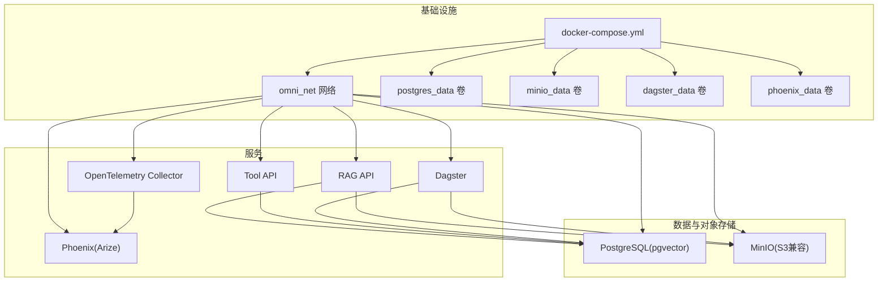
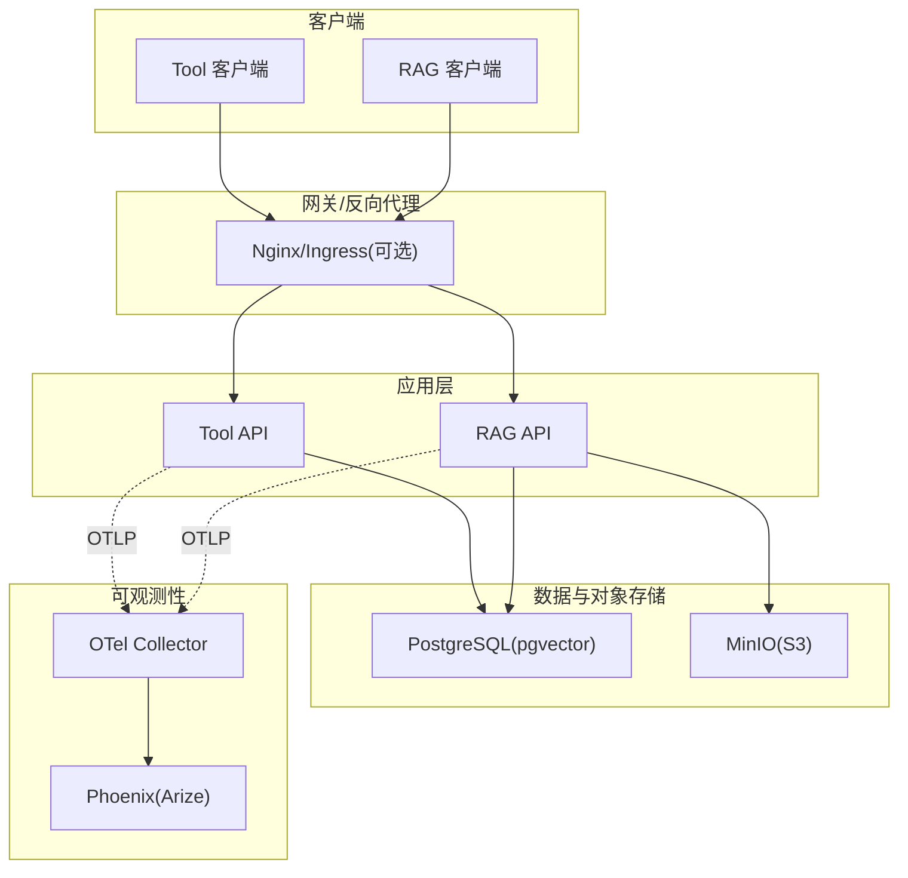
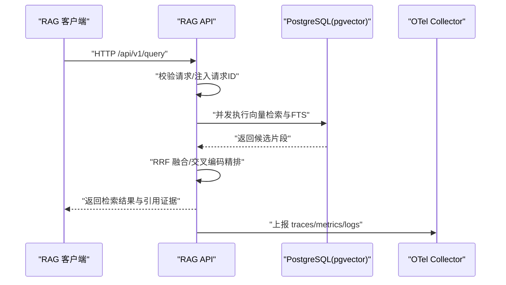
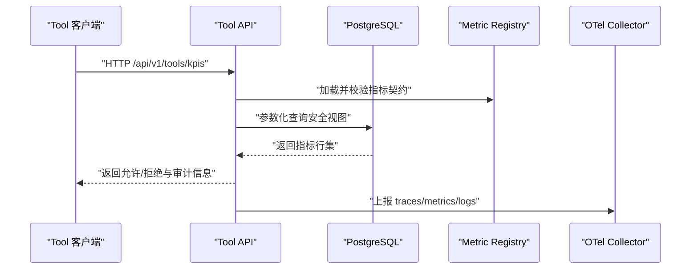
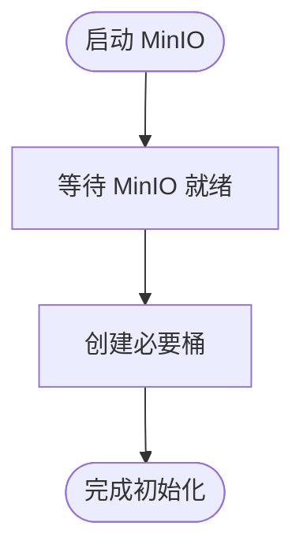
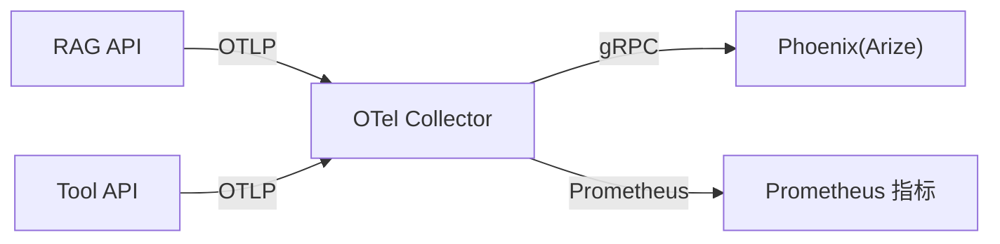
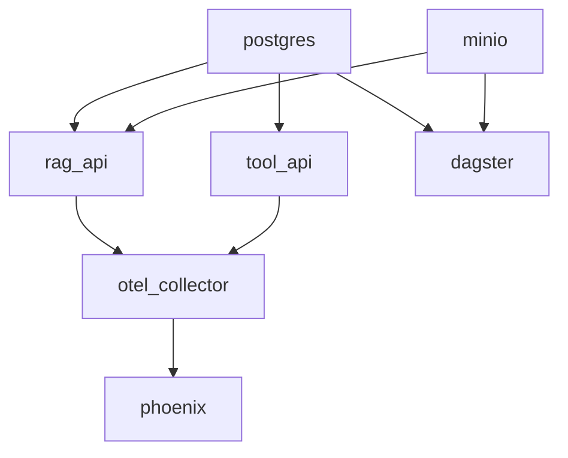

# 服务部署与配置

<cite>
**本文引用的文件**
- [services/rag_api/Dockerfile](file://services/rag_api/Dockerfile)
- [services/tool_api/Dockerfile](file://services/tool_api/Dockerfile)
- [infra/docker-compose.yml](file://infra/docker-compose.yml)
- [services/rag_api/app/main.py](file://services/rag_api/app/main.py)
- [services/tool_api/app/main.py](file://services/tool_api/app/main.py)
- [services/rag_api/app/config.py](file://services/rag_api/app/config.py)
- [services/tool_api/app/config.py](file://services/tool_api/app/config.py)
- [services/rag_api/app/retrieval.py](file://services/rag_api/app/retrieval.py)
- [services/tool_api/app/kpi_query.py](file://services/tool_api/app/kpi_query.py)
- [observability/otel/config.yaml](file://observability/otel/config.yaml)
- [infra/devbox.Dockerfile](file://infra/devbox.Dockerfile)
- [services/rag_api/requirements.txt](file://services/rag_api/requirements.txt)
- [services/tool_api/requirements.txt](file://services/tool_api/requirements.txt)
</cite>

## 目录
1. [简介](#简介)
2. [项目结构](#项目结构)
3. [核心组件](#核心组件)
4. [架构总览](#架构总览)
5. [详细组件分析](#详细组件分析)
6. [依赖关系分析](#依赖关系分析)
7. [性能考量](#性能考量)
8. [故障排查指南](#故障排查指南)
9. [结论](#结论)
10. [附录](#附录)

## 简介
本文件面向工程团队与运维人员，系统化梳理 RAG API 与 Tool API 的容器化部署与配置，覆盖以下主题：
- Dockerfile 构建流程与运行参数
- docker-compose 编排、服务依赖与网络拓扑
- 环境变量管理、配置文件加载与启动顺序
- 生产部署策略、资源限制与健康检查
- 扩缩容、滚动更新与回滚建议
- 部署脚本示例、监控与故障恢复

## 项目结构
本仓库采用按功能域划分的服务目录组织方式，RAG API 与 Tool API 各自拥有独立的 Dockerfile、依赖清单与应用入口；基础设施通过 docker-compose 进行统一编排。

图表来源
- [infra/docker-compose.yml:1-340](file://infra/docker-compose.yml#L1-L340)

章节来源
- [infra/docker-compose.yml:1-340](file://infra/docker-compose.yml#L1-L340)

## 核心组件
- RAG API 服务：基于 FastAPI，提供健康检查、查询路由与可观测性初始化，内置混合检索能力。
- Tool API 服务：提供健康检查与工具路由，支持受控 KPI 查询与审计日志。
- 数据与对象存储：PostgreSQL + pgvector 用于结构化与向量检索；MinIO 提供 S3 兼容的对象存储。
- 可观测性：OpenTelemetry Collector 接收 OTLP，转发至 Phoenix；Prometheus 暴露指标。
- 开发盒：devbox 容器提供统一开发环境，避免本地 Python 依赖。

章节来源
- [services/rag_api/app/main.py:1-73](file://services/rag_api/app/main.py#L1-L73)
- [services/tool_api/app/main.py:1-64](file://services/tool_api/app/main.py#L1-L64)
- [observability/otel/config.yaml:1-66](file://observability/otel/config.yaml#L1-L66)
- [infra/devbox.Dockerfile:1-25](file://infra/devbox.Dockerfile#L1-L25)

## 架构总览
下图展示服务间的依赖关系与数据流：

图表来源
- [infra/docker-compose.yml:89-153](file://infra/docker-compose.yml#L89-L153)
- [observability/otel/config.yaml:1-66](file://observability/otel/config.yaml#L1-L66)

## 详细组件分析

### RAG API 服务
- 容器镜像与运行参数
  - 基于 Python 3.11 slim 镜像，安装 curl，复制依赖与源码，暴露 8000 端口，使用 Uvicorn 在 0.0.0.0:8000 启动。
  - CMD 参数包含 --reload，适合开发；生产建议移除以提升稳定性。
- 环境变量与配置加载
  - 通过 pydantic-settings 从 .env 加载配置，支持 DATABASE_URL、MINIO_*、ANTHROPIC_API_KEY、OTEL_*、RELEASE_ID 等。
  - 默认 CORS 允许所有来源，生产需收紧。
- 启动流程
  - lifespan 中初始化 Telemetry；注册健康检查、查询与管理路由。
- 混合检索链路
  - 向量检索（pgvector）、全文检索（PostgreSQL FTS）、RRF 融合、交叉编码精排，支持元数据过滤与最低分过滤。

图表来源
- [services/rag_api/app/main.py:19-73](file://services/rag_api/app/main.py#L19-L73)
- [services/rag_api/app/retrieval.py:386-445](file://services/rag_api/app/retrieval.py#L386-L445)
- [observability/otel/config.yaml:30-66](file://observability/otel/config.yaml#L30-L66)

章节来源
- [services/rag_api/Dockerfile:1-20](file://services/rag_api/Dockerfile#L1-L20)
- [services/rag_api/app/config.py:1-53](file://services/rag_api/app/config.py#L1-L53)
- [services/rag_api/app/main.py:19-73](file://services/rag_api/app/main.py#L19-L73)
- [services/rag_api/app/retrieval.py:1-445](file://services/rag_api/app/retrieval.py#L1-L445)

### Tool API 服务
- 容器镜像与运行参数
  - 基于 Python 3.11 slim 镜像，安装 curl，复制依赖与源码，暴露 8001 端口，使用 Uvicorn 在 0.0.0.0:8001 启动。
  - CMD 参数包含 --reload，适合开发；生产建议移除。
- 环境变量与配置加载
  - 通过 pydantic-settings 从 .env 加载配置，支持 DATABASE_URL、OTEL_*、RELEASE_ID、METRIC_REGISTRY_PATH 等。
- 启动流程
  - 注册健康检查、工单与 KPI 路由；全局异常处理统一返回错误响应与请求 ID。

图表来源
- [services/tool_api/app/main.py:19-64](file://services/tool_api/app/main.py#L19-L64)
- [services/tool_api/app/kpi_query.py:106-228](file://services/tool_api/app/kpi_query.py#L106-L228)
- [observability/otel/config.yaml:30-66](file://observability/otel/config.yaml#L30-L66)

章节来源
- [services/tool_api/Dockerfile:1-16](file://services/tool_api/Dockerfile#L1-L16)
- [services/tool_api/app/config.py:1-19](file://services/tool_api/app/config.py#L1-L19)
- [services/tool_api/app/main.py:19-64](file://services/tool_api/app/main.py#L19-L64)
- [services/tool_api/app/kpi_query.py:1-271](file://services/tool_api/app/kpi_query.py#L1-L271)

### 数据与对象存储
- PostgreSQL(pgvector)
  - 健康检查基于 pg_isready；持久化数据卷；初始化脚本挂载至 /docker-entrypoint-initdb.d。
- MinIO(S3 兼容)
  - 健康检查基于 mc ready；S3 API 与控制台端口映射；桶初始化任务在 MinIO 启动后执行。

图表来源
- [infra/docker-compose.yml:41-86](file://infra/docker-compose.yml#L41-L86)

章节来源
- [infra/docker-compose.yml:19-86](file://infra/docker-compose.yml#L19-L86)

### 可观测性与监控
- OpenTelemetry Collector
  - 接收 gRPC/HTTP OTLP；批量处理器与内存限制；导出至 Phoenix；同时暴露 Prometheus 指标端点。
- Phoenix(Arize)
  - 接收 OTLP 并可视化 AI 请求链路与异常案例。

图表来源
- [observability/otel/config.yaml:1-66](file://observability/otel/config.yaml#L1-L66)
- [infra/docker-compose.yml:228-262](file://infra/docker-compose.yml#L228-L262)

章节来源
- [observability/otel/config.yaml:1-66](file://observability/otel/config.yaml#L1-L66)
- [infra/docker-compose.yml:228-262](file://infra/docker-compose.yml#L228-L262)

### 开发盒与本地验证
- devbox 容器
  - 复制项目关键目录与依赖，安装开发依赖，提供统一工作空间；适合在无本地 Python 环境下进行验证。

章节来源
- [infra/devbox.Dockerfile:1-25](file://infra/devbox.Dockerfile#L1-L25)

## 依赖关系分析
- 服务依赖
  - RAG API 依赖 PostgreSQL 与 MinIO；Tool API 依赖 PostgreSQL；Dagster 同时依赖两者；Phoenix 依赖 OTel Collector。
- 启动顺序
  - docker-compose 明确声明：postgres → minio → rag_api/tool_api → dagster → otel_collector → phoenix。
- 网络拓扑
  - 所有服务位于 omni_net 网桥网络中，服务间通过服务名通信。

图表来源
- [infra/docker-compose.yml:1-340](file://infra/docker-compose.yml#L1-L340)

章节来源
- [infra/docker-compose.yml:1-340](file://infra/docker-compose.yml#L1-L340)

## 性能考量
- 容器镜像与依赖
  - 使用 slim 基镜像，减少体积；依赖安装禁用缓存以优化镜像层。
- 运行参数
  - 开发阶段启用 --reload；生产建议移除以避免不必要的热重载开销。
- 可观测性
  - OTel Collector 配置了内存限制与批量处理器，降低资源占用与网络开销。
- 数据检索
  - RAG 检索链路采用并发执行向量与 FTS，并行融合与可选交叉编码精排，兼顾吞吐与质量。

章节来源
- [services/rag_api/Dockerfile:10-12](file://services/rag_api/Dockerfile#L10-L12)
- [services/tool_api/Dockerfile:8-9](file://services/tool_api/Dockerfile#L8-L9)
- [observability/otel/config.yaml:25-29](file://observability/otel/config.yaml#L25-L29)
- [services/rag_api/app/retrieval.py:404-429](file://services/rag_api/app/retrieval.py#L404-L429)

## 故障排查指南
- 健康检查失败
  - PostgreSQL/MinIO/服务健康检查失败时，先检查对应容器日志；确认环境变量与网络连通性。
- 服务启动顺序问题
  - 若 RAG/Tool 启动即报数据库或对象存储不可达，检查 depends_on 与健康检查条件是否满足。
- OTel 导出异常
  - 检查 OTel Collector 日志与 Phoenix 连接状态；确认 OTLP 端口映射与服务名解析。
- CORS 与安全
  - RAG 默认允许所有来源；生产需在配置中收紧 CORS 白名单。
- 异常处理
  - 两个服务均提供全局异常处理器，返回统一格式的错误响应与请求 ID，便于定位问题。

章节来源
- [infra/docker-compose.yml:32-36](file://infra/docker-compose.yml#L32-L36)
- [infra/docker-compose.yml:56-60](file://infra/docker-compose.yml#L56-L60)
- [infra/docker-compose.yml:117-121](file://infra/docker-compose.yml#L117-L121)
- [infra/docker-compose.yml:149-153](file://infra/docker-compose.yml#L149-L153)
- [services/rag_api/app/main.py:54-65](file://services/rag_api/app/main.py#L54-L65)
- [services/tool_api/app/main.py:48-58](file://services/tool_api/app/main.py#L48-L58)

## 结论
本部署方案以 docker-compose 实现多服务编排，明确服务依赖与网络拓扑；通过 OTel 与 Phoenix 提供可观测性；RAG 与 Tool API 均具备健康检查与统一异常处理。生产落地建议在保持现有健康检查与依赖顺序的基础上，完善资源限制、CORS 收敛、OTLP 端口安全与镜像构建优化。

## 附录

### 环境变量与配置要点
- RAG API 关键变量
  - DATABASE_URL、MINIO_ENDPOINT、MINIO_ACCESS_KEY、MINIO_SECRET_KEY、ANTHROPIC_API_KEY、OTEL_EXPORTER_OTLP_ENDPOINT、OTEL_SERVICE_NAME、RELEASE_ID、CORS 允许列表等。
- Tool API 关键变量
  - DATABASE_URL、OTEL_EXPORTER_OTLP_ENDPOINT、OTEL_SERVICE_NAME、RELEASE_ID、METRIC_REGISTRY_PATH、HITL 配置等。

章节来源
- [infra/docker-compose.yml:97-105](file://infra/docker-compose.yml#L97-L105)
- [infra/docker-compose.yml:132-137](file://infra/docker-compose.yml#L132-L137)
- [services/rag_api/app/config.py:14-49](file://services/rag_api/app/config.py#L14-L49)
- [services/tool_api/app/config.py:7-16](file://services/tool_api/app/config.py#L7-L16)

### 部署脚本示例（建议）
- 本地开发
  - 使用 docker compose 指定 .env 文件启动，确保服务按顺序健康启动。
- 生产部署（建议）
  - 使用编排文件定义服务与网络；为每个服务设置 restart 策略与健康检查；为 OTel 设置内存限制与批量导出；为 RAG/Tool 设置只读卷与最小权限访问对象存储与数据库。
  - 通过外部负载均衡或 Ingress 暴露服务端口；对 RAG 的 CORS 进行白名单收敛。

[本节为通用实践建议，不直接分析具体文件，故无“章节来源”]

### 扩缩容、滚动更新与回滚
- 扩缩容
  - 使用 docker-compose scale 或容器编排平台的副本数管理；注意共享卷与数据库连接池上限。
- 滚动更新
  - 通过镜像版本标签与重启策略实现；OTel 与 Phoenix 作为独立服务可独立升级。
- 回滚
  - 回退到上一个稳定镜像版本；若配置变更导致问题，回滚到上一个已知健康配置。

[本节为通用实践建议，不直接分析具体文件，故无“章节来源”]