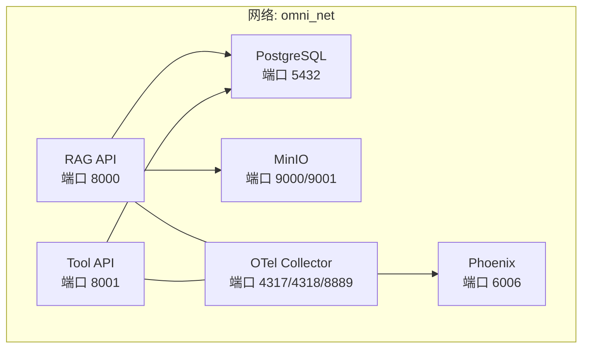
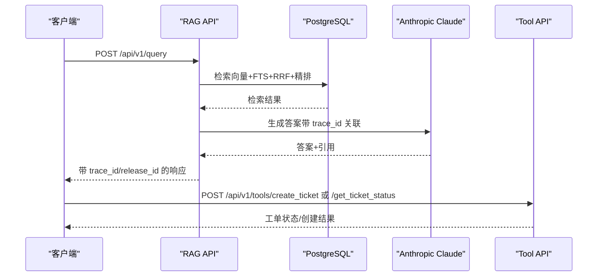
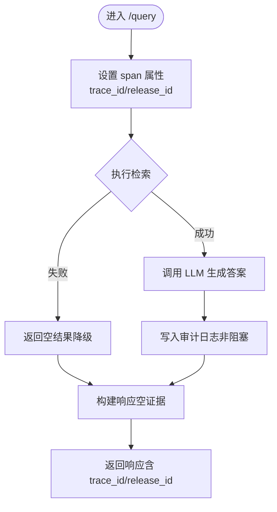
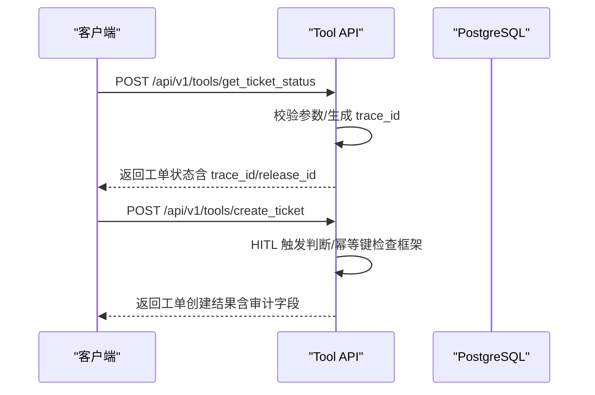
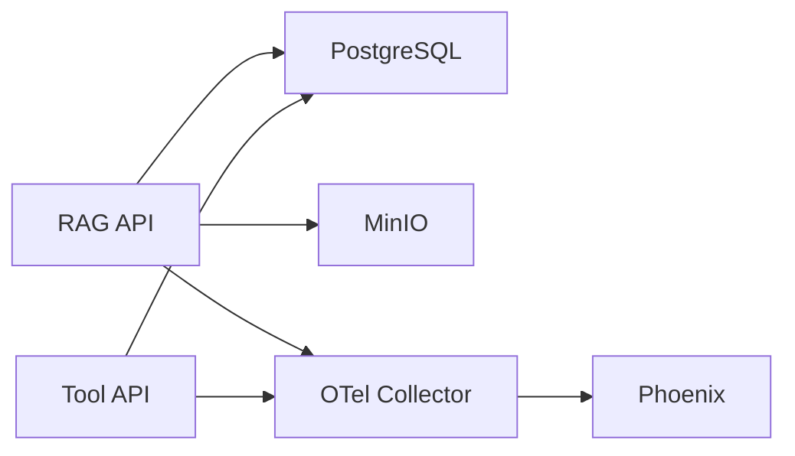

# 服务间通信

<cite>
**本文档引用的文件**
- [services/rag_api/app/main.py](file://services/rag_api/app/main.py)
- [services/tool_api/app/main.py](file://services/tool_api/app/main.py)
- [services/rag_api/app/config.py](file://services/rag_api/app/config.py)
- [services/tool_api/app/config.py](file://services/tool_api/app/config.py)
- [services/rag_api/app/routers/query.py](file://services/rag_api/app/routers/query.py)
- [services/tool_api/app/routers/tickets.py](file://services/tool_api/app/routers/tickets.py)
- [services/tool_api/app/routers/kpis.py](file://services/tool_api/app/routers/kpis.py)
- [services/rag_api/app/observability.py](file://services/rag_api/app/observability.py)
- [services/rag_api/app/models/rag_models.py](file://services/rag_api/app/models/rag_models.py)
- [services/rag_api/app/generator.py](file://services/rag_api/app/generator.py)
- [services/rag_api/app/retrieval.py](file://services/rag_api/app/retrieval.py)
- [contracts/service/rag_request.schema.json](file://contracts/service/rag_request.schema.json)
- [contracts/service/rag_response.schema.json](file://contracts/service/rag_response.schema.json)
- [contracts/tools/tool_contract_schema.json](file://contracts/tools/tool_contract_schema.json)
- [infra/docker-compose.yml](file://infra/docker-compose.yml)
- [observability/otel/config.yaml](file://observability/otel/config.yaml)
</cite>

## 目录
1. [引言](#引言)
2. [项目结构](#项目结构)
3. [核心组件](#核心组件)
4. [架构总览](#架构总览)
5. [详细组件分析](#详细组件分析)
6. [依赖分析](#依赖分析)
7. [性能考虑](#性能考虑)
8. [故障排查指南](#故障排查指南)
9. [结论](#结论)
10. [附录](#附录)

## 引言
本文件系统性阐述 OmniSupport Copilot 中 RAG API 与 Tool API 之间的服务间通信机制，涵盖交互模式、数据交换协议、同步/异步策略、服务发现与负载均衡、故障转移、认证授权与安全传输、配置管理与环境变量、可观测性（分布式追踪、日志与指标）、最佳实践与性能优化建议。文档以仓库实际代码为依据，避免臆测，确保读者能够准确理解并落地实施。

## 项目结构
本项目采用多服务架构，RAG API 与 Tool API 分别独立部署，共享基础设施（PostgreSQL、MinIO、OpenTelemetry Collector）。服务通过 Docker Compose 在同一网络内相互通信，OTel Collector 统一接收与导出遥测数据。

图表来源
- [infra/docker-compose.yml:15-340](file://infra/docker-compose.yml#L15-L340)
- [observability/otel/config.yaml:1-66](file://observability/otel/config.yaml#L1-66)

章节来源
- [infra/docker-compose.yml:15-340](file://infra/docker-compose.yml#L15-L340)

## 核心组件
- RAG API：提供健康检查、查询端点、管理员端点；内置 OpenTelemetry 初始化；通过中间件注入 X-Request-ID；全局异常处理器统一返回。
- Tool API：提供健康检查、工单工具、KPI 查询端点；中间件注入 X-Request-ID；全局异常处理器统一返回。
- 配置系统：基于 pydantic-settings 的 Settings 类，支持 .env 注入与大小写不敏感；RAG/Tool 各自定义关键配置项（数据库、对象存储、LLM、OTel、CORS、安全密钥等）。
- 合约与模型：RAG 请求/响应 JSON Schema；Tool 工具契约 Schema；RAG 查询请求/响应 Pydantic 模型。
- 可观测性：OTel Tracing 初始化；FastAPI instrumentation；OTLP HTTP 导出至 Collector；Collector 转发至 Phoenix。

章节来源
- [services/rag_api/app/main.py:1-73](file://services/rag_api/app/main.py#L1-L73)
- [services/tool_api/app/main.py:1-64](file://services/tool_api/app/main.py#L1-L64)
- [services/rag_api/app/config.py:1-53](file://services/rag_api/app/config.py#L1-L53)
- [services/tool_api/app/config.py:1-19](file://services/tool_api/app/config.py#L1-L19)
- [services/rag_api/app/observability.py:1-55](file://services/rag_api/app/observability.py#L1-L55)
- [contracts/service/rag_request.schema.json:1-23](file://contracts/service/rag_request.schema.json#L1-L23)
- [contracts/service/rag_response.schema.json:1-58](file://contracts/service/rag_response.schema.json#L1-L58)
- [contracts/tools/tool_contract_schema.json:1-93](file://contracts/tools/tool_contract_schema.json#L1-L93)

## 架构总览
RAG API 与 Tool API 通过 HTTP REST 交互，均暴露健康检查端点，具备统一的请求 ID 注入与异常处理。RAG API 内部通过连接池访问 PostgreSQL，调用外部 LLM 服务生成答案，并在响应中携带 trace_id 与 release_id，满足审计与回溯需求。Tool API 提供工单查询与创建等工具能力，具备 HITL 触发判断与审计日志字段准备。

图表来源
- [services/rag_api/app/routers/query.py:39-94](file://services/rag_api/app/routers/query.py#L39-L94)
- [services/rag_api/app/generator.py:65-118](file://services/rag_api/app/generator.py#L65-L118)
- [services/tool_api/app/routers/tickets.py:50-124](file://services/tool_api/app/routers/tickets.py#L50-L124)

## 详细组件分析

### RAG API 服务
- 应用入口与生命周期：FastAPI 应用，lifespan 中初始化 OTel；CORS 中间件按配置放行；全局异常处理器统一返回内部错误。
- 路由与端点：健康检查、RAG 查询、管理员端点；查询端点支持流式响应（通过 StreamingResponse）。
- 检索与生成：并行执行向量检索与全文检索，RRF 融合，可选 Cross-Encoder 精排；生成阶段调用 LLM，解析引用，计算置信度。
- 审计与追踪：记录审计日志（非阻塞），span 属性注入 trace_id、release_id、产品线等；响应体包含 trace_id 与 release_id。
- 配置与安全：数据库连接、MinIO、Anthropic API Key、OTel、CORS、安全密钥等通过 Settings 注入。

图表来源
- [services/rag_api/app/routers/query.py:52-94](file://services/rag_api/app/routers/query.py#L52-L94)
- [services/rag_api/app/generator.py:65-118](file://services/rag_api/app/generator.py#L65-L118)
- [services/rag_api/app/observability.py:11-55](file://services/rag_api/app/observability.py#L11-L55)

章节来源
- [services/rag_api/app/main.py:19-73](file://services/rag_api/app/main.py#L19-L73)
- [services/rag_api/app/routers/query.py:1-159](file://services/rag_api/app/routers/query.py#L1-L159)
- [services/rag_api/app/generator.py:1-222](file://services/rag_api/app/generator.py#L1-L222)
- [services/rag_api/app/retrieval.py:1-445](file://services/rag_api/app/retrieval.py#L1-L445)
- [services/rag_api/app/models/rag_models.py:1-168](file://services/rag_api/app/models/rag_models.py#L1-L168)
- [services/rag_api/app/config.py:1-53](file://services/rag_api/app/config.py#L1-L53)

### Tool API 服务
- 应用入口与路由：健康检查、工单工具（查询/创建）、KPI 查询；KPI 端点自动注入 Actor ID。
- 工具契约：遵循工具契约 Schema，定义输入/输出 Schema、角色权限、幂等性、审计字段、失败码、HITL 条件与限流。
- 工单工具：查询状态与创建工单的占位实现，具备 HITL 触发判断与审计日志字段准备；后续接入真实数据库与权限校验。

图表来源
- [services/tool_api/app/routers/tickets.py:50-124](file://services/tool_api/app/routers/tickets.py#L50-L124)
- [services/tool_api/app/routers/kpis.py:14-18](file://services/tool_api/app/routers/kpis.py#L14-L18)
- [contracts/tools/tool_contract_schema.json:1-93](file://contracts/tools/tool_contract_schema.json#L1-L93)

章节来源
- [services/tool_api/app/main.py:1-64](file://services/tool_api/app/main.py#L1-L64)
- [services/tool_api/app/routers/tickets.py:1-134](file://services/tool_api/app/routers/tickets.py#L1-L134)
- [services/tool_api/app/routers/kpis.py:1-18](file://services/tool_api/app/routers/kpis.py#L1-L18)
- [services/tool_api/app/config.py:1-19](file://services/tool_api/app/config.py#L1-L19)
- [contracts/tools/tool_contract_schema.json:1-93](file://contracts/tools/tool_contract_schema.json#L1-L93)

### 数据交换协议与合约
- RAG 请求/响应：严格 JSON Schema 定义，要求字段包括问题、产品线、角色范围、top_k、索引/数据/提示版本、调试开关、答案、证据、置信度、trace_id 等。
- 工具契约：定义工具名称、版本、描述、输入/输出 Schema、允许角色、幂等性、审计字段、失败码、HITL 条件与限流策略。

章节来源
- [contracts/service/rag_request.schema.json:1-23](file://contracts/service/rag_request.schema.json#L1-L23)
- [contracts/service/rag_response.schema.json:1-58](file://contracts/service/rag_response.schema.json#L1-L58)
- [contracts/tools/tool_contract_schema.json:1-93](file://contracts/tools/tool_contract_schema.json#L1-L93)

### 同步与异步通信策略
- RAG 查询端点：检索阶段对向量与 FTS 并行执行，随后进行 RRF 融合与可选精排，整体为同步流程；生成阶段调用 LLM 为同步阻塞；审计日志写入为非阻塞异步。
- Tool API：查询/创建工单为同步 HTTP 请求；HITL 触发判断为同步逻辑；审计日志字段准备为同步结构化输出。
- 建议：对于长耗时外部调用（如 LLM、HITL Webhook），可在后续版本引入消息队列或后台任务异步化，保持 HTTP 响应快速返回。

章节来源
- [services/rag_api/app/routers/query.py:404-429](file://services/rag_api/app/routers/query.py#L404-L429)
- [services/rag_api/app/generator.py:88-118](file://services/rag_api/app/generator.py#L88-L118)
- [services/rag_api/app/observability.py:11-55](file://services/rag_api/app/observability.py#L11-L55)
- [services/tool_api/app/routers/tickets.py:92-98](file://services/tool_api/app/routers/tickets.py#L92-L98)

### 服务发现、负载均衡与故障转移
- 服务发现：Docker Compose 通过服务名在同网段内解析；RAG/Tool API 通过服务名访问 PostgreSQL 与 MinIO。
- 负载均衡：当前为单实例部署；建议在生产环境通过反向代理或服务网格实现多副本与健康检查。
- 故障转移：RAG 检索与生成具备降级路径（空结果、回退答案）；审计日志写入非阻塞，避免影响主链路。

章节来源
- [infra/docker-compose.yml:98-103](file://infra/docker-compose.yml#L98-L103)
- [services/rag_api/app/routers/query.py:111-113](file://services/rag_api/app/routers/query.py#L111-L113)
- [services/rag_api/app/generator.py:160-169](file://services/rag_api/app/generator.py#L160-L169)

### 认证授权、数据加密与安全传输
- 认证授权：Tool API 的工单查询/创建具备角色校验与幂等键检查框架，后续接入 JWT/会话提取 Actor ID；RAG API 当前未实现鉴权中间件。
- 数据加密：OTel 通过 HTTP exporter 发送至 Collector；建议在生产环境启用 TLS；MinIO 与数据库连接使用环境变量注入凭证。
- 安全传输：OTel Collector 配置中可启用 TLS；建议在反向代理层强制 HTTPS；敏感配置通过 .env 管理。

章节来源
- [services/tool_api/app/routers/tickets.py:60-61](file://services/tool_api/app/routers/tickets.py#L60-L61)
- [services/tool_api/app/routers/tickets.py:95-97](file://services/tool_api/app/routers/tickets.py#L95-L97)
- [services/rag_api/app/config.py:48-50](file://services/rag_api/app/config.py#L48-L50)
- [observability/otel/config.yaml:32-36](file://observability/otel/config.yaml#L32-L36)

### 配置管理、环境变量与依赖
- 配置注入：RAG/Tool API 均通过 Settings 从 .env 加载；RAG 包含数据库、MinIO、Anthropic、OTel、CORS、安全密钥；Tool API 包含数据库、OTel、Release ID、Metric Registry Path、HITL 配置。
- 依赖关系：RAG 依赖 PostgreSQL 与 MinIO；Tool API 依赖 PostgreSQL；OTel Collector 统一收集与导出；Phoenix 用于 AI 请求可观测。

章节来源
- [services/rag_api/app/config.py:1-53](file://services/rag_api/app/config.py#L1-L53)
- [services/tool_api/app/config.py:1-19](file://services/tool_api/app/config.py#L1-L19)
- [infra/docker-compose.yml:97-106](file://infra/docker-compose.yml#L97-L106)
- [infra/docker-compose.yml:132-137](file://infra/docker-compose.yml#L132-L137)

### 可观测性在服务间通信中的作用
- 分布式追踪：RAG/Tool API 均注入 X-Request-ID；RAG 在查询链路中创建 spans（检索、生成），OTel Tracing 初始化；Collector 批量处理与内存限制。
- 日志聚合：OTel 支持 logs 管道；Phoenix 作为 Arize 的可视化前端，接收 OTLP gRPC。
- 性能监控：Prometheus Exporter 暴露指标；Batch Processor 减少网络开销；Memory Limiter 防止 OOM。

章节来源
- [services/rag_api/app/main.py:45-51](file://services/rag_api/app/main.py#L45-L51)
- [services/tool_api/app/main.py:39-45](file://services/tool_api/app/main.py#L39-L45)
- [services/rag_api/app/observability.py:11-55](file://services/rag_api/app/observability.py#L11-L55)
- [observability/otel/config.yaml:12-66](file://observability/otel/config.yaml#L12-L66)

## 依赖分析
RAG API 与 Tool API 的直接依赖主要来自基础设施与可观测性组件；两者均依赖 PostgreSQL 与 MinIO；OTel Collector 作为统一出口。

图表来源
- [infra/docker-compose.yml:19-340](file://infra/docker-compose.yml#L19-L340)
- [observability/otel/config.yaml:30-44](file://observability/otel/config.yaml#L30-L44)

章节来源
- [infra/docker-compose.yml:19-340](file://infra/docker-compose.yml#L19-L340)

## 性能考虑
- 检索性能：向量检索与 FTS 并行执行，RRF 融合与 Cross-Encoder 精排可选；建议根据业务阈值调整 top_k 与 rerank 开关。
- LLM 调用：合理设置温度与最大 token 数；在 API Key 缺失或鉴权失败时提供回退答案，降低端到端延迟。
- 数据库连接：连接池懒初始化与最小/最大连接数配置；避免在热路径上重复创建连接。
- OTel 性能：批量导出与内存限制；生产环境建议启用 TLS 与压缩。

章节来源
- [services/rag_api/app/routers/query.py:29-34](file://services/rag_api/app/routers/query.py#L29-L34)
- [services/rag_api/app/generator.py:88-118](file://services/rag_api/app/generator.py#L88-L118)
- [services/rag_api/app/observability.py:14-18](file://services/rag_api/app/observability.py#L14-L18)

## 故障排查指南
- 健康检查：确认 /health 返回 200；Compose 中 healthcheck 配置可用于自动化探测。
- 数据库连通性：检查 DATABASE_URL 与网络连通；RAG 检索失败时返回空结果并记录警告。
- LLM 可用性：API Key 无效或调用异常时返回降级答案；检查 OTel trace 关联与日志。
- 审计日志：非阻塞写入，失败不影响主链路；若出现异常需查看日志与数据库状态。
- OTel 链路：确认 Collector 端口开放与配置正确；Phoenix 可视化验证 trace 是否到达。

章节来源
- [services/rag_api/app/routers/query.py:111-113](file://services/rag_api/app/routers/query.py#L111-L113)
- [services/rag_api/app/generator.py:112-117](file://services/rag_api/app/generator.py#L112-L117)
- [services/rag_api/app/observability.py:51-54](file://services/rag_api/app/observability.py#L51-L54)
- [infra/docker-compose.yml:117-121](file://infra/docker-compose.yml#L117-L121)
- [infra/docker-compose.yml:149-153](file://infra/docker-compose.yml#L149-L153)

## 结论
本项目的服务间通信以 HTTP REST 为主，结合统一的 OTel 遥测体系实现可观测性闭环。RAG API 与 Tool API 在功能上互补：前者负责知识检索与生成，后者提供工单与 KPI 等工具能力。通过严格的配置管理、JSON Schema 合约与中间件注入的请求 ID，系统在可维护性与可审计性方面具备良好基础。建议在生产环境中完善鉴权、TLS 与多副本部署，并对长耗时外部调用引入异步化策略以提升吞吐与稳定性。

## 附录
- 最佳实践清单
  - 统一请求 ID 与 trace_id，贯穿服务边界。
  - 使用 JSON Schema 与 Pydantic 模型强约束输入输出。
  - 将审计日志写入设计为非阻塞异步。
  - 对外部 LLM 与第三方服务增加超时与重试策略。
  - 生产环境启用 TLS 与最小权限凭证。
  - 使用健康检查与探针保障服务可用性。
  - 通过 OTel Collector 批量导出与内存限制控制资源消耗。