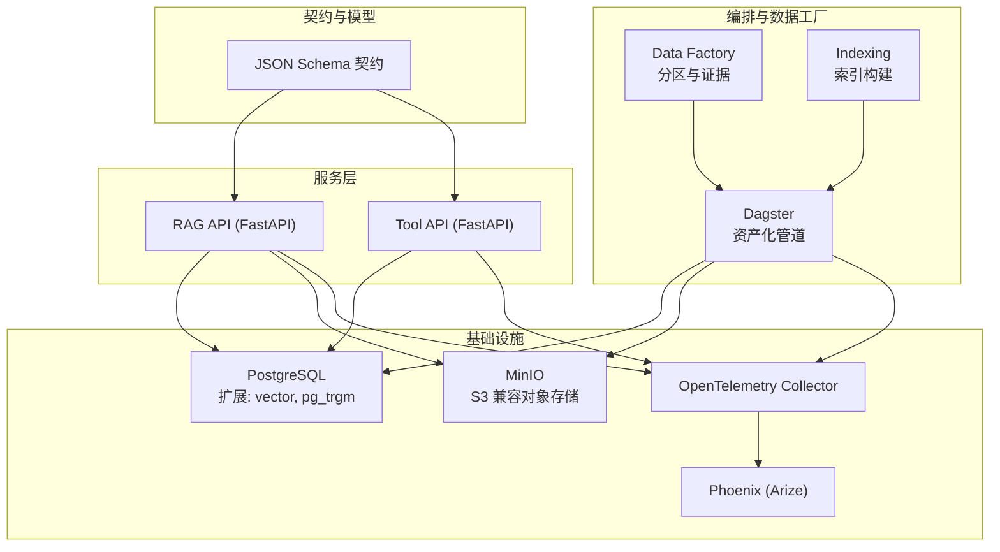
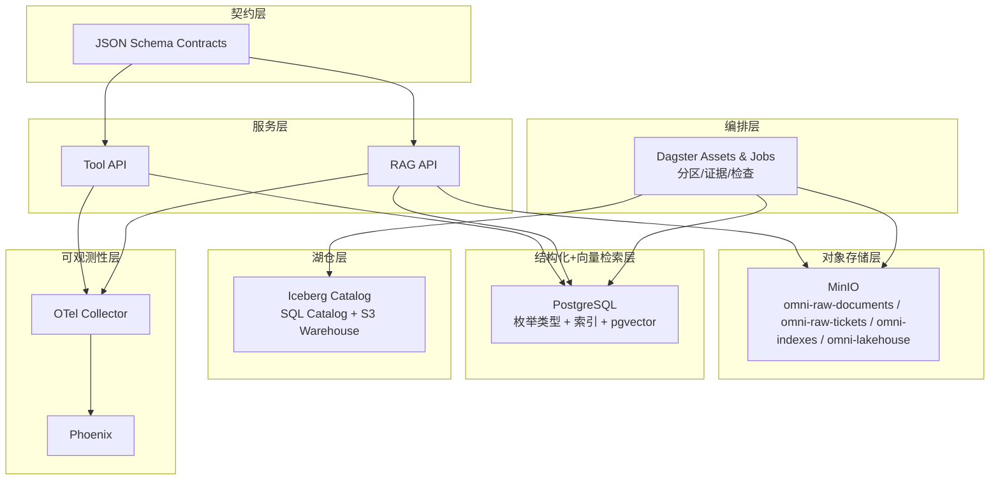
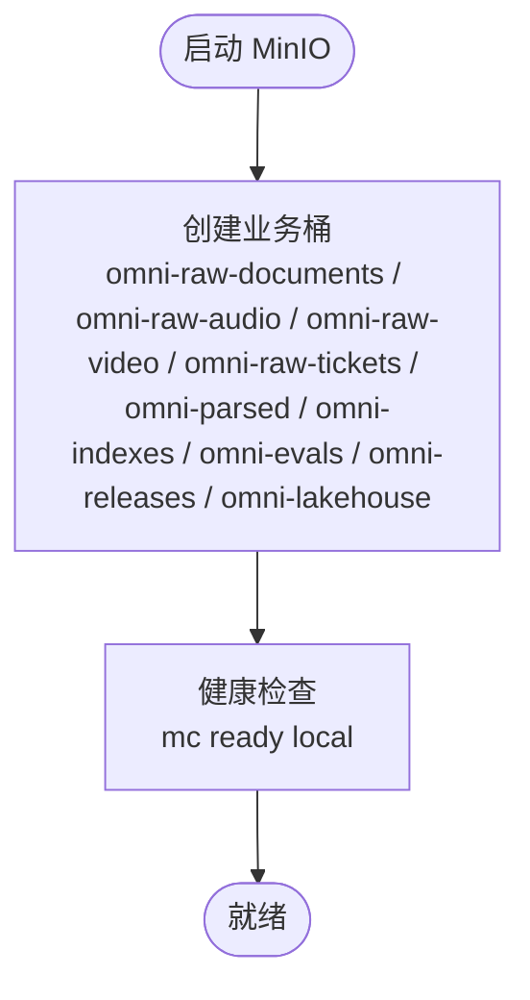
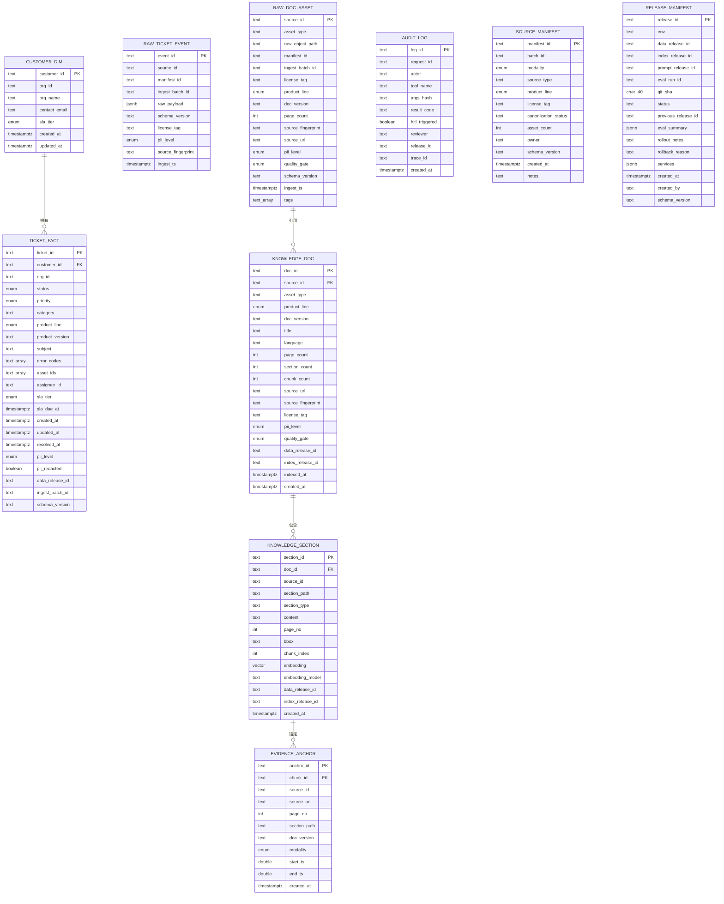
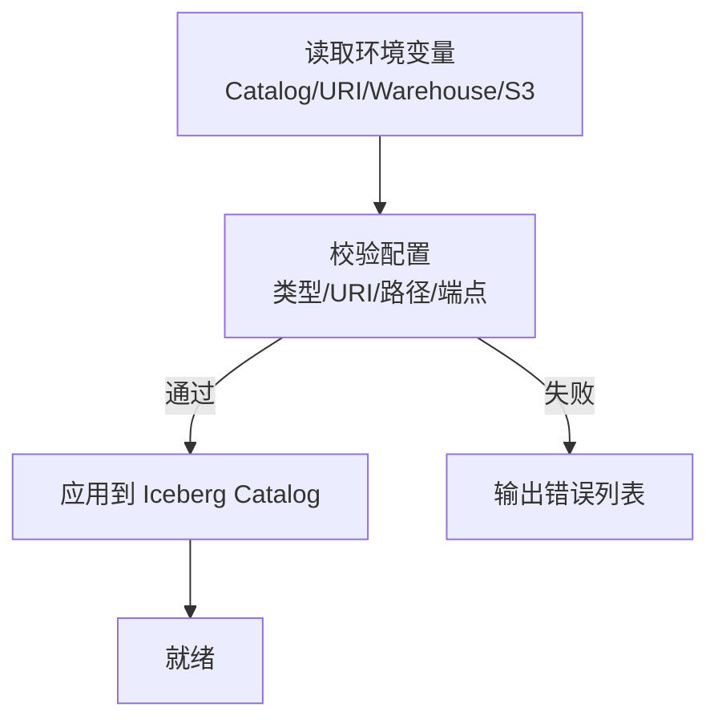
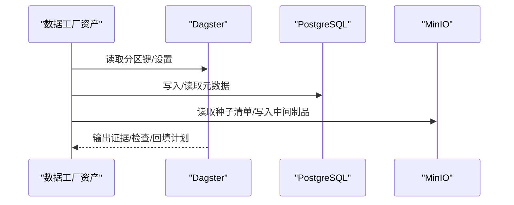
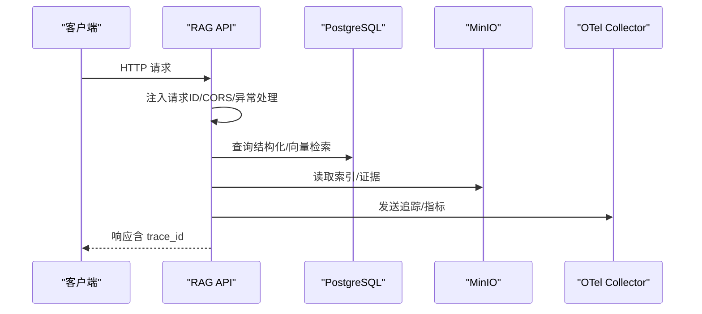
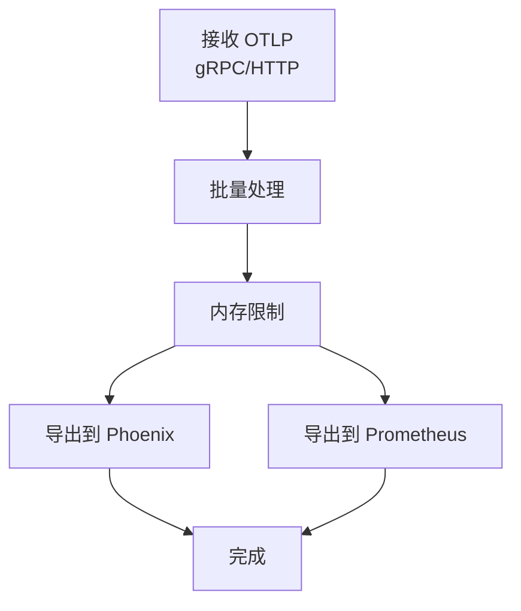
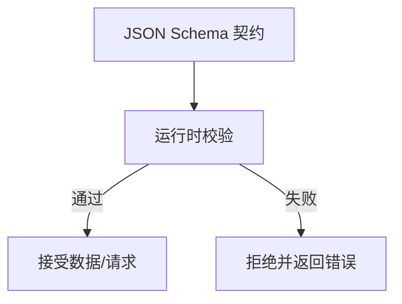
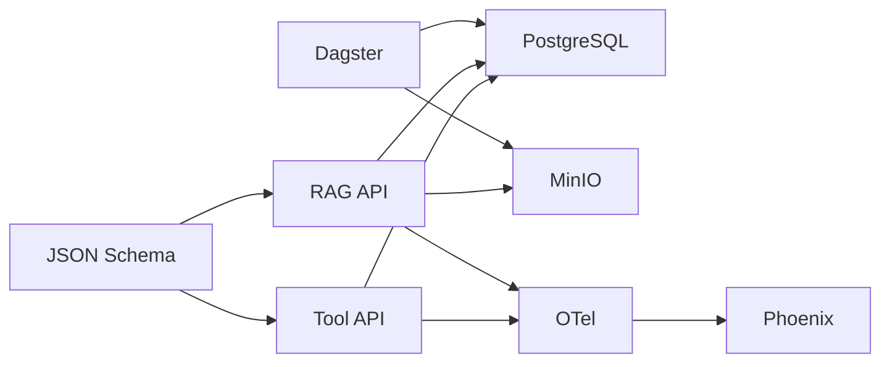

# 七层架构详解

<cite>
**本文引用的文件**
- [docker-compose.yml](file://infra/docker-compose.yml)
- [001_init.sql](file://infra/migrations/001_init.sql)
- [config.yaml](file://observability/otel/config.yaml)
- [main.py](file://services/rag_api/app/main.py)
- [config.py](file://services/rag_api/app/config.py)
- [main.py](file://services/tool_api/app/main.py)
- [definitions.py](file://pipelines/definitions.py)
- [assets.py](file://pipelines/ingestion/assets.py)
- [assets.py](file://pipelines/data_factory/assets.py)
- [assets.py](file://pipelines/indexing/assets.py)
- [settings.py](file://pipelines/lakehouse/settings.py)
- [minio.py](file://pipelines/resources/minio.py)
- [postgres.py](file://pipelines/resources/postgres.py)
- [ticket_contract.json](file://contracts/data/ticket_contract.json)
- [rag_request.schema.json](file://contracts/service/rag_request.schema.json)
- [rag_response.schema.json](file://contracts/service/rag_response.schema.json)
</cite>

## 目录
1. [引言](#引言)
2. [项目结构](#项目结构)
3. [核心组件](#核心组件)
4. [架构总览](#架构总览)
5. [详细组件分析](#详细组件分析)
6. [依赖关系分析](#依赖关系分析)
7. [性能考量](#性能考量)
8. [故障排查指南](#故障排查指南)
9. [结论](#结论)
10. [附录](#附录)

## 引言
本文件面向 OmniSupport Copilot 的七层架构，系统性解析从数据采集到服务交付的完整链路，覆盖以下层级及其职责、技术实现、配置参数、性能与扩展性设计：
- 对象存储层（MinIO）：数据持久化与访问控制
- 结构化+向量检索层（PostgreSQL + pgvector）：混合检索能力
- 湖仓层（Apache Iceberg）：分层存储与模式演进
- 编排层（Dagster）：资产化管道管理
- 服务层（FastAPI）：API 设计与路由管理
- 可观测性层（OpenTelemetry + Phoenix）：追踪与监控
- 契约层（JSON Schema）：规范化约束

## 项目结构
项目采用多模块分层组织，结合 Docker Compose 将各服务容器化并按启动顺序编排，确保对象存储、数据库、编排引擎、API 服务与可观测性栈协同工作。

图表来源
- [docker-compose.yml:1-340](file://infra/docker-compose.yml#L1-L340)
- [config.yaml:1-66](file://observability/otel/config.yaml#L1-L66)

章节来源
- [docker-compose.yml:1-340](file://infra/docker-compose.yml#L1-L340)

## 核心组件
- 对象存储层（MinIO）
  - 作用：作为 S3 兼容的对象存储，承载原始文档、音视频、索引、评估产物与湖仓仓库数据。
  - 配置要点：端点、凭证、桶初始化脚本、路径风格访问等。
  - 访问控制：通过环境变量注入的密钥与策略管理访问权限。
- 结构化+向量检索层（PostgreSQL + pgvector）
  - 作用：存储结构化工单与维度表，以及知识段落的向量嵌入；提供全文检索与向量相似度检索。
  - 配置要点：扩展启用、枚举类型、索引策略（GIN、IVFFLAT 等）。
- 湖仓层（Apache Iceberg）
  - 作用：以 Iceberg 管理分层存储与模式演进，桥接 Dagster 与 MinIO。
  - 配置要点：Catalog 类型与 URI、Warehouse S3 路径、S3 凭证与区域。
- 编排层（Dagster）
  - 作用：统一资产图、作业、检查与分区策略，驱动从种子清单到湖仓与索引的流水线。
  - 配置要点：资源注入、分区定义、异步运行桥接。
- 服务层（FastAPI）
  - 作用：对外提供健康检查、查询与管理接口；内置请求 ID、CORS、异常处理。
  - 配置要点：OTel 导出端点、服务名、CORS 白名单、LLM 参数、检索参数。
- 可观测性层（OpenTelemetry + Phoenix）
  - 作用：统一接收 traces/metrics/logs，转发至 Phoenix 进行 AI 请求可观测与可视化。
  - 配置要点：接收端点、批量导出、内存限制、Prometheus 暴露端口。
- 契约层（JSON Schema）
  - 作用：规范数据契约与服务请求/响应格式，保障跨层一致性与质量门禁。

章节来源
- [docker-compose.yml:17-340](file://infra/docker-compose.yml#L17-L340)
- [001_init.sql:1-288](file://infra/migrations/001_init.sql#L1-L288)
- [config.yaml:1-66](file://observability/otel/config.yaml#L1-L66)
- [main.py:1-73](file://services/rag_api/app/main.py#L1-L73)
- [config.py:1-53](file://services/rag_api/app/config.py#L1-L53)
- [main.py:1-64](file://services/tool_api/app/main.py#L1-L64)
- [definitions.py:1-38](file://pipelines/definitions.py#L1-L38)
- [settings.py:1-149](file://pipelines/lakehouse/settings.py#L1-L149)
- [minio.py:1-14](file://pipelines/resources/minio.py#L1-L14)
- [postgres.py:1-16](file://pipelines/resources/postgres.py#L1-L16)
- [ticket_contract.json:1-125](file://contracts/data/ticket_contract.json#L1-L125)
- [rag_request.schema.json:1-23](file://contracts/service/rag_request.schema.json#L1-L23)
- [rag_response.schema.json:1-58](file://contracts/service/rag_response.schema.json#L1-L58)

## 架构总览
下图展示七层架构在系统中的交互关系与数据流：

图表来源
- [docker-compose.yml:17-340](file://infra/docker-compose.yml#L17-L340)
- [001_init.sql:1-288](file://infra/migrations/001_init.sql#L1-L288)
- [config.yaml:1-66](file://observability/otel/config.yaml#L1-L66)
- [definitions.py:1-38](file://pipelines/definitions.py#L1-L38)

## 详细组件分析

### 对象存储层（MinIO）
- 技术实现
  - MinIO 作为 S3 兼容对象存储，提供桶级隔离与目录式命名空间，支撑原始资产、中间制品、索引与湖仓仓库。
  - 通过初始化容器自动创建多个业务桶，确保命名规范与权限边界。
- 配置参数
  - 端点、访问密钥、秘密密钥、桶名称、路径风格访问、区域等。
- 性能与扩展性
  - 多桶分离降低热点；路径风格访问适配不同客户端；健康检查保障可用性。
- 访问控制
  - 通过环境变量注入凭证，避免硬编码；建议结合 IAM 策略最小授权原则。

图表来源
- [docker-compose.yml:65-86](file://infra/docker-compose.yml#L65-L86)

章节来源
- [docker-compose.yml:39-86](file://infra/docker-compose.yml#L39-L86)
- [minio.py:1-14](file://pipelines/resources/minio.py#L1-L14)

### 结构化+向量检索层（PostgreSQL + pgvector）
- 技术实现
  - 初始化脚本创建枚举类型与多张表，涵盖原始资产、工单事实、评论、知识文档与知识段落，并在知识段落表中引入向量列。
  - 提供全文检索索引（GIN + to_tsvector）与向量相似度索引（预留 IVFFLAT）。
- 配置参数
  - 扩展启用（vector、pg_trgm）、索引策略、默认值与约束。
- 性能与扩展性
  - 通过枚举类型与合理索引提升查询效率；向量索引按需启用；全文检索支持 BM25-like 查询。
- 错误处理
  - 未见显式错误处理代码，建议在应用层增加重试与降级策略。

图表来源
- [001_init.sql:36-275](file://infra/migrations/001_init.sql#L36-L275)

章节来源
- [001_init.sql:1-288](file://infra/migrations/001_init.sql#L1-L288)
- [postgres.py:1-16](file://pipelines/resources/postgres.py#L1-L16)

### 湖仓层（Apache Iceberg）
- 技术实现
  - 通过环境变量注入 Catalog 名称、类型、URI 与 Warehouse S3 路径，使用 SQL Catalog 与 PyArrow FileIO。
  - 设置 S3 端点、凭证、区域与路径风格访问，确保与 MinIO 互通。
- 配置参数
  - ICEBERG_CATALOG_NAME/TYPE/URI、ICEBERG_WAREHOUSE、ICEBERG_S3_*、命名空间（bronze/silver）。
- 性能与扩展性
  - 分层命名空间隔离不同成熟度数据；S3 路径风格访问提升兼容性；校验函数保证配置正确性。
- 错误处理
  - 配置自检与敏感信息脱敏输出，便于运维定位问题。

图表来源
- [settings.py:40-104](file://pipelines/lakehouse/settings.py#L40-L104)

章节来源
- [settings.py:1-149](file://pipelines/lakehouse/settings.py#L1-L149)
- [docker-compose.yml:172-183](file://infra/docker-compose.yml#L172-L183)

### 编排层（Dagster）
- 技术实现
  - 定义资产图与作业，统一注册数据工厂、索引、解析与湖仓相关资产。
  - 数据工厂资产包含分区、证据生成、回填计划与下游决策，形成闭环质量门禁。
- 配置参数
  - 资源构建、分区定义、报告目录、干跑开关、批次 ID 等。
- 性能与扩展性
  - 异步运行桥接与线程池用于同步上下文内运行协程；分区策略支持增量与回填。
- 错误处理
  - 通过检查与证据记录失败原因，支持下游决策与人工干预。

图表来源
- [definitions.py:20-37](file://pipelines/definitions.py#L20-L37)
- [assets.py:116-535](file://pipelines/data_factory/assets.py#L116-L535)
- [assets.py:26-164](file://pipelines/ingestion/assets.py#L26-L164)
- [assets.py:17-55](file://pipelines/indexing/assets.py#L17-L55)

章节来源
- [definitions.py:1-38](file://pipelines/definitions.py#L1-L38)
- [assets.py:1-535](file://pipelines/data_factory/assets.py#L1-L535)
- [assets.py:1-164](file://pipelines/ingestion/assets.py#L1-L164)
- [assets.py:1-55](file://pipelines/indexing/assets.py#L1-L55)

### 服务层（FastAPI）
- 技术实现
  - RAG API 与 Tool API 均基于 FastAPI，提供健康检查、CORS、请求 ID 注入与全局异常处理。
  - RAG API 注册路由前缀与中间件，集成 OpenTelemetry。
- 配置参数
  - 数据库连接、MinIO 端点与凭证、LLM 参数、检索参数、OTel 导出端点、CORS 白名单、安全密钥等。
- 性能与扩展性
  - 中间件统一注入请求 ID；异常处理器标准化错误响应；路由前缀区分版本与功能域。
- 错误处理
  - 全局异常捕获返回统一结构，包含请求 ID 与发布版本号。

图表来源
- [main.py:19-73](file://services/rag_api/app/main.py#L19-L73)
- [config.py:14-50](file://services/rag_api/app/config.py#L14-L50)
- [main.py:19-64](file://services/tool_api/app/main.py#L19-L64)

章节来源
- [main.py:1-73](file://services/rag_api/app/main.py#L1-L73)
- [config.py:1-53](file://services/rag_api/app/config.py#L1-L53)
- [main.py:1-64](file://services/tool_api/app/main.py#L1-L64)

### 可观测性层（OpenTelemetry + Phoenix）
- 技术实现
  - OTel Collector 接收 gRPC/HTTP OTLP，批量处理与内存限制，导出至 Phoenix 并暴露 Prometheus 指标。
- 配置参数
  - 接收端点、批量大小、超时、资源属性、内存上限、导出目标与 Prometheus 端口。
- 性能与扩展性
  - 批量导出降低网络开销；内存限制防止 OOM；多管道分离 traces/metrics/logs。
- 错误处理
  - 健康检查与调试导出便于问题定位。

图表来源
- [config.yaml:4-66](file://observability/otel/config.yaml#L4-L66)

章节来源
- [config.yaml:1-66](file://observability/otel/config.yaml#L1-L66)

### 契约层（JSON Schema）
- 技术实现
  - 通过 JSON Schema 约束工单数据、RAG 请求/响应与工具调用契约，确保跨层一致性与质量门禁。
- 配置参数
  - 必填字段、枚举值、正则表达式、数值范围、数组项约束等。
- 性能与扩展性
  - Schema 可随版本演进，保持向后兼容；测试用例覆盖有效/无效样本。
- 错误处理
  - 通过测试框架验证契约有效性，快速发现不合规数据。

图表来源
- [ticket_contract.json:8-124](file://contracts/data/ticket_contract.json#L8-L124)
- [rag_request.schema.json:7-21](file://contracts/service/rag_request.schema.json#L7-L21)
- [rag_response.schema.json:7-56](file://contracts/service/rag_response.schema.json#L7-L56)

章节来源
- [ticket_contract.json:1-125](file://contracts/data/ticket_contract.json#L1-L125)
- [rag_request.schema.json:1-23](file://contracts/service/rag_request.schema.json#L1-L23)
- [rag_response.schema.json:1-58](file://contracts/service/rag_response.schema.json#L1-L58)

## 依赖关系分析
- 组件耦合
  - 编排层（Dagster）依赖数据库与对象存储，产出证据与索引供服务层消费。
  - 服务层（RAG/Tool API）依赖数据库与对象存储，同时向可观测性层上报。
  - 契约层（JSON Schema）贯穿数据入湖与服务请求/响应校验。
- 外部依赖
  - PostgreSQL 扩展（vector、pg_trgm）、MinIO S3 兼容 API、OTel Collector、Phoenix。
- 循环依赖
  - 未见循环导入或资产依赖环，整体呈单向数据流。

图表来源
- [docker-compose.yml:17-340](file://infra/docker-compose.yml#L17-L340)
- [definitions.py:20-37](file://pipelines/definitions.py#L20-L37)

章节来源
- [docker-compose.yml:1-340](file://infra/docker-compose.yml#L1-L340)
- [definitions.py:1-38](file://pipelines/definitions.py#L1-L38)

## 性能考量
- 存储与索引
  - PostgreSQL：合理使用枚举类型与索引（GIN/IVFFLAT），避免全表扫描；定期维护统计信息。
  - MinIO：多桶分离与路径风格访问提升吞吐；注意对象命名与前缀优化。
- 编排与流水线
  - 分区策略与回填计划减少全量重算；干跑开关降低风险；异步运行桥接提升吞吐。
- 服务与可观测
  - OTel 批量导出与内存限制平衡延迟与资源占用；Prometheus 指标暴露关键指标。
- 扩展性设计
  - 通过环境变量注入配置，支持多环境部署；Iceberg 分层命名空间与模式演进满足增长需求。

## 故障排查指南
- 数据库连接
  - 检查 DATABASE_URL 格式与凭据；确认扩展已启用；查看索引状态与查询计划。
- 对象存储
  - 校验 S3 端点、凭证与路径风格访问；确认桶存在且具备读写权限。
- 编排与流水线
  - 查看 Dagster 日志与证据输出；核对分区键与回填计划；确认干跑开关状态。
- 服务与可观测
  - 校验 OTel 导出端点可达；确认 Phoenix 可视化可用；检查异常处理器输出。
- 契约校验
  - 使用测试用例验证 JSON Schema；关注必填字段与枚举值；定位不合规数据。

章节来源
- [config.py:14-50](file://services/rag_api/app/config.py#L14-L50)
- [settings.py:90-104](file://pipelines/lakehouse/settings.py#L90-L104)
- [config.yaml:30-44](file://observability/otel/config.yaml#L30-L44)

## 结论
本七层架构以对象存储与数据库为核心，结合湖仓与编排实现数据的高效采集、治理与交付；服务层提供统一 API 与可观测能力；契约层确保跨层一致性。通过合理的配置参数、性能与扩展性设计，系统可在多环境中稳定运行并持续演进。

## 附录
- 关键配置清单
  - PostgreSQL：扩展、枚举类型、索引策略
  - MinIO：端点、凭证、桶、路径风格访问
  - Iceberg：Catalog 类型/URI、Warehouse、S3 凭证与区域
  - Dagster：资源、分区、报告目录、干跑开关
  - FastAPI：数据库/对象存储/LLM/OTel/CORS/安全
  - OTel：接收端点、批量/内存限制、导出目标、Prometheus
  - JSON Schema：必填/枚举/正则/范围/数组项