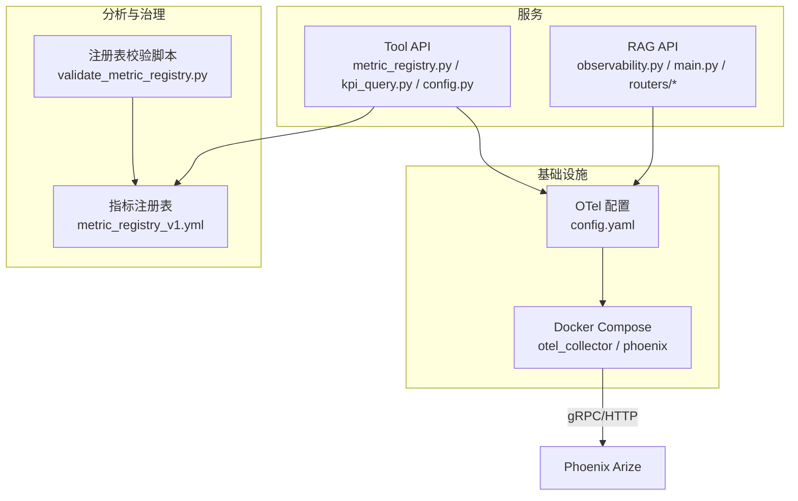
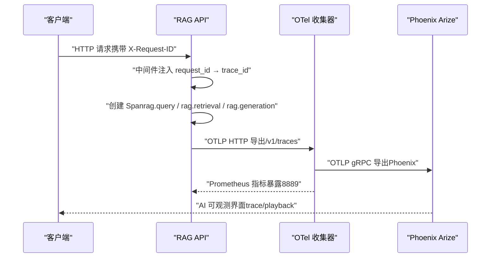
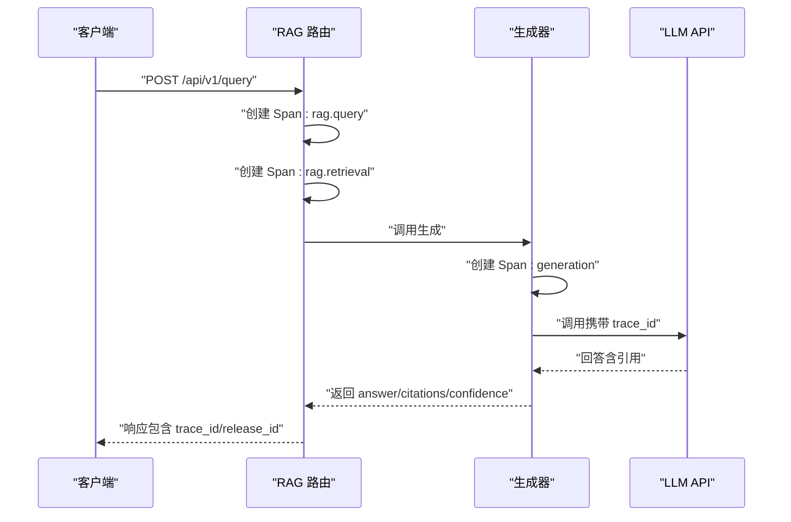
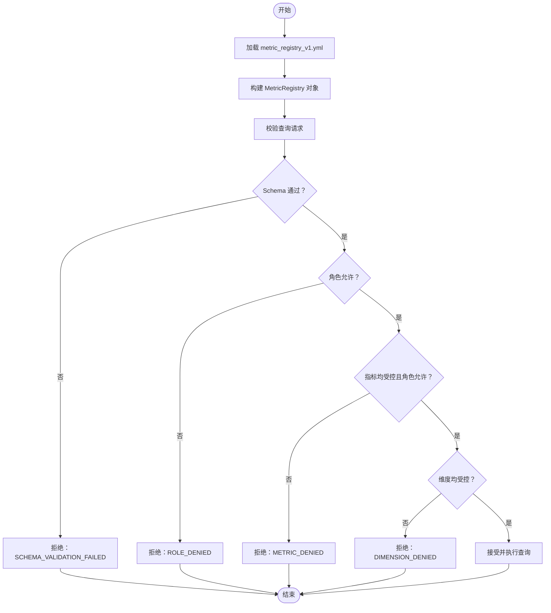
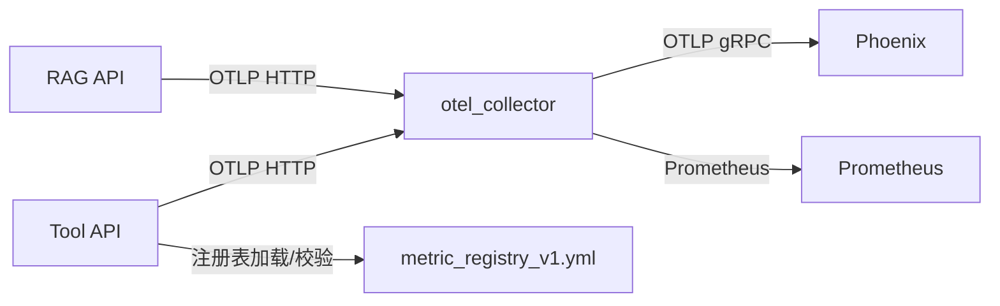

# 可观测性层（OpenTelemetry+Phoenix）

<cite>
**本文档引用的文件**
- [observability/otel/config.yaml](file://observability/otel/config.yaml)
- [services/rag_api/app/observability.py](file://services/rag_api/app/observability.py)
- [services/rag_api/app/main.py](file://services/rag_api/app/main.py)
- [services/rag_api/app/routers/query.py](file://services/rag_api/app/routers/query.py)
- [services/rag_api/app/routers/rag.py](file://services/rag_api/app/routers/rag.py)
- [services/rag_api/app/generator.py](file://services/rag_api/app/generator.py)
- [services/rag_api/app/config.py](file://services/rag_api/app/config.py)
- [services/tool_api/app/config.py](file://services/tool_api/app/config.py)
- [services/tool_api/app/metric_registry.py](file://services/tool_api/app/metric_registry.py)
- [services/tool_api/app/kpi_query.py](file://services/tool_api/app/kpi_query.py)
- [analytics/metric_registry_v1.yml](file://analytics/metric_registry_v1.yml)
- [analytics/scripts/validate_metric_registry.py](file://analytics/scripts/validate_metric_registry.py)
- [infra/docker-compose.yml](file://infra/docker-compose.yml)
- [docs/blueprints/project-blueprint.md](file://docs/blueprints/project-blueprint.md)
</cite>

## 目录
1. [简介](#简介)
2. [项目结构](#项目结构)
3. [核心组件](#核心组件)
4. [架构总览](#架构总览)
5. [组件详解](#组件详解)
6. [依赖关系分析](#依赖关系分析)
7. [性能考量](#性能考量)
8. [故障排查指南](#故障排查指南)
9. [结论](#结论)
10. [附录](#附录)

## 简介
本文件系统性梳理 OmniSupport Copilot 的可观测性层，聚焦 OpenTelemetry 的配置与集成、追踪与指标体系、日志管理，以及 Phoenix 的 AI 可观测性能力。文档解释分布式追踪、性能监控、错误诊断与用户行为分析的核心价值，并详述 trace_id 与 release_id 的设计思路、Span 的创建与传播、指标注册与校验机制。同时提供配置要点、监控仪表板建议、告警规则思路与故障排查流程，帮助工程团队快速落地与迭代可观测性。

## 项目结构
可观测性相关代码主要分布在如下位置：
- OpenTelemetry 收集器配置：observability/otel/config.yaml
- RAG API 可观测性初始化与中间件：services/rag_api/app/observability.py、services/rag_api/app/main.py
- RAG 查询与生成链路的 Span 注入：services/rag_api/app/routers/query.py、services/rag_api/app/routers/rag.py、services/rag_api/app/generator.py
- 配置项（OTel、release_id 等）：services/rag_api/app/config.py、services/tool_api/app/config.py
- KPI 指标注册与查询：services/tool_api/app/metric_registry.py、services/tool_api/app/kpi_query.py、analytics/metric_registry_v1.yml、analytics/scripts/validate_metric_registry.py
- 容器编排与导出：infra/docker-compose.yml
- 架构蓝图（含 Phoenix 层）：docs/blueprints/project-blueprint.md

图表来源
- [observability/otel/config.yaml:1-66](file://observability/otel/config.yaml#L1-L66)
- [services/rag_api/app/observability.py:1-55](file://services/rag_api/app/observability.py#L1-L55)
- [services/rag_api/app/main.py:1-73](file://services/rag_api/app/main.py#L1-L73)
- [services/rag_api/app/routers/query.py:1-159](file://services/rag_api/app/routers/query.py#L1-L159)
- [services/rag_api/app/routers/rag.py:1-163](file://services/rag_api/app/routers/rag.py#L1-L163)
- [services/tool_api/app/metric_registry.py:1-82](file://services/tool_api/app/metric_registry.py#L1-L82)
- [services/tool_api/app/kpi_query.py:106-142](file://services/tool_api/app/kpi_query.py#L106-L142)
- [analytics/metric_registry_v1.yml:1-56](file://analytics/metric_registry_v1.yml#L1-L56)
- [analytics/scripts/validate_metric_registry.py:1-130](file://analytics/scripts/validate_metric_registry.py#L1-L130)
- [infra/docker-compose.yml:227-261](file://infra/docker-compose.yml#L227-L261)

章节来源
- [observability/otel/config.yaml:1-66](file://observability/otel/config.yaml#L1-L66)
- [infra/docker-compose.yml:227-261](file://infra/docker-compose.yml#L227-L261)
- [docs/blueprints/project-blueprint.md:35-68](file://docs/blueprints/project-blueprint.md#L35-L68)

## 核心组件
- OpenTelemetry 收集器（otel_collector）
  - 接收 gRPC/HTTP OTLP，批量处理、内存限制、资源属性注入，导出至 Phoenix 与 Prometheus，同时保留调试输出。
- RAG API 可观测性初始化
  - 在应用生命周期内初始化 TracerProvider，使用 OTLP HTTP 导出器，注入 release_id 等资源属性；对 FastAPI 进行自动 Instrumentation。
- RAG 查询与生成链路
  - 在关键阶段创建 Span（如 rag.query、rag.retrieval、rag.generation），记录 trace_id、release_id、产品线等上下文属性。
- Tool API 指标注册与查询
  - 通过 metric_registry_v1.yml 定义受控指标，加载到内存进行查询前校验，确保角色与维度安全。
- Phoenix 集成
  - 通过 gRPC 端点接收 AI 请求可观测数据，支持 bad case replay 与模型性能分析。

章节来源
- [observability/otel/config.yaml:4-66](file://observability/otel/config.yaml#L4-L66)
- [services/rag_api/app/observability.py:11-54](file://services/rag_api/app/observability.py#L11-L54)
- [services/rag_api/app/routers/query.py:52-93](file://services/rag_api/app/routers/query.py#L52-L93)
- [services/tool_api/app/metric_registry.py:21-66](file://services/tool_api/app/metric_registry.py#L21-L66)
- [analytics/metric_registry_v1.yml:1-56](file://analytics/metric_registry_v1.yml#L1-L56)
- [infra/docker-compose.yml:244-261](file://infra/docker-compose.yml#L244-L261)

## 架构总览
下图展示从服务到收集器再到 Phoenix 的端到端可观测性路径，以及指标注册与校验流程。

图表来源
- [services/rag_api/app/main.py:44-51](file://services/rag_api/app/main.py#L44-L51)
- [services/rag_api/app/routers/query.py:52-93](file://services/rag_api/app/routers/query.py#L52-L93)
- [services/rag_api/app/observability.py:40-45](file://services/rag_api/app/observability.py#L40-L45)
- [observability/otel/config.yaml:30-44](file://observability/otel/config.yaml#L30-L44)
- [infra/docker-compose.yml:230-242](file://infra/docker-compose.yml#L230-L242)

章节来源
- [docs/blueprints/project-blueprint.md:35-68](file://docs/blueprints/project-blueprint.md#L35-L68)
- [infra/docker-compose.yml:227-261](file://infra/docker-compose.yml#L227-L261)

## 组件详解

### OpenTelemetry 收集器配置
- 接收器
  - otlp：同时启用 gRPC（4317）与 HTTP（4318）协议，统一接收来自服务的 OTLP 数据。
- 处理器
  - batch：批量发送，降低网络开销，默认超时与批量大小可按流量调优。
  - resource：注入 deployment.environment 等资源属性。
  - memory_limiter：限制内存占用，避免 OOM。
- 导出器
  - otlp_grpc/phoenix：导出至 Phoenix（Arize）gRPC 端口，用于 AI 请求可观测与 bad case replay。
  - debug：详细调试输出，便于开发环境定位问题。
  - prometheus：暴露 Prometheus 指标端点（8889）。
- 扩展
  - health_check、pprof：健康检查与性能分析端点。

章节来源
- [observability/otel/config.yaml:4-66](file://observability/otel/config.yaml#L4-L66)

### RAG API 可观测性初始化与中间件
- 初始化
  - 条件启用：根据 settings.otel_enabled 控制是否初始化。
  - 资源属性：包含 service.name、service.version、deployment.environment、omni.release_id。
  - 导出器：OTLP HTTP 导出至 settings.otel_exporter_otlp_endpoint/v1/traces。
  - 自动 Instrumentation：对 FastAPI 进行自动追踪埋点。
- 中间件
  - HTTP 中间件为请求注入 request_id，并透传到响应头，作为 trace_id 的来源。
  - 全局异常处理器在 5xx 错误时返回 request_id 与 release_id，便于关联追踪。

章节来源
- [services/rag_api/app/observability.py:11-54](file://services/rag_api/app/observability.py#L11-L54)
- [services/rag_api/app/main.py:19-51](file://services/rag_api/app/main.py#L19-L51)
- [services/rag_api/app/main.py:54-65](file://services/rag_api/app/main.py#L54-L65)

### RAG 查询与生成链路的 Span 注入
- 路由层
  - 在 /api/v1/query 与 /api/v1/rag/answer 等端点创建顶层 Span，并设置 omni.trace_id、omni.release_id、产品线等属性。
- 检索与生成
  - 在检索与生成阶段分别创建子 Span，记录关键指标（如查询长度、召回数量、置信度等）。
- 生成器
  - 将 trace_id 作为 LLM 调用元数据传递，实现端到端关联。

图表来源
- [services/rag_api/app/routers/query.py:52-93](file://services/rag_api/app/routers/query.py#L52-L93)
- [services/rag_api/app/routers/rag.py:25-122](file://services/rag_api/app/routers/rag.py#L25-L122)
- [services/rag_api/app/generator.py:88-117](file://services/rag_api/app/generator.py#L88-L117)

章节来源
- [services/rag_api/app/routers/query.py:52-93](file://services/rag_api/app/routers/query.py#L52-L93)
- [services/rag_api/app/routers/rag.py:25-122](file://services/rag_api/app/routers/rag.py#L25-L122)
- [services/rag_api/app/generator.py:88-117](file://services/rag_api/app/generator.py#L88-L117)

### 指标注册与查询（Tool API）
- 注册表定义
  - 通过 analytics/metric_registry_v1.yml 定义指标、聚合方式、允许的角色与维度/过滤条件。
- 注册表加载
  - 加载到内存，形成 MetricRegistry 对象，包含 allowed_roles、allowed_dimensions、metrics 映射等。
- 查询校验
  - 对输入的 metrics、dimensions、actor_role 进行合法性校验，拒绝未注册或越权访问。
- 校验脚本
  - validate_metric_registry.py 校验注册表字段完整性、维度/过滤器与安全视图一致性、聚合类型与重复名称等。

图表来源
- [services/tool_api/app/kpi_query.py:106-142](file://services/tool_api/app/kpi_query.py#L106-L142)
- [services/tool_api/app/metric_registry.py:35-66](file://services/tool_api/app/metric_registry.py#L35-L66)
- [analytics/metric_registry_v1.yml:1-56](file://analytics/metric_registry_v1.yml#L1-L56)
- [analytics/scripts/validate_metric_registry.py:37-108](file://analytics/scripts/validate_metric_registry.py#L37-L108)

章节来源
- [services/tool_api/app/metric_registry.py:1-82](file://services/tool_api/app/metric_registry.py#L1-L82)
- [services/tool_api/app/kpi_query.py:106-142](file://services/tool_api/app/kpi_query.py#L106-L142)
- [analytics/metric_registry_v1.yml:1-56](file://analytics/metric_registry_v1.yml#L1-L56)
- [analytics/scripts/validate_metric_registry.py:1-130](file://analytics/scripts/validate_metric_registry.py#L1-L130)

### Phoenix 集成与 AI 可观测性
- 容器编排
  - Phoenix 以独立容器运行，监听 gRPC 端口并与 otel_collector 依赖关系明确。
- 数据流
  - otel_collector 将 traces 导出至 Phoenix，支持 trace 可视化、bad case replay、模型性能分析。
- 与项目蓝图一致
  - 架构蓝图明确“Layer 7: Observability / Governance”包含 Phoenix。

章节来源
- [infra/docker-compose.yml:244-261](file://infra/docker-compose.yml#L244-L261)
- [docs/blueprints/project-blueprint.md:35-68](file://docs/blueprints/project-blueprint.md#L35-L68)

## 依赖关系分析
- 服务到收集器
  - RAG API 与 Tool API 通过 OTLP HTTP 发送 traces/metrics/logs 至 otel_collector。
- 收集器到导出目标
  - traces → Phoenix（gRPC），metrics → Prometheus（HTTP），logs → debug 输出。
- 注册表与查询
  - Tool API 侧加载注册表并在查询前校验，保证指标访问的合规性与安全性。

图表来源
- [observability/otel/config.yaml:30-44](file://observability/otel/config.yaml#L30-L44)
- [services/rag_api/app/observability.py:40-45](file://services/rag_api/app/observability.py#L40-L45)
- [services/tool_api/app/metric_registry.py:35-66](file://services/tool_api/app/metric_registry.py#L35-L66)
- [infra/docker-compose.yml:230-242](file://infra/docker-compose.yml#L230-L242)

章节来源
- [observability/otel/config.yaml:4-66](file://observability/otel/config.yaml#L4-L66)
- [services/rag_api/app/observability.py:11-54](file://services/rag_api/app/observability.py#L11-L54)
- [services/tool_api/app/metric_registry.py:1-82](file://services/tool_api/app/metric_registry.py#L1-L82)

## 性能考量
- 批量导出与内存限制
  - 使用 batch 处理器降低网络开销；memory_limiter 防止内存峰值过高。
- 指标暴露与查询
  - Prometheus 暴露端点仅用于内部监控，避免对外暴露敏感信息。
- Trace 与生成链路
  - 在检索与生成阶段拆分子 Span，便于定位热点与瓶颈；trace_id 与 release_id 便于跨版本对比。
- 资源属性
  - 通过 resource 注入环境与 release 信息，便于按环境/版本聚合分析。

章节来源
- [observability/otel/config.yaml:12-29](file://observability/otel/config.yaml#L12-L29)
- [services/rag_api/app/routers/query.py:58-75](file://services/rag_api/app/routers/query.py#L58-L75)

## 故障排查指南
- 无法连接到 Phoenix 或指标缺失
  - 检查 otel_collector 的导出器配置与端口映射；确认 Phoenix 容器健康状态与依赖顺序。
- traces 未到达 Phoenix
  - 确认服务侧 OTLP 导出端点与协议（HTTP vs gRPC）；核对 otel_collector 的接收器与导出器配置。
- trace_id 与 release_id 缺失
  - 确认中间件已注入 request_id；确认初始化函数已正确设置资源属性与导出器。
- 指标查询被拒绝
  - 检查 actor_role、metrics、dimensions 是否在注册表中定义且允许；使用校验脚本提前发现问题。
- Prometheus 指标不可见
  - 检查 otel_collector 的 metrics pipeline 与 prometheus exporter 端点；确认服务侧 OTLP 导出器已启用。

章节来源
- [observability/otel/config.yaml:30-44](file://observability/otel/config.yaml#L30-L44)
- [services/rag_api/app/observability.py:29-31](file://services/rag_api/app/observability.py#L29-L31)
- [services/tool_api/app/kpi_query.py:106-142](file://services/tool_api/app/kpi_query.py#L106-L142)
- [analytics/scripts/validate_metric_registry.py:111-125](file://analytics/scripts/validate_metric_registry.py#L111-L125)
- [infra/docker-compose.yml:230-242](file://infra/docker-compose.yml#L230-L242)

## 结论
本可观测性方案以 OpenTelemetry 为核心，结合 Phoenix 实现 AI 请求的端到端可观测与回放；通过严格的指标注册与查询校验，保障数据治理与安全。trace_id 与 release_id 的设计使跨服务、跨版本的追踪与回归分析成为可能。建议在生产环境中启用更严格的内存与采样策略，并持续完善注册表与告警规则，以获得更稳健的监控体验。

## 附录

### trace_id 与 release_id 的设计思路
- trace_id
  - 由 HTTP 中间件生成并注入到请求状态，作为本次调用的唯一标识，贯穿整个服务链路。
- release_id
  - 作为资源属性注入到 TracerProvider，用于区分不同发布版本的数据，便于版本对比与回归分析。
- 在 RAG 查询与生成链路中，trace_id 与 release_id 同步写入响应体与审计日志，便于前端与后端协同定位问题。

章节来源
- [services/rag_api/app/main.py:44-51](file://services/rag_api/app/main.py#L44-L51)
- [services/rag_api/app/routers/query.py:56-93](file://services/rag_api/app/routers/query.py#L56-L93)
- [services/rag_api/app/observability.py:33-38](file://services/rag_api/app/observability.py#L33-L38)

### Span 的创建与传播
- 顶层 Span：在路由层创建（如 rag.query），设置查询长度、产品线、trace_id、release_id 等属性。
- 子 Span：在检索与生成阶段分别创建，细化性能与行为分析粒度。
- 传播：通过 OTLP 导出器将 Span 传播至收集器与 Phoenix，支持 trace 可视化与回放。

章节来源
- [services/rag_api/app/routers/query.py:58-75](file://services/rag_api/app/routers/query.py#L58-L75)
- [services/rag_api/app/routers/rag.py:42-70](file://services/rag_api/app/routers/rag.py#L42-L70)

### 指标体系的构建
- 注册表定义：在 analytics/metric_registry_v1.yml 中集中定义指标、聚合方式、允许角色与维度/过滤条件。
- 加载与校验：Tool API 侧加载注册表并进行严格校验，拒绝非法请求。
- 与安全视图对齐：校验脚本确保 allowed_dimensions/allowed_filters 与安全视图列一致。

章节来源
- [analytics/metric_registry_v1.yml:1-56](file://analytics/metric_registry_v1.yml#L1-L56)
- [services/tool_api/app/metric_registry.py:35-66](file://services/tool_api/app/metric_registry.py#L35-L66)
- [services/tool_api/app/kpi_query.py:106-142](file://services/tool_api/app/kpi_query.py#L106-L142)
- [analytics/scripts/validate_metric_registry.py:37-108](file://analytics/scripts/validate_metric_registry.py#L37-L108)

### 配置示例与最佳实践
- OTel 收集器
  - 接收器：启用 gRPC（4317）与 HTTP（4318）。
  - 处理器：batch 与 memory_limiter 默认参数可按流量调整。
  - 导出器：Phoenix 使用 insecure TLS（开发环境）；生产建议启用 TLS 并配置认证。
- 服务侧
  - OTel 导出端点指向 otel_collector 的 HTTP 端口；确保 otel_enabled 开关与 release_id 正确。
- Phoenix
  - 确保容器端口映射与依赖顺序正确，先启动 otel_collector 再启动 Phoenix。

章节来源
- [observability/otel/config.yaml:4-44](file://observability/otel/config.yaml#L4-L44)
- [services/rag_api/app/config.py:40-43](file://services/rag_api/app/config.py#L40-L43)
- [services/tool_api/app/config.py:7-11](file://services/tool_api/app/config.py#L7-L11)
- [infra/docker-compose.yml:230-261](file://infra/docker-compose.yml#L230-L261)

### 监控仪表板与告警建议
- 仪表板建议
  - Trace 时延分布（按服务/端点/产品线）、错误率与异常堆栈、检索命中率与生成置信度分布。
  - 指标查询成功率与延迟、维度分布（如 org_id/category）。
- 告警规则思路
  - Trace 时延 P95 超过阈值、错误率上升、检索命中率骤降、指标查询权限拒绝比例异常。
- Phoenix
  - 利用 AI 可观测界面查看 trace 与 bad case replay，定位模型与检索问题。

章节来源
- [observability/otel/config.yaml:41-44](file://observability/otel/config.yaml#L41-L44)
- [services/tool_api/app/kpi_query.py:106-142](file://services/tool_api/app/kpi_query.py#L106-L142)