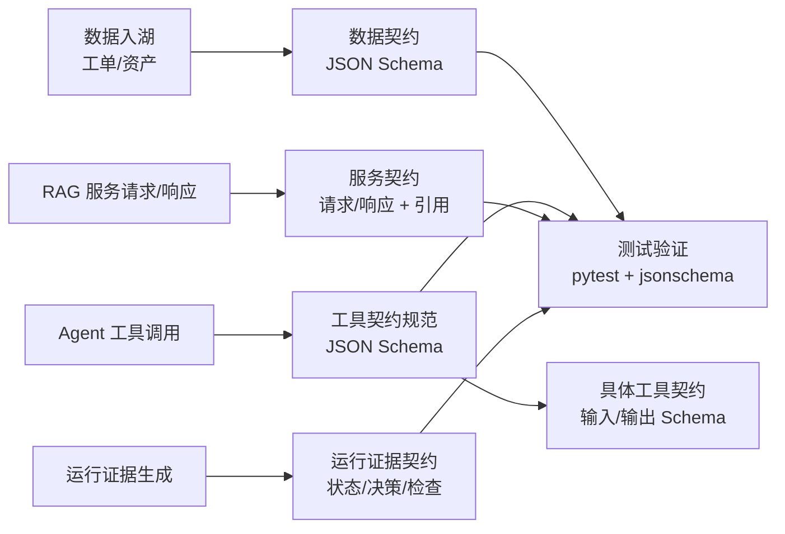
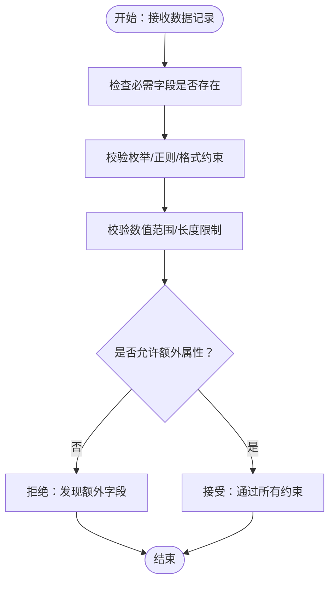
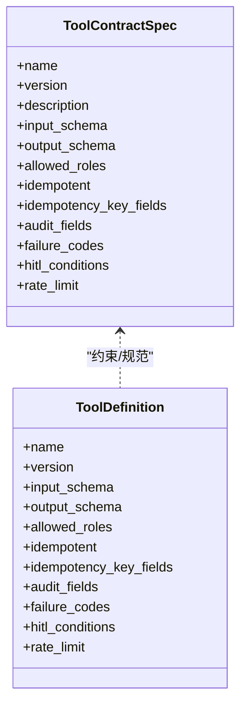
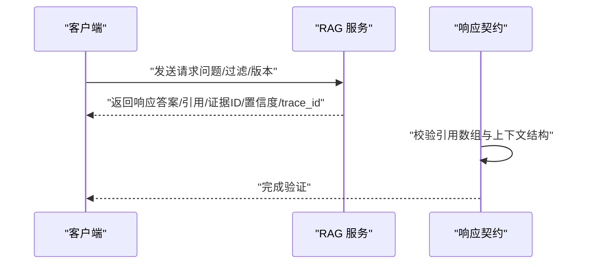
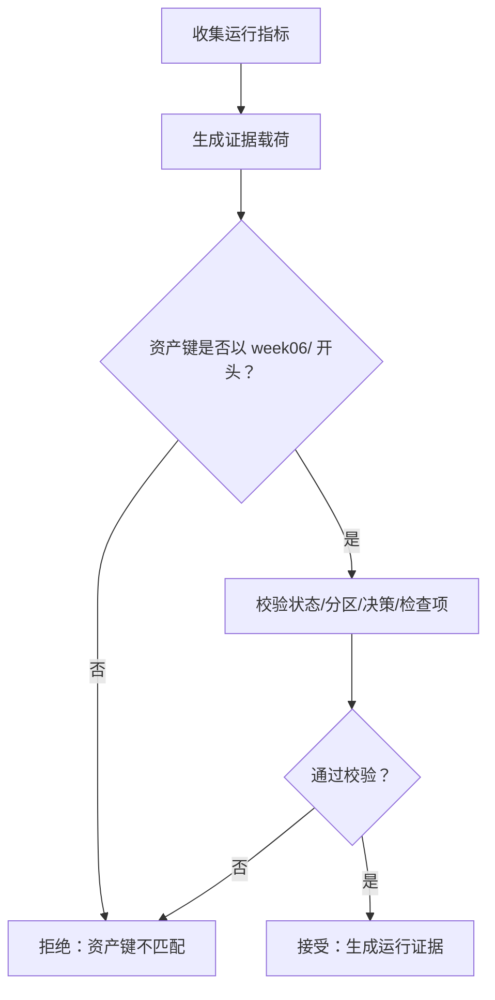
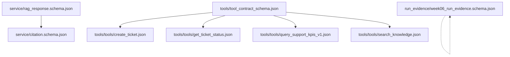

# 契约层（JSON Schema）

<cite>
**本文引用的文件**
- [contracts/data/ticket_contract.json](file://contracts/data/ticket_contract.json)
- [contracts/data/audio_asset_contract.json](file://contracts/data/audio_asset_contract.json)
- [contracts/data/doc_asset_contract.json](file://contracts/data/doc_asset_contract.json)
- [contracts/data/video_asset_contract.json](file://contracts/data/video_asset_contract.json)
- [contracts/tools/tool_contract_schema.json](file://contracts/tools/tool_contract_schema.json)
- [contracts/tools/tools/create_ticket.json](file://contracts/tools/tools/create_ticket.json)
- [contracts/tools/tools/get_ticket_status.json](file://contracts/tools/tools/get_ticket_status.json)
- [contracts/tools/tools/query_support_kpis_v1.json](file://contracts/tools/tools/query_support_kpis_v1.json)
- [contracts/tools/tools/search_knowledge.json](file://contracts/tools/tools/search_knowledge.json)
- [contracts/service/rag_request.schema.json](file://contracts/service/rag_request.schema.json)
- [contracts/service/rag_response.schema.json](file://contracts/service/rag_response.schema.json)
- [contracts/service/citation.schema.json](file://contracts/service/citation.schema.json)
- [contracts/run_evidence/week06_run_evidence.schema.json](file://contracts/run_evidence/week06_run_evidence.schema.json)
- [tests/contract/test_json_schemas.py](file://tests/contract/test_json_schemas.py)
- [tests/contract/test_week02_gate.py](file://tests/contract/test_week02_gate.py)
- [tests/contract/test_week06_run_evidence_schema.py](file://tests/contract/test_week06_run_evidence_schema.py)
- [tests/contract/test_week8_rag_contracts.py](file://tests/contract/test_week8_rag_contracts.py)
</cite>

## 目录
1. [简介](#简介)
2. [项目结构](#项目结构)
3. [核心组件](#核心组件)
4. [架构总览](#架构总览)
5. [详细组件分析](#详细组件分析)
6. [依赖关系分析](#依赖关系分析)
7. [性能考量](#性能考量)
8. [故障排查指南](#故障排查指南)
9. [结论](#结论)
10. [附录](#附录)

## 简介
本文件系统化梳理 OmniSupport Copilot 的契约层（JSON Schema），聚焦三类契约：
- 数据契约：统一数据结构与约束，保障湖仓与下游消费一致性
- 工具契约：规范 Agent 可调用工具的输入输出、审计、错误码与人工介入条件
- 发布契约：定义服务响应、引用对象与运行证据的结构与版本

契约层的核心价值在于：
- 兼容性保证：通过强约束确保跨模块、跨版本的结构一致
- 机读接口规范：Schema 即文档，便于自动生成 SDK、SDK 校验与 IDE 提示
- 自动化测试与验证：以测试驱动的方式持续验证契约有效性
- 版本治理：通过 $id、version、schema_version 字段实现清晰的版本追踪与迁移

## 项目结构
契约层主要位于 contracts 目录，按领域划分为 data、tools、service、run_evidence 四个子目录，并辅以 tests/contract 中的契约验证测试。

```mermaid
graph TB
subgraph "契约目录"
D1["data/ticket_contract.json"]
D2["data/audio_asset_contract.json"]
D3["data/doc_asset_contract.json"]
D4["data/video_asset_contract.json"]
T0["tools/tool_contract_schema.json"]
T1["tools/tools/create_ticket.json"]
T2["tools/tools/get_ticket_status.json"]
T3["tools/tools/query_support_kpis_v1.json"]
T4["tools/tools/search_knowledge.json"]
S1["service/rag_request.schema.json"]
S2["service/rag_response.schema.json"]
S3["service/citation.schema.json"]
R1["run_evidence/week06_run_evidence.schema.json"]
end
subgraph "测试"
X1["tests/contract/test_json_schemas.py"]
X2["tests/contract/test_week02_gate.py"]
X3["tests/contract/test_week06_run_evidence_schema.py"]
X4["tests/contract/test_week8_rag_contracts.py"]
end
D1 --- X2
D2 --- X2
D3 --- X2
D4 --- X2
T0 --- X1
T1 --- X1
T2 --- X1
T3 --- X1
T4 --- X1
S1 --- X4
S2 --- X4
S3 --- X4
R1 --- X3
```

图表来源
- [contracts/data/ticket_contract.json:1-125](file://contracts/data/ticket_contract.json#L1-L125)
- [contracts/data/audio_asset_contract.json:1-103](file://contracts/data/audio_asset_contract.json#L1-L103)
- [contracts/data/doc_asset_contract.json:1-94](file://contracts/data/doc_asset_contract.json#L1-L94)
- [contracts/data/video_asset_contract.json:1-107](file://contracts/data/video_asset_contract.json#L1-L107)
- [contracts/tools/tool_contract_schema.json:1-93](file://contracts/tools/tool_contract_schema.json#L1-L93)
- [contracts/tools/tools/create_ticket.json:1-95](file://contracts/tools/tools/create_ticket.json#L1-L95)
- [contracts/tools/tools/get_ticket_status.json:1-67](file://contracts/tools/tools/get_ticket_status.json#L1-L67)
- [contracts/tools/tools/query_support_kpis_v1.json:1-135](file://contracts/tools/tools/query_support_kpis_v1.json#L1-L135)
- [contracts/tools/tools/search_knowledge.json:1-93](file://contracts/tools/tools/search_knowledge.json#L1-L93)
- [contracts/service/rag_request.schema.json:1-23](file://contracts/service/rag_request.schema.json#L1-L23)
- [contracts/service/rag_response.schema.json:1-58](file://contracts/service/rag_response.schema.json#L1-L58)
- [contracts/service/citation.schema.json:1-24](file://contracts/service/citation.schema.json#L1-L24)
- [contracts/run_evidence/week06_run_evidence.schema.json:1-137](file://contracts/run_evidence/week06_run_evidence.schema.json#L1-L137)
- [tests/contract/test_json_schemas.py:1-131](file://tests/contract/test_json_schemas.py#L1-L131)
- [tests/contract/test_week02_gate.py:1-148](file://tests/contract/test_week02_gate.py#L1-L148)
- [tests/contract/test_week06_run_evidence_schema.py:1-75](file://tests/contract/test_week06_run_evidence_schema.py#L1-L75)
- [tests/contract/test_week8_rag_contracts.py:1-64](file://tests/contract/test_week8_rag_contracts.py#L1-L64)

章节来源
- [contracts/data/ticket_contract.json:1-125](file://contracts/data/ticket_contract.json#L1-L125)
- [contracts/tools/tool_contract_schema.json:1-93](file://contracts/tools/tool_contract_schema.json#L1-L93)
- [contracts/service/rag_request.schema.json:1-23](file://contracts/service/rag_request.schema.json#L1-L23)
- [contracts/run_evidence/week06_run_evidence.schema.json:1-137](file://contracts/run_evidence/week06_run_evidence.schema.json#L1-L137)

## 核心组件
- 数据契约（Data Contracts）
  - 工单契约：统一工单结构、枚举、时间格式、PII 与质量门禁字段
  - 音频资产契约：通话/合成/录音等多类型资产的元数据与质量标准
  - 文档资产契约：文档类型、指纹、URL、语言、页数、许可证与所有权
  - 视频资产契约：视频类型、时长、关键帧、OCR/字幕、语言与许可证
- 工具契约（Tool Contracts）
  - 工具契约规范：定义工具元数据、输入输出 Schema、角色授权、幂等性、审计字段、失败码、人工介入条件与速率限制
  - 具体工具：创建工单、查询工单状态、检索知识、查询支持 KPI
- 服务契约（Service Contracts）
  - RAG 请求/响应契约：问题、过滤条件、召回上下文、引用与调试信息
  - 引用对象契约：证据 ID、块 ID、文档 ID、来源 URL、页码、引用片段等
- 运行证据契约（Run Evidence Contract）
  - 定义运行证据的版本、分区键、状态、计数、原因码、下游决策与检查项

章节来源
- [contracts/data/ticket_contract.json:1-125](file://contracts/data/ticket_contract.json#L1-L125)
- [contracts/data/audio_asset_contract.json:1-103](file://contracts/data/audio_asset_contract.json#L1-L103)
- [contracts/data/doc_asset_contract.json:1-94](file://contracts/data/doc_asset_contract.json#L1-L94)
- [contracts/data/video_asset_contract.json:1-107](file://contracts/data/video_asset_contract.json#L1-L107)
- [contracts/tools/tool_contract_schema.json:1-93](file://contracts/tools/tool_contract_schema.json#L1-L93)
- [contracts/tools/tools/create_ticket.json:1-95](file://contracts/tools/tools/create_ticket.json#L1-L95)
- [contracts/tools/tools/get_ticket_status.json:1-67](file://contracts/tools/tools/get_ticket_status.json#L1-L67)
- [contracts/tools/tools/query_support_kpis_v1.json:1-135](file://contracts/tools/tools/query_support_kpis_v1.json#L1-L135)
- [contracts/tools/tools/search_knowledge.json:1-93](file://contracts/tools/tools/search_knowledge.json#L1-L93)
- [contracts/service/rag_request.schema.json:1-23](file://contracts/service/rag_request.schema.json#L1-L23)
- [contracts/service/rag_response.schema.json:1-58](file://contracts/service/rag_response.schema.json#L1-L58)
- [contracts/service/citation.schema.json:1-24](file://contracts/service/citation.schema.json#L1-L24)
- [contracts/run_evidence/week06_run_evidence.schema.json:1-137](file://contracts/run_evidence/week06_run_evidence.schema.json#L1-L137)

## 架构总览
契约层作为系统“结构契约”，贯穿数据入湖、工具调用、服务响应与运行证据生成的全链路，形成“Schema 即规范”的闭环。

图表来源
- [contracts/data/ticket_contract.json:1-125](file://contracts/data/ticket_contract.json#L1-L125)
- [contracts/tools/tool_contract_schema.json:1-93](file://contracts/tools/tool_contract_schema.json#L1-L93)
- [contracts/tools/tools/search_knowledge.json:1-93](file://contracts/tools/tools/search_knowledge.json#L1-L93)
- [contracts/service/rag_request.schema.json:1-23](file://contracts/service/rag_request.schema.json#L1-L23)
- [contracts/service/rag_response.schema.json:1-58](file://contracts/service/rag_response.schema.json#L1-L58)
- [contracts/service/citation.schema.json:1-24](file://contracts/service/citation.schema.json#L1-L24)
- [contracts/run_evidence/week06_run_evidence.schema.json:1-137](file://contracts/run_evidence/week06_run_evidence.schema.json#L1-L137)
- [tests/contract/test_week8_rag_contracts.py:1-64](file://tests/contract/test_week8_rag_contracts.py#L1-L64)

## 详细组件分析

### 数据契约：统一结构与约束
- 设计原则
  - 明确 required 列表，确保关键字段齐全
  - 使用枚举与正则表达式限定取值域与格式
  - 对日期时间统一采用 date-time 格式
  - 通过 additionalProperties:false 严格控制扩展字段
- 字段验证规则示例
  - 工单 ID 格式校验、状态/优先级/产品线枚举、PII 级别与质量门禁
  - 音频资产类型、时长最小值、ASR 置信度范围、许可证枚举
  - 文档资产指纹 SHA-256 校验、URI 格式、页数最小值、语言默认值
  - 视频资产类型、关键帧/OCR/字幕可空、许可证枚举
- 版本管理策略
  - 通过 schema_version 或 $id 中的版本段落区分版本
  - 保持向后兼容的新增字段与可空字段策略

图表来源
- [contracts/data/ticket_contract.json:1-125](file://contracts/data/ticket_contract.json#L1-L125)
- [contracts/data/audio_asset_contract.json:1-103](file://contracts/data/audio_asset_contract.json#L1-L103)
- [contracts/data/doc_asset_contract.json:1-94](file://contracts/data/doc_asset_contract.json#L1-L94)
- [contracts/data/video_asset_contract.json:1-107](file://contracts/data/video_asset_contract.json#L1-L107)

章节来源
- [contracts/data/ticket_contract.json:1-125](file://contracts/data/ticket_contract.json#L1-L125)
- [contracts/data/audio_asset_contract.json:1-103](file://contracts/data/audio_asset_contract.json#L1-L103)
- [contracts/data/doc_asset_contract.json:1-94](file://contracts/data/doc_asset_contract.json#L1-L94)
- [contracts/data/video_asset_contract.json:1-107](file://contracts/data/video_asset_contract.json#L1-L107)

### 工具契约：规范工具行为与安全边界
- 设计原则
  - 元数据标准化：name、version、description、allowed_roles、idempotent
  - 输入输出 Schema 严格定义，兼容 OpenAI function calling
  - 审计字段强制：log_input/log_output/log_actor/retention_days
  - 失败码与人工介入条件：明确错误码映射与触发动作
  - 速率限制：分钟/小时调用上限
- 字段验证规则示例
  - 工具名称 pattern、版本 pattern、角色列表非空
  - 幂等键字段列表与审计字段完整性
  - 失败码对象键为字符串、值为描述
- 版本管理策略
  - 工具版本以 vMAJOR.MINOR 形式管理
  - 通过 allowed_roles、failure_codes、hitl_conditions 的变更进行影响评估

图表来源
- [contracts/tools/tool_contract_schema.json:1-93](file://contracts/tools/tool_contract_schema.json#L1-L93)
- [contracts/tools/tools/create_ticket.json:1-95](file://contracts/tools/tools/create_ticket.json#L1-L95)
- [contracts/tools/tools/get_ticket_status.json:1-67](file://contracts/tools/tools/get_ticket_status.json#L1-L67)
- [contracts/tools/tools/query_support_kpis_v1.json:1-135](file://contracts/tools/tools/query_support_kpis_v1.json#L1-L135)
- [contracts/tools/tools/search_knowledge.json:1-93](file://contracts/tools/tools/search_knowledge.json#L1-L93)

章节来源
- [contracts/tools/tool_contract_schema.json:1-93](file://contracts/tools/tool_contract_schema.json#L1-L93)
- [contracts/tools/tools/create_ticket.json:1-95](file://contracts/tools/tools/create_ticket.json#L1-L95)
- [contracts/tools/tools/get_ticket_status.json:1-67](file://contracts/tools/tools/get_ticket_status.json#L1-L67)
- [contracts/tools/tools/query_support_kpis_v1.json:1-135](file://contracts/tools/tools/query_support_kpis_v1.json#L1-L135)
- [contracts/tools/tools/search_knowledge.json:1-93](file://contracts/tools/tools/search_knowledge.json#L1-L93)

### 服务契约：RAG 请求/响应与引用
- 设计原则
  - 请求侧：问题长度、过滤维度、top_k、索引/数据/提示版本释放 ID、调试开关
  - 响应侧：答案、引用数组、证据 ID、置信度、放弃原因、trace_id、检索上下文与调试信息
  - 引用对象：证据 ID、块 ID、文档 ID、来源 URL、页码、引用片段、分数
- 字段验证规则示例
  - 问题长度限制、top_k 范围、置信度范围、引用对象必填字段
  - 检索上下文的 chunk_id/content/score 必填
- 版本管理策略
  - 通过 release_id、data_release_id、index_release_id、prompt_release_id 区分版本
  - 引用对象 schema 通过 $ref 组合，保持解耦与复用

图表来源
- [contracts/service/rag_request.schema.json:1-23](file://contracts/service/rag_request.schema.json#L1-L23)
- [contracts/service/rag_response.schema.json:1-58](file://contracts/service/rag_response.schema.json#L1-L58)
- [contracts/service/citation.schema.json:1-24](file://contracts/service/citation.schema.json#L1-L24)
- [tests/contract/test_week8_rag_contracts.py:1-64](file://tests/contract/test_week8_rag_contracts.py#L1-L64)

章节来源
- [contracts/service/rag_request.schema.json:1-23](file://contracts/service/rag_request.schema.json#L1-L23)
- [contracts/service/rag_response.schema.json:1-58](file://contracts/service/rag_response.schema.json#L1-L58)
- [contracts/service/citation.schema.json:1-24](file://contracts/service/citation.schema.json#L1-L24)
- [tests/contract/test_week8_rag_contracts.py:1-64](file://tests/contract/test_week8_rag_contracts.py#L1-L64)

### 运行证据契约：流程治理与决策
- 设计原则
  - 明确证据版本、运行 ID、资产键、分区键、状态、时间戳、报告路径
  - 原因码去重、输入/输出行数、下游决策（推进/人工复核/暂停/仅试跑）
  - 检查项：名称、状态、原因码、元数据
- 字段验证规则示例
  - 资产键以 week06/ 开头、分区键为日期格式、状态枚举
  - 下游决策枚举、检查项必填字段
- 版本管理策略
  - 通过 evidence_schema_version 与 $id 版本段落区分版本

图表来源
- [contracts/run_evidence/week06_run_evidence.schema.json:1-137](file://contracts/run_evidence/week06_run_evidence.schema.json#L1-L137)
- [tests/contract/test_week06_run_evidence_schema.py:1-75](file://tests/contract/test_week06_run_evidence_schema.py#L1-L75)

章节来源
- [contracts/run_evidence/week06_run_evidence.schema.json:1-137](file://contracts/run_evidence/week06_run_evidence.schema.json#L1-L137)
- [tests/contract/test_week06_run_evidence_schema.py:1-75](file://tests/contract/test_week06_run_evidence_schema.py#L1-L75)

## 依赖关系分析
- 内部依赖
  - RAG 响应引用 citation.schema.json；部分字段可为空
  - 工具契约通过输入/输出 Schema 与服务契约解耦
- 外部依赖
  - 测试使用 jsonschema.Draft202012Validator 进行契约校验
  - 引用解析器 RefResolver 从 schema 中加载本地引用

图表来源
- [contracts/service/rag_response.schema.json:1-58](file://contracts/service/rag_response.schema.json#L1-L58)
- [contracts/service/citation.schema.json:1-24](file://contracts/service/citation.schema.json#L1-L24)
- [contracts/tools/tool_contract_schema.json:1-93](file://contracts/tools/tool_contract_schema.json#L1-L93)
- [contracts/tools/tools/create_ticket.json:1-95](file://contracts/tools/tools/create_ticket.json#L1-L95)
- [contracts/tools/tools/get_ticket_status.json:1-67](file://contracts/tools/tools/get_ticket_status.json#L1-L67)
- [contracts/tools/tools/query_support_kpis_v1.json:1-135](file://contracts/tools/tools/query_support_kpis_v1.json#L1-L135)
- [contracts/tools/tools/search_knowledge.json:1-93](file://contracts/tools/tools/search_knowledge.json#L1-L93)
- [contracts/run_evidence/week06_run_evidence.schema.json:1-137](file://contracts/run_evidence/week06_run_evidence.schema.json#L1-L137)

章节来源
- [tests/contract/test_week8_rag_contracts.py:1-64](file://tests/contract/test_week8_rag_contracts.py#L1-L64)

## 性能考量
- Schema 校验成本
  - Draft202012Validator 在大型响应（如检索上下文数组）上开销较高，建议在边缘层缓存已知有效载荷
- 引用解析
  - 使用 RefResolver 一次性加载引用，避免重复 IO
- 速率限制
  - 工具契约内置 rate_limit，结合服务端限流策略降低抖动

## 故障排查指南
- 常见错误与定位
  - 必填字段缺失：检查 required 列表与实际载荷
  - 枚举/正则不匹配：核对枚举集合与格式约束
  - 引用对象不完整：确认 citation 与检索上下文必填字段
  - 运行证据资产键不匹配：确保以 week06/ 开头
- 测试驱动验证
  - 使用 pytest + jsonschema 验证契约文件与示例数据
  - 对无效样例断言 ValidationError，确保拒绝对应字段

章节来源
- [tests/contract/test_json_schemas.py:1-131](file://tests/contract/test_json_schemas.py#L1-L131)
- [tests/contract/test_week02_gate.py:1-148](file://tests/contract/test_week02_gate.py#L1-L148)
- [tests/contract/test_week06_run_evidence_schema.py:1-75](file://tests/contract/test_week06_run_evidence_schema.py#L1-L75)
- [tests/contract/test_week8_rag_contracts.py:1-64](file://tests/contract/test_week8_rag_contracts.py#L1-L64)

## 结论
契约层通过 JSON Schema 将“结构即规范”落地到数据、工具与服务的全链路，形成可验证、可演进、可治理的工程能力。建议在后续实践中：
- 以测试先行的方式持续完善契约覆盖
- 通过版本字段与 $id 管理契约演进
- 将契约校验集成到 CI/CD 与数据入湖/工具注册流程
- 逐步引入契约文档生成与 SDK 自动化

## 附录
- 契约编写示例路径
  - 数据契约：[工单契约:1-125](file://contracts/data/ticket_contract.json#L1-L125)、[音频资产契约:1-103](file://contracts/data/audio_asset_contract.json#L1-L103)、[文档资产契约:1-94](file://contracts/data/doc_asset_contract.json#L1-L94)、[视频资产契约:1-107](file://contracts/data/video_asset_contract.json#L1-L107)
  - 工具契约：[工具契约规范:1-93](file://contracts/tools/tool_contract_schema.json#L1-L93)、[创建工单:1-95](file://contracts/tools/tools/create_ticket.json#L1-L95)、[查询工单状态:1-67](file://contracts/tools/tools/get_ticket_status.json#L1-L67)、[检索知识:1-93](file://contracts/tools/tools/search_knowledge.json#L1-L93)、[查询支持 KPI:1-135](file://contracts/tools/tools/query_support_kpis_v1.json#L1-L135)
  - 服务契约：[RAG 请求:1-23](file://contracts/service/rag_request.schema.json#L1-L23)、[RAG 响应:1-58](file://contracts/service/rag_response.schema.json#L1-L58)、[引用对象:1-24](file://contracts/service/citation.schema.json#L1-L24)
  - 运行证据契约：[运行证据:1-137](file://contracts/run_evidence/week06_run_evidence.schema.json#L1-L137)
- 验证工具与方法
  - 使用 pytest + jsonschema.Draft202012Validator
  - 引用解析：RefResolver.from_schema(schema, store=...)
- 契约演进最佳实践
  - 保持向后兼容：新增字段设为可选并提供默认值
  - 清晰版本语义：通过 $id 与 version 字段明确版本
  - 严格的 required 与 additionalProperties 控制
  - 将失败码与人工介入条件纳入契约，提升可观测性与可控性