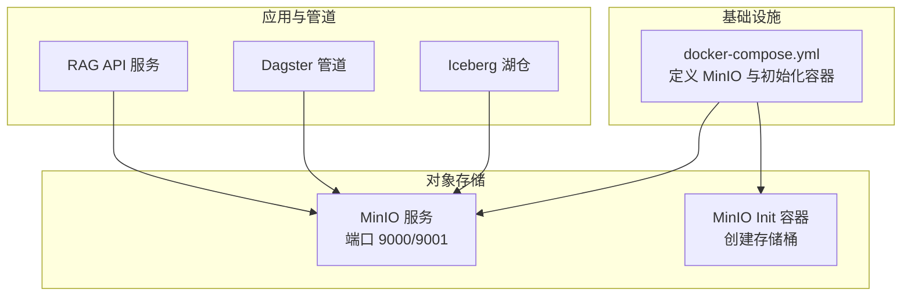
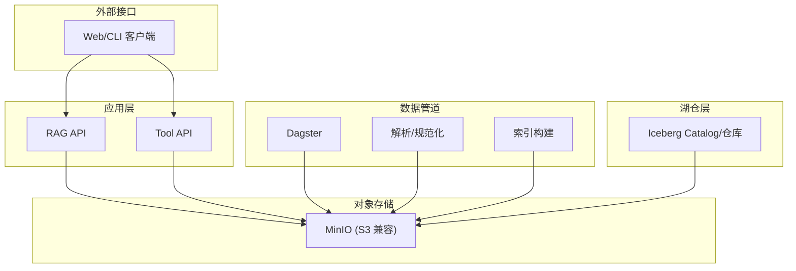
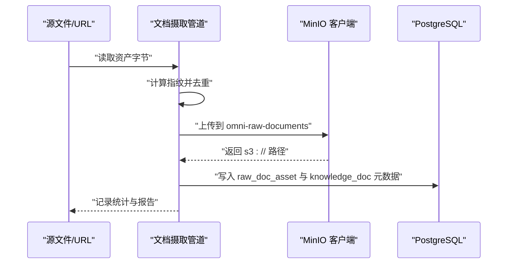
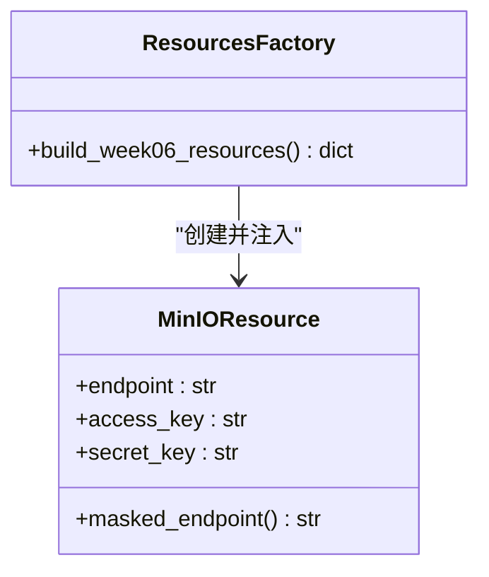
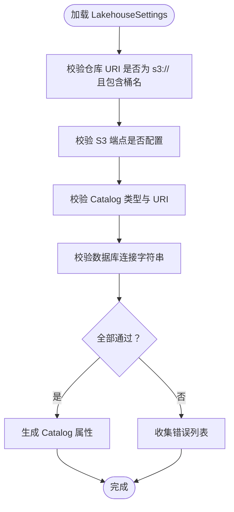
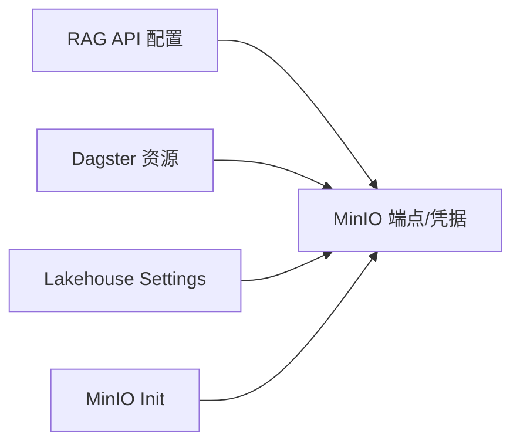

# 对象存储层（MinIO）

<cite>
**本文引用的文件**
- [docker-compose.yml](file://infra/docker-compose.yml)
- [doc_ingest.py](file://pipelines/ingestion/doc_ingest.py)
- [settings.py](file://pipelines/lakehouse/settings.py)
- [config.py](file://services/rag_api/app/config.py)
- [resources.py](file://pipelines/data_factory/resources.py)
- [minio.py](file://pipelines/resources/minio.py)
- [definitions.py](file://pipelines/definitions.py)
</cite>

## 目录
1. [引言](#引言)
2. [项目结构](#项目结构)
3. [核心组件](#核心组件)
4. [架构总览](#架构总览)
5. [详细组件分析](#详细组件分析)
6. [依赖分析](#依赖分析)
7. [性能考虑](#性能考虑)
8. [故障排查指南](#故障排查指南)
9. [结论](#结论)
10. [附录](#附录)

## 引言
本文件聚焦 OmniSupport Copilot 的对象存储层（MinIO），系统性梳理其配置与使用方式，覆盖存储桶管理、访问控制策略、数据生命周期管理，并阐明对象存储在系统中的关键作用：作为原始数据的长期存储、工单附件的保存、日志文件的归档等。同时，详细说明 MinIO 与系统其他层的集成方式，包括数据摄取流程中的对象上传、数据管道中的文件访问、以及与 Iceberg 的数据交换机制。最后提供配置示例、安全最佳实践和性能优化建议。

## 项目结构
MinIO 在本项目中以 Docker Compose 服务形式部署，包含主服务与初始化容器，负责创建多个业务域的存储桶分区，供数据摄取、解析、湖仓与索引等模块使用。

**图表来源**
- [docker-compose.yml:38-86](file://infra/docker-compose.yml#L38-L86)

**章节来源**
- [docker-compose.yml:38-86](file://infra/docker-compose.yml#L38-L86)

## 核心组件
- MinIO 服务与初始化容器
  - MinIO 服务暴露 S3 兼容 API 与 Web 控制台，使用健康检查确保可用性。
  - 初始化容器在 MinIO 就绪后自动创建多个业务域存储桶，避免手动运维。
- MinIO 客户端封装（用于文档摄取）
  - 提供上传字节流、上传本地文件、存在性检查等能力，统一内容类型设置。
- Lakehouse 设置（Iceberg 与 MinIO 集成）
  - 通过环境变量配置 Iceberg Catalog 与仓库地址，要求仓库 URI 为 s3:// 并包含桶名。
- 应用配置（RAG API）
  - 提供 MinIO 端点、访问密钥、桶名等配置项，支撑检索与索引相关对象访问。
- Dagster 资源装配
  - 将 MinIO 端点、访问密钥等参数注入到 Week06 数据工厂资源中，供资产与作业使用。

**章节来源**
- [docker-compose.yml:38-86](file://infra/docker-compose.yml#L38-L86)
- [doc_ingest.py:36-78](file://pipelines/ingestion/doc_ingest.py#L36-L78)
- [settings.py:20-38](file://pipelines/lakehouse/settings.py#L20-L38)
- [config.py:17-21](file://services/rag_api/app/config.py#L17-L21)
- [resources.py:13-28](file://pipelines/data_factory/resources.py#L13-L28)
- [minio.py:6-13](file://pipelines/resources/minio.py#L6-L13)

## 架构总览
下图展示 MinIO 在系统中的位置及其与各子系统的交互关系。

**图表来源**
- [docker-compose.yml:38-86](file://infra/docker-compose.yml#L38-L86)
- [config.py:17-21](file://services/rag_api/app/config.py#L17-L21)
- [settings.py:20-38](file://pipelines/lakehouse/settings.py#L20-L38)

## 详细组件分析

### MinIO 存储桶管理
- 自动创建的存储桶分区（由初始化容器负责）
  - omni-raw-documents：存放原始文档对象
  - omni-raw-audio：存放原始音频对象
  - omni-raw-video：存放原始视频对象
  - omni-raw-tickets：存放原始工单对象
  - omni-parsed：存放解析后的中间制品
  - omni-indexes：存放向量索引等检索制品
  - omni-evals：存放评估与回放产物
  - omni-releases：存放发布制品
  - omni-lakehouse：作为 Iceberg 仓库的后端存储
- 建议
  - 为不同域划分独立存储桶，便于权限与生命周期策略隔离。
  - 对长期归档对象启用版本控制与跨区域复制（如需）。

**章节来源**
- [docker-compose.yml:65-86](file://infra/docker-compose.yml#L65-L86)

### MinIO 访问控制策略
- 凭据与端点
  - MinIO 服务默认使用根用户凭据运行；在容器编排中通过环境变量注入。
  - 应用与管道通过环境变量或资源配置注入访问密钥与端点。
- 策略建议
  - 生产环境应为不同服务与角色分配专用访问密钥与只读/读写策略。
  - 使用 HTTPS 终止与网络隔离，限制对 9000/9001 端口的访问范围。
  - 对敏感桶启用多因素认证与审计日志。

**章节来源**
- [docker-compose.yml:46-48](file://infra/docker-compose.yml#L46-L48)
- [docker-compose.yml:99-101](file://infra/docker-compose.yml#L99-L101)
- [config.py:17-21](file://services/rag_api/app/config.py#L17-L21)
- [resources.py:17-20](file://pipelines/data_factory/resources.py#L17-L20)

### 数据生命周期管理
- 建议策略
  - 原始对象：长期保留，定期校验完整性。
  - 中间制品：短期保留（如 7 天），到期删除。
  - 归档对象：冷存储分层，降低长期成本。
  - 版本控制：对关键对象启用版本，防止误删。
- 实施要点
  - 结合存储桶生命周期策略与对象标签，自动化清理过期对象。
  - 对大文件采用分片上传与断点续传，提升稳定性。

[本节为通用实践建议，无需特定文件引用]

### 对象存储在系统中的作用
- 原始数据的长期存储
  - 文档、音频、视频、工单等原始对象统一存放在对应存储桶，保证数据可追溯与可恢复。
- 工单附件的保存
  - 工单相关附件以对象形式持久化，便于检索与审计。
- 日志文件的归档
  - 运行日志与审计日志归档至对象存储，支持离线分析与合规留存。

**章节来源**
- [docker-compose.yml:65-86](file://infra/docker-compose.yml#L65-L86)

### MinIO 与数据摄取流程的集成
- 文档摄取上传
  - 读取本地或 s3:// 路径的资产字节，计算指纹，去重后上传到 omni-raw-documents 存储桶。
  - 根据扩展名设置内容类型，确保浏览器与下游解析正确识别。
- 元数据写入
  - 成功上传后，将对象路径与指纹等元数据写入 PostgreSQL，形成“对象路径 + 关系”的双写。

**图表来源**
- [doc_ingest.py:172-276](file://pipelines/ingestion/doc_ingest.py#L172-L276)
- [doc_ingest.py:36-78](file://pipelines/ingestion/doc_ingest.py#L36-L78)

**章节来源**
- [doc_ingest.py:172-276](file://pipelines/ingestion/doc_ingest.py#L172-L276)
- [doc_ingest.py:36-78](file://pipelines/ingestion/doc_ingest.py#L36-L78)

### MinIO 与数据管道的集成
- Dagster 资源装配
  - 将 MinIO 端点、访问密钥等注入到 Week06 资源中，供资产与作业使用。
- 资源类定义
  - MinIOResource 提供端点与凭据字段，便于在管道中统一管理。

**图表来源**
- [minio.py:6-13](file://pipelines/resources/minio.py#L6-L13)
- [resources.py:13-28](file://pipelines/data_factory/resources.py#L13-L28)

**章节来源**
- [resources.py:13-28](file://pipelines/data_factory/resources.py#L13-L28)
- [minio.py:6-13](file://pipelines/resources/minio.py#L6-L13)
- [definitions.py:32-37](file://pipelines/definitions.py#L32-L37)

### MinIO 与 Iceberg 的数据交换机制
- 仓库地址约束
  - Iceberg 仓库必须是 s3:// URI，并包含桶名；端点、凭据通过环境变量配置。
- 配置验证
  - 提供校验逻辑，确保 Catalog 类型、URI、仓库格式、端点与数据库连接等均满足要求。
- 运行时属性
  - 将仓库、S3 端点、凭据、区域与路径风格等转换为 Catalog 属性，供 Iceberg 使用。

**图表来源**
- [settings.py:90-111](file://pipelines/lakehouse/settings.py#L90-L111)
- [settings.py:77-88](file://pipelines/lakehouse/settings.py#L77-L88)

**章节来源**
- [settings.py:90-111](file://pipelines/lakehouse/settings.py#L90-L111)
- [settings.py:77-88](file://pipelines/lakehouse/settings.py#L77-L88)

## 依赖分析
- 组件耦合
  - RAG API 与 Dagster 通过环境变量依赖 MinIO 端点与凭据。
  - Lakehouse 设置对 MinIO 的仓库 URI 与端点有强约束。
  - 初始化容器依赖 MinIO 服务健康状态，确保存储桶创建成功。
- 外部依赖
  - MinIO 服务依赖 Docker Compose 网络与卷，确保稳定的数据持久化与连通性。

**图表来源**
- [docker-compose.yml:65-86](file://infra/docker-compose.yml#L65-L86)
- [config.py:17-21](file://services/rag_api/app/config.py#L17-L21)
- [resources.py:17-20](file://pipelines/data_factory/resources.py#L17-L20)
- [settings.py:20-38](file://pipelines/lakehouse/settings.py#L20-L38)

**章节来源**
- [docker-compose.yml:65-86](file://infra/docker-compose.yml#L65-L86)
- [config.py:17-21](file://services/rag_api/app/config.py#L17-L21)
- [resources.py:17-20](file://pipelines/data_factory/resources.py#L17-L20)
- [settings.py:20-38](file://pipelines/lakehouse/settings.py#L20-L38)

## 性能考虑
- 上传优化
  - 大文件采用分片上传与并发上传，结合断点续传提升稳定性。
  - 合理设置内容类型，减少下游解析与渲染开销。
- 命名与键设计
  - 使用产品线/类型/文件名的层级命名，便于查询与生命周期管理。
- 缓存与去重
  - 基于指纹进行对象存在性检查与去重，避免重复上传。
- 网络与带宽
  - 在容器网络内访问 MinIO，减少跨网段延迟；必要时开启压缩传输。

**章节来源**
- [doc_ingest.py:246-262](file://pipelines/ingestion/doc_ingest.py#L246-L262)
- [doc_ingest.py:52-70](file://pipelines/ingestion/doc_ingest.py#L52-L70)

## 故障排查指南
- MinIO 不可用
  - 症状：文档摄取跳过上传，记录警告信息。
  - 排查：确认 MinIO 服务健康、端点与凭据正确、网络连通。
- 上传失败
  - 症状：记录错误日志，统计错误数增加。
  - 排查：检查存储桶权限、对象键冲突、磁盘空间与配额。
- 生命周期策略未生效
  - 症状：过期对象未被清理。
  - 排查：核对存储桶策略、对象标签与时间设置。
- Iceberg 无法访问仓库
  - 症状：Catalog 初始化失败或读写异常。
  - 排查：确认仓库 URI、端点、凭据与网络可达性；检查 Lakehouse Settings 校验结果。

**章节来源**
- [doc_ingest.py:208-214](file://pipelines/ingestion/doc_ingest.py#L208-L214)
- [doc_ingest.py:256-258](file://pipelines/ingestion/doc_ingest.py#L256-L258)
- [settings.py:90-111](file://pipelines/lakehouse/settings.py#L90-L111)

## 结论
本项目通过 Docker Compose 将 MinIO 作为核心对象存储，配合初始化容器自动创建业务域存储桶，为文档摄取、解析、索引与湖仓数据交换提供统一的底层存储。通过严格的配置校验与资源注入，系统实现了对 MinIO 的安全、可控与高可用使用。建议在生产环境中进一步完善访问控制、生命周期策略与监控告警，以保障长期稳定运行。

## 附录

### 配置示例（环境变量）
- RAG API
  - MINIO_ENDPOINT：对象存储端点
  - MINIO_ACCESS_KEY：访问密钥
  - MINIO_SECRET_KEY：密钥
  - MINIO_BUCKET_INDEXES：索引对象所在桶
- Dagster（Week06）
  - MINIO_ENDPOINT：对象存储端点
  - MINIO_ACCESS_KEY：访问密钥
  - MINIO_SECRET_KEY：密钥
- Lakehouse（Iceberg）
  - ICEBERG_WAREHOUSE：s3:// 桶名的仓库地址
  - ICEBERG_S3_ENDPOINT：S3 端点
  - ICEBERG_S3_ACCESS_KEY_ID：访问密钥
  - ICEBERG_S3_SECRET_ACCESS_KEY：密钥

**章节来源**
- [config.py:17-21](file://services/rag_api/app/config.py#L17-L21)
- [resources.py:17-20](file://pipelines/data_factory/resources.py#L17-L20)
- [settings.py:40-61](file://pipelines/lakehouse/settings.py#L40-L61)