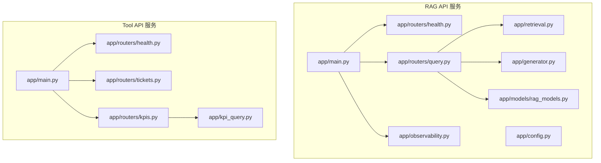
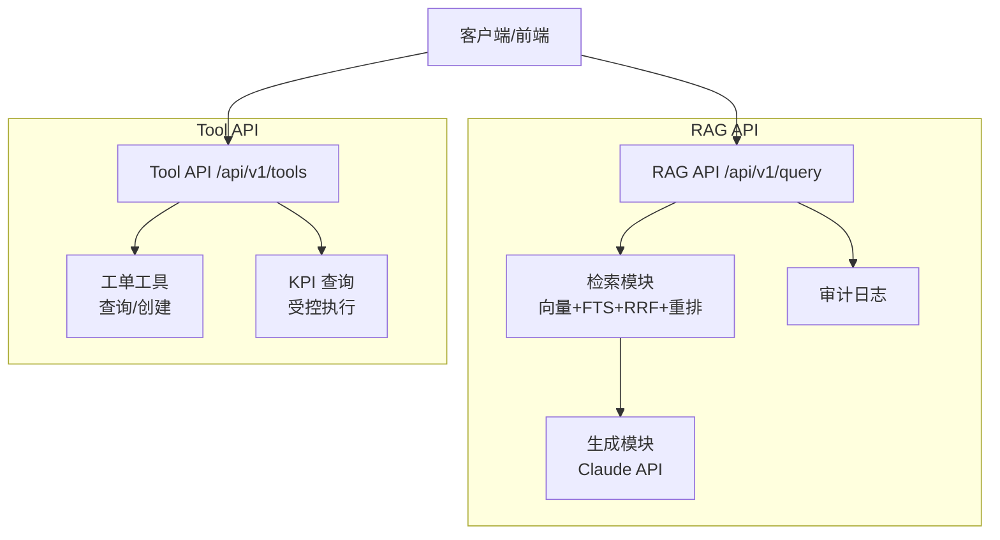
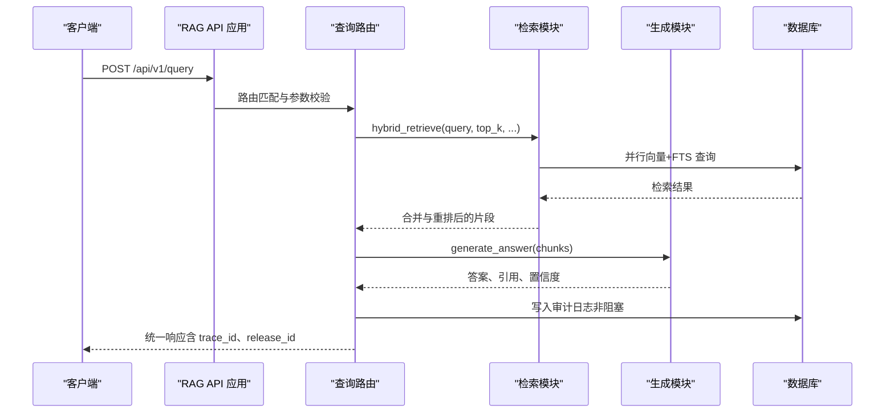
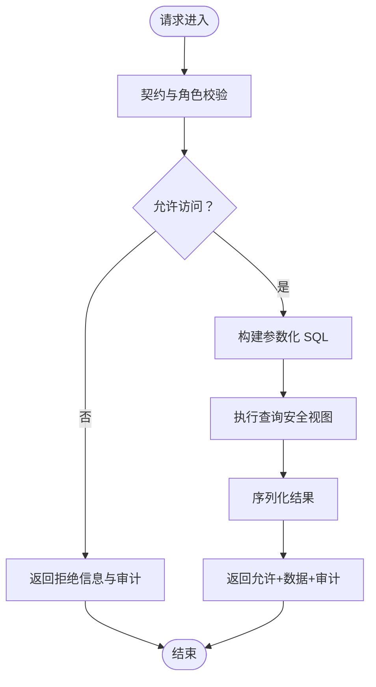
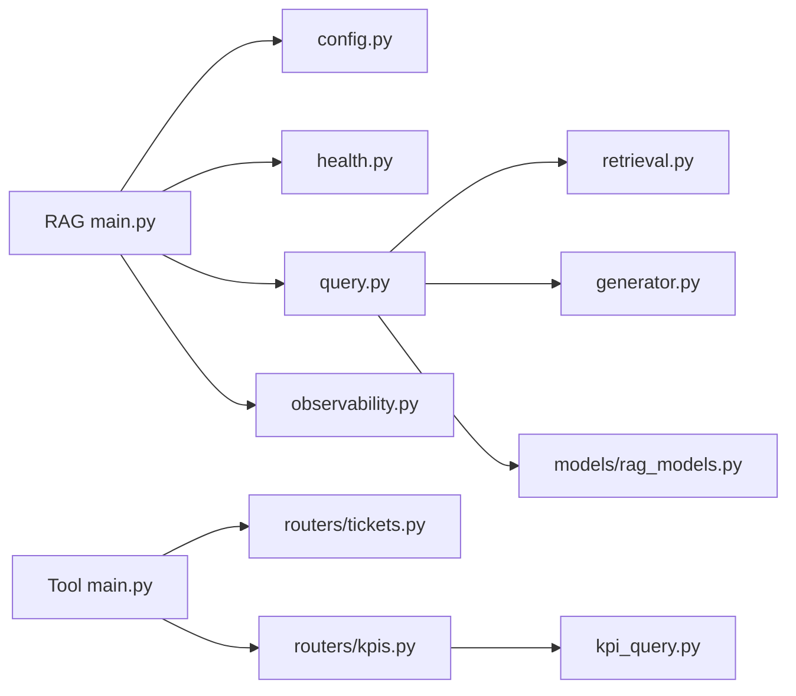

# 服务层（FastAPI）

<cite>
**本文档引用的文件**
- [services/rag_api/app/main.py](file://services/rag_api/app/main.py)
- [services/rag_api/app/config.py](file://services/rag_api/app/config.py)
- [services/rag_api/app/routers/query.py](file://services/rag_api/app/routers/query.py)
- [services/rag_api/app/routers/health.py](file://services/rag_api/app/routers/health.py)
- [services/rag_api/app/models/rag_models.py](file://services/rag_api/app/models/rag_models.py)
- [services/rag_api/app/generator.py](file://services/rag_api/app/generator.py)
- [services/rag_api/app/retrieval.py](file://services/rag_api/app/retrieval.py)
- [services/rag_api/app/observability.py](file://services/rag_api/app/observability.py)
- [services/tool_api/app/main.py](file://services/tool_api/app/main.py)
- [services/tool_api/app/routers/health.py](file://services/tool_api/app/routers/health.py)
- [services/tool_api/app/routers/tickets.py](file://services/tool_api/app/routers/tickets.py)
- [services/tool_api/app/routers/kpis.py](file://services/tool_api/app/routers/kpis.py)
- [services/tool_api/app/kpi_query.py](file://services/tool_api/app/kpi_query.py)
- [contracts/service/rag_response.schema.json](file://contracts/service/rag_response.schema.json)
- [contracts/tools/tools/create_ticket.json](file://contracts/tools/tools/create_ticket.json)
</cite>

## 目录
1. [简介](#简介)
2. [项目结构](#项目结构)
3. [核心组件](#核心组件)
4. [架构总览](#架构总览)
5. [详细组件分析](#详细组件分析)
6. [依赖分析](#依赖分析)
7. [性能考虑](#性能考虑)
8. [故障排查指南](#故障排查指南)
9. [结论](#结论)
10. [附录](#附录)

## 简介
本文件面向 OmniSupport Copilot 的服务层（基于 FastAPI 的微服务），系统化梳理两个核心服务的设计与实现：
- RAG API：提供知识检索与答案生成能力，包含混合检索链路、LLM 生成、证据引用与审计日志。
- Tool API：提供工单管理与 KPI 查询工具，强调契约驱动与受控访问。

文档重点覆盖：
- 路由组织与中间件配置
- 异常处理策略
- 认证授权机制现状与扩展建议
- 服务间通信模式与 API 设计原则
- 健康检查与可观测性集成
- 性能监控与优化建议

## 项目结构
服务层采用“按服务分目录”的组织方式，每个服务包含独立的 FastAPI 应用、路由、配置与可观测性模块；工具侧还包含受控查询的契约与度量注册表。

图表来源
- [services/rag_api/app/main.py:1-73](file://services/rag_api/app/main.py#L1-L73)
- [services/rag_api/app/routers/query.py:1-159](file://services/rag_api/app/routers/query.py#L1-L159)
- [services/rag_api/app/retrieval.py:1-445](file://services/rag_api/app/retrieval.py#L1-L445)
- [services/rag_api/app/generator.py:1-222](file://services/rag_api/app/generator.py#L1-L222)
- [services/tool_api/app/main.py:1-64](file://services/tool_api/app/main.py#L1-L64)
- [services/tool_api/app/routers/tickets.py:1-134](file://services/tool_api/app/routers/tickets.py#L1-L134)
- [services/tool_api/app/routers/kpis.py:1-18](file://services/tool_api/app/routers/kpis.py#L1-L18)
- [services/tool_api/app/kpi_query.py:1-271](file://services/tool_api/app/kpi_query.py#L1-L271)

章节来源
- [services/rag_api/app/main.py:1-73](file://services/rag_api/app/main.py#L1-L73)
- [services/tool_api/app/main.py:1-64](file://services/tool_api/app/main.py#L1-L64)

## 核心组件
- RAG API
  - 应用入口与生命周期：OTel 初始化、CORS、全局中间件、异常处理器、路由注册。
  - 查询路由：混合检索、LLM 生成、审计日志与响应构建。
  - 检索模块：向量检索、FTS、RRF 融合、交叉编码重排。
  - 生成模块：系统提示构建、调用 LLM、引用解析与置信度估计。
  - 模型定义：统一的请求/响应模型与健康检查模型。
  - 可观测性：OTel Tracing 与 FastAPI Instrumentation。
- Tool API
  - 应用入口：CORS、中间件、异常处理、路由注册。
  - 工单工具：查询状态与创建工单的占位实现，具备 HITL 触发与审计字段预留。
  - KPI 查询：基于契约与度量注册表的受控查询执行器。
  - 健康检查：最小化健康状态返回。

章节来源
- [services/rag_api/app/main.py:19-73](file://services/rag_api/app/main.py#L19-L73)
- [services/rag_api/app/routers/query.py:39-93](file://services/rag_api/app/routers/query.py#L39-L93)
- [services/rag_api/app/retrieval.py:386-445](file://services/rag_api/app/retrieval.py#L386-L445)
- [services/rag_api/app/generator.py:65-118](file://services/rag_api/app/generator.py#L65-L118)
- [services/rag_api/app/models/rag_models.py:39-76](file://services/rag_api/app/models/rag_models.py#L39-L76)
- [services/rag_api/app/observability.py:11-55](file://services/rag_api/app/observability.py#L11-L55)
- [services/tool_api/app/main.py:19-64](file://services/tool_api/app/main.py#L19-L64)
- [services/tool_api/app/routers/tickets.py:50-124](file://services/tool_api/app/routers/tickets.py#L50-L124)
- [services/tool_api/app/routers/kpis.py:14-17](file://services/tool_api/app/routers/kpis.py#L14-L17)
- [services/tool_api/app/kpi_query.py:200-228](file://services/tool_api/app/kpi_query.py#L200-L228)

## 架构总览
RAG API 与 Tool API 作为两个独立的 FastAPI 服务运行，共享统一的配置与可观测性约定。RAG API 通过检索与生成链路对外提供问答服务；Tool API 提供工单与 KPI 查询工具，并以契约与度量注册表保障访问安全与可控。

图表来源
- [services/rag_api/app/routers/query.py:39-93](file://services/rag_api/app/routers/query.py#L39-L93)
- [services/rag_api/app/retrieval.py:386-445](file://services/rag_api/app/retrieval.py#L386-L445)
- [services/rag_api/app/generator.py:65-118](file://services/rag_api/app/generator.py#L65-L118)
- [services/tool_api/app/routers/tickets.py:50-124](file://services/tool_api/app/routers/tickets.py#L50-L124)
- [services/tool_api/app/routers/kpis.py:14-17](file://services/tool_api/app/routers/kpis.py#L14-L17)
- [services/tool_api/app/kpi_query.py:200-228](file://services/tool_api/app/kpi_query.py#L200-L228)

## 详细组件分析

### RAG API：查询处理与答案生成
- 路由组织
  - 健康检查：/health
  - 查询端点：/api/v1/query（POST），返回统一响应模型
  - 管理端点：/api/v1/admin（占位）
- 中间件与异常
  - CORS：允许指定来源
  - 请求 ID 中间件：注入 X-Request-ID 并透传
  - 全局异常处理器：统一 500 错误响应，包含 release_id 与 request_id
- 检索链路
  - 并行执行向量检索与 FTS 检索
  - RRF 融合两路结果
  - 可选交叉编码重排
  - 过滤最低分阈值与 top_k
- 生成与引用
  - 构建系统提示与上下文
  - 调用 LLM 生成答案
  - 解析引用标记，生成可读引用列表
  - 置信度估计与降级策略
- 审计与追踪
  - 写入审计日志（非阻塞）
  - Span 属性包含 trace_id、release_id、产品线等
- 配置
  - 数据库、MinIO、LLM、检索参数、OTel、CORS、安全密钥等

图表来源
- [services/rag_api/app/routers/query.py:39-93](file://services/rag_api/app/routers/query.py#L39-L93)
- [services/rag_api/app/retrieval.py:386-445](file://services/rag_api/app/retrieval.py#L386-L445)
- [services/rag_api/app/generator.py:65-118](file://services/rag_api/app/generator.py#L65-L118)

章节来源
- [services/rag_api/app/routers/query.py:39-93](file://services/rag_api/app/routers/query.py#L39-L93)
- [services/rag_api/app/retrieval.py:132-445](file://services/rag_api/app/retrieval.py#L132-L445)
- [services/rag_api/app/generator.py:65-222](file://services/rag_api/app/generator.py#L65-L222)
- [services/rag_api/app/models/rag_models.py:39-76](file://services/rag_api/app/models/rag_models.py#L39-L76)
- [services/rag_api/app/observability.py:11-55](file://services/rag_api/app/observability.py#L11-L55)

### Tool API：工单管理与工具调用
- 路由组织
  - 健康检查：/health
  - 工单工具：/api/v1/tools/get_ticket_status、/api/v1/tools/create_ticket
  - KPI 查询：/api/v1/tools/query_support_kpis
- 工单工具
  - 查询状态：占位返回，后续接入数据库与权限校验
  - 创建工单：幂等键检查框架、HITL 触发条件、审计字段预留
- KPI 查询
  - 基于工具契约与度量注册表进行输入校验
  - 参数化 SQL 生成与安全视图查询
  - 审计记录输出
- 配置
  - CORS、中间件、异常处理、路由注册

图表来源
- [services/tool_api/app/routers/kpis.py:14-17](file://services/tool_api/app/routers/kpis.py#L14-L17)
- [services/tool_api/app/kpi_query.py:106-228](file://services/tool_api/app/kpi_query.py#L106-L228)

章节来源
- [services/tool_api/app/routers/tickets.py:50-124](file://services/tool_api/app/routers/tickets.py#L50-L124)
- [services/tool_api/app/routers/kpis.py:14-17](file://services/tool_api/app/routers/kpis.py#L14-L17)
- [services/tool_api/app/kpi_query.py:106-228](file://services/tool_api/app/kpi_query.py#L106-L228)

### 认证授权机制
- 当前实现
  - RAG API：未内置认证中间件，安全密钥用于本地开发场景
  - Tool API：未内置认证中间件，KPI 查询通过工具契约与度量注册表进行访问控制
- 扩展建议
  - 引入统一鉴权中间件（如 JWT/OAuth）
  - 将角色与资源权限映射至路由级别
  - 在审计日志中记录 actor 与授权决策

章节来源
- [services/rag_api/app/config.py:48-50](file://services/rag_api/app/config.py#L48-L50)
- [services/tool_api/app/kpi_query.py:116-132](file://services/tool_api/app/kpi_query.py#L116-L132)

### API 设计原则与契约驱动
- 响应一致性
  - 所有响应包含 trace_id、release_id，便于追踪与回滚
  - RAG 响应包含证据 ID、引用列表与置信度
- 契约驱动
  - 工具输入/输出通过 JSON Schema 定义
  - KPI 查询严格校验角色、指标、维度与过滤器
- 版本化
  - release_id、data_release_id、index_release_id、prompt_release_id 支持灰度与回滚

章节来源
- [services/rag_api/app/models/rag_models.py:57-76](file://services/rag_api/app/models/rag_models.py#L57-L76)
- [contracts/service/rag_response.schema.json:1-58](file://contracts/service/rag_response.schema.json#L1-L58)
- [contracts/tools/tools/create_ticket.json:1-95](file://contracts/tools/tools/create_ticket.json#L1-L95)

### 健康检查实现
- RAG API
  - /health：检查 API、数据库状态，返回整体状态与各组件检查项
- Tool API
  - /health：返回基础健康信息

章节来源
- [services/rag_api/app/routers/health.py:10-33](file://services/rag_api/app/routers/health.py#L10-L33)
- [services/tool_api/app/routers/health.py:7-14](file://services/tool_api/app/routers/health.py#L7-L14)

### 服务间通信模式
- RAG API 与 Tool API 作为独立服务运行，通过各自端点对外提供能力
- 工单与 KPI 查询可由上层业务系统或前端调用，无需直接跨服务耦合
- 建议引入统一网关或服务发现，以便未来扩展跨服务编排

## 依赖分析
- RAG API
  - 外部依赖：asyncpg、anthropic、sentence-transformers（可选）、OpenTelemetry
  - 内部模块：config、routers、models、retrieval、generator、observability
- Tool API
  - 外部依赖：asyncpg、jsonschema
  - 内部模块：config、routers、kpi_query

图表来源
- [services/rag_api/app/main.py:14-73](file://services/rag_api/app/main.py#L14-L73)
- [services/tool_api/app/main.py:15-64](file://services/tool_api/app/main.py#L15-L64)

章节来源
- [services/rag_api/app/main.py:14-73](file://services/rag_api/app/main.py#L14-L73)
- [services/tool_api/app/main.py:15-64](file://services/tool_api/app/main.py#L15-L64)

## 性能考虑
- 检索性能
  - 并行执行向量与 FTS 检索，减少总体延迟
  - RRF 融合与交叉编码重排需权衡准确率与延迟
- 数据库连接
  - 使用连接池并懒初始化，避免冷启动抖动
- LLM 调用
  - 降级策略与置信度估计，避免无效调用
- 可观测性
  - OTel Tracing 与批量导出，降低开销
- 建议
  - 缓存热点查询与嵌入向量
  - 对高频端点增加速率限制
  - 引入异步队列处理长耗时任务（如审计日志）

## 故障排查指南
- 常见错误
  - 数据库连接失败：检查 DSN 与网络连通性
  - LLM API 认证失败：确认密钥配置与限额
  - 检索为空：调整 top_k、min_score 或启用重排
- 日志与追踪
  - 通过 trace_id 定位请求链路
  - 审计日志记录检索结果与命中情况
- 快速定位
  - 使用 /health 检查服务状态
  - 开启 OTel 导出以获取分布式追踪

章节来源
- [services/rag_api/app/routers/health.py:36-47](file://services/rag_api/app/routers/health.py#L36-L47)
- [services/rag_api/app/routers/query.py:136-159](file://services/rag_api/app/routers/query.py#L136-L159)
- [services/rag_api/app/observability.py:11-55](file://services/rag_api/app/observability.py#L11-L55)

## 结论
本服务层以 FastAPI 为基础，围绕 RAG 与工具两大能力域构建了清晰的路由与模块边界。通过统一的响应模型、契约驱动与可观测性，实现了可追踪、可审计、可演进的服务架构。后续可在认证授权、缓存与限流等方面进一步强化，以满足生产环境的稳定性与安全性要求。

## 附录

### 路由定义示例（路径级引用）
- RAG API
  - GET /health：[services/rag_api/app/routers/health.py:10-33](file://services/rag_api/app/routers/health.py#L10-L33)
  - POST /api/v1/query：[services/rag_api/app/routers/query.py:39-93](file://services/rag_api/app/routers/query.py#L39-L93)
- Tool API
  - GET /health：[services/tool_api/app/routers/health.py:7-14](file://services/tool_api/app/routers/health.py#L7-L14)
  - POST /api/v1/tools/get_ticket_status：[services/tool_api/app/routers/tickets.py:50-78](file://services/tool_api/app/routers/tickets.py#L50-L78)
  - POST /api/v1/tools/create_ticket：[services/tool_api/app/routers/tickets.py:81-124](file://services/tool_api/app/routers/tickets.py#L81-L124)
  - POST /api/v1/tools/query_support_kpis：[services/tool_api/app/routers/kpis.py:14-17](file://services/tool_api/app/routers/kpis.py#L14-L17)

### 服务配置模板（路径级引用）
- RAG API 配置项：[services/rag_api/app/config.py:7-53](file://services/rag_api/app/config.py#L7-L53)
- Tool API 配置项：[services/tool_api/app/config.py:1-200](file://services/tool_api/app/config.py#L1-L200)

### 健康检查实现（路径级引用）
- RAG API 健康检查：[services/rag_api/app/routers/health.py:10-33](file://services/rag_api/app/routers/health.py#L10-L33)
- Tool API 健康检查：[services/tool_api/app/routers/health.py:7-14](file://services/tool_api/app/routers/health.py#L7-L14)

### 性能监控集成方案（路径级引用）
- OTel 初始化：[services/rag_api/app/observability.py:11-55](file://services/rag_api/app/observability.py#L11-L55)
- FastAPI 仪表化：[services/rag_api/app/observability.py:47-47](file://services/rag_api/app/observability.py#L47-L47)