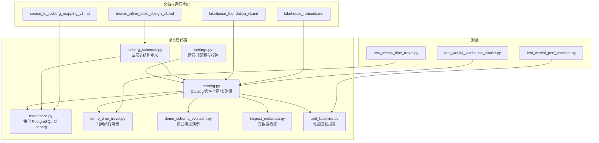
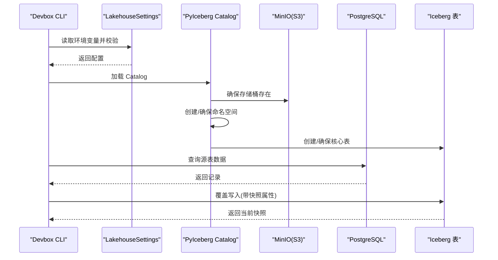
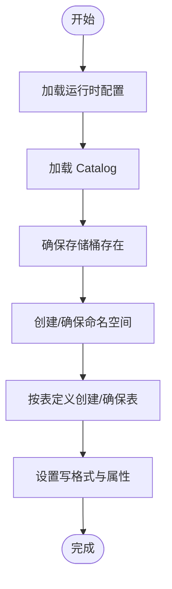
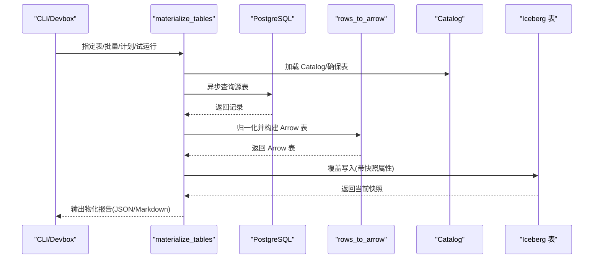
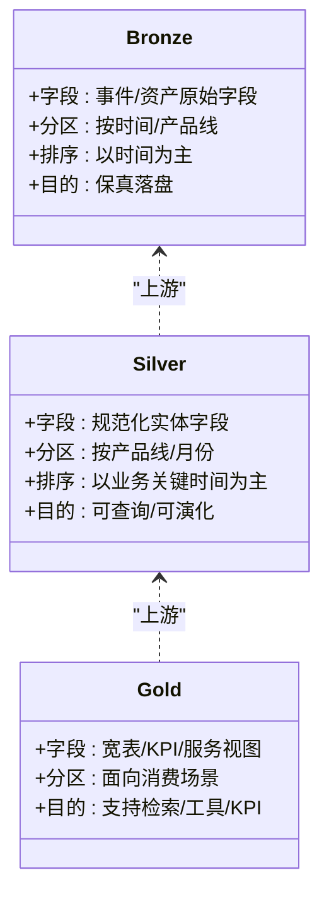
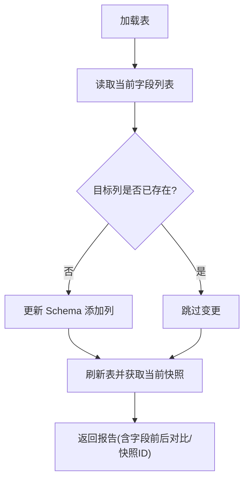
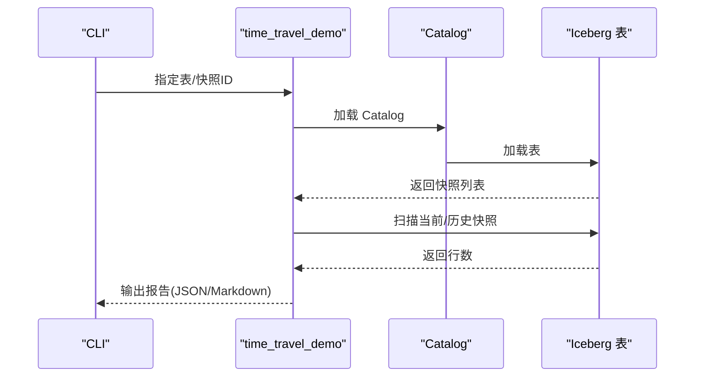
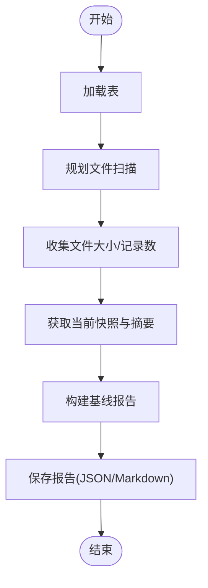
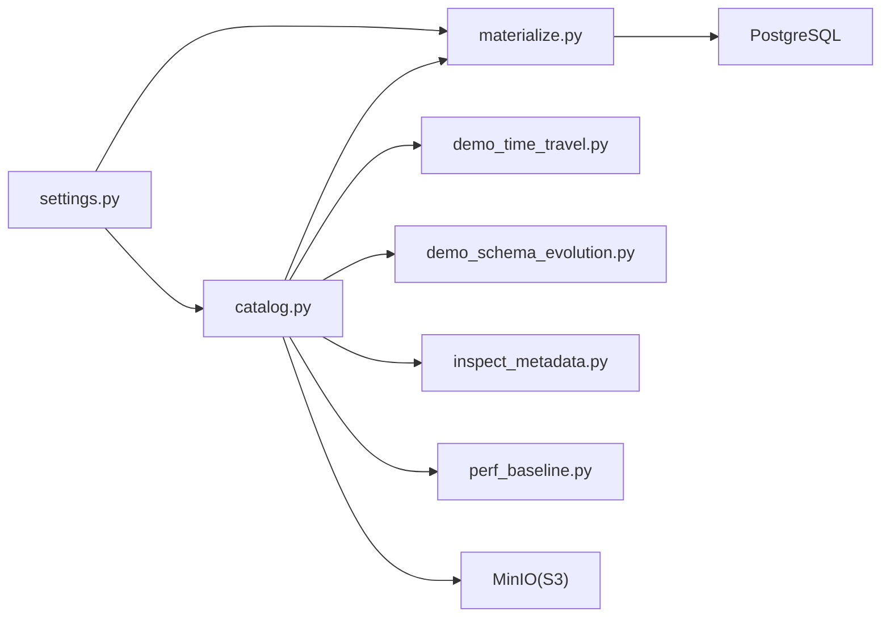

# 湖仓层（Apache Iceberg）

<cite>
**本文引用的文件**
- [README.md](file://pipelines/lakehouse/README.md)
- [catalog.py](file://pipelines/lakehouse/catalog.py)
- [materialize.py](file://pipelines/lakehouse/materialize.py)
- [settings.py](file://pipelines/lakehouse/settings.py)
- [iceberg_schemas.py](file://pipelines/lakehouse/iceberg_schemas.py)
- [demo_schema_evolution.py](file://pipelines/lakehouse/demo_schema_evolution.py)
- [demo_time_travel.py](file://pipelines/lakehouse/demo_time_travel.py)
- [inspect_metadata.py](file://pipelines/lakehouse/inspect_metadata.py)
- [perf_baseline.py](file://pipelines/lakehouse/perf_baseline.py)
- [lakehouse_foundation_v1.md](file://docs/blueprints/week04/lakehouse_foundation_v1.md)
- [source_to_iceberg_mapping_v1.md](file://docs/blueprints/week04/source_to_iceberg_mapping_v1.md)
- [bronze_silver_table_design_v1.md](file://docs/blueprints/week04/bronze_silver_table_design_v1.md)
- [lakehouse_runbook.md](file://runbooks/lakehouse_runbook.md)
- [test_week4_lakehouse_smoke.py](file://tests/integration/test_week4_lakehouse_smoke.py)
- [test_week4_time_travel.py](file://tests/integration/test_week4_time_travel.py)
- [test_week4_perf_baseline.py](file://tests/integration/test_week4_perf_baseline.py)
</cite>

## 目录
1. [简介](#简介)
2. [项目结构](#项目结构)
3. [核心组件](#核心组件)
4. [架构总览](#架构总览)
5. [详细组件分析](#详细组件分析)
6. [依赖分析](#依赖分析)
7. [性能考虑](#性能考虑)
8. [故障排查指南](#故障排查指南)
9. [结论](#结论)
10. [附录](#附录)

## 简介
本文件面向 OmniSupport Copilot 的湖仓层（Apache Iceberg），系统性阐述其在 Week04 的落地方式与运行机制，重点覆盖：
- Catalog 管理与环境配置
- Bronze/Silver/Gold 分层存储设计理念与边界
- 快照与时间旅行功能的演示与使用
- 核心价值：大规模数据存储、数据治理、版本控制与回滚
- 分层数据模型设计原则、模式演进策略、分区管理方案
- Catalog 配置示例、表物化流程、性能优化技巧与数据治理最佳实践

## 项目结构
围绕湖仓层的关键代码位于 pipelines/lakehouse 目录，配套文档位于 docs/blueprints/week04 与 runbooks，测试位于 tests/integration。

图表来源
- [settings.py:1-149](file://pipelines/lakehouse/settings.py#L1-L149)
- [catalog.py:1-197](file://pipelines/lakehouse/catalog.py#L1-L197)
- [materialize.py:1-231](file://pipelines/lakehouse/materialize.py#L1-L231)
- [iceberg_schemas.py:1-296](file://pipelines/lakehouse/iceberg_schemas.py#L1-L296)
- [demo_time_travel.py:1-91](file://pipelines/lakehouse/demo_time_travel.py#L1-L91)
- [demo_schema_evolution.py:1-90](file://pipelines/lakehouse/demo_schema_evolution.py#L1-L90)
- [inspect_metadata.py:1-109](file://pipelines/lakehouse/inspect_metadata.py#L1-L109)
- [perf_baseline.py:1-126](file://pipelines/lakehouse/perf_baseline.py#L1-L126)
- [lakehouse_foundation_v1.md:1-58](file://docs/blueprints/week04/lakehouse_foundation_v1.md#L1-L58)
- [source_to_iceberg_mapping_v1.md:1-61](file://docs/blueprints/week04/source_to_iceberg_mapping_v1.md#L1-L61)
- [bronze_silver_table_design_v1.md:1-29](file://docs/blueprints/week04/bronze_silver_table_design_v1.md#L1-L29)
- [lakehouse_runbook.md:1-82](file://runbooks/lakehouse_runbook.md#L1-L82)

章节来源
- [README.md:1-27](file://pipelines/lakehouse/README.md#L1-L27)
- [lakehouse_foundation_v1.md:1-58](file://docs/blueprints/week04/lakehouse_foundation_v1.md#L1-L58)
- [lakehouse_runbook.md:1-82](file://runbooks/lakehouse_runbook.md#L1-L82)

## 核心组件
- 运行时配置与校验：集中管理 Catalog 类型、URI、仓库位置、S3 端点、数据库连接等，并提供安全脱敏输出与参数校验。
- Catalog 管理：加载 Catalog、确保 MinIO 存储桶可用、创建命名空间、按表定义创建或确保核心表存在。
- 物化流程：从 PostgreSQL 拉取数据，转换为 Arrow，按写入模式覆盖写入 Iceberg，附带快照属性。
- 模式与分区：三层表结构定义，明确字段、分区与排序策略；仅允许加列的模式演进。
- 时间旅行与元数据：扫描指定快照统计行数、列出快照/历史/文件/元数据日志。
- 性能基线：统计行数、快照数、文件数、平均/最小/最大文件大小及最近操作类型。

章节来源
- [settings.py:20-149](file://pipelines/lakehouse/settings.py#L20-L149)
- [catalog.py:29-197](file://pipelines/lakehouse/catalog.py#L29-L197)
- [materialize.py:17-231](file://pipelines/lakehouse/materialize.py#L17-L231)
- [iceberg_schemas.py:14-296](file://pipelines/lakehouse/iceberg_schemas.py#L14-L296)
- [demo_time_travel.py:13-91](file://pipelines/lakehouse/demo_time_travel.py#L13-L91)
- [inspect_metadata.py:13-109](file://pipelines/lakehouse/inspect_metadata.py#L13-L109)
- [perf_baseline.py:13-126](file://pipelines/lakehouse/perf_baseline.py#L13-L126)

## 架构总览
下图展示 Week04 湖仓层在本地开发环境中的端到端路径：通过 devbox CLI 加载 Catalog、确保命名空间与表、物化数据、并进行时间旅行与模式演进演示。

图表来源
- [settings.py:40-104](file://pipelines/lakehouse/settings.py#L40-L104)
- [catalog.py:29-169](file://pipelines/lakehouse/catalog.py#L29-L169)
- [materialize.py:102-184](file://pipelines/lakehouse/materialize.py#L102-L184)

章节来源
- [lakehouse_foundation_v1.md:37-58](file://docs/blueprints/week04/lakehouse_foundation_v1.md#L37-L58)
- [lakehouse_runbook.md:59-82](file://runbooks/lakehouse_runbook.md#L59-L82)

## 详细组件分析

### 组件一：Catalog 管理与配置
- Catalog 加载：根据名称与属性字典加载，属性来源于运行时配置。
- 存储桶与命名空间：确保 MinIO 存储桶存在，创建 Bronze/Silver 命名空间。
- 核心表确保：按表定义生成 Arrow Schema，设置写格式与自定义属性，创建或确保表存在。
- 写入模式：Bronze 层区分去重全量与确定性全量，Silver 层采用确定性全量以避免盲追加。

图表来源
- [catalog.py:29-169](file://pipelines/lakehouse/catalog.py#L29-L169)
- [settings.py:77-104](file://pipelines/lakehouse/settings.py#L77-L104)

章节来源
- [catalog.py:29-169](file://pipelines/lakehouse/catalog.py#L29-L169)
- [settings.py:20-104](file://pipelines/lakehouse/settings.py#L20-L104)

### 组件二：表物化流程（从 PostgreSQL 到 Iceberg）
- 数据拉取：异步连接 PostgreSQL，按表查询返回记录。
- 数据归一化：将时间字段标准化为 UTC，字典序列化为 JSON 字符串，保持字段对齐。
- 写入 Iceberg：加载目标表，构造 Arrow 表，覆盖写入并附带快照属性（包含批次、写入模式等）。
- 报告生成：输出物化报告，包含源行数、写入模式、动作类型、快照 ID 等。

图表来源
- [materialize.py:102-184](file://pipelines/lakehouse/materialize.py#L102-L184)
- [catalog.py:112-140](file://pipelines/lakehouse/catalog.py#L112-L140)

章节来源
- [materialize.py:17-231](file://pipelines/lakehouse/materialize.py#L17-L231)
- [source_to_iceberg_mapping_v1.md:9-61](file://docs/blueprints/week04/source_to_iceberg_mapping_v1.md#L9-L61)

### 组件三：分层数据模型与分区策略
- Bronze 层：保真落盘，保留 source_fingerprint，按天/月分区，排序以时间为主，避免过早业务解释。
- Silver 层：统一 Schema，可追溯可演化，按产品线/月份分区，排序以创建时间等关键维度为主。
- Gold 层：面向检索、查询、工具调用与 KPI 展示，本阶段未物化，留待后续扩展。

图表来源
- [iceberg_schemas.py:14-296](file://pipelines/lakehouse/iceberg_schemas.py#L14-L296)
- [bronze_silver_table_design_v1.md:1-29](file://docs/blueprints/week04/bronze_silver_table_design_v1.md#L1-L29)

章节来源
- [iceberg_schemas.py:14-296](file://pipelines/lakehouse/iceberg_schemas.py#L14-L296)
- [bronze_silver_table_design_v1.md:1-29](file://docs/blueprints/week04/bronze_silver_table_design_v1.md#L1-L29)

### 组件四：模式演进（Schema Evolution）
- 仅允许加列：通过更新 Schema 添加新列，保持向后兼容。
- 快照记录：每次模式变更都会产生新的快照，便于审计与回溯。

图表来源
- [demo_schema_evolution.py:17-44](file://pipelines/lakehouse/demo_schema_evolution.py#L17-L44)

章节来源
- [demo_schema_evolution.py:1-90](file://pipelines/lakehouse/demo_schema_evolution.py#L1-L90)

### 组件五：时间旅行与快照
- 快照扫描：支持扫描当前快照与指定历史快照，统计行数并比对。
- 元数据视图：支持查看快照列表、写入历史、数据文件清单、元数据日志。

图表来源
- [demo_time_travel.py:13-39](file://pipelines/lakehouse/demo_time_travel.py#L13-L39)
- [inspect_metadata.py:13-70](file://pipelines/lakehouse/inspect_metadata.py#L13-L70)

章节来源
- [demo_time_travel.py:1-91](file://pipelines/lakehouse/demo_time_travel.py#L1-L91)
- [inspect_metadata.py:1-109](file://pipelines/lakehouse/inspect_metadata.py#L1-L109)

### 组件六：性能基线与健康检查
- 健康指标：统计行数、快照数、文件数、平均/最小/最大文件大小、最近操作类型。
- 报告输出：支持 Markdown 与 JSON，便于对比前后状态。

图表来源
- [perf_baseline.py:13-73](file://pipelines/lakehouse/perf_baseline.py#L13-L73)

章节来源
- [perf_baseline.py:1-126](file://pipelines/lakehouse/perf_baseline.py#L1-L126)

## 依赖分析
- 组件耦合与内聚
  - settings.py 为 Catalog 与物化流程提供统一配置，耦合度高但职责单一。
  - catalog.py 依赖 settings.py 并封装 Catalog/命名空间/表的创建逻辑，内聚良好。
  - materialize.py 依赖 catalog.py 与 settings.py，负责数据拉取与写入，职责清晰。
  - demo_* 与 inspect_metadata 依赖 catalog.py，独立于写入流程，便于教学演示。
  - perf_baseline 依赖 catalog.py，用于运行态健康度评估。
- 外部依赖
  - PyIceberg 与 PyArrow：表结构、扫描、写入、快照与元数据处理。
  - PostgreSQL：源数据与 Catalog 元数据存储。
  - MinIO：Parquet 文件与元数据存储。

图表来源
- [settings.py:1-149](file://pipelines/lakehouse/settings.py#L1-L149)
- [catalog.py:1-197](file://pipelines/lakehouse/catalog.py#L1-L197)
- [materialize.py:1-231](file://pipelines/lakehouse/materialize.py#L1-L231)
- [demo_time_travel.py:1-91](file://pipelines/lakehouse/demo_time_travel.py#L1-L91)
- [demo_schema_evolution.py:1-90](file://pipelines/lakehouse/demo_schema_evolution.py#L1-L90)
- [inspect_metadata.py:1-109](file://pipelines/lakehouse/inspect_metadata.py#L1-L109)
- [perf_baseline.py:1-126](file://pipelines/lakehouse/perf_baseline.py#L1-L126)

章节来源
- [settings.py:1-149](file://pipelines/lakehouse/settings.py#L1-L149)
- [catalog.py:1-197](file://pipelines/lakehouse/catalog.py#L1-L197)
- [materialize.py:1-231](file://pipelines/lakehouse/materialize.py#L1-L231)

## 性能考虑
- 写入策略
  - 确定性全量写入：避免盲追加导致的重复与不一致，适合当前状态表。
  - 去重全量写入：Bronze 层对事件流进行去重，减少冗余数据。
- 分区与排序
  - 按时间/产品线分区，有利于过滤与裁剪，降低扫描成本。
  - 排序键与分区键协同，提升查询性能与写入稳定性。
- 文件大小与数量
  - 基线报告统计平均/最小/最大文件大小，指导后续压缩与合并策略。
- 并发与异步
  - 源数据查询采用异步连接，降低等待时间，提高吞吐。

## 故障排查指南
- Catalog/环境校验失败
  - 检查 Catalog 类型与 URI 是否指向 PostgreSQL，仓库是否为 S3 URI，S3 端点与凭据是否正确。
  - 使用配置检查命令输出安全配置，定位问题。
- 存储桶不存在
  - 确认 MinIO 可用且具备创建桶权限；若已存在则忽略错误。
- 表未创建或模式不匹配
  - 确认命名空间已创建；检查表 Schema 与分区/排序定义是否与源数据一致。
- 物化为空
  - 若源表为空，将不会产生快照；确认源数据是否正常。
- 时间旅行/元数据异常
  - 确认至少有一次成功物化；检查快照列表与历史记录；核对文件清单与元数据日志。

章节来源
- [settings.py:90-144](file://pipelines/lakehouse/settings.py#L90-L144)
- [catalog.py:36-75](file://pipelines/lakehouse/catalog.py#L36-L75)
- [materialize.py:153-156](file://pipelines/lakehouse/materialize.py#L153-L156)
- [demo_time_travel.py:26-39](file://pipelines/lakehouse/demo_time_travel.py#L26-L39)
- [inspect_metadata.py:13-70](file://pipelines/lakehouse/inspect_metadata.py#L13-L70)

## 结论
Week04 湖仓层以 PyIceberg + PostgreSQL SQL Catalog + MinIO 为核心技术栈，在本地可复现环境中实现了从 PostgreSQL 到 Iceberg 的稳定物化与可观测性闭环。通过 Bronze/Silver 分层设计、确定性写入策略、快照与时间旅行能力，以及严格的模式演进约束，项目在不引入复杂生态的前提下，提供了可追溯、可回滚、可治理的数据基础，为后续 Week05-08 的语义层与检索增强应用打下坚实根基。

## 附录
- 运行入口与演示
  - Catalog 自检与核心表确保
  - 物化四张核心表并生成报告
  - 快照与时间旅行演示
  - 模式演进演示
  - 元数据检查
  - 性能基线报告

章节来源
- [README.md:1-27](file://pipelines/lakehouse/README.md#L1-L27)
- [lakehouse_runbook.md:59-82](file://runbooks/lakehouse_runbook.md#L59-L82)
- [test_week4_lakehouse_smoke.py:6-19](file://tests/integration/test_week4_lakehouse_smoke.py#L6-L19)
- [test_week4_time_travel.py:4-16](file://tests/integration/test_week4_time_travel.py#L4-L16)
- [test_week4_perf_baseline.py:4-16](file://tests/integration/test_week4_perf_baseline.py#L4-L16)