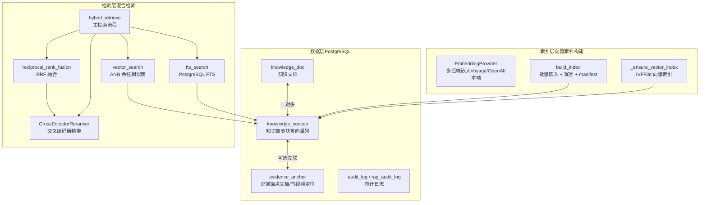
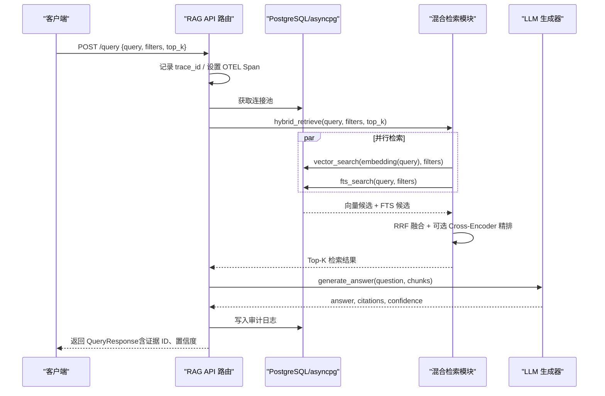
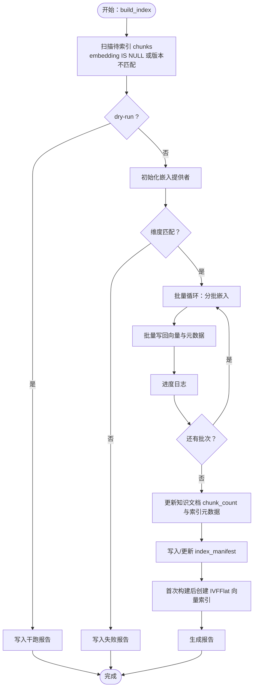
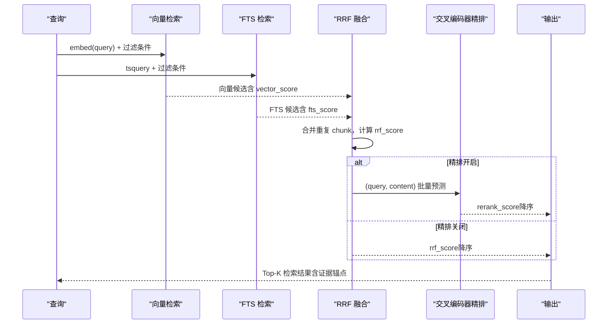
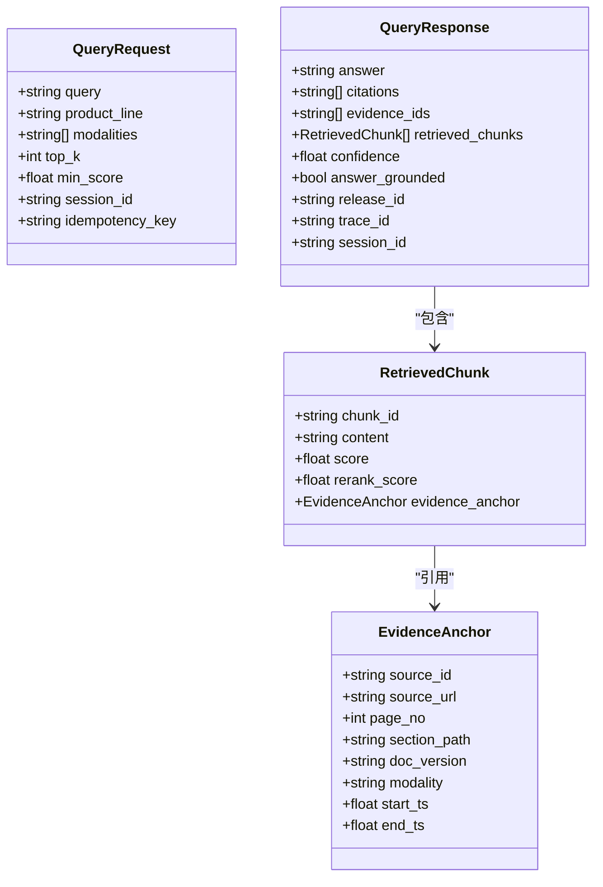
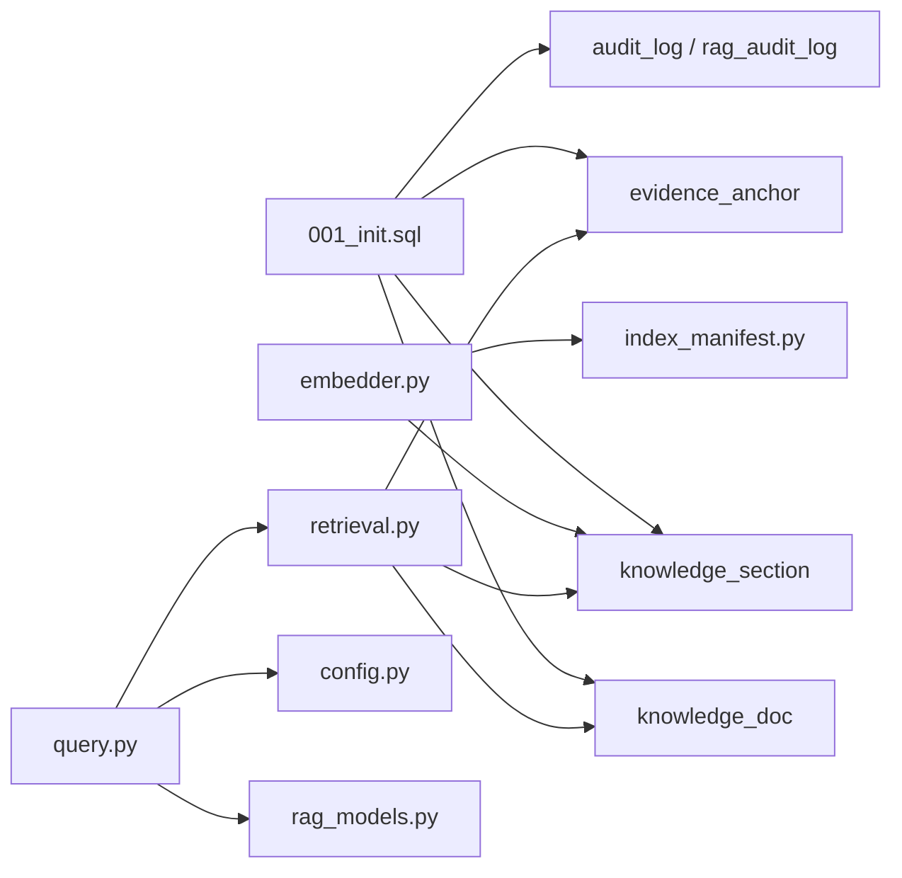

# 结构化+向量检索层（PostgreSQL+pgvector）

<cite>
**本文档引用的文件**
- [001_init.sql](file://infra/migrations/001_init.sql)
- [003_week08_index_rag.sql](file://infra/migrations/003_week08_index_rag.sql)
- [embedder.py](file://pipelines/indexing/embedder.py)
- [assets.py](file://pipelines/indexing/assets.py)
- [index_manifest.py](file://pipelines/indexing/index_manifest.py)
- [retrieval.py](file://services/rag_api/app/retrieval.py)
- [query.py](file://services/rag_api/app/routers/query.py)
- [rag_models.py](file://services/rag_api/app/models/rag_models.py)
- [config.py](file://services/rag_api/app/config.py)
- [test_week8_hybrid_retrieval.py](file://tests/integration/test_week8_hybrid_retrieval.py)
- [retrieval_smoke_report.md](file://reports/week08/retrieval_smoke_report.md)
- [index_build_report.sample.md](file://reports/week08/index_build_report.sample.md)
</cite>

## 目录
1. [简介](#简介)
2. [项目结构](#项目结构)
3. [核心组件](#核心组件)
4. [架构总览](#架构总览)
5. [详细组件分析](#详细组件分析)
6. [依赖分析](#依赖分析)
7. [性能考虑](#性能考虑)
8. [故障排除指南](#故障排除指南)
9. [结论](#结论)
10. [附录](#附录)

## 简介
本文件系统化阐述 OmniSupport Copilot 的“结构化+向量检索层”，聚焦 PostgreSQL 与 pgvector 的集成方案，涵盖：
- 向量索引的创建与管理（IVFFlat + 余弦距离）
- 混合检索策略（pgvector ANN + PostgreSQL FTS + RRF 融合 + 可选 Cross-Encoder 精排）
- 全文搜索与向量相似度搜索的协同
- 结构化查询能力（基于产品线、可见性范围、授权等级等元数据过滤）
- 多模态内容的联合检索（文档/音视频锚点）
- 查询优化策略、索引设计原则、与 RAG 服务的交互模式
- 查询示例、性能调优建议与故障排除

## 项目结构
检索层由三层组成：
- 数据层：PostgreSQL 表结构与扩展（知识文档、章节块、证据锚点、审计日志等）
- 索引层：向量嵌入生成、批量写回、IVFFlat 向量索引创建
- 检索层：混合检索链路（向量 + FTS → RRF → 可选精排 → 过滤输出）

图表来源
- [001_init.sql:137-210](file://infra/migrations/001_init.sql#L137-L210)
- [embedder.py:160-351](file://pipelines/indexing/embedder.py#L160-L351)
- [retrieval.py:132-443](file://services/rag_api/app/retrieval.py#L132-L443)

章节来源
- [001_init.sql:1-288](file://infra/migrations/001_init.sql#L1-L288)
- [003_week08_index_rag.sql:1-78](file://infra/migrations/003_week08_index_rag.sql#L1-L78)

## 核心组件
- 数据模型与索引
  - 知识文档表：包含产品线、可见性范围、授权等级、状态、质量状态等结构化字段，用于检索过滤
  - 知识章节表：包含文本内容、页面信息、向量列、索引版本等，承载向量检索与 FTS
  - 证据锚点表：将检索块映射到具体来源（文档/音视频），支持多模态定位
  - 审计日志：记录检索与生成过程，便于回溯与评估
- 向量索引构建
  - 多后端嵌入提供者：优先使用外部服务（Voyage/OpenAI），失败时回退本地模型
  - 批量嵌入与写回：按批处理，写回向量、模型信息、索引版本、数据版本
  - IVFFlat 向量索引：首次构建完成后自动创建，lists 参数与数据规模自适应
- 混合检索链路
  - 向量检索：余弦距离 ANN 检索，支持元数据过滤
  - FTS 检索：PostgreSQL tsvector/tsquery，支持词法精确匹配
  - RRF 融合：合并两路结果，去重并保留各自分数
  - 精排（可选）：Cross-Encoder 交叉编码器，提升语义一致性
  - 输出：统一结果结构，包含证据锚点与最终得分

章节来源
- [retrieval.py:1-445](file://services/rag_api/app/retrieval.py#L1-L445)
- [embedder.py:1-429](file://pipelines/indexing/embedder.py#L1-L429)
- [001_init.sql:137-210](file://infra/migrations/001_init.sql#L137-L210)

## 架构总览
下图展示从查询到响应的完整链路，包括检索、生成与审计：

图表来源
- [query.py:39-93](file://services/rag_api/app/routers/query.py#L39-L93)
- [retrieval.py:386-443](file://services/rag_api/app/retrieval.py#L386-L443)

## 详细组件分析

### 组件 A：向量索引构建与管理
- 功能要点
  - 多后端嵌入提供者：自动探测可用后端（Voyage、OpenAI、本地），保证可用性与成本平衡
  - 批量嵌入与写回：按批处理，写回 embedding、embedding_model、embedding_dim、index_release_id、data_release_id、chunk_strategy_version、indexed_at
  - 统计与报告：统计总数、已嵌入、跳过、错误、耗时，并写入 index_manifest
  - 向量索引创建：首次构建完成后自动创建 IVFFlat 索引，lists 参数自适应
- 关键 SQL 与逻辑
  - 向量列定义：vector(1536)，支持余弦距离
  - FTS 索引：GIN(to_tsvector('english', content))
  - 元数据索引：知识文档与章节的过滤字段索引
- 性能与可靠性
  - 批大小可调；维度校验避免不一致
  - 干跑模式用于预检与容量规划
  - 错误与警告记录，质量门禁（pass/warn/fail）

图表来源
- [embedder.py:160-351](file://pipelines/indexing/embedder.py#L160-L351)
- [embedder.py:374-396](file://pipelines/indexing/embedder.py#L374-L396)
- [001_init.sql:165-181](file://infra/migrations/001_init.sql#L165-L181)

章节来源
- [embedder.py:1-429](file://pipelines/indexing/embedder.py#L1-L429)
- [assets.py:1-55](file://pipelines/indexing/assets.py#L1-L55)
- [index_manifest.py:1-81](file://pipelines/indexing/index_manifest.py#L1-L81)

### 组件 B：混合检索链路（向量 + FTS + RRF + 精排）
- 功能要点
  - 向量检索：使用 pgvector 余弦距离，支持产品线、可见性范围、授权等级、状态、质量状态等过滤
  - FTS 检索：PostgreSQL tsvector + tsquery，支持词法精确匹配
  - RRF 融合：对重复 chunk 合并并保留两路分数，提升召回与多样性
  - 精排（可选）：Cross-Encoder 交叉编码器，提升相关性
  - 输出：统一结果结构，包含证据锚点、最终得分（RRF 或精排）
- 关键 SQL 与逻辑
  - 向量相似度：embedding 与查询向量的余弦距离
  - FTS 排序：ts_rank_cd
  - 元数据过滤：动态拼接 WHERE 条件，支持多维过滤
  - RRF 计算：Σ 1/(k + rank)，k 默认 60
  - 精排：sentence-transformers cross-encoder，不可用时降级

图表来源
- [retrieval.py:132-443](file://services/rag_api/app/retrieval.py#L132-L443)

章节来源
- [retrieval.py:1-445](file://services/rag_api/app/retrieval.py#L1-L445)
- [test_week8_hybrid_retrieval.py:1-44](file://tests/integration/test_week8_hybrid_retrieval.py#L1-L44)

### 组件 C：RAG API 查询端点与审计
- 功能要点
  - FastAPI 端点：/query，接收 QueryRequest，返回 QueryResponse
  - 检索链路：并行向量 + FTS → RRF → 精排 → 生成 → 审计
  - 审计日志：非阻塞写入，记录检索命中情况与置信度
  - OTEL 追踪：Span 标签记录查询长度、产品线、trace_id、release_id
- 关键模型
  - QueryRequest：query、product_line、modalities、top_k、min_score、session_id、幂等键
  - QueryResponse：answer、citations、evidence_ids、retrieved_chunks、confidence、answer_grounded、release_id、trace_id、session_id

图表来源
- [rag_models.py:39-167](file://services/rag_api/app/models/rag_models.py#L39-L167)

章节来源
- [query.py:1-159](file://services/rag_api/app/routers/query.py#L1-L159)
- [rag_models.py:1-168](file://services/rag_api/app/models/rag_models.py#L1-L168)
- [config.py:1-53](file://services/rag_api/app/config.py#L1-L53)

## 依赖分析
- 数据层依赖
  - 扩展：uuid-ossp、vector、pg_trgm
  - 表：knowledge_doc、knowledge_section、evidence_anchor、audit_log、release_manifest
  - 索引：FTS GIN、文档/章节过滤索引、审计日志索引
- 索引层依赖
  - asyncpg 连接池
  - EmbeddingProvider（多后端）
  - index_manifest（质量门禁与报告）
- 检索层依赖
  - asyncpg 连接池
  - OpenTelemetry 追踪
  - sentence-transformers（可选：Cross-Encoder）

图表来源
- [001_init.sql:1-288](file://infra/migrations/001_init.sql#L1-L288)
- [embedder.py:160-351](file://pipelines/indexing/embedder.py#L160-L351)
- [retrieval.py:132-443](file://services/rag_api/app/retrieval.py#L132-L443)
- [query.py:29-34](file://services/rag_api/app/routers/query.py#L29-L34)

章节来源
- [001_init.sql:1-288](file://infra/migrations/001_init.sql#L1-L288)
- [003_week08_index_rag.sql:1-78](file://infra/migrations/003_week08_index_rag.sql#L1-L78)

## 性能考虑
- 向量索引设计
  - 使用 IVFFlat + vector_cosine_ops，余弦距离
  - lists 参数：≈ sqrt(已嵌入向量数量)，避免过大或过小
  - 仅在首次构建完成后创建索引，减少写放大
- 批处理与并发
  - 嵌入批大小可调，建议根据 GPU/服务资源与延迟目标权衡
  - 检索阶段并行执行向量与 FTS，缩短尾延迟
- 过滤与排序
  - 元数据过滤在 WHERE 中动态拼接，尽量利用已有索引
  - RRF 融合参数 k（默认 60）影响融合强度，可按业务调参
- 精排开销
  - Cross-Encoder 精排可显著提升相关性但增加延迟，建议按需开启
- 数据与版本控制
  - index_release_id 与 data_release_id 双版本控制，支持灰度与回滚
  - 质量门禁（pass/warn/fail）保障索引构建质量

## 故障排除指南
- 向量索引未创建
  - 现象：向量检索慢或报错
  - 排查：确认首次构建已完成且已执行 _ensure_vector_index
  - 参考：[embedder.py:374-396](file://pipelines/indexing/embedder.py#L374-L396)
- 维度不匹配
  - 现象：索引构建失败或写回异常
  - 排查：检查 embedding_dim 与向量列定义是否一致
  - 参考：[embedder.py:227-236](file://pipelines/indexing/embedder.py#L227-L236)
- 嵌入提供者不可用
  - 现象：向量检索为空或报错
  - 排查：检查 VOYAGE_API_KEY 或 OPENAI_API_KEY 是否配置；回退本地模型
  - 参考：[embedder.py:44-139](file://pipelines/indexing/embedder.py#L44-L139)
- FTS 检索失败
  - 现象：FTS 检索返回空
  - 排查：确认内容列存在、tsvector 索引存在
  - 参考：[retrieval.py:279-281](file://services/rag_api/app/retrieval.py#L279-L281)
- 精排不可用
  - 现象：返回 RRF 排序而非精排
  - 排查：sentence-transformers 可用性；日志中会提示降级
  - 参考：[retrieval.py:353-362](file://services/rag_api/app/retrieval.py#L353-L362)
- 审计日志写入失败
  - 现象：非致命错误，不影响主链路
  - 排查：检查数据库连接与权限
  - 参考：[query.py:136-158](file://services/rag_api/app/routers/query.py#L136-L158)

章节来源
- [embedder.py:227-236](file://pipelines/indexing/embedder.py#L227-L236)
- [embedder.py:374-396](file://pipelines/indexing/embedder.py#L374-L396)
- [retrieval.py:279-281](file://services/rag_api/app/retrieval.py#L279-L281)
- [query.py:136-158](file://services/rag_api/app/routers/query.py#L136-L158)

## 结论
本检索层以 PostgreSQL + pgvector 为核心，结合结构化元数据过滤与全文检索，形成高召回、高多样性的混合检索体系。通过 IVFFlat 向量索引与 RRF 融合，在保证性能的同时兼顾语义与词法的互补优势；通过可选的 Cross-Encoder 精排进一步提升相关性。配合完善的审计与版本控制机制，满足生产级的可运维性与可回滚能力。

## 附录

### 查询示例（路径指引）
- 向量检索（仅）
  - 路径：[retrieval.py:132-214](file://services/rag_api/app/retrieval.py#L132-L214)
- FTS 检索（仅）
  - 路径：[retrieval.py:219-302](file://services/rag_api/app/retrieval.py#L219-L302)
- 混合检索（RRF）
  - 路径：[retrieval.py:307-337](file://services/rag_api/app/retrieval.py#L307-L337)
- 混合检索（RRF + 精排）
  - 路径：[retrieval.py:340-378](file://services/rag_api/app/retrieval.py#L340-L378)
- 主检索流程
  - 路径：[retrieval.py:386-443](file://services/rag_api/app/retrieval.py#L386-L443)
- API 查询端点
  - 路径：[query.py:39-93](file://services/rag_api/app/routers/query.py#L39-L93)

### 索引与迁移
- 初始化与扩展
  - 路径：[001_init.sql:1-288](file://infra/migrations/001_init.sql#L1-L288)
- Week08 新增表与索引
  - 路径：[003_week08_index_rag.sql:1-78](file://infra/migrations/003_week08_index_rag.sql#L1-L78)

### 报告与测试
- 混合检索冒烟报告
  - 路径：[retrieval_smoke_report.md:1-22](file://reports/week08/retrieval_smoke_report.md#L1-L22)
- 索引构建报告样例
  - 路径：[index_build_report.sample.md:1-23](file://reports/week08/index_build_report.sample.md#L1-L23)
- RRF 单元测试
  - 路径：[test_week8_hybrid_retrieval.py:1-44](file://tests/integration/test_week8_hybrid_retrieval.py#L1-L44)