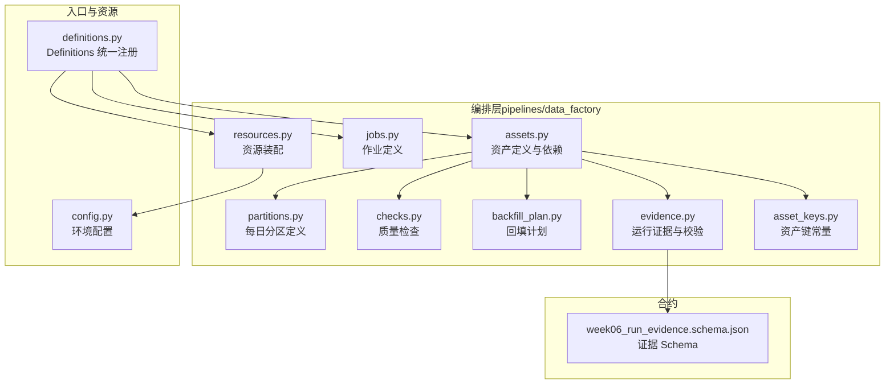
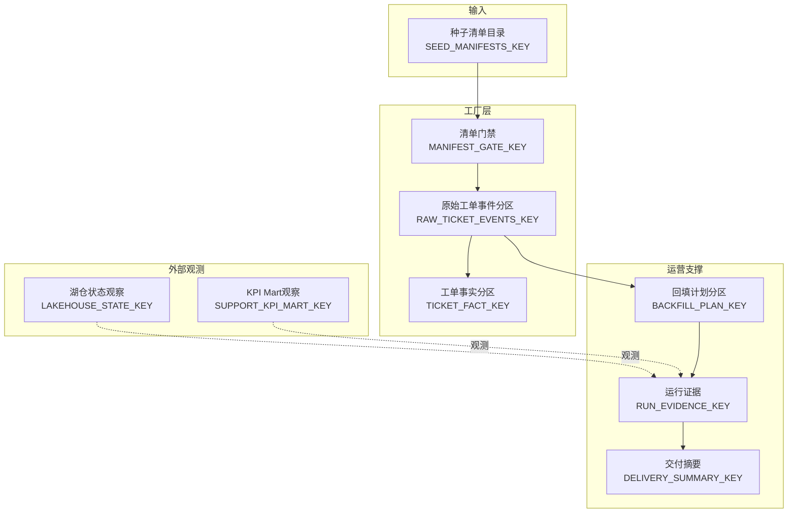
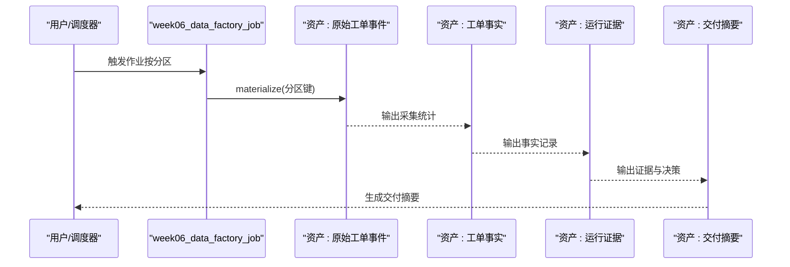
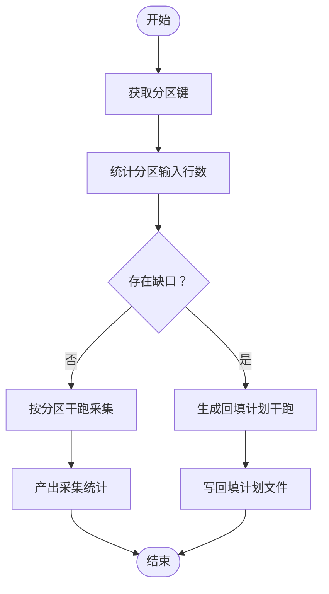
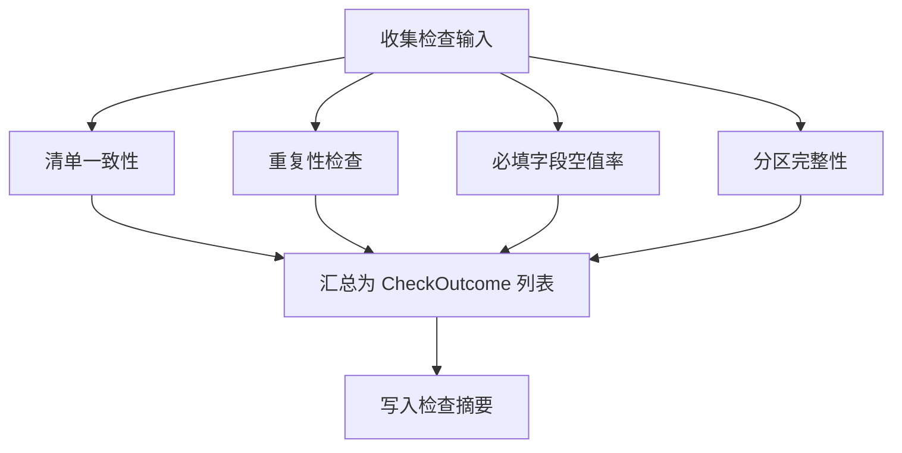
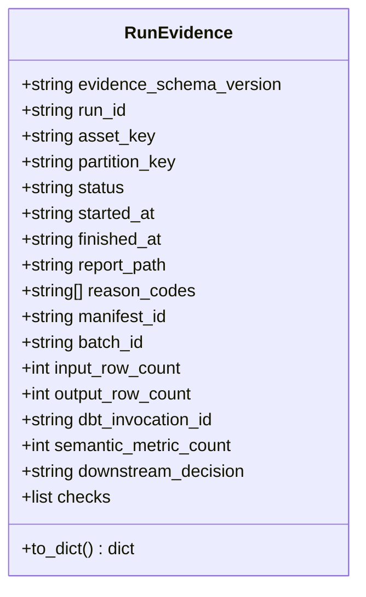
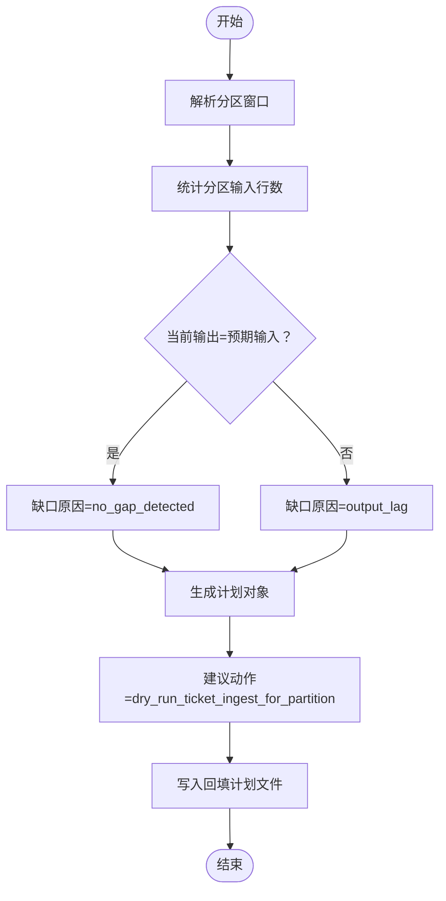
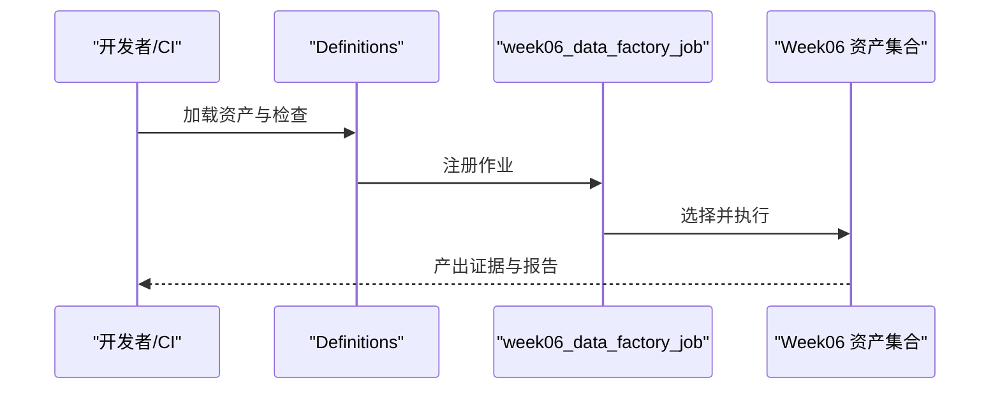
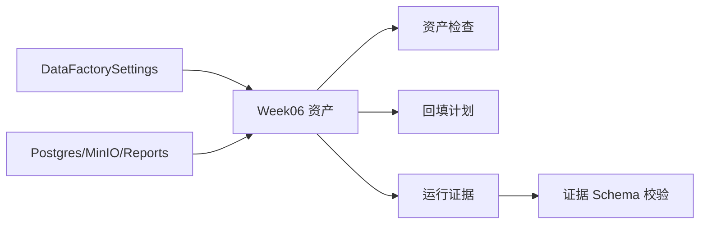

# 编排层（Dagster）

<cite>
**本文引用的文件**
- [pipelines/definitions.py](file://pipelines/definitions.py)
- [pipelines/data_factory/assets.py](file://pipelines/data_factory/assets.py)
- [pipelines/data_factory/jobs.py](file://pipelines/data_factory/jobs.py)
- [pipelines/data_factory/partitions.py](file://pipelines/data_factory/partitions.py)
- [pipelines/data_factory/checks.py](file://pipelines/data_factory/checks.py)
- [pipelines/data_factory/evidence.py](file://pipelines/data_factory/evidence.py)
- [pipelines/data_factory/backfill_plan.py](file://pipelines/data_factory/backfill_plan.py)
- [pipelines/data_factory/asset_keys.py](file://pipelines/data_factory/asset_keys.py)
- [pipelines/data_factory/resources.py](file://pipelines/data_factory/resources.py)
- [pipelines/resources/config.py](file://pipelines/resources/config.py)
- [contracts/run_evidence/week06_run_evidence.schema.json](file://contracts/run_evidence/week06_run_evidence.schema.json)
- [tests/integration/test_week06_asset_graph_smoke.py](file://tests/integration/test_week06_asset_graph_smoke.py)
- [tests/integration/test_week06_run_evidence_generation.py](file://tests/integration/test_week06_run_evidence_generation.py)
- [tests/integration/test_week06_backfill_plan.py](file://tests/integration/test_week06_backfill_plan.py)
</cite>

## 目录
1. [引言](#引言)
2. [项目结构](#项目结构)
3. [核心组件](#核心组件)
4. [架构总览](#架构总览)
5. [组件详解](#组件详解)
6. [依赖关系分析](#依赖关系分析)
7. [性能考量](#性能考量)
8. [故障排查指南](#故障排查指南)
9. [结论](#结论)
10. [附录](#附录)

## 引言
本文件面向 OmniSupport Copilot 的编排层（Dagster），聚焦 Week06 数据工厂资产化编排的设计与实现。内容涵盖资产定义、依赖关系管理、分区策略、回填计划、自动化调度、资产血缘追踪、质量控制检查、运行证据生成等关键能力，并解释增量处理机制与对数据工厂的集成方式。文档同时提供资产定义示例路径、作业配置模板、监控与告警建议、以及故障恢复策略，帮助读者快速理解并落地使用。

## 项目结构
编排层位于 pipelines/data_factory 目录，围绕“资产化”理念构建，通过一组具有明确分区键的 Dagster 资产串联起从清单发现、准入门禁、分区化采集、银层交付、外部状态观测、回填计划到运行证据与交付摘要的完整流水线。核心模块如下：
- 资产定义与依赖：pipelines/data_factory/assets.py
- 分区定义：pipelines/data_factory/partitions.py
- 质量检查：pipelines/data_factory/checks.py
- 回填计划：pipelines/data_factory/backfill_plan.py
- 运行证据与校验：pipelines/data_factory/evidence.py
- 作业与入口：pipelines/data_factory/jobs.py、pipelines/definitions.py
- 资源装配：pipelines/data_factory/resources.py
- 环境配置：pipelines/resources/config.py
- 合约校验：contracts/run_evidence/week06_run_evidence.schema.json

图表来源
- [pipelines/definitions.py:1-38](file://pipelines/definitions.py#L1-L38)
- [pipelines/data_factory/assets.py:1-535](file://pipelines/data_factory/assets.py#L1-L535)
- [pipelines/data_factory/partitions.py:1-18](file://pipelines/data_factory/partitions.py#L1-L18)
- [pipelines/data_factory/checks.py:1-186](file://pipelines/data_factory/checks.py#L1-L186)
- [pipelines/data_factory/backfill_plan.py:1-147](file://pipelines/data_factory/backfill_plan.py#L1-L147)
- [pipelines/data_factory/evidence.py:1-107](file://pipelines/data_factory/evidence.py#L1-L107)
- [pipelines/data_factory/jobs.py:1-12](file://pipelines/data_factory/jobs.py#L1-L12)
- [pipelines/data_factory/resources.py:1-29](file://pipelines/data_factory/resources.py#L1-L29)
- [pipelines/resources/config.py:1-136](file://pipelines/resources/config.py#L1-L136)
- [contracts/run_evidence/week06_run_evidence.schema.json:1-137](file://contracts/run_evidence/week06_run_evidence.schema.json#L1-L137)

章节来源
- [pipelines/definitions.py:1-38](file://pipelines/definitions.py#L1-L38)
- [pipelines/data_factory/assets.py:1-535](file://pipelines/data_factory/assets.py#L1-L535)

## 核心组件
- 资产图与分组：以 WEEK06_GROUP 对资产进行分组，便于在 UI 和 CLI 中按周/层级筛选；资产键集中于 asset_keys.py，确保跨模块一致引用。
- 分区策略：基于 DailyPartitionsDefinition，起始日期由环境配置决定，支持默认分区键推断与上下文分区键注入。
- 质量检查：内置多项纯函数检查（清单一致性、重复性、必填字段空值率、分区完整性等），既可作为资产检查直接在 UI 可视化，也可在运行证据中汇总。
- 回填计划：按日分区计算预期输入行数与当前输出差距，生成干跑回填计划，指导下游操作。
- 运行证据：统一的证据模型与 JSON Schema 校验，产出结构化报告与 Markdown 摘要，并根据状态与原因码推导下游决策。
- 作业与入口：通过 Definitions 统一注册资产、资产检查、作业与资源，week06_data_factory_job 选择 Week06 资产集合执行。

章节来源
- [pipelines/data_factory/assets.py:47-48](file://pipelines/data_factory/assets.py#L47-L48)
- [pipelines/data_factory/partitions.py:10-17](file://pipelines/data_factory/partitions.py#L10-L17)
- [pipelines/data_factory/checks.py:19-32](file://pipelines/data_factory/checks.py#L19-L32)
- [pipelines/data_factory/backfill_plan.py:17-35](file://pipelines/data_factory/backfill_plan.py#L17-L35)
- [pipelines/data_factory/evidence.py:18-47](file://pipelines/data_factory/evidence.py#L18-L47)
- [pipelines/data_factory/jobs.py:7-11](file://pipelines/data_factory/jobs.py#L7-L11)
- [pipelines/definitions.py:20-37](file://pipelines/definitions.py#L20-L37)

## 架构总览
下图展示 Week06 数据工厂资产化编排的整体流程：从种子清单发现，经准入门禁筛选结构化清单，到分区化采集、银层事实表生成，再到外部状态观测（湖仓快照、KPI 指标）、回填计划与运行证据生成，最终形成交付摘要。

图表来源
- [pipelines/data_factory/assets.py:116-521](file://pipelines/data_factory/assets.py#L116-L521)
- [pipelines/data_factory/asset_keys.py:5-13](file://pipelines/data_factory/asset_keys.py#L5-L13)

## 组件详解

### 资产定义与依赖关系
- 种子清单发现：扫描种子清单目录，过滤非结构化与源清单文件，输出清单列表。
- 清单门禁：从种子清单中挑选结构化清单，校验是否存在资产条目，输出准入结果。
- 原始工单事件（分区）：基于分区键调用现有采集器逻辑，产出采集统计与错误计数。
- 工单事实（分区）：根据采集统计与是否干跑决定状态（成功/失败/跳过），产出银层事实记录。
- 外部观测资产：读取 Week04 材质化报告与 Week05 dbt 运行结果，作为证据的一部分。
- 回填计划（分区）：按日分区计算预期输入与当前输出，生成干跑回填计划。
- 运行证据：聚合各上游资产状态、原因码与检查结果，生成证据 JSON 并写入报告目录。
- 交付摘要：生成人类可读的 Markdown 摘要，包含分区键、状态、下游决策与证据路径。

图表来源
- [pipelines/data_factory/jobs.py:7-11](file://pipelines/data_factory/jobs.py#L7-L11)
- [pipelines/data_factory/assets.py:187-235](file://pipelines/data_factory/assets.py#L187-L235)
- [pipelines/data_factory/assets.py:246-285](file://pipelines/data_factory/assets.py#L246-L285)
- [pipelines/data_factory/assets.py:392-474](file://pipelines/data_factory/assets.py#L392-L474)
- [pipelines/data_factory/assets.py:485-521](file://pipelines/data_factory/assets.py#L485-L521)

章节来源
- [pipelines/data_factory/assets.py:116-521](file://pipelines/data_factory/assets.py#L116-L521)
- [pipelines/data_factory/asset_keys.py:5-13](file://pipelines/data_factory/asset_keys.py#L5-L13)

### 分区策略与增量处理
- 分区定义：采用每日分区，起始日期来自环境配置，支持默认分区键推断。
- 增量处理：通过分区键限定输入范围，仅处理对应日期的数据；采集器在干跑模式下不写库，避免副作用。
- 输入计数：回填计划模块统计分区内的输入行数，用于缺口检测与干跑评估。

图表来源
- [pipelines/data_factory/partitions.py:10-17](file://pipelines/data_factory/partitions.py#L10-L17)
- [pipelines/data_factory/backfill_plan.py:61-112](file://pipelines/data_factory/backfill_plan.py#L61-L112)
- [pipelines/data_factory/assets.py:208-222](file://pipelines/data_factory/assets.py#L208-L222)

章节来源
- [pipelines/data_factory/partitions.py:10-17](file://pipelines/data_factory/partitions.py#L10-L17)
- [pipelines/data_factory/backfill_plan.py:61-112](file://pipelines/data_factory/backfill_plan.py#L61-L112)

### 质量控制检查
- 检查项：清单一致性、重复性（主键去重）、必填字段空值率、分区完整性、输出计数（需材料化上下文）。
- 执行方式：纯函数检查可在测试与运行证据中复用；资产检查通过装饰器在 UI 中可视化。
- 结果汇总：生成 Markdown 汇总文件，便于审阅。

图表来源
- [pipelines/data_factory/checks.py:34-132](file://pipelines/data_factory/checks.py#L34-L132)
- [pipelines/data_factory/checks.py:135-149](file://pipelines/data_factory/checks.py#L135-L149)

章节来源
- [pipelines/data_factory/checks.py:19-186](file://pipelines/data_factory/checks.py#L19-L186)

### 运行证据生成与校验
- 证据模型：包含运行 ID、分区键、状态、时间戳、原因码、下游决策、指标与检查明细等字段。
- 校验机制：依据 JSON Schema 对证据对象进行校验，确保结构与枚举值合规。
- 下游决策：根据状态、原因码与干跑标志推导“继续/人工复核/阻断/仅干跑”。

图表来源
- [pipelines/data_factory/evidence.py:18-47](file://pipelines/data_factory/evidence.py#L18-L47)
- [contracts/run_evidence/week06_run_evidence.schema.json:18-134](file://contracts/run_evidence/week06_run_evidence.schema.json#L18-L134)

章节来源
- [pipelines/data_factory/evidence.py:18-107](file://pipelines/data_factory/evidence.py#L18-L107)
- [contracts/run_evidence/week06_run_evidence.schema.json:1-137](file://contracts/run_evidence/week06_run_evidence.schema.json#L1-L137)

### 回填计划与缺口检测
- 计划字段：包含分区窗口、上游清单 ID、预期输入、当前输出、缺口原因、建议动作、幂等守卫、下游影响等。
- 生成流程：解析分区键，统计输入行数，比对当前输出，确定缺口原因与建议动作，写入报告文件。

图表来源
- [pipelines/data_factory/backfill_plan.py:82-112](file://pipelines/data_factory/backfill_plan.py#L82-L112)
- [pipelines/data_factory/backfill_plan.py:115-119](file://pipelines/data_factory/backfill_plan.py#L115-L119)

章节来源
- [pipelines/data_factory/backfill_plan.py:17-147](file://pipelines/data_factory/backfill_plan.py#L17-L147)

### 作业与入口
- 作业定义：week06_data_factory_job 选择 Week06 资产集合，描述为“带分区与证据输出的数据工厂资产图”。
- 入口注册：Definitions 统一加载资产、资产检查、作业与资源，供 dagit/dagit本地开发与 dagster instance 使用。

图表来源
- [pipelines/definitions.py:20-37](file://pipelines/definitions.py#L20-L37)
- [pipelines/data_factory/jobs.py:7-11](file://pipelines/data_factory/jobs.py#L7-L11)

章节来源
- [pipelines/definitions.py:1-38](file://pipelines/definitions.py#L1-L38)
- [pipelines/data_factory/jobs.py:1-12](file://pipelines/data_factory/jobs.py#L1-L12)

## 依赖关系分析
- 资产间依赖：通过 AssetIn 显式声明上游依赖，形成有向无环图（DAG）。例如“原始工单事件”依赖“清单门禁”，“工单事实”依赖“原始工单事件”，“运行证据”汇聚多个资产与检查结果。
- 外部依赖：湖仓快照与 KPI Mart 报告为只读观测，标记为可选，不影响主流程推进。
- 资源依赖：PostgreSQL、MinIO、报告路径等资源通过资源装配注入，供采集与报告写入使用。
- 配置依赖：DataFactorySettings 提供项目根、分区起始、默认分区、干跑开关、路径等，贯穿资产与工具函数。

图表来源
- [pipelines/resources/config.py:44-113](file://pipelines/resources/config.py#L44-L113)
- [pipelines/data_factory/resources.py:13-28](file://pipelines/data_factory/resources.py#L13-L28)
- [pipelines/data_factory/assets.py:116-521](file://pipelines/data_factory/assets.py#L116-L521)
- [pipelines/data_factory/checks.py:124-132](file://pipelines/data_factory/checks.py#L124-L132)
- [pipelines/data_factory/backfill_plan.py:89-112](file://pipelines/data_factory/backfill_plan.py#L89-L112)
- [pipelines/data_factory/evidence.py:53-75](file://pipelines/data_factory/evidence.py#L53-L75)

章节来源
- [pipelines/resources/config.py:1-136](file://pipelines/resources/config.py#L1-L136)
- [pipelines/data_factory/resources.py:1-29](file://pipelines/data_factory/resources.py#L1-L29)

## 性能考量
- 分区粒度：按日分区可显著降低每次运行的数据扫描范围，提升增量处理效率。
- 干跑优先：默认干跑模式避免数据库写入，先验证流程与检查，再按需切换为生产模式。
- I/O 优化：回填计划与检查均基于文件系统读取与写入，建议将报告目录挂载至高性能存储。
- 并发与线程：异步采集通过线程桥接，避免阻塞 Dagster 主循环；建议在资源充足时适当并发执行多分区任务。

## 故障排查指南
- 资产检查失败
  - 现象：资产检查显示 failed 或 warning。
  - 排查：查看检查摘要 Markdown，定位具体检查名称与原因码；确认清单一致性、重复性、必填字段与分区完整性。
  - 参考路径：[pipelines/data_factory/checks.py:135-149](file://pipelines/data_factory/checks.py#L135-L149)
- 证据校验失败
  - 现象：运行证据写入时报错，提示字段缺失或类型不符。
  - 排查：对照证据 Schema 校验字段与枚举值；确认必需字段与格式要求。
  - 参考路径：[contracts/run_evidence/week06_run_evidence.schema.json:18-134](file://contracts/run_evidence/week06_run_evidence.schema.json#L18-L134)
- 回填计划异常
  - 现象：回填计划为空或预期输入为 0。
  - 排查：确认分区键正确、种子文件存在且包含目标日期记录；检查上游清单是否包含结构化资产。
  - 参考路径：[pipelines/data_factory/backfill_plan.py:82-112](file://pipelines/data_factory/backfill_plan.py#L82-L112)
- 干跑与生产切换
  - 现象：干跑模式下输出行数为 0。
  - 排查：确认干跑开关与限制参数；如需生产写入，请调整配置后重新执行。
  - 参考路径：[pipelines/resources/config.py:95-96](file://pipelines/resources/config.py#L95-L96)

章节来源
- [pipelines/data_factory/checks.py:135-149](file://pipelines/data_factory/checks.py#L135-L149)
- [contracts/run_evidence/week06_run_evidence.schema.json:18-134](file://contracts/run_evidence/week06_run_evidence.schema.json#L18-L134)
- [pipelines/data_factory/backfill_plan.py:82-112](file://pipelines/data_factory/backfill_plan.py#L82-L112)
- [pipelines/resources/config.py:95-96](file://pipelines/resources/config.py#L95-L96)

## 结论
Week06 数据工厂编排以资产化为核心，结合分区策略、质量检查、回填计划与运行证据，实现了可审计、可观测、可回溯的数据交付流水线。通过干跑优先与外部观测，系统在保障安全的同时提供了清晰的下游决策依据。建议在生产环境中配合监控与告警，持续优化分区粒度与资源配额，确保稳定高效的数据交付。

## 附录

### 资产定义示例（路径）
- 种子清单发现：[pipelines/data_factory/assets.py:123](file://pipelines/data_factory/assets.py#L123)
- 清单门禁：[pipelines/data_factory/assets.py:147-176](file://pipelines/data_factory/assets.py#L147-L176)
- 原始工单事件（分区）：[pipelines/data_factory/assets.py:187-235](file://pipelines/data_factory/assets.py#L187-L235)
- 工单事实（分区）：[pipelines/data_factory/assets.py:246-285](file://pipelines/data_factory/assets.py#L246-L285)
- 湖仓状态（观测）：[pipelines/data_factory/assets.py:295-317](file://pipelines/data_factory/assets.py#L295-L317)
- KPI Mart（观测）：[pipelines/data_factory/assets.py:327-351](file://pipelines/data_factory/assets.py#L327-L351)
- 回填计划（分区）：[pipelines/data_factory/assets.py:361-376](file://pipelines/data_factory/assets.py#L361-L376)
- 运行证据：[pipelines/data_factory/assets.py:392-474](file://pipelines/data_factory/assets.py#L392-L474)
- 交付摘要：[pipelines/data_factory/assets.py:485-521](file://pipelines/data_factory/assets.py#L485-L521)

### 作业配置模板（路径）
- 作业定义：[pipelines/data_factory/jobs.py:7-11](file://pipelines/data_factory/jobs.py#L7-L11)
- 入口注册：[pipelines/definitions.py:20-37](file://pipelines/definitions.py#L20-L37)

### 监控与告警设置（建议）
- 资产检查：在 Dagster UI 中关注检查状态变化，失败时触发通知。
- 运行证据：对证据状态与下游决策进行告警阈值配置（如 failed、hold_downstream）。
- 回填计划：对缺口原因（output_lag）进行周期性提醒，确保及时补录。

### 故障恢复策略
- 干跑先行：默认保持干跑，验证流程与检查后再切换生产。
- 分区级回滚：针对失败分区单独重试，避免影响其他分区。
- 外部依赖降级：当湖仓或 KPI 报告不可用时，标记为 not_available 并继续生成证据，后续补录。

### 测试参考（路径）
- 资产图冒烟测试：[tests/integration/test_week06_asset_graph_smoke.py:10-25](file://tests/integration/test_week06_asset_graph_smoke.py#L10-L25)
- 运行证据生成与校验：[tests/integration/test_week06_run_evidence_generation.py:9-46](file://tests/integration/test_week06_run_evidence_generation.py#L9-L46)
- 回填计划测试：[tests/integration/test_week06_backfill_plan.py:9-24](file://tests/integration/test_week06_backfill_plan.py#L9-L24)