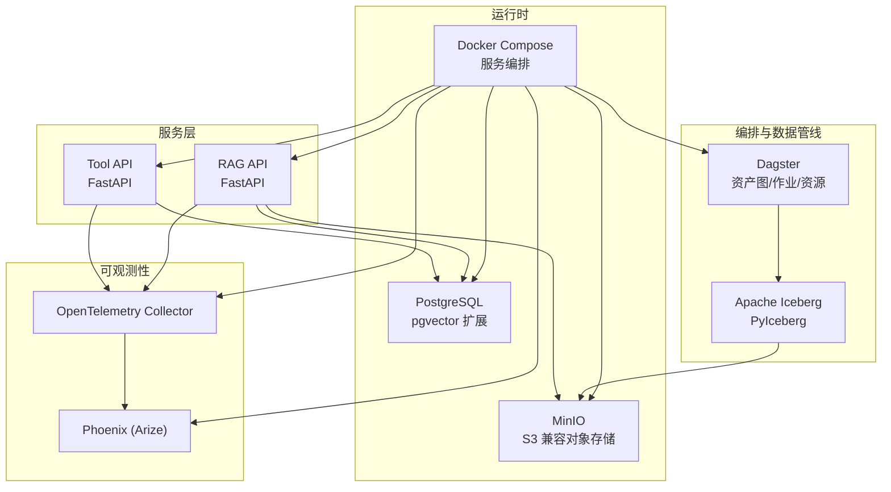
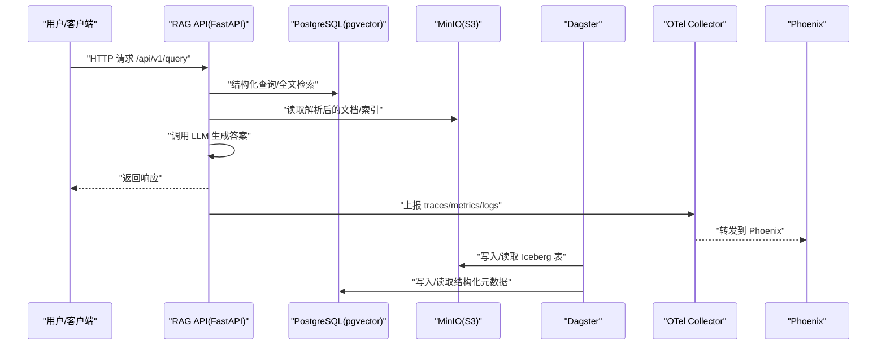
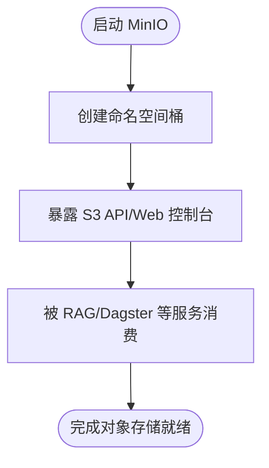
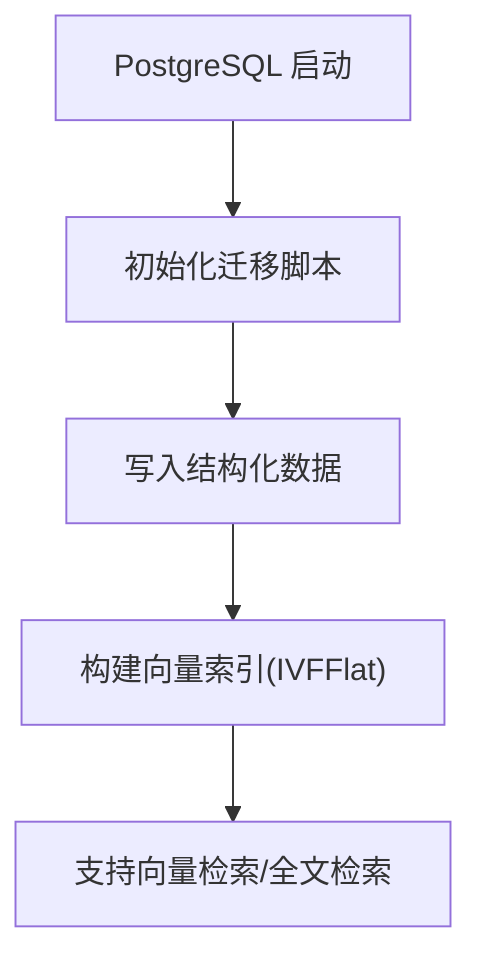
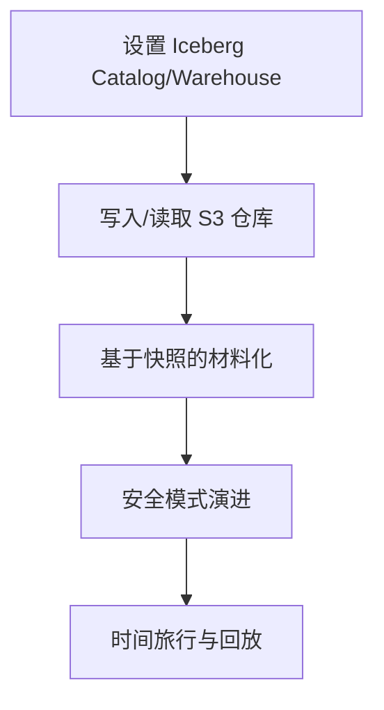
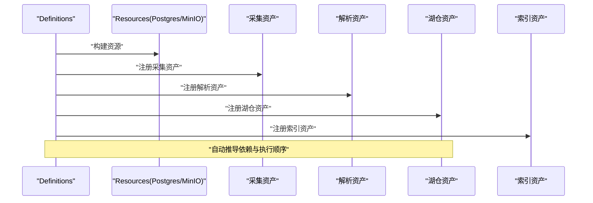
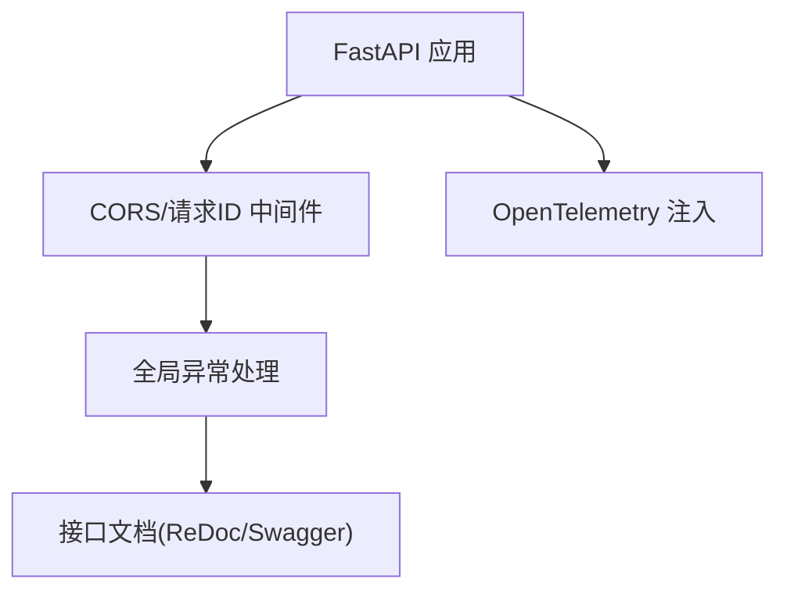
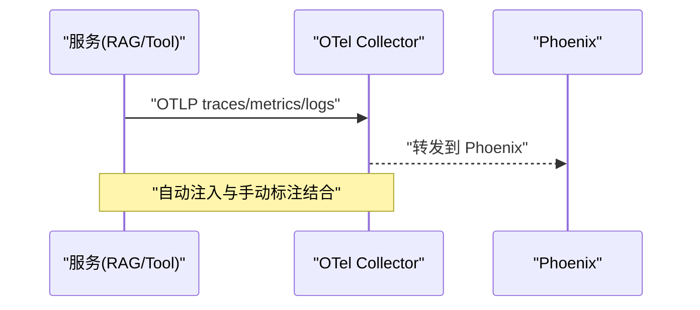
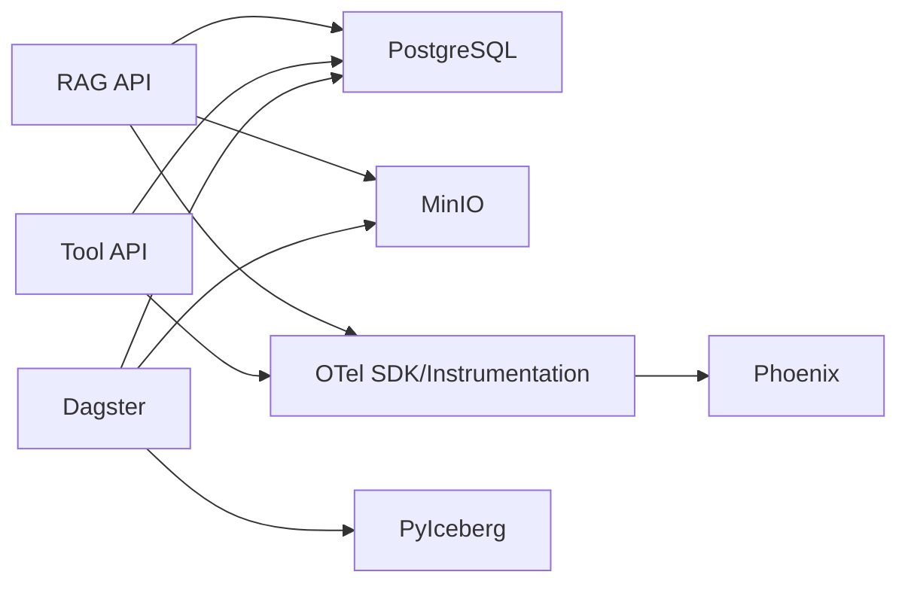

# 技术栈与选型理由

<cite>
**本文引用的文件**
- [pyproject.toml](file://pyproject.toml)
- [docker-compose.yml](file://infra/docker-compose.yml)
- [settings.py](file://pipelines/lakehouse/settings.py)
- [embedder.py](file://pipelines/indexing/embedder.py)
- [assets.py](file://pipelines/ingestion/assets.py)
- [definitions.py](file://pipelines/definitions.py)
- [requirements.txt（RAG API）](file://services/rag_api/requirements.txt)
- [requirements.txt（Tool API）](file://services/tool_api/requirements.txt)
- [Dockerfile（RAG API）](file://services/rag_api/Dockerfile)
- [Dockerfile（Tool API）](file://services/tool_api/Dockerfile)
- [main.py（RAG API）](file://services/rag_api/app/main.py)
- [main.py（Tool API）](file://services/tool_api/app/main.py)
- [config.yaml（OTel Collector）](file://observability/otel/config.yaml)
- [minio.py](file://pipelines/resources/minio.py)
- [postgres.py](file://pipelines/resources/postgres.py)
- [README（Lakehouse）](file://pipelines/lakehouse/README.md)
</cite>

## 目录
1. [简介](#简介)
2. [项目结构](#项目结构)
3. [核心组件](#核心组件)
4. [架构总览](#架构总览)
5. [组件详解与选型理由](#组件详解与选型理由)
6. [依赖关系分析](#依赖关系分析)
7. [性能考量](#性能考量)
8. [故障排查指南](#故障排查指南)
9. [结论](#结论)
10. [附录](#附录)

## 简介
本文件系统化阐述 OmniSupport Copilot 的技术栈与选型理由，围绕以下目标展开：
- 对象存储层：为何选择 MinIO（本地可跑、S3 兼容、迁移成本低）
- 结构化+向量检索层：为何选择 PostgreSQL + pgvector（单机可跑、支持向量检索与全文搜索）
- 湖仓层：为何选择 Apache Iceberg（快照、时间旅行、模式演进）
- 编排层：为何选择 Dagster（资产化编排、依赖管理）
- 服务层：为何选择 FastAPI（契约清晰、调试成本低）
- 可观测性：为何选择 OpenTelemetry + Phoenix（统一追踪、AI 可观测）

同时给出选型原则与权衡考虑，帮助读者在相似场景下做出稳健决策。

## 项目结构
本项目采用“分层 + 资产化编排”的组织方式：
- 对象存储层：MinIO（S3 兼容）
- 结构化与向量检索层：PostgreSQL（含 pgvector 扩展）
- 湖仓层：Apache Iceberg（通过 PyIceberg 与 MinIO+S3 协议交互）
- 编排层：Dagster（资产图、作业、资源）
- 服务层：FastAPI（RAG API、Tool API）
- 可观测性：OpenTelemetry Collector + Phoenix（Arize）

图表来源
- [docker-compose.yml:1-340](file://infra/docker-compose.yml#L1-L340)
- [settings.py:1-149](file://pipelines/lakehouse/settings.py#L1-L149)
- [embedder.py:1-429](file://pipelines/indexing/embedder.py#L1-L429)
- [requirements.txt（RAG API）:1-29](file://services/rag_api/requirements.txt#L1-L29)
- [requirements.txt（Tool API）:1-14](file://services/tool_api/requirements.txt#L1-L14)
- [config.yaml（OTel Collector）:1-66](file://observability/otel/config.yaml#L1-L66)

章节来源
- [docker-compose.yml:1-340](file://infra/docker-compose.yml#L1-L340)

## 核心组件
- 对象存储层：MinIO（S3 兼容），用于原始资产、中间制品与湖仓仓库存储
- 结构化+向量检索层：PostgreSQL + pgvector，承载结构化数据与向量索引
- 湖仓层：Apache Iceberg（PyIceberg），实现快照、时间旅行与模式演进
- 编排层：Dagster，统一资产图、依赖与执行
- 服务层：FastAPI，提供清晰的 API 契约与可观测集成
- 可观测性：OpenTelemetry Collector + Phoenix（Arize），统一追踪与 AI 可观测

章节来源
- [docker-compose.yml:1-340](file://infra/docker-compose.yml#L1-L340)
- [settings.py:1-149](file://pipelines/lakehouse/settings.py#L1-L149)
- [embedder.py:1-429](file://pipelines/indexing/embedder.py#L1-L429)
- [requirements.txt（RAG API）:1-29](file://services/rag_api/requirements.txt#L1-L29)
- [requirements.txt（Tool API）:1-14](file://services/tool_api/requirements.txt#L1-L14)
- [config.yaml（OTel Collector）:1-66](file://observability/otel/config.yaml#L1-L66)

## 架构总览
下图展示从采集到检索生成的关键流程与组件交互：

图表来源
- [docker-compose.yml:89-122](file://infra/docker-compose.yml#L89-L122)
- [docker-compose.yml:155-226](file://infra/docker-compose.yml#L155-L226)
- [config.yaml（OTel Collector）:1-66](file://observability/otel/config.yaml#L1-L66)
- [main.py（RAG API）:1-73](file://services/rag_api/app/main.py#L1-L73)
- [settings.py:1-149](file://pipelines/lakehouse/settings.py#L1-L149)

## 组件详解与选型理由

### 对象存储层：MinIO（本地可跑、S3 兼容、迁移成本低）
- 为什么选 MinIO
  - 本地可跑：通过 docker-compose 快速启动，便于本地开发与演示
  - S3 兼容：与 Iceberg、RAG API 的对象存储读写一致，降低迁移成本
  - 多桶分区：初始化脚本自动创建 raw、parsed、indexes、lakehouse 等命名空间
- 关键证据
  - MinIO 服务与健康检查、端口映射、初始化容器
  - RAG API、Dagster 环境变量中以 S3 方式访问 MinIO
  - Lakehouse 设置中以 s3:// 指向 MinIO 作为仓库
- 选型原则与权衡
  - 原则：本地可复现、S3 协议兼容、最小运维成本
  - 权衡：生产环境可替换为 AWS S3/GCS，但 MinIO 已满足教学与小型团队需求

图表来源
- [docker-compose.yml:39-86](file://infra/docker-compose.yml#L39-L86)
- [docker-compose.yml:91-122](file://infra/docker-compose.yml#L91-L122)
- [docker-compose.yml:155-226](file://infra/docker-compose.yml#L155-L226)
- [settings.py:24-37](file://pipelines/lakehouse/settings.py#L24-L37)

章节来源
- [docker-compose.yml:39-86](file://infra/docker-compose.yml#L39-L86)
- [docker-compose.yml:91-122](file://infra/docker-compose.yml#L91-L122)
- [docker-compose.yml:155-226](file://infra/docker-compose.yml#L155-L226)
- [settings.py:24-37](file://pipelines/lakehouse/settings.py#L24-L37)

### 结构化+向量检索层：PostgreSQL + pgvector（单机可跑、支持向量检索与全文搜索）
- 为什么选 PostgreSQL + pgvector
  - 单机可跑：Compose 一键启动，适合本地与教学环境
  - 向量检索：pgvector 支持向量列与索引（如 IVFFlat），满足 RAG 向量召回
  - 全文搜索：PostgreSQL 原生全文检索能力，与结构化查询结合
- 关键证据
  - PostgreSQL 服务镜像、初始化脚本、健康检查
  - RAG API 依赖包含 asyncpg、SQLAlchemy 异步 ORM、pgvector
  - 向量索引构建逻辑（首次构建后创建 IVFFlat 索引）
- 选型原则与权衡
  - 原则：单机可跑、向量与结构化一体化
  - 权衡：生产环境可升级为托管数据库或分片集群，但 pgvector 已覆盖核心需求

图表来源
- [docker-compose.yml:17-37](file://infra/docker-compose.yml#L17-L37)
- [requirements.txt（RAG API）:6-9](file://services/rag_api/requirements.txt#L6-L9)
- [embedder.py:374-396](file://pipelines/indexing/embedder.py#L374-L396)

章节来源
- [docker-compose.yml:17-37](file://infra/docker-compose.yml#L17-L37)
- [requirements.txt（RAG API）:6-9](file://services/rag_api/requirements.txt#L6-L9)
- [embedder.py:374-396](file://pipelines/indexing/embedder.py#L374-L396)

### 湖仓层：Apache Iceberg（快照、时间旅行、模式演进）
- 为什么选 Apache Iceberg
  - 快照与时间旅行：通过快照实现可重复的数据执行与回放
  - 模式演进：支持安全的 schema 变更，保障历史数据一致性
  - 与 MinIO+S3 协议：通过 PyIceberg 以 s3:// 访问仓库，与对象存储层无缝衔接
- 关键证据
  - Lakehouse 设置类集中定义 catalog、warehouse、S3 端点等
  - Dagster 通过环境变量传递 Iceberg 相关参数
  - README 明确四张核心表（Bronze/Silver）与材料化流程
- 选型原则与权衡
  - 原则：数据治理与可重复执行
  - 权衡：学习曲线与运维复杂度略高于传统数据仓库，但收益显著

图表来源
- [settings.py:1-149](file://pipelines/lakehouse/settings.py#L1-L149)
- [docker-compose.yml:155-226](file://infra/docker-compose.yml#L155-L226)
- [README（Lakehouse）:1-27](file://pipelines/lakehouse/README.md#L1-L27)

章节来源
- [settings.py:1-149](file://pipelines/lakehouse/settings.py#L1-L149)
- [docker-compose.yml:155-226](file://infra/docker-compose.yml#L155-L226)
- [README（Lakehouse）:1-27](file://pipelines/lakehouse/README.md#L1-L27)

### 编排层：Dagster（资产化编排、依赖管理）
- 为什么选 Dagster
  - 资产化编排：以资产为中心定义数据依赖与执行顺序
  - 依赖管理：自动推导上游/下游依赖，降低手工编排复杂度
  - 与项目契合：与 Lakehouse、解析/规范化、索引构建等模块天然衔接
- 关键证据
  - 资产定义文件（采集、解析、湖仓、索引）
  - 资源封装（Postgres、MinIO）
  - 定义入口统一注册所有资产与作业
- 选型原则与权衡
  - 原则：可观察、可回放、可扩展
  - 权衡：Dev 环境使用上游镜像，生产可迁移到 K8s/托管平台

图表来源
- [definitions.py:1-38](file://pipelines/definitions.py#L1-L38)
- [assets.py:1-164](file://pipelines/ingestion/assets.py#L1-L164)
- [postgres.py:1-16](file://pipelines/resources/postgres.py#L1-L16)
- [minio.py:1-14](file://pipelines/resources/minio.py#L1-L14)

章节来源
- [definitions.py:1-38](file://pipelines/definitions.py#L1-L38)
- [assets.py:1-164](file://pipelines/ingestion/assets.py#L1-L164)
- [postgres.py:1-16](file://pipelines/resources/postgres.py#L1-L16)
- [minio.py:1-14](file://pipelines/resources/minio.py#L1-L14)

### 服务层：FastAPI（契约清晰、调试成本低）
- 为什么选 FastAPI
  - 契约清晰：Pydantic 模型驱动的请求/响应校验，自动生成接口文档
  - 调试友好：内置 ReDoc/Swagger，支持中间件与全局异常处理
  - 可观测集成：OpenTelemetry Instrumentation 生态完善
- 关键证据
  - RAG API/Tool API 均使用 FastAPI，统一中间件与异常处理
  - 依赖中包含 OpenTelemetry 相关包，便于自动注入
  - Dockerfile 统一使用 uvicorn 启动
- 选型原则与权衡
  - 原则：开发效率与可维护性
  - 权衡：生产可引入 Gunicorn/Uvicorn Worker，但 FastAPI 已满足当前规模

图表来源
- [main.py（RAG API）:1-73](file://services/rag_api/app/main.py#L1-L73)
- [main.py（Tool API）:1-64](file://services/tool_api/app/main.py#L1-L64)
- [requirements.txt（RAG API）:18-23](file://services/rag_api/requirements.txt#L18-L23)
- [requirements.txt（Tool API）:7-11](file://services/tool_api/requirements.txt#L7-L11)
- [Dockerfile（RAG API）:1-20](file://services/rag_api/Dockerfile#L1-L20)
- [Dockerfile（Tool API）:1-16](file://services/tool_api/Dockerfile#L1-L16)

章节来源
- [main.py（RAG API）:1-73](file://services/rag_api/app/main.py#L1-L73)
- [main.py（Tool API）:1-64](file://services/tool_api/app/main.py#L1-L64)
- [requirements.txt（RAG API）:18-23](file://services/rag_api/requirements.txt#L18-L23)
- [requirements.txt（Tool API）:7-11](file://services/tool_api/requirements.txt#L7-L11)
- [Dockerfile（RAG API）:1-20](file://services/rag_api/Dockerfile#L1-L20)
- [Dockerfile（Tool API）:1-16](file://services/tool_api/Dockerfile#L1-L16)

### 可观测性：OpenTelemetry + Phoenix（统一追踪、AI 可观测）
- 为什么选 OpenTelemetry + Phoenix
  - 统一追踪：Collector 接收 gRPC/HTTP OTLP，集中处理与导出
  - AI 可观测：Phoenix 支持 LLM/AI 请求可视化、错误回放与指标分析
  - 集成简单：服务侧通过 SDK 与 Instrumentation 自动采集
- 关键证据
  - Collector 配置接收 OTLP 并导出到 Phoenix
  - 服务侧依赖 OpenTelemetry SDK 与 FastAPI/SQLAlchemy/Anthropic Instrumentation
  - Compose 服务链路明确 otel_collector → phoenix
- 选型原则与权衡
  - 原则：统一采集、易诊断、可扩展
  - 权衡：生产可接入云端 APM，但本地已具备完整闭环

图表来源
- [config.yaml（OTel Collector）:1-66](file://observability/otel/config.yaml#L1-L66)
- [requirements.txt（RAG API）:18-23](file://services/rag_api/requirements.txt#L18-L23)
- [docker-compose.yml:228-262](file://infra/docker-compose.yml#L228-L262)

章节来源
- [config.yaml（OTel Collector）:1-66](file://observability/otel/config.yaml#L1-L66)
- [requirements.txt（RAG API）:18-23](file://services/rag_api/requirements.txt#L18-L23)
- [docker-compose.yml:228-262](file://infra/docker-compose.yml#L228-L262)

## 依赖关系分析
- 组件耦合
  - RAG API 依赖 PostgreSQL（结构化/向量）、MinIO（对象存储）、OTel（可观测）
  - Dagster 依赖 PostgreSQL（Catalog）、MinIO（Warehouse）、Iceberg（PyIceberg）
  - Tool API 依赖 PostgreSQL、OTel
- 外部依赖
  - OpenTelemetry 生态（Collector、Exporters、Instrumentation）
  - PyIceberg（Iceberg Catalog/IO/S3）
  - FastAPI 生态（Uvicorn、Pydantic、SQLAlchemy）

图表来源
- [docker-compose.yml:1-340](file://infra/docker-compose.yml#L1-L340)
- [requirements.txt（RAG API）:1-29](file://services/rag_api/requirements.txt#L1-L29)
- [requirements.txt（Tool API）:1-14](file://services/tool_api/requirements.txt#L1-L14)
- [settings.py:1-149](file://pipelines/lakehouse/settings.py#L1-L149)
- [config.yaml（OTel Collector）:1-66](file://observability/otel/config.yaml#L1-L66)

章节来源
- [docker-compose.yml:1-340](file://infra/docker-compose.yml#L1-L340)
- [requirements.txt（RAG API）:1-29](file://services/rag_api/requirements.txt#L1-L29)
- [requirements.txt（Tool API）:1-14](file://services/tool_api/requirements.txt#L1-L14)
- [settings.py:1-149](file://pipelines/lakehouse/settings.py#L1-L149)
- [config.yaml（OTel Collector）:1-66](file://observability/otel/config.yaml#L1-L66)

## 性能考量
- 向量检索
  - 使用 pgvector IVFFlat 索引，lists 参数与数据量平方根相关，建议在索引构建后评估召回与延迟
- 对象存储
  - MinIO 作为 S3 兼容后端，注意端点路径风格与 region 配置，避免跨区域访问开销
- 编排与并发
  - Dagster 作业并发度与资源配额需结合硬件能力调整
- 可观测性
  - Collector 批量与内存限制配置有助于稳定运行，避免 OOM

## 故障排查指南
- 服务启动失败
  - 检查健康检查与端口占用（Compose 中各服务 healthcheck 与端口映射）
- 数据不可见或权限问题
  - 确认 MinIO 初始化容器是否成功创建桶；确认 Iceberg Catalog URI 与 S3 凭证
- 向量检索异常
  - 确认 pgvector 扩展安装与索引存在；检查嵌入维度与表结构一致
- 可观测性无数据
  - 检查 OTel Collector 导出器配置与 Phoenix 是否就绪

章节来源
- [docker-compose.yml:32-60](file://infra/docker-compose.yml#L32-L60)
- [docker-compose.yml:228-262](file://infra/docker-compose.yml#L228-L262)
- [settings.py:90-104](file://pipelines/lakehouse/settings.py#L90-L104)
- [embedder.py:374-396](file://pipelines/indexing/embedder.py#L374-L396)

## 结论
本技术栈以“本地可跑、协议兼容、资产化编排、可观测闭环”为核心原则，结合 MinIO、PostgreSQL + pgvector、Apache Iceberg、Dagster、FastAPI、OpenTelemetry + Phoenix，形成一套可演进、可复现、可治理的数据与 AI 应用基础设施。在教学与中小型团队场景下，该组合兼顾易用性与扩展性；在生产迁移时，可在保持 S3/OTLP 协议不变的前提下，平滑替换底层组件。

## 附录
- 选型原则
  - 可复现：本地 Compose 一键启动
  - 协议兼容：S3、OTLP、SQL
  - 资产化：以资产为中心的依赖与执行
  - 可观测：统一追踪与 AI 可观测
- 权衡考虑
  - 成本与复杂度：在满足需求前提下尽量简化
  - 可迁移性：接口与协议尽量标准化，降低迁移成本
  - 团队能力：优先选择团队熟悉且生态完善的方案