# 整体架构概览

<cite>
**本文引用的文件**
- [pyproject.toml](file://pyproject.toml)
- [docker-compose.yml](file://infra/docker-compose.yml)
- [config.yaml](file://observability/otel/config.yaml)
- [rag_api 主程序](file://services/rag_api/app/main.py)
- [tool_api 主程序](file://services/tool_api/app/main.py)
- [RAG API Dockerfile](file://services/rag_api/Dockerfile)
- [Tool API Dockerfile](file://services/tool_api/Dockerfile)
- [Dagster 定义入口](file://pipelines/definitions.py)
- [数据工厂资源配置](file://pipelines/resources/config.py)
- [PostgreSQL 资源元数据](file://pipelines/resources/postgres.py)
- [湖仓设置](file://pipelines/lakehouse/settings.py)
- [索引构建器（pgvector）](file://pipelines/indexing/embedder.py)
- [RAG 请求契约](file://contracts/service/rag_request.schema.json)
- [RAG 响应契约](file://contracts/service/rag_response.schema.json)
- [创建工单工具契约](file://contracts/tools/tools/create_ticket.json)
</cite>

## 目录
1. [简介](#简介)
2. [项目结构](#项目结构)
3. [核心组件](#核心组件)
4. [架构总览](#架构总览)
5. [详细组件分析](#详细组件分析)
6. [依赖关系分析](#依赖关系分析)
7. [性能考量](#性能考量)
8. [故障排查指南](#故障排查指南)
9. [结论](#结论)
10. [附录](#附录)

## 简介
本文件面向 OmniSupport Copilot 的整体架构，围绕“七层架构”进行系统化说明：对象存储层（MinIO）、结构化+向量检索层（PostgreSQL+pgvector）、湖仓层（Apache Iceberg）、编排层（Dagster）、服务层（FastAPI）、可观测性层（OpenTelemetry+Phoenix）与契约层（JSON Schema）。文档重点阐述各层职责、交互关系、数据流向与技术选型理由，并结合仓库中的部署编排与代码实现，给出可操作的架构视图与实践建议。

## 项目结构
项目采用分层与功能域混合的组织方式：
- 顶层通过 pyproject.toml 管理包与开发依赖，明确对 dagster、dbt、pyiceberg、psycopg2、pyarrow 等的依赖范围。
- infra 提供本地开发与演示的 docker-compose 编排，定义服务启动顺序与网络/卷。
- observability 提供 OpenTelemetry Collector 的配置，统一采集 traces/metrics/logs 并转发至 Phoenix。
- services 下的 rag_api 与 tool_api 是对外服务层，基于 FastAPI 构建。
- pipelines 是数据资产化与编排的核心，涵盖 ingestion、parse_normalize、lakehouse、indexing、data_factory 等模块。
- contracts 定义了服务契约与工具契约，保障接口一致性与可验证性。
- analytics、evals、reports、runbooks 等支撑数据治理、评估与运维。

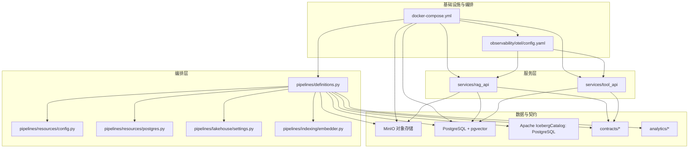

**图表来源**
- [docker-compose.yml:1-340](file://infra/docker-compose.yml#L1-L340)
- [config.yaml:1-66](file://observability/otel/config.yaml#L1-L66)
- [rag_api 主程序:1-73](file://services/rag_api/app/main.py#L1-L73)
- [tool_api 主程序:1-64](file://services/tool_api/app/main.py#L1-L64)
- [Dagster 定义入口:1-38](file://pipelines/definitions.py#L1-L38)
- [数据工厂资源配置:1-136](file://pipelines/resources/config.py#L1-L136)
- [PostgreSQL 资源元数据:1-16](file://pipelines/resources/postgres.py#L1-L16)
- [湖仓设置:1-149](file://pipelines/lakehouse/settings.py#L1-L149)
- [索引构建器（pgvector）:1-429](file://pipelines/indexing/embedder.py#L1-L429)

**章节来源**
- [pyproject.toml:1-49](file://pyproject.toml#L1-L49)
- [docker-compose.yml:1-340](file://infra/docker-compose.yml#L1-L340)

## 核心组件
- 对象存储层（MinIO）
  - 作为 S3 兼容的对象存储，承载原始文档、解析产物、索引、评估与发布制品等。
  - docker-compose 中定义了初始化脚本与多个命名空间桶，用于隔离不同阶段的数据。
- 结构化+向量检索层（PostgreSQL + pgvector）
  - 提供结构化数据存储与向量索引能力，支持 RAG 的混合检索与相似度搜索。
  - 索引构建器负责批量生成向量并写回，同时维护索引清单与统计信息。
- 湖仓层（Apache Iceberg）
  - 以 PostgreSQL 作为 Catalog，S3 作为 Warehouse，实现数据表的版本化与时间旅行能力。
  - 运行时设置通过环境变量注入，支持在学生与讲师两种规模下灵活切换。
- 编排层（Dagster）
  - 资产化编排，统一管理 ingestion、parse、lakehouse、indexing、data_factory 等作业。
  - 通过资源抽象屏蔽底层连接与配置差异，便于在不同环境复用。
- 服务层（FastAPI）
  - RAG API 提供健康检查与查询端点；Tool API 提供工单工具与 KPI 查询等。
  - 两套服务均具备请求 ID 注入、全局异常处理与可观测性集成。
- 可观测性层（OpenTelemetry + Phoenix）
  - OpenTelemetry Collector 接收 gRPC/HTTP OTLP，批量与内存保护策略后转发至 Phoenix。
  - 支持 traces、metrics、logs 一体化采集与可视化。
- 契约层（JSON Schema）
  - RAG 请求/响应契约与工具契约，明确字段约束、默认值、枚举与审计要求，保障接口稳定性与可验证性。

**章节来源**
- [docker-compose.yml:1-340](file://infra/docker-compose.yml#L1-L340)
- [索引构建器（pgvector）:1-429](file://pipelines/indexing/embedder.py#L1-L429)
- [湖仓设置:1-149](file://pipelines/lakehouse/settings.py#L1-L149)
- [Dagster 定义入口:1-38](file://pipelines/definitions.py#L1-L38)
- [RAG API Dockerfile:1-20](file://services/rag_api/Dockerfile#L1-L20)
- [Tool API Dockerfile:1-16](file://services/tool_api/Dockerfile#L1-L16)
- [config.yaml:1-66](file://observability/otel/config.yaml#L1-L66)
- [RAG 请求契约:1-23](file://contracts/service/rag_request.schema.json#L1-L23)
- [RAG 响应契约:1-58](file://contracts/service/rag_response.schema.json#L1-L58)
- [创建工单工具契约:1-95](file://contracts/tools/tools/create_ticket.json#L1-L95)

## 架构总览
下图展示七层架构的端到端交互与数据流：

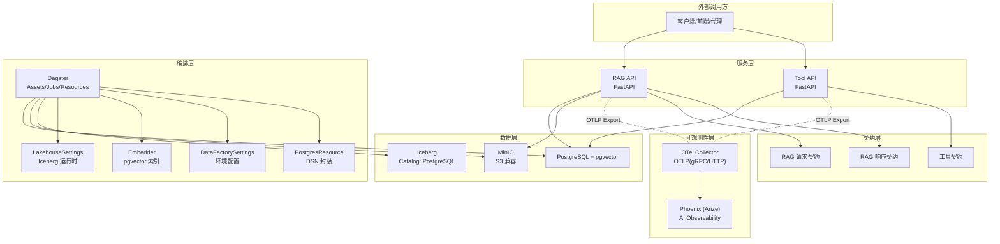

**图表来源**
- [docker-compose.yml:1-340](file://infra/docker-compose.yml#L1-L340)
- [config.yaml:1-66](file://observability/otel/config.yaml#L1-L66)
- [Dagster 定义入口:1-38](file://pipelines/definitions.py#L1-L38)
- [数据工厂资源配置:1-136](file://pipelines/resources/config.py#L1-L136)
- [PostgreSQL 资源元数据:1-16](file://pipelines/resources/postgres.py#L1-L16)
- [湖仓设置:1-149](file://pipelines/lakehouse/settings.py#L1-L149)
- [索引构建器（pgvector）:1-429](file://pipelines/indexing/embedder.py#L1-L429)
- [RAG 请求契约:1-23](file://contracts/service/rag_request.schema.json#L1-L23)
- [RAG 响应契约:1-58](file://contracts/service/rag_response.schema.json#L1-L58)
- [创建工单工具契约:1-95](file://contracts/tools/tools/create_ticket.json#L1-L95)

## 详细组件分析

### 对象存储层（MinIO）
- 职责
  - 存放原始资产（文档/音频/视频/工单）、解析中间产物、索引、评估与发布制品。
- 关键点
  - docker-compose 中通过 mc 初始化多个命名空间桶，用于隔离不同阶段与主题域。
  - RAG API 与 Dagster 通过环境变量配置 S3 Endpoint 与凭证，统一访问 MinIO。
- 部署拓扑
  - 单容器 MinIO + 一个初始化任务，确保桶存在且可被后续组件使用。

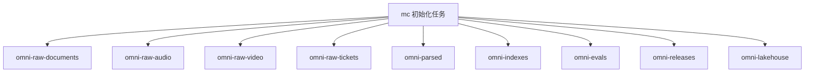

**图表来源**
- [docker-compose.yml:65-86](file://infra/docker-compose.yml#L65-L86)

**章节来源**
- [docker-compose.yml:1-340](file://infra/docker-compose.yml#L1-L340)

### 结构化+向量检索层（PostgreSQL + pgvector）
- 职责
  - 存储结构化业务数据与向量字段，支持基于向量的相似度检索与过滤组合查询。
- 关键点
  - 索引构建器负责从知识段落表读取未嵌入或旧版本的片段，批量生成向量并写回，同时更新索引清单与统计。
  - 首次构建后自动创建 IVFFlat 向量索引，提升检索性能。
- 数据流
  - 从知识段落表抽取待索引片段 → 批量嵌入 → 写回 embedding 字段 → 更新文档块计数与索引清单 → 可选创建向量索引。

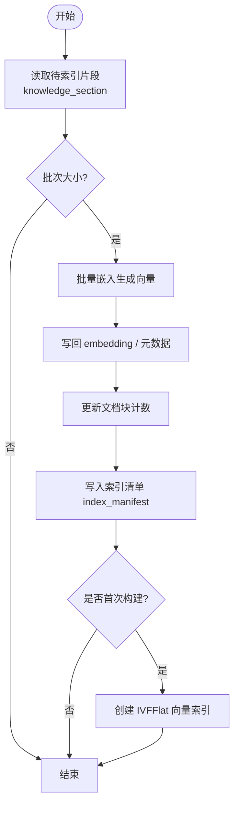

**图表来源**
- [索引构建器（pgvector）:160-351](file://pipelines/indexing/embedder.py#L160-L351)

**章节来源**
- [索引构建器（pgvector）:1-429](file://pipelines/indexing/embedder.py#L1-L429)

### 湖仓层（Apache Iceberg）
- 职责
  - 以 PostgreSQL 作为 Catalog，S3 作为 Warehouse，实现数据表的版本化、模式演进与时间旅行。
- 关键点
  - 运行时设置通过环境变量注入，支持在不同规模（学生/讲师）下切换 Catalog、Warehouse 与命名空间。
  - 校验函数确保 Catalog 类型、URI、Warehouse 形态与 S3 端点等关键参数正确。
- 部署拓扑
  - 在 docker-compose 中，Iceberg 相关环境变量通过 DAGSTER_* 与 ICEBERG_* 统一注入，指向同一 MinIO 与 PostgreSQL。

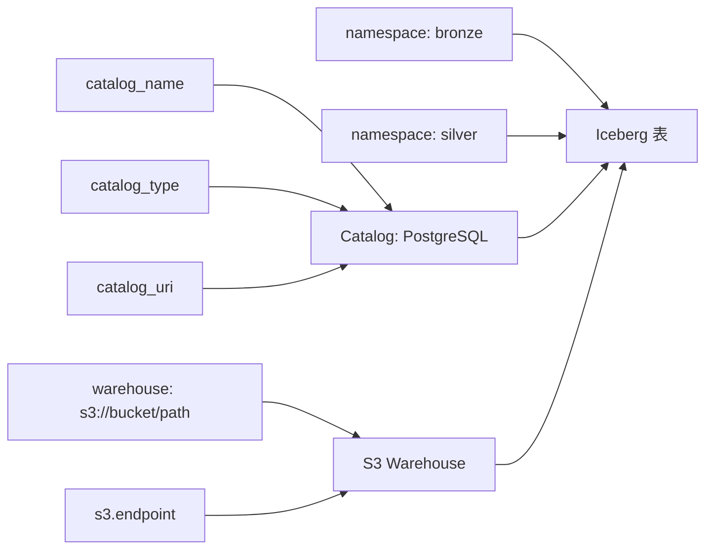

**图表来源**
- [湖仓设置:20-104](file://pipelines/lakehouse/settings.py#L20-L104)
- [docker-compose.yml:170-183](file://infra/docker-compose.yml#L170-L183)

**章节来源**
- [湖仓设置:1-149](file://pipelines/lakehouse/settings.py#L1-L149)
- [docker-compose.yml:170-183](file://infra/docker-compose.yml#L170-L183)

### 编排层（Dagster）
- 职责
  - 将数据处理流程资产化，统一注册资产、检查、作业与资源，支持增量/回填/分区等策略。
- 关键点
  - 定义入口集中加载 ingestion、parse、lakehouse、indexing、data_factory 等模块资产与作业。
  - 资源配置类从环境变量解析运行时参数，支持报告目录、分区日期、指标注册路径等。
  - PostgreSQL 资源提供 DSN 的掩码显示，避免敏感信息泄露。
- 交互关系
  - 通过资源抽象连接数据库、MinIO 与 Iceberg，统一在不同环境复用。

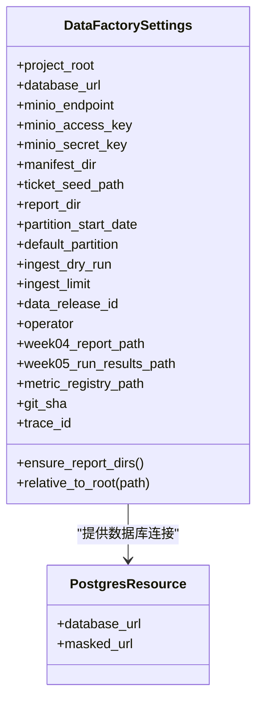

**图表来源**
- [数据工厂资源配置:44-136](file://pipelines/resources/config.py#L44-L136)
- [PostgreSQL 资源元数据:6-16](file://pipelines/resources/postgres.py#L6-L16)

**章节来源**
- [Dagster 定义入口:1-38](file://pipelines/definitions.py#L1-L38)
- [数据工厂资源配置:1-136](file://pipelines/resources/config.py#L1-L136)
- [PostgreSQL 资源元数据:1-16](file://pipelines/resources/postgres.py#L1-L16)

### 服务层（FastAPI）
- RAG API
  - 提供健康检查与查询端点，集成 CORS、请求 ID 注入与全局异常处理。
  - 通过环境变量配置数据库、对象存储、大模型与可观测性导出端点。
- Tool API
  - 提供工单工具与 KPI 查询端点，支持审计日志与幂等键控制。
- 部署方式
  - 两套服务分别打包为独立镜像并通过 docker-compose 启动，端口暴露与依赖健康检查保证启动顺序。

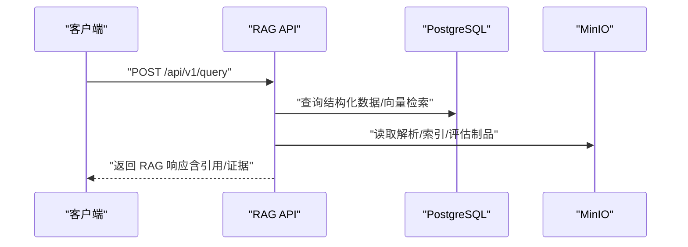

**图表来源**
- [rag_api 主程序:1-73](file://services/rag_api/app/main.py#L1-L73)
- [RAG API Dockerfile:1-20](file://services/rag_api/Dockerfile#L1-L20)
- [docker-compose.yml:91-122](file://infra/docker-compose.yml#L91-L122)

**章节来源**
- [rag_api 主程序:1-73](file://services/rag_api/app/main.py#L1-L73)
- [tool_api 主程序:1-64](file://services/tool_api/app/main.py#L1-L64)
- [RAG API Dockerfile:1-20](file://services/rag_api/Dockerfile#L1-L20)
- [Tool API Dockerfile:1-16](file://services/tool_api/Dockerfile#L1-L16)
- [docker-compose.yml:91-154](file://infra/docker-compose.yml#L91-L154)

### 可观测性层（OpenTelemetry + Phoenix）
- 职责
  - 统一采集 traces、metrics、logs，批量与内存保护策略后转发至 Phoenix，支持 AI 请求可观测与坏样本回放。
- 关键点
  - Collector 配置接收 gRPC/HTTP OTLP，注入资源属性，限制内存占用，Prometheus 导出指标端点。
  - RAG API/Tool API 通过环境变量配置 OTLP 导出端点与服务名，形成端到端追踪。
- 部署拓扑
  - 服务侧与 Collector 之间通过网络互通，Collector 再将数据转发至 Phoenix。

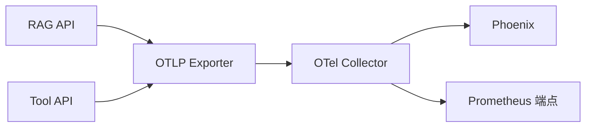

**图表来源**
- [config.yaml:1-66](file://observability/otel/config.yaml#L1-L66)
- [docker-compose.yml:228-262](file://infra/docker-compose.yml#L228-L262)

**章节来源**
- [config.yaml:1-66](file://observability/otel/config.yaml#L1-L66)
- [docker-compose.yml:228-262](file://infra/docker-compose.yml#L228-L262)

### 契约层（JSON Schema）
- 职责
  - 通过 JSON Schema 明确请求/响应字段、默认值、长度/数值范围与调试开关等，确保接口一致性与可验证性。
- 关键点
  - RAG 请求/响应契约覆盖问题、上下文过滤、topK、索引/数据/提示词发布标识与调试信息。
  - 工具契约定义输入输出字段、角色权限、幂等键、审计字段与人工介入条件等。
- 应用场景
  - 在服务层进行请求校验，在评估与回归测试中作为断言依据。

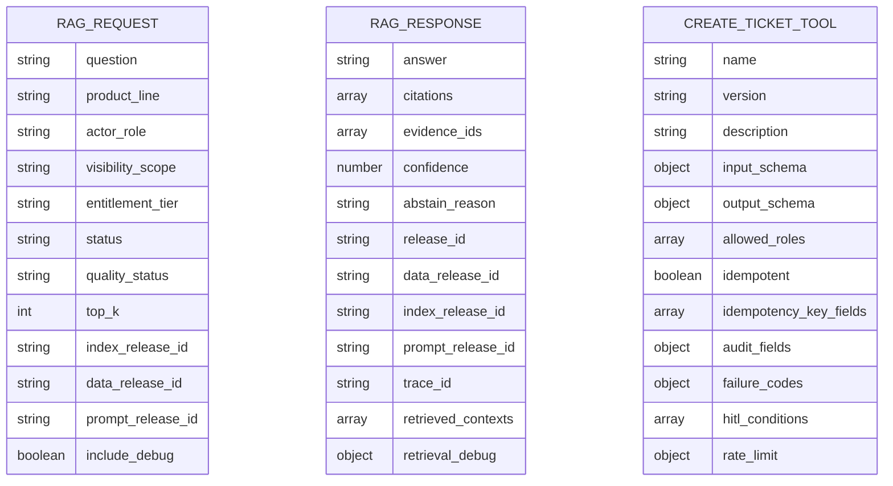

**图表来源**
- [RAG 请求契约:1-23](file://contracts/service/rag_request.schema.json#L1-L23)
- [RAG 响应契约:1-58](file://contracts/service/rag_response.schema.json#L1-L58)
- [创建工单工具契约:1-95](file://contracts/tools/tools/create_ticket.json#L1-L95)

**章节来源**
- [RAG 请求契约:1-23](file://contracts/service/rag_request.schema.json#L1-L23)
- [RAG 响应契约:1-58](file://contracts/service/rag_response.schema.json#L1-L58)
- [创建工单工具契约:1-95](file://contracts/tools/tools/create_ticket.json#L1-L95)

## 依赖关系分析
- 组件耦合
  - 服务层依赖对象存储与结构化数据库；编排层通过资源抽象解耦数据库与存储；可观测性层与服务层松耦合，仅通过导出协议连接。
- 外部依赖
  - pyproject.toml 明确 dagster、dbt、pyiceberg、psycopg2、pyarrow 等依赖，支撑编排、湖仓与数据处理。
- 启动顺序
  - docker-compose 明确先启动 postgres → minio → rag_api/tool_api → dagster → otel_collector → phoenix，确保下游服务可用性。

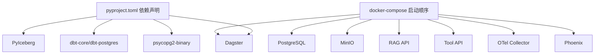

**图表来源**
- [pyproject.toml:16-31](file://pyproject.toml#L16-L31)
- [docker-compose.yml:1-340](file://infra/docker-compose.yml#L1-L340)

**章节来源**
- [pyproject.toml:16-31](file://pyproject.toml#L16-L31)
- [docker-compose.yml:1-340](file://infra/docker-compose.yml#L1-L340)

## 性能考量
- 向量检索性能
  - 通过 IVFFlat 索引与合理的 lists 参数（与数据量平方根相关）提升检索效率；批量嵌入与写回降低 IO 放大。
- 编排与批处理
  - Dagster 作业按资产粒度执行，结合分区与回填策略，减少全量重算成本。
- 可观测性与资源控制
  - Collector 批量与内存限制策略避免 OOM；Prometheus 指标端点便于容量规划。
- 部署规模适配
  - 通过环境变量切换 Iceberg Catalog/Warehouse 与命名空间，满足学生与讲师两种规模的资源约束。

[本节为通用指导，不直接分析具体文件]

## 故障排查指南
- 服务无法启动
  - 检查 docker-compose 中健康检查与启动顺序；确认数据库与对象存储可用。
- 向量索引异常
  - 查看索引构建日志与统计；确认嵌入维度与目标表一致；必要时重建 IVFFlat 索引。
- 编排作业失败
  - 检查 DataFactorySettings 解析的环境变量；核对报告目录与指标注册路径是否存在。
- 可观测性缺失
  - 检查 OTel Collector 配置与端口映射；确认服务侧 OTLP 导出端点与服务名配置正确。

**章节来源**
- [docker-compose.yml:1-340](file://infra/docker-compose.yml#L1-L340)
- [索引构建器（pgvector）:374-396](file://pipelines/indexing/embedder.py#L374-L396)
- [数据工厂资源配置:67-113](file://pipelines/resources/config.py#L67-L113)
- [config.yaml:1-66](file://observability/otel/config.yaml#L1-L66)

## 结论
本架构以“对象存储 + 结构化+向量 + 湖仓 + 编排 + 服务 + 可观测 + 契约”七层协同，既满足学生规模的本地快速验证，又为讲师规模的工程化落地提供扩展空间。通过 JSON Schema 契约与 OTel/Phoenix 的可观测体系，系统在功能完备的同时兼顾了质量与可运维性。建议在实际部署中结合业务规模与合规要求，进一步细化资源配额、备份策略与安全边界。

[本节为总结性内容，不直接分析具体文件]

## 附录
- 部署拓扑图（概念示意）
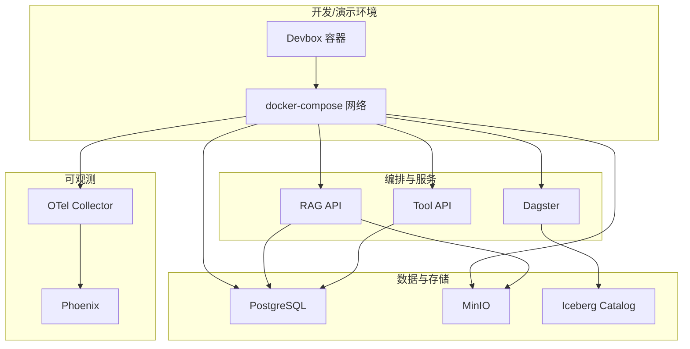

[本图为概念性拓扑示意，不对应具体文件]