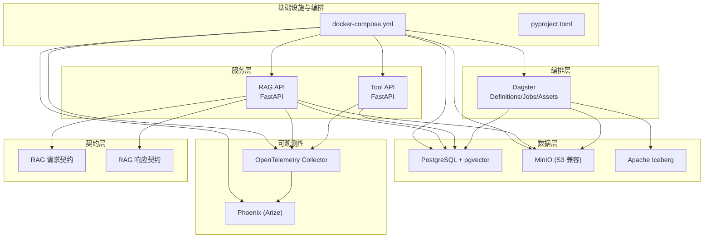
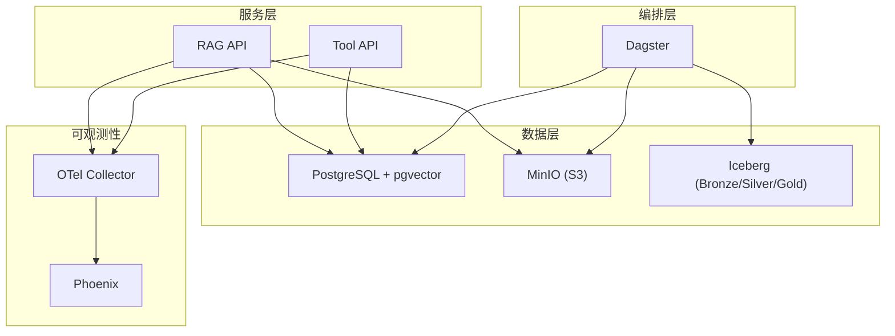
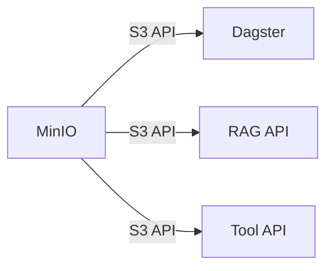
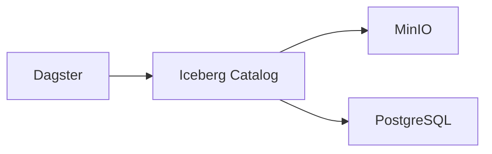
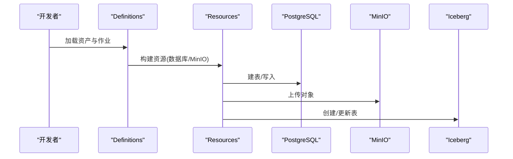
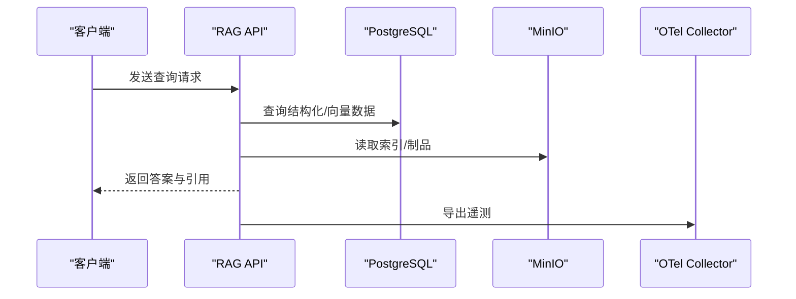
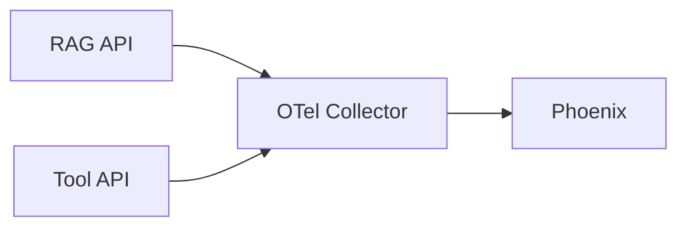
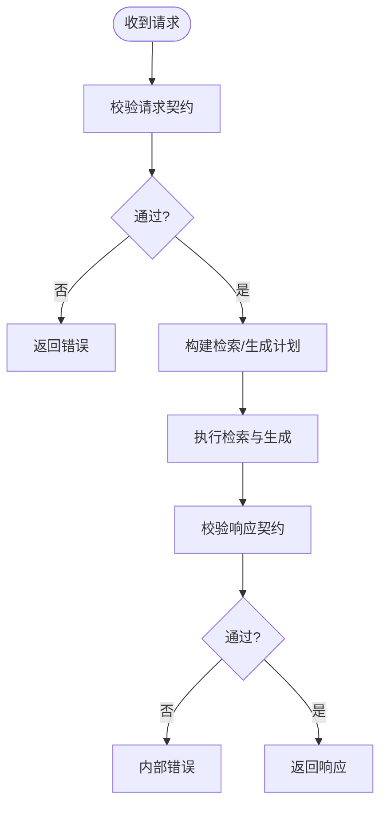
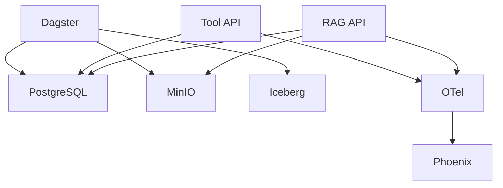
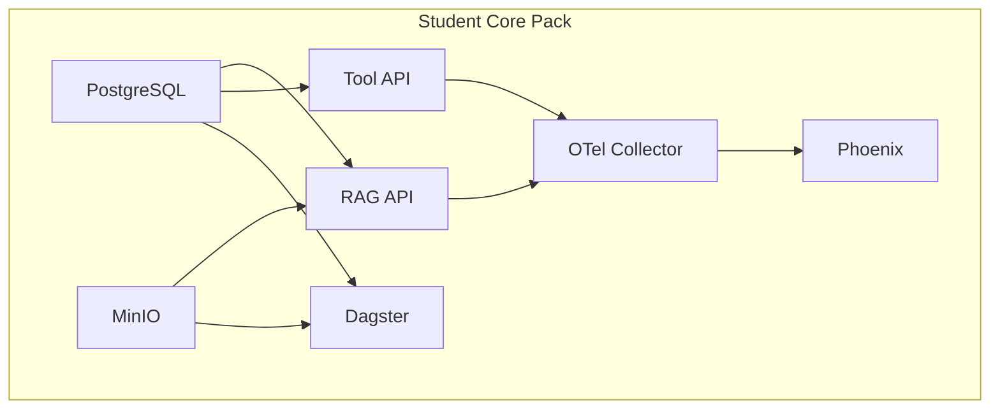

# 架构设计

<cite>
**本文引用的文件**
- [docker-compose.yml](file://infra/docker-compose.yml)
- [pyproject.toml](file://pyproject.toml)
- [services/rag_api/app/main.py](file://services/rag_api/app/main.py)
- [services/rag_api/app/config.py](file://services/rag_api/app/config.py)
- [services/tool_api/app/main.py](file://services/tool_api/app/main.py)
- [services/tool_api/app/config.py](file://services/tool_api/app/config.py)
- [pipelines/definitions.py](file://pipelines/definitions.py)
- [pipelines/resources/config.py](file://pipelines/resources/config.py)
- [pipelines/resources/postgres.py](file://pipelines/resources/postgres.py)
- [pipelines/resources/minio.py](file://pipelines/resources/minio.py)
- [pipelines/lakehouse/assets.py](file://pipelines/lakehouse/assets.py)
- [pipelines/indexing/assets.py](file://pipelines/indexing/assets.py)
- [pipelines/ingestion/assets.py](file://pipelines/ingestion/assets.py)
- [contracts/service/rag_request.schema.json](file://contracts/service/rag_request.schema.json)
- [contracts/service/rag_response.schema.json](file://contracts/service/rag_response.schema.json)
- [observability/otel/config.yaml](file://observability/otel/config.yaml)
</cite>

## 目录
1. [引言](#引言)
2. [项目结构](#项目结构)
3. [核心组件](#核心组件)
4. [架构总览](#架构总览)
5. [详细组件分析](#详细组件分析)
6. [依赖分析](#依赖分析)
7. [性能考量](#性能考量)
8. [故障排查指南](#故障排查指南)
9. [结论](#结论)
10. [附录](#附录)

## 引言
本架构文档面向 OmniSupport Copilot 的七层设计：对象存储层（MinIO）、结构化+向量检索层（PostgreSQL+pgvector）、湖仓层（Apache Iceberg）、编排层（Dagster）、服务层（FastAPI）、可观测性层（OpenTelemetry+Phoenix）与契约层（JSON Schema）。文档阐述各层职责、数据流与交互关系，并说明技术选型理由与权衡；同时给出针对 Student Core Pack 与 Instructor Scale Pack 两种部署规模的扩展建议与拓扑图。

## 项目结构
本仓库采用按功能域分层的目录组织方式：
- infra：基础设施与编排（Compose、Dockerfile、环境变量）
- services：对外服务（RAG API、Tool API）
- pipelines：数据资产与作业（Dagster）
- contracts：契约与模式（JSON Schema）
- analytics：分析模型（dbt）
- observability：可观测性配置
- data：合成数据与种子清单
- reports/tests/runbooks/docs：交付物与工程实践



图表来源
- [docker-compose.yml:1-340](file://infra/docker-compose.yml#L1-L340)
- [pyproject.toml:1-49](file://pyproject.toml#L1-L49)

章节来源
- [docker-compose.yml:1-340](file://infra/docker-compose.yml#L1-L340)
- [pyproject.toml:1-49](file://pyproject.toml#L1-L49)

## 核心组件
- 对象存储层（MinIO）
  - 提供 S3 兼容接口，承载原始数据、解析产物、索引、评估与发布制品等。
  - Compose 中以独立服务运行，并在启动后自动创建多个命名空间化的 Bucket。
- 结构化+向量检索层（PostgreSQL + pgvector）
  - 承载结构化元数据与向量嵌入索引，支持检索与重排序。
  - 通过迁移脚本初始化表结构与索引。
- 湖仓层（Apache Iceberg）
  - 通过 Dagster + PyIceberg 在 MinIO 上构建 Bronze/Silver/Gold 分层表，支持快照、时间旅行与模式演进。
- 编排层（Dagster）
  - 统一资产与作业定义，串联采集、解析、湖仓、索引与评估流程。
- 服务层（FastAPI）
  - RAG API 提供健康检查与检索增强生成功能；Tool API 提供工单与 KPI 工具能力。
- 可观测性层（OpenTelemetry + Phoenix）
  - 采集 traces/metrics/logs，统一导出至 Collector，并在 Phoenix 可视化展示。
- 契约层（JSON Schema）
  - 明确请求/响应字段、约束与默认值，保障跨模块接口一致性。

章节来源
- [docker-compose.yml:17-86](file://infra/docker-compose.yml#L17-L86)
- [docker-compose.yml:19-36](file://infra/docker-compose.yml#L19-L36)
- [pipelines/lakehouse/assets.py:10-125](file://pipelines/lakehouse/assets.py#L10-L125)
- [pipelines/definitions.py:1-38](file://pipelines/definitions.py#L1-L38)
- [services/rag_api/app/main.py:1-73](file://services/rag_api/app/main.py#L1-L73)
- [services/tool_api/app/main.py:1-64](file://services/tool_api/app/main.py#L1-L64)
- [observability/otel/config.yaml](file://observability/otel/config.yaml)
- [contracts/service/rag_request.schema.json:1-23](file://contracts/service/rag_request.schema.json#L1-L23)
- [contracts/service/rag_response.schema.json:1-58](file://contracts/service/rag_response.schema.json#L1-L58)

## 架构总览
下图展示了七层架构在容器内的交互关系与数据流向。RAG API 与 Tool API 作为服务层，分别对接 PostgreSQL（结构化+向量）与 MinIO（对象存储），并通过 OpenTelemetry 导出遥测到 Collector，最终在 Phoenix 可视化。Dagster 作为编排层，驱动采集、解析、湖仓与索引作业，产出 Iceberg 表与索引制品，供服务层消费。



图表来源
- [docker-compose.yml:89-262](file://infra/docker-compose.yml#L89-L262)
- [pipelines/definitions.py:1-38](file://pipelines/definitions.py#L1-L38)
- [pipelines/lakehouse/assets.py:10-125](file://pipelines/lakehouse/assets.py#L10-L125)

## 详细组件分析

### 对象存储层（MinIO）
- 职责
  - 提供 S3 兼容 API，承载原始数据、解析中间产物、索引、评估与发布制品。
  - Compose 中通过 mc 初始化多个命名空间 Bucket，确保隔离与可管理性。
- 关键点
  - 服务暴露 S3 API 与控制台端口，便于本地调试与运维。
  - 通过环境变量注入访问凭据，确保安全与可配置性。
- 与编排层的关系
  - Dagster 通过 Iceberg Catalog 与 MinIO 交互，完成表创建与数据写入。
- 与服务层的关系
  - RAG API 与 Tool API 通过 MinIO SDK 访问对象，读取索引与制品。



图表来源
- [docker-compose.yml:39-86](file://infra/docker-compose.yml#L39-L86)
- [pipelines/lakehouse/assets.py:109-125](file://pipelines/lakehouse/assets.py#L109-L125)

章节来源
- [docker-compose.yml:39-86](file://infra/docker-compose.yml#L39-L86)
- [pipelines/lakehouse/assets.py:109-125](file://pipelines/lakehouse/assets.py#L109-L125)

### 结构化+向量检索层（PostgreSQL + pgvector）
- 职责
  - 存储结构化元数据与向量嵌入索引，支撑检索与重排序。
  - 通过迁移脚本初始化表结构与索引，保证一致的模式。
- 关键点
  - 服务健康检查基于数据库就绪状态，确保下游服务稳定启动。
  - 环境变量注入数据库连接信息，便于本地与容器内复用。
- 与编排层的关系
  - Dagster 通过资源注入数据库 URL，执行建表与数据写入。
- 与服务层的关系
  - RAG API 与 Tool API 通过数据库连接池访问结构化数据与向量索引。

```mermaid
graph LR
PG["PostgreSQL + pgvector"] <- --> DAG["Dagster"]
PG <- --> RAG["RAG API"]
PG <- --> TOOL["Tool API"]
```

图表来源
- [docker-compose.yml:17-36](file://infra/docker-compose.yml#L17-L36)
- [pipelines/resources/postgres.py:1-16](file://pipelines/resources/postgres.py#L1-L16)
- [services/rag_api/app/config.py:14-16](file://services/rag_api/app/config.py#L14-L16)
- [services/tool_api/app/config.py:7](file://services/tool_api/app/config.py#L7)

章节来源
- [docker-compose.yml:17-36](file://infra/docker-compose.yml#L17-L36)
- [pipelines/resources/postgres.py:1-16](file://pipelines/resources/postgres.py#L1-L16)
- [services/rag_api/app/config.py:14-16](file://services/rag_api/app/config.py#L14-L16)
- [services/tool_api/app/config.py:7](file://services/tool_api/app/config.py#L7)

### 湖仓层（Apache Iceberg）
- 职责
  - 通过 PyIceberg 在 MinIO 上构建 Bronze/Silver/Gold 分层表，支持快照、时间旅行与模式演进。
- 关键点
  - 资产定义中区分三层职责，Bronze 负责原始落盘，Silver 负责规范化事实，Gold 负责服务消费视图。
  - 提供 Week04/Week05/Week08 的阶段性能力封装，逐步完善。
- 与编排层的关系
  - 通过 Dagster 资产与作业统一编排，落地到 Iceberg Catalog。



图表来源
- [pipelines/lakehouse/assets.py:10-125](file://pipelines/lakehouse/assets.py#L10-L125)
- [docker-compose.yml:158-226](file://infra/docker-compose.yml#L158-L226)

章节来源
- [pipelines/lakehouse/assets.py:10-125](file://pipelines/lakehouse/assets.py#L10-L125)
- [docker-compose.yml:158-226](file://infra/docker-compose.yml#L158-L226)

### 编排层（Dagster）
- 职责
  - 统一资产与作业定义，串联采集、解析、湖仓、索引与评估流程。
- 关键点
  - 定义文件集中注册资产、检查与作业，便于本地开发与 CI/CD。
  - 资源模块抽象数据库与对象存储访问，便于测试与复用。
- 与数据层的关系
  - 通过资源注入数据库 URL 与 MinIO 凭据，驱动数据落盘与建表。



图表来源
- [pipelines/definitions.py:1-38](file://pipelines/definitions.py#L1-L38)
- [pipelines/resources/config.py:1-136](file://pipelines/resources/config.py#L1-L136)
- [pipelines/resources/postgres.py:1-16](file://pipelines/resources/postgres.py#L1-L16)
- [pipelines/resources/minio.py:1-14](file://pipelines/resources/minio.py#L1-L14)

章节来源
- [pipelines/definitions.py:1-38](file://pipelines/definitions.py#L1-L38)
- [pipelines/resources/config.py:1-136](file://pipelines/resources/config.py#L1-L136)
- [pipelines/resources/postgres.py:1-16](file://pipelines/resources/postgres.py#L1-L16)
- [pipelines/resources/minio.py:1-14](file://pipelines/resources/minio.py#L1-L14)

### 服务层（FastAPI）
- RAG API
  - 提供健康检查与检索增强生成路由，内置请求 ID 中间件与全局异常处理。
  - 通过配置类注入数据库、对象存储、LLM 与可观测性参数。
- Tool API
  - 提供健康检查与工单/KPI 工具路由，内置请求 ID 中间件与全局异常处理。
  - 通过配置类注入数据库与可观测性参数。
- 与数据层的关系
  - 通过数据库连接访问结构化数据与向量索引；通过 MinIO SDK 访问对象。
- 与可观测性层的关系
  - 通过 OpenTelemetry 导出 trace/metric/log。



图表来源
- [services/rag_api/app/main.py:19-73](file://services/rag_api/app/main.py#L19-L73)
- [services/rag_api/app/config.py:14-53](file://services/rag_api/app/config.py#L14-L53)
- [docker-compose.yml:89-122](file://infra/docker-compose.yml#L89-L122)

章节来源
- [services/rag_api/app/main.py:19-73](file://services/rag_api/app/main.py#L19-L73)
- [services/rag_api/app/config.py:14-53](file://services/rag_api/app/config.py#L14-L53)
- [services/tool_api/app/main.py:19-64](file://services/tool_api/app/main.py#L19-L64)
- [services/tool_api/app/config.py:1-19](file://services/tool_api/app/config.py#L1-L19)
- [docker-compose.yml:89-154](file://infra/docker-compose.yml#L89-L154)

### 可观测性层（OpenTelemetry + Phoenix）
- 职责
  - 统一采集 traces/metrics/logs，导出至 Collector，并在 Phoenix 可视化展示。
- 关键点
  - Collector 暴露 gRPC/HTTP OTLP 与 Prometheus 端口，便于集成。
  - Phoenix 作为 Arize 的可视化组件，支持 AI 请求追踪与回放。



图表来源
- [docker-compose.yml:228-262](file://infra/docker-compose.yml#L228-L262)
- [observability/otel/config.yaml](file://observability/otel/config.yaml)

章节来源
- [docker-compose.yml:228-262](file://infra/docker-compose.yml#L228-L262)
- [observability/otel/config.yaml](file://observability/otel/config.yaml)

### 契约层（JSON Schema）
- 职责
  - 明确请求/响应字段、约束与默认值，保障跨模块接口一致性。
- 关键点
  - RAG 请求契约定义问题、过滤条件、检索参数与版本标识。
  - RAG 响应契约定义答案、引用、证据 ID、置信度与调试信息。



图表来源
- [contracts/service/rag_request.schema.json:1-23](file://contracts/service/rag_request.schema.json#L1-L23)
- [contracts/service/rag_response.schema.json:1-58](file://contracts/service/rag_response.schema.json#L1-L58)

章节来源
- [contracts/service/rag_request.schema.json:1-23](file://contracts/service/rag_request.schema.json#L1-L23)
- [contracts/service/rag_response.schema.json:1-58](file://contracts/service/rag_response.schema.json#L1-L58)

## 依赖分析
- 组件耦合与内聚
  - 服务层对数据层存在直接依赖（数据库与对象存储），但通过配置与中间件解耦。
  - 编排层通过资源抽象降低对具体实现的耦合，便于替换与扩展。
- 外部依赖与集成点
  - OpenTelemetry 作为统一采集层，服务层与编排层均通过 OTLP 导出遥测。
  - Iceberg 通过 Catalog 与 MinIO 集成，形成湖仓闭环。
- 潜在循环依赖
  - 当前结构清晰，未见循环依赖迹象。



图表来源
- [docker-compose.yml:89-262](file://infra/docker-compose.yml#L89-L262)
- [pipelines/definitions.py:1-38](file://pipelines/definitions.py#L1-38)
- [pipelines/lakehouse/assets.py:10-125](file://pipelines/lakehouse/assets.py#L10-L125)

章节来源
- [docker-compose.yml:89-262](file://infra/docker-compose.yml#L89-L262)
- [pipelines/definitions.py:1-38](file://pipelines/definitions.py#L1-L38)
- [pipelines/lakehouse/assets.py:10-125](file://pipelines/lakehouse/assets.py#L10-L125)

## 性能考量
- 数据层
  - PostgreSQL + pgvector 的向量检索需结合索引与过滤条件优化；合理设置 top_k 与最小相似度阈值，减少无效扫描。
  - MinIO 的桶数量与对象分布影响读写性能，建议按业务域拆分并启用压缩与分层存储。
- 编排层
  - Dagster 作业的并发度与分区策略直接影响吞吐；建议按日期/产品线进行分区，避免热点。
- 服务层
  - FastAPI 的中间件与异常处理开销可控，注意长链路超时与重试策略。
- 可观测性
  - OTel 采样率与批大小需平衡精度与资源占用；Phoenix 的数据保留策略需与合规要求匹配。

## 故障排查指南
- 服务启动失败
  - 检查数据库与对象存储的健康检查是否通过；确认环境变量与网络连通性。
- 数据加载异常
  - 查看 Dagster 作业日志与资产元数据；核对 Iceberg 表创建与写入状态。
- 检索结果异常
  - 校验索引构建作业与嵌入批次；检查过滤条件与阈值设置。
- 可观测性缺失
  - 确认 OTel Collector 配置与端口映射；检查 Phoenix 是否正常接收数据。

章节来源
- [docker-compose.yml:32-60](file://infra/docker-compose.yml#L32-L60)
- [docker-compose.yml:117-121](file://infra/docker-compose.yml#L117-L121)
- [docker-compose.yml:149-153](file://infra/docker-compose.yml#L149-L153)

## 结论
本架构以“对象存储 + 结构化+向量 + 湖仓 + 编排 + 服务 + 可观测 + 契约”七层协同，形成从数据采集到服务消费的完整闭环。通过 JSON Schema 约束接口契约，通过 OpenTelemetry 与 Phoenix 实现可观测性，通过 Iceberg 支撑湖仓能力，通过 Dagster 统一编排，既满足 Student Core Pack 的轻量化需求，又为 Instructor Scale Pack 的规模化扩展预留空间。

## 附录
- 部署拓扑（Student Core Pack）
  - 单机或小型集群：PostgreSQL、MinIO、RAG API、Tool API、Dagster、OTel Collector、Phoenix 均在同一网络内运行，使用本地卷持久化。
- 部署拓扑（Instructor Scale Pack）
  - 生产级：数据库与对象存储高可用；Dagster 与服务层水平扩展；OTel Collector 与 Phoenix 独立部署；Iceberg Catalog 与仓库分离；引入缓存与限流策略。
- 启动顺序
  - PostgreSQL → MinIO → RAG API/Tool API → Dagster → OTel Collector → Phoenix



图表来源
- [docker-compose.yml:1-340](file://infra/docker-compose.yml#L1-L340)