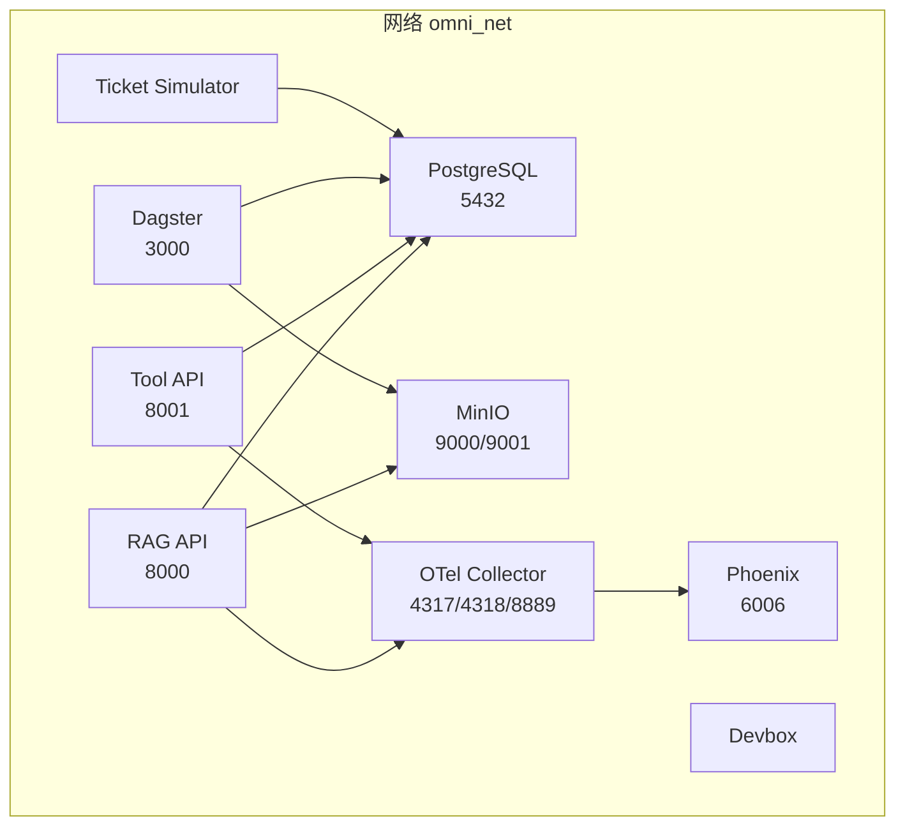
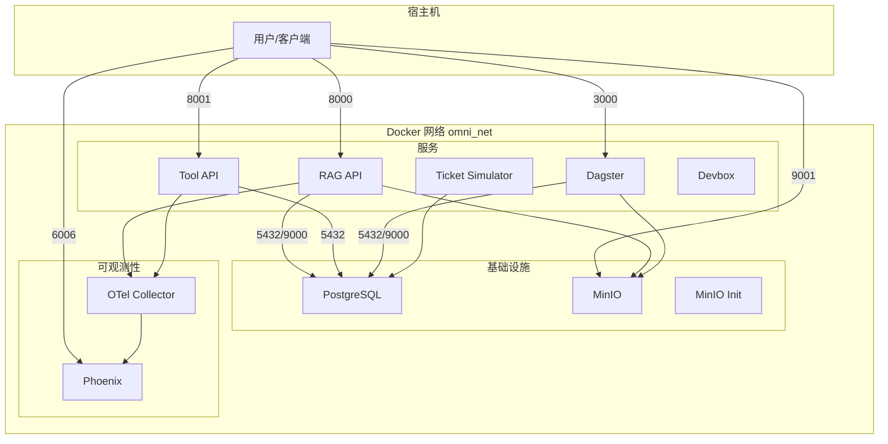
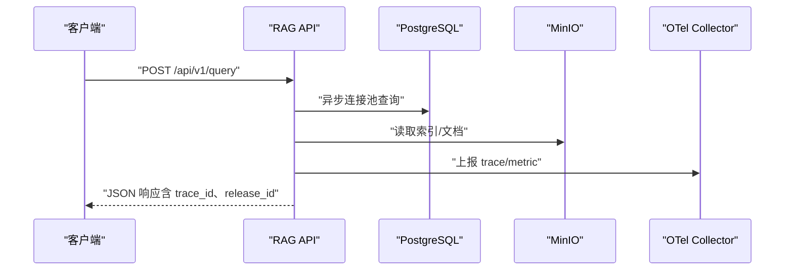
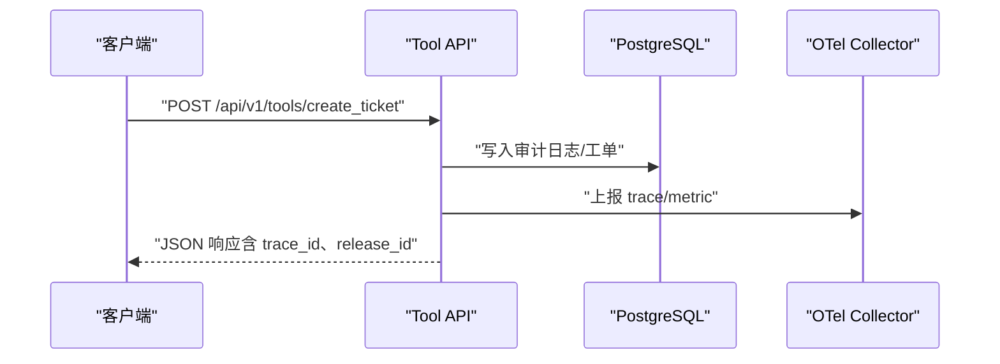
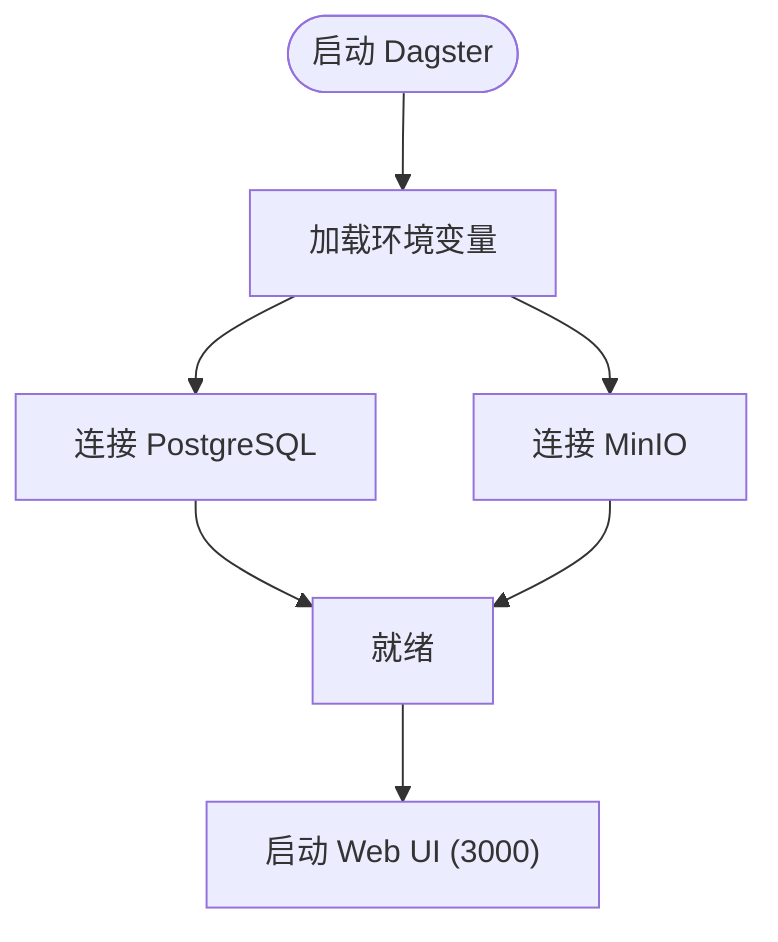
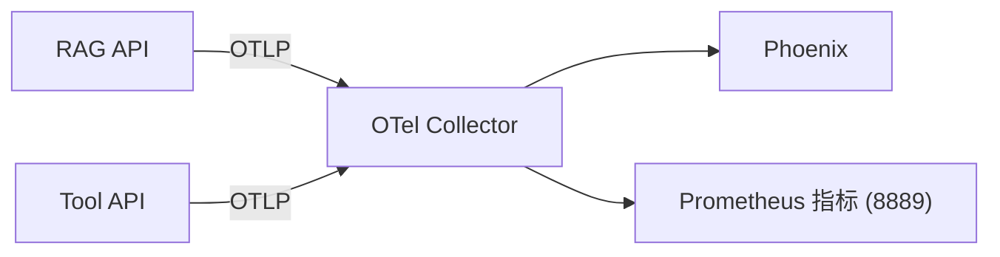
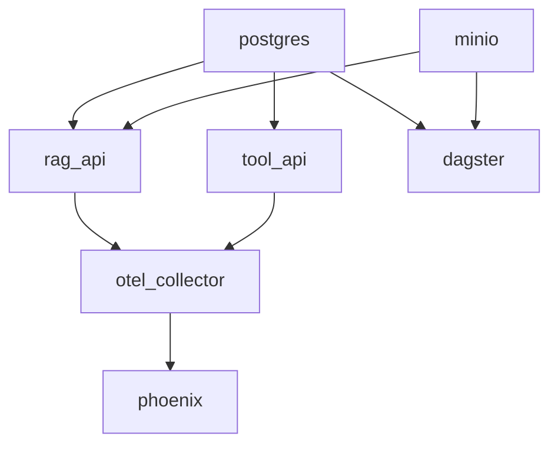

# 部署拓扑与网络设计

<cite>
**本文档引用的文件**
- [infra/docker-compose.yml](file://infra/docker-compose.yml)
- [observability/otel/config.yaml](file://observability/otel/config.yaml)
- [services/rag_api/Dockerfile](file://services/rag_api/Dockerfile)
- [services/tool_api/Dockerfile](file://services/tool_api/Dockerfile)
- [services/rag_api/app/main.py](file://services/rag_api/app/main.py)
- [services/tool_api/app/main.py](file://services/tool_api/app/main.py)
- [services/rag_api/app/config.py](file://services/rag_api/app/config.py)
- [services/tool_api/app/config.py](file://services/tool_api/app/config.py)
- [services/rag_api/app/routers/query.py](file://services/rag_api/app/routers/query.py)
- [services/tool_api/app/routers/tickets.py](file://services/tool_api/app/routers/tickets.py)
- [services/rag_api/app/routers/health.py](file://services/rag_api/app/routers/health.py)
- [services/tool_api/app/routers/health.py](file://services/tool_api/app/routers/health.py)
- [runbooks/week01-startup.md](file://runbooks/week01-startup.md)
- [infra/devbox.Dockerfile](file://infra/devbox.Dockerfile)
</cite>

## 目录
1. [简介](#简介)
2. [项目结构](#项目结构)
3. [核心组件](#核心组件)
4. [架构总览](#架构总览)
5. [详细组件分析](#详细组件分析)
6. [依赖关系分析](#依赖关系分析)
7. [性能考量](#性能考量)
8. [故障排查指南](#故障排查指南)
9. [结论](#结论)
10. [附录](#附录)

## 简介
本文件面向 OmniSupport Copilot 的本地部署，系统性阐述部署拓扑、网络配置、服务间通信、容器依赖关系、环境变量、安全与网络隔离、Docker Compose 结构、服务发现、可观测性与故障转移建议，并给出开发/测试/生产三类场景的差异化配置思路。默认端口包括：8000（RAG API）、8001（Tool API）、3000（Dagster）、9000/9001（MinIO S3 API/Web 控制台）、6006（Phoenix）、以及 OpenTelemetry Collector 的 4317/4318/8889 端口。

## 项目结构
本地部署以 Docker Compose 为核心，按“基础设施—服务—可观测性”分层组织：
- 基础设施层：PostgreSQL（含向量扩展）、MinIO（S3 兼容对象存储）
- 服务层：RAG API、Tool API、Dagster、Ticket Simulator、Devbox
- 可观测性层：OpenTelemetry Collector、Phoenix（AI 可观测）

图表来源
- [infra/docker-compose.yml:5-340](file://infra/docker-compose.yml#L5-L340)

章节来源
- [infra/docker-compose.yml:1-340](file://infra/docker-compose.yml#L1-L340)

## 核心组件
- PostgreSQL（pgvector）：结构化数据与向量检索，挂载迁移脚本进行初始化。
- MinIO：S3 兼容对象存储，提供 Web 控制台与 S3 API；随容器启动自动创建多个命名空间桶。
- RAG API：FastAPI 服务，提供健康检查与查询接口，集成 OpenTelemetry 上报。
- Tool API：工单工具与审计日志服务，提供健康检查与工具路由。
- Dagster：数据管线编排与资产化，暴露 Web UI。
- OpenTelemetry Collector：统一接收 gRPC/HTTP OTLP，转发至 Phoenix，并导出 Prometheus 指标。
- Phoenix：AI 请求可观测平台，消费 OTLP 并可视化。
- Ticket Simulator：工单种子数据生成器。
- Devbox：无本地 Python 依赖的工具容器，便于在宿主机外执行测试与脚本。

章节来源
- [infra/docker-compose.yml:19-340](file://infra/docker-compose.yml#L19-L340)
- [observability/otel/config.yaml:1-66](file://observability/otel/config.yaml#L1-L66)

## 架构总览
下图展示服务间的网络与依赖关系，以及端口映射与健康检查策略：

图表来源
- [infra/docker-compose.yml:19-340](file://infra/docker-compose.yml#L19-L340)
- [observability/otel/config.yaml:1-66](file://observability/otel/config.yaml#L1-L66)

## 详细组件分析

### PostgreSQL（结构化存储 + 向量检索）
- 镜像与端口：使用 pgvector/pgvector:pg16，容器内 5432 端口，Compose 中未映射至宿主机，避免与本机冲突。
- 初始化：通过挂载迁移脚本目录实现首次初始化。
- 健康检查：基于 pg_isready 的健康检查，确保数据库可用。
- 依赖：RAG API、Tool API、Dagster、Ticket Simulator 均通过服务名访问。

章节来源
- [infra/docker-compose.yml:19-37](file://infra/docker-compose.yml#L19-L37)

### MinIO（S3 兼容对象存储）
- 镜像与命令：minio/minio:latest，启动 Web 控制台与 S3 API。
- 端口映射：9000（S3 API）、9001（Web 控制台）。
- 初始化：minio_init 容器在 MinIO 就绪后自动创建多个命名空间桶。
- 依赖：RAG API、Dagster 通过服务名访问 MinIO。

章节来源
- [infra/docker-compose.yml:41-86](file://infra/docker-compose.yml#L41-L86)

### RAG API（检索增强生成服务）
- 镜像与端口：基于 Python 3.11 slim，容器内 8000 端口，映射至宿主机 8000。
- 环境变量：数据库连接、MinIO 访问、LLM 密钥、OTel 上报、版本标识等。
- 健康检查：对 /health 的 HTTP 健康检查。
- 依赖：PostgreSQL、MinIO、OTel Collector。
- 功能路由：健康检查、RAG 查询、管理端点等。

图表来源
- [services/rag_api/app/routers/query.py:39-94](file://services/rag_api/app/routers/query.py#L39-L94)
- [services/rag_api/app/routers/health.py:10-33](file://services/rag_api/app/routers/health.py#L10-L33)
- [services/rag_api/app/main.py:68-73](file://services/rag_api/app/main.py#L68-L73)
- [infra/docker-compose.yml:91-122](file://infra/docker-compose.yml#L91-L122)

章节来源
- [services/rag_api/Dockerfile:1-20](file://services/rag_api/Dockerfile#L1-L20)
- [services/rag_api/app/main.py:1-73](file://services/rag_api/app/main.py#L1-L73)
- [services/rag_api/app/config.py:1-53](file://services/rag_api/app/config.py#L1-L53)
- [services/rag_api/app/routers/query.py:1-159](file://services/rag_api/app/routers/query.py#L1-L159)
- [services/rag_api/app/routers/health.py:1-48](file://services/rag_api/app/routers/health.py#L1-L48)
- [infra/docker-compose.yml:91-122](file://infra/docker-compose.yml#L91-L122)

### Tool API（工单工具 + 审计日志）
- 镜像与端口：基于 Python 3.11 slim，容器内 8001 端口，映射至宿主机 8001。
- 环境变量：数据库连接、OTel 上报、版本标识、指标注册表路径等。
- 健康检查：对 /health 的 HTTP 健康检查。
- 依赖：PostgreSQL、OTel Collector。
- 功能路由：健康检查、工单工具、KPI 查询等。

图表来源
- [services/tool_api/app/routers/tickets.py:81-124](file://services/tool_api/app/routers/tickets.py#L81-L124)
- [services/tool_api/app/routers/health.py:7-14](file://services/tool_api/app/routers/health.py#L7-L14)
- [services/tool_api/app/main.py:61-64](file://services/tool_api/app/main.py#L61-L64)
- [infra/docker-compose.yml:126-154](file://infra/docker-compose.yml#L126-L154)

章节来源
- [services/tool_api/Dockerfile:1-16](file://services/tool_api/Dockerfile#L1-L16)
- [services/tool_api/app/main.py:1-64](file://services/tool_api/app/main.py#L1-L64)
- [services/tool_api/app/config.py:1-19](file://services/tool_api/app/config.py#L1-L19)
- [services/tool_api/app/routers/tickets.py:1-134](file://services/tool_api/app/routers/tickets.py#L1-L134)
- [services/tool_api/app/routers/health.py:1-15](file://services/tool_api/app/routers/health.py#L1-L15)
- [infra/docker-compose.yml:126-154](file://infra/docker-compose.yml#L126-L154)

### Dagster（数据管线编排）
- 镜像与命令：dagster/dagster-k8s:latest，dev 模式监听 3000 端口。
- 环境变量：数据库、MinIO、Iceberg 目录与仓库、报告路径、DBT 目标等。
- 依赖：PostgreSQL、MinIO。
- 数据卷：挂载 pipelines、数据与文档、报告等目录。

图表来源
- [infra/docker-compose.yml:158-226](file://infra/docker-compose.yml#L158-L226)

章节来源
- [infra/docker-compose.yml:158-226](file://infra/docker-compose.yml#L158-L226)

### OpenTelemetry Collector 与 Phoenix
- OTel Collector：接收 gRPC/HTTP OTLP，批量与内存限制处理器，导出至 Phoenix 与 Prometheus。
- Phoenix：消费 OTLP，提供可视化界面（6006）。

图表来源
- [observability/otel/config.yaml:1-66](file://observability/otel/config.yaml#L1-L66)
- [infra/docker-compose.yml:230-262](file://infra/docker-compose.yml#L230-L262)

章节来源
- [observability/otel/config.yaml:1-66](file://observability/otel/config.yaml#L1-L66)
- [infra/docker-compose.yml:230-262](file://infra/docker-compose.yml#L230-L262)

### Ticket Simulator 与 Devbox
- Ticket Simulator：生成工单种子数据，依赖 PostgreSQL。
- Devbox：无本地 Python 依赖的工具容器，便于在宿主机外执行测试与脚本。

章节来源
- [infra/docker-compose.yml:266-340](file://infra/docker-compose.yml#L266-L340)
- [infra/devbox.Dockerfile:1-25](file://infra/devbox.Dockerfile#L1-L25)

## 依赖关系分析
- 服务启动顺序：postgres → minio → rag_api/tool_api → dagster → otel_collector → phoenix；部分服务通过 health/condition 保证依赖就绪。
- 网络：所有服务加入同一桥接网络 omni_net，通过服务名相互访问。
- 端口映射：RAG API（8000）、Tool API（8001）、Dagster（3000）、MinIO（9000/9001）、Phoenix（6006）、OTel（4317/4318/8889）。
- 健康检查：PostgreSQL、MinIO、RAG API、Tool API、OTel Collector 均配置健康检查。

图表来源
- [infra/docker-compose.yml:1-340](file://infra/docker-compose.yml#L1-L340)

章节来源
- [infra/docker-compose.yml:1-340](file://infra/docker-compose.yml#L1-L340)

## 性能考量
- OTel 批量与内存限制：Collector 配置了批量与内存限制处理器，降低资源占用并提升吞吐。
- 数据库连接池：RAG API 使用异步连接池，避免阻塞与抖动。
- 端口与并发：容器内端口固定，建议在生产环境通过反向代理或负载均衡器统一入口，避免直接暴露宿主机端口。
- 存储与 IO：MinIO 与 PostgreSQL 使用独立卷，建议在生产环境配置持久化与快照策略。

章节来源
- [observability/otel/config.yaml:12-29](file://observability/otel/config.yaml#L12-L29)
- [services/rag_api/app/routers/query.py:29-34](file://services/rag_api/app/routers/query.py#L29-L34)

## 故障排查指南
- MinIO 初始化失败：等待 MinIO 就绪后再重启 minio_init。
- RAG API 数据库不可用：等待迁移脚本执行完成。
- Devbox 首次构建失败：先执行 build，再运行。
- 契约测试失败：检查 contracts 目录结构与文件完整性。
- 健康检查失败：确认服务依赖（PostgreSQL、MinIO）已就绪且端口可达。

章节来源
- [runbooks/week01-startup.md:128-147](file://runbooks/week01-startup.md#L128-L147)

## 结论
该部署拓扑以 Docker Compose 串联基础设施与服务，通过统一网络与健康检查保障启动顺序与可用性。OTel 与 Phoenix 提供可观测性闭环。生产环境建议引入反向代理、证书与网络隔离、密钥管理与只读最小权限策略，并对关键服务进行副本与弹性伸缩规划。

## 附录

### 端口与用途对照
- 8000：RAG API
- 8001：Tool API
- 3000：Dagster
- 9000：MinIO S3 API
- 9001：MinIO Web 控制台
- 6006：Phoenix
- 4317/4318：OTel Collector（OTLP）
- 8889：OTel Collector（Prometheus 指标）

章节来源
- [infra/docker-compose.yml:49-51](file://infra/docker-compose.yml#L49-L51)
- [observability/otel/config.yaml:6-44](file://observability/otel/config.yaml#L6-L44)

### 环境变量与配置要点
- 数据库：DATABASE_URL（RAG API/Tool API/Dagster）
- MinIO：MINIO_ENDPOINT、MINIO_ACCESS_KEY、MINIO_SECRET_KEY
- LLM：ANTHROPIC_API_KEY（可选）
- OTel：OTEL_EXPORTER_OTLP_ENDPOINT、OTEL_SERVICE_NAME
- 版本标识：RELEASE_ID
- 指标注册表：METRIC_REGISTRY_PATH（Tool API）

章节来源
- [services/rag_api/app/config.py:14-46](file://services/rag_api/app/config.py#L14-L46)
- [services/tool_api/app/config.py:7-16](file://services/tool_api/app/config.py#L7-L16)
- [infra/docker-compose.yml:97-105](file://infra/docker-compose.yml#L97-L105)
- [infra/docker-compose.yml:132-137](file://infra/docker-compose.yml#L132-L137)

### 安全与网络隔离建议
- 网络隔离：将服务置于专用 bridge 网络，仅暴露必要端口；生产环境建议拆分 DMZ 与内部网段。
- 认证与授权：MinIO 与 PostgreSQL 使用强口令；OTel 传输建议启用 TLS；API 网关统一鉴权。
- 密钥管理：敏感变量通过外部密钥系统注入，避免硬编码。
- 只读策略：对分析与报表相关服务采用只读数据库连接。
- 审计与合规：启用审计日志与访问控制，定期审查。

### 部署场景差异化配置
- 开发环境
  - 端口直通，便于调试；OTel 收集器开启详细日志；允许宽松 CORS。
  - 建议：禁用健康检查超时与重试的严格限制，缩短迭代周期。
- 测试环境
  - 与生产一致的网络与安全策略；最小化副本数；启用慢查询与错误率告警。
- 生产环境
  - 引入反向代理与 WAF；启用 mTLS；最小权限 RBAC；多副本与滚动升级；备份与灾备演练。