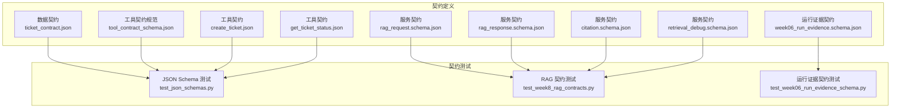
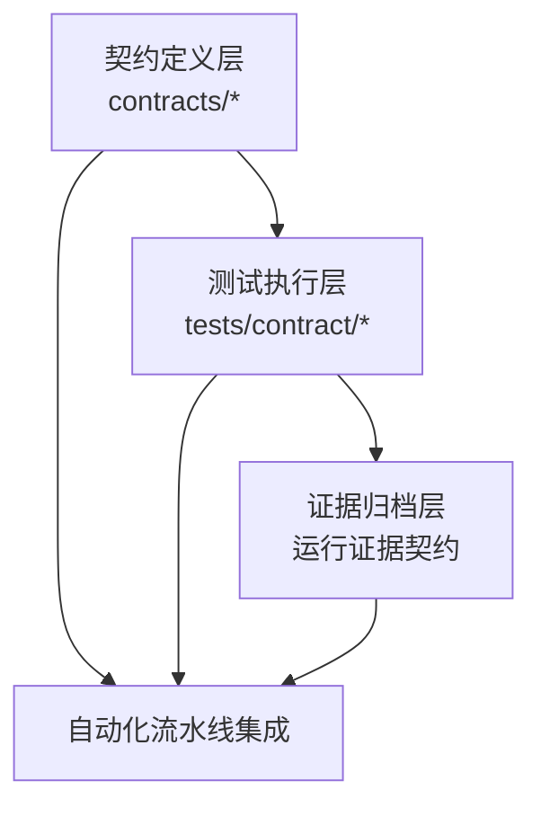
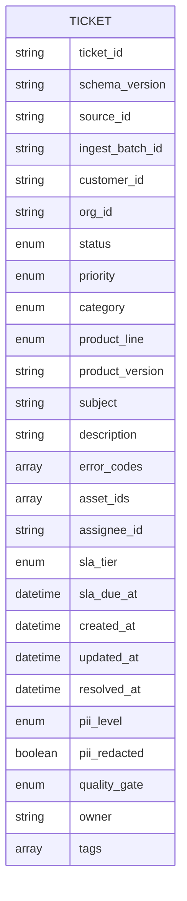
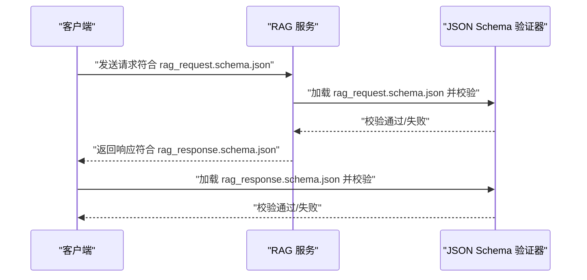
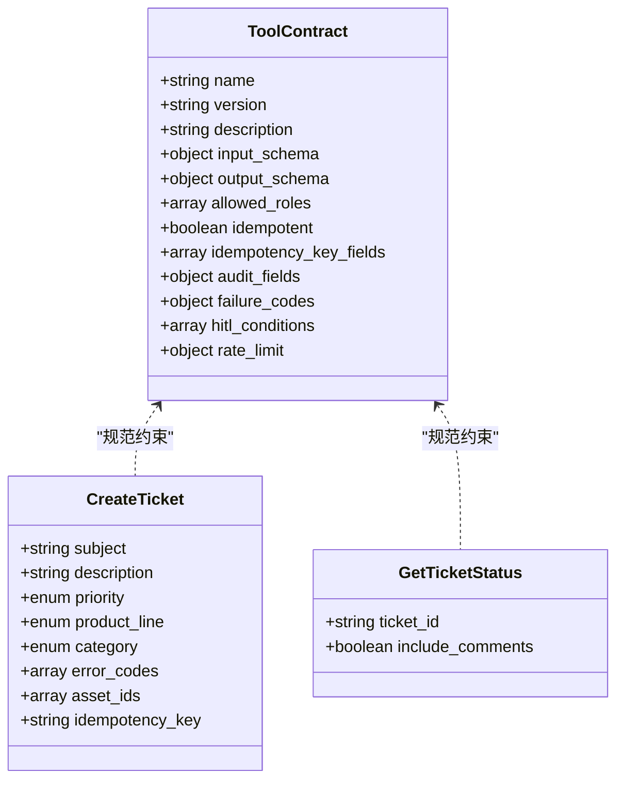
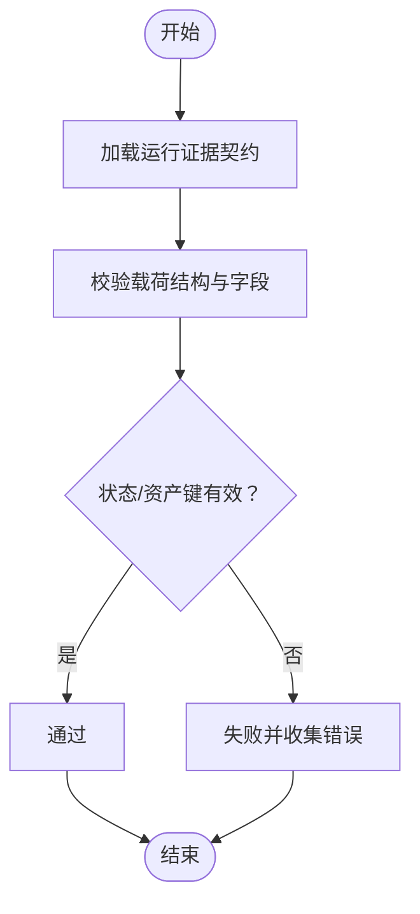
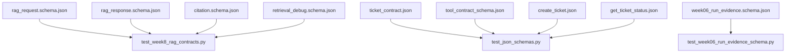

# 契约测试系统

<cite>
**本文引用的文件**
- [contracts/data/ticket_contract.json](file://contracts/data/ticket_contract.json)
- [contracts/service/rag_request.schema.json](file://contracts/service/rag_request.schema.json)
- [contracts/service/rag_response.schema.json](file://contracts/service/rag_response.schema.json)
- [contracts/service/citation.schema.json](file://contracts/service/citation.schema.json)
- [contracts/service/retrieval_debug.schema.json](file://contracts/service/retrieval_debug.schema.json)
- [contracts/tools/tool_contract_schema.json](file://contracts/tools/tool_contract_schema.json)
- [contracts/tools/tools/create_ticket.json](file://contracts/tools/tools/create_ticket.json)
- [contracts/tools/tools/get_ticket_status.json](file://contracts/tools/tools/get_ticket_status.json)
- [contracts/run_evidence/week06_run_evidence.schema.json](file://contracts/run_evidence/week06_run_evidence.schema.json)
- [tests/contract/test_json_schemas.py](file://tests/contract/test_json_schemas.py)
- [tests/contract/test_week8_rag_contracts.py](file://tests/contract/test_week8_rag_contracts.py)
- [tests/contract/test_week06_run_evidence_schema.py](file://tests/contract/test_week06_run_evidence_schema.py)
- [tests/contract/fixtures/week08/rag_request.valid.json](file://tests/contract/fixtures/week08/rag_request.valid.json)
- [tests/contract/fixtures/week08/rag_response.valid.json](file://tests/contract/fixtures/week08/rag_response.valid.json)
- [tests/contract/fixtures/week08/rag_response.no_answer.json](file://tests/contract/fixtures/week08/rag_response.no_answer.json)
</cite>

## 目录
1. [引言](#引言)
2. [项目结构](#项目结构)
3. [核心组件](#核心组件)
4. [架构总览](#架构总览)
5. [详细组件分析](#详细组件分析)
6. [依赖分析](#依赖分析)
7. [性能考虑](#性能考虑)
8. [故障排查指南](#故障排查指南)
9. [结论](#结论)
10. [附录](#附录)

## 引言
本文件系统化梳理 OmniSupport Copilot 的契约测试体系，围绕数据契约、接口契约与行为契约三大维度，结合 JSON Schema 契约测试、RAG 响应契约测试以及工单管理契约测试，构建从“结构—语义—行为”的全链路质量保障机制。文档同时给出版本管理策略、自动化执行流程、错误诊断与修复建议，帮助研发与运营团队高效落地契约测试。

## 项目结构
契约测试相关资产主要分布在 contracts 与 tests/contract 两个目录：
- contracts/data：数据层契约（如工单）
- contracts/service：服务层契约（RAG 请求/响应、引用、检索调试）
- contracts/tools：工具层契约（工具清单与工具契约规范）
- contracts/run_evidence：运行证据契约（周度交付物）
- tests/contract：契约测试用例与示例夹具

图表来源
- [contracts/data/ticket_contract.json:1-125](file://contracts/data/ticket_contract.json#L1-L125)
- [contracts/service/rag_request.schema.json:1-23](file://contracts/service/rag_request.schema.json#L1-L23)
- [contracts/service/rag_response.schema.json:1-58](file://contracts/service/rag_response.schema.json#L1-L58)
- [contracts/service/citation.schema.json:1-24](file://contracts/service/citation.schema.json#L1-L24)
- [contracts/service/retrieval_debug.schema.json:1-35](file://contracts/service/retrieval_debug.schema.json#L1-L35)
- [contracts/tools/tool_contract_schema.json:1-93](file://contracts/tools/tool_contract_schema.json#L1-L93)
- [contracts/tools/tools/create_ticket.json:1-95](file://contracts/tools/tools/create_ticket.json#L1-L95)
- [contracts/tools/tools/get_ticket_status.json:1-67](file://contracts/tools/tools/get_ticket_status.json#L1-L67)
- [contracts/run_evidence/week06_run_evidence.schema.json:1-137](file://contracts/run_evidence/week06_run_evidence.schema.json#L1-L137)
- [tests/contract/test_json_schemas.py:1-131](file://tests/contract/test_json_schemas.py#L1-L131)
- [tests/contract/test_week8_rag_contracts.py:1-64](file://tests/contract/test_week8_rag_contracts.py#L1-L64)
- [tests/contract/test_week06_run_evidence_schema.py:1-75](file://tests/contract/test_week06_run_evidence_schema.py#L1-L75)

章节来源
- [contracts/data/ticket_contract.json:1-125](file://contracts/data/ticket_contract.json#L1-L125)
- [contracts/service/rag_request.schema.json:1-23](file://contracts/service/rag_request.schema.json#L1-L23)
- [contracts/service/rag_response.schema.json:1-58](file://contracts/service/rag_response.schema.json#L1-L58)
- [contracts/service/citation.schema.json:1-24](file://contracts/service/citation.schema.json#L1-L24)
- [contracts/service/retrieval_debug.schema.json:1-35](file://contracts/service/retrieval_debug.schema.json#L1-L35)
- [contracts/tools/tool_contract_schema.json:1-93](file://contracts/tools/tool_contract_schema.json#L1-L93)
- [contracts/tools/tools/create_ticket.json:1-95](file://contracts/tools/tools/create_ticket.json#L1-L95)
- [contracts/tools/tools/get_ticket_status.json:1-67](file://contracts/tools/tools/get_ticket_status.json#L1-L67)
- [contracts/run_evidence/week06_run_evidence.schema.json:1-137](file://contracts/run_evidence/week06_run_evidence.schema.json#L1-L137)
- [tests/contract/test_json_schemas.py:1-131](file://tests/contract/test_json_schemas.py#L1-L131)
- [tests/contract/test_week8_rag_contracts.py:1-64](file://tests/contract/test_week8_rag_contracts.py#L1-L64)
- [tests/contract/test_week06_run_evidence_schema.py:1-75](file://tests/contract/test_week06_run_evidence_schema.py#L1-L75)

## 核心组件
- 数据契约：以 JSON Schema 定义数据结构与约束，确保数据一致性与可演进性。例如工单契约对字段集合、枚举值、时间格式、正则表达式、最大长度等进行严格约束。
- 接口契约：以 JSON Schema 定义请求/响应结构，支持 $ref 引用子模式，保证跨模块契约复用与一致性。
- 行为契约：通过工具契约规范定义工具的输入输出、角色授权、幂等性、审计字段、失败码与人工介入条件等，确保工具调用的安全与可追溯。
- 运行证据契约：定义周度交付物的结构与状态机，支撑下游决策与合规审计。

章节来源
- [contracts/data/ticket_contract.json:1-125](file://contracts/data/ticket_contract.json#L1-L125)
- [contracts/service/rag_request.schema.json:1-23](file://contracts/service/rag_request.schema.json#L1-L23)
- [contracts/service/rag_response.schema.json:1-58](file://contracts/service/rag_response.schema.json#L1-L58)
- [contracts/tools/tool_contract_schema.json:1-93](file://contracts/tools/tool_contract_schema.json#L1-L93)
- [contracts/run_evidence/week06_run_evidence.schema.json:1-137](file://contracts/run_evidence/week06_run_evidence.schema.json#L1-L137)

## 架构总览
契约测试系统由“契约定义—测试执行—证据归档”三层组成：
- 契约定义层：集中于 contracts 目录，采用 JSON Schema 与工具契约 JSON 组合，覆盖数据、服务与工具三类契约。
- 测试执行层：tests/contract 下的 pytest 用例，负责加载契约与夹具，执行结构与示例验证。
- 证据归档层：运行证据契约用于记录每次执行的状态、原因码与下游决策，形成可回溯的证据链。

图表来源
- [contracts/data/ticket_contract.json:1-125](file://contracts/data/ticket_contract.json#L1-L125)
- [contracts/service/rag_request.schema.json:1-23](file://contracts/service/rag_request.schema.json#L1-L23)
- [contracts/service/rag_response.schema.json:1-58](file://contracts/service/rag_response.schema.json#L1-L58)
- [contracts/tools/tool_contract_schema.json:1-93](file://contracts/tools/tool_contract_schema.json#L1-L93)
- [contracts/run_evidence/week06_run_evidence.schema.json:1-137](file://contracts/run_evidence/week06_run_evidence.schema.json#L1-L137)
- [tests/contract/test_json_schemas.py:1-131](file://tests/contract/test_json_schemas.py#L1-L131)
- [tests/contract/test_week8_rag_contracts.py:1-64](file://tests/contract/test_week8_rag_contracts.py#L1-L64)
- [tests/contract/test_week06_run_evidence_schema.py:1-75](file://tests/contract/test_week06_run_evidence_schema.py#L1-L75)

## 详细组件分析

### 数据契约：工单数据契约
- 字段完整性：必需字段包括标识、版本、来源、批次、客户、状态、优先级、产品线、创建时间、PII 等，确保主键唯一性与业务语义完备。
- 类型与约束：字符串长度限制、日期时间格式、枚举集合、数组项类型、可空字段等，统一约束提升解析与存储稳定性。
- 可演进性：通过 schema_version 与 const 版本字段，配合 additionalProperties=false，避免无意扩展导致的歧义。

图表来源
- [contracts/data/ticket_contract.json:1-125](file://contracts/data/ticket_contract.json#L1-L125)

章节来源
- [contracts/data/ticket_contract.json:1-125](file://contracts/data/ticket_contract.json#L1-L125)

### 接口契约：RAG 请求与响应契约
- 请求契约：限定问题长度、可选过滤条件（产品线、角色、可见性、授权等级、状态、质量状态）、检索参数（top_k、索引/数据/提示发布号）与调试开关。
- 响应契约：要求答案、引用列表、证据 ID 列表、置信度、弃答原因、发布号与追踪 ID；引用与检索上下文使用 $ref 复用子模式；检索调试信息可为空或按调试模式展开。
- 引用与调试：引用模式定义证据块元信息，调试模式支持向量/全文/混合排序与重排策略，便于可观测性与回归定位。

图表来源
- [contracts/service/rag_request.schema.json:1-23](file://contracts/service/rag_request.schema.json#L1-L23)
- [contracts/service/rag_response.schema.json:1-58](file://contracts/service/rag_response.schema.json#L1-L58)
- [contracts/service/citation.schema.json:1-24](file://contracts/service/citation.schema.json#L1-L24)
- [contracts/service/retrieval_debug.schema.json:1-35](file://contracts/service/retrieval_debug.schema.json#L1-L35)
- [tests/contract/test_week8_rag_contracts.py:1-64](file://tests/contract/test_week8_rag_contracts.py#L1-L64)

章节来源
- [contracts/service/rag_request.schema.json:1-23](file://contracts/service/rag_request.schema.json#L1-L23)
- [contracts/service/rag_response.schema.json:1-58](file://contracts/service/rag_response.schema.json#L1-L58)
- [contracts/service/citation.schema.json:1-24](file://contracts/service/citation.schema.json#L1-L24)
- [contracts/service/retrieval_debug.schema.json:1-35](file://contracts/service/retrieval_debug.schema.json#L1-L35)
- [tests/contract/test_week8_rag_contracts.py:1-64](file://tests/contract/test_week8_rag_contracts.py#L1-L64)

### 工具契约：Agent 工具契约规范与示例
- 规范契约：定义工具名称、版本、描述、输入/输出 JSON Schema、允许角色、幂等性、幂等键字段、审计字段、失败码、人工介入条件与速率限制等。
- 示例工具：创建工单与查询工单状态的工具契约，明确输入参数、输出字段、角色授权、审计与失败码，以及针对高优先级/安全类别的 HITL 条件。

图表来源
- [contracts/tools/tool_contract_schema.json:1-93](file://contracts/tools/tool_contract_schema.json#L1-L93)
- [contracts/tools/tools/create_ticket.json:1-95](file://contracts/tools/tools/create_ticket.json#L1-L95)
- [contracts/tools/tools/get_ticket_status.json:1-67](file://contracts/tools/tools/get_ticket_status.json#L1-L67)

章节来源
- [contracts/tools/tool_contract_schema.json:1-93](file://contracts/tools/tool_contract_schema.json#L1-L93)
- [contracts/tools/tools/create_ticket.json:1-95](file://contracts/tools/tools/create_ticket.json#L1-L95)
- [contracts/tools/tools/get_ticket_status.json:1-67](file://contracts/tools/tools/get_ticket_status.json#L1-L67)

### 运行证据契约：周度交付物
- 结构与状态：定义证据版本、运行 ID、资产键、分区键、状态、起止时间、报告路径、原因码、下游决策等字段，并支持可选依赖不可用场景。
- 校验逻辑：通过测试用例验证合法载荷、非周度资产键拒绝、可选字段的空值处理与下游决策枚举约束。

图表来源
- [contracts/run_evidence/week06_run_evidence.schema.json:1-137](file://contracts/run_evidence/week06_run_evidence.schema.json#L1-L137)
- [tests/contract/test_week06_run_evidence_schema.py:1-75](file://tests/contract/test_week06_run_evidence_schema.py#L1-L75)

章节来源
- [contracts/run_evidence/week06_run_evidence.schema.json:1-137](file://contracts/run_evidence/week06_run_evidence.schema.json#L1-L137)
- [tests/contract/test_week06_run_evidence_schema.py:1-75](file://tests/contract/test_week06_run_evidence_schema.py#L1-L75)

## 依赖分析
- 内部依赖：RAG 响应契约通过 $ref 引用引用与检索调试子模式；工具契约通过 JSON Schema 描述输入/输出结构；运行证据契约独立完整。
- 测试依赖：契约测试用例直接依赖对应契约文件与夹具；RAG 测试通过 RefResolver 注入子模式；运行证据测试构造合法/非法载荷进行正反向验证。

图表来源
- [tests/contract/test_week8_rag_contracts.py:1-64](file://tests/contract/test_week8_rag_contracts.py#L1-L64)
- [tests/contract/test_json_schemas.py:1-131](file://tests/contract/test_json_schemas.py#L1-L131)
- [tests/contract/test_week06_run_evidence_schema.py:1-75](file://tests/contract/test_week06_run_evidence_schema.py#L1-L75)

章节来源
- [tests/contract/test_week8_rag_contracts.py:1-64](file://tests/contract/test_week8_rag_contracts.py#L1-L64)
- [tests/contract/test_json_schemas.py:1-131](file://tests/contract/test_json_schemas.py#L1-L131)
- [tests/contract/test_week06_run_evidence_schema.py:1-75](file://tests/contract/test_week06_run_evidence_schema.py#L1-L75)

## 性能考虑
- 验证器选择：使用 Draft202012Validator，兼顾标准兼容与性能；对大型响应（如检索上下文数组）建议分批处理或流式校验。
- 子模式缓存：通过 RefResolver 注入子模式，避免重复加载，降低 IO 开销。
- 字段裁剪：在不影响业务的前提下，尽量缩小必填字段范围与数组规模，减少验证成本。
- 并发执行：将不同契约的测试用例并行化，缩短流水线时延。

## 故障排查指南
- JSON Schema 结构错误
  - 现象：校验抛出 ValidationError，提示字段缺失、类型不符或超出范围。
  - 排查：对照契约文件逐项核对 required、type、enum、pattern、format、minimum/maximum、maxLength 等约束。
  - 修复：补齐缺失字段、修正类型或取值范围、调整长度限制。
- 引用模式解析失败
  - 现象：$ref 无法解析或子模式缺失。
  - 排查：确认 RefResolver 注入的子模式键与引用一致，路径正确。
  - 修复：在测试中显式注入子模式字典，确保 resolve 正确。
- 工具契约不完整
  - 现象：缺少 allowed_roles、audit_fields、failure_codes、hitl_conditions 等关键字段。
  - 排查：使用契约测试用例中的断言定位缺失字段。
  - 修复：补充必需字段并完善审计与失败码映射。
- 运行证据载荷非法
  - 现象：资产键不在周度前缀、状态/下游决策枚举不匹配、时间格式错误。
  - 排查：构造最小可复现载荷，逐步剔除字段定位问题。
  - 修复：修正资产键前缀、枚举值与时间格式，确保必填字段齐全。

章节来源
- [tests/contract/test_week8_rag_contracts.py:1-64](file://tests/contract/test_week8_rag_contracts.py#L1-L64)
- [tests/contract/test_json_schemas.py:1-131](file://tests/contract/test_json_schemas.py#L1-L131)
- [tests/contract/test_week06_run_evidence_schema.py:1-75](file://tests/contract/test_week06_run_evidence_schema.py#L1-L75)

## 结论
本契约测试体系以 JSON Schema 为核心，覆盖数据、接口与工具三类契约，结合运行证据契约，形成从结构到行为的闭环验证。通过规范化的契约定义、严格的测试执行与可追溯的证据归档，显著提升了系统的一致性、可维护性与可审计性。建议持续完善契约版本管理与自动化流水线，确保契约演进过程中的向后兼容与快速回归。

## 附录
- 自动化执行流程
  - 加载契约文件与子模式（如有）
  - 使用 jsonschema.Draft202012Validator 进行结构校验
  - 对示例夹具执行正反向用例，覆盖必填字段、类型、范围与枚举
  - 记录校验结果与错误详情，生成报告
- 错误诊断模板
  - 契约文件路径、字段名、期望类型/取值范围、实际值
  - $ref 解析失败时的子模式键与注入情况
  - 工具契约缺失字段清单与建议补全方案
  - 运行证据非法字段与合规修正建议
- 修复建议清单
  - 补齐 required 字段，修正 type/enum/pattern/format
  - 为工具契约补充 audit_fields、failure_codes、hitl_conditions
  - 修正资产键前缀与下游决策枚举
  - 优化 RefResolver 注入，确保子模式可用