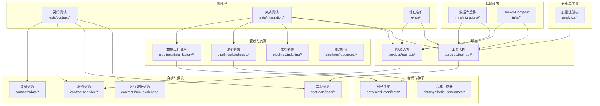
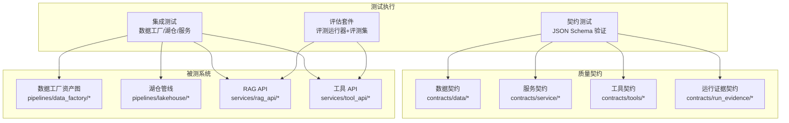
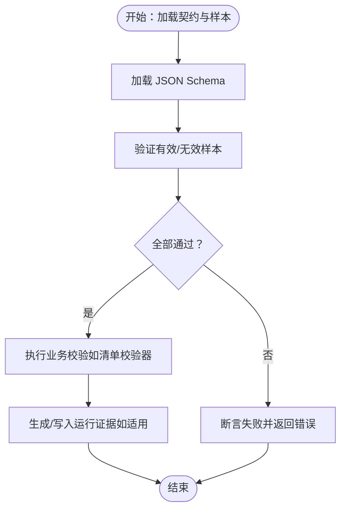
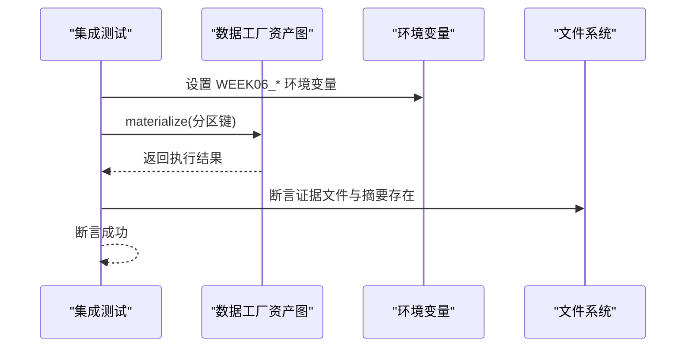
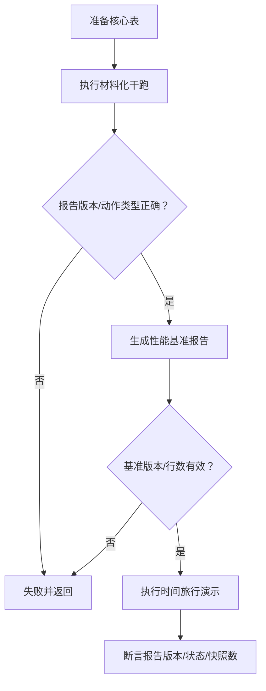
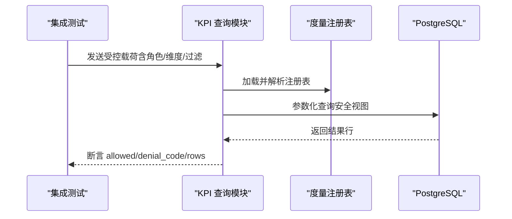
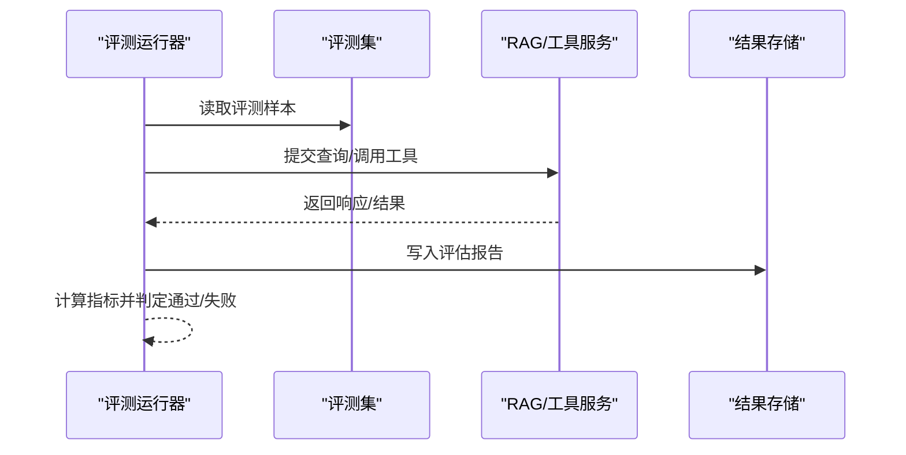
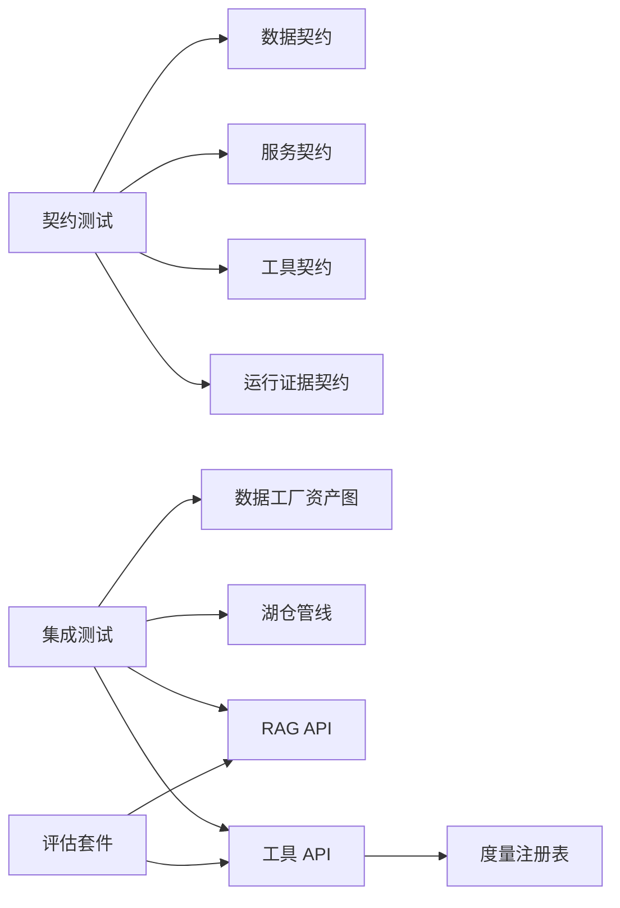

# 测试与质量保证

<cite>
**本文引用的文件**
- [tests/contract/test_week02_gate.py](file://tests/contract/test_week02_gate.py)
- [tests/contract/test_week05_metric_contracts.py](file://tests/contract/test_week05_metric_contracts.py)
- [tests/contract/test_week06_run_evidence_schema.py](file://tests/contract/test_week06_run_evidence_schema.py)
- [tests/contract/test_week4_iceberg_schema_contract.py](file://tests/contract/test_week4_iceberg_schema_contract.py)
- [tests/contract/test_week8_rag_contracts.py](file://tests/contract/test_week8_rag_contracts.py)
- [tests/integration/test_week05_kpi_query_tool.py](file://tests/integration/test_week05_kpi_query_tool.py)
- [tests/integration/test_week06_asset_graph_smoke.py](file://tests/integration/test_week06_asset_graph_smoke.py)
- [tests/integration/test_week06_backfill_plan.py](file://tests/integration/test_week06_backfill_plan.py)
- [tests/integration/test_week06_asset_checks.py](file://tests/integration/test_week06_asset_checks.py)
- [tests/integration/test_week06_definitions_loadable.py](file://tests/integration/test_week06_definitions_loadable.py)
- [tests/integration/test_week06_run_evidence_generation.py](file://tests/integration/test_week06_run_evidence_generation.py)
- [tests/integration/test_week05_metric_registry.py](file://tests/integration/test_week05_metric_registry.py)
- [tests/integration/test_week4_catalog_smoke.py](file://tests/integration/test_week4_catalog_smoke.py)
- [tests/integration/test_week4_lakehouse_smoke.py](file://tests/integration/test_week4_lakehouse_smoke.py)
- [tests/integration/test_week4_perf_baseline.py](file://tests/integration/test_week4_perf_baseline.py)
- [tests/integration/test_week4_time_travel.py](file://tests/integration/test_week4_time_travel.py)
- [evals/harness/eval_runner.py](file://evals/harness/eval_runner.py)
- [evals/sets/workspace_qa_v1.jsonl](file://evals/sets/workspace_qa_v1.jsonl)
- [evals/week08/rag_smoke_cases.yml](file://evals/week08/rag_smoke_cases.yml)
- [evals/week08/run_smoke_eval.py](file://evals/week08/run_smoke_eval.py)
- [pipelines/data_factory/assets.py](file://pipelines/data_factory/assets.py)
- [pipelines/data_factory/checks.py](file://pipelines/data_factory/checks.py)
- [pipelines/data_factory/evidence.py](file://pipelines/data_factory/evidence.py)
- [pipelines/data_factory/backfill_plan.py](file://pipelines/data_factory/backfill_plan.py)
- [pipelines/resources/config.py](file://pipelines/resources/config.py)
- [pipelines/lakehouse/catalog.py](file://pipelines/lakehouse/catalog.py)
- [pipelines/lakehouse/materialize.py](file://pipelines/lakehouse/materialize.py)
- [pipelines/lakehouse/perf_baseline.py](file://pipelines/lakehouse/perf_baseline.py)
- [pipelines/lakehouse/demo_time_travel.py](file://pipelines/lakehouse/demo_time_travel.py)
- [pipelines/lakehouse/iceberg_schemas.py](file://pipelines/lakehouse/iceberg_schemas.py)
- [pipelines/lakehouse/settings.py](file://pipelines/lakehouse/settings.py)
- [analytics/scripts/validate_metric_registry.py](file://analytics/scripts/validate_metric_registry.py)
- [analytics/metric_registry_v1.yml](file://analytics/metric_registry_v1.yml)
- [services/tool_api/app/kpi_query.py](file://services/tool_api/app/kpi_query.py)
- [services/rag_api/app/main.py](file://services/rag_api/app/main.py)
- [services/rag_api/app/retrieval.py](file://services/rag_api/app/retrieval.py)
- [services/rag_api/app/routers/query.py](file://services/rag_api/app/routers/query.py)
- [services/rag_api/app/routers/rag.py](file://services/rag_api/app/routers/rag.py)
- [services/rag_api/app/routers/admin.py](file://services/rag_api/app/routers/admin.py)
- [services/rag_api/app/routers/health.py](file://services/rag_api/app/routers/health.py)
- [services/tool_api/app/main.py](file://services/tool_api/app/main.py)
- [services/tool_api/app/routers/kpis.py](file://services/tool_api/app/routers/kpis.py)
- [services/tool_api/app/routers/tickets.py](file://services/tool_api/app/routers/tickets.py)
- [services/tool_api/app/routers/health.py](file://services/tool_api/app/routers/health.py)
- [contracts/service/rag_request.schema.json](file://contracts/service/rag_request.schema.json)
- [contracts/service/rag_response.schema.json](file://contracts/service/rag_response.schema.json)
- [contracts/service/citation.schema.json](file://contracts/service/citation.schema.json)
- [contracts/service/retrieval_debug.schema.json](file://contracts/service/retrieval_debug.schema.json)
- [contracts/tools/tools/query_support_kpis_v1.json](file://contracts/tools/tools/query_support_kpis_v1.json)
- [contracts/tools/tool_contract_schema.json](file://contracts/tools/tool_contract_schema.json)
- [contracts/run_evidence/week06_run_evidence.schema.json](file://contracts/run_evidence/week06_run_evidence.schema.json)
- [contracts/data/audio_asset_contract.json](file://contracts/data/audio_asset_contract.json)
- [contracts/data/doc_asset_contract.json](file://contracts/data/doc_asset_contract.json)
- [contracts/data/ticket_contract.json](file://contracts/data/ticket_contract.json)
- [contracts/data/video_asset_contract.json](file://contracts/data/video_asset_contract.json)
- [data/seed_manifests/source_manifest_schema.json](file://data/seed_manifests/source_manifest_schema.json)
- [data/seed_manifests/manifest_week02_practice_v1.json](file://data/seed_manifests/manifest_week02_practice_v1.json)
- [data/seed_manifests/manifest_edge_gateway_pdf_v1.json](file://data/seed_manifests/manifest_edge_gateway_pdf_v1.json)
- [data/seed_manifests/manifest_tickets_synthetic_v1.json](file://data/seed_manifests/manifest_tickets_synthetic_v1.json)
- [data/seed_manifests/manifest_workspace_helpcenter_v1.json](file://data/seed_manifests/manifest_workspace_helpcenter_v1.json)
- [pipelines/ingestion/seed_loader.py](file://pipelines/ingestion/seed_loader.py)
- [pipelines/ingestion/doc_ingest.py](file://pipelines/ingestion/doc_ingest.py)
- [pipelines/ingestion/ticket_ingest.py](file://pipelines/ingestion/ticket_ingest.py)
- [pipelines/parse_normalize/doc_parser.py](file://pipelines/parse_normalize/doc_parser.py)
- [pipelines/indexing/embedder.py](file://pipelines/indexing/embedder.py)
- [pipelines/indexing/assets.py](file://pipelines/indexing/assets.py)
- [pipelines/indexing/index_manifest.py](file://pipelines/indexing/index_manifest.py)
- [pipelines/indexing/reporting.py](file://pipelines/indexing/reporting.py)
- [pipelines/definitions.py](file://pipelines/definitions.py)
- [infra/migrations/001_init.sql](file://infra/migrations/001_init.sql)
- [infra/migrations/002_eval_tables.sql](file://infra/migrations/002_eval_tables.sql)
- [infra/migrations/003_week08_index_rag.sql](file://infra/migrations/003_week08_index_rag.sql)
- [infra/docker-compose.yml](file://infra/docker-compose.yml)
- [infra/devbox.Dockerfile](file://infra/devbox.Dockerfile)
- [pyproject.toml](file://pyproject.toml)
</cite>

## 目录
1. [引言](#引言)
2. [项目结构](#项目结构)
3. [核心组件](#核心组件)
4. [架构总览](#架构总览)
5. [详细组件分析](#详细组件分析)
6. [依赖分析](#依赖分析)
7. [性能考虑](#性能考虑)
8. [故障排查指南](#故障排查指南)
9. [结论](#结论)
10. [附录](#附录)

## 引言
本文件系统化梳理 OmniSupport Copilot 的测试与质量保证体系，覆盖契约测试、集成测试、评估套件与回归测试策略，结合测试金字塔理念，从单元级验证逐步扩展到端到端验证。文档同时涵盖性能基准、负载与压力测试思路，以及测试自动化、持续集成与测试数据管理的实践建议。

## 项目结构
测试与质量保证相关目录与文件分布如下：
- 合约测试：tests/contract 下按周次与主题组织，验证数据契约、服务契约与发布契约
- 集成测试：tests/integration 下围绕数据管线、湖仓与服务进行端到端验证
- 评估套件：evals 下包含评测运行器、评测集与周度烟雾测试
- 数据与种子：data 下包含种子清单与合成生成器
- 合约定义：contracts 下包含数据、服务、工具与运行证据的 JSON Schema
- 管线与资源：pipelines 下为数据工厂、湖仓、索引与资源配置
- 服务：services 下为 RAG API 与工具 API 的路由与业务逻辑
- 基础设施：infra 下为数据库迁移、Docker 与环境配置
- 分析与度量：analytics 下包含度量注册表与校验脚本

图表来源
- [tests/contract/test_week02_gate.py:1-148](file://tests/contract/test_week02_gate.py#L1-L148)
- [tests/integration/test_week06_asset_graph_smoke.py:1-26](file://tests/integration/test_week06_asset_graph_smoke.py#L1-L26)
- [evals/harness/eval_runner.py](file://evals/harness/eval_runner.py)
- [contracts/service/rag_request.schema.json](file://contracts/service/rag_request.schema.json)
- [contracts/tools/tools/query_support_kpis_v1.json](file://contracts/tools/tools/query_support_kpis_v1.json)
- [data/seed_manifests/manifest_week02_practice_v1.json](file://data/seed_manifests/manifest_week02_practice_v1.json)
- [pipelines/data_factory/assets.py](file://pipelines/data_factory/assets.py)
- [pipelines/lakehouse/catalog.py](file://pipelines/lakehouse/catalog.py)
- [services/rag_api/app/main.py](file://services/rag_api/app/main.py)
- [services/tool_api/app/main.py](file://services/tool_api/app/main.py)
- [analytics/metric_registry_v1.yml](file://analytics/metric_registry_v1.yml)
- [infra/docker-compose.yml](file://infra/docker-compose.yml)

章节来源
- [tests/contract/test_week02_gate.py:1-148](file://tests/contract/test_week02_gate.py#L1-L148)
- [tests/integration/test_week06_asset_graph_smoke.py:1-26](file://tests/integration/test_week06_asset_graph_smoke.py#L1-L26)
- [evals/harness/eval_runner.py](file://evals/harness/eval_runner.py)
- [contracts/service/rag_request.schema.json](file://contracts/service/rag_request.schema.json)
- [contracts/tools/tools/query_support_kpis_v1.json](file://contracts/tools/tools/query_support_kpis_v1.json)
- [data/seed_manifests/manifest_week02_practice_v1.json](file://data/seed_manifests/manifest_week02_practice_v1.json)
- [pipelines/data_factory/assets.py](file://pipelines/data_factory/assets.py)
- [pipelines/lakehouse/catalog.py](file://pipelines/lakehouse/catalog.py)
- [services/rag_api/app/main.py](file://services/rag_api/app/main.py)
- [services/tool_api/app/main.py](file://services/tool_api/app/main.py)
- [analytics/metric_registry_v1.yml](file://analytics/metric_registry_v1.yml)
- [infra/docker-compose.yml](file://infra/docker-compose.yml)

## 核心组件
- 契约测试：以 JSON Schema 驱动，覆盖数据记录、工具接口、服务请求/响应与运行证据格式，确保跨模块边界的一致性与可演进性
- 集成测试：围绕数据工厂资产图、湖仓材料化、索引构建与服务端点进行端到端验证，包含干跑与产出检查
- 评估套件：提供评测运行器、评测集与周度烟雾测试，支持回归门禁与质量度量
- 性能与稳定性：通过湖仓基准报告、时间旅行演示与导入干跑，评估核心路径性能与可恢复性
- 自动化与数据管理：通过环境变量驱动的干跑模式、回填计划与证据生成，支撑 CI/CD 与灰度发布

章节来源
- [tests/contract/test_week02_gate.py:1-148](file://tests/contract/test_week02_gate.py#L1-L148)
- [tests/integration/test_week06_asset_graph_smoke.py:1-26](file://tests/integration/test_week06_asset_graph_smoke.py#L1-L26)
- [evals/harness/eval_runner.py](file://evals/harness/eval_runner.py)
- [evals/week08/rag_smoke_cases.yml](file://evals/week08/rag_smoke_cases.yml)
- [evals/week08/run_smoke_eval.py](file://evals/week08/run_smoke_eval.py)
- [pipelines/lakehouse/perf_baseline.py](file://pipelines/lakehouse/perf_baseline.py)
- [pipelines/lakehouse/demo_time_travel.py](file://pipelines/lakehouse/demo_time_travel.py)

## 架构总览
下图展示测试与质量保证在系统中的位置与交互关系，包括契约约束、集成验证与评估回归的闭环。

图表来源
- [tests/contract/test_week02_gate.py:1-148](file://tests/contract/test_week02_gate.py#L1-L148)
- [tests/integration/test_week06_asset_graph_smoke.py:1-26](file://tests/integration/test_week06_asset_graph_smoke.py#L1-L26)
- [evals/harness/eval_runner.py](file://evals/harness/eval_runner.py)
- [contracts/service/rag_request.schema.json](file://contracts/service/rag_request.schema.json)
- [contracts/tools/tools/query_support_kpis_v1.json](file://contracts/tools/tools/query_support_kpis_v1.json)
- [pipelines/data_factory/assets.py](file://pipelines/data_factory/assets.py)
- [pipelines/lakehouse/catalog.py](file://pipelines/lakehouse/catalog.py)
- [services/rag_api/app/main.py](file://services/rag_api/app/main.py)
- [services/tool_api/app/main.py](file://services/tool_api/app/main.py)

## 详细组件分析

### 契约测试：数据、服务与运行证据
- 数据契约（Week02）：验证多模态记录与种子清单的当前版本契约，确保无效记录被拒绝，有效记录通过校验；同时验证清单校验器对游标字段缺失的早期拒绝行为
- 工具契约（Week05）：校验查询 KPI 工具的输入模式与安全限制，拒绝包含不受信任字段的载荷
- 运行证据契约（Week06）：校验运行证据报告的 JSON Schema，接受成功状态与“不可用”等变体，拒绝非目标资产键
- 湖仓契约（Week04）：校验环境必需键、核心表模式存在性与关键字段（时间戳、批次标识等）
- RAG 契约（Week08）：校验请求/响应模式与引用解析，要求响应包含引用与发布 ID；无答案情形需具备弃权原因且无证据

图表来源
- [tests/contract/test_week02_gate.py:53-77](file://tests/contract/test_week02_gate.py#L53-L77)
- [tests/contract/test_week05_metric_contracts.py:22-38](file://tests/contract/test_week05_metric_contracts.py#L22-L38)
- [tests/contract/test_week6_run_evidence_schema.py:47-64](file://tests/contract/test_week06_run_evidence_schema.py#L47-L64)
- [tests/contract/test_week4_iceberg_schema_contract.py:37-48](file://tests/contract/test_week4_iceberg_schema_contract.py#L37-L48)
- [tests/contract/test_week8_rag_contracts.py:45-64](file://tests/contract/test_week8_rag_contracts.py#L45-L64)

章节来源
- [tests/contract/test_week02_gate.py:1-148](file://tests/contract/test_week02_gate.py#L1-L148)
- [tests/contract/test_week05_metric_contracts.py:1-38](file://tests/contract/test_week05_metric_contracts.py#L1-L38)
- [tests/contract/test_week06_run_evidence_schema.py:1-75](file://tests/contract/test_week06_run_evidence_schema.py#L1-L75)
- [tests/contract/test_week4_iceberg_schema_contract.py:1-53](file://tests/contract/test_week4_iceberg_schema_contract.py#L1-L53)
- [tests/contract/test_week8_rag_contracts.py:1-64](file://tests/contract/test_week8_rag_contracts.py#L1-L64)

### 集成测试：数据工厂与湖仓
- 资产图烟雾测试：通过 Dagster 材料化默认分区，断言成功、证据文件存在与交付摘要生成
- 回填计划：基于环境变量构建回填计划，断言分区键、模式、预期输入计数与动作类型
- 资产检查：运行资产检查集合，断言检查项覆盖核心维度与输出摘要文件存在
- 定义可加载：断言资产键与作业定义存在，资源注册完整
- 运行证据生成：构造运行证据对象并写入文件，断言文件存在与模式版本正确

图表来源
- [tests/integration/test_week06_asset_graph_smoke.py:10-26](file://tests/integration/test_week06_asset_graph_smoke.py#L10-L26)
- [tests/integration/test_week06_backfill_plan.py:9-25](file://tests/integration/test_week06_backfill_plan.py#L9-L25)
- [tests/integration/test_week06_asset_checks.py:9-33](file://tests/integration/test_week06_asset_checks.py#L9-L33)
- [tests/integration/test_week06_definitions_loadable.py:4-21](file://tests/integration/test_week06_definitions_loadable.py#L4-L21)
- [tests/integration/test_week06_run_evidence_generation.py:9-47](file://tests/integration/test_week06_run_evidence_generation.py#L9-L47)

章节来源
- [tests/integration/test_week06_asset_graph_smoke.py:1-26](file://tests/integration/test_week06_asset_graph_smoke.py#L1-L26)
- [tests/integration/test_week06_backfill_plan.py:1-25](file://tests/integration/test_week06_backfill_plan.py#L1-L25)
- [tests/integration/test_week06_asset_checks.py:1-33](file://tests/integration/test_week06_asset_checks.py#L1-L33)
- [tests/integration/test_week06_definitions_loadable.py:1-21](file://tests/integration/test_week06_definitions_loadable.py#L1-L21)
- [tests/integration/test_week06_run_evidence_generation.py:1-47](file://tests/integration/test_week06_run_evidence_generation.py#L1-L47)

### 集成测试：湖仓与性能
- Catalog 烟雾测试：确保核心表存在与存储桶配置正确
- 湖仓材料化干跑：断言报告版本、表集合与动作类型
- 性能基准：针对银表生成基准报告，断言版本与行数
- 时间旅行演示：断言报告版本、状态与快照数量

图表来源
- [tests/integration/test_week4_catalog_smoke.py:4-14](file://tests/integration/test_week4_catalog_smoke.py#L4-L14)
- [tests/integration/test_week4_lakehouse_smoke.py:6-19](file://tests/integration/test_week4_lakehouse_smoke.py#L6-L19)
- [tests/integration/test_week4_perf_baseline.py:4-16](file://tests/integration/test_week4_perf_baseline.py#L4-L16)
- [tests/integration/test_week4_time_travel.py:4-16](file://tests/integration/test_week04_time_travel.py#L4-L16)

章节来源
- [tests/integration/test_week4_catalog_smoke.py:1-14](file://tests/integration/test_week4_catalog_smoke.py#L1-L14)
- [tests/integration/test_week4_lakehouse_smoke.py:1-19](file://tests/integration/test_week4_lakehouse_smoke.py#L1-L19)
- [tests/integration/test_week4_perf_baseline.py:1-16](file://tests/integration/test_week4_perf_baseline.py#L1-L16)
- [tests/integration/test_week4_time_travel.py:1-16](file://tests/integration/test_week4_time_travel.py#L1-L16)

### 集成测试：工具 API 与度量注册表
- KPI 查询工具：拒绝未知指标与不安全维度，参数化安全视图查询，断言连接、参数与关闭行为
- 度量注册表：加载并校验注册表，断言有效、度量数量与安全视图列存在

图表来源
- [tests/integration/test_week05_kpi_query_tool.py:33-109](file://tests/integration/test_week05_kpi_query_tool.py#L33-L109)
- [tests/integration/test_week05_metric_registry.py:8-15](file://tests/integration/test_week05_metric_registry.py#L8-L15)

章节来源
- [tests/integration/test_week05_kpi_query_tool.py:1-109](file://tests/integration/test_week05_kpi_query_tool.py#L1-L109)
- [tests/integration/test_week05_metric_registry.py:1-15](file://tests/integration/test_week05_metric_registry.py#L1-L15)

### 评估套件：评测运行与回归门禁
- 评测运行器：统一调度评测集，支持并发与结果聚合
- 评测集：包含问答类评测数据，用于 RAG 与工具 API 的质量度量
- 周度烟雾测试：针对特定周次的最小可行路径进行快速验证
- 回归门禁：通过评估结果与阈值控制发布节奏

图表来源
- [evals/harness/eval_runner.py](file://evals/harness/eval_runner.py)
- [evals/sets/workspace_qa_v1.jsonl](file://evals/sets/workspace_qa_v1.jsonl)
- [evals/week08/rag_smoke_cases.yml](file://evals/week08/rag_smoke_cases.yml)
- [evals/week08/run_smoke_eval.py](file://evals/week08/run_smoke_eval.py)

章节来源
- [evals/harness/eval_runner.py](file://evals/harness/eval_runner.py)
- [evals/sets/workspace_qa_v1.jsonl](file://evals/sets/workspace_qa_v1.jsonl)
- [evals/week08/rag_smoke_cases.yml](file://evals/week08/rag_smoke_cases.yml)
- [evals/week08/run_smoke_eval.py](file://evals/week08/run_smoke_eval.py)

## 依赖分析
- 测试与被测系统解耦：测试通过明确的契约与环境变量驱动，避免直接依赖内部实现细节
- 契约驱动的耦合：数据、服务与运行证据契约作为共享规范，降低模块间变更风险
- 管线与服务的集成点：数据工厂资产图、湖仓材料化与服务端点构成主要集成面
- 度量注册表与安全视图：工具 API 严格依赖注册表约束，确保查询安全与一致性

图表来源
- [tests/contract/test_week02_gate.py:1-148](file://tests/contract/test_week02_gate.py#L1-L148)
- [tests/integration/test_week06_asset_graph_smoke.py:1-26](file://tests/integration/test_week06_asset_graph_smoke.py#L1-L26)
- [evals/harness/eval_runner.py](file://evals/harness/eval_runner.py)
- [analytics/metric_registry_v1.yml](file://analytics/metric_registry_v1.yml)

章节来源
- [tests/contract/test_week02_gate.py:1-148](file://tests/contract/test_week02_gate.py#L1-L148)
- [tests/integration/test_week06_asset_graph_smoke.py:1-26](file://tests/integration/test_week06_asset_graph_smoke.py#L1-L26)
- [evals/harness/eval_runner.py](file://evals/harness/eval_runner.py)
- [analytics/metric_registry_v1.yml](file://analytics/metric_registry_v1.yml)

## 性能考虑
- 干跑与基准：通过干跑材料化与性能基准报告，评估核心路径吞吐与延迟
- 时间旅行与回滚：利用时间旅行演示验证快照与回溯能力，保障稳定性
- 索引与嵌入：索引构建与嵌入管线的性能可通过基准与采样数据验证
- 数据工厂分区策略：回填计划与分区键设计直接影响增量处理性能

章节来源
- [tests/integration/test_week4_lakehouse_smoke.py:1-19](file://tests/integration/test_week4_lakehouse_smoke.py#L1-L19)
- [tests/integration/test_week4_perf_baseline.py:1-16](file://tests/integration/test_week4_perf_baseline.py#L1-L16)
- [tests/integration/test_week4_time_travel.py:1-16](file://tests/integration/test_week4_time_travel.py#L1-L16)
- [tests/integration/test_week06_backfill_plan.py:1-25](file://tests/integration/test_week06_backfill_plan.py#L1-L25)
- [pipelines/indexing/embedder.py](file://pipelines/indexing/embedder.py)
- [pipelines/indexing/index_manifest.py](file://pipelines/indexing/index_manifest.py)

## 故障排查指南
- 契约验证失败
  - 检查对应 JSON Schema 是否最新，样本是否符合字段与枚举要求
  - 对于引用型契约，确认引用解析器已正确注入子模式
- 清单与种子问题
  - 校验清单游标字段是否存在，种子清单是否通过模式校验
  - 使用干跑模式定位上游输入与下游产出差异
- 数据工厂与分区
  - 确认分区键与环境变量设置正确，回填计划预期动作与计数符合预期
  - 检查资产图材料化日志与证据文件生成
- 湖仓与性能
  - 核对核心表存在性与存储桶配置，关注基准报告中的行数与动作类型
  - 如性能异常，优先检查分区键与索引状态
- 工具 API 与度量
  - 确认度量注册表加载与校验通过，查询参数映射到安全视图
  - 关注拒绝码与维度/指标合法性

章节来源
- [tests/contract/test_week02_gate.py:85-90](file://tests/contract/test_week02_gate.py#L85-L90)
- [tests/contract/test_week06_run_evidence_schema.py:66-75](file://tests/contract/test_week06_run_evidence_schema.py#L66-L75)
- [tests/integration/test_week06_asset_graph_smoke.py:10-26](file://tests/integration/test_week06_asset_graph_smoke.py#L10-L26)
- [tests/integration/test_week06_backfill_plan.py:16-24](file://tests/integration/test_week06_backfill_plan.py#L16-L24)
- [tests/integration/test_week4_perf_baseline.py:12-16](file://tests/integration/test_week4_perf_baseline.py#L12-L16)
- [tests/integration/test_week05_kpi_query_tool.py:34-62](file://tests/integration/test_week05_kpi_query_tool.py#L34-L62)

## 结论
本测试与质量保证体系以契约测试为边界，以集成测试为桥梁，以评估套件为反馈闭环，配合性能与稳定性验证，形成完整的测试金字塔。通过环境变量驱动的干跑与回填计划，系统可在 CI/CD 中稳定地进行灰度与回归验证，确保功能正确性与演进可控性。

## 附录
- 测试自动化与持续集成建议
  - 在 CI 中分层执行：先契约测试，再集成测试，最后评估套件
  - 使用 Docker Compose 统一测试环境，确保依赖一致
  - 将回填计划与证据生成纳入流水线，支持灰度发布与回滚
- 测试数据管理
  - 种子清单与合成生成器用于构造多样化样本
  - 评测集按主题与难度分级，便于回归门禁与趋势追踪
- 扩展测试范围
  - 新增契约时同步更新测试用例与断言
  - 新增管线或服务时补充端到端集成测试与干跑验证
  - 引入性能基线与压力测试模板，定期评估容量与稳定性