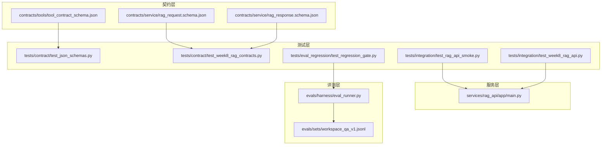
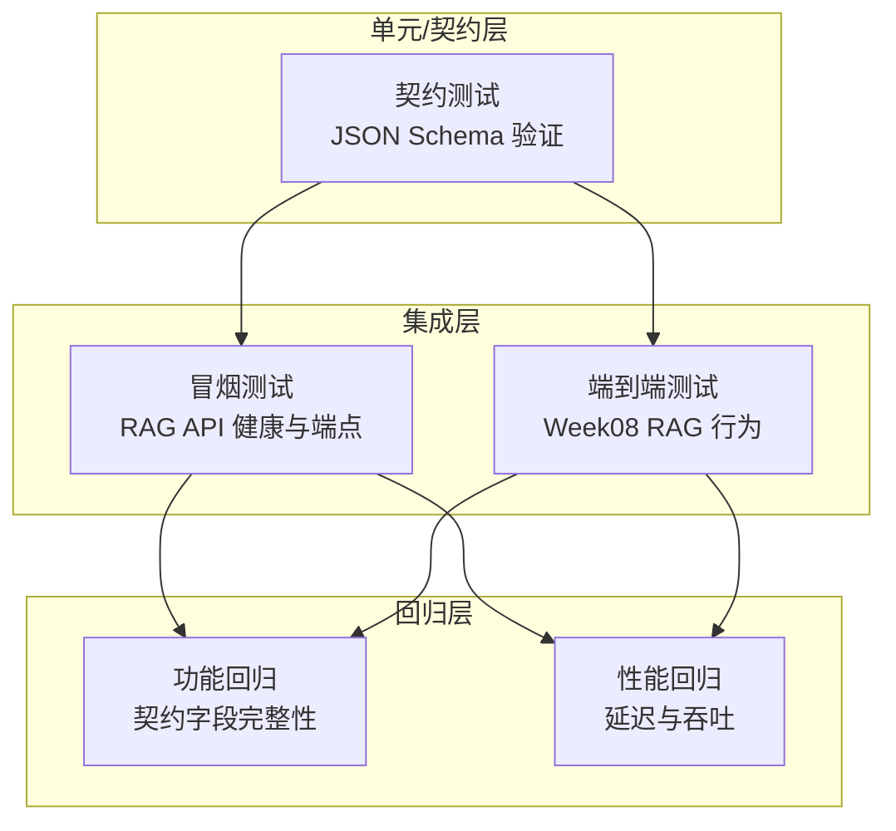
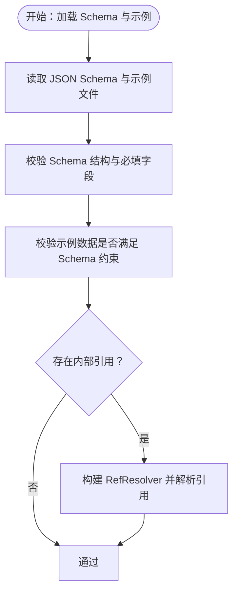
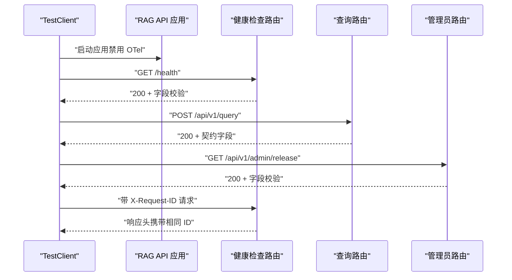
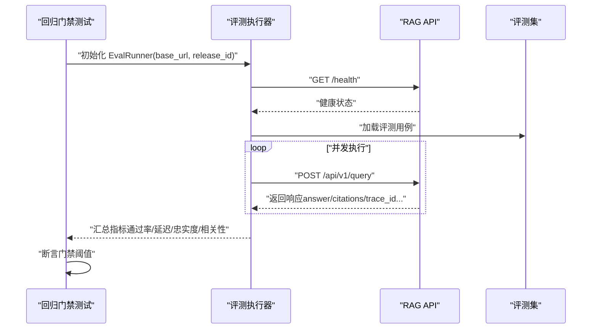
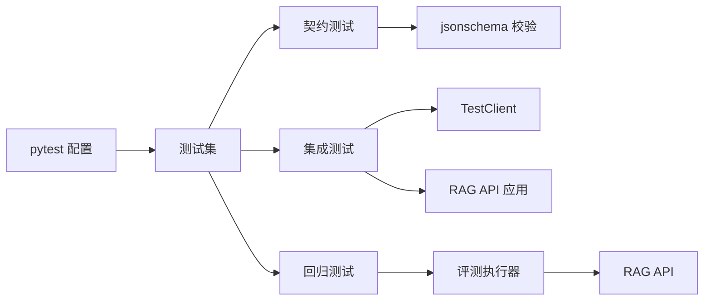

# 测试策略与方法论

<cite>
**本文引用的文件**
- [tests/contract/test_json_schemas.py](file://tests/contract/test_json_schemas.py)
- [tests/contract/test_week8_rag_contracts.py](file://tests/contract/test_week8_rag_contracts.py)
- [contracts/service/rag_request.schema.json](file://contracts/service/rag_request.schema.json)
- [contracts/service/rag_response.schema.json](file://contracts/service/rag_response.schema.json)
- [contracts/tools/tool_contract_schema.json](file://contracts/tools/tool_contract_schema.json)
- [tests/integration/test_rag_api_smoke.py](file://tests/integration/test_rag_api_smoke.py)
- [tests/integration/test_week8_rag_api.py](file://tests/integration/test_week8_rag_api.py)
- [services/rag_api/app/main.py](file://services/rag_api/app/main.py)
- [evals/harness/eval_runner.py](file://evals/harness/eval_runner.py)
- [evals/sets/workspace_qa_v1.jsonl](file://evals/sets/workspace_qa_v1.jsonl)
- [tests/eval_regression/test_regression_gate.py](file://tests/eval_regression/test_regression_gate.py)
- [pyproject.toml](file://pyproject.toml)
- [tests/contract/fixtures/week08/rag_request.valid.json](file://tests/contract/fixtures/week08/rag_request.valid.json)
- [tests/contract/fixtures/week08/rag_response.valid.json](file://tests/contract/fixtures/week08/rag_response.valid.json)
</cite>

## 目录
1. [引言](#引言)
2. [项目结构](#项目结构)
3. [核心组件](#核心组件)
4. [架构总览](#架构总览)
5. [详细组件分析](#详细组件分析)
6. [依赖分析](#依赖分析)
7. [性能考虑](#性能考虑)
8. [故障排除指南](#故障排除指南)
9. [结论](#结论)
10. [附录](#附录)

## 引言
本文件面向 OmniSupport Copilot 的测试体系，系统化阐述测试金字塔分层理念与落地实践，覆盖契约测试（JSON Schema）、集成测试（端到端与冒烟）、回归测试（功能与性能）、以及测试分类与自动化流水线建议。文档以仓库现有测试与契约文件为依据，结合服务端点与评测执行器，给出可操作的方法论与最佳实践。

## 项目结构
围绕测试与契约的关键目录与文件如下：
- contracts：契约定义与示例，包含服务请求/响应、工具契约、发布清单等 JSON Schema
- tests：按层次划分的测试集，包括契约测试、集成测试、回归评测门禁
- services/rag_api：RAG API 服务，提供健康检查与查询端点，供集成测试与回归评测使用
- evals：评测套件与评测集，驱动回归评测门禁
- pyproject.toml：测试框架与依赖配置

图表来源
- [contracts/service/rag_request.schema.json:1-23](file://contracts/service/rag_request.schema.json#L1-L23)
- [contracts/service/rag_response.schema.json:1-58](file://contracts/service/rag_response.schema.json#L1-L58)
- [contracts/tools/tool_contract_schema.json:1-93](file://contracts/tools/tool_contract_schema.json#L1-L93)
- [tests/contract/test_json_schemas.py:1-131](file://tests/contract/test_json_schemas.py#L1-L131)
- [tests/contract/test_week8_rag_contracts.py:1-64](file://tests/contract/test_week8_rag_contracts.py#L1-L64)
- [tests/integration/test_rag_api_smoke.py:1-91](file://tests/integration/test_rag_api_smoke.py#L1-L91)
- [tests/integration/test_week8_rag_api.py:1-47](file://tests/integration/test_week8_rag_api.py#L1-L47)
- [services/rag_api/app/main.py:1-73](file://services/rag_api/app/main.py#L1-L73)
- [evals/harness/eval_runner.py:1-338](file://evals/harness/eval_runner.py#L1-L338)
- [evals/sets/workspace_qa_v1.jsonl:1-13](file://evals/sets/workspace_qa_v1.jsonl#L1-L13)

章节来源
- [pyproject.toml:1-49](file://pyproject.toml#L1-L49)

## 核心组件
- 契约测试：以 JSON Schema 驱动，验证数据结构、必填字段、示例有效性与跨引用解析
- 集成测试：基于 TestClient 对 API 骨架进行冒烟与端到端验证，覆盖健康检查、请求/响应契约字段、中间件行为
- 回归评测：通过评测套件对答案忠实度、相关性、检索精度与延迟进行量化评估，并以门禁阈值控制发布质量
- 测试分类：冒烟测试（快速验证）、功能测试（契约与端到端）、性能测试（延迟与吞吐）、安全测试（鉴权与CORS）

章节来源
- [tests/contract/test_json_schemas.py:1-131](file://tests/contract/test_json_schemas.py#L1-L131)
- [tests/contract/test_week8_rag_contracts.py:1-64](file://tests/contract/test_week8_rag_contracts.py#L1-L64)
- [tests/integration/test_rag_api_smoke.py:1-91](file://tests/integration/test_rag_api_smoke.py#L1-L91)
- [tests/integration/test_week8_rag_api.py:1-47](file://tests/integration/test_week8_rag_api.py#L1-L47)
- [evals/harness/eval_runner.py:1-338](file://evals/harness/eval_runner.py#L1-L338)
- [tests/eval_regression/test_regression_gate.py:1-68](file://tests/eval_regression/test_regression_gate.py#L1-L68)

## 架构总览
下图展示测试金字塔在本项目中的落地：自底向上为契约测试（Schema 验证）、集成测试（冒烟与端到端）、回归评测（功能与性能门禁），形成稳定的质量闸门。

图表来源
- [tests/contract/test_json_schemas.py:1-131](file://tests/contract/test_json_schemas.py#L1-L131)
- [tests/contract/test_week8_rag_contracts.py:1-64](file://tests/contract/test_week8_rag_contracts.py#L1-L64)
- [tests/integration/test_rag_api_smoke.py:1-91](file://tests/integration/test_rag_api_smoke.py#L1-L91)
- [tests/integration/test_week8_rag_api.py:1-47](file://tests/integration/test_week8_rag_api.py#L1-L47)
- [evals/harness/eval_runner.py:1-338](file://evals/harness/eval_runner.py#L1-L338)

## 详细组件分析

### 契约测试：JSON Schema 验证与接口兼容性
- 目标：确保契约文件结构完整、示例数据合法、字段约束满足
- 关键点：
  - 加载与校验：统一加载函数与 jsonschema 校验器
  - 工具契约字段：名称、版本、角色白名单、审计字段、失败码、人工介入条件等必填
  - 数据契约字段：如工单契约的必填字段清单
  - 种子清单结构：manifest_id、模态、资产列表等
  - Week08 RAG 请求/响应契约：使用 RefResolver 解析内部引用，验证示例有效
- 价值：在变更早期发现接口不兼容，避免下游集成风险

图表来源
- [tests/contract/test_json_schemas.py:1-131](file://tests/contract/test_json_schemas.py#L1-L131)
- [tests/contract/test_week8_rag_contracts.py:1-64](file://tests/contract/test_week8_rag_contracts.py#L1-L64)
- [contracts/service/rag_request.schema.json:1-23](file://contracts/service/rag_request.schema.json#L1-L23)
- [contracts/service/rag_response.schema.json:1-58](file://contracts/service/rag_response.schema.json#L1-L58)
- [contracts/tools/tool_contract_schema.json:1-93](file://contracts/tools/tool_contract_schema.json#L1-L93)

章节来源
- [tests/contract/test_json_schemas.py:1-131](file://tests/contract/test_json_schemas.py#L1-L131)
- [tests/contract/test_week8_rag_contracts.py:1-64](file://tests/contract/test_week8_rag_contracts.py#L1-L64)
- [contracts/service/rag_request.schema.json:1-23](file://contracts/service/rag_request.schema.json#L1-L23)
- [contracts/service/rag_response.schema.json:1-58](file://contracts/service/rag_response.schema.json#L1-L58)
- [contracts/tools/tool_contract_schema.json:1-93](file://contracts/tools/tool_contract_schema.json#L1-L93)

### 集成测试：服务间通信与端到端验证
- 冒烟测试（RAG API）：
  - 使用 TestClient 启动应用骨架，不依赖真实外部服务
  - 验证健康端点返回状态与字段、查询端点返回契约字段、请求 ID 中间件传播
- Week08 端到端：
  - 通过 /rag/answer 发起查询，断言无答案场景下的契约字段与调试信息
- 服务端点：
  - 应用入口注册路由、CORS 配置、全局异常处理与请求 ID 中间件

图表来源
- [tests/integration/test_rag_api_smoke.py:1-91](file://tests/integration/test_rag_api_smoke.py#L1-L91)
- [services/rag_api/app/main.py:1-73](file://services/rag_api/app/main.py#L1-L73)

章节来源
- [tests/integration/test_rag_api_smoke.py:1-91](file://tests/integration/test_rag_api_smoke.py#L1-L91)
- [tests/integration/test_week8_rag_api.py:1-47](file://tests/integration/test_week8_rag_api.py#L1-L47)
- [services/rag_api/app/main.py:1-73](file://services/rag_api/app/main.py#L1-L73)

### 回归测试：功能与性能门禁
- 功能回归（契约字段完整性）：
  - 验证响应体必含字段（如 citations、evidence_ids、release_id 等）
  - 无答案场景断言 abstain_reason、空证据列表
- 性能回归（延迟与吞吐）：
  - 评测套件异步并发执行，计算平均延迟、忠实度、相关性与检索精度
  - 门禁阈值：通过率、平均忠实度、平均相关性、最大平均延迟
- 执行方式：
  - 在 CI 中通过环境变量指定 RAG_API_URL 后运行回归门禁测试
  - 评测集来自 workspace_qa_v1.jsonl，包含多产品线与标签

图表来源
- [tests/eval_regression/test_regression_gate.py:1-68](file://tests/eval_regression/test_regression_gate.py#L1-L68)
- [evals/harness/eval_runner.py:1-338](file://evals/harness/eval_runner.py#L1-L338)
- [evals/sets/workspace_qa_v1.jsonl:1-13](file://evals/sets/workspace_qa_v1.jsonl#L1-L13)

章节来源
- [tests/eval_regression/test_regression_gate.py:1-68](file://tests/eval_regression/test_regression_gate.py#L1-L68)
- [evals/harness/eval_runner.py:1-338](file://evals/harness/eval_runner.py#L1-L338)
- [evals/sets/workspace_qa_v1.jsonl:1-13](file://evals/sets/workspace_qa_v1.jsonl#L1-L13)

### 测试分类详解
- 冒烟测试：快速验证服务可用性与关键端点，如健康检查、查询端点与请求 ID 传播
- 功能测试：验证契约字段完整性、无答案场景行为、种子清单结构与示例合法性
- 性能测试：通过评测套件测量平均延迟、吞吐与关键指标，结合门禁阈值控制发布节奏
- 安全测试：CORS 配置、异常全局处理、请求 ID 追踪，保障服务边界与可观测性

章节来源
- [tests/integration/test_rag_api_smoke.py:1-91](file://tests/integration/test_rag_api_smoke.py#L1-L91)
- [tests/contract/test_json_schemas.py:1-131](file://tests/contract/test_json_schemas.py#L1-L131)
- [evals/harness/eval_runner.py:1-338](file://evals/harness/eval_runner.py#L1-L338)
- [services/rag_api/app/main.py:1-73](file://services/rag_api/app/main.py#L1-L73)

### 测试数据管理与环境配置
- 测试数据：
  - 契约示例：Week08 请求/响应示例文件，用于验证 Schema 与字段
  - 评测集：workspace_qa_v1.jsonl，包含多产品线与标签的问答用例
- 环境配置：
  - 测试框架：pytest、pytest-asyncio、httpx、jsonschema
  - 服务端禁用 OTel（测试环境）以避免外部依赖
  - 回归门禁通过环境变量 RAG_API_URL 指定目标服务地址

章节来源
- [tests/contract/fixtures/week08/rag_request.valid.json:1-13](file://tests/contract/fixtures/week08/rag_request.valid.json#L1-L13)
- [tests/contract/fixtures/week08/rag_response.valid.json:1-71](file://tests/contract/fixtures/week08/rag_response.valid.json#L1-L71)
- [evals/sets/workspace_qa_v1.jsonl:1-13](file://evals/sets/workspace_qa_v1.jsonl#L1-L13)
- [pyproject.toml:16-31](file://pyproject.toml#L16-L31)
- [tests/integration/test_rag_api_smoke.py:1-91](file://tests/integration/test_rag_api_smoke.py#L1-L91)
- [tests/eval_regression/test_regression_gate.py:1-68](file://tests/eval_regression/test_regression_gate.py#L1-L68)

### 测试自动化流水线建议
- 触发时机：PR 提交触发契约与冒烟测试；定时或合并后触发回归评测
- 步骤建议：
  - 安装依赖与拉起服务（或使用 TestClient 本地验证）
  - 运行契约测试与冒烟测试
  - 启动 RAG API（或使用环境变量指向已部署实例）
  - 运行回归门禁测试，产出报告并根据门禁阈值决定是否放行
- 产物：测试报告、评测摘要、日志与追踪 ID

[本节为通用建议，无需特定文件引用]

## 依赖分析
- 测试框架与工具：pytest、pytest-asyncio、httpx、jsonschema
- 服务端点：FastAPI 应用、路由注册、中间件与异常处理
- 评测执行器：异步并发、指标计算、报告保存

图表来源
- [pyproject.toml:16-31](file://pyproject.toml#L16-L31)
- [tests/contract/test_json_schemas.py:1-131](file://tests/contract/test_json_schemas.py#L1-L131)
- [tests/integration/test_rag_api_smoke.py:1-91](file://tests/integration/test_rag_api_smoke.py#L1-L91)
- [evals/harness/eval_runner.py:1-338](file://evals/harness/eval_runner.py#L1-L338)

章节来源
- [pyproject.toml:16-31](file://pyproject.toml#L16-L31)

## 性能考虑
- 并发与吞吐：评测执行器支持并发控制，合理设置并发度以平衡资源占用与速度
- 延迟上限：回归门禁对平均延迟设定上限，确保线上体验
- 指标稳定性：通过固定评测集与稳定环境，减少噪声波动

[本节为通用指导，无需特定文件引用]

## 故障排除指南
- 健康检查失败：确认服务已启动且 /health 返回状态正常
- 查询端点异常：检查请求体是否满足契约字段与长度限制
- 回归门禁未设置 RAG_API_URL：在 CI 中配置环境变量后重试
- 评测异常：查看评测执行器输出的错误信息与用例 ID，定位具体失败用例

章节来源
- [tests/integration/test_rag_api_smoke.py:1-91](file://tests/integration/test_rag_api_smoke.py#L1-L91)
- [tests/eval_regression/test_regression_gate.py:1-68](file://tests/eval_regression/test_regression_gate.py#L1-L68)
- [evals/harness/eval_runner.py:1-338](file://evals/harness/eval_runner.py#L1-L338)

## 结论
本项目的测试策略以契约测试为基石，通过集成测试与回归评测门禁形成完整的质量闸门。建议在持续集成中严格执行：先通过契约与冒烟测试，再进行功能与性能回归，最终以门禁阈值保障发布质量。同时，结合测试数据管理与自动化流水线，实现高效、可追溯的质量保障体系。

[本节为总结，无需特定文件引用]

## 附录
- 契约文件清单与用途：
  - 服务请求/响应：约束查询输入与输出结构
  - 工具契约：约束 Agent 工具的输入输出、审计与失败码
- 测试用例参考：
  - Week08 请求/响应示例：用于验证 Schema 与字段
  - 评测集：多产品线问答用例，支撑回归评测

章节来源
- [contracts/service/rag_request.schema.json:1-23](file://contracts/service/rag_request.schema.json#L1-L23)
- [contracts/service/rag_response.schema.json:1-58](file://contracts/service/rag_response.schema.json#L1-L58)
- [contracts/tools/tool_contract_schema.json:1-93](file://contracts/tools/tool_contract_schema.json#L1-L93)
- [tests/contract/fixtures/week08/rag_request.valid.json:1-13](file://tests/contract/fixtures/week08/rag_request.valid.json#L1-L13)
- [tests/contract/fixtures/week08/rag_response.valid.json:1-71](file://tests/contract/fixtures/week08/rag_response.valid.json#L1-L71)
- [evals/sets/workspace_qa_v1.jsonl:1-13](file://evals/sets/workspace_qa_v1.jsonl#L1-L13)