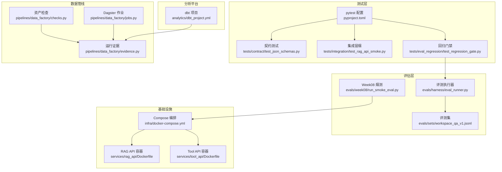
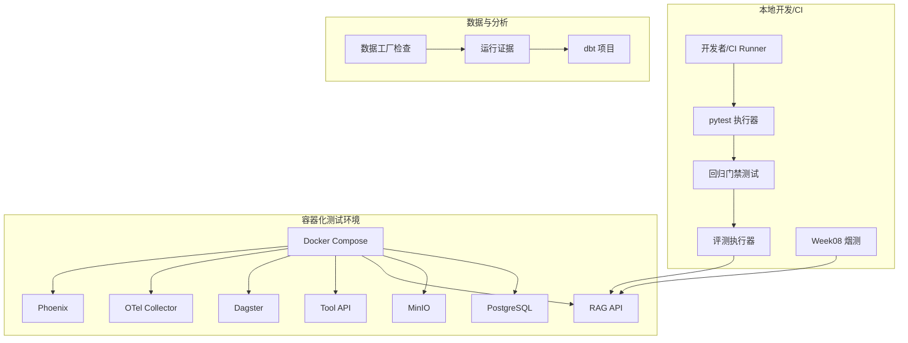
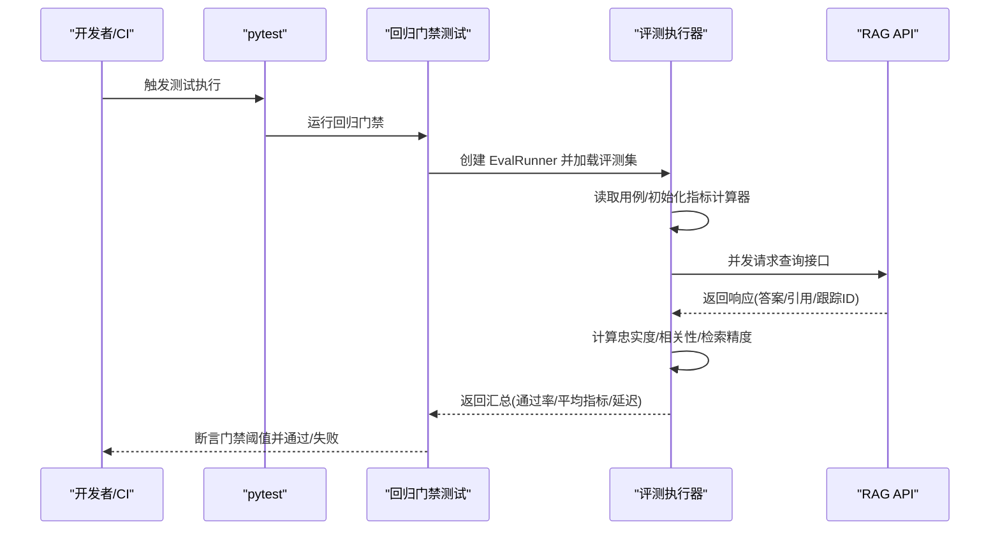
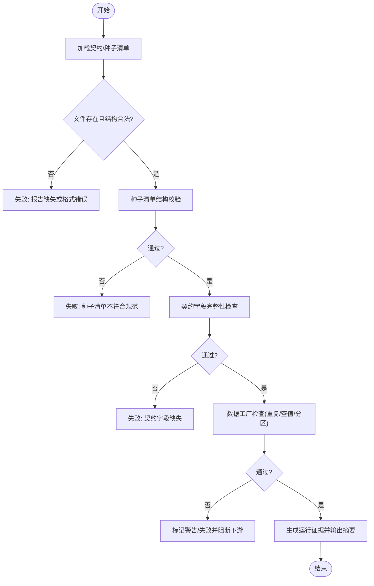
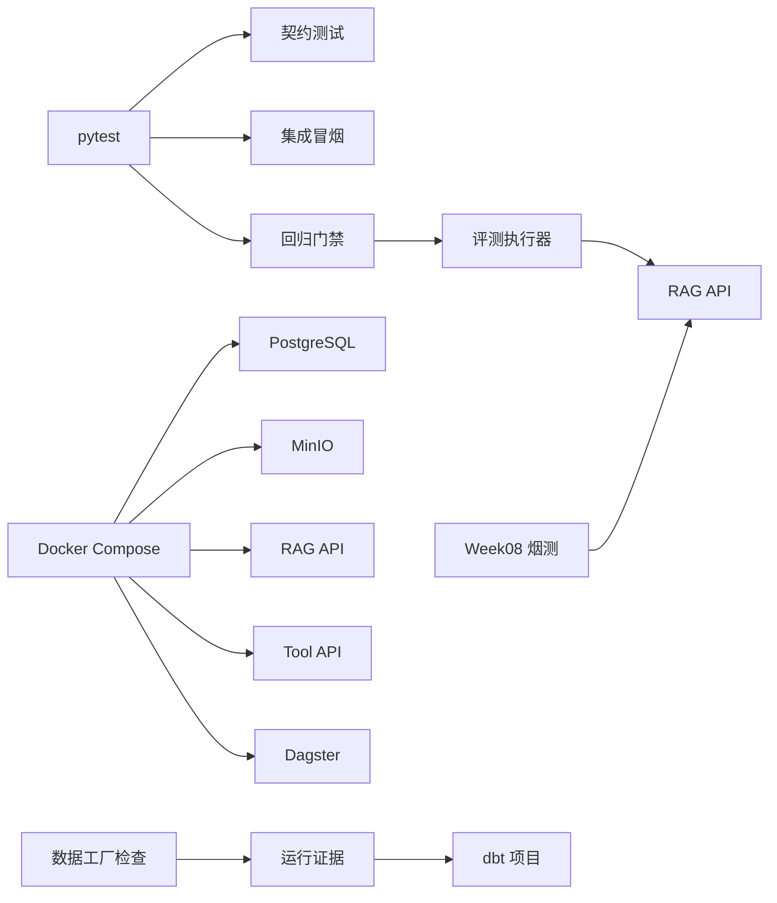

# 测试自动化与CI/CD

<cite>
**本文档引用的文件**
- [pyproject.toml](file://pyproject.toml)
- [tests/contract/test_json_schemas.py](file://tests/contract/test_json_schemas.py)
- [tests/integration/test_rag_api_smoke.py](file://tests/integration/test_rag_api_smoke.py)
- [evals/harness/eval_runner.py](file://evals/harness/eval_runner.py)
- [evals/week08/run_smoke_eval.py](file://evals/week08/run_smoke_eval.py)
- [evals/sets/workspace_qa_v1.jsonl](file://evals/sets/workspace_qa_v1.jsonl)
- [tests/eval_regression/test_regression_gate.py](file://tests/eval_regression/test_regression_gate.py)
- [infra/docker-compose.yml](file://infra/docker-compose.yml)
- [services/rag_api/Dockerfile](file://services/rag_api/Dockerfile)
- [services/tool_api/Dockerfile](file://services/tool_api/Dockerfile)
- [pipelines/data_factory/checks.py](file://pipelines/data_factory/checks.py)
- [pipelines/data_factory/evidence.py](file://pipelines/data_factory/evidence.py)
- [pipelines/data_factory/jobs.py](file://pipelines/data_factory/jobs.py)
- [analytics/dbt_project.yml](file://analytics/dbt_project.yml)
</cite>

## 目录
1. [引言](#引言)
2. [项目结构](#项目结构)
3. [核心组件](#核心组件)
4. [架构总览](#架构总览)
5. [详细组件分析](#详细组件分析)
6. [依赖关系分析](#依赖关系分析)
7. [性能考量](#性能考量)
8. [故障排查指南](#故障排查指南)
9. [结论](#结论)
10. [附录](#附录)

## 引言
本文件系统化梳理 OmniSupport Copilot 的测试自动化与 CI/CD 集成方案，覆盖测试执行流水线、并行策略、结果聚合、契约与数据校验、回归评测门禁、容器化测试环境、数据库状态管理、外部服务模拟、测试报告生成与发布、以及可扩展的测试优化策略。目标是帮助开发者与测试工程师快速理解当前测试体系、高效扩展测试范围并稳定交付。

## 项目结构
围绕测试与评估的关键目录与文件如下：
- 测试层：pytest 配置与用例，涵盖契约校验、集成冒烟、回归门禁等
- 评估层：评测执行器与周度烟测脚本，支持并发与指标汇总
- 基础设施：Docker Compose 编排 PostgreSQL、MinIO、RAG/Tool API、Dagster、OpenTelemetry Collector、Phoenix
- 数据管线：Week06 资产检查、证据生成与 Dagster 作业定义
- 分析平台：dbt 项目配置，支撑分析模型与测试路径

图表来源
- [pyproject.toml:42-49](file://pyproject.toml#L42-L49)
- [tests/contract/test_json_schemas.py:1-131](file://tests/contract/test_json_schemas.py#L1-L131)
- [tests/integration/test_rag_api_smoke.py:1-91](file://tests/integration/test_rag_api_smoke.py#L1-L91)
- [tests/eval_regression/test_regression_gate.py:1-68](file://tests/eval_regression/test_regression_gate.py#L1-L68)
- [evals/harness/eval_runner.py:1-338](file://evals/harness/eval_runner.py#L1-L338)
- [evals/week08/run_smoke_eval.py:1-192](file://evals/week08/run_smoke_eval.py#L1-L192)
- [evals/sets/workspace_qa_v1.jsonl:1-13](file://evals/sets/workspace_qa_v1.jsonl#L1-L13)
- [infra/docker-compose.yml:1-340](file://infra/docker-compose.yml#L1-L340)
- [services/rag_api/Dockerfile:1-20](file://services/rag_api/Dockerfile#L1-L20)
- [services/tool_api/Dockerfile:1-16](file://services/tool_api/Dockerfile#L1-L16)
- [pipelines/data_factory/checks.py:1-186](file://pipelines/data_factory/checks.py#L1-L186)
- [pipelines/data_factory/evidence.py:1-107](file://pipelines/data_factory/evidence.py#L1-L107)
- [pipelines/data_factory/jobs.py:1-12](file://pipelines/data_factory/jobs.py#L1-L12)
- [analytics/dbt_project.yml:1-32](file://analytics/dbt_project.yml#L1-L32)

章节来源
- [pyproject.toml:42-49](file://pyproject.toml#L42-L49)
- [infra/docker-compose.yml:1-340](file://infra/docker-compose.yml#L1-L340)

## 核心组件
- 测试执行与配置
  - pytest 配置集中于 pyproject.toml，统一扫描 tests 目录、命名规范与异步模式
  - 契约测试：校验 JSON Schema 结构、示例合法性、审计字段完整性
  - 集成冒烟：基于 TestClient 验证 RAG API 骨架与响应契约字段
  - 回归门禁：通过 EvalRunner 加载评测集，异步并发执行并断言门禁阈值
- 评估与报告
  - 评测执行器：指标计算（忠实度、相关性、检索精度）、并发控制、摘要输出与报告保存
  - Week08 烟测：简化版冒烟脚本，生成 Markdown 报告
- 基础设施与容器化
  - Docker Compose 编排 PostgreSQL、MinIO、RAG/Tool API、Dagster、OTel Collector、Phoenix
  - 服务镜像基于 slim Python，暴露端口并以 Uvicorn 运行
- 数据管线与证据
  - 资产检查：清单一致性、重复键、空值率、分区完整性等
  - 运行证据：结构化证据记录、Schema 校验、Markdown 摘要、下游决策
  - Dagster 作业：按资产图定义的作业，驱动数据工厂产出

章节来源
- [pyproject.toml:42-49](file://pyproject.toml#L42-L49)
- [tests/contract/test_json_schemas.py:1-131](file://tests/contract/test_json_schemas.py#L1-L131)
- [tests/integration/test_rag_api_smoke.py:1-91](file://tests/integration/test_rag_api_smoke.py#L1-L91)
- [tests/eval_regression/test_regression_gate.py:1-68](file://tests/eval_regression/test_regression_gate.py#L1-L68)
- [evals/harness/eval_runner.py:1-338](file://evals/harness/eval_runner.py#L1-L338)
- [evals/week08/run_smoke_eval.py:1-192](file://evals/week08/run_smoke_eval.py#L1-L192)
- [infra/docker-compose.yml:1-340](file://infra/docker-compose.yml#L1-L340)
- [services/rag_api/Dockerfile:1-20](file://services/rag_api/Dockerfile#L1-L20)
- [services/tool_api/Dockerfile:1-16](file://services/tool_api/Dockerfile#L1-L16)
- [pipelines/data_factory/checks.py:1-186](file://pipelines/data_factory/checks.py#L1-L186)
- [pipelines/data_factory/evidence.py:1-107](file://pipelines/data_factory/evidence.py#L1-L107)
- [pipelines/data_factory/jobs.py:1-12](file://pipelines/data_factory/jobs.py#L1-L12)

## 架构总览
下图展示测试自动化与评估在系统中的位置与交互：

图表来源
- [tests/eval_regression/test_regression_gate.py:1-68](file://tests/eval_regression/test_regression_gate.py#L1-L68)
- [evals/harness/eval_runner.py:1-338](file://evals/harness/eval_runner.py#L1-L338)
- [evals/week08/run_smoke_eval.py:1-192](file://evals/week08/run_smoke_eval.py#L1-L192)
- [infra/docker-compose.yml:1-340](file://infra/docker-compose.yml#L1-L340)
- [pipelines/data_factory/checks.py:1-186](file://pipelines/data_factory/checks.py#L1-L186)
- [pipelines/data_factory/evidence.py:1-107](file://pipelines/data_factory/evidence.py#L1-L107)
- [analytics/dbt_project.yml:1-32](file://analytics/dbt_project.yml#L1-L32)

## 详细组件分析

### 测试执行流水线与并行策略
- 测试发现与执行
  - pytest 通过 pyproject.toml 的 testpaths、命名规则与 asyncio_mode 统一发现与执行
  - 契约测试与集成冒烟分别位于 tests/contract 与 tests/integration，便于分层执行
- 并行策略
  - 回归门禁使用 asyncio.gather 并发执行评测用例，受信号量控制并发度
  - 评测执行器内部以信号量限制并发，避免对被测服务造成瞬时压力
- 结果聚合
  - 评测执行器汇总通过/失败/错误数量、平均指标与延迟，输出摘要并保存 JSON 报告
  - Week08 烟测生成 Markdown 报告，包含用例状态、证据计数与问题说明

图表来源
- [tests/eval_regression/test_regression_gate.py:39-67](file://tests/eval_regression/test_regression_gate.py#L39-L67)
- [evals/harness/eval_runner.py:159-284](file://evals/harness/eval_runner.py#L159-L284)

章节来源
- [pyproject.toml:42-49](file://pyproject.toml#L42-L49)
- [tests/eval_regression/test_regression_gate.py:1-68](file://tests/eval_regression/test_regression_gate.py#L1-L68)
- [evals/harness/eval_runner.py:1-338](file://evals/harness/eval_runner.py#L1-L338)

### 测试数据管理自动化
- 契约与种子数据
  - 契约测试覆盖工具与数据契约文件的存在性、结构合法性与关键字段完整性
  - 种子清单与示例数据通过 JSON Schema 校验，确保输入一致性
- 集成冒烟
  - 使用 FastAPI TestClient 直连应用，绕过真实依赖，验证健康检查、查询响应契约与请求头传播
- 数据工厂检查
  - 清单一致性、重复键、必需字段空值率、分区完整性等检查函数，支持在 CI 中作为质量门禁
- 运行证据
  - 生成结构化证据记录，进行 Schema 校验并输出 Markdown 摘要，辅助下游决策

图表来源
- [tests/contract/test_json_schemas.py:42-131](file://tests/contract/test_json_schemas.py#L42-L131)
- [pipelines/data_factory/checks.py:34-132](file://pipelines/data_factory/checks.py#L34-L132)
- [pipelines/data_factory/evidence.py:53-106](file://pipelines/data_factory/evidence.py#L53-L106)

章节来源
- [tests/contract/test_json_schemas.py:1-131](file://tests/contract/test_json_schemas.py#L1-L131)
- [pipelines/data_factory/checks.py:1-186](file://pipelines/data_factory/checks.py#L1-L186)
- [pipelines/data_factory/evidence.py:1-107](file://pipelines/data_factory/evidence.py#L1-L107)

### 测试报告生成与发布流程
- 评测报告
  - 评测执行器输出 JSON 报告，包含运行 ID、版本、用例统计、平均指标与延迟
  - Week08 烟测生成 Markdown 报告，记录用例状态、证据计数与问题
- 质量门禁
  - 回归门禁断言通过率、平均忠实度、平均延迟等阈值，未满足则失败
- 发布与归档
  - 报告保存至指定输出目录，供 CI/CD 或人工审阅；dbt 项目可用于后续分析与证据关联

章节来源
- [evals/harness/eval_runner.py:286-314](file://evals/harness/eval_runner.py#L286-L314)
- [evals/week08/run_smoke_eval.py:153-184](file://evals/week08/run_smoke_eval.py#L153-L184)
- [tests/eval_regression/test_regression_gate.py:31-56](file://tests/eval_regression/test_regression_gate.py#L31-L56)
- [analytics/dbt_project.yml:18-32](file://analytics/dbt_project.yml#L18-L32)

### 测试环境管理方法
- 容器化测试环境
  - Docker Compose 启动 PostgreSQL、MinIO、RAG/Tool API、Dagster、OTel Collector、Phoenix
  - 服务间网络隔离与健康检查，确保依赖可用后再启动上层服务
- 数据库状态管理
  - 通过 migrations 目录初始化数据库结构；容器卷持久化数据
- 外部服务模拟
  - 在本地或 CI 中通过 TestClient 直连服务，避免真实外部依赖
  - Week08 烟测通过占位模块模拟缺失依赖，保证最小可运行环境

章节来源
- [infra/docker-compose.yml:1-340](file://infra/docker-compose.yml#L1-L340)
- [services/rag_api/Dockerfile:1-20](file://services/rag_api/Dockerfile#L1-L20)
- [services/tool_api/Dockerfile:1-16](file://services/tool_api/Dockerfile#L1-L16)
- [evals/week08/run_smoke_eval.py:73-96](file://evals/week08/run_smoke_eval.py#L73-L96)

### 测试优化策略
- 选择性执行
  - 通过 pytest 标记与参数化，按功能域/级别筛选测试，缩短反馈周期
- 并行化优化
  - 评测执行器使用信号量控制并发，避免资源争用；根据服务容量调整并发度
- 缓存与复用
  - Docker Compose 缓存镜像与卷，减少重复构建成本；测试报告可复用以支持回归对比
- 可观测性
  - OTel Collector 与 Phoenix 提供统一可观测，便于定位性能瓶颈与异常

章节来源
- [evals/harness/eval_runner.py:239-254](file://evals/harness/eval_runner.py#L239-L254)
- [infra/docker-compose.yml:228-262](file://infra/docker-compose.yml#L228-L262)

### 扩展测试自动化范围
- 新增测试工具
  - 在 pyproject.toml 中扩展依赖与 lint 规则，保持一致的开发体验
  - 将新测试用例纳入 tests 目录并遵循现有命名与组织方式
- 集成新的评估集
  - 在 evals/sets 下新增 JSONL 评测集，回归门禁测试自动加载
  - 更新门禁阈值以适配新场景
- 优化测试执行效率
  - 利用并行策略与缓存机制；结合 Dagster 作业实现数据准备与清理的自动化

章节来源
- [pyproject.toml:17-31](file://pyproject.toml#L17-L31)
- [evals/sets/workspace_qa_v1.jsonl:1-13](file://evals/sets/workspace_qa_v1.jsonl#L1-L13)
- [tests/eval_regression/test_regression_gate.py:31-36](file://tests/eval_regression/test_regression_gate.py#L31-L36)

## 依赖关系分析
- 测试与评估
  - 回归门禁依赖评测执行器与评测集；评测执行器依赖 HTTP 客户端与指标计算
- 基础设施
  - RAG/Tool API 依赖 PostgreSQL 与 MinIO；Dagster 依赖数据库与对象存储
- 数据管线
  - 资产检查与运行证据相互协作，dbt 项目用于分析与验证

图表来源
- [tests/eval_regression/test_regression_gate.py:1-68](file://tests/eval_regression/test_regression_gate.py#L1-L68)
- [evals/harness/eval_runner.py:1-338](file://evals/harness/eval_runner.py#L1-L338)
- [evals/week08/run_smoke_eval.py:1-192](file://evals/week08/run_smoke_eval.py#L1-L192)
- [infra/docker-compose.yml:1-340](file://infra/docker-compose.yml#L1-L340)
- [pipelines/data_factory/checks.py:1-186](file://pipelines/data_factory/checks.py#L1-L186)
- [pipelines/data_factory/evidence.py:1-107](file://pipelines/data_factory/evidence.py#L1-L107)
- [analytics/dbt_project.yml:1-32](file://analytics/dbt_project.yml#L1-L32)

章节来源
- [pyproject.toml:42-49](file://pyproject.toml#L42-L49)
- [infra/docker-compose.yml:1-340](file://infra/docker-compose.yml#L1-L340)

## 性能考量
- 并发与吞吐
  - 评测执行器通过信号量控制并发，建议根据服务 CPU/内存与网络带宽调优
- 延迟与稳定性
  - 回归门禁包含平均延迟上限，避免性能退化引入生产风险
- 资源占用
  - Docker Compose 启动多服务时注意资源分配，必要时拆分任务或使用独立 CI 作业

## 故障排查指南
- 健康检查失败
  - 确认 PostgreSQL 与 MinIO 健康检查通过；检查环境变量与端口映射
- 评测失败
  - 查看评测执行器输出的摘要与报告；核对门禁阈值与服务响应
- 契约校验失败
  - 检查契约文件是否存在、JSON 结构是否符合 Schema；核对示例数据字段
- 数据工厂检查失败
  - 关注重复键、空值率与分区完整性；修正种子数据或清单配置

章节来源
- [infra/docker-compose.yml:32-121](file://infra/docker-compose.yml#L32-L121)
- [tests/eval_regression/test_regression_gate.py:40-67](file://tests/eval_regression/test_regression_gate.py#L40-L67)
- [tests/contract/test_json_schemas.py:42-131](file://tests/contract/test_json_schemas.py#L42-L131)
- [pipelines/data_factory/checks.py:34-132](file://pipelines/data_factory/checks.py#L34-L132)

## 结论
本测试自动化体系以 pytest 为核心，结合契约校验、集成冒烟与回归门禁，配合容器化基础设施与数据工厂检查，形成从单元到端到端的测试闭环。通过并发执行、报告聚合与质量门禁，保障交付质量与效率。建议在 CI 中按需拆分作业、引入缓存与并行矩阵，持续扩展评估集与检查维度，进一步提升自动化覆盖率与稳定性。

## 附录
- 常用命令与环境变量
  - pytest 执行：参考 pyproject.toml 的 testpaths 与命名规则
  - 回归门禁：设置 RAG_API_URL 与 RELEASE_ID 后运行回归门禁测试
  - Compose 启动：使用 infra/docker-compose.yml 并提供环境变量文件

章节来源
- [pyproject.toml:42-49](file://pyproject.toml#L42-L49)
- [tests/eval_regression/test_regression_gate.py:19-26](file://tests/eval_regression/test_regression_gate.py#L19-L26)
- [infra/docker-compose.yml:1-340](file://infra/docker-compose.yml#L1-L340)