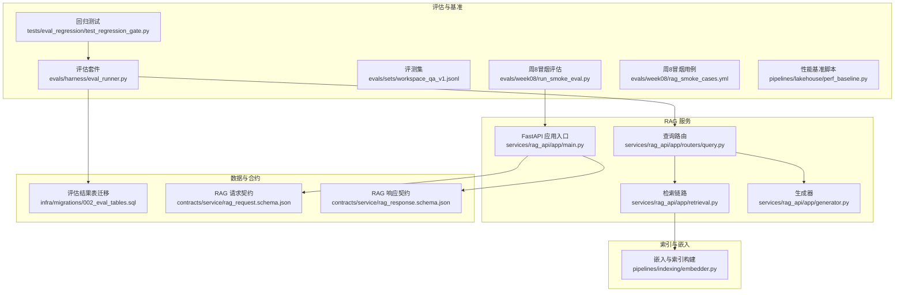
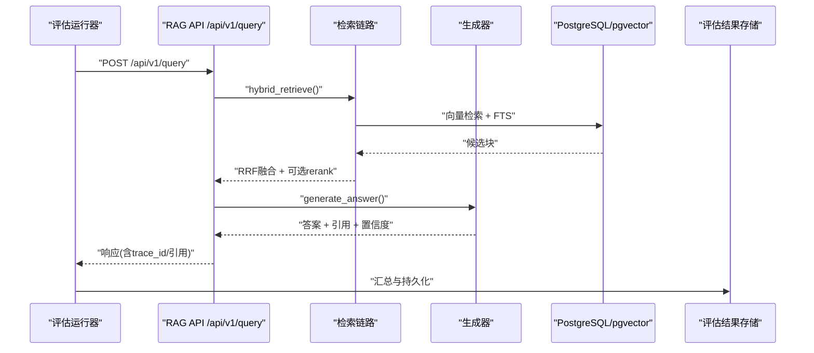
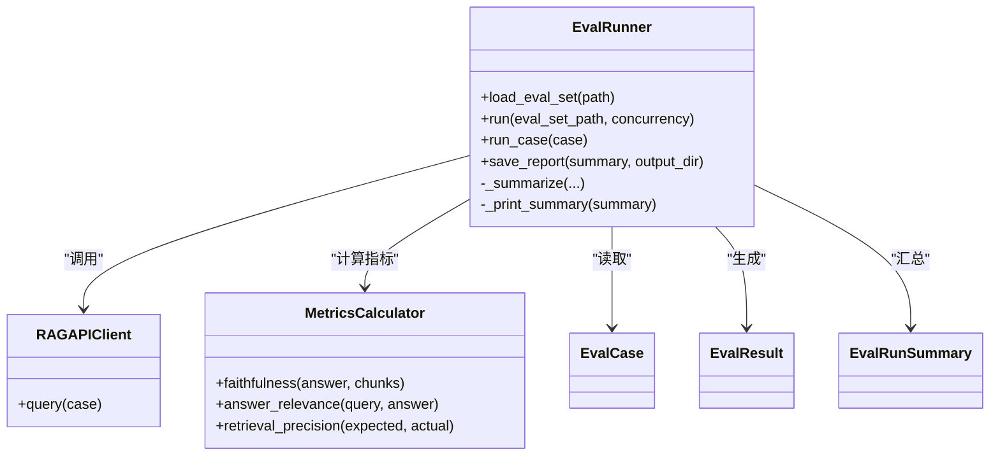
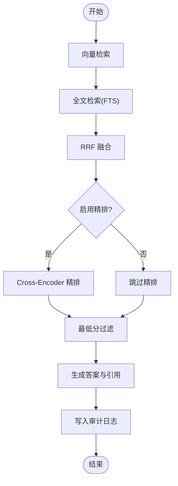
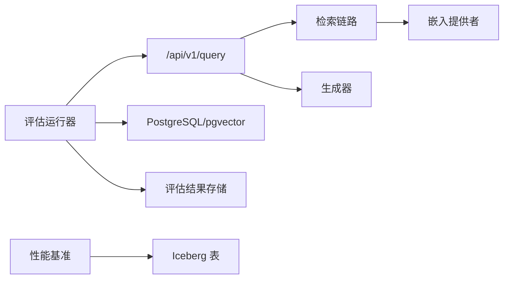

# 评估与基准测试

<cite>
**本文档引用的文件**
- [eval_runner.py](file://evals/harness/eval_runner.py)
- [workspace_qa_v1.jsonl](file://evals/sets/workspace_qa_v1.jsonl)
- [run_smoke_eval.py](file://evals/week08/run_smoke_eval.py)
- [rag_smoke_cases.yml](file://evals/week08/rag_smoke_cases.yml)
- [test_regression_gate.py](file://tests/eval_regression/test_regression_gate.py)
- [perf_baseline.py](file://pipelines/lakehouse/perf_baseline.py)
- [smoke_eval_report.md](file://reports/week08/smoke_eval_report.md)
- [rag_api_smoke_report.md](file://reports/week08/rag_api_smoke_report.md)
- [rag_response.schema.json](file://contracts/service/rag_response.schema.json)
- [rag_request.schema.json](file://contracts/service/rag_request.schema.json)
- [002_eval_tables.sql](file://infra/migrations/002_eval_tables.sql)
- [main.py](file://services/rag_api/app/main.py)
- [retrieval.py](file://services/rag_api/app/retrieval.py)
- [query.py](file://services/rag_api/app/routers/query.py)
- [generator.py](file://services/rag_api/app/generator.py)
- [embedder.py](file://pipelines/indexing/embedder.py)
</cite>

## 目录
1. [简介](#简介)
2. [项目结构](#项目结构)
3. [核心组件](#核心组件)
4. [架构总览](#架构总览)
5. [组件详解](#组件详解)
6. [依赖关系分析](#依赖关系分析)
7. [性能考量](#性能考量)
8. [故障排查指南](#故障排查指南)
9. [结论](#结论)
10. [附录](#附录)

## 简介
本文件系统化梳理 OmniSupport Copilot 的评估与基准测试体系，覆盖评估套件设计、评测集管理、指标计算、RAG 评估方法（问答准确性、检索质量、答案相关性）、性能基准（响应时间、吞吐量、资源使用）、回归测试策略（结果对比、趋势分析、异常检测）、评估数据管理（用例设计、标注、标准制定）、报告生成与可视化、性能优化建议，以及扩展评估范围与效率优化的方法论。

## 项目结构
评估与基准测试相关模块分布于以下目录：
- 评估执行与套件：evals/harness、evals/sets、evals/week08
- 回归测试：tests/eval_regression
- 性能基准：pipelines/lakehouse/perf_baseline.py
- 报告输出：reports/week08
- 合约与请求/响应模式：contracts/service
- RAG 服务与检索链路：services/rag_api
- 索引与嵌入：pipelines/indexing

**图表来源**
- [eval_runner.py:1-338](file://evals/harness/eval_runner.py#L1-L338)
- [workspace_qa_v1.jsonl:1-13](file://evals/sets/workspace_qa_v1.jsonl#L1-L13)
- [run_smoke_eval.py:1-192](file://evals/week08/run_smoke_eval.py#L1-L192)
- [rag_smoke_cases.yml:1-36](file://evals/week08/rag_smoke_cases.yml#L1-L36)
- [test_regression_gate.py:1-68](file://tests/eval_regression/test_regression_gate.py#L1-L68)
- [perf_baseline.py:1-126](file://pipelines/lakehouse/perf_baseline.py#L1-L126)
- [main.py:1-73](file://services/rag_api/app/main.py#L1-L73)
- [retrieval.py:1-445](file://services/rag_api/app/retrieval.py#L1-L445)
- [query.py:1-159](file://services/rag_api/app/routers/query.py#L1-L159)
- [generator.py:1-222](file://services/rag_api/app/generator.py#L1-L222)
- [embedder.py:1-429](file://pipelines/indexing/embedder.py#L1-L429)
- [002_eval_tables.sql:1-44](file://infra/migrations/002_eval_tables.sql#L1-L44)
- [rag_request.schema.json:1-23](file://contracts/service/rag_request.schema.json#L1-L23)
- [rag_response.schema.json:1-58](file://contracts/service/rag_response.schema.json#L1-L58)

**章节来源**
- [eval_runner.py:1-338](file://evals/harness/eval_runner.py#L1-L338)
- [workspace_qa_v1.jsonl:1-13](file://evals/sets/workspace_qa_v1.jsonl#L1-L13)
- [run_smoke_eval.py:1-192](file://evals/week08/run_smoke_eval.py#L1-L192)
- [rag_smoke_cases.yml:1-36](file://evals/week08/rag_smoke_cases.yml#L1-L36)
- [test_regression_gate.py:1-68](file://tests/eval_regression/test_regression_gate.py#L1-L68)
- [perf_baseline.py:1-126](file://pipelines/lakehouse/perf_baseline.py#L1-L126)
- [main.py:1-73](file://services/rag_api/app/main.py#L1-L73)
- [retrieval.py:1-445](file://services/rag_api/app/retrieval.py#L1-L445)
- [query.py:1-159](file://services/rag_api/app/routers/query.py#L1-L159)
- [generator.py:1-222](file://services/rag_api/app/generator.py#L1-L222)
- [embedder.py:1-429](file://pipelines/indexing/embedder.py#L1-L429)
- [002_eval_tables.sql:1-44](file://infra/migrations/002_eval_tables.sql#L1-L44)
- [rag_request.schema.json:1-23](file://contracts/service/rag_request.schema.json#L1-L23)
- [rag_response.schema.json:1-58](file://contracts/service/rag_response.schema.json#L1-L58)

## 核心组件
- 评估运行器：加载评测集、并发调用 RAG API、计算指标、生成汇总与报告。
- 指标计算器：基于规则的 Faithfulness、Answer Relevance、Retrieval Precision@K。
- RAG API 客户端：封装 /api/v1/query 请求，异步调用与超时控制。
- 评测集管理：JSONL 用例定义，包含 case_id、query、期望答案/引用、产品线、最小阈值与标签。
- 回归测试：PyTest 集成，前置健康检查与门禁阈值断言。
- 性能基准：Iceberg 表健康快照与统计，用于湖仓性能基线。
- 报告与契约：Markdown 报告与 JSON Schema 契约，保障响应一致性。
- 检索链路：向量检索 + FTS + RRF 融合 + Cross-Encoder 精排。
- 生成器：系统提示构建、Claude 调用、引用解析与置信度估计。

**章节来源**
- [eval_runner.py:93-133](file://evals/harness/eval_runner.py#L93-L133)
- [eval_runner.py:137-155](file://evals/harness/eval_runner.py#L137-L155)
- [eval_runner.py:159-254](file://evals/harness/eval_runner.py#L159-L254)
- [workspace_qa_v1.jsonl:1-13](file://evals/sets/workspace_qa_v1.jsonl#L1-L13)
- [test_regression_gate.py:31-56](file://tests/eval_regression/test_regression_gate.py#L31-L56)
- [perf_baseline.py:13-73](file://pipelines/lakehouse/perf_baseline.py#L13-L73)
- [retrieval.py:386-444](file://services/rag_api/app/retrieval.py#L386-L444)
- [generator.py:65-118](file://services/rag_api/app/generator.py#L65-L118)

## 架构总览
评估与基准测试系统围绕“评估运行器—RAG API—数据库/索引—报告存储”展开，形成闭环：运行器并发驱动 API，API 执行检索与生成，评估运行器收集指标并落库/落盘，回归测试在 CI 中验证门禁，性能基准定期产出湖仓健康快照。

**图表来源**
- [eval_runner.py:185-237](file://evals/harness/eval_runner.py#L185-L237)
- [query.py:52-93](file://services/rag_api/app/routers/query.py#L52-L93)
- [retrieval.py:386-444](file://services/rag_api/app/retrieval.py#L386-L444)
- [generator.py:65-118](file://services/rag_api/app/generator.py#L65-L118)
- [002_eval_tables.sql:4-44](file://infra/migrations/002_eval_tables.sql#L4-L44)

## 组件详解

### 评估运行器与指标计算
- 数据结构：EvalCase、EvalResult、EvalRunSummary，统一承载用例、结果与汇总。
- 指标计算：
  - Faithfulness：简化版基于答案与检索块词重叠比例。
  - Answer Relevance：基于问题与答案词重叠比例。
  - Retrieval Precision@K：实际引用中有多少命中期望引用集合。
- 并发执行：信号量控制并发度，gather 并行收集结果。
- 门禁与阈值：回归通过率、平均指标与延迟上限，CI 中断失败。
- 报告落盘：保存 JSON 报告，打印终端摘要。

**图表来源**
- [eval_runner.py:37-90](file://evals/harness/eval_runner.py#L37-L90)
- [eval_runner.py:93-133](file://evals/harness/eval_runner.py#L93-L133)
- [eval_runner.py:137-155](file://evals/harness/eval_runner.py#L137-L155)
- [eval_runner.py:159-254](file://evals/harness/eval_runner.py#L159-L254)

**章节来源**
- [eval_runner.py:37-90](file://evals/harness/eval_runner.py#L37-L90)
- [eval_runner.py:93-133](file://evals/harness/eval_runner.py#L93-L133)
- [eval_runner.py:159-254](file://evals/harness/eval_runner.py#L159-L254)
- [eval_runner.py:256-313](file://evals/harness/eval_runner.py#L256-L313)

### 评测集管理
- JSONL 格式：每行一个用例，包含 case_id、query、可选 expected_answer、expected_citations、product_line、min_expected_score、tags。
- 用例设计要点：覆盖不同产品线、难度梯度、标签分类；最小阈值用于门禁判定。
- 加载流程：逐行解析为 EvalCase 列表，支持并发运行。

**章节来源**
- [workspace_qa_v1.jsonl:1-13](file://evals/sets/workspace_qa_v1.jsonl#L1-L13)
- [eval_runner.py:165-183](file://evals/harness/eval_runner.py#L165-L183)

### RAG API 与检索链路
- 路由与中间件：全局异常处理、请求ID注入、CORS、OpenTelemetry。
- 检索链路：向量检索（pgvector）、FTS（PostgreSQL）、RRF 融合、可选 Cross-Encoder 精排、最低分过滤。
- 生成器：系统提示、上下文拼装、Claude 调用、引用解析、置信度估计。
- 审计日志：记录检索命中情况与 release_id、trace_id，非阻塞写入。

**图表来源**
- [retrieval.py:386-444](file://services/rag_api/app/retrieval.py#L386-L444)
- [query.py:52-93](file://services/rag_api/app/routers/query.py#L52-L93)
- [generator.py:65-118](file://services/rag_api/app/generator.py#L65-L118)

**章节来源**
- [main.py:1-73](file://services/rag_api/app/main.py#L1-L73)
- [retrieval.py:132-444](file://services/rag_api/app/retrieval.py#L132-L444)
- [query.py:39-93](file://services/rag_api/app/routers/query.py#L39-L93)
- [generator.py:65-118](file://services/rag_api/app/generator.py#L65-L118)

### 周8冒烟评估与报告
- 冒烟评估：不依赖 LLM-as-judge，验证响应契约字段完整性、证据数量、结构化拒答路径。
- 报告：Markdown 格式，记录用例状态、证据数量、拒答原因与问题清单。
- 契约：RAG 请求/响应 JSON Schema，约束字段与类型。

**章节来源**
- [run_smoke_eval.py:1-192](file://evals/week08/run_smoke_eval.py#L1-L192)
- [rag_smoke_cases.yml:1-36](file://evals/week08/rag_smoke_cases.yml#L1-L36)
- [rag_api_smoke_report.md:1-25](file://reports/week08/rag_api_smoke_report.md#L1-L25)
- [smoke_eval_report.md:1-23](file://reports/week08/smoke_eval_report.md#L1-L23)
- [rag_request.schema.json:1-23](file://contracts/service/rag_request.schema.json#L1-L23)
- [rag_response.schema.json:1-58](file://contracts/service/rag_response.schema.json#L1-L58)

### 回归测试策略
- 健康检查：先访问 /health，确保服务可用。
- 门禁阈值：通过率、平均指标、平均延迟上限，CI 中断失败。
- 环境变量：RAG_API_URL、RELEASE_ID 控制目标与标识。

**章节来源**
- [test_regression_gate.py:39-67](file://tests/eval_regression/test_regression_gate.py#L39-L67)

### 性能基准测试
- Iceberg 表健康快照：统计行数、快照数、文件数、平均/最小/最大文件大小、最新快照信息。
- 报告输出：Markdown 与 JSON，标注已知限制与后续步骤。
- 基线用途：为转换与编排阶段提供 before/after 对比依据。

**章节来源**
- [perf_baseline.py:13-73](file://pipelines/lakehouse/perf_baseline.py#L13-L73)
- [perf_baseline.py:76-105](file://pipelines/lakehouse/perf_baseline.py#L76-L105)

### 评估数据管理
- 用例设计：按产品线、难度、标签分层，最小阈值用于门禁。
- 数据标注：期望引用集合用于 Precision@K；可选黄金答案用于相关性评估。
- 评估标准：门禁阈值随周次调整（Week01 宽松，Week11 收紧）。

**章节来源**
- [workspace_qa_v1.jsonl:1-13](file://evals/sets/workspace_qa_v1.jsonl#L1-L13)
- [test_regression_gate.py:31-36](file://tests/eval_regression/test_regression_gate.py#L31-L36)

### 评估报告生成与可视化
- 评估运行器：终端摘要打印，JSON 报告落盘。
- 冒烟报告：Markdown 表格与注释，便于快速审阅。
- 契约校验：Schema 约束保证响应一致性，减少集成风险。

**章节来源**
- [eval_runner.py:286-313](file://evals/harness/eval_runner.py#L286-L313)
- [smoke_eval_report.md:1-23](file://reports/week08/smoke_eval_report.md#L1-L23)
- [rag_response.schema.json:1-58](file://contracts/service/rag_response.schema.json#L1-L58)

## 依赖关系分析
- 评估运行器依赖 RAG API 路由与检索链路，指标计算独立于 LLM。
- 回归测试依赖评估运行器与 RAG API 健康状态。
- 性能基准依赖湖仓 Catalog 与 Iceberg 表元数据。
- RAG API 依赖嵌入提供者与 pgvector 索引，检索链路依赖数据库连接池。

**图表来源**
- [eval_runner.py:185-237](file://evals/harness/eval_runner.py#L185-L237)
- [query.py:52-93](file://services/rag_api/app/routers/query.py#L52-L93)
- [retrieval.py:386-444](file://services/rag_api/app/retrieval.py#L386-L444)
- [generator.py:65-118](file://services/rag_api/app/generator.py#L65-L118)
- [embedder.py:36-140](file://pipelines/indexing/embedder.py#L36-L140)
- [perf_baseline.py:13-30](file://pipelines/lakehouse/perf_baseline.py#L13-L30)

**章节来源**
- [eval_runner.py:185-237](file://evals/harness/eval_runner.py#L185-L237)
- [query.py:52-93](file://services/rag_api/app/routers/query.py#L52-L93)
- [retrieval.py:386-444](file://services/rag_api/app/retrieval.py#L386-L444)
- [generator.py:65-118](file://services/rag_api/app/generator.py#L65-L118)
- [embedder.py:36-140](file://pipelines/indexing/embedder.py#L36-L140)
- [perf_baseline.py:13-30](file://pipelines/lakehouse/perf_baseline.py#L13-L30)

## 性能考量
- 响应时间基准：评估运行器统计平均延迟，回归测试设定上限。
- 吞吐量基准：通过并发参数与 gather 并行提升吞吐，注意数据库连接池与检索链路瓶颈。
- 资源使用基准：Iceberg 表文件大小与快照变化反映存储与扫描开销；向量索引 lists 参数与重建策略影响检索性能。
- 检索链路优化：合理设置 top_k、RRF 融合参数、精排开关与最低分阈值；嵌入维度与索引类型需与硬件匹配。

**章节来源**
- [eval_runner.py:185-237](file://evals/harness/eval_runner.py#L185-L237)
- [test_regression_gate.py:35-36](file://tests/eval_regression/test_regression_gate.py#L35-L36)
- [perf_baseline.py:13-30](file://pipelines/lakehouse/perf_baseline.py#L13-L30)
- [retrieval.py:386-444](file://services/rag_api/app/retrieval.py#L386-L444)
- [embedder.py:374-396](file://pipelines/indexing/embedder.py#L374-L396)

## 故障排查指南
- 评估运行失败：检查 RAG API 地址、健康状态；查看错误用例的错误字段与延迟。
- 回归测试失败：核对门禁阈值是否随周次调整；确认 RELEASE_ID 与评估集路径。
- 冒烟评估失败：关注证据数量、拒答原因与缺失字段；确认索引与数据释放版本。
- 性能异常：检查 Iceberg 表文件大小分布与快照增长；评估索引重建与批处理参数。

**章节来源**
- [eval_runner.py:224-237](file://evals/harness/eval_runner.py#L224-L237)
- [test_regression_gate.py:39-67](file://tests/eval_regression/test_regression_gate.py#L39-L67)
- [run_smoke_eval.py:98-114](file://evals/week08/run_smoke_eval.py#L98-L114)
- [perf_baseline.py:13-30](file://pipelines/lakehouse/perf_baseline.py#L13-L30)

## 结论
该评估与基准测试体系以评估运行器为核心，结合 RAG API 的检索与生成链路，形成可重复、可观测、可回归的自动化评估闭环。通过 JSONL 评测集、规则化指标、门禁阈值与性能基准，系统能够稳定地衡量问答准确性、检索质量与响应性能，并为后续优化提供数据支撑。

## 附录

### 评估扩展与效率优化建议
- 扩展评估维度：引入 LLM-as-judge 的 Faithfulness/Relevance 评分，增加可选黄金答案的语义相似度。
- 新增评估维度：加入检索深度（命中前 N）、答案一致性（与历史答案对比）、多轮对话连贯性。
- 优化评估效率：动态并发、结果缓存、增量评估（仅对失败用例重跑）、分布式执行。
- 指标与报告：引入可视化看板（趋势图、热力图），自动对比历史基线并生成改进建议。